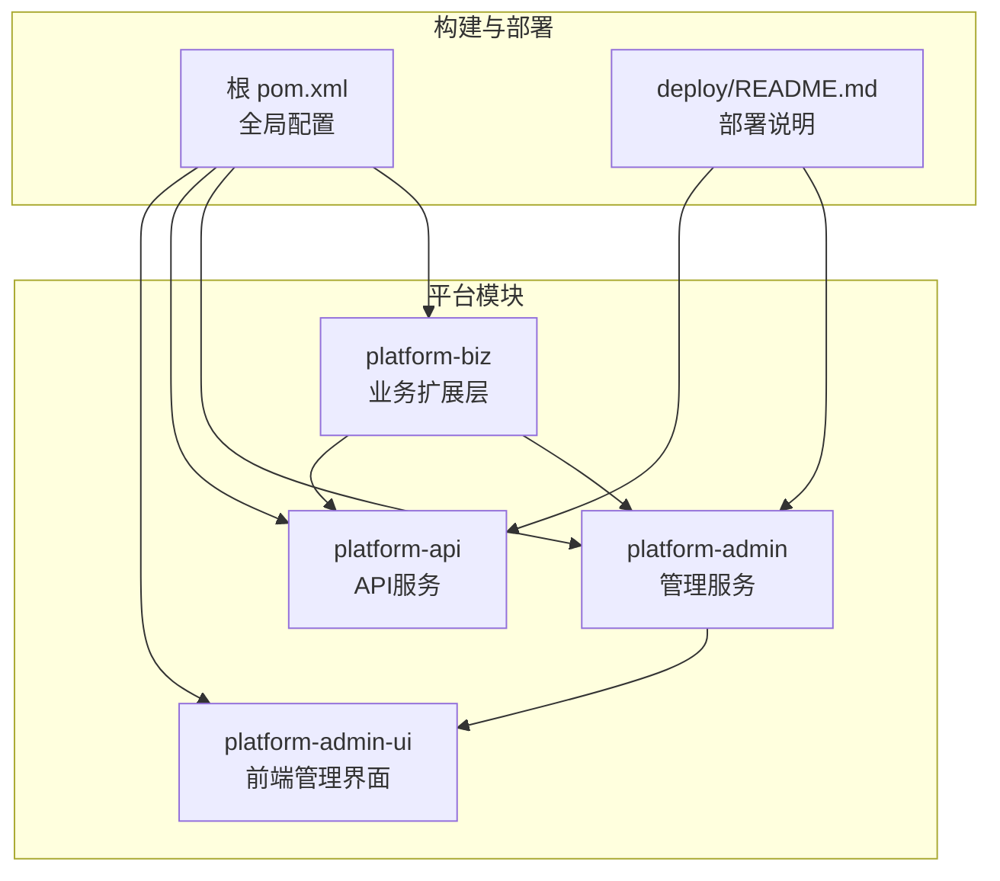
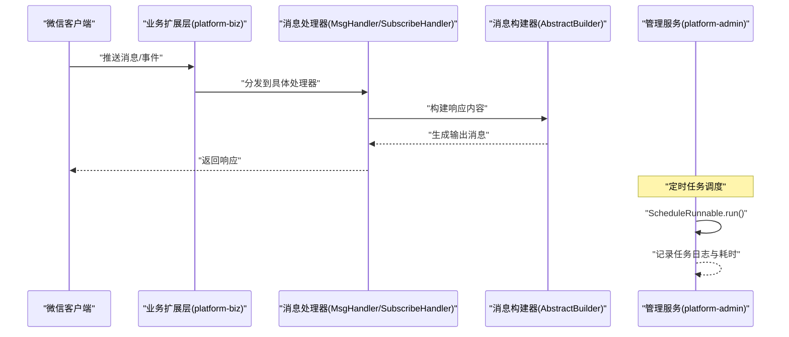
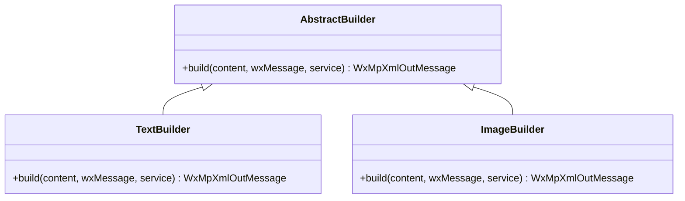
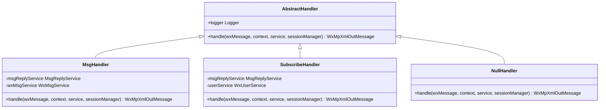
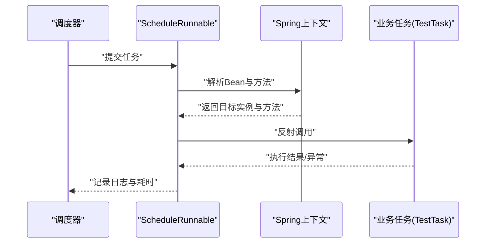
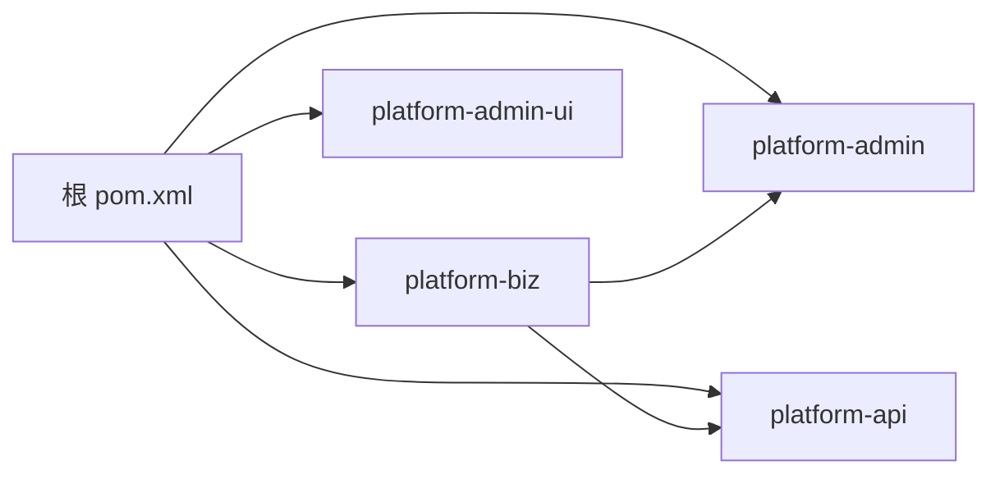

# 插件开发模式

<cite>
**本文引用的文件**
- [AbstractBuilder.java](file://platform-biz/src/main/java/com/platform/builder/AbstractBuilder.java)
- [AbstractHandler.java](file://platform-biz/src/main/java/com/platform/handler/AbstractHandler.java)
- [MsgHandler.java](file://platform-biz/src/main/java/com/platform/handler/MsgHandler.java)
- [SubscribeHandler.java](file://platform-biz/src/main/java/com/platform/handler/SubscribeHandler.java)
- [NullHandler.java](file://platform-biz/src/main/java/com/platform/handler/NullHandler.java)
- [TestTask.java](file://platform-admin/src/main/java/com/platform/modules/job/task/TestTask.java)
- [ScheduleRunnable.java](file://platform-admin/src/main/java/com/platform/modules/job/utils/ScheduleRunnable.java)
- [ScheduleJobLogEntity.java](file://platform-admin/src/main/java/com/platform/modules/job/entity/ScheduleJobLogEntity.java)
- [pom.xml](file://pom.xml)
- [platform-admin/pom.xml](file://platform-admin/pom.xml)
- [deploy/README.md](file://deploy/README.md)
- [README.md](file://README.md)
- [Agents.md](file://Agents.md)
</cite>

## 目录
1. [引言](#引言)
2. [项目结构](#项目结构)
3. [核心组件](#核心组件)
4. [架构总览](#架构总览)
5. [组件详解](#组件详解)
6. [依赖关系分析](#依赖关系分析)
7. [性能考量](#性能考量)
8. [故障排查指南](#故障排查指南)
9. [结论](#结论)
10. [附录](#附录)

## 引言
本技术文档面向平台插件开发者，系统性阐述平台的插件架构设计与开发方法。重点覆盖以下方面：
- 插件加载机制与生命周期管理
- 依赖注入与Spring容器集成
- 插件接口设计原则（SPI规范、接口定义与实现约定）
- 插件开发框架（AbstractBuilder抽象基类、Handler处理器模式、TaskExecutor任务执行器）
- 插件配置管理（配置文件格式、参数传递、动态配置更新）
- 插件打包与部署（Maven插件配置、依赖管理、版本控制）
- 插件间通信机制（事件发布订阅、消息传递、状态共享）
- 插件安全机制（权限控制、沙箱隔离、资源限制）
- 最佳实践（代码组织、测试策略、性能优化）
- 调试方法、故障排查与监控方案

## 项目结构
平台采用多模块Maven工程组织，核心模块与插件相关的关键目录如下：
- platform-biz：业务能力与插件扩展层，包含Builder与Handler两类插件扩展点
- platform-admin：后端管理服务，包含定时任务调度与日志记录
- platform-api：对外API服务
- platform-admin-ui：前端管理界面
- deploy：Docker部署说明与产物输出位置
- 根pom.xml：全局仓库与插件配置

图表来源
- [pom.xml](file://pom.xml)
- [deploy/README.md](file://deploy/README.md)

章节来源
- [pom.xml](file://pom.xml)
- [deploy/README.md](file://deploy/README.md)

## 核心组件
本节聚焦插件开发框架中的三类核心构件：Builder抽象基类、Handler处理器模式、TaskExecutor任务执行器。

- Builder抽象基类
  - 作用：封装消息/内容构建流程，屏蔽具体实现细节，便于扩展不同类型的输出（如文本、图片等）
  - 关键点：定义统一的build方法签名，接收原始内容、微信消息对象与服务实例
  - 适用场景：消息自动回复、模板化输出生成

- Handler处理器模式
  - 作用：基于微信公众号消息处理的SPI扩展点，统一处理不同事件（关注、消息、扫描等）
  - 关键点：继承抽象基类，实现handle方法；通过Spring容器注册为组件
  - 适用场景：事件驱动的消息处理链路

- TaskExecutor任务执行器
  - 作用：封装定时任务的执行逻辑，支持反射调用与日志记录
  - 关键点：Runnable实现，结合Spring上下文解析目标Bean与方法，记录任务执行状态与耗时

章节来源
- [AbstractBuilder.java](file://platform-biz/src/main/java/com/platform/builder/AbstractBuilder.java)
- [AbstractHandler.java](file://platform-biz/src/main/java/com/platform/handler/AbstractHandler.java)
- [MsgHandler.java](file://platform-biz/src/main/java/com/platform/handler/MsgHandler.java)
- [SubscribeHandler.java](file://platform-biz/src/main/java/com/platform/handler/SubscribeHandler.java)
- [NullHandler.java](file://platform-biz/src/main/java/com/platform/handler/NullHandler.java)
- [TestTask.java](file://platform-admin/src/main/java/com/platform/modules/job/task/TestTask.java)
- [ScheduleRunnable.java](file://platform-admin/src/main/java/com/platform/modules/job/utils/ScheduleRunnable.java)

## 架构总览
平台插件架构以“消息/事件处理”和“定时任务”两条主线展开，配合Spring容器进行依赖注入与生命周期管理。下图展示典型的消息处理与任务执行流程：

图表来源
- [MsgHandler.java](file://platform-biz/src/main/java/com/platform/handler/MsgHandler.java)
- [SubscribeHandler.java](file://platform-biz/src/main/java/com/platform/handler/SubscribeHandler.java)
- [AbstractBuilder.java](file://platform-biz/src/main/java/com/platform/builder/AbstractBuilder.java)
- [ScheduleRunnable.java](file://platform-admin/src/main/java/com/platform/modules/job/utils/ScheduleRunnable.java)

## 组件详解

### Builder抽象基类与消息构建
- 设计要点
  - 抽象出统一的build方法，屏蔽不同输出类型的差异
  - 通过日志门面记录处理过程，便于审计与排障
- 扩展建议
  - 新增输出类型时，新增子类并实现build方法
  - 在Handler中组合使用，确保构建过程可测试、可替换

图表来源
- [AbstractBuilder.java](file://platform-biz/src/main/java/com/platform/builder/AbstractBuilder.java)

章节来源
- [AbstractBuilder.java](file://platform-biz/src/main/java/com/platform/builder/AbstractBuilder.java)

### Handler处理器模式
- 设计要点
  - 统一实现微信消息处理接口，通过注解注册为Spring组件
  - 事件分发：关注、消息、扫描、取消关注等
  - 依赖注入：通过构造器注入服务，降低耦合
- 扩展建议
  - 新增事件类型时，新增处理器并实现handle方法
  - 将通用逻辑抽取到工具类或基类，避免重复

图表来源
- [AbstractHandler.java](file://platform-biz/src/main/java/com/platform/handler/AbstractHandler.java)
- [MsgHandler.java](file://platform-biz/src/main/java/com/platform/handler/MsgHandler.java)
- [SubscribeHandler.java](file://platform-biz/src/main/java/com/platform/handler/SubscribeHandler.java)
- [NullHandler.java](file://platform-biz/src/main/java/com/platform/handler/NullHandler.java)

章节来源
- [AbstractHandler.java](file://platform-biz/src/main/java/com/platform/handler/AbstractHandler.java)
- [MsgHandler.java](file://platform-biz/src/main/java/com/platform/handler/MsgHandler.java)
- [SubscribeHandler.java](file://platform-biz/src/main/java/com/platform/handler/SubscribeHandler.java)
- [NullHandler.java](file://platform-biz/src/main/java/com/platform/handler/NullHandler.java)

### TaskExecutor任务执行器
- 设计要点
  - 通过反射定位Spring Bean与方法，执行定时任务
  - 记录任务执行状态、异常信息与耗时，便于监控与回溯
- 扩展建议
  - 任务Bean命名遵循约定，便于调度器识别
  - 任务方法保持幂等与轻量，避免长耗时阻塞

图表来源
- [ScheduleRunnable.java](file://platform-admin/src/main/java/com/platform/modules/job/utils/ScheduleRunnable.java)
- [TestTask.java](file://platform-admin/src/main/java/com/platform/modules/job/task/TestTask.java)
- [ScheduleJobLogEntity.java](file://platform-admin/src/main/java/com/platform/modules/job/entity/ScheduleJobLogEntity.java)

章节来源
- [ScheduleRunnable.java](file://platform-admin/src/main/java/com/platform/modules/job/utils/ScheduleRunnable.java)
- [TestTask.java](file://platform-admin/src/main/java/com/platform/modules/job/task/TestTask.java)
- [ScheduleJobLogEntity.java](file://platform-admin/src/main/java/com/platform/modules/job/entity/ScheduleJobLogEntity.java)

### 插件加载机制与生命周期管理
- 加载机制
  - 通过Spring容器扫描@Component注解的处理器与任务类
  - Handler作为消息处理扩展点，随应用启动被注册
  - 任务类通过调度器按计划执行
- 生命周期管理
  - Handler与Builder在Spring容器中由IoC管理
  - 任务执行器在运行时动态解析与调用

章节来源
- [MsgHandler.java](file://platform-biz/src/main/java/com/platform/handler/MsgHandler.java)
- [SubscribeHandler.java](file://platform-biz/src/main/java/com/platform/handler/SubscribeHandler.java)
- [AbstractBuilder.java](file://platform-biz/src/main/java/com/platform/builder/AbstractBuilder.java)
- [TestTask.java](file://platform-admin/src/main/java/com/platform/modules/job/task/TestTask.java)

### 插件接口设计原则（SPI规范）
- 规范约定
  - 明确抽象边界：AbstractHandler与AbstractBuilder定义稳定的SPI接口
  - 实现解耦：通过Spring依赖注入实现服务解耦
  - 可替换性：不同实现可替换，不影响调用方
- 接口定义与实现约定
  - Handler：实现handle方法，处理微信消息事件
  - Builder：实现build方法，生成输出消息
  - 任务：实现无参或有参方法，供调度器反射调用

章节来源
- [AbstractHandler.java](file://platform-biz/src/main/java/com/platform/handler/AbstractHandler.java)
- [AbstractBuilder.java](file://platform-biz/src/main/java/com/platform/builder/AbstractBuilder.java)
- [MsgHandler.java](file://platform-biz/src/main/java/com/platform/handler/MsgHandler.java)
- [SubscribeHandler.java](file://platform-biz/src/main/java/com/platform/handler/SubscribeHandler.java)
- [NullHandler.java](file://platform-biz/src/main/java/com/platform/handler/NullHandler.java)

### 插件配置管理
- 配置文件格式
  - Spring Boot应用配置：application.yml系列文件
  - Maven资源过滤：非文本资源（如字体）不过滤
- 参数传递
  - Handler通过构造器注入服务，任务通过Spring上下文解析
- 动态配置更新
  - 建议通过配置中心或环境变量注入，避免硬编码
  - 对于任务调度，可通过外部配置文件或数据库表动态调整

章节来源
- [platform-admin/pom.xml](file://platform-admin/pom.xml)
- [pom.xml](file://pom.xml)

### 插件打包与部署
- Maven插件配置
  - Spring Boot插件用于打包可执行JAR
  - 资源插件配置字符集与非过滤资源
- 依赖管理
  - 全局仓库与插件仓库配置，确保依赖拉取稳定
- 版本控制
  - 建议采用语义化版本，配合CI/CD流水线自动化构建与发布
- 部署
  - Docker部署说明：构建产物输出位置与启动/停止脚本

章节来源
- [platform-admin/pom.xml](file://platform-admin/pom.xml)
- [pom.xml](file://pom.xml)
- [deploy/README.md](file://deploy/README.md)

### 插件间通信机制
- 事件发布订阅
  - 建议在平台内统一事件总线，各插件通过事件解耦
- 消息传递
  - Handler之间通过服务协作传递消息，避免直接耦合
- 状态共享
  - 通过共享服务或缓存组件实现状态共享，注意并发与一致性

（本节为概念性说明，不直接分析具体文件）

### 插件安全机制
- 权限控制
  - 建议在Handler与任务执行前增加鉴权与授权校验
- 沙箱隔离
  - 任务执行限制在受控线程池与超时时间内
- 资源限制
  - 限制任务执行频率与资源占用，防止雪崩效应

（本节为概念性说明，不直接分析具体文件）

## 依赖关系分析
平台模块间依赖清晰，核心依赖关系如下：

图表来源
- [pom.xml](file://pom.xml)

章节来源
- [pom.xml](file://pom.xml)

## 性能考量
- Handler与Builder
  - 将重逻辑下沉至服务层，保持处理器轻量
  - 使用异步或队列处理高延迟操作
- 任务执行
  - 任务方法保持幂等与短小，避免长时间阻塞
  - 通过日志记录耗时，持续优化热点任务

（本节提供一般性指导，不直接分析具体文件）

## 故障排查指南
- 日志与监控
  - Handler与Builder均使用日志门面记录关键信息
  - 任务执行器记录状态与耗时，便于定位异常
- 常见问题
  - 任务未执行：检查Bean名称与方法签名
  - 消息未响应：检查Handler注册与事件匹配
- 调试建议
  - 单元测试覆盖关键分支
  - 使用最小化验证路径，避免全量测试带来的副作用

章节来源
- [ScheduleJobLogEntity.java](file://platform-admin/src/main/java/com/platform/modules/job/entity/ScheduleJobLogEntity.java)
- [Agents.md](file://Agents.md)

## 结论
平台提供了清晰的插件扩展点（Builder与Handler）与任务执行框架（TaskExecutor），配合Spring容器实现良好的依赖注入与生命周期管理。通过SPI规范与约定式实现，开发者可快速扩展消息处理与定时任务能力。建议在生产环境中完善事件总线、权限控制与资源限制，并建立完善的测试与监控体系。

## 附录
- 快速参考
  - Handler扩展：新建类继承AbstractHandler并实现handle
  - Builder扩展：新建类继承AbstractBuilder并实现build
  - 任务扩展：新建类实现Runnable或使用现有任务框架
  - 部署：参考部署说明文档，使用Docker一键启动

章节来源
- [deploy/README.md](file://deploy/README.md)
- [README.md](file://README.md)