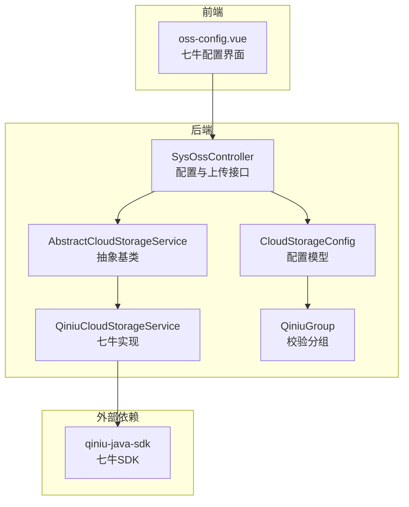
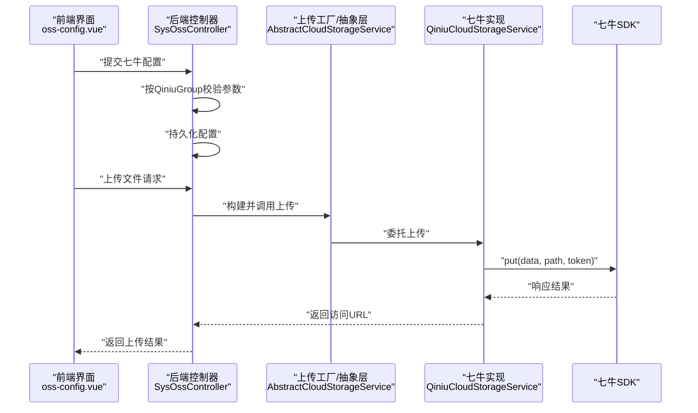
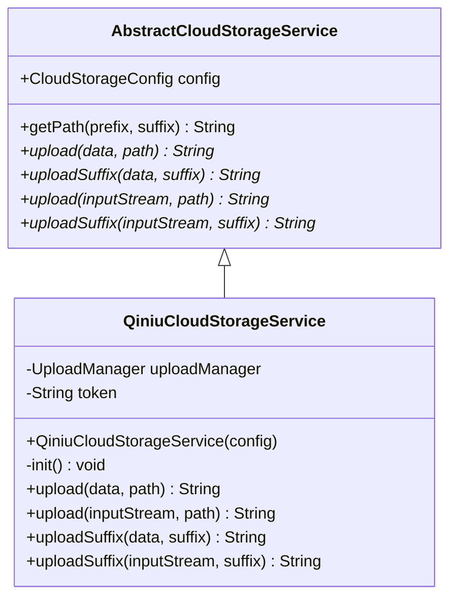
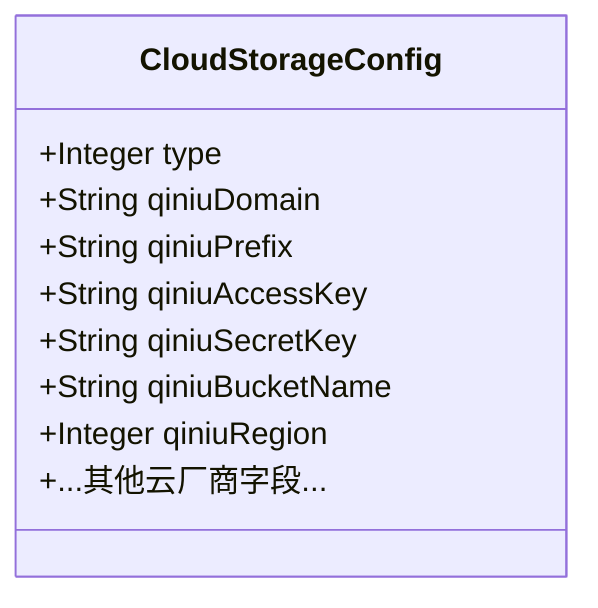
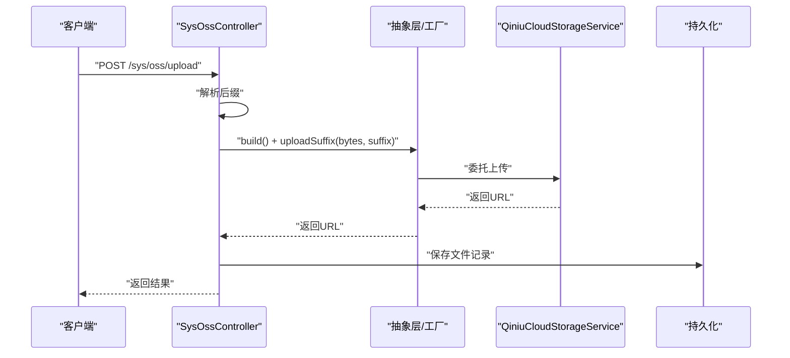
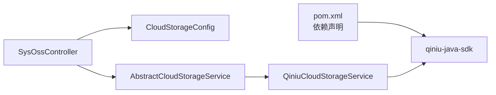

# 七牛云存储集成

<cite>
**本文引用的文件**
- [QiniuCloudStorageService.java](file://platform-biz/src/main/java/com/platform/modules/oss/cloud/QiniuCloudStorageService.java)
- [CloudStorageConfig.java](file://platform-biz/src/main/java/com/platform/modules/oss/cloud/CloudStorageConfig.java)
- [AbstractCloudStorageService.java](file://platform-biz/src/main/java/com/platform/modules/oss/cloud/AbstractCloudStorageService.java)
- [QiniuGroup.java](file://platform-biz/src/main/java/com/platform/common/validator/group/QiniuGroup.java)
- [SysOssController.java](file://platform-admin/src/main/java/com/platform/modules/oss/controller/SysOssController.java)
- [oss-config.vue](file://platform-admin-ui/src/views/modules/oss/oss-config.vue)
- [pom.xml](file://pom.xml)
</cite>

## 目录
1. [简介](#简介)
2. [项目结构](#项目结构)
3. [核心组件](#核心组件)
4. [架构总览](#架构总览)
5. [详细组件分析](#详细组件分析)
6. [依赖分析](#依赖分析)
7. [性能考虑](#性能考虑)
8. [故障排查指南](#故障排查指南)
9. [结论](#结论)
10. [附录](#附录)

## 简介
本文件系统性阐述平台对七牛云对象存储的集成实现，覆盖配置模型、认证与安全、上传流程、错误处理与重试建议、以及CDN加速与域名绑定策略。当前实现采用七牛Java SDK进行直传，支持基于字节数组与输入流的上传，并通过统一的工厂与抽象层适配多云存储。

## 项目结构
围绕七牛云存储的关键模块分布如下：
- 平台后端（platform-biz）：定义云存储配置模型、抽象基类、七牛具体实现与校验分组接口
- 平台管理端（platform-admin）：提供云存储配置的REST接口与上传入口
- 平台前端（platform-admin-ui）：提供七牛配置界面，支持域名、区域、前缀、AccessKey、SecretKey、空间名等参数录入
- 构建脚本（pom.xml）：声明七牛Java SDK依赖

图表来源
- [SysOssController.java:93-139](file://platform-admin/src/main/java/com/platform/modules/oss/controller/SysOssController.java#L93-L139)
- [AbstractCloudStorageService.java:34-96](file://platform-biz/src/main/java/com/platform/modules/oss/cloud/AbstractCloudStorageService.java#L34-L96)
- [QiniuCloudStorageService.java:38-88](file://platform-biz/src/main/java/com/platform/modules/oss/cloud/QiniuCloudStorageService.java#L38-L88)
- [CloudStorageConfig.java:41-83](file://platform-biz/src/main/java/com/platform/modules/oss/cloud/CloudStorageConfig.java#L41-L83)
- [QiniuGroup.java:21-27](file://platform-biz/src/main/java/com/platform/common/validator/group/QiniuGroup.java#L21-L27)
- [pom.xml:255-259](file://pom.xml#L255-L259)

章节来源
- [SysOssController.java:93-139](file://platform-admin/src/main/java/com/platform/modules/oss/controller/SysOssController.java#L93-L139)
- [AbstractCloudStorageService.java:34-96](file://platform-biz/src/main/java/com/platform/modules/oss/cloud/AbstractCloudStorageService.java#L34-L96)
- [QiniuCloudStorageService.java:38-88](file://platform-biz/src/main/java/com/platform/modules/oss/cloud/QiniuCloudStorageService.java#L38-L88)
- [CloudStorageConfig.java:41-83](file://platform-biz/src/main/java/com/platform/modules/oss/cloud/CloudStorageConfig.java#L41-L83)
- [QiniuGroup.java:21-27](file://platform-biz/src/main/java/com/platform/common/validator/group/QiniuGroup.java#L21-L27)
- [oss-config.vue:1-104](file://platform-admin-ui/src/views/modules/oss/oss-config.vue#L1-L104)
- [pom.xml:255-259](file://pom.xml#L255-L259)

## 核心组件
- 七牛云存储服务实现：负责初始化上传管理器与上传令牌，封装上传逻辑并返回可访问URL
- 云存储配置模型：集中管理各云厂商配置，含七牛域名、前缀、AccessKey、SecretKey、空间名与区域等字段
- 抽象云存储服务：提供统一的上传接口与路径生成策略
- 校验分组：针对七牛配置的参数校验规则
- 控制器：提供配置读取/保存与通用上传接口；上传流程通过工厂构建具体实现并调用

章节来源
- [QiniuCloudStorageService.java:38-88](file://platform-biz/src/main/java/com/platform/modules/oss/cloud/QiniuCloudStorageService.java#L38-L88)
- [CloudStorageConfig.java:41-83](file://platform-biz/src/main/java/com/platform/modules/oss/cloud/CloudStorageConfig.java#L41-L83)
- [AbstractCloudStorageService.java:34-96](file://platform-biz/src/main/java/com/platform/modules/oss/cloud/AbstractCloudStorageService.java#L34-L96)
- [QiniuGroup.java:21-27](file://platform-biz/src/main/java/com/platform/common/validator/group/QiniuGroup.java#L21-L27)
- [SysOssController.java:93-139](file://platform-admin/src/main/java/com/platform/modules/oss/controller/SysOssController.java#L93-L139)

## 架构总览
下图展示从前端配置到后端上传的整体交互：

图表来源
- [SysOssController.java:180-209](file://platform-admin/src/main/java/com/platform/modules/oss/controller/SysOssController.java#L180-L209)
- [AbstractCloudStorageService.java:67-94](file://platform-biz/src/main/java/com/platform/modules/oss/cloud/AbstractCloudStorageService.java#L67-L94)
- [QiniuCloudStorageService.java:55-87](file://platform-biz/src/main/java/com/platform/modules/oss/cloud/QiniuCloudStorageService.java#L55-L87)
- [CloudStorageConfig.java:41-83](file://platform-biz/src/main/java/com/platform/modules/oss/cloud/CloudStorageConfig.java#L41-L83)

## 详细组件分析

### 七牛云存储服务实现（QiniuCloudStorageService）
- 初始化：创建上传管理器与上传凭证，使用配置中的AccessKey、SecretKey与空间名生成上传Token
- 上传策略：
  - 支持字节数组与输入流两种上传入口
  - 将上传结果状态转换为业务异常或成功URL
  - 统一拼接返回URL：域名 + “/” + 路径
- 路径生成：复用抽象基类的路径策略，支持前缀与日期组织

图表来源
- [AbstractCloudStorageService.java:34-96](file://platform-biz/src/main/java/com/platform/modules/oss/cloud/AbstractCloudStorageService.java#L34-L96)
- [QiniuCloudStorageService.java:38-88](file://platform-biz/src/main/java/com/platform/modules/oss/cloud/QiniuCloudStorageService.java#L38-L88)

章节来源
- [QiniuCloudStorageService.java:38-88](file://platform-biz/src/main/java/com/platform/modules/oss/cloud/QiniuCloudStorageService.java#L38-L88)
- [AbstractCloudStorageService.java:34-96](file://platform-biz/src/main/java/com/platform/modules/oss/cloud/AbstractCloudStorageService.java#L34-L96)

### 云存储配置模型（CloudStorageConfig）
- 字段覆盖：类型、七牛域名、路径前缀、AccessKey、SecretKey、空间名、存储区域等
- 校验约束：通过分组在保存配置时按供应商启用不同校验规则
- 区域枚举：包含“自动/华东-浙江/华北-河北/华南-广东/北美-洛杉矶/亚太-新加坡/华东-浙江2”

图表来源
- [CloudStorageConfig.java:41-83](file://platform-biz/src/main/java/com/platform/modules/oss/cloud/CloudStorageConfig.java#L41-L83)

章节来源
- [CloudStorageConfig.java:41-83](file://platform-biz/src/main/java/com/platform/modules/oss/cloud/CloudStorageConfig.java#L41-L83)

### 校验分组（QiniuGroup）
- 作用：在保存配置时，仅对七牛相关字段启用非空与URL格式校验
- 使用：SysOssController在保存配置时按供应商选择对应分组进行校验

章节来源
- [QiniuGroup.java:21-27](file://platform-biz/src/main/java/com/platform/common/validator/group/QiniuGroup.java#L21-L27)
- [SysOssController.java:116-118](file://platform-admin/src/main/java/com/platform/modules/oss/controller/SysOssController.java#L116-L118)

### 控制器（SysOssController）
- 配置接口：读取与保存云存储配置，按供应商选择校验分组
- 上传接口：接收MultipartFile，提取后缀，委托工厂与抽象层完成上传，并持久化文件记录（除特定后缀）

图表来源
- [SysOssController.java:180-209](file://platform-admin/src/main/java/com/platform/modules/oss/controller/SysOssController.java#L180-L209)
- [AbstractCloudStorageService.java:67-94](file://platform-biz/src/main/java/com/platform/modules/oss/cloud/AbstractCloudStorageService.java#L67-L94)
- [QiniuCloudStorageService.java:55-87](file://platform-biz/src/main/java/com/platform/modules/oss/cloud/QiniuCloudStorageService.java#L55-L87)

章节来源
- [SysOssController.java:93-139](file://platform-admin/src/main/java/com/platform/modules/oss/controller/SysOssController.java#L93-L139)
- [SysOssController.java:180-209](file://platform-admin/src/main/java/com/platform/modules/oss/controller/SysOssController.java#L180-L209)

### 前端配置界面（oss-config.vue）
- 功能：切换存储类型为“七牛”，填写域名、区域、路径前缀、AccessKey、SecretKey、空间名
- 行为：提交时由后端按QiniuGroup进行参数校验与持久化

章节来源
- [oss-config.vue:1-104](file://platform-admin-ui/src/views/modules/oss/oss-config.vue#L1-L104)

## 依赖分析
- 七牛Java SDK：通过Maven引入，用于上传管理与鉴权
- 组件耦合：控制器依赖配置模型与抽象层；抽象层派生出七牛实现；七牛实现依赖SDK

图表来源
- [pom.xml:255-259](file://pom.xml#L255-L259)
- [SysOssController.java:93-139](file://platform-admin/src/main/java/com/platform/modules/oss/controller/SysOssController.java#L93-L139)
- [AbstractCloudStorageService.java:34-96](file://platform-biz/src/main/java/com/platform/modules/oss/cloud/AbstractCloudStorageService.java#L34-L96)
- [QiniuCloudStorageService.java:38-88](file://platform-biz/src/main/java/com/platform/modules/oss/cloud/QiniuCloudStorageService.java#L38-L88)

章节来源
- [pom.xml:255-259](file://pom.xml#L255-L259)
- [SysOssController.java:93-139](file://platform-admin/src/main/java/com/platform/modules/oss/controller/SysOssController.java#L93-L139)
- [AbstractCloudStorageService.java:34-96](file://platform-biz/src/main/java/com/platform/modules/oss/cloud/AbstractCloudStorageService.java#L34-L96)
- [QiniuCloudStorageService.java:38-88](file://platform-biz/src/main/java/com/platform/modules/oss/cloud/QiniuCloudStorageService.java#L38-L88)

## 性能考虑
- 上传策略：当前实现为直传，适合中小文件；大文件建议采用分片上传以提升稳定性与速度
- 令牌复用：当前实现初始化时生成一次上传Token；若需长期运行，建议在Token即将过期时刷新
- CDN与域名：通过配置域名实现CDN回源与加速，确保域名与空间同区一致以降低延迟

## 故障排查指南
- 参数校验失败：检查七牛域名、AccessKey、SecretKey、空间名与区域是否按要求填写
- 上传失败：查看后端异常栈，确认七牛SDK响应状态与网络连通性
- URL不可访问：确认域名已正确绑定至七牛空间且具备CDN生效时间

章节来源
- [SysOssController.java:116-118](file://platform-admin/src/main/java/com/platform/modules/oss/controller/SysOssController.java#L116-L118)
- [QiniuCloudStorageService.java:55-87](file://platform-biz/src/main/java/com/platform/modules/oss/cloud/QiniuCloudStorageService.java#L55-L87)

## 结论
当前实现提供了七牛云存储的基础直传能力，具备清晰的配置模型、参数校验与统一上传接口。后续可在以下方面增强：引入分片上传与断点续传、优化Token生命周期管理、完善错误重试与熔断策略，并结合CDN与区域选择进一步提升性能与可用性。

## 附录

### 七牛认证与配置要点
- 认证机制：使用AccessKey与SecretKey生成上传Token，绑定目标空间
- 安全使用：建议将密钥存储于受控环境变量或配置中心，避免硬编码
- 配置项：域名、路径前缀、区域、空间名、AccessKey、SecretKey

章节来源
- [CloudStorageConfig.java:41-83](file://platform-biz/src/main/java/com/platform/modules/oss/cloud/CloudStorageConfig.java#L41-L83)
- [QiniuCloudStorageService.java:49-53](file://platform-biz/src/main/java/com/platform/modules/oss/cloud/QiniuCloudStorageService.java#L49-L53)

### 上传策略与实现路径
- 表单上传：通过控制器接收文件并委托上传
- HTTP队列上传：可沿用现有抽象层扩展队列任务
- 分片上传：建议新增分片策略与合并步骤，结合SDK分片能力实现

章节来源
- [SysOssController.java:180-209](file://platform-admin/src/main/java/com/platform/modules/oss/controller/SysOssController.java#L180-L209)
- [AbstractCloudStorageService.java:67-94](file://platform-biz/src/main/java/com/platform/modules/oss/cloud/AbstractCloudStorageService.java#L67-L94)
- [QiniuCloudStorageService.java:55-87](file://platform-biz/src/main/java/com/platform/modules/oss/cloud/QiniuCloudStorageService.java#L55-L87)

### CDN加速与域名绑定
- 域名绑定：在配置中填写七牛绑定域名
- 区域选择：根据业务覆盖区域选择合适节点，减少跨域与跨境延迟
- 生效时间：CDN缓存与域名生效存在时间差，需预留观测窗口

章节来源
- [CloudStorageConfig.java:41-83](file://platform-biz/src/main/java/com/platform/modules/oss/cloud/CloudStorageConfig.java#L41-L83)
- [oss-config.vue:19-44](file://platform-admin-ui/src/views/modules/oss/oss-config.vue#L19-L44)