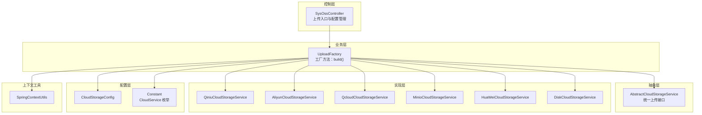
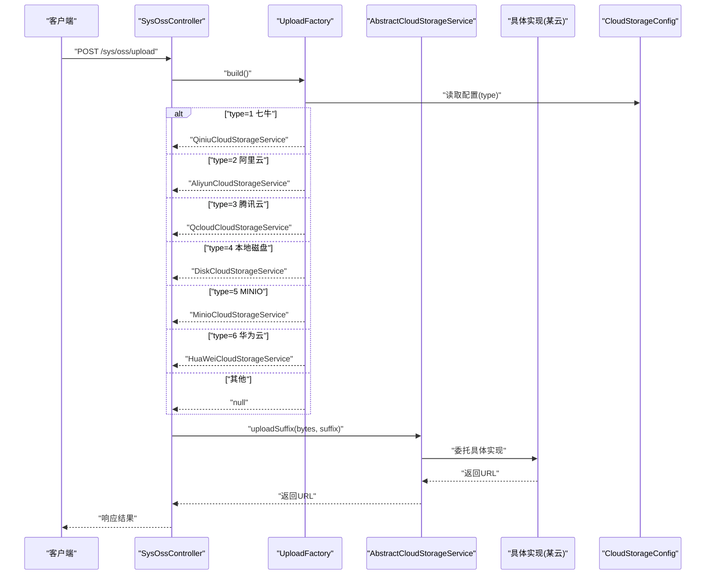
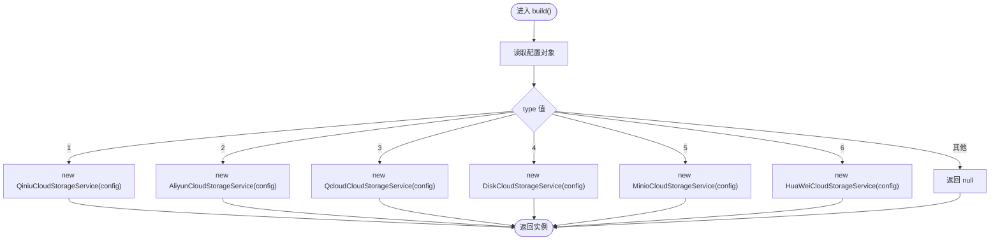
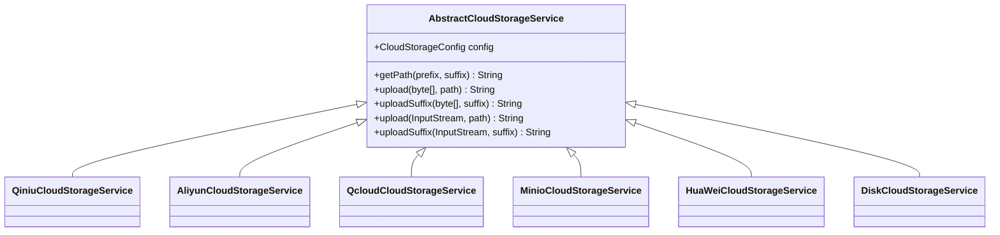
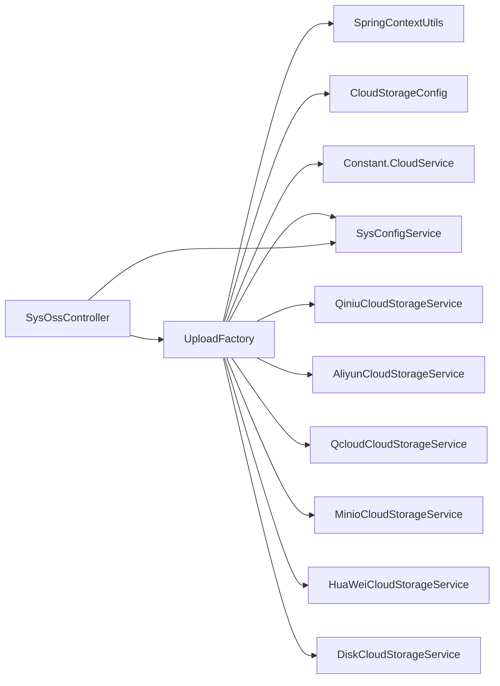

# 上传工厂模式

<cite>
**本文引用的文件**
- [UploadFactory.java](file://platform-biz/src/main/java/com/platform/modules/oss/cloud/UploadFactory.java)
- [CloudStorageConfig.java](file://platform-biz/src/main/java/com/platform/modules/oss/cloud/CloudStorageConfig.java)
- [AbstractCloudStorageService.java](file://platform-biz/src/main/java/com/platform/modules/oss/cloud/AbstractCloudStorageService.java)
- [QiniuCloudStorageService.java](file://platform-biz/src/main/java/com/platform/modules/oss/cloud/QiniuCloudStorageService.java)
- [AliyunCloudStorageService.java](file://platform-biz/src/main/java/com/platform/modules/oss/cloud/AliyunCloudStorageService.java)
- [QcloudCloudStorageService.java](file://platform-biz/src/main/java/com/platform/modules/oss/cloud/QcloudCloudStorageService.java)
- [DiskCloudStorageService.java](file://platform-biz/src/main/java/com/platform/modules/oss/cloud/DiskCloudStorageService.java)
- [MinioCloudStorageService.java](file://platform-biz/src/main/java/com/platform/modules/oss/cloud/MinioCloudStorageService.java)
- [HuaWeiCloudStorageService.java](file://platform-biz/src/main/java/com/platform/modules/oss/cloud/HuaWeiCloudStorageService.java)
- [SysOssController.java](file://platform-admin/src/main/java/com/platform/modules/oss/controller/SysOssController.java)
- [Constant.java](file://platform-common/src/main/java/com/platform/common/utils/Constant.java)
- [SpringContextUtils.java](file://platform-common/src/main/java/com/platform/common/utils/SpringContextUtils.java)
- [application.yml](file://platform-admin/src/main/resources/application.yml)
</cite>

## 目录
1. [简介](#简介)
2. [项目结构](#项目结构)
3. [核心组件](#核心组件)
4. [架构总览](#架构总览)
5. [详细组件分析](#详细组件分析)
6. [依赖关系分析](#依赖关系分析)
7. [性能与缓存策略](#性能与缓存策略)
8. [故障与降级策略](#故障与降级策略)
9. [扩展指南：新增存储服务](#扩展指南新增存储服务)
10. [测试指南](#测试指南)
11. [结论](#结论)

## 简介
本文件围绕“上传工厂模式”展开，系统性解析 UploadFactory 在云存储服务中的设计与实现，覆盖以下主题：
- 工厂模式在多云存储服务中的应用与选择策略
- 基于配置驱动的服务切换与运行时实例创建
- 扩展新存储服务的集成步骤与配置要求
- 缓存与性能优化（服务实例复用、连接池管理建议）
- 错误处理与降级策略（服务不可用时的回退机制）
- 单元测试与集成测试的编写思路与要点

## 项目结构
围绕上传功能的关键模块分布如下：
- 控制层：SysOssController 提供上传接口与配置读写
- 业务层：UploadFactory 根据配置动态构建具体存储服务实例
- 抽象层：AbstractCloudStorageService 定义统一上传接口
- 实现层：各云厂商的具体实现（七牛、阿里云、腾讯云、MINIO、华为云、本地磁盘）
- 配置层：CloudStorageConfig 统一承载各厂商配置；Constant 提供枚举与常量
- 上下文工具：SpringContextUtils 提供静态 Bean 获取能力

图表来源
- [SysOssController.java:173-188](file://platform-admin/src/main/java/com/platform/modules/oss/controller/SysOssController.java#L173-L188)
- [UploadFactory.java:38-56](file://platform-biz/src/main/java/com/platform/modules/oss/cloud/UploadFactory.java#L38-L56)
- [AbstractCloudStorageService.java:34-96](file://platform-biz/src/main/java/com/platform/modules/oss/cloud/AbstractCloudStorageService.java#L34-L96)
- [CloudStorageConfig.java:37-187](file://platform-biz/src/main/java/com/platform/modules/oss/cloud/CloudStorageConfig.java#L37-L187)
- [Constant.java:180-217](file://platform-common/src/main/java/com/platform/common/utils/Constant.java#L180-L217)
- [SpringContextUtils.java:31-43](file://platform-common/src/main/java/com/platform/common/utils/SpringContextUtils.java#L31-L43)

章节来源
- [SysOssController.java:173-188](file://platform-admin/src/main/java/com/platform/modules/oss/controller/SysOssController.java#L173-L188)
- [UploadFactory.java:31-58](file://platform-biz/src/main/java/com/platform/modules/oss/cloud/UploadFactory.java#L31-L58)
- [AbstractCloudStorageService.java:28-96](file://platform-biz/src/main/java/com/platform/modules/oss/cloud/AbstractCloudStorageService.java#L28-L96)
- [CloudStorageConfig.java:31-187](file://platform-biz/src/main/java/com/platform/modules/oss/cloud/CloudStorageConfig.java#L31-L187)
- [Constant.java:179-217](file://platform-common/src/main/java/com/platform/common/utils/Constant.java#L179-L217)
- [SpringContextUtils.java:26-61](file://platform-common/src/main/java/com/platform/common/utils/SpringContextUtils.java#L26-L61)

## 核心组件
- UploadFactory：静态工厂，依据配置动态返回具体存储服务实例
- AbstractCloudStorageService：抽象基类，定义统一上传接口与通用路径生成逻辑
- 各云存储实现：Qiniu、Aliyun、Qcloud、Minio、HuaWei、Disk
- CloudStorageConfig：集中式配置模型，按厂商分组校验
- Constant：云服务类型枚举与系统常量
- SpringContextUtils：静态获取 Spring Bean 的工具类

章节来源
- [UploadFactory.java:31-58](file://platform-biz/src/main/java/com/platform/modules/oss/cloud/UploadFactory.java#L31-L58)
- [AbstractCloudStorageService.java:28-96](file://platform-biz/src/main/java/com/platform/modules/oss/cloud/AbstractCloudStorageService.java#L28-L96)
- [CloudStorageConfig.java:31-187](file://platform-biz/src/main/java/com/platform/modules/oss/cloud/CloudStorageConfig.java#L31-L187)
- [Constant.java:179-217](file://platform-common/src/main/java/com/platform/common/utils/Constant.java#L179-L217)
- [SpringContextUtils.java:26-61](file://platform-common/src/main/java/com/platform/common/utils/SpringContextUtils.java#L26-L61)

## 架构总览
UploadFactory 作为核心调度者，通过读取系统配置决定实例化哪一种云存储服务。控制层调用工厂方法完成上传流程，实现“配置即策略”的解耦。

图表来源
- [SysOssController.java:173-188](file://platform-admin/src/main/java/com/platform/modules/oss/controller/SysOssController.java#L173-L188)
- [UploadFactory.java:38-56](file://platform-biz/src/main/java/com/platform/modules/oss/cloud/UploadFactory.java#L38-L56)
- [AbstractCloudStorageService.java:67-94](file://platform-biz/src/main/java/com/platform/modules/oss/cloud/AbstractCloudStorageService.java#L67-L94)
- [QiniuCloudStorageService.java:55-87](file://platform-biz/src/main/java/com/platform/modules/oss/cloud/QiniuCloudStorageService.java#L55-L87)
- [AliyunCloudStorageService.java:48-72](file://platform-biz/src/main/java/com/platform/modules/oss/cloud/AliyunCloudStorageService.java#L48-L72)
- [QcloudCloudStorageService.java:62-92](file://platform-biz/src/main/java/com/platform/modules/oss/cloud/QcloudCloudStorageService.java#L62-L92)
- [DiskCloudStorageService.java:49-103](file://platform-biz/src/main/java/com/platform/modules/oss/cloud/DiskCloudStorageService.java#L49-L103)
- [MinioCloudStorageService.java:41-86](file://platform-biz/src/main/java/com/platform/modules/oss/cloud/MinioCloudStorageService.java#L41-L86)
- [HuaWeiCloudStorageService.java:35-71](file://platform-biz/src/main/java/com/platform/modules/oss/cloud/HuaWeiCloudStorageService.java#L35-L71)

## 详细组件分析

### UploadFactory 工厂方法
- 作用：根据系统配置的云存储类型，返回对应的具体存储服务实例
- 关键点：
  - 通过 SpringContextUtils 获取 SysConfigService
  - 读取配置键 Constant.CLOUD_STORAGE_CONFIG_KEY
  - 基于 CloudService 枚举分支创建实例
  - 未匹配时返回 null（调用方需处理）

图表来源
- [UploadFactory.java:38-56](file://platform-biz/src/main/java/com/platform/modules/oss/cloud/UploadFactory.java#L38-L56)
- [Constant.java:180-217](file://platform-common/src/main/java/com/platform/common/utils/Constant.java#L180-L217)

章节来源
- [UploadFactory.java:31-58](file://platform-biz/src/main/java/com/platform/modules/oss/cloud/UploadFactory.java#L31-L58)
- [Constant.java:179-217](file://platform-common/src/main/java/com/platform/common/utils/Constant.java#L179-L217)

### 抽象与实现类关系
- AbstractCloudStorageService 定义统一接口与路径生成策略
- 各实现类封装特定 SDK 的初始化与上传细节

图表来源
- [AbstractCloudStorageService.java:34-96](file://platform-biz/src/main/java/com/platform/modules/oss/cloud/AbstractCloudStorageService.java#L34-L96)
- [QiniuCloudStorageService.java:38-88](file://platform-biz/src/main/java/com/platform/modules/oss/cloud/QiniuCloudStorageService.java#L38-L88)
- [AliyunCloudStorageService.java:34-73](file://platform-biz/src/main/java/com/platform/modules/oss/cloud/AliyunCloudStorageService.java#L34-L73)
- [QcloudCloudStorageService.java:40-93](file://platform-biz/src/main/java/com/platform/modules/oss/cloud/QcloudCloudStorageService.java#L40-L93)
- [MinioCloudStorageService.java:23-87](file://platform-biz/src/main/java/com/platform/modules/oss/cloud/MinioCloudStorageService.java#L23-L87)
- [HuaWeiCloudStorageService.java:20-72](file://platform-biz/src/main/java/com/platform/modules/oss/cloud/HuaWeiCloudStorageService.java#L20-L72)
- [DiskCloudStorageService.java:36-104](file://platform-biz/src/main/java/com/platform/modules/oss/cloud/DiskCloudStorageService.java#L36-L104)

章节来源
- [AbstractCloudStorageService.java:28-96](file://platform-biz/src/main/java/com/platform/modules/oss/cloud/AbstractCloudStorageService.java#L28-L96)
- [QiniuCloudStorageService.java:32-88](file://platform-biz/src/main/java/com/platform/modules/oss/cloud/QiniuCloudStorageService.java#L32-L88)
- [AliyunCloudStorageService.java:28-73](file://platform-biz/src/main/java/com/platform/modules/oss/cloud/AliyunCloudStorageService.java#L28-L73)
- [QcloudCloudStorageService.java:34-93](file://platform-biz/src/main/java/com/platform/modules/oss/cloud/QcloudCloudStorageService.java#L34-L93)
- [MinioCloudStorageService.java:16-87](file://platform-biz/src/main/java/com/platform/modules/oss/cloud/MinioCloudStorageService.java#L16-L87)
- [HuaWeiCloudStorageService.java:13-72](file://platform-biz/src/main/java/com/platform/modules/oss/cloud/HuaWeiCloudStorageService.java#L13-L72)
- [DiskCloudStorageService.java:30-104](file://platform-biz/src/main/java/com/platform/modules/oss/cloud/DiskCloudStorageService.java#L30-L104)

### 控制层调用链
- SysOssController 在上传接口中调用 UploadFactory.build() 获取服务实例，再调用 uploadSuffix 完成上传
- 配置读取与保存由控制器通过 SysConfigService 完成

章节来源
- [SysOssController.java:173-188](file://platform-admin/src/main/java/com/platform/modules/oss/controller/SysOssController.java#L173-L188)
- [SysOssController.java:93-139](file://platform-admin/src/main/java/com/platform/modules/oss/controller/SysOssController.java#L93-L139)

## 依赖关系分析
- UploadFactory 依赖：
  - SpringContextUtils：静态获取 SysConfigService
  - SysConfigService：读取配置对象 CloudStorageConfig
  - Constant：云服务类型枚举 CloudService
- 各实现类依赖：
  - 对应云厂商 SDK（如七牛、阿里云、腾讯云、MINIO、华为云）
  - Commons IO（部分实现用于字节流转输入流）
- 控制层依赖：
  - SysOssController 依赖 UploadFactory 与 SysConfigService

图表来源
- [UploadFactory.java:31-58](file://platform-biz/src/main/java/com/platform/modules/oss/cloud/UploadFactory.java#L31-L58)
- [SpringContextUtils.java:31-43](file://platform-common/src/main/java/com/platform/common/utils/SpringContextUtils.java#L31-L43)
- [Constant.java:180-217](file://platform-common/src/main/java/com/platform/common/utils/Constant.java#L180-L217)
- [SysOssController.java:173-188](file://platform-admin/src/main/java/com/platform/modules/oss/controller/SysOssController.java#L173-L188)

章节来源
- [UploadFactory.java:31-58](file://platform-biz/src/main/java/com/platform/modules/oss/cloud/UploadFactory.java#L31-L58)
- [SpringContextUtils.java:26-61](file://platform-common/src/main/java/com/platform/common/utils/SpringContextUtils.java#L26-L61)
- [Constant.java:179-217](file://platform-common/src/main/java/com/platform/common/utils/Constant.java#L179-L217)
- [SysOssController.java:173-188](file://platform-admin/src/main/java/com/platform/modules/oss/controller/SysOssController.java#L173-L188)

## 性能与缓存策略
- 服务实例复用
  - UploadFactory 当前每次调用都会重新读取配置并创建实例。建议在工厂内部引入缓存（例如基于配置哈希的 LRU 缓存），减少重复初始化成本
- 连接池管理
  - 各实现类中存在 SDK 客户端实例化（如 OSSClient、COSClient、MinioClient、ObsClient）。建议：
    - 将客户端实例作为单例注入到实现类中
    - 配置合理的连接池参数（最大连接、空闲连接、超时等）
  - 对于七牛 UploadManager，可在工厂层复用以降低频繁初始化开销
- 路径与命名
  - AbstractCloudStorageService 的路径生成策略使用日期前缀与 UUID，有助于分散热点与避免冲突

章节来源
- [AbstractCloudStorageService.java:47-58](file://platform-biz/src/main/java/com/platform/modules/oss/cloud/AbstractCloudStorageService.java#L47-L58)
- [QiniuCloudStorageService.java:42-53](file://platform-biz/src/main/java/com/platform/modules/oss/cloud/QiniuCloudStorageService.java#L42-L53)
- [AliyunCloudStorageService.java:37-46](file://platform-biz/src/main/java/com/platform/modules/oss/cloud/AliyunCloudStorageService.java#L37-L46)
- [QcloudCloudStorageService.java:43-60](file://platform-biz/src/main/java/com/platform/modules/oss/cloud/QcloudCloudStorageService.java#L43-L60)
- [MinioCloudStorageService.java:27-39](file://platform-biz/src/main/java/com/platform/modules/oss/cloud/MinioCloudStorageService.java#L27-L39)
- [HuaWeiCloudStorageService.java:24-33](file://platform-biz/src/main/java/com/platform/modules/oss/cloud/HuaWeiCloudStorageService.java#L24-L33)

## 故障与降级策略
- 服务不可用时的回退
  - UploadFactory.build() 在无法识别类型时返回 null。调用方需显式判空并触发降级（例如回退到本地磁盘存储或返回错误）
- 异常处理
  - 各实现类在上传过程中捕获 SDK 异常并包装为业务异常，便于统一处理
- 配置校验
  - 控制层在保存配置时按厂商分组进行校验，确保关键字段完整与格式正确

章节来源
- [UploadFactory.java:55-56](file://platform-biz/src/main/java/com/platform/modules/oss/cloud/UploadFactory.java#L55-L56)
- [SysOssController.java:112-134](file://platform-admin/src/main/java/com/platform/modules/oss/controller/SysOssController.java#L112-L134)
- [QiniuCloudStorageService.java:56-64](file://platform-biz/src/main/java/com/platform/modules/oss/cloud/QiniuCloudStorageService.java#L56-L64)
- [AliyunCloudStorageService.java:54-60](file://platform-biz/src/main/java/com/platform/modules/oss/cloud/AliyunCloudStorageService.java#L54-L60)
- [QcloudCloudStorageService.java:67-82](file://platform-biz/src/main/java/com/platform/modules/oss/cloud/QcloudCloudStorageService.java#L67-L82)
- [MinioCloudStorageService.java:47-66](file://platform-biz/src/main/java/com/platform/modules/oss/cloud/MinioCloudStorageService.java#L47-L66)
- [HuaWeiCloudStorageService.java:41-51](file://platform-biz/src/main/java/com/platform/modules/oss/cloud/HuaWeiCloudStorageService.java#L41-L51)
- [DiskCloudStorageService.java:50-82](file://platform-biz/src/main/java/com/platform/modules/oss/cloud/DiskCloudStorageService.java#L50-L82)

## 扩展指南：新增存储服务
- 步骤
  1) 新建实现类继承 AbstractCloudStorageService，完成构造与初始化、upload 与 uploadSuffix 的实现
  2) 在 UploadFactory.build() 中增加类型分支，返回新实现类实例
  3) 在 CloudStorageConfig 中新增该厂商的配置字段，并添加相应校验组
  4) 在 SysOssController.saveConfig() 中增加对该配置的校验分支
  5) 在 Constant.CloudService 中新增对应枚举值
- 配置要求
  - 遵循现有字段命名与校验注解风格（NotBlank、URL、Range 等）
  - 为新配置字段提供默认值与合理约束
- 最佳实践
  - 实现类中尽量复用连接/客户端实例，避免频繁创建
  - 上传完成后返回可访问的 URL，保持对外一致的契约

章节来源
- [UploadFactory.java:42-54](file://platform-biz/src/main/java/com/platform/modules/oss/cloud/UploadFactory.java#L42-L54)
- [CloudStorageConfig.java:42-187](file://platform-biz/src/main/java/com/platform/modules/oss/cloud/CloudStorageConfig.java#L42-L187)
- [SysOssController.java:112-134](file://platform-admin/src/main/java/com/platform/modules/oss/controller/SysOssController.java#L112-L134)
- [Constant.java:180-217](file://platform-common/src/main/java/com/platform/common/utils/Constant.java#L180-L217)

## 测试指南
- 单元测试
  - UploadFactory：验证不同 type 返回不同实现；验证 null 分支
  - 各实现类：模拟上传场景，断言返回 URL 格式与路径策略
  - CloudStorageConfig：验证各厂商分组校验
- 集成测试
  - SysOssController：调用 /sys/oss/upload 与 /sys/oss/saveConfig，验证配置持久化与上传返回
  - 失败场景：空文件、配置缺失、SDK 异常
- 性能测试
  - 并发上传压力测试，评估连接池与实例复用效果
  - 配置热更新场景：修改配置后立即生效的实例替换策略

章节来源
- [SysOssController.java:173-188](file://platform-admin/src/main/java/com/platform/modules/oss/controller/SysOssController.java#L173-L188)
- [SysOssController.java:93-139](file://platform-admin/src/main/java/com/platform/modules/oss/controller/SysOssController.java#L93-L139)
- [application.yml:76-80](file://platform-admin/src/main/resources/application.yml#L76-L80)

## 结论
UploadFactory 通过“配置即策略”的工厂模式，将上传行为与具体云厂商解耦，具备良好的可扩展性与可维护性。结合连接池与实例缓存优化、完善的异常与降级策略，以及系统化的测试体系，可满足生产环境对稳定性与性能的要求。新增存储服务仅需遵循既定规范，即可快速集成并参与统一调度。