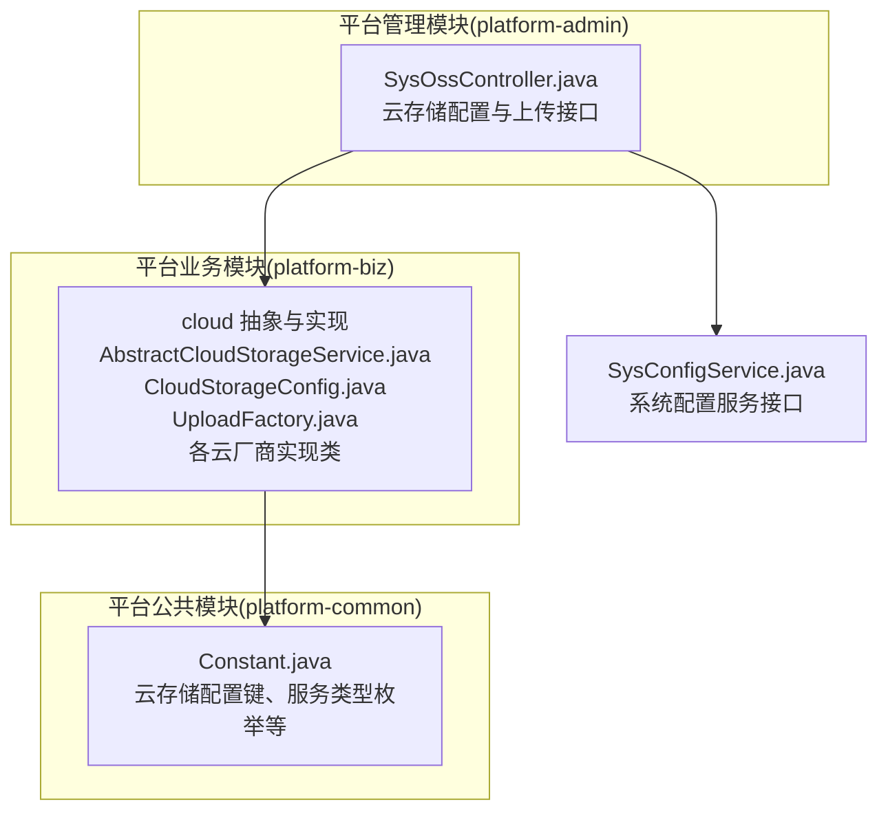
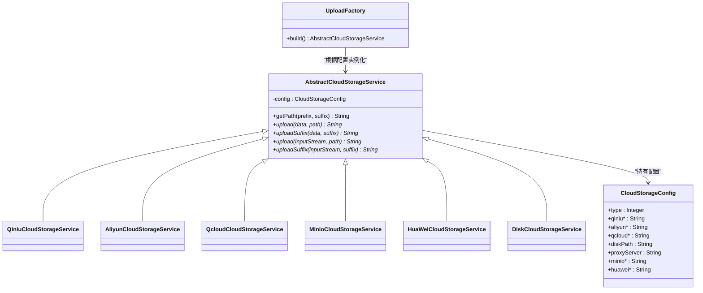
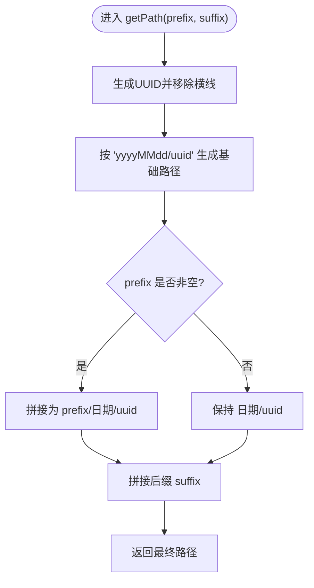
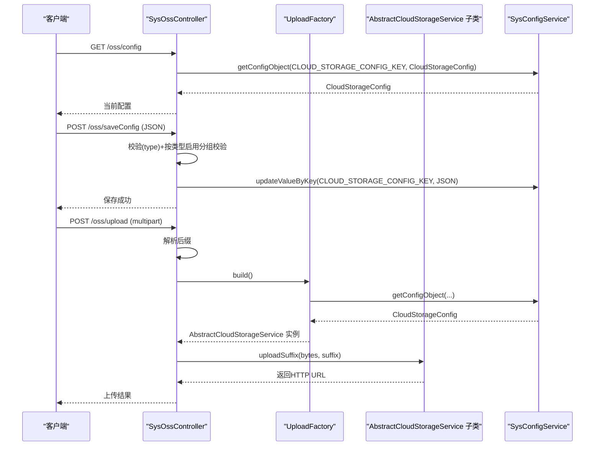
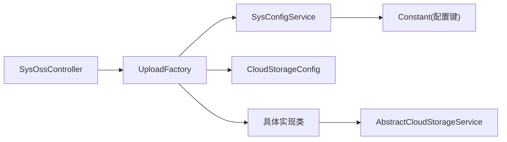

# 云存储抽象设计

<cite>
**本文引用的文件**
- [AbstractCloudStorageService.java](file://platform-biz/src/main/java/com/platform/modules/oss/cloud/AbstractCloudStorageService.java)
- [CloudStorageConfig.java](file://platform-biz/src/main/java/com/platform/modules/oss/cloud/CloudStorageConfig.java)
- [UploadFactory.java](file://platform-biz/src/main/java/com/platform/modules/oss/cloud/UploadFactory.java)
- [AliyunCloudStorageService.java](file://platform-biz/src/main/java/com/platform/modules/oss/cloud/AliyunCloudStorageService.java)
- [QcloudCloudStorageService.java](file://platform-biz/src/main/java/com/platform/modules/oss/cloud/QcloudCloudStorageService.java)
- [QiniuCloudStorageService.java](file://platform-biz/src/main/java/com/platform/modules/oss/cloud/QiniuCloudStorageService.java)
- [DiskCloudStorageService.java](file://platform-biz/src/main/java/com/platform/modules/oss/cloud/DiskCloudStorageService.java)
- [MinioCloudStorageService.java](file://platform-biz/src/main/java/com/platform/modules/oss/cloud/MinioCloudStorageService.java)
- [HuaWeiCloudStorageService.java](file://platform-biz/src/main/java/com/platform/modules/oss/cloud/HuaWeiCloudStorageService.java)
- [SysOssController.java](file://platform-admin/src/main/java/com/platform/modules/oss/controller/SysOssController.java)
- [SysConfigService.java](file://platform-biz/src/main/java/com/platform/modules/sys/service/SysConfigService.java)
- [Constant.java](file://platform-common/src/main/java/com/platform/common/utils/Constant.java)
</cite>

## 目录
1. [引言](#引言)
2. [项目结构](#项目结构)
3. [核心组件](#核心组件)
4. [架构总览](#架构总览)
5. [详细组件分析](#详细组件分析)
6. [依赖分析](#依赖分析)
7. [性能考虑](#性能考虑)
8. [故障排查指南](#故障排查指南)
9. [结论](#结论)
10. [附录](#附录)

## 引言
本文件围绕平台中的云存储抽象设计进行系统性解析，重点阐述抽象类 AbstractCloudStorageService 的设计理念与架构模式，详解云存储配置管理机制（CloudStorageConfig），说明文件路径生成策略（UUID、日期格式化、路径前缀处理），统一的文件上传接口设计（字节数组上传、流式上传、后缀处理），并提供扩展新云存储服务的开发指南与最佳实践，以及错误处理与异常管理策略。

## 项目结构
云存储相关代码主要位于以下模块与包中：
- 平台业务模块（platform-biz）：云存储抽象、具体实现、工厂与配置类
- 平台管理模块（platform-admin）：云存储配置与上传接口控制器
- 平台公共模块（platform-common）：常量定义（含云存储配置键、服务类型枚举）

图表来源
- [AbstractCloudStorageService.java:1-97](file://platform-biz/src/main/java/com/platform/modules/oss/cloud/AbstractCloudStorageService.java#L1-L97)
- [CloudStorageConfig.java:1-188](file://platform-biz/src/main/java/com/platform/modules/oss/cloud/CloudStorageConfig.java#L1-L188)
- [UploadFactory.java:1-59](file://platform-biz/src/main/java/com/platform/modules/oss/cloud/UploadFactory.java#L1-L59)
- [SysOssController.java:1-200](file://platform-admin/src/main/java/com/platform/modules/oss/controller/SysOssController.java#L1-L200)
- [SysConfigService.java:1-99](file://platform-biz/src/main/java/com/platform/modules/sys/service/SysConfigService.java#L1-L99)
- [Constant.java:1-200](file://platform-common/src/main/java/com/platform/common/utils/Constant.java#L1-L200)

章节来源
- [AbstractCloudStorageService.java:1-97](file://platform-biz/src/main/java/com/platform/modules/oss/cloud/AbstractCloudStorageService.java#L1-L97)
- [CloudStorageConfig.java:1-188](file://platform-biz/src/main/java/com/platform/modules/oss/cloud/CloudStorageConfig.java#L1-L188)
- [UploadFactory.java:1-59](file://platform-biz/src/main/java/com/platform/modules/oss/cloud/UploadFactory.java#L1-L59)
- [SysOssController.java:1-200](file://platform-admin/src/main/java/com/platform/modules/oss/controller/SysOssController.java#L1-L200)
- [SysConfigService.java:1-99](file://platform-biz/src/main/java/com/platform/modules/sys/service/SysConfigService.java#L1-L99)
- [Constant.java:1-200](file://platform-common/src/main/java/com/platform/common/utils/Constant.java#L1-L200)

## 核心组件
- 抽象层：AbstractCloudStorageService 定义统一的文件路径生成策略与上传接口族（字节数组、流式、带后缀重载），确保不同云厂商实现的一致行为契约。
- 配置层：CloudStorageConfig 统一承载各云厂商的配置项，并通过 Bean 校验组按类型启用对应字段校验。
- 工厂层：UploadFactory 基于系统配置动态选择具体云存储实现，屏蔽调用方对具体实现的感知。
- 实现层：各云厂商实现类（七牛、阿里云、腾讯云、MINIO、华为云、本地磁盘）继承抽象类，完成具体的上传逻辑与返回 URL 拼接。
- 控制器层：SysOssController 提供云存储配置查询与保存、文件上传接口，使用工厂构建上传服务并执行上传。
- 配置服务：SysConfigService 提供配置对象的读取与写入能力，配合 Constant 中的配置键完成持久化。

章节来源
- [AbstractCloudStorageService.java:34-96](file://platform-biz/src/main/java/com/platform/modules/oss/cloud/AbstractCloudStorageService.java#L34-L96)
- [CloudStorageConfig.java:37-187](file://platform-biz/src/main/java/com/platform/modules/oss/cloud/CloudStorageConfig.java#L37-L187)
- [UploadFactory.java:31-56](file://platform-biz/src/main/java/com/platform/modules/oss/cloud/UploadFactory.java#L31-L56)
- [SysOssController.java:94-139](file://platform-admin/src/main/java/com/platform/modules/oss/controller/SysOssController.java#L94-L139)
- [SysConfigService.java:95-96](file://platform-biz/src/main/java/com/platform/modules/sys/service/SysConfigService.java#L95-L96)
- [Constant.java:49-51](file://platform-common/src/main/java/com/platform/common/utils/Constant.java#L49-L51)

## 架构总览
该架构采用“抽象+工厂+多实现”的分层设计，实现对多种云存储服务的统一接入与扩展。

图表来源
- [AbstractCloudStorageService.java:34-96](file://platform-biz/src/main/java/com/platform/modules/oss/cloud/AbstractCloudStorageService.java#L34-L96)
- [CloudStorageConfig.java:37-187](file://platform-biz/src/main/java/com/platform/modules/oss/cloud/CloudStorageConfig.java#L37-L187)
- [UploadFactory.java:31-56](file://platform-biz/src/main/java/com/platform/modules/oss/cloud/UploadFactory.java#L31-L56)
- [QiniuCloudStorageService.java:38-88](file://platform-biz/src/main/java/com/platform/modules/oss/cloud/QiniuCloudStorageService.java#L38-L88)
- [AliyunCloudStorageService.java:34-73](file://platform-biz/src/main/java/com/platform/modules/oss/cloud/AliyunCloudStorageService.java#L34-L73)
- [QcloudCloudStorageService.java:40-93](file://platform-biz/src/main/java/com/platform/modules/oss/cloud/QcloudCloudStorageService.java#L40-L93)
- [MinioCloudStorageService.java:23-87](file://platform-biz/src/main/java/com/platform/modules/oss/cloud/MinioCloudStorageService.java#L23-L87)
- [HuaWeiCloudStorageService.java:20-72](file://platform-biz/src/main/java/com/platform/modules/oss/cloud/HuaWeiCloudStorageService.java#L20-L72)
- [DiskCloudStorageService.java:36-104](file://platform-biz/src/main/java/com/platform/modules/oss/cloud/DiskCloudStorageService.java#L36-L104)

## 详细组件分析

### 抽象类 AbstractCloudStorageService 设计理念与架构模式
- 设计理念
  - 通过抽象类集中定义文件路径生成策略与统一上传接口族，确保不同云厂商实现遵循一致的命名与返回规范。
  - 将“路径生成”与“上传实现”解耦：路径生成由抽象类负责，具体上传细节由子类实现。
- 架构模式
  - 模板方法：子类仅需实现具体上传逻辑，路径生成与后缀处理通过模板方法统一调度。
  - 工厂模式：UploadFactory 基于配置选择具体实现，调用方无需感知具体厂商差异。
- 接口族
  - 字节数组上传：upload(byte[], String path)
  - 流式上传：upload(InputStream, String path)
  - 带后缀上传：uploadSuffix(...) 两个重载，内部委托至带路径的上传并结合 getPath 生成完整路径
- 路径生成策略
  - 生成规则：yyyyMMdd/uuid（可选前缀）+ 后缀
  - 前缀处理：若传入 prefix 非空，则拼接为 prefix/...；否则直接为日期/uuid/...
  - 后缀处理：最终返回 path + suffix，便于上层直接使用

图表来源
- [AbstractCloudStorageService.java:47-58](file://platform-biz/src/main/java/com/platform/modules/oss/cloud/AbstractCloudStorageService.java#L47-L58)

章节来源
- [AbstractCloudStorageService.java:34-96](file://platform-biz/src/main/java/com/platform/modules/oss/cloud/AbstractCloudStorageService.java#L34-L96)

### 配置管理机制：CloudStorageConfig
- 字段组织
  - type：云服务商类型（1~6），用于工厂选择具体实现
  - 七牛相关：域名、路径前缀、AccessKey、SecretKey、BucketName、区域
  - 阿里云相关：域名、路径前缀、EndPoint、AccessKeyId、AccessKeySecret、BucketName
  - 腾讯云相关：域名、路径前缀、AppId、SecretId、SecretKey、BucketName、区域
  - 本地磁盘：存储路径、代理服务器 URL
  - MINIO：AccessKey、SecretKey、Url、BucketName
  - 华为云：AccessKey、SecretKey、EndPoint、BucketName、路径前缀
- 参数校验
  - 使用 Bean Validation 注解与分组校验，按 type 动态启用对应字段校验，保证配置完整性与合法性
- 与工厂联动
  - UploadFactory 从系统配置中读取 CloudStorageConfig 对象，依据 type 创建对应实现

章节来源
- [CloudStorageConfig.java:37-187](file://platform-biz/src/main/java/com/platform/modules/oss/cloud/CloudStorageConfig.java#L37-L187)
- [UploadFactory.java:38-56](file://platform-biz/src/main/java/com/platform/modules/oss/cloud/UploadFactory.java#L38-L56)
- [SysOssController.java:112-134](file://platform-admin/src/main/java/com/platform/modules/oss/controller/SysOssController.java#L112-L134)

### 文件路径生成策略
- UUID 生成：使用标准 UUID 并移除横线，保证唯一性且兼容多数云存储命名规范
- 日期格式化：使用“yyyyMMdd”，便于按日归档与清理
- 路径前缀：支持为每个云厂商配置独立前缀，便于多租户或多业务隔离
- 后缀处理：最终路径拼接传入的文件后缀，形成完整文件名

章节来源
- [AbstractCloudStorageService.java:47-58](file://platform-biz/src/main/java/com/platform/modules/oss/cloud/AbstractCloudStorageService.java#L47-L58)

### 统一上传接口设计
- 字节数组上传
  - upload(byte[], String path)：最通用的上传入口，子类在此实现具体上传逻辑
- 流式上传
  - upload(InputStream, String path)：适合大文件或内存敏感场景，子类可自行转换为字节数组或直接写入
- 带后缀上传
  - uploadSuffix(...)：内部调用 getPath 生成带前缀与后缀的完整路径，再委托给带路径的上传方法
- 返回值
  - 所有实现均返回可访问的 HTTP URL，便于前端展示与下载

章节来源
- [AbstractCloudStorageService.java:67-94](file://platform-biz/src/main/java/com/platform/modules/oss/cloud/AbstractCloudStorageService.java#L67-L94)

### 具体实现类行为差异
- 七牛云
  - 使用 UploadManager 与鉴权 Token 上传，返回域名 + 路径
- 阿里云
  - 使用 OSSClient putObject 上传，返回域名 + 路径
- 腾讯云
  - COS 要求路径以“/”开头，实现中自动补齐；返回域名 + 路径
- MINIO
  - 上传后生成预签名 URL，去除查询参数后返回
- 华为云
  - 使用 ObsClient 上传，返回标准访问 URL
- 本地磁盘
  - 严格要求路径以“/”开头；按日期目录创建并写入文件；返回代理服务器 + 路径

章节来源
- [QiniuCloudStorageService.java:55-87](file://platform-biz/src/main/java/com/platform/modules/oss/cloud/QiniuCloudStorageService.java#L55-L87)
- [AliyunCloudStorageService.java:48-72](file://platform-biz/src/main/java/com/platform/modules/oss/cloud/AliyunCloudStorageService.java#L48-L72)
- [QcloudCloudStorageService.java:62-92](file://platform-biz/src/main/java/com/platform/modules/oss/cloud/QcloudCloudStorageService.java#L62-L92)
- [MinioCloudStorageService.java:41-86](file://platform-biz/src/main/java/com/platform/modules/oss/cloud/MinioCloudStorageService.java#L41-L86)
- [HuaWeiCloudStorageService.java:35-71](file://platform-biz/src/main/java/com/platform/modules/oss/cloud/HuaWeiCloudStorageService.java#L35-L71)
- [DiskCloudStorageService.java:49-103](file://platform-biz/src/main/java/com/platform/modules/oss/cloud/DiskCloudStorageService.java#L49-L103)

### 工厂与控制器集成
- 工厂构建
  - UploadFactory 从系统配置服务读取 CloudStorageConfig，依据 type 返回对应实现
- 控制器流程
  - 云存储配置：GET /config 获取当前配置；POST /saveConfig 保存配置并按类型启用分组校验
  - 文件上传：POST /upload 接收文件，提取后缀，通过 UploadFactory.build() 获取上传服务，调用 uploadSuffix(...) 完成上传

图表来源
- [SysOssController.java:94-139](file://platform-admin/src/main/java/com/platform/modules/oss/controller/SysOssController.java#L94-L139)
- [SysOssController.java:179-188](file://platform-admin/src/main/java/com/platform/modules/oss/controller/SysOssController.java#L179-L188)
- [UploadFactory.java:38-56](file://platform-biz/src/main/java/com/platform/modules/oss/cloud/UploadFactory.java#L38-L56)
- [SysConfigService.java:95-96](file://platform-biz/src/main/java/com/platform/modules/sys/service/SysConfigService.java#L95-L96)
- [Constant.java:49-51](file://platform-common/src/main/java/com/platform/common/utils/Constant.java#L49-L51)

## 依赖分析
- 抽象类与实现类
  - 多个具体实现类继承抽象类，共享路径生成与接口族，降低重复代码与提升一致性
- 工厂与配置
  - 工厂依赖系统配置服务与常量键，实现运行时动态选择
- 控制器与工厂
  - 控制器通过工厂获取上传服务，实现对上层透明

图表来源
- [SysOssController.java:94-139](file://platform-admin/src/main/java/com/platform/modules/oss/controller/SysOssController.java#L94-L139)
- [UploadFactory.java:38-56](file://platform-biz/src/main/java/com/platform/modules/oss/cloud/UploadFactory.java#L38-L56)
- [SysConfigService.java:95-96](file://platform-biz/src/main/java/com/platform/modules/sys/service/SysConfigService.java#L95-L96)
- [Constant.java:49-51](file://platform-common/src/main/java/com/platform/common/utils/Constant.java#L49-L51)

章节来源
- [SysOssController.java:94-139](file://platform-admin/src/main/java/com/platform/modules/oss/controller/SysOssController.java#L94-L139)
- [UploadFactory.java:38-56](file://platform-biz/src/main/java/com/platform/modules/oss/cloud/UploadFactory.java#L38-L56)
- [SysConfigService.java:95-96](file://platform-biz/src/main/java/com/platform/modules/sys/service/SysConfigService.java#L95-L96)
- [Constant.java:49-51](file://platform-common/src/main/java/com/platform/common/utils/Constant.java#L49-L51)

## 性能考虑
- 传输方式
  - 字节数组上传适合小文件；大文件建议使用流式上传以减少内存占用
- 路径组织
  - 按日归档（yyyyMMdd）有利于后续清理与统计
- URL 生成
  - MINIO 通过预签名 URL 访问，注意过期时间与安全控制
- I/O 行为
  - 本地磁盘实现会创建目录与写文件，应确保磁盘空间与权限充足

## 故障排查指南
- 配置错误
  - 校验失败：确认 type 与对应字段是否满足分组校验要求
  - 配置缺失：检查系统配置键对应的 JSON 是否完整
- 上传失败
  - 七牛/阿里云/腾讯云/华为云：检查凭证、Bucket、区域与域名配置
  - MINIO：检查 Endpoint、AccessKey/SecretKey、BucketName
  - 本地磁盘：确认路径以“/”开头、代理服务器可访问、磁盘可写
- 异常处理
  - 所有实现均在异常时抛出业务异常，便于统一拦截与提示

章节来源
- [SysOssController.java:112-134](file://platform-admin/src/main/java/com/platform/modules/oss/controller/SysOssController.java#L112-L134)
- [QiniuCloudStorageService.java:55-87](file://platform-biz/src/main/java/com/platform/modules/oss/cloud/QiniuCloudStorageService.java#L55-L87)
- [AliyunCloudStorageService.java:48-72](file://platform-biz/src/main/java/com/platform/modules/oss/cloud/AliyunCloudStorageService.java#L48-L72)
- [QcloudCloudStorageService.java:62-92](file://platform-biz/src/main/java/com/platform/modules/oss/cloud/QcloudCloudStorageService.java#L62-L92)
- [MinioCloudStorageService.java:41-86](file://platform-biz/src/main/java/com/platform/modules/oss/cloud/MinioCloudStorageService.java#L41-L86)
- [HuaWeiCloudStorageService.java:35-71](file://platform-biz/src/main/java/com/platform/modules/oss/cloud/HuaWeiCloudStorageService.java#L35-L71)
- [DiskCloudStorageService.java:49-103](file://platform-biz/src/main/java/com/platform/modules/oss/cloud/DiskCloudStorageService.java#L49-L103)

## 结论
该云存储抽象设计通过“抽象类 + 工厂 + 多实现”的架构，实现了对多种云存储服务的统一接入与灵活扩展。CloudStorageConfig 提供了完善的配置与校验机制，AbstractCloudStorageService 统一了路径生成与上传接口族，UploadFactory 则在运行时完成实现选择。配合 SysOssController 的配置与上传接口，形成了从配置到上传的完整闭环。扩展新的云存储服务只需实现抽象类接口并注册到工厂即可，具备良好的可维护性与可扩展性。

## 附录

### 扩展新云存储服务开发指南
- 实现步骤
  - 新建实现类继承 AbstractCloudStorageService
  - 在构造函数中接收 CloudStorageConfig 并完成必要的初始化
  - 实现 upload(byte[], String path) 与 upload(InputStream, String path)
  - 如需前缀隔离，可在 uploadSuffix(...) 中调用 getPath(prefix, suffix)
  - 返回可访问的 HTTP URL
- 最佳实践
  - 明确凭证与 Bucket 的校验逻辑，避免在构造阶段就暴露异常
  - 对外统一返回 URL，隐藏具体存储细节
  - 注意路径前缀与特殊要求（如腾讯云必须以“/”开头）
  - 对异常进行包装，提供明确的错误信息
- 工厂注册
  - 在 UploadFactory 中增加 type 分支，返回新实现的实例

章节来源
- [AbstractCloudStorageService.java:34-96](file://platform-biz/src/main/java/com/platform/modules/oss/cloud/AbstractCloudStorageService.java#L34-L96)
- [UploadFactory.java:38-56](file://platform-biz/src/main/java/com/platform/modules/oss/cloud/UploadFactory.java#L38-L56)