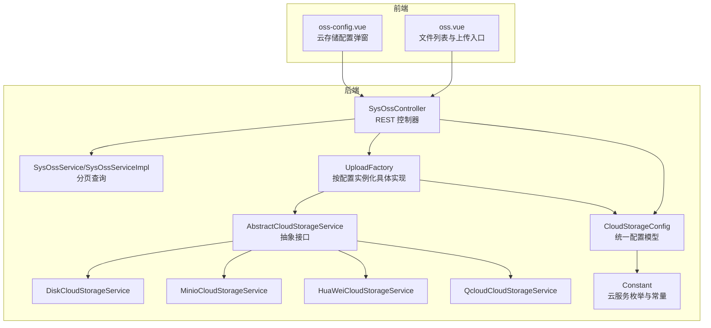
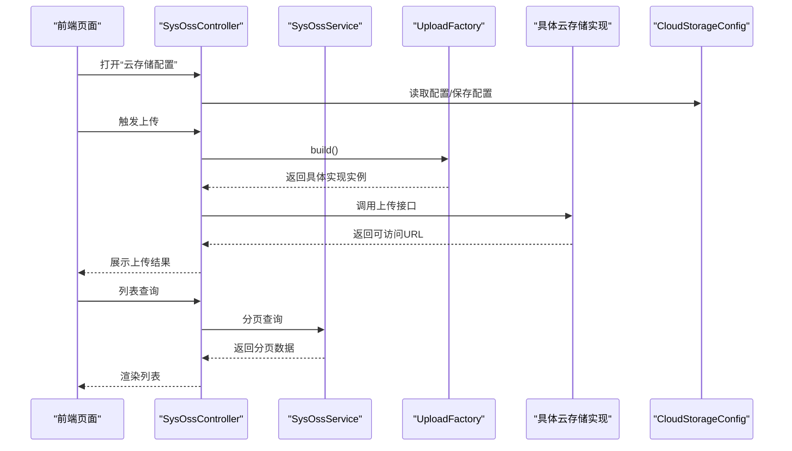
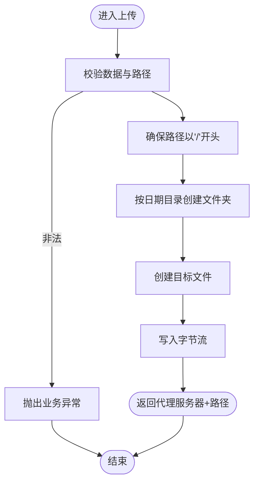
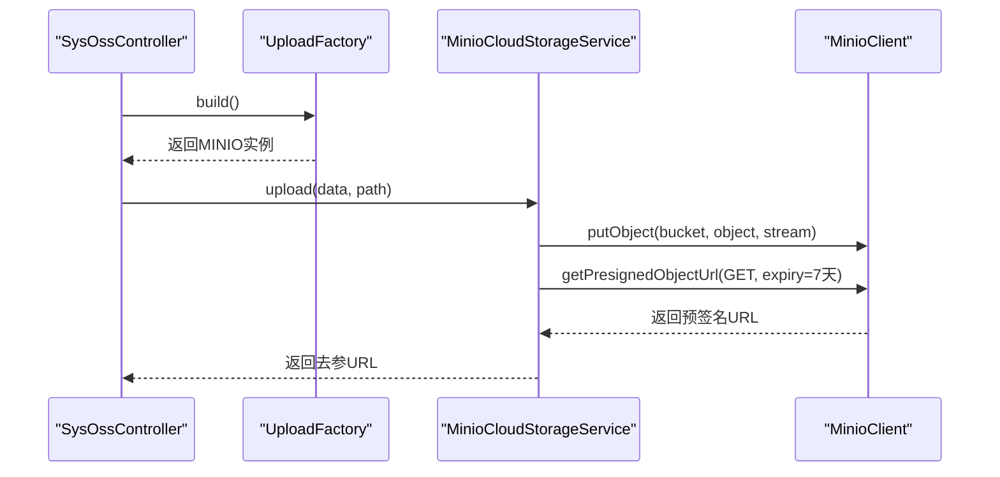
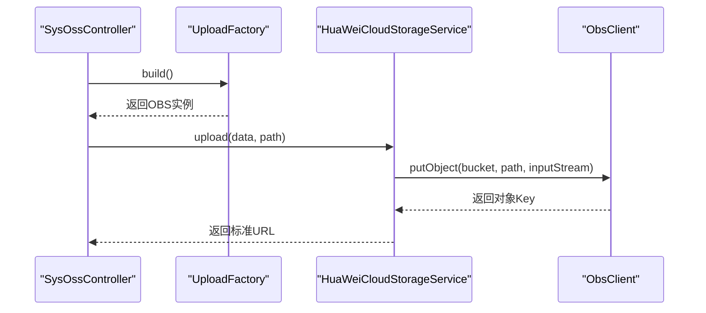
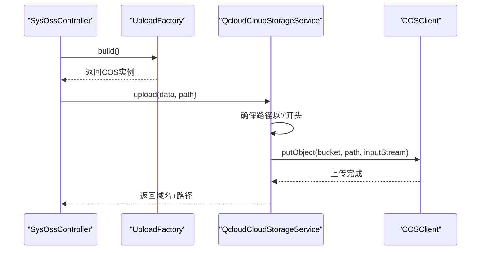
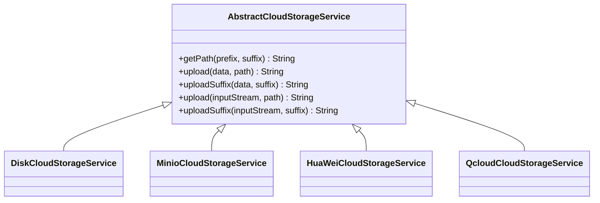
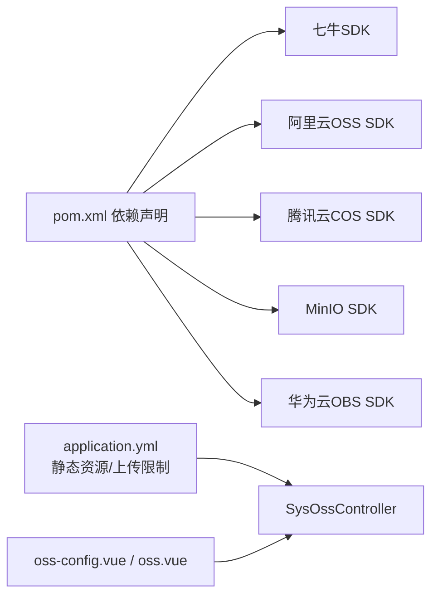

# 其他云存储服务

<cite>
**本文引用的文件**
- [AbstractCloudStorageService.java](file://platform-biz/src/main/java/com/platform/modules/oss/cloud/AbstractCloudStorageService.java)
- [DiskCloudStorageService.java](file://platform-biz/src/main/java/com/platform/modules/oss/cloud/DiskCloudStorageService.java)
- [MinioCloudStorageService.java](file://platform-biz/src/main/java/com/platform/modules/oss/cloud/MinioCloudStorageService.java)
- [HuaWeiCloudStorageService.java](file://platform-biz/src/main/java/com/platform/modules/oss/cloud/HuaWeiCloudStorageService.java)
- [QcloudCloudStorageService.java](file://platform-biz/src/main/java/com/platform/modules/oss/cloud/QcloudCloudStorageService.java)
- [UploadFactory.java](file://platform-biz/src/main/java/com/platform/modules/oss/cloud/UploadFactory.java)
- [CloudStorageConfig.java](file://platform-biz/src/main/java/com/platform/modules/oss/cloud/CloudStorageConfig.java)
- [SysOssController.java](file://platform-admin/src/main/java/com/platform/modules/oss/controller/SysOssController.java)
- [SysOssService.java](file://platform-biz/src/main/java/com/platform/modules/oss/service/SysOssService.java)
- [SysOssServiceImpl.java](file://platform-biz/src/main/java/com/platform/modules/oss/service/impl/SysOssServiceImpl.java)
- [SysOssEntity.java](file://platform-biz/src/main/java/com/platform/modules/oss/entity/SysOssEntity.java)
- [Constant.java](file://platform-common/src/main/java/com/platform/common/utils/Constant.java)
- [oss-config.vue](file://platform-admin-ui/src/views/modules/oss/oss-config.vue)
- [oss.vue](file://platform-admin-ui/src/views/modules/oss/oss.vue)
- [pom.xml](file://pom.xml)
- [application.yml](file://platform-admin/src/main/resources/application.yml)
</cite>

## 目录
1. [引言](#引言)
2. [项目结构](#项目结构)
3. [核心组件](#核心组件)
4. [架构总览](#架构总览)
5. [详细组件分析](#详细组件分析)
6. [依赖关系分析](#依赖关系分析)
7. [性能与成本考量](#性能与成本考量)
8. [故障排查指南](#故障排查指南)
9. [结论](#结论)
10. [附录](#附录)

## 引言
本文件面向平台的“其他云存储服务”集成能力，系统性梳理并说明以下服务的实现与使用要点：
- 本地磁盘存储（DiskCloudStorageService）
- 自建对象存储（MinioCloudStorageService，S3兼容）
- 华为云对象存储（HuaWeiCloudStorageService，OBS）
- 腾讯云对象存储（QcloudCloudStorageService，COS）

同时提供对比分析、迁移指南与多云策略建议，帮助在不同场景下选择合适的存储方案。

## 项目结构
围绕 OSS 云存储模块，后端采用“抽象接口 + 工厂 + 多实现”的分层设计；前端提供可视化配置与上传界面；系统通过统一配置项持久化存储类型与凭证。

图表来源
- [SysOssController.java:1-139](file://platform-admin/src/main/java/com/platform/modules/oss/controller/SysOssController.java#L1-L139)
- [SysOssService.java:1-43](file://platform-biz/src/main/java/com/platform/modules/oss/service/SysOssService.java#L1-L43)
- [SysOssServiceImpl.java:1-46](file://platform-biz/src/main/java/com/platform/modules/oss/service/impl/SysOssServiceImpl.java#L1-L46)
- [UploadFactory.java:1-59](file://platform-biz/src/main/java/com/platform/modules/oss/cloud/UploadFactory.java#L1-L59)
- [AbstractCloudStorageService.java:1-97](file://platform-biz/src/main/java/com/platform/modules/oss/cloud/AbstractCloudStorageService.java#L1-L97)
- [DiskCloudStorageService.java:1-105](file://platform-biz/src/main/java/com/platform/modules/oss/cloud/DiskCloudStorageService.java#L1-L105)
- [MinioCloudStorageService.java:1-88](file://platform-biz/src/main/java/com/platform/modules/oss/cloud/MinioCloudStorageService.java#L1-L88)
- [HuaWeiCloudStorageService.java:1-73](file://platform-biz/src/main/java/com/platform/modules/oss/cloud/HuaWeiCloudStorageService.java#L1-L73)
- [QcloudCloudStorageService.java:1-94](file://platform-biz/src/main/java/com/platform/modules/oss/cloud/QcloudCloudStorageService.java#L1-L94)
- [CloudStorageConfig.java:1-188](file://platform-biz/src/main/java/com/platform/modules/oss/cloud/CloudStorageConfig.java#L1-L188)
- [Constant.java:180-217](file://platform-common/src/main/java/com/platform/common/utils/Constant.java#L180-L217)
- [oss-config.vue:1-134](file://platform-admin-ui/src/views/modules/oss/oss-config.vue#L1-L134)
- [oss.vue:1-202](file://platform-admin-ui/src/views/modules/oss/oss.vue#L1-L202)

章节来源
- [SysOssController.java:1-139](file://platform-admin/src/main/java/com/platform/modules/oss/controller/SysOssController.java#L1-L139)
- [UploadFactory.java:1-59](file://platform-biz/src/main/java/com/platform/modules/oss/cloud/UploadFactory.java#L1-L59)
- [CloudStorageConfig.java:1-188](file://platform-biz/src/main/java/com/platform/modules/oss/cloud/CloudStorageConfig.java#L1-L188)
- [Constant.java:180-217](file://platform-common/src/main/java/com/platform/common/utils/Constant.java#L180-L217)
- [oss-config.vue:1-134](file://platform-admin-ui/src/views/modules/oss/oss-config.vue#L1-L134)
- [oss.vue:1-202](file://platform-admin-ui/src/views/modules/oss/oss.vue#L1-L202)

## 核心组件
- 抽象接口与路径策略
  - 抽象类定义了统一的上传接口族（按字节数组、按 InputStream、按后缀），并提供日期+UUID的路径生成策略，便于跨厂商统一管理文件路径。
- 工厂与配置
  - 工厂根据系统配置中的类型枚举动态构建具体实现；配置模型集中管理各厂商的访问凭据、域名、桶名、地域等。
- 控制器与服务
  - 控制器负责配置保存、校验与分页查询；服务层提供分页查询能力，实体记录上传后的 URL 与元信息。

章节来源
- [AbstractCloudStorageService.java:28-96](file://platform-biz/src/main/java/com/platform/modules/oss/cloud/AbstractCloudStorageService.java#L28-L96)
- [UploadFactory.java:31-56](file://platform-biz/src/main/java/com/platform/modules/oss/cloud/UploadFactory.java#L31-L56)
- [CloudStorageConfig.java:37-187](file://platform-biz/src/main/java/com/platform/modules/oss/cloud/CloudStorageConfig.java#L37-L187)
- [SysOssController.java:78-139](file://platform-admin/src/main/java/com/platform/modules/oss/controller/SysOssController.java#L78-L139)
- [SysOssService.java:33-42](file://platform-biz/src/main/java/com/platform/modules/oss/service/SysOssService.java#L33-L42)
- [SysOssServiceImpl.java:34-45](file://platform-biz/src/main/java/com/platform/modules/oss/service/impl/SysOssServiceImpl.java#L34-L45)
- [SysOssEntity.java:34-57](file://platform-biz/src/main/java/com/platform/modules/oss/entity/SysOssEntity.java#L34-L57)

## 架构总览
整体流程：前端通过控制器读取/保存配置；上传时由工厂按当前配置实例化对应实现，完成对象写入与返回可访问 URL；历史记录通过服务分页展示。

图表来源
- [SysOssController.java:94-139](file://platform-admin/src/main/java/com/platform/modules/oss/controller/SysOssController.java#L94-L139)
- [SysOssService.java:33-42](file://platform-biz/src/main/java/com/platform/modules/oss/service/SysOssService.java#L33-L42)
- [SysOssServiceImpl.java:34-45](file://platform-biz/src/main/java/com/platform/modules/oss/service/impl/SysOssServiceImpl.java#L34-L45)
- [UploadFactory.java:38-56](file://platform-biz/src/main/java/com/platform/modules/oss/cloud/UploadFactory.java#L38-L56)
- [CloudStorageConfig.java:37-187](file://platform-biz/src/main/java/com/platform/modules/oss/cloud/CloudStorageConfig.java#L37-L187)

## 详细组件分析

### 本地磁盘存储（DiskCloudStorageService）
- 设计要点
  - 继承抽象接口，实现基于本地文件系统的上传与访问。
  - 路径策略：强制以斜杠开头，按日期目录组织文件；支持代理服务器回源访问。
  - 输入校验：对空数据与空路径进行防御式检查。
- 本地访问策略
  - 通过配置中的代理服务器地址拼接返回 URL，便于在容器/反向代理环境下统一暴露。
- 错误处理
  - 上传失败统一抛出业务异常，前端可捕获并提示。

图表来源
- [DiskCloudStorageService.java:49-83](file://platform-biz/src/main/java/com/platform/modules/oss/cloud/DiskCloudStorageService.java#L49-L83)

章节来源
- [DiskCloudStorageService.java:35-105](file://platform-biz/src/main/java/com/platform/modules/oss/cloud/DiskCloudStorageService.java#L35-L105)
- [AbstractCloudStorageService.java:47-58](file://platform-biz/src/main/java/com/platform/modules/oss/cloud/AbstractCloudStorageService.java#L47-L58)

### MinioCloudStorageService（自建对象存储，S3兼容）
- 设计要点
  - 基于 MinIO 客户端 SDK，按配置初始化客户端。
  - 上传时将字节流写入桶对象，随后生成带有效期的预签名 URL 返回。
- 适配点
  - 路径前缀策略遵循抽象接口的日期+UUID生成；上传接口支持字节数组与 InputStream。
- 注意事项
  - 预签名 URL 有效期可按需调整；需确保桶策略允许公开读取或正确配置签名策略。

图表来源
- [MinioCloudStorageService.java:41-66](file://platform-biz/src/main/java/com/platform/modules/oss/cloud/MinioCloudStorageService.java#L41-L66)
- [UploadFactory.java:50-51](file://platform-biz/src/main/java/com/platform/modules/oss/cloud/UploadFactory.java#L50-L51)

章节来源
- [MinioCloudStorageService.java:23-88](file://platform-biz/src/main/java/com/platform/modules/oss/cloud/MinioCloudStorageService.java#L23-L88)

### HuaWeiCloudStorageService（华为云 OBS）
- 设计要点
  - 基于华为云 OBS SDK，使用 AK/SK 与 Endpoint 初始化客户端。
  - 上传完成后拼接标准访问 URL 返回，支持路径前缀。
- 适配点
  - 与抽象接口保持一致的上传签名与路径策略；InputStream 与字节数组两种上传入口。

图表来源
- [HuaWeiCloudStorageService.java:35-51](file://platform-biz/src/main/java/com/platform/modules/oss/cloud/HuaWeiCloudStorageService.java#L35-L51)
- [UploadFactory.java:52-53](file://platform-biz/src/main/java/com/platform/modules/oss/cloud/UploadFactory.java#L52-L53)

章节来源
- [HuaWeiCloudStorageService.java:20-73](file://platform-biz/src/main/java/com/platform/modules/oss/cloud/HuaWeiCloudStorageService.java#L20-L73)

### QcloudCloudStorageService（腾讯云 COS）
- 设计要点
  - 基于 COS SDK，使用 SecretId/SecretKey 与地域初始化客户端。
  - 上传路径强制以斜杠开头，便于 COS 对象键规范；支持路径前缀。
- 适配点
  - 与抽象接口一致的后缀生成策略；返回 URL 拼接自定义域名与路径。

图表来源
- [QcloudCloudStorageService.java:67-82](file://platform-biz/src/main/java/com/platform/modules/oss/cloud/QcloudCloudStorageService.java#L67-L82)
- [UploadFactory.java:46-47](file://platform-biz/src/main/java/com/platform/modules/oss/cloud/UploadFactory.java#L46-L47)

章节来源
- [QcloudCloudStorageService.java:40-94](file://platform-biz/src/main/java/com/platform/modules/oss/cloud/QcloudCloudStorageService.java#L40-L94)

### 抽象接口与工厂
- 抽象接口
  - 统一上传签名：按字节数组、按 InputStream、按后缀；提供日期+UUID 的路径生成策略。
- 工厂
  - 依据系统配置中的类型枚举，返回对应实现；若类型不匹配则返回空。

图表来源
- [AbstractCloudStorageService.java:34-96](file://platform-biz/src/main/java/com/platform/modules/oss/cloud/AbstractCloudStorageService.java#L34-L96)
- [DiskCloudStorageService.java:35-105](file://platform-biz/src/main/java/com/platform/modules/oss/cloud/DiskCloudStorageService.java#L35-L105)
- [MinioCloudStorageService.java:23-88](file://platform-biz/src/main/java/com/platform/modules/oss/cloud/MinioCloudStorageService.java#L23-L88)
- [HuaWeiCloudStorageService.java:20-73](file://platform-biz/src/main/java/com/platform/modules/oss/cloud/HuaWeiCloudStorageService.java#L20-L73)
- [QcloudCloudStorageService.java:40-94](file://platform-biz/src/main/java/com/platform/modules/oss/cloud/QcloudCloudStorageService.java#L40-L94)

章节来源
- [AbstractCloudStorageService.java:28-96](file://platform-biz/src/main/java/com/platform/modules/oss/cloud/AbstractCloudStorageService.java#L28-L96)
- [UploadFactory.java:31-56](file://platform-biz/src/main/java/com/platform/modules/oss/cloud/UploadFactory.java#L31-L56)

## 依赖关系分析
- 外部 SDK 依赖
  - 七牛、阿里云、腾讯云、MinIO、华为云 OBS 的官方 SDK 均已在根 POM 中声明。
- 运行环境
  - 后端应用通过 Spring 配置启用静态资源映射与文件上传大小限制，前端通过 Vue 组件提供配置与上传界面。

图表来源
- [pom.xml:255-286](file://pom.xml#L255-L286)
- [application.yml:76-80](file://platform-admin/src/main/resources/application.yml#L76-L80)
- [SysOssController.java:54-56](file://platform-admin/src/main/java/com/platform/modules/oss/controller/SysOssController.java#L54-L56)

章节来源
- [pom.xml:255-286](file://pom.xml#L255-L286)
- [application.yml:76-80](file://platform-admin/src/main/resources/application.yml#L76-L80)

## 性能与成本考量
- 本地磁盘
  - 优点：部署简单、延迟低、成本低。
  - 限制：单机扩展性差、无冗余备份、需自行处理扩容与高可用。
- MinIO（自建 S3）
  - 优点：与 S3 兼容、可水平扩展、成本可控。
  - 注意：需运维与容量规划，网络与安全策略需完善。
- 华为云 OBS
  - 优点：企业级稳定性与合规性较好，国内节点覆盖广。
  - 成本：按量付费，适合稳定业务。
- 腾讯云 COS
  - 优点：生态完善、CDN/边缘节点丰富。
  - 成本：按请求/流量计费，适合互联网业务。

说明：本节为通用指导，不涉及具体代码实现细节。

## 故障排查指南
- 常见问题定位
  - 上传失败：检查配置项是否完整、凭证是否正确、桶/路径是否存在、网络连通性。
  - URL 无法访问：确认域名/代理服务器配置、CORS/权限策略、预签名 URL 有效期。
  - 本地磁盘：确认磁盘路径可写、目录权限、代理服务器可达。
- 建议排查步骤
  - 在控制器层打印配置与路径；在实现类中捕获并记录异常；通过服务分页查看历史记录与 URL。
- 监控与日志
  - 前端复制 URL 与图片预览按钮可用于快速验证；后端异常统一抛出业务异常，便于前端提示。

章节来源
- [SysOssController.java:94-139](file://platform-admin/src/main/java/com/platform/modules/oss/controller/SysOssController.java#L94-L139)
- [SysOssServiceImpl.java:34-45](file://platform-biz/src/main/java/com/platform/modules/oss/service/impl/SysOssServiceImpl.java#L34-L45)
- [DiskCloudStorageService.java:77-82](file://platform-biz/src/main/java/com/platform/modules/oss/cloud/DiskCloudStorageService.java#L77-L82)
- [MinioCloudStorageService.java:62-65](file://platform-biz/src/main/java/com/platform/modules/oss/cloud/MinioCloudStorageService.java#L62-L65)
- [HuaWeiCloudStorageService.java:47-50](file://platform-biz/src/main/java/com/platform/modules/oss/cloud/HuaWeiCloudStorageService.java#L47-L50)
- [QcloudCloudStorageService.java:79-81](file://platform-biz/src/main/java/com/platform/modules/oss/cloud/QcloudCloudStorageService.java#L79-L81)

## 结论
该模块通过抽象接口与工厂模式实现了对多家云存储的统一接入，既保证了扩展性，又维持了配置与调用的一致性。结合前端配置与上传界面，可在不改动业务代码的前提下切换存储后端。建议在生产环境中优先考虑具备高可用与合规性的托管对象存储，并结合 CDN 与监控体系保障稳定性与可观测性。

## 附录

### 各云存储服务对比与适用场景
- 本地磁盘
  - 适用：开发测试、小规模内部系统、对延迟敏感且无需跨节点共享。
- MinIO
  - 适用：自建对象存储、S3 兼容需求、需要灵活扩展与成本控制的企业。
- 华为云 OBS
  - 适用：国内合规要求较高、需要企业级服务与国内节点的业务。
- 腾讯云 COS
  - 适用：依托腾讯生态、需要 CDN/边缘加速与丰富工具链的互联网应用。

说明：本节为概念性总结，不直接分析具体文件。

### 迁移指南与多云策略
- 迁移步骤
  - 在前端配置界面切换存储类型并填入新厂商的配置项。
  - 通过控制器保存配置；如需保留历史文件访问，确保新旧 URL 访问策略一致或提供重定向。
- 多云策略
  - 可按地域/业务线拆分桶，或采用“主+备”策略：主用托管对象存储，备用本地或另一家云存储；通过工厂按环境变量/开关切换。

章节来源
- [oss-config.vue:9-127](file://platform-admin-ui/src/views/modules/oss/oss-config.vue#L9-L127)
- [SysOssController.java:112-139](file://platform-admin/src/main/java/com/platform/modules/oss/controller/SysOssController.java#L112-L139)
- [UploadFactory.java:38-56](file://platform-biz/src/main/java/com/platform/modules/oss/cloud/UploadFactory.java#L38-L56)