# 存储服务集成

<cite>
**本文引用的文件**   
- [AbstractCloudStorageService.java](file://platform-biz/src/main/java/com/platform/modules/oss/cloud/AbstractCloudStorageService.java)
- [CloudStorageConfig.java](file://platform-biz/src/main/java/com/platform/modules/oss/cloud/CloudStorageConfig.java)
- [QiniuCloudStorageService.java](file://platform-biz/src/main/java/com/platform/modules/oss/cloud/QiniuCloudStorageService.java)
- [AliyunCloudStorageService.java](file://platform-biz/src/main/java/com/platform/modules/oss/cloud/AliyunCloudStorageService.java)
- [QcloudCloudStorageService.java](file://platform-biz/src/main/java/com/platform/modules/oss/cloud/QcloudCloudStorageService.java)
- [DiskCloudStorageService.java](file://platform-biz/src/main/java/com/platform/modules/oss/cloud/DiskCloudStorageService.java)
- [MinioCloudStorageService.java](file://platform-biz/src/main/java/com/platform/modules/oss/cloud/MinioCloudStorageService.java)
- [HuaWeiCloudStorageService.java](file://platform-biz/src/main/java/com/platform/modules/oss/cloud/HuaWeiCloudStorageService.java)
- [SysOssController.java](file://platform-admin/src/main/java/com/platform/modules/oss/controller/SysOssController.java)
- [SysOssService.java](file://platform-biz/src/main/java/com/platform/modules/oss/service/SysOssService.java)
- [base.sql](file://_sql/base.sql)
- [pom.xml](file://pom.xml)
- [oss-config.vue](file://platform-admin-ui/src/views/modules/oss/oss-config.vue)
- [oss.vue](file://platform-admin-ui/src/views/modules/oss/oss.vue)
- [webuploader.custom.js](file://platform-admin-ui/static/ueditor/third-party/webuploader/webuploader.custom.js)
</cite>

## 目录
1. [简介](#简介)
2. [项目结构](#项目结构)
3. [核心组件](#核心组件)
4. [架构总览](#架构总览)
5. [详细组件分析](#详细组件分析)
6. [依赖分析](#依赖分析)
7. [性能考虑](#性能考虑)
8. [故障排查指南](#故障排查指南)
9. [结论](#结论)
10. [附录](#附录)

## 简介
本文件系统性阐述平台的存储服务集成方案，覆盖抽象存储服务设计、多云平台适配（七牛、阿里云、腾讯云、MINIO、华为云）、本地磁盘存储、配置管理、访问权限控制、文件安全、上传流程与分片断点续传、图片处理与CDN加速、文件压缩、成本优化、备份与迁移最佳实践。目标是帮助开发者快速理解并扩展新的云存储或自建对象存储能力。

## 项目结构
围绕“存储服务”主题，核心代码分布在以下模块与目录：
- 平台后端（Java）：platform-biz 提供抽象与各云实现；platform-admin 提供存储配置与上传接口；platform-admin-ui 提供前端配置与上传界面。
- 数据库：_sql/base.sql 定义 SYS_OSS 表用于记录上传文件元数据。
- 构建脚本：pom.xml 引入各云SDK依赖。

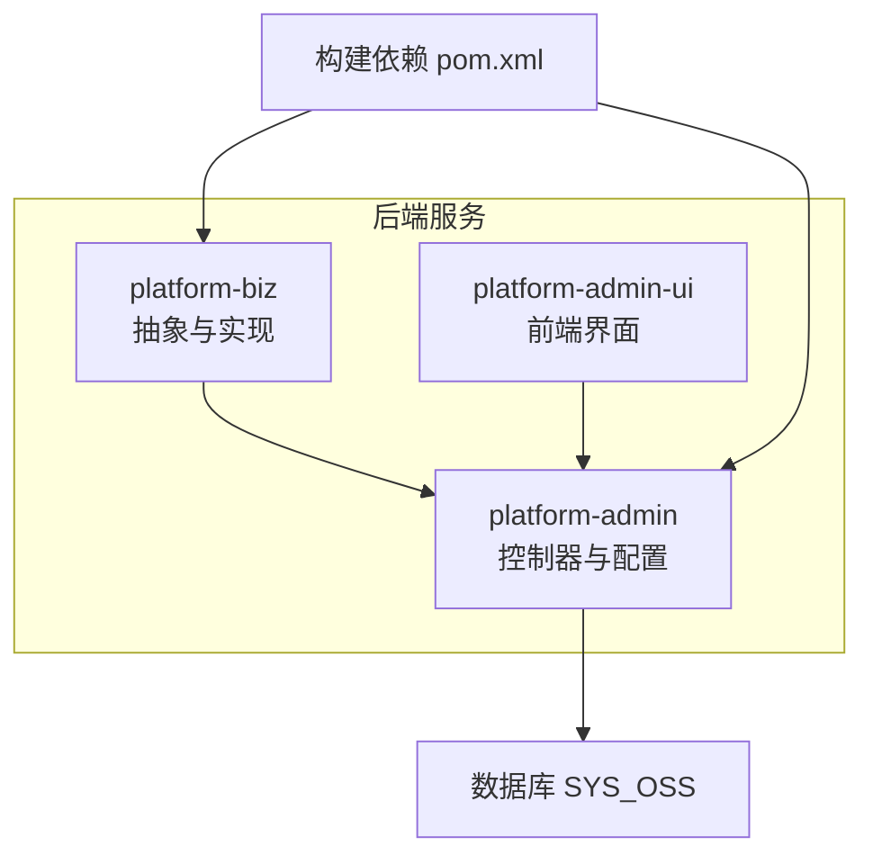

**图表来源**
- [SysOssController.java:1-139](file://platform-admin/src/main/java/com/platform/modules/oss/controller/SysOssController.java#L1-L139)
- [base.sql:624-634](file://_sql/base.sql#L624-L634)
- [pom.xml:255-286](file://pom.xml#L255-L286)

**章节来源**
- [SysOssController.java:1-139](file://platform-admin/src/main/java/com/platform/modules/oss/controller/SysOssController.java#L1-L139)
- [base.sql:624-634](file://_sql/base.sql#L624-L634)
- [pom.xml:255-286](file://pom.xml#L255-L286)

## 核心组件
- 抽象层：AbstractCloudStorageService 定义统一上传接口与路径生成策略。
- 配置模型：CloudStorageConfig 统一封装各云所需参数，并按云类型启用不同校验组。
- 实现层：针对七牛、阿里云、腾讯云、MINIO、华为云、本地磁盘分别提供独立实现类。
- 控制器：SysOssController 提供配置查询/保存、文件列表查询、上传入口。
- 服务接口：SysOssService 定义文件记录的分页查询能力。
- 前端：oss-config.vue 与 oss.vue 提供配置表单与文件列表展示。
- 上传客户端：UEditor WebUploader（webuploader.custom.js）支持分片、断点续传与重试。

**章节来源**
- [AbstractCloudStorageService.java:28-96](file://platform-biz/src/main/java/com/platform/modules/oss/cloud/AbstractCloudStorageService.java#L28-L96)
- [CloudStorageConfig.java:37-187](file://platform-biz/src/main/java/com/platform/modules/oss/cloud/CloudStorageConfig.java#L37-L187)
- [SysOssController.java:78-139](file://platform-admin/src/main/java/com/platform/modules/oss/controller/SysOssController.java#L78-L139)
- [SysOssService.java:33-42](file://platform-biz/src/main/java/com/platform/modules/oss/service/SysOssService.java#L33-L42)
- [oss-config.vue:136-178](file://platform-admin-ui/src/views/modules/oss/oss-config.vue#L136-L178)
- [oss.vue:86-150](file://platform-admin-ui/src/views/modules/oss/oss.vue#L86-L150)
- [webuploader.custom.js:3287-3484](file://platform-admin-ui/static/ueditor/third-party/webuploader/webuploader.custom.js#L3287-L3484)

## 架构总览
整体采用“抽象+工厂/选择”的扩展方式：后端通过 CloudStorageConfig.type 决定具体实现，调用统一的上传接口完成文件写入与URL返回。前端通过配置页面保存配置，后端在业务逻辑中按需实例化对应云存储服务。

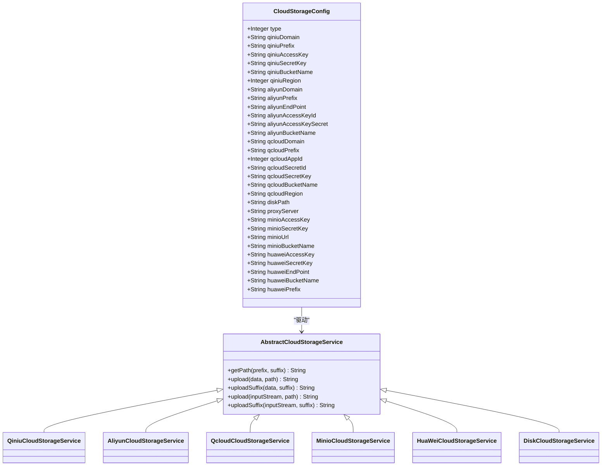

**图表来源**
- [AbstractCloudStorageService.java:34-96](file://platform-biz/src/main/java/com/platform/modules/oss/cloud/AbstractCloudStorageService.java#L34-L96)
- [CloudStorageConfig.java:37-187](file://platform-biz/src/main/java/com/platform/modules/oss/cloud/CloudStorageConfig.java#L37-L187)
- [QiniuCloudStorageService.java:38-88](file://platform-biz/src/main/java/com/platform/modules/oss/cloud/QiniuCloudStorageService.java#L38-L88)
- [AliyunCloudStorageService.java:34-73](file://platform-biz/src/main/java/com/platform/modules/oss/cloud/AliyunCloudStorageService.java#L34-L73)
- [QcloudCloudStorageService.java:40-93](file://platform-biz/src/main/java/com/platform/modules/oss/cloud/QcloudCloudStorageService.java#L40-L93)
- [MinioCloudStorageService.java:23-87](file://platform-biz/src/main/java/com/platform/modules/oss/cloud/MinioCloudStorageService.java#L23-L87)
- [HuaWeiCloudStorageService.java:20-72](file://platform-biz/src/main/java/com/platform/modules/oss/cloud/HuaWeiCloudStorageService.java#L20-L72)
- [DiskCloudStorageService.java:36-104](file://platform-biz/src/main/java/com/platform/modules/oss/cloud/DiskCloudStorageService.java#L36-L104)

## 详细组件分析

### 抽象存储服务与路径策略
- 抽象类定义统一上传接口族，便于替换与扩展。
- 路径生成策略：基于日期与UUID生成唯一路径，支持前缀拼接，确保多租户/多业务隔离。
- 上传返回值：统一返回可访问URL，屏蔽底层差异。

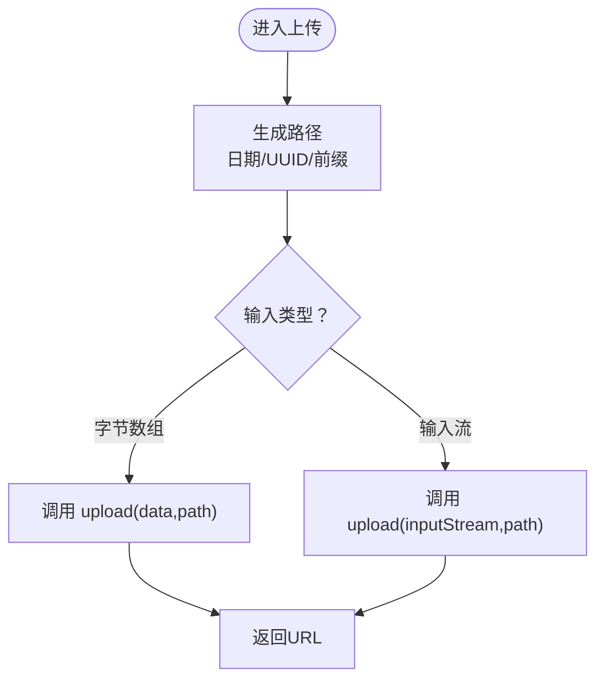

**图表来源**
- [AbstractCloudStorageService.java:47-94](file://platform-biz/src/main/java/com/platform/modules/oss/cloud/AbstractCloudStorageService.java#L47-L94)

**章节来源**
- [AbstractCloudStorageService.java:28-96](file://platform-biz/src/main/java/com/platform/modules/oss/cloud/AbstractCloudStorageService.java#L28-L96)

### 配置模型与校验
- 支持类型：七牛、阿里云、腾讯云、本地磁盘、MINIO、华为云。
- 按类型启用不同校验组，保证关键字段完整与格式正确。
- 域名、前缀、凭证、桶名、地域等参数集中管理，便于切换与运维。

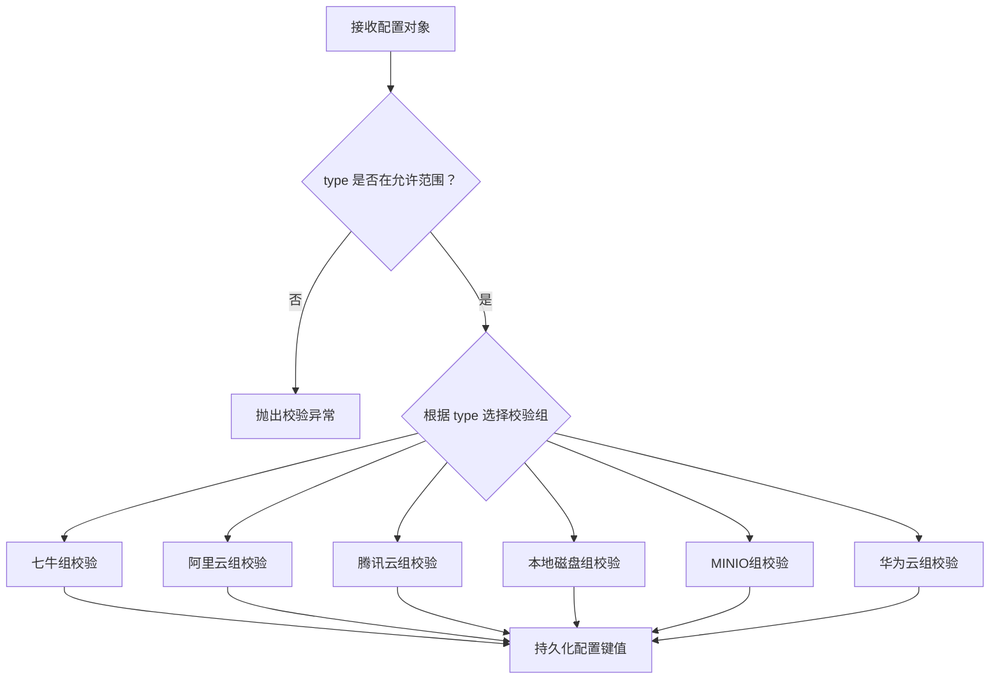

**图表来源**
- [CloudStorageConfig.java:42-187](file://platform-biz/src/main/java/com/platform/modules/oss/cloud/CloudStorageConfig.java#L42-L187)
- [SysOssController.java:112-136](file://platform-admin/src/main/java/com/platform/modules/oss/controller/SysOssController.java#L112-L136)

**章节来源**
- [CloudStorageConfig.java:37-187](file://platform-biz/src/main/java/com/platform/modules/oss/cloud/CloudStorageConfig.java#L37-L187)
- [SysOssController.java:94-139](file://platform-admin/src/main/java/com/platform/modules/oss/controller/SysOssController.java#L94-L139)

### 七牛云存储实现
- 初始化：使用 AccessKey/SecretKey 与 Bucket 名生成上传Token。
- 上传：支持字节数组与输入流；返回绑定域名+路径的URL。
- 错误处理：捕获SDK异常并转换为业务异常，便于统一处理。

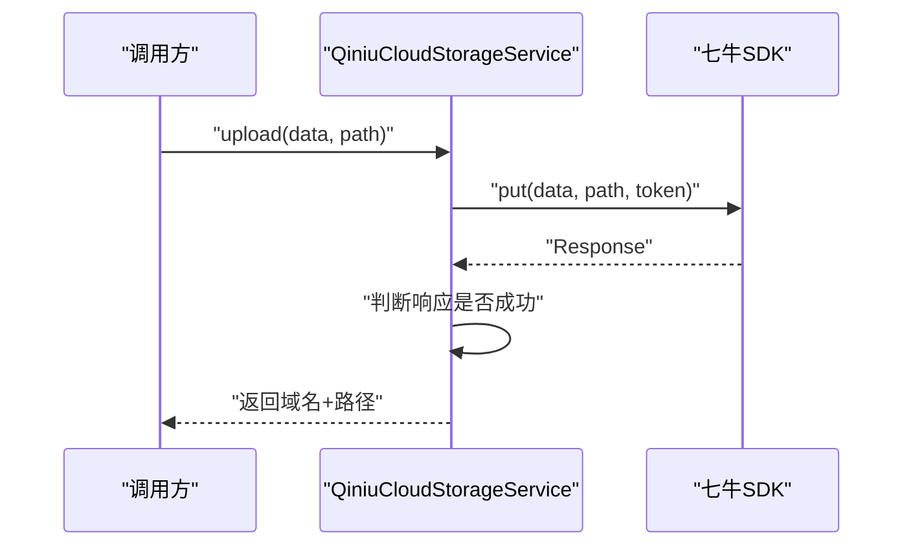

**图表来源**
- [QiniuCloudStorageService.java:55-87](file://platform-biz/src/main/java/com/platform/modules/oss/cloud/QiniuCloudStorageService.java#L55-L87)

**章节来源**
- [QiniuCloudStorageService.java:38-88](file://platform-biz/src/main/java/com/platform/modules/oss/cloud/QiniuCloudStorageService.java#L38-L88)

### 阿里云OSS实现
- 初始化：使用 Endpoint、AccessKeyId/Secret 与默认凭证提供者创建OSSClient。
- 上传：向指定Bucket写入对象；返回域名+路径。
- 错误处理：捕获异常并转换为业务异常。

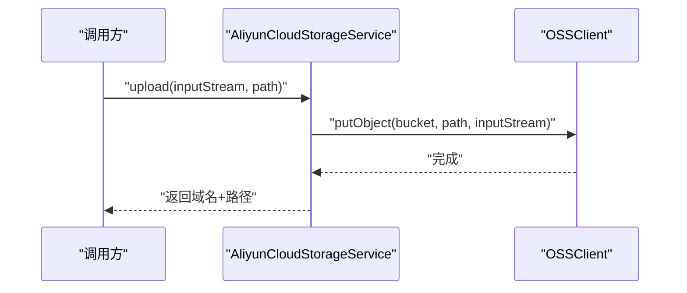

**图表来源**
- [AliyunCloudStorageService.java:53-62](file://platform-biz/src/main/java/com/platform/modules/oss/cloud/AliyunCloudStorageService.java#L53-L62)

**章节来源**
- [AliyunCloudStorageService.java:34-73](file://platform-biz/src/main/java/com/platform/modules/oss/cloud/AliyunCloudStorageService.java#L34-L73)

### 腾讯云COS实现
- 初始化：使用 SecretId/SecretKey 与地域创建COSClient。
- 上传：路径必须以“/”开头；返回域名+路径。
- 错误处理：捕获异常并转换为业务异常。

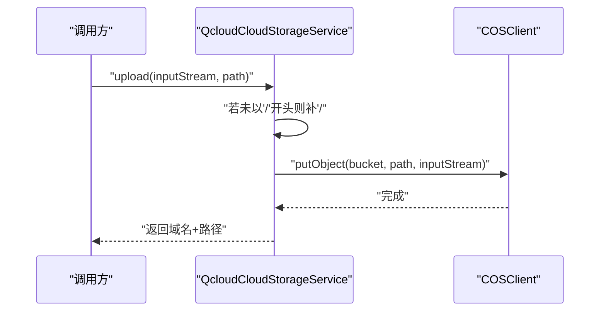

**图表来源**
- [QcloudCloudStorageService.java:67-81](file://platform-biz/src/main/java/com/platform/modules/oss/cloud/QcloudCloudStorageService.java#L67-L81)

**章节来源**
- [QcloudCloudStorageService.java:40-93](file://platform-biz/src/main/java/com/platform/modules/oss/cloud/QcloudCloudStorageService.java#L40-L93)

### 本地磁盘实现
- 初始化：空实现。
- 上传：校验输入；路径以“/”开头；按日期目录创建并写入文件；返回代理服务器+路径。
- 适用场景：开发测试、内网部署或合规要求本地存储。

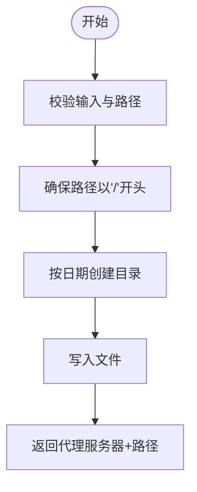

**图表来源**
- [DiskCloudStorageService.java:49-82](file://platform-biz/src/main/java/com/platform/modules/oss/cloud/DiskCloudStorageService.java#L49-L82)

**章节来源**
- [DiskCloudStorageService.java:36-104](file://platform-biz/src/main/java/com/platform/modules/oss/cloud/DiskCloudStorageService.java#L36-L104)

### MINIO实现
- 初始化：使用URL、AccessKey、SecretKey 创建MinioClient。
- 上传：写入对象后生成预签名URL（带有效期），返回去问号后的URL。
- 适用场景：自建对象存储、私有云、S3兼容环境。

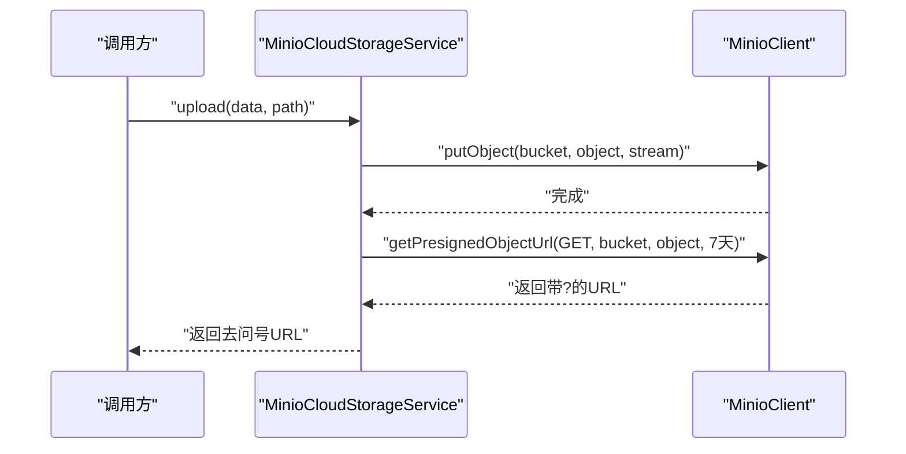

**图表来源**
- [MinioCloudStorageService.java:41-65](file://platform-biz/src/main/java/com/platform/modules/oss/cloud/MinioCloudStorageService.java#L41-L65)

**章节来源**
- [MinioCloudStorageService.java:23-87](file://platform-biz/src/main/java/com/platform/modules/oss/cloud/MinioCloudStorageService.java#L23-L87)

### 华为云OBS实现
- 初始化：使用 AK/SK 与 Endpoint 创建ObsClient。
- 上传：返回标准访问URL（桶+域名+对象键）。
- 适用场景：企业级对象存储、合规与安全要求高。

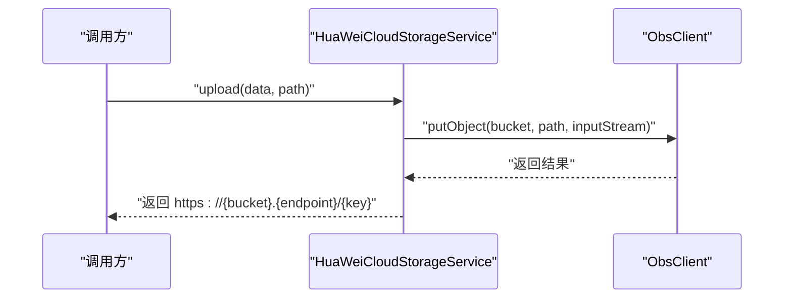

**图表来源**
- [HuaWeiCloudStorageService.java:35-50](file://platform-biz/src/main/java/com/platform/modules/oss/cloud/HuaWeiCloudStorageService.java#L35-L50)

**章节来源**
- [HuaWeiCloudStorageService.java:20-72](file://platform-biz/src/main/java/com/platform/modules/oss/cloud/HuaWeiCloudStorageService.java#L20-L72)

### 控制器与服务接口
- SysOssController 提供：
  - 查询当前配置与保存配置（含按类型分组校验）。
  - 分页查询文件列表（结合SysOssService）。
- SysOssService 定义分页查询接口，配合MyBatis-Plus实现。

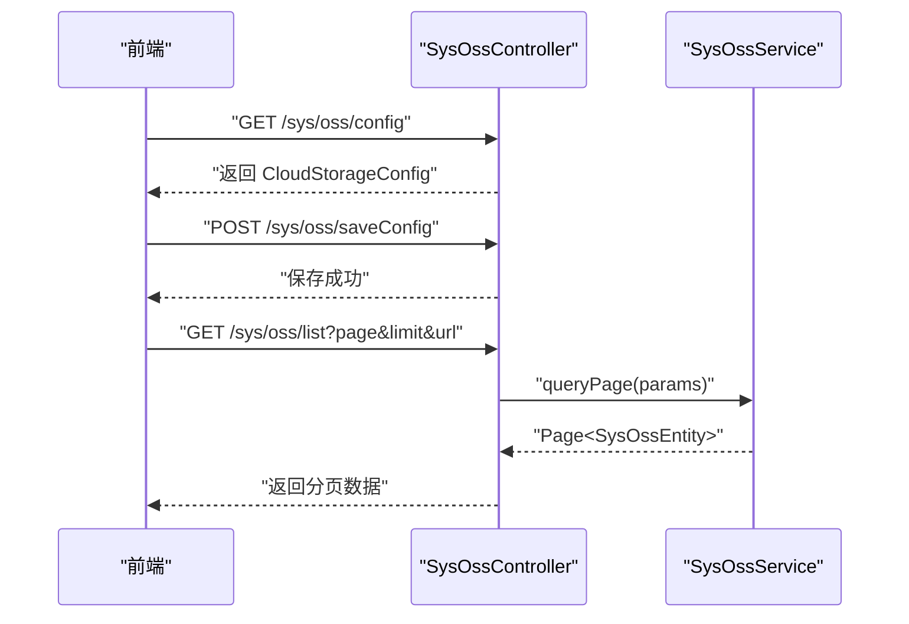

**图表来源**
- [SysOssController.java:78-139](file://platform-admin/src/main/java/com/platform/modules/oss/controller/SysOssController.java#L78-L139)
- [SysOssService.java:33-42](file://platform-biz/src/main/java/com/platform/modules/oss/service/SysOssService.java#L33-L42)

**章节来源**
- [SysOssController.java:78-139](file://platform-admin/src/main/java/com/platform/modules/oss/controller/SysOssController.java#L78-L139)
- [SysOssService.java:33-42](file://platform-biz/src/main/java/com/platform/modules/oss/service/SysOssService.java#L33-L42)

### 前端配置与文件列表
- oss-config.vue：拉取配置并提交保存，使用REST接口与后端交互。
- oss.vue：分页查询文件列表，支持复制URL等操作。

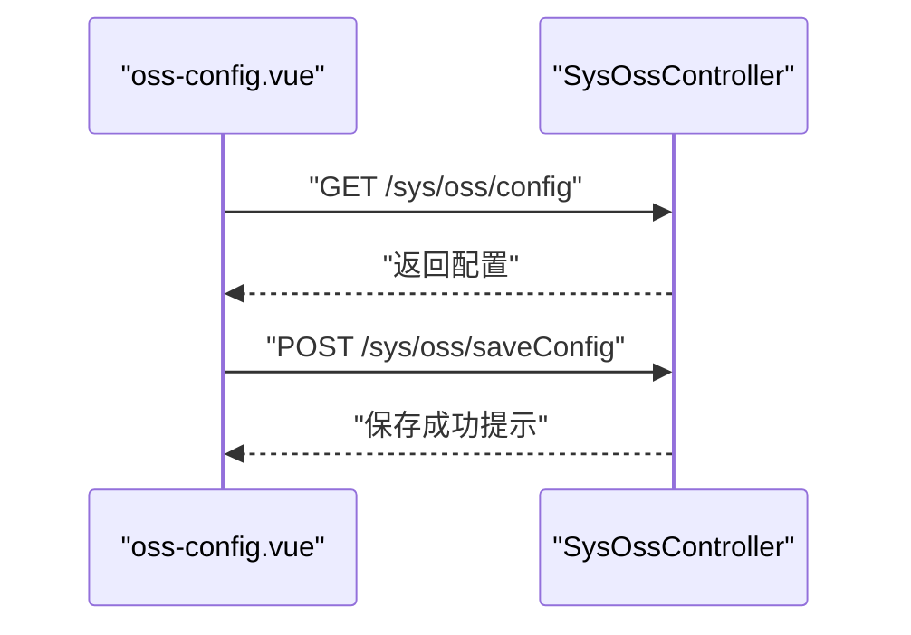

**图表来源**
- [oss-config.vue:136-178](file://platform-admin-ui/src/views/modules/oss/oss-config.vue#L136-L178)
- [SysOssController.java:94-139](file://platform-admin/src/main/java/com/platform/modules/oss/controller/SysOssController.java#L94-L139)

**章节来源**
- [oss-config.vue:136-178](file://platform-admin-ui/src/views/modules/oss/oss-config.vue#L136-L178)
- [oss.vue:86-150](file://platform-admin-ui/src/views/modules/oss/oss.vue#L86-L150)

### 上传流程、分片与断点续传
- 前端使用 WebUploader（webuploader.custom.js）进行分片上传与断点续传。
- 分片策略：按块切片、并发池、剩余计数、重试次数控制。
- 重试机制：网络/服务端错误自动重试，最终失败触发上传错误事件。

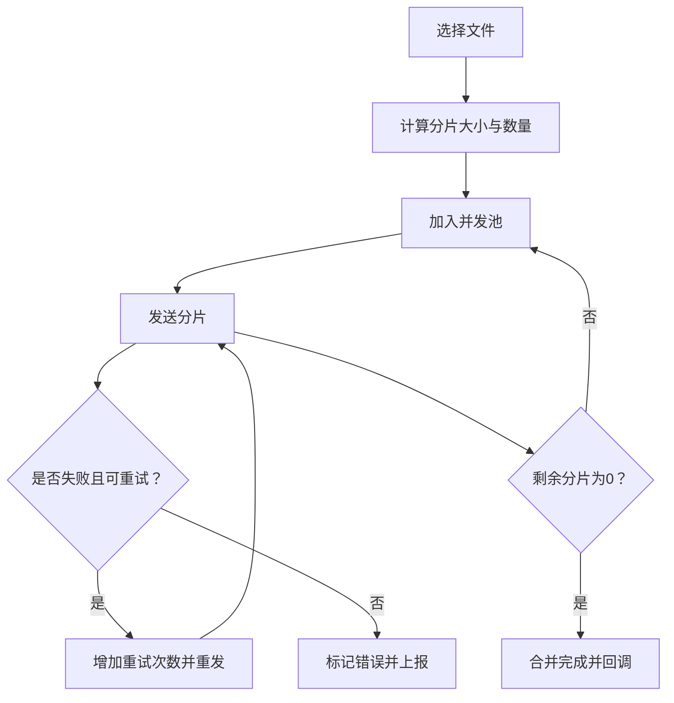

**图表来源**
- [webuploader.custom.js:3287-3484](file://platform-admin-ui/static/ueditor/third-party/webuploader/webuploader.custom.js#L3287-L3484)

**章节来源**
- [webuploader.custom.js:3287-3484](file://platform-admin-ui/static/ueditor/third-party/webuploader/webuploader.custom.js#L3287-L3484)

## 依赖分析
- Maven 依赖：引入七牛、阿里云OSS、腾讯云COS、MINIO、华为云OBS SDK。
- 运行时耦合：各实现类仅依赖各自SDK；抽象层与配置模型解耦，便于新增/替换。

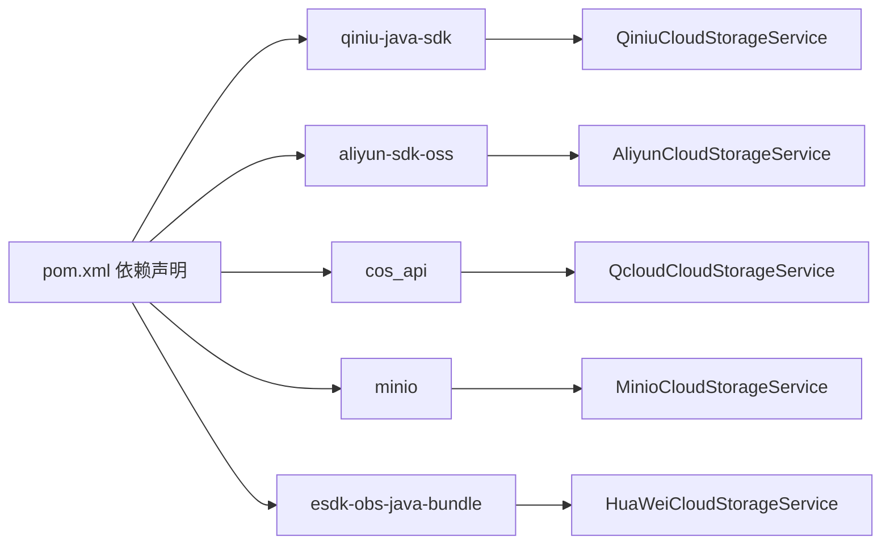

**图表来源**
- [pom.xml:255-286](file://pom.xml#L255-L286)

**章节来源**
- [pom.xml:255-286](file://pom.xml#L255-L286)

## 性能考虑
- 分片上传：大文件分片降低单次传输失败风险，提升吞吐与稳定性。
- CDN加速：各云均支持域名回源，建议在云平台开启CDN缓存策略。
- 图片处理：可在云平台配置图片样式/缩略图规则，前端按需拼接URL。
- 文件压缩：上传前可进行压缩（如WebP/JPEG质量调整），减少带宽与存储成本。
- 成本优化：冷热分层、生命周期策略、跨区域复制与版本控制，结合业务选择合适存储类型与保留策略。

## 故障排查指南
- 配置校验失败：检查 CloudStorageConfig 对应分组字段是否填写完整与格式正确。
- 上传异常：查看对应云实现类的异常捕获与业务异常转换，定位SDK报错原因。
- 路径问题：腾讯云与本地磁盘实现对路径前缀有特殊要求（必须以“/”开头），需确保生成路径符合规范。
- 前端分片失败：关注WebUploader的重试与错误事件，确认网络与服务端状态码。

**章节来源**
- [SysOssController.java:112-139](file://platform-admin/src/main/java/com/platform/modules/oss/controller/SysOssController.java#L112-L139)
- [QcloudCloudStorageService.java:69-72](file://platform-biz/src/main/java/com/platform/modules/oss/cloud/QcloudCloudStorageService.java#L69-L72)
- [DiskCloudStorageService.java:54-57](file://platform-biz/src/main/java/com/platform/modules/oss/cloud/DiskCloudStorageService.java#L54-L57)
- [webuploader.custom.js:3448-3484](file://platform-admin-ui/static/ueditor/third-party/webuploader/webuploader.custom.js#L3448-L3484)

## 结论
该存储服务集成以抽象类为核心，通过配置驱动实现多云/本地存储的统一接入。结合前端分片与断点续传能力，满足大文件与高可用场景需求。建议在生产环境中配合CDN、图片处理、生命周期策略与备份迁移方案，持续优化成本与可靠性。

## 附录
- 数据库表：SYS_OSS 记录上传文件URL与创建信息，便于检索与管理。
- 前端界面：oss-config.vue 与 oss.vue 提供配置与列表管理入口。

**章节来源**
- [base.sql:624-634](file://_sql/base.sql#L624-L634)
- [oss-config.vue:136-178](file://platform-admin-ui/src/views/modules/oss/oss-config.vue#L136-L178)
- [oss.vue:86-150](file://platform-admin-ui/src/views/modules/oss/oss.vue#L86-L150)