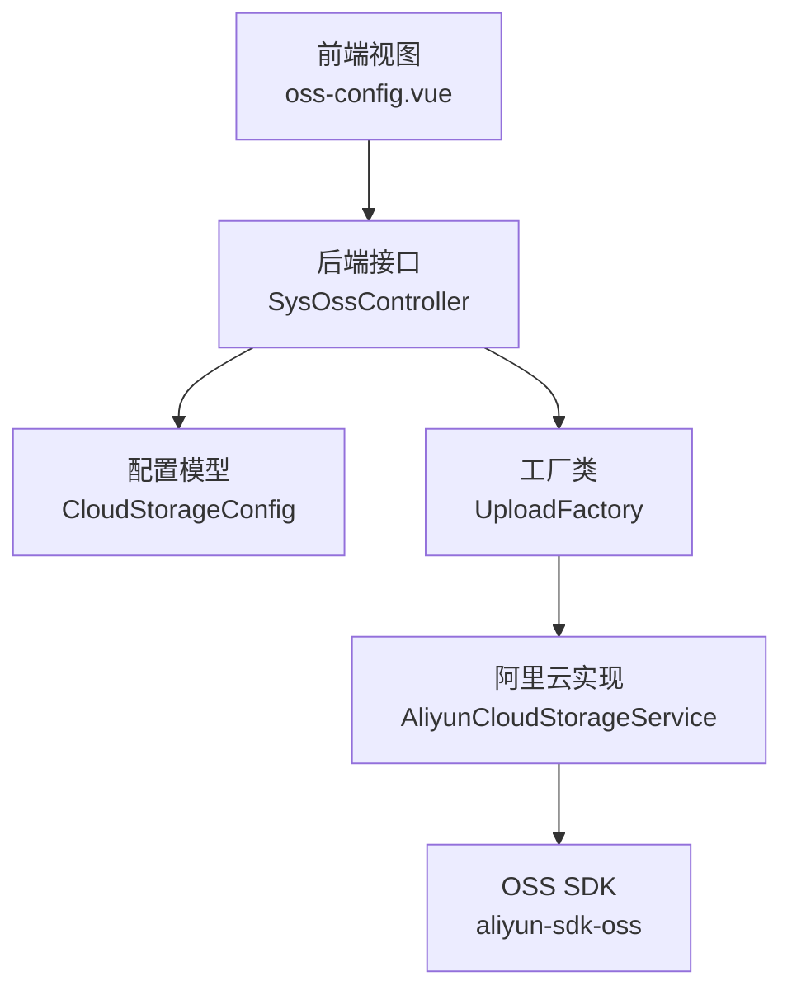
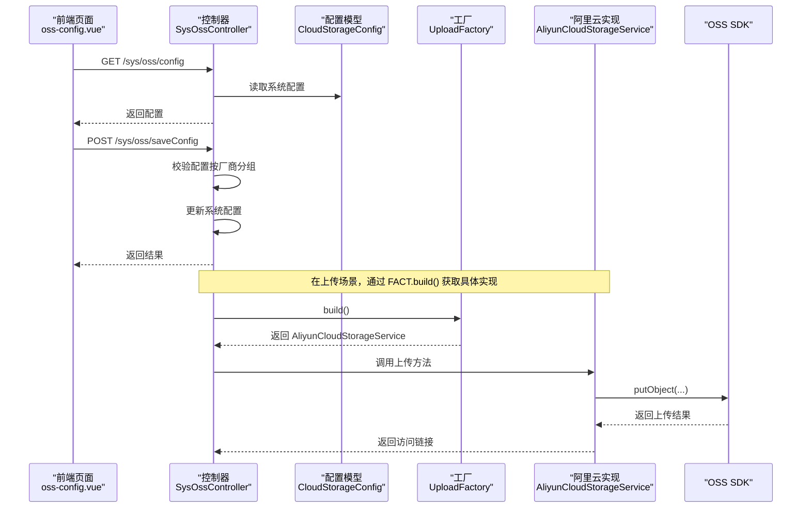
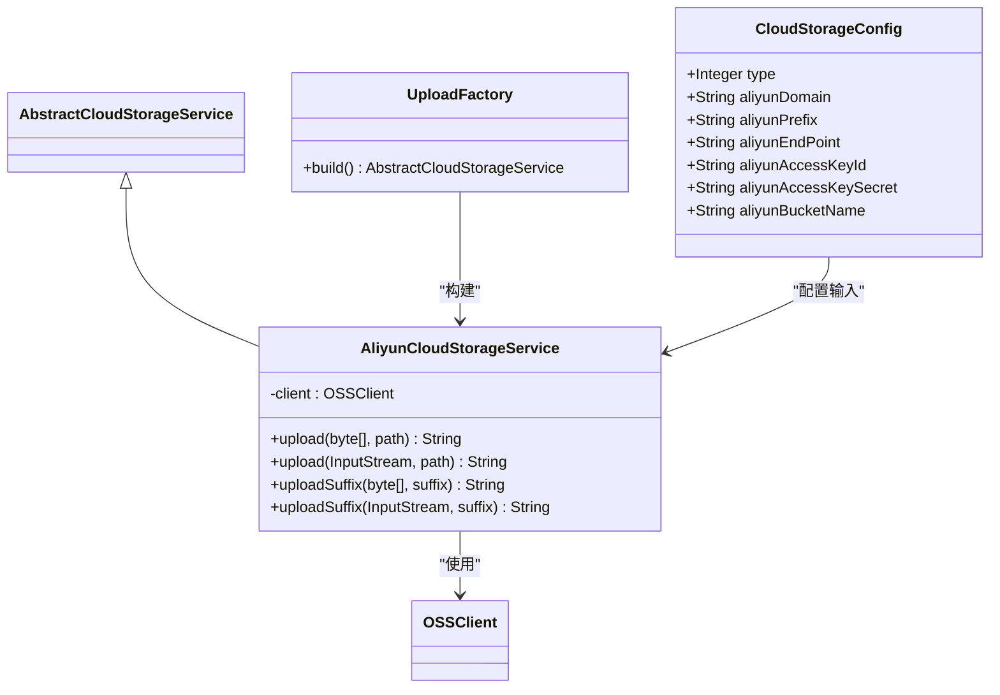
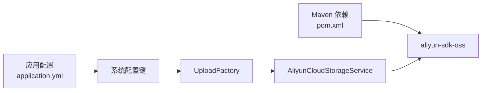

# 阿里云OSS集成

<cite>
**本文引用的文件**
- [pom.xml](file://pom.xml)
- [application.yml](file://platform-admin/src/main/resources/application.yml)
- [SysOssController.java](file://platform-admin/src/main/java/com/platform/modules/oss/controller/SysOssController.java)
- [CloudStorageConfig.java](file://platform-biz/src/main/java/com/platform/modules/oss/cloud/CloudStorageConfig.java)
- [UploadFactory.java](file://platform-biz/src/main/java/com/platform/modules/oss/cloud/UploadFactory.java)
- [AliyunCloudStorageService.java](file://platform-biz/src/main/java/com/platform/modules/oss/cloud/AliyunCloudStorageService.java)
- [AliyunGroup.java](file://platform-biz/src/main/java/com/platform/common/validator/group/AliyunGroup.java)
- [oss-config.vue](file://platform-admin-ui/src/views/modules/oss/oss-config.vue)
</cite>

## 目录
1. [简介](#简介)
2. [项目结构](#项目结构)
3. [核心组件](#核心组件)
4. [架构总览](#架构总览)
5. [组件详解](#组件详解)
6. [依赖关系分析](#依赖关系分析)
7. [性能与成本优化](#性能与成本优化)
8. [故障排查指南](#故障排查指南)
9. [结论](#结论)
10. [附录](#附录)

## 简介
本文件面向阿里云对象存储服务（OSS）在平台中的集成实现，围绕以下目标展开：
- 详述 AliyunCloudStorageService 的实现细节，包括 SDK 初始化、认证配置与连接管理
- 解释阿里云 OSS 的配置参数（Endpoint、BucketName、AccessKey 等）
- 提供文件上传实现说明（简单上传、分片上传与断点续传能力现状与扩展建议）
- 介绍阿里云 OSS 的高级功能（图片处理、CDN 加速、生命周期管理）与安全策略
- 给出性能优化与成本控制策略

## 项目结构
与阿里云 OSS 集成相关的关键模块分布如下：
- 前端配置界面：oss-config.vue，用于维护阿里云配置参数
- 后端控制器：SysOssController，提供配置读取与保存接口
- 配置模型：CloudStorageConfig，统一承载各云厂商配置
- 工厂与适配：UploadFactory，根据配置动态选择具体云服务实现
- 阿里云实现：AliyunCloudStorageService，封装 OSS SDK 的上传流程
- 校验分组：AliyunGroup，配合 Bean 校验保证阿里云配置合法性

图表来源
- [oss-config.vue:1-180](file://platform-admin-ui/src/views/modules/oss/oss-config.vue#L1-L180)
- [SysOssController.java:94-139](file://platform-admin/src/main/java/com/platform/modules/oss/controller/SysOssController.java#L94-L139)
- [CloudStorageConfig.java:38-114](file://platform-biz/src/main/java/com/platform/modules/oss/cloud/CloudStorageConfig.java#L38-L114)
- [UploadFactory.java:38-56](file://platform-biz/src/main/java/com/platform/modules/oss/cloud/UploadFactory.java#L38-L56)
- [AliyunCloudStorageService.java:34-73](file://platform-biz/src/main/java/com/platform/modules/oss/cloud/AliyunCloudStorageService.java#L34-L73)

章节来源
- [pom.xml:261-264](file://pom.xml#L261-L264)
- [application.yml:1-205](file://platform-admin/src/main/resources/application.yml#L1-L205)

## 核心组件
- 阿里云配置模型 CloudStorageConfig：定义阿里云配置字段（域名、路径前缀、Endpoint、AccessKeyId、AccessKeySecret、BucketName），并使用分组校验 AliyunGroup 确保必填与格式正确
- 工厂 UploadFactory：依据系统配置动态构建具体云存储服务实例，当前分支覆盖阿里云
- 阿里云实现 AliyunCloudStorageService：基于 OSS SDK 初始化客户端，封装简单上传与带后缀的上传方法
- 控制器 SysOssController：提供“获取配置”和“保存配置”的接口，并对不同云厂商配置进行分组校验

章节来源
- [CloudStorageConfig.java:38-114](file://platform-biz/src/main/java/com/platform/modules/oss/cloud/CloudStorageConfig.java#L38-L114)
- [UploadFactory.java:38-56](file://platform-biz/src/main/java/com/platform/modules/oss/cloud/UploadFactory.java#L38-L56)
- [AliyunCloudStorageService.java:34-73](file://platform-biz/src/main/java/com/platform/modules/oss/cloud/AliyunCloudStorageService.java#L34-L73)
- [SysOssController.java:94-139](file://platform-admin/src/main/java/com/platform/modules/oss/controller/SysOssController.java#L94-L139)

## 架构总览
下图展示从前端到后端再到 OSS SDK 的调用链路与职责分工。

图表来源
- [oss-config.vue:146-175](file://platform-admin-ui/src/views/modules/oss/oss-config.vue#L146-L175)
- [SysOssController.java:94-139](file://platform-admin/src/main/java/com/platform/modules/oss/controller/SysOssController.java#L94-L139)
- [UploadFactory.java:38-56](file://platform-biz/src/main/java/com/platform/modules/oss/cloud/UploadFactory.java#L38-L56)
- [AliyunCloudStorageService.java:48-72](file://platform-biz/src/main/java/com/platform/modules/oss/cloud/AliyunCloudStorageService.java#L48-L72)

## 组件详解

### 阿里云配置模型 CloudStorageConfig
- 字段覆盖
  - 域名：aliyunDomain
  - 路径前缀：aliyunPrefix
  - Endpoint：aliyunEndPoint
  - 访问凭证：aliyunAccessKeyId、aliyunAccessKeySecret
  - 存储桶：aliyunBucketName
- 校验规则
  - 使用 AliyunGroup 对上述字段进行非空与 URL 格式校验
- 作用
  - 统一存储与校验各云厂商配置，作为工厂构建具体实现的输入

章节来源
- [CloudStorageConfig.java:86-114](file://platform-biz/src/main/java/com/platform/modules/oss/cloud/CloudStorageConfig.java#L86-L114)
- [AliyunGroup.java:26-27](file://platform-biz/src/main/java/com/platform/common/validator/group/AliyunGroup.java#L26-L27)

### UploadFactory 工厂
- 功能
  - 从系统配置读取当前启用的云存储类型
  - 根据类型返回对应云存储服务实现；当类型为阿里云时返回 AliyunCloudStorageService
- 扩展性
  - 新增云厂商只需在此处增加分支并返回对应实现类

章节来源
- [UploadFactory.java:38-56](file://platform-biz/src/main/java/com/platform/modules/oss/cloud/UploadFactory.java#L38-L56)

### AliyunCloudStorageService 实现
- SDK 初始化
  - 使用 Endpoint、AccessKeyId、AccessKeySecret 构造 OSS 客户端
- 上传接口
  - 支持字节数组与流两种输入
  - 上传至 BucketName 下指定路径
  - 返回访问域名拼接后的完整 URL
- 错误处理
  - 上传异常统一包装为业务异常，便于上层处理

图表来源
- [CloudStorageConfig.java:38-114](file://platform-biz/src/main/java/com/platform/modules/oss/cloud/CloudStorageConfig.java#L38-L114)
- [UploadFactory.java:38-56](file://platform-biz/src/main/java/com/platform/modules/oss/cloud/UploadFactory.java#L38-L56)
- [AliyunCloudStorageService.java:34-73](file://platform-biz/src/main/java/com/platform/modules/oss/cloud/AliyunCloudStorageService.java#L34-L73)

章节来源
- [AliyunCloudStorageService.java:34-73](file://platform-biz/src/main/java/com/platform/modules/oss/cloud/AliyunCloudStorageService.java#L34-L73)

### SysOssController 控制器
- 接口
  - GET /sys/oss/config：返回当前云存储配置
  - POST /sys/oss/saveConfig：保存配置，按厂商分组进行校验
- 权限
  - 保存配置需要 sys:oss:config 权限
- 数据持久化
  - 配置以 JSON 形式存储于系统配置表中，键为常量 CLOUD_STORAGE_CONFIG_KEY

章节来源
- [SysOssController.java:94-139](file://platform-admin/src/main/java/com/platform/modules/oss/controller/SysOssController.java#L94-L139)

### 前端配置页面 oss-config.vue
- 功能
  - 切换存储类型为“阿里云”时，显示 Endpoint、AccessKeyId、AccessKeySecret、BucketName 等字段
  - 通过 GET/POST 请求与后端交互完成配置读取与保存
- 交互
  - 初始化时拉取配置
  - 提交时触发校验并通过接口保存

章节来源
- [oss-config.vue:46-65](file://platform-admin-ui/src/views/modules/oss/oss-config.vue#L46-L65)
- [oss-config.vue:146-175](file://platform-admin-ui/src/views/modules/oss/oss-config.vue#L146-L175)

## 依赖关系分析
- Maven 依赖
  - 引入阿里云 OSS SDK：aliyun-sdk-oss
- 配置加载
  - application.yml 中未直接出现 OSS 配置项，系统通过统一配置键读取 CloudStorageConfig

图表来源
- [pom.xml:261-264](file://pom.xml#L261-L264)
- [application.yml:1-205](file://platform-admin/src/main/resources/application.yml#L1-L205)
- [UploadFactory.java:38-56](file://platform-biz/src/main/java/com/platform/modules/oss/cloud/UploadFactory.java#L38-L56)
- [AliyunCloudStorageService.java:44-46](file://platform-biz/src/main/java/com/platform/modules/oss/cloud/AliyunCloudStorageService.java#L44-L46)

章节来源
- [pom.xml:261-264](file://pom.xml#L261-L264)
- [application.yml:1-205](file://platform-admin/src/main/resources/application.yml#L1-L205)

## 性能与成本优化
- 上传策略
  - 当前实现为简单上传（putObject），适合中小文件；对于大文件建议采用分片上传以提升稳定性与速度
- 分片上传与断点续传
  - 建议在 AliyunCloudStorageService 中引入多部分上传（Multipart Upload）能力，结合服务端状态管理实现断点续传
- CDN 加速
  - 将 aliyunDomain 配置为 CDN 域名，可显著降低全球访问延迟
- 生命周期管理
  - 在 OSS 控制台或通过 SDK 设置生命周期规则，自动清理临时文件与过期资源，降低存储成本
- 图片处理
  - 结合 OSS 图片处理能力，按需生成缩略图与水印，减少前端重复处理开销
- 认证与安全
  - 使用 RAM 角色与子账号分离权限，最小授权原则；开启 Bucket Policy 与跨域配置，限制来源域名
- 成本控制
  - 合理选择存储类型（标准/低频/归档），对冷数据启用智能分层；监控访问峰值与带宽使用，按需扩容

## 故障排查指南
- 常见问题定位
  - 配置错误：确认 Endpoint、AccessKeyId、AccessKeySecret、BucketName 是否正确
  - 权限不足：检查 RAM 用户或角色策略，确保具有 OSS 写权限
  - 网络异常：验证网络连通性与防火墙策略
- 日志与异常
  - 上传异常会被封装为业务异常，可在日志中查看堆栈信息定位问题
- 建议流程
  - 先在 OSS 控制台手动上传测试，再回归自动化流程
  - 对大文件优先验证分片上传流程

章节来源
- [AliyunCloudStorageService.java:55-59](file://platform-biz/src/main/java/com/platform/modules/oss/cloud/AliyunCloudStorageService.java#L55-L59)

## 结论
本项目已实现阿里云 OSS 的基础接入：通过统一配置模型与工厂模式解耦具体云厂商实现，前端提供直观的配置界面，后端提供读写配置接口。当前上传实现为简单上传，建议后续扩展分片上传与断点续传能力，并结合 CDN、生命周期与图片处理等高级功能进一步优化性能与成本。

## 附录

### 阿里云 OSS 关键配置项说明
- Endpoint：OSS 服务入口地址
- AccessKeyId / AccessKeySecret：访问凭证
- BucketName：存储桶名称
- Domain：对外访问域名（可指向 OSS 或 CDN）

章节来源
- [CloudStorageConfig.java:86-114](file://platform-biz/src/main/java/com/platform/modules/oss/cloud/CloudStorageConfig.java#L86-L114)
- [oss-config.vue:46-65](file://platform-admin-ui/src/views/modules/oss/oss-config.vue#L46-L65)

### 文件上传实现现状与扩展建议
- 现状
  - 支持字节数组与 InputStream 上传，返回访问 URL
- 建议
  - 大文件：引入分片上传与断点续传
  - 并发：合理设置并发度与线程池
  - 回调：支持上传进度与结果回调

章节来源
- [AliyunCloudStorageService.java:48-72](file://platform-biz/src/main/java/com/platform/modules/oss/cloud/AliyunCloudStorageService.java#L48-L72)