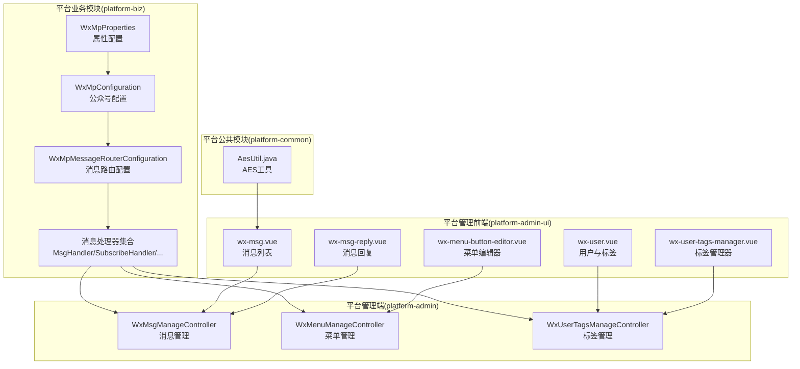
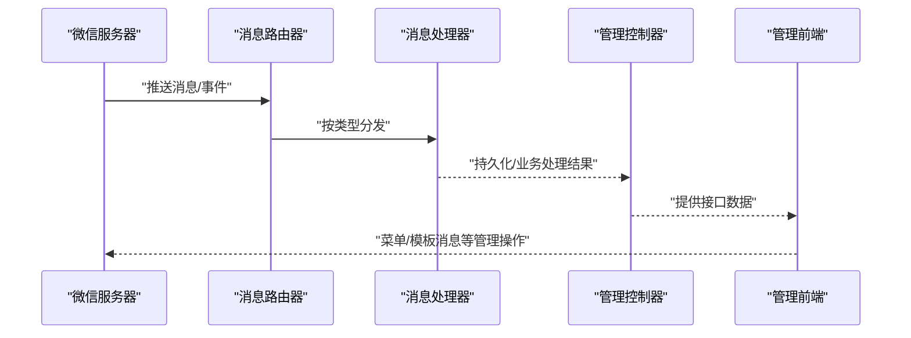
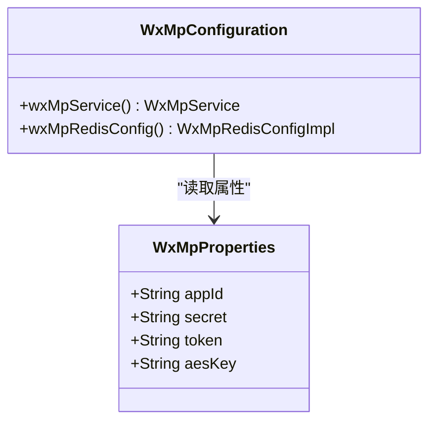
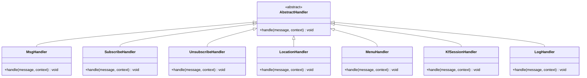
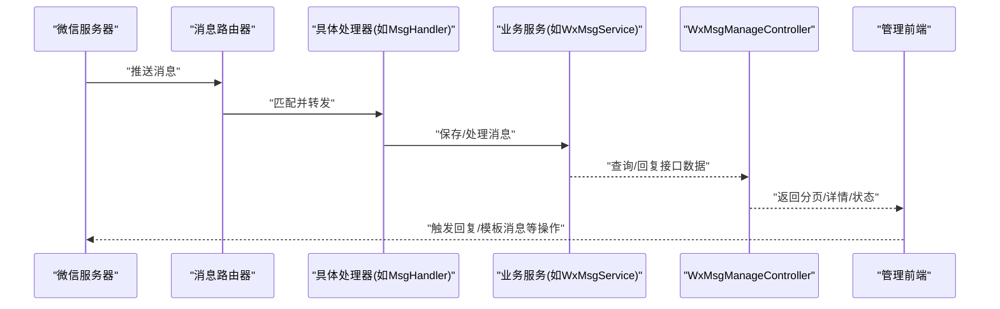
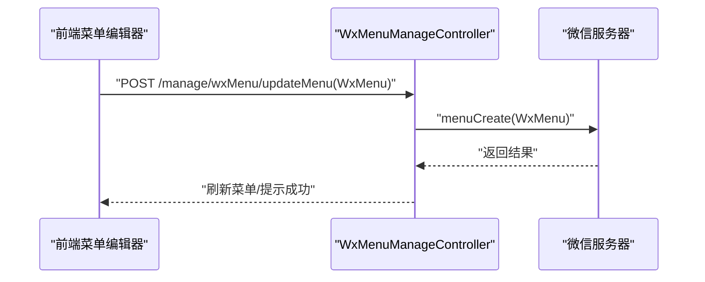
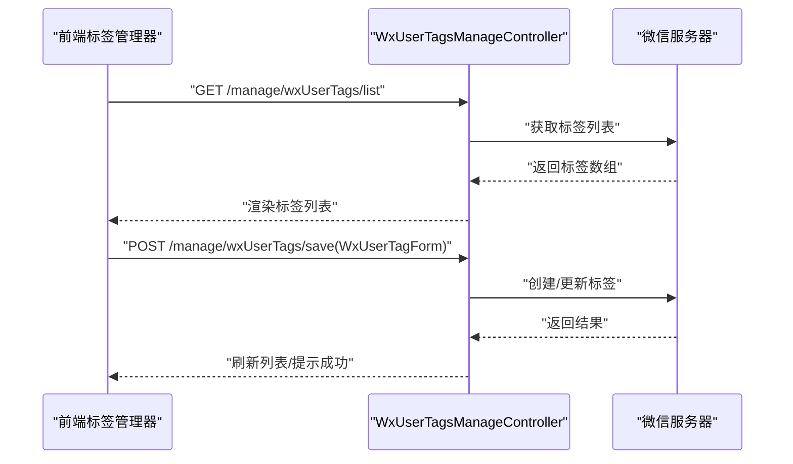
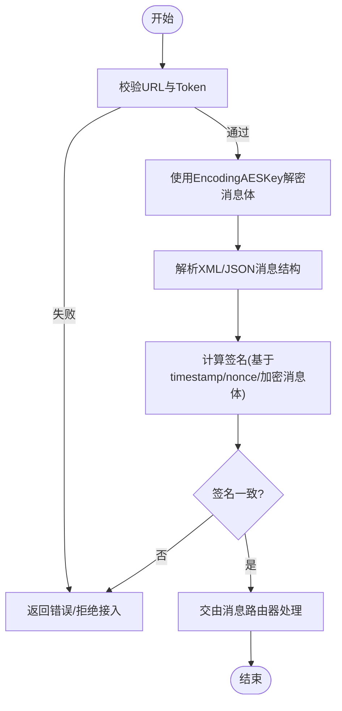
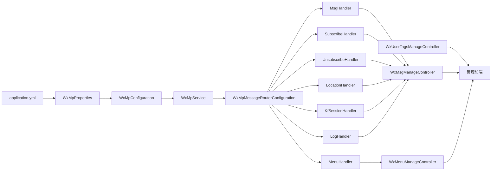

# 微信公众号集成

<cite>
**本文引用的文件**   
- [WxMpConfiguration.java](file://platform-biz/src/main/java/com/platform/config/WxMpConfiguration.java)
- [WxMpProperties.java](file://platform-biz/src/main/java/com/platform/config/WxMpProperties.java)
- [application.yml](file://platform-admin/src/main/resources/application.yml)
- [WxMsgManageController.java](file://platform-admin/src/main/java/com/platform/modules/wx/controller/WxMsgManageController.java)
- [WxMenuManageController.java](file://platform-admin/src/main/java/com/platform/modules/wx/controller/WxMenuManageController.java)
- [WxUserTagsManageController.java](file://platform-admin/src/main/java/com/platform/modules/wx/controller/WxUserTagsManageController.java)
- [WxMpMessageRouterConfiguration.java](file://platform-biz/src/main/java/com/platform/config/WxMpMessageRouterConfiguration.java)
- [MsgHandler.java](file://platform-biz/src/main/java/com/platform/handler/MsgHandler.java)
- [SubscribeHandler.java](file://platform-biz/src/main/java/com/platform/handler/SubscribeHandler.java)
- [UnsubscribeHandler.java](file://platform-biz/src/main/java/com/platform/handler/UnsubscribeHandler.java)
- [LocationHandler.java](file://platform-biz/src/main/java/com/platform/handler/LocationHandler.java)
- [MenuHandler.java](file://platform-biz/src/main/java/com/platform/handler/MenuHandler.java)
- [KfSessionHandler.java](file://platform-biz/src/main/java/com/platform/handler/KfSessionHandler.java)
- [LogHandler.java](file://platform-biz/src/main/java/com/platform/handler/LogHandler.java)
- [AbstractHandler.java](file://platform-biz/src/main/java/com/platform/handler/AbstractHandler.java)
- [wx-msg.vue](file://platform-admin-ui/src/views/modules/wx/wx-msg.vue)
- [wx-msg-reply.vue](file://platform-admin-ui/src/views/modules/wx/wx-msg-reply.vue)
- [wx-user.vue](file://platform-admin-ui/src/views/modules/wx/wx-user.vue)
- [wx-user-tags-manager.vue](file://platform-admin-ui/src/components/wx-user-tags-manager.vue)
- [wx-menu-button-editor.vue](file://platform-admin-ui/src/views/modules/wx/wx-menu-button-editor.vue)
- [AESUtils.js](file://platform-admin-ui/src/utils/AESUtils.js)
- [AESUtils.js](file://platform-common/src/main/java/com/platform/common/utils/AesUtil.java)
</cite>

## 目录
1. [简介](#简介)
2. [项目结构](#项目结构)
3. [核心组件](#核心组件)
4. [架构总览](#架构总览)
5. [详细组件分析](#详细组件分析)
6. [依赖关系分析](#依赖关系分析)
7. [性能考量](#性能考量)
8. [故障排查指南](#故障排查指南)
9. [结论](#结论)
10. [附录](#附录)

## 简介
本文件面向微信公众号集成场景，围绕公众号服务初始化、消息路由器配置、属性配置、消息处理机制、自定义菜单、用户与标签管理、与微信服务器的交互协议与安全校验、以及消息加解密与签名验证等方面，提供系统化、可操作的技术文档。读者无需深入源码即可理解整体设计与关键实现。

## 项目结构
该项目采用多模块分层架构，微信公众号相关能力主要分布在以下模块：
- 平台业务模块（platform-biz）：负责公众号配置、消息路由、消息处理器、服务封装等
- 平台管理端（platform-admin）：提供公众号菜单、消息、用户与标签管理的后端接口
- 平台管理前端（platform-admin-ui）：提供可视化界面，支撑菜单编辑、消息查看、用户与标签管理
- 平台公共模块（platform-common）：提供通用工具，如AES工具类

图表来源
- [WxMpConfiguration.java:47-62](file://platform-biz/src/main/java/com/platform/config/WxMpConfiguration.java#L47-L62)
- [WxMpProperties.java:29-51](file://platform-biz/src/main/java/com/platform/config/WxMpProperties.java#L29-L51)
- [WxMpMessageRouterConfiguration.java](file://platform-biz/src/main/java/com/platform/config/WxMpMessageRouterConfiguration.java)
- [MsgHandler.java](file://platform-biz/src/main/java/com/platform/handler/MsgHandler.java)
- [WxMsgManageController.java:47-86](file://platform-admin/src/main/java/com/platform/modules/wx/controller/WxMsgManageController.java#L47-L86)
- [WxMenuManageController.java:46-69](file://platform-admin/src/main/java/com/platform/modules/wx/controller/WxMenuManageController.java#L46-L69)
- [WxUserTagsManageController.java:44-73](file://platform-admin/src/main/java/com/platform/modules/wx/controller/WxUserTagsManageController.java#L44-L73)
- [wx-msg.vue:1-29](file://platform-admin-ui/src/views/modules/wx/wx-msg.vue#L1-L29)
- [wx-msg-reply.vue:22-78](file://platform-admin-ui/src/views/modules/wx/wx-msg-reply.vue#L22-L78)
- [wx-user.vue:24-43](file://platform-admin-ui/src/views/modules/wx/wx-user.vue#L24-L43)
- [wx-user-tags-manager.vue:1-143](file://platform-admin-ui/src/components/wx-user-tags-manager.vue#L1-L143)
- [wx-menu-button-editor.vue:1-77](file://platform-admin-ui/src/views/modules/wx/wx-menu-button-editor.vue#L1-L77)
- [AesUtil.java](file://platform-common/src/main/java/com/platform/common/utils/AesUtil.java)

章节来源
- [WxMpConfiguration.java:47-62](file://platform-biz/src/main/java/com/platform/config/WxMpConfiguration.java#L47-L62)
- [WxMpProperties.java:29-51](file://platform-biz/src/main/java/com/platform/config/WxMpProperties.java#L29-L51)
- [application.yml:169-204](file://platform-admin/src/main/resources/application.yml#L169-L204)

## 核心组件
本节聚焦公众号集成的关键构件：配置类、属性类、消息路由与处理器、控制器与前端视图。

- 配置类与属性类
  - WxMpConfiguration：基于Redis的公众号配置存储，注入WxMpService与WxMpRedisConfigImpl，完成公众号服务初始化
  - WxMpProperties：读取配置文件中的公众号appId、secret、token、aesKey等属性
  - application.yml：集中存放公众号与小程序、支付等配置项

- 消息路由与处理器
  - WxMpMessageRouterConfiguration：构建消息路由器，将不同类型的微信消息与事件分发至对应处理器
  - 处理器集合：文本、图片、语音、视频、地理位置、链接、事件（关注、取消关注、自定义菜单点击、扫码等）

- 控制器与前端
  - WxMsgManageController：提供消息列表、详情、回复、删除等接口
  - WxMenuManageController：提供菜单获取与发布接口
  - WxUserTagsManageController：提供标签列表、新增/修改、删除接口
  - 前端视图：消息列表、消息回复、用户与标签管理、菜单编辑器等

章节来源
- [WxMpConfiguration.java:47-62](file://platform-biz/src/main/java/com/platform/config/WxMpConfiguration.java#L47-L62)
- [WxMpProperties.java:29-51](file://platform-biz/src/main/java/com/platform/config/WxMpProperties.java#L29-L51)
- [application.yml:169-204](file://platform-admin/src/main/resources/application.yml#L169-L204)
- [WxMsgManageController.java:47-86](file://platform-admin/src/main/java/com/platform/modules/wx/controller/WxMsgManageController.java#L47-L86)
- [WxMenuManageController.java:46-69](file://platform-admin/src/main/java/com/platform/modules/wx/controller/WxMenuManageController.java#L46-L69)
- [WxUserTagsManageController.java:44-73](file://platform-admin/src/main/java/com/platform/modules/wx/controller/WxUserTagsManageController.java#L44-L73)

## 架构总览
下图展示了从微信服务器到后端服务再到前端管理界面的整体交互路径，以及消息路由与处理器的分发关系。

图表来源
- [WxMpMessageRouterConfiguration.java](file://platform-biz/src/main/java/com/platform/config/WxMpMessageRouterConfiguration.java)
- [MsgHandler.java](file://platform-biz/src/main/java/com/platform/handler/MsgHandler.java)
- [WxMsgManageController.java:47-86](file://platform-admin/src/main/java/com/platform/modules/wx/controller/WxMsgManageController.java#L47-L86)
- [wx-msg.vue:1-29](file://platform-admin-ui/src/views/modules/wx/wx-msg.vue#L1-L29)

## 详细组件分析

### 配置类与属性类
- WxMpConfiguration
  - 初始化WxMpService并设置Redis配置存储
  - 将WxMpProperties中的appId、secret、token、aesKey注入Redis配置
  - 使用StringRedisTemplate与Constant.WX_MP_CONFIG作为命名空间存储配置
- WxMpProperties
  - 通过@ConfigurationProperties(prefix = "wx.mp")读取配置
  - 提供appId、secret、token、aesKey四个核心字段
- application.yml
  - 在wx.mp下声明公众号的appId、secret、token、aesKey等
  - 支持小程序与支付相关配置（与公众号集成相关）

图表来源
- [WxMpConfiguration.java:47-62](file://platform-biz/src/main/java/com/platform/config/WxMpConfiguration.java#L47-L62)
- [WxMpProperties.java:29-51](file://platform-biz/src/main/java/com/platform/config/WxMpProperties.java#L29-L51)

章节来源
- [WxMpConfiguration.java:47-62](file://platform-biz/src/main/java/com/platform/config/WxMpConfiguration.java#L47-L62)
- [WxMpProperties.java:29-51](file://platform-biz/src/main/java/com/platform/config/WxMpProperties.java#L29-L51)
- [application.yml:169-204](file://platform-admin/src/main/resources/application.yml#L169-L204)

### 消息路由器与消息处理机制
- WxMpMessageRouterConfiguration
  - 构建消息路由器，将不同类型的消息与事件映射到对应处理器
  - 支持文本、图片、语音、视频、短视、地点、链接、事件等
- 处理器体系
  - 抽象基类：AbstractHandler，统一处理入口与上下文
  - 文本/图片/语音/视频/链接：MsgHandler
  - 地理位置：LocationHandler
  - 关注/取消关注：SubscribeHandler、UnsubscribeHandler
  - 自定义菜单点击：MenuHandler
  - 客服会话：KfSessionHandler
  - 日志记录：LogHandler

图表来源
- [AbstractHandler.java](file://platform-biz/src/main/java/com/platform/handler/AbstractHandler.java)
- [MsgHandler.java](file://platform-biz/src/main/java/com/platform/handler/MsgHandler.java)
- [SubscribeHandler.java](file://platform-biz/src/main/java/com/platform/handler/SubscribeHandler.java)
- [UnsubscribeHandler.java](file://platform-biz/src/main/java/com/platform/handler/UnsubscribeHandler.java)
- [LocationHandler.java](file://platform-biz/src/main/java/com/platform/handler/LocationHandler.java)
- [MenuHandler.java](file://platform-biz/src/main/java/com/platform/handler/MenuHandler.java)
- [KfSessionHandler.java](file://platform-biz/src/main/java/com/platform/handler/KfSessionHandler.java)
- [LogHandler.java](file://platform-biz/src/main/java/com/platform/handler/LogHandler.java)

章节来源
- [WxMpMessageRouterConfiguration.java](file://platform-biz/src/main/java/com/platform/config/WxMpMessageRouterConfiguration.java)
- [AbstractHandler.java](file://platform-biz/src/main/java/com/platform/handler/AbstractHandler.java)
- [MsgHandler.java](file://platform-biz/src/main/java/com/platform/handler/MsgHandler.java)
- [SubscribeHandler.java](file://platform-biz/src/main/java/com/platform/handler/SubscribeHandler.java)
- [UnsubscribeHandler.java](file://platform-biz/src/main/java/com/platform/handler/UnsubscribeHandler.java)
- [LocationHandler.java](file://platform-biz/src/main/java/com/platform/handler/LocationHandler.java)
- [MenuHandler.java](file://platform-biz/src/main/java/com/platform/handler/MenuHandler.java)
- [KfSessionHandler.java](file://platform-biz/src/main/java/com/platform/handler/KfSessionHandler.java)
- [LogHandler.java](file://platform-biz/src/main/java/com/platform/handler/LogHandler.java)

### 消息处理流程（文本/图片/语音/地点/菜单）
以下序列图展示典型消息处理链路：微信服务器推送消息 -> 路由器 -> 对应处理器 -> 业务处理（持久化/回复）-> 管理端接口 -> 前端展示。

图表来源
- [WxMpMessageRouterConfiguration.java](file://platform-biz/src/main/java/com/platform/config/WxMpMessageRouterConfiguration.java)
- [MsgHandler.java](file://platform-biz/src/main/java/com/platform/handler/MsgHandler.java)
- [WxMsgManageController.java:47-86](file://platform-admin/src/main/java/com/platform/modules/wx/controller/WxMsgManageController.java#L47-L86)
- [wx-msg.vue:1-29](file://platform-admin-ui/src/views/modules/wx/wx-msg.vue#L1-L29)

章节来源
- [WxMsgManageController.java:47-86](file://platform-admin/src/main/java/com/platform/modules/wx/controller/WxMsgManageController.java#L47-L86)
- [wx-msg.vue:1-29](file://platform-admin-ui/src/views/modules/wx/wx-msg.vue#L1-L29)

### 自定义菜单创建与管理
- 后端接口
  - 获取菜单：GET /manage/wxMenu/getMenu
  - 发布菜单：POST /manage/wxMenu/updateMenu（接收WxMenu对象）
- 前端能力
  - 菜单编辑器支持多种按钮类型（跳转网页、发送消息、小程序、扫码、拍照、地理位置等）
  - 可选择素材库中的图片或图文消息作为菜单内容

图表来源
- [WxMenuManageController.java:46-69](file://platform-admin/src/main/java/com/platform/modules/wx/controller/WxMenuManageController.java#L46-L69)
- [wx-menu-button-editor.vue:1-77](file://platform-admin-ui/src/views/modules/wx/wx-menu-button-editor.vue#L1-L77)

章节来源
- [WxMenuManageController.java:46-69](file://platform-admin/src/main/java/com/platform/modules/wx/controller/WxMenuManageController.java#L46-L69)
- [wx-menu-button-editor.vue:1-77](file://platform-admin-ui/src/views/modules/wx/wx-menu-button-editor.vue#L1-L77)

### 用户管理与标签管理
- 标签管理
  - 列表：GET /manage/wxUserTags/list
  - 新增/修改：POST /manage/wxUserTags/save（接收WxUserTagForm）
  - 删除：POST /manage/wxUserTags/delete/{tagid}
- 用户管理
  - 列表：GET /manage/wxUser/list（支持按昵称、城市、标签、扫码场景等筛选）
  - 绑定/解绑标签：调用标签绑定相关接口
- 前端组件
  - 标签管理器：支持添加、编辑、删除标签
  - 用户列表：支持批量操作与标签绑定/解绑

图表来源
- [WxUserTagsManageController.java:44-73](file://platform-admin/src/main/java/com/platform/modules/wx/controller/WxUserTagsManageController.java#L44-L73)
- [wx-user-tags-manager.vue:1-143](file://platform-admin-ui/src/components/wx-user-tags-manager.vue#L1-L143)
- [wx-user.vue:24-43](file://platform-admin-ui/src/views/modules/wx/wx-user.vue#L24-L43)

章节来源
- [WxUserTagsManageController.java:44-73](file://platform-admin/src/main/java/com/platform/modules/wx/controller/WxUserTagsManageController.java#L44-L73)
- [wx-user-tags-manager.vue:1-143](file://platform-admin-ui/src/components/wx-user-tags-manager.vue#L1-L143)
- [wx-user.vue:24-43](file://platform-admin-ui/src/views/modules/wx/wx-user.vue#L24-L43)

### 与微信服务器的交互协议与安全验证
- 服务器配置
  - 在微信公众平台配置URL与Token，用于验证服务器有效性
  - WxMpConfiguration中通过WxMpRedisConfigImpl设置token，用于消息签名校验
- 加解密与签名
  - aesKey用于消息体加解密（EncodingAESKey）
  - 前端提供AES工具类（AESUtils.js），用于本地加解密演示或辅助
  - 后端提供AesUtil.java，用于服务端加解密与签名计算

图表来源
- [WxMpConfiguration.java:54-62](file://platform-biz/src/main/java/com/platform/config/WxMpConfiguration.java#L54-L62)
- [application.yml:169-204](file://platform-admin/src/main/resources/application.yml#L169-L204)
- [AESUtils.js:1-52](file://platform-admin-ui/src/utils/AESUtils.js#L1-L52)
- [AesUtil.java](file://platform-common/src/main/java/com/platform/common/utils/AesUtil.java)

章节来源
- [WxMpConfiguration.java:54-62](file://platform-biz/src/main/java/com/platform/config/WxMpConfiguration.java#L54-L62)
- [application.yml:169-204](file://platform-admin/src/main/resources/application.yml#L169-L204)
- [AESUtils.js:1-52](file://platform-admin-ui/src/utils/AESUtils.js#L1-L52)
- [AesUtil.java](file://platform-common/src/main/java/com/platform/common/utils/AesUtil.java)

## 依赖关系分析
- 配置层
  - WxMpProperties读取application.yml中的wx.mp配置
  - WxMpConfiguration基于WxMpProperties与RedisTemplate创建WxMpService与WxMpRedisConfigImpl
- 路由与处理器
  - WxMpMessageRouterConfiguration依赖WxMpService与各处理器，建立消息分发链
- 控制器与前端
  - 各Controller提供REST接口，前端通过HTTP请求与后端交互
- 安全与加解密
  - 配置中的token与aesKey用于服务器校验与消息体加解密

图表来源
- [application.yml:169-204](file://platform-admin/src/main/resources/application.yml#L169-L204)
- [WxMpProperties.java:29-51](file://platform-biz/src/main/java/com/platform/config/WxMpProperties.java#L29-L51)
- [WxMpConfiguration.java:47-62](file://platform-biz/src/main/java/com/platform/config/WxMpConfiguration.java#L47-L62)
- [WxMpMessageRouterConfiguration.java](file://platform-biz/src/main/java/com/platform/config/WxMpMessageRouterConfiguration.java)
- [WxMsgManageController.java:47-86](file://platform-admin/src/main/java/com/platform/modules/wx/controller/WxMsgManageController.java#L47-L86)
- [WxMenuManageController.java:46-69](file://platform-admin/src/main/java/com/platform/modules/wx/controller/WxMenuManageController.java#L46-L69)
- [WxUserTagsManageController.java:44-73](file://platform-admin/src/main/java/com/platform/modules/wx/controller/WxUserTagsManageController.java#L44-L73)

章节来源
- [application.yml:169-204](file://platform-admin/src/main/resources/application.yml#L169-L204)
- [WxMpConfiguration.java:47-62](file://platform-biz/src/main/java/com/platform/config/WxMpConfiguration.java#L47-L62)
- [WxMpMessageRouterConfiguration.java](file://platform-biz/src/main/java/com/platform/config/WxMpMessageRouterConfiguration.java)

## 性能考量
- Redis配置存储
  - 使用Redis存储公众号配置，降低频繁IO开销，提升配置读取效率
- 消息处理异步化
  - 建议将耗时操作（如模板消息发送、第三方接口调用）异步化，避免阻塞消息处理线程
- 分页与缓存
  - 消息列表与用户列表采用分页查询，结合Redis缓存热点数据，减少数据库压力
- 加解密优化
  - 合理复用加解密实例，避免频繁创建销毁带来的CPU消耗

## 故障排查指南
- 服务器接入失败
  - 检查application.yml中的token是否与微信公众平台配置一致
  - 确认WxMpConfiguration已正确注入token
- 消息无法解密
  - 核对aesKey是否与微信公众平台配置一致
  - 确认消息体编码格式与EncodingAESKey匹配
- 菜单发布失败
  - 检查WxMenu对象结构是否符合微信要求
  - 查看后端日志与微信返回的错误码
- 用户标签管理异常
  - 确认标签名称长度与唯一性约束
  - 检查与微信服务器的同步状态

章节来源
- [application.yml:169-204](file://platform-admin/src/main/resources/application.yml#L169-L204)
- [WxMpConfiguration.java:54-62](file://platform-biz/src/main/java/com/platform/config/WxMpConfiguration.java#L54-L62)
- [WxMenuManageController.java:46-69](file://platform-admin/src/main/java/com/platform/modules/wx/controller/WxMenuManageController.java#L46-L69)
- [WxUserTagsManageController.java:44-73](file://platform-admin/src/main/java/com/platform/modules/wx/controller/WxUserTagsManageController.java#L44-L73)

## 结论
本方案通过配置类与属性类完成公众号服务初始化，借助消息路由器与处理器实现消息与事件的分类处理，配合管理端控制器与前端界面实现菜单、用户与标签的可视化管理。同时，依托配置中的token与aesKey保障与微信服务器的安全通信，并通过Redis实现高效配置存储。整体架构清晰、职责分离明确，便于扩展与维护。

## 附录
- 常用接口清单
  - 消息管理：GET /manage/wxMsg/list、GET /manage/wxMsg/info/{id}、POST /manage/wxMsg/reply、POST /manage/wxMsg/delete
  - 菜单管理：GET /manage/wxMenu/getMenu、POST /manage/wxMenu/updateMenu
  - 标签管理：GET /manage/wxUserTags/list、POST /manage/wxUserTags/save、POST /manage/wxUserTags/delete/{tagid}
  - 用户管理：GET /manage/wxUser/list（支持多条件筛选）
- 前端组件
  - 消息列表与回复：wx-msg.vue、wx-msg-reply.vue
  - 用户与标签：wx-user.vue、wx-user-tags-manager.vue
  - 菜单编辑：wx-menu-button-editor.vue