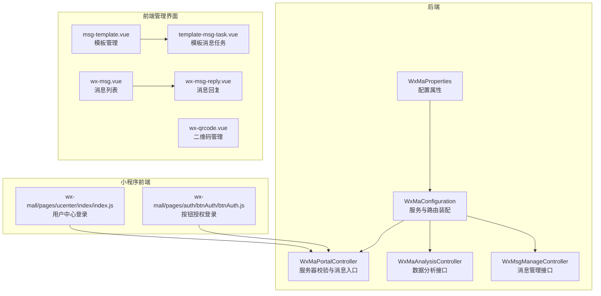
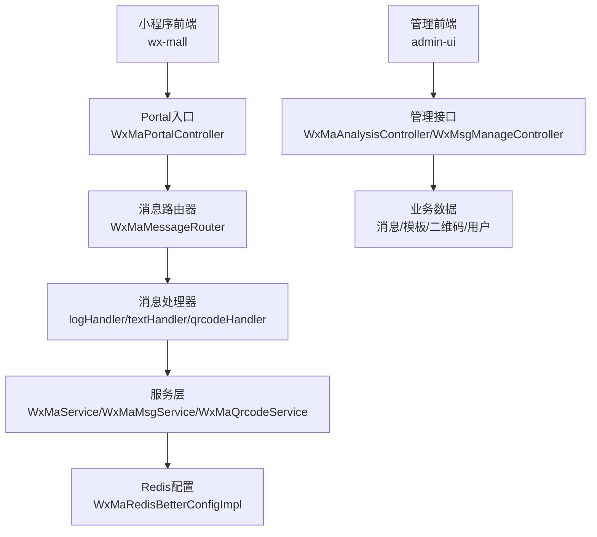
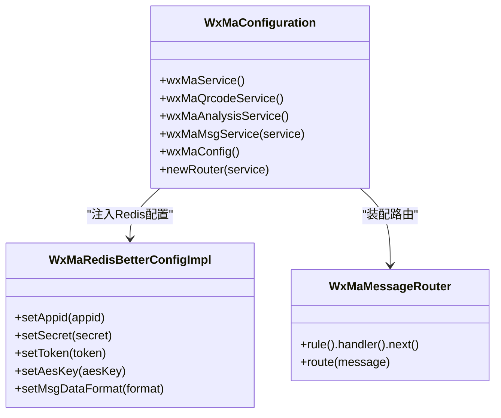
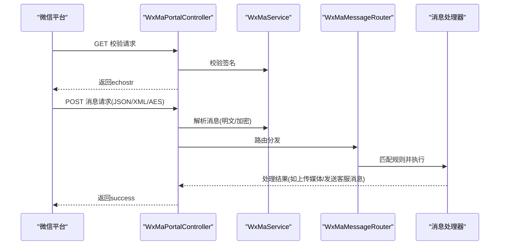
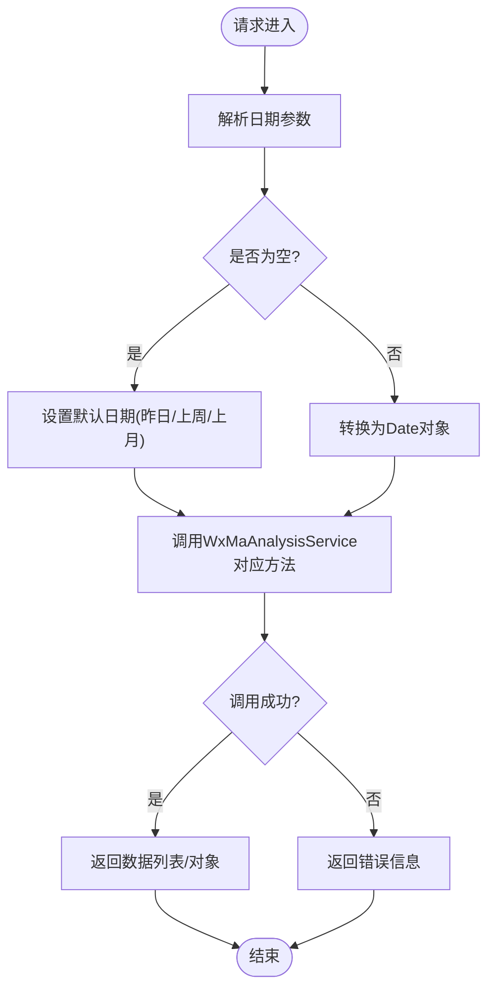
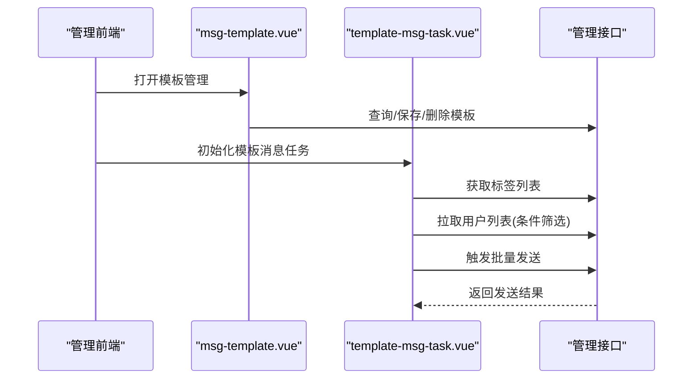
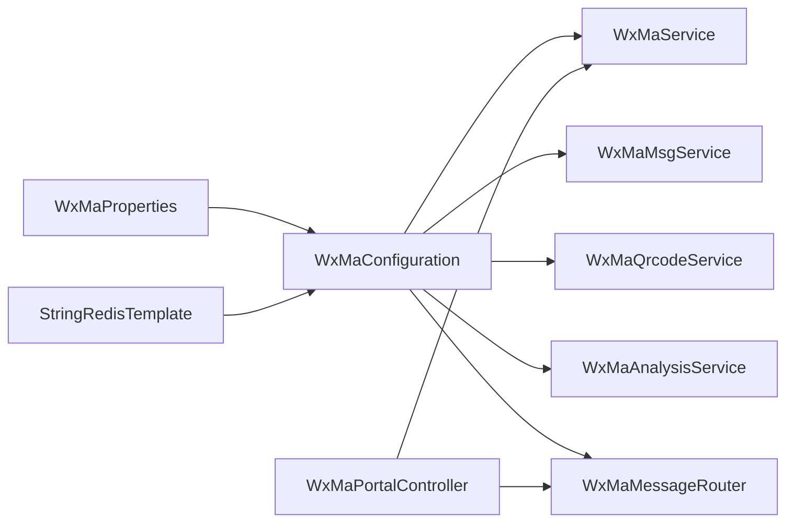

# 微信小程序集成

<cite>
**本文引用的文件**
- [WxMaConfiguration.java](file://platform-biz/src/main/java/com/platform/config/WxMaConfiguration.java)
- [WxMaProperties.java](file://platform-biz/src/main/java/com/platform/config/WxMaProperties.java)
- [WxMaPortalController.java](file://platform-api/src/main/java/com/platform/modules/app/controller/WxMaPortalController.java)
- [WxMaAnalysisController.java](file://platform-admin/src/main/java/com/platform/modules/wx/controller/WxMaAnalysisController.java)
- [application.yml](file://platform-admin/src/main/resources/application.yml)
- [WxMsgManageController.java](file://platform-admin/src/main/java/com/platform/modules/wx/controller/WxMsgManageController.java)
- [msg-template.vue](file://platform-admin-ui/src/views/modules/wx/msg-template.vue)
- [template-msg-task.vue](file://platform-admin-ui/src/components/template-msg-task.vue)
- [wx-qrcode.vue](file://platform-admin-ui/src/views/modules/wx/wx-qrcode.vue)
- [wx-msg.vue](file://platform-admin-ui/src/views/modules/wx/wx-msg.vue)
- [wx-msg-reply.vue](file://platform-admin-ui/src/views/modules/wx/wx-msg-reply.vue)
- [index.js](file://wx-mall/pages/ucenter/index/index.js)
- [btnAuth.js](file://wx-mall/pages/auth/btnAuth/btnAuth.js)
</cite>

## 目录
1. [简介](#简介)
2. [项目结构](#项目结构)
3. [核心组件](#核心组件)
4. [架构总览](#架构总览)
5. [详细组件分析](#详细组件分析)
6. [依赖分析](#依赖分析)
7. [性能考虑](#性能考虑)
8. [故障排查指南](#故障排查指南)
9. [结论](#结论)
10. [附录](#附录)

## 简介
本文件面向微信小程序集成场景，系统性阐述后端配置与服务层的实现方式，重点覆盖以下方面：
- WxMaConfiguration 配置类的实现原理：小程序服务初始化、Redis 配置管理、消息路由设置
- WxMaProperties 属性配置：appid、secret、token、aesKey、msgDataFormat 的配置方法
- 小程序消息处理机制：文本消息、图片消息与二维码生成的处理流程
- 小程序分析服务、二维码服务、消息服务的使用方法
- 自定义菜单、模板消息与素材管理的实现方案
- 消息处理器的注册与配置，以及小程序与后端系统的数据交互模式

## 项目结构
围绕微信小程序集成的关键模块与文件如下：
- 配置与服务层：WxMaConfiguration、WxMaProperties、WxMaPortalController
- 分析与消息管理：WxMaAnalysisController、WxMsgManageController
- 前端管理界面：消息模板、模板消息任务、二维码管理、消息列表与回复
- 小程序前端：用户登录与授权流程

图表来源
- [WxMaConfiguration.java:55-101](file://platform-biz/src/main/java/com/platform/config/WxMaConfiguration.java#L55-L101)
- [WxMaProperties.java:30-56](file://platform-biz/src/main/java/com/platform/config/WxMaProperties.java#L30-L56)
- [WxMaPortalController.java:44-133](file://platform-api/src/main/java/com/platform/modules/app/controller/WxMaPortalController.java#L44-L133)
- [WxMaAnalysisController.java:52-217](file://platform-admin/src/main/java/com/platform/modules/wx/controller/WxMaAnalysisController.java#L52-L217)
- [WxMsgManageController.java:46-100](file://platform-admin/src/main/java/com/platform/modules/wx/controller/WxMsgManageController.java#L46-L100)
- [msg-template.vue:122-171](file://platform-admin-ui/src/views/modules/wx/msg-template.vue#L122-L171)
- [template-msg-task.vue:100-150](file://platform-admin-ui/src/components/template-msg-task.vue#L100-L150)
- [wx-qrcode.vue:1-24](file://platform-admin-ui/src/views/modules/wx/wx-qrcode.vue#L1-L24)
- [wx-msg.vue:52-103](file://platform-admin-ui/src/views/modules/wx/wx-msg.vue#L52-L103)
- [wx-msg-reply.vue:22-78](file://platform-admin-ui/src/views/modules/wx/wx-msg-reply.vue#L22-L78)
- [index.js:50-83](file://wx-mall/pages/ucenter/index/index.js#L50-L83)
- [btnAuth.js:40-66](file://wx-mall/pages/auth/btnAuth/btnAuth.js#L40-L66)

章节来源
- [WxMaConfiguration.java:55-101](file://platform-biz/src/main/java/com/platform/config/WxMaConfiguration.java#L55-L101)
- [WxMaProperties.java:30-56](file://platform-biz/src/main/java/com/platform/config/WxMaProperties.java#L30-L56)
- [WxMaPortalController.java:44-133](file://platform-api/src/main/java/com/platform/modules/app/controller/WxMaPortalController.java#L44-L133)
- [WxMaAnalysisController.java:52-217](file://platform-admin/src/main/java/com/platform/modules/wx/controller/WxMaAnalysisController.java#L52-L217)
- [WxMsgManageController.java:46-100](file://platform-admin/src/main/java/com/platform/modules/wx/controller/WxMsgManageController.java#L46-L100)
- [application.yml:169-205](file://platform-admin/src/main/resources/application.yml#L169-L205)

## 核心组件
- WxMaConfiguration：负责小程序服务实例化、Redis 配置注入、消息服务与消息路由的装配
- WxMaProperties：封装小程序配置属性，支持从配置文件映射到应用
- WxMaPortalController：提供服务器校验与消息入口，支持明文与AES加密消息解析与路由
- WxMaAnalysisController：提供小程序数据分析接口，按日/周/月维度返回访问趋势与页面数据
- WxMsgManageController：提供消息列表、回复、删除等管理能力

章节来源
- [WxMaConfiguration.java:55-101](file://platform-biz/src/main/java/com/platform/config/WxMaConfiguration.java#L55-L101)
- [WxMaProperties.java:30-56](file://platform-biz/src/main/java/com/platform/config/WxMaProperties.java#L30-L56)
- [WxMaPortalController.java:44-133](file://platform-api/src/main/java/com/platform/modules/app/controller/WxMaPortalController.java#L44-L133)
- [WxMaAnalysisController.java:52-217](file://platform-admin/src/main/java/com/platform/modules/wx/controller/WxMaAnalysisController.java#L52-L217)
- [WxMsgManageController.java:46-100](file://platform-admin/src/main/java/com/platform/modules/wx/controller/WxMsgManageController.java#L46-L100)

## 架构总览
微信小程序集成采用“配置驱动 + 路由分发 + 数据分析 + 管理接口”的整体架构：
- 配置层：WxMaProperties 从 application.yml 读取小程序配置，WxMaConfiguration 注入 Redis 配置并创建 WxMaService
- 服务层：WxMaPortalController 对外暴露服务器校验与消息入口，内部根据消息格式选择明文或加密解析，并交由消息路由器处理
- 路由层：WxMaConfiguration 定义消息路由规则，绑定文本与二维码处理器
- 管理层：WxMaAnalysisController 提供数据分析接口，WxMsgManageController 提供消息管理接口
- 前端层：管理界面通过接口完成模板消息、二维码与消息的管理与下发

图表来源
- [WxMaPortalController.java:75-133](file://platform-api/src/main/java/com/platform/modules/app/controller/WxMaPortalController.java#L75-L133)
- [WxMaConfiguration.java:94-136](file://platform-biz/src/main/java/com/platform/config/WxMaConfiguration.java#L94-L136)
- [WxMaAnalysisController.java:52-217](file://platform-admin/src/main/java/com/platform/modules/wx/controller/WxMaAnalysisController.java#L52-L217)
- [WxMsgManageController.java:46-100](file://platform-admin/src/main/java/com/platform/modules/wx/controller/WxMsgManageController.java#L46-L100)

## 详细组件分析

### 配置类 WxMaConfiguration 实现原理
- 小程序服务初始化：通过 WxMaServiceImpl 创建服务实例，并注入 Redis 配置
- Redis 配置管理：使用 WxMaRedisBetterConfigImpl 与 RedisTemplateWxRedisOps 绑定，键空间为 Constant.WX_MA_CONFIG
- 消息路由设置：定义 WxMaMessageRouter，绑定日志处理器、文本处理器与二维码处理器
- 处理器行为：
  - 文本处理器：对特定关键词进行自动回复
  - 二维码处理器：根据用户标识生成带参二维码并上传媒体，再以图片消息回复
  - 日志处理器：打印消息并自动回复引导语

图表来源
- [WxMaConfiguration.java:61-101](file://platform-biz/src/main/java/com/platform/config/WxMaConfiguration.java#L61-L101)

章节来源
- [WxMaConfiguration.java:61-101](file://platform-biz/src/main/java/com/platform/config/WxMaConfiguration.java#L61-L101)

### 属性配置 WxMaProperties
- 配置项映射：prefix = "wx.miniapp"，包含 appid、secret、token、aesKey、msgDataFormat
- 使用方式：WxMaConfiguration 通过 @EnableConfigurationProperties 启用，自动注入到配置类中
- 配置文件位置：application.yml 中的 wx.miniapp 节点

章节来源
- [WxMaProperties.java:30-56](file://platform-biz/src/main/java/com/platform/config/WxMaProperties.java#L30-L56)
- [application.yml:179-188](file://platform-admin/src/main/resources/application.yml#L179-L188)

### 小程序消息处理机制
- 服务器校验：WxMaPortalController.authMaGet 校验 signature、timestamp、nonce、echostr
- 消息入口：WxMaPortalController.post 支持明文与AES加密两种消息格式，自动识别 JSON/XML 并解析
- 路由分发：解析后的消息交由 WxMaMessageRouter.route 进行规则匹配与处理
- 处理器示例：
  - 文本处理器：对关键词进行自动回复
  - 二维码处理器：生成带参二维码并以图片消息回复
  - 日志处理器：记录消息并自动回复引导语

图表来源
- [WxMaPortalController.java:50-133](file://platform-api/src/main/java/com/platform/modules/app/controller/WxMaPortalController.java#L50-L133)
- [WxMaConfiguration.java:94-136](file://platform-biz/src/main/java/com/platform/config/WxMaConfiguration.java#L94-L136)

章节来源
- [WxMaPortalController.java:50-133](file://platform-api/src/main/java/com/platform/modules/app/controller/WxMaPortalController.java#L50-L133)
- [WxMaConfiguration.java:94-136](file://platform-biz/src/main/java/com/platform/config/WxMaConfiguration.java#L94-L136)

### 小程序分析服务
- 接口范围：概览趋势、日访问趋势、周访问趋势、月访问趋势、访问分布、访问页面
- 时间约束：部分接口仅支持单日查询，部分支持自然周/自然月区间查询
- 错误处理：统一捕获 WxErrorException 并返回失败响应

图表来源
- [WxMaAnalysisController.java:63-215](file://platform-admin/src/main/java/com/platform/modules/wx/controller/WxMaAnalysisController.java#L63-L215)

章节来源
- [WxMaAnalysisController.java:52-217](file://platform-admin/src/main/java/com/platform/modules/wx/controller/WxMaAnalysisController.java#L52-L217)

### 二维码服务与消息服务
- 二维码服务：在处理器中根据用户标识生成带参二维码，保存至本地临时文件后上传媒体，再以图片消息发送
- 消息服务：通过 WxMaMsgService 发送客服消息，支持文本与图片消息

章节来源
- [WxMaConfiguration.java:118-134](file://platform-biz/src/main/java/com/platform/config/WxMaConfiguration.java#L118-L134)

### 模板消息与素材管理
- 模板管理：管理界面提供模板的增删改查与同步微信模板的能力
- 批量发送：模板消息任务组件支持按标签、昵称、备注、扫码场景值筛选用户并批量发送
- 前端交互：通过接口获取标签、拉取用户列表、触发批量发送任务

图表来源
- [msg-template.vue:122-171](file://platform-admin-ui/src/views/modules/wx/msg-template.vue#L122-L171)
- [template-msg-task.vue:100-150](file://platform-admin-ui/src/components/template-msg-task.vue#L100-L150)

章节来源
- [msg-template.vue:122-171](file://platform-admin-ui/src/views/modules/wx/msg-template.vue#L122-L171)
- [template-msg-task.vue:100-150](file://platform-admin-ui/src/components/template-msg-task.vue#L100-L150)

### 消息管理与回复
- 消息列表：支持按时间范围与消息类型分页查询
- 即时回复：支持针对指定 openid 发送文本或预览消息
- 管理接口：提供消息列表、详情、回复、删除等能力

章节来源
- [wx-msg.vue:52-103](file://platform-admin-ui/src/views/modules/wx/wx-msg.vue#L52-L103)
- [wx-msg-reply.vue:22-78](file://platform-admin-ui/src/views/modules/wx/wx-msg-reply.vue#L22-L78)
- [WxMsgManageController.java:46-100](file://platform-admin/src/main/java/com/platform/modules/wx/controller/WxMsgManageController.java#L46-L100)

### 小程序前端登录与授权
- 用户中心登录：通过 wx.getUserProfile 获取用户信息，调用后端接口换取 token 并缓存
- 按钮授权登录：在授权按钮点击后获取用户信息，携带 code 与 userInfo 请求后端登录

章节来源
- [index.js:50-83](file://wx-mall/pages/ucenter/index/index.js#L50-L83)
- [btnAuth.js:40-66](file://wx-mall/pages/auth/btnAuth/btnAuth.js#L40-L66)

## 依赖分析
- 组件耦合
  - WxMaConfiguration 依赖 WxMaProperties 与 StringRedisTemplate，向容器暴露 WxMaService、WxMaMsgService、WxMaQrcodeService、WxMaAnalysisService 与消息路由器
  - WxMaPortalController 依赖 WxMaService 与 WxMaMessageRouter，负责服务器校验与消息入口
  - 管理控制器依赖具体服务接口，提供对外 REST 能力
- 外部依赖
  - Redis：用于存放小程序配置与会话状态
  - 微信 SDK：WxMaService、WxMaMsgService、WxMaQrcodeService、WxMaAnalysisService 及消息路由器

图表来源
- [WxMaConfiguration.java:55-101](file://platform-biz/src/main/java/com/platform/config/WxMaConfiguration.java#L55-L101)
- [WxMaPortalController.java:44-133](file://platform-api/src/main/java/com/platform/modules/app/controller/WxMaPortalController.java#L44-L133)

章节来源
- [WxMaConfiguration.java:55-101](file://platform-biz/src/main/java/com/platform/config/WxMaConfiguration.java#L55-L101)
- [WxMaPortalController.java:44-133](file://platform-api/src/main/java/com/platform/modules/app/controller/WxMaPortalController.java#L44-L133)

## 性能考虑
- Redis 缓存：通过 Redis 存放小程序配置，减少重复初始化成本
- 消息路由：在路由层尽早过滤与短路处理，降低无效计算
- 媒体上传：二维码生成后上传媒体，建议控制图片尺寸与格式，避免过大文件影响网络与存储
- 批量发送：模板消息批量发送应分批执行并记录日志，避免一次性推送造成压力峰值

## 故障排查指南
- 服务器校验失败
  - 检查 signature、timestamp、nonce、echostr 参数是否完整传递
  - 确认 appid 是否正确切换，是否存在对应配置
- 消息解密失败
  - 确认 encrypt_type 与消息格式(JSON/XML)一致
  - 校验 aesKey 与 token 配置是否正确
- 路由处理异常
  - 查看日志输出，定位具体处理器异常
  - 检查消息内容与路由规则是否匹配
- 数据分析接口异常
  - 确认日期参数是否符合接口限制（单日/自然周/自然月）
  - 捕获并记录 WxErrorException 异常信息

章节来源
- [WxMaPortalController.java:50-133](file://platform-api/src/main/java/com/platform/modules/app/controller/WxMaPortalController.java#L50-L133)
- [WxMaAnalysisController.java:63-215](file://platform-admin/src/main/java/com/platform/modules/wx/controller/WxMaAnalysisController.java#L63-L215)

## 结论
本项目通过配置驱动的方式将微信小程序的服务能力、消息处理与数据分析能力整合到统一的后端框架中。WxMaConfiguration 作为核心装配器，结合 Redis 配置与消息路由，实现了灵活可扩展的小程序集成方案；管理接口与前端界面提供了模板消息、二维码与消息管理的完整闭环。建议在生产环境中进一步完善监控与限流策略，确保高并发场景下的稳定性。

## 附录
- 配置文件位置与关键键位参考
  - 小程序配置节点：wx.miniapp
  - 关键键位：appid、secret、token、aesKey、msgDataFormat
- 常用接口路径
  - 服务器校验：GET /app/wx/ma/portal/{appid}
  - 消息入口：POST /app/wx/ma/portal/{appid}
  - 数据分析：/manage/maanalysis/getDailySummaryTrend 等
  - 消息管理：/manage/wxMsg/list、/manage/wxMsg/reply、/manage/wxMsg/delete

章节来源
- [application.yml:169-205](file://platform-admin/src/main/resources/application.yml#L169-L205)
- [WxMaPortalController.java:44-133](file://platform-api/src/main/java/com/platform/modules/app/controller/WxMaPortalController.java#L44-L133)
- [WxMaAnalysisController.java:52-217](file://platform-admin/src/main/java/com/platform/modules/wx/controller/WxMaAnalysisController.java#L52-L217)
- [WxMsgManageController.java:46-100](file://platform-admin/src/main/java/com/platform/modules/wx/controller/WxMsgManageController.java#L46-L100)