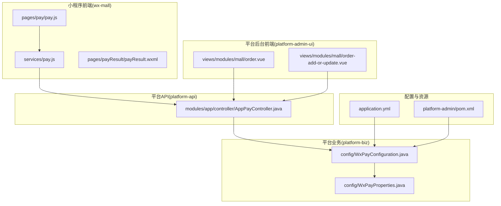
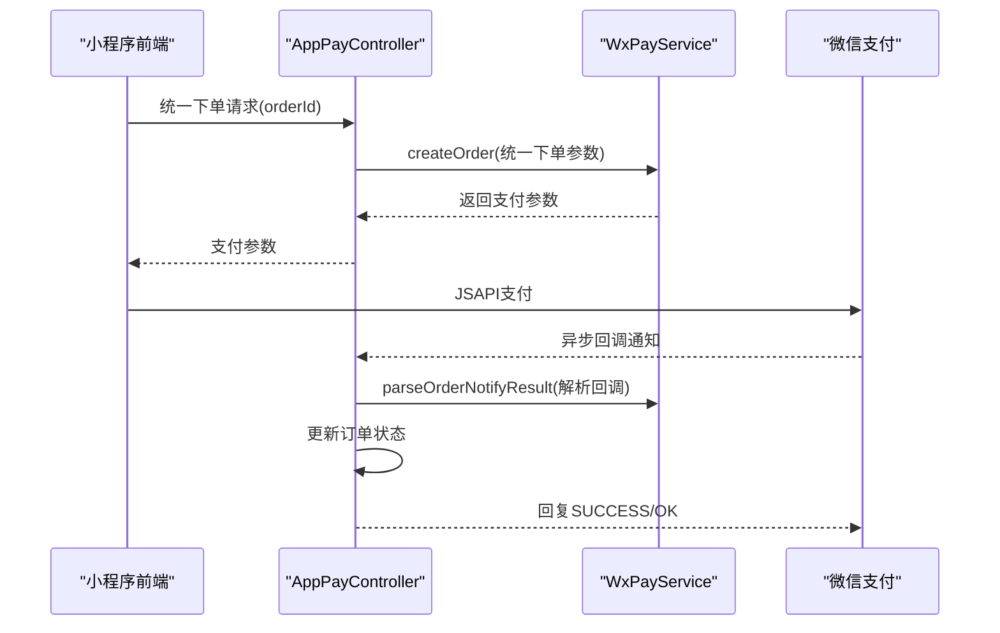
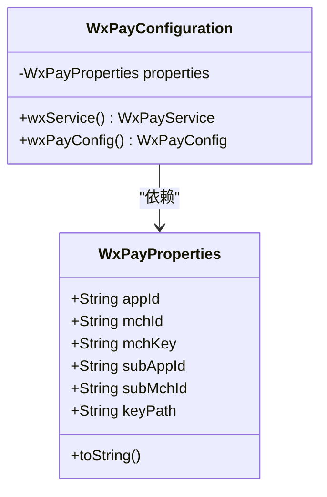
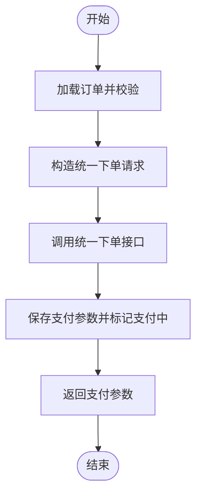
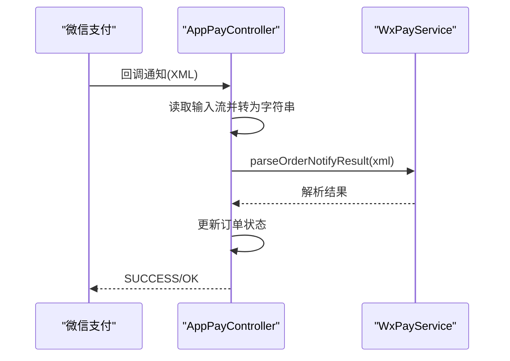
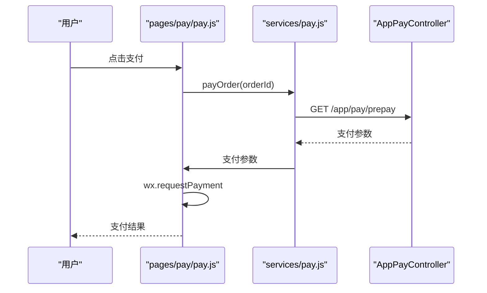
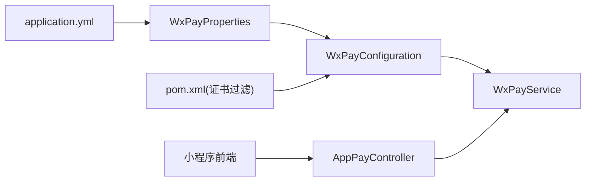

# 微信支付集成

<cite>
**本文引用的文件**
- [WxPayConfiguration.java](file://platform-biz/src/main/java/com/platform/config/WxPayConfiguration.java)
- [WxPayProperties.java](file://platform-biz/src/main/java/com/platform/config/WxPayProperties.java)
- [application.yml](file://platform-admin/src/main/resources/application.yml)
- [AppPayController.java](file://platform-api/src/main/java/com/platform/modules/app/controller/AppPayController.java)
- [pay.js](file://wx-mall/services/pay.js)
- [pay.js](file://wx-mall/pages/pay/pay.js)
- [payResult.wxml](file://wx-mall/pages/payResult/payResult.wxml)
- [order.vue](file://platform-admin-ui/src/views/modules/mall/order.vue)
- [order.vue](file://platform-admin-ui/src/views/modules/mall/order-add-or-update.vue)
- [orderDetail.js](file://wx-mall/pages/ucenter/orderDetail/orderDetail.js)
- [orderDetail.vue](file://uni-mall/pages/ucenter/orderDetail/orderDetail.vue)
- [pom.xml](file://platform-admin/pom.xml)
- [系统架构说明.md](file://docs/系统架构说明.md)
</cite>

## 目录
1. [简介](#简介)
2. [项目结构](#项目结构)
3. [核心组件](#核心组件)
4. [架构总览](#架构总览)
5. [组件详解](#组件详解)
6. [依赖关系分析](#依赖关系分析)
7. [性能与安全](#性能与安全)
8. [故障排查指南](#故障排查指南)
9. [结论](#结论)
10. [附录](#附录)

## 简介
本文件面向微信支付集成，围绕平台的支付模块进行系统化梳理，覆盖配置类实现、属性配置、统一下单与支付参数生成、回调通知与退款处理、安全机制、多场景支付、异常与错误码处理、订单状态管理与对账思路等内容。目标是帮助开发者快速理解并稳定接入微信支付。

## 项目结构
微信支付相关代码分布在以下模块：
- 平台业务模块（platform-biz）：提供微信支付配置类与属性类，负责注入与装配支付服务。
- 平台API模块（platform-api）：提供移动端支付控制器，封装统一下单、查询、回调、退款等接口。
- 小程序前端（wx-mall）：提供支付页面与支付服务封装，调用后端接口发起支付。
- 平台后台前端（platform-admin-ui）：展示订单状态与支付状态，辅助对账与人工干预。
- 配置与资源：application.yml 中的支付配置项，以及打包时对证书文件的处理策略。

图表来源
- [AppPayController.java:1-261](file://platform-api/src/main/java/com/platform/modules/app/controller/AppPayController.java#L1-L261)
- [WxPayConfiguration.java:1-65](file://platform-biz/src/main/java/com/platform/config/WxPayConfiguration.java#L1-L65)
- [WxPayProperties.java:1-72](file://platform-biz/src/main/java/com/platform/config/WxPayProperties.java#L1-L72)
- [application.yml:169-204](file://platform-admin/src/main/resources/application.yml#L169-L204)
- [pay.js:1-43](file://wx-mall/services/pay.js#L1-L43)
- [pay.js:1-61](file://wx-mall/pages/pay/pay.js#L1-L61)
- [payResult.wxml:1-23](file://wx-mall/pages/payResult/payResult.wxml#L1-L23)
- [order.vue:230-279](file://platform-admin-ui/src/views/modules/mall/order.vue#L230-L279)
- [order.vue:233-286](file://platform-admin-ui/src/views/modules/mall/order-add-or-update.vue#L233-L286)
- [pom.xml:82-95](file://platform-admin/pom.xml#L82-L95)

章节来源
- [AppPayController.java:1-261](file://platform-api/src/main/java/com/platform/modules/app/controller/AppPayController.java#L1-L261)
- [WxPayConfiguration.java:1-65](file://platform-biz/src/main/java/com/platform/config/WxPayConfiguration.java#L1-L65)
- [WxPayProperties.java:1-72](file://platform-biz/src/main/java/com/platform/config/WxPayProperties.java#L1-L72)
- [application.yml:169-204](file://platform-admin/src/main/resources/application.yml#L169-L204)
- [pay.js:1-43](file://wx-mall/services/pay.js#L1-L43)
- [pay.js:1-61](file://wx-mall/pages/pay/pay.js#L1-L61)
- [payResult.wxml:1-23](file://wx-mall/pages/payResult/payResult.wxml#L1-L23)
- [order.vue:230-279](file://platform-admin-ui/src/views/modules/mall/order.vue#L230-L279)
- [order.vue:233-286](file://platform-admin-ui/src/views/modules/mall/order-add-or-update.vue#L233-L286)
- [pom.xml:82-95](file://platform-admin/pom.xml#L82-L95)

## 核心组件
- WxPayConfiguration：基于Spring Boot自动装配思想，通过WxPayProperties注入配置，创建WxPayService实例，供业务层使用。
- WxPayProperties：承载wx.pay前缀的配置项，包括appId、mchId、mchKey、subAppId、subMchId、keyPath等。
- AppPayController：提供移动端支付相关接口，包括统一下单、订单查询、回调处理、退款申请。
- 小程序前端支付服务：封装统一下单请求与微信JSAPI支付调用。
- 订单状态映射：前后端共同维护订单与支付状态的展示与逻辑分支。

章节来源
- [WxPayConfiguration.java:32-63](file://platform-biz/src/main/java/com/platform/config/WxPayConfiguration.java#L32-L63)
- [WxPayProperties.java:27-70](file://platform-biz/src/main/java/com/platform/config/WxPayProperties.java#L27-L70)
- [AppPayController.java:46-261](file://platform-api/src/main/java/com/platform/modules/app/controller/AppPayController.java#L46-L261)
- [pay.js:11-39](file://wx-mall/services/pay.js#L11-L39)
- [order.vue:230-279](file://platform-admin-ui/src/views/modules/mall/order.vue#L230-L279)

## 架构总览
微信支付在本项目中的整体交互链路如下：
- 小程序前端触发支付，调用后端统一下单接口，后端通过WxPayService调用微信统一下单接口，返回支付参数。
- 小程序前端使用微信JSAPI发起支付。
- 微信异步回调至后端回调接口，后端解析回调并更新订单状态。
- 提供订单查询与退款接口，配合后台UI展示与人工干预。

图表来源
- [AppPayController.java:63-119](file://platform-api/src/main/java/com/platform/modules/app/controller/AppPayController.java#L63-L119)
- [AppPayController.java:158-203](file://platform-api/src/main/java/com/platform/modules/app/controller/AppPayController.java#L158-L203)

## 组件详解

### 配置类与属性类
- WxPayConfiguration
  - 作用：定义WxPayService Bean，设置WxPayConfig，注入appId、mchId、mchKey、subAppId、subMchId、keyPath等。
  - 关键点：使用@EnableConfigurationProperties启用WxPayProperties；通过setUseSandboxEnv控制沙箱开关。
- WxPayProperties
  - 作用：承载wx.pay前缀配置项，提供getter/setter与toString便于日志输出。
  - 关键点：keyPath支持绝对路径或classpath:前缀，便于将证书打包进jar或类路径。

图表来源
- [WxPayConfiguration.java:32-63](file://platform-biz/src/main/java/com/platform/config/WxPayConfiguration.java#L32-L63)
- [WxPayProperties.java:27-70](file://platform-biz/src/main/java/com/platform/config/WxPayProperties.java#L27-L70)

章节来源
- [WxPayConfiguration.java:32-63](file://platform-biz/src/main/java/com/platform/config/WxPayConfiguration.java#L32-L63)
- [WxPayProperties.java:27-70](file://platform-biz/src/main/java/com/platform/config/WxPayProperties.java#L27-L70)

### 属性配置项说明
- wx.pay.appId：小程序/公众号的appid
- wx.pay.mchId：商户号
- wx.pay.mchKey：商户密钥
- wx.pay.subAppId/subMchId：服务商模式下的子商户信息（普通模式不配置）
- wx.pay.keyPath：apiclient_cert.p12证书路径（支持classpath:）
- wx.pay.baseNotifyUrl：支付回调通知地址

章节来源
- [application.yml:189-204](file://platform-admin/src/main/resources/application.yml#L189-L204)

### 统一下单与支付参数生成
- 接口：POST /app/pay/prepay
- 参数：orderId（登录用户绑定的订单）
- 流程要点：
  - 校验订单是否存在、是否已支付、是否越权
  - 组装WxPayUnifiedOrderRequest，设置body、outTradeNo、totalFee、spbillCreateIp、notifyUrl、tradeType(JSAPI)、openid
  - 调用weixinPayService.createOrder获取支付参数
  - 更新订单payId与payStatus为“付款中”

图表来源
- [AppPayController.java:63-119](file://platform-api/src/main/java/com/platform/modules/app/controller/AppPayController.java#L63-L119)

章节来源
- [AppPayController.java:63-119](file://platform-api/src/main/java/com/platform/modules/app/controller/AppPayController.java#L63-L119)

### 支付结果通知与订单状态更新
- 接口：/app/pay/notify（GET/POST，隐藏接口）
- 流程要点：
  - 读取回调XML，解析为WxPayOrderNotifyResult
  - 根据resultCode判断成功/失败，查询订单并更新payStatus、orderStatus、shippingStatus、payTime
  - 返回SUCCESS/OK给微信

图表来源
- [AppPayController.java:158-203](file://platform-api/src/main/java/com/platform/modules/app/controller/AppPayController.java#L158-L203)

章节来源
- [AppPayController.java:158-203](file://platform-api/src/main/java/com/platform/modules/app/controller/AppPayController.java#L158-L203)

### 订单查询
- 接口：POST /app/pay/query
- 流程要点：
  - 根据orderId查询订单，调用queryOrder查询微信订单状态
  - 根据tradeState更新本地订单状态（成功则设置支付完成与待发货）

章节来源
- [AppPayController.java:124-156](file://platform-api/src/main/java/com/platform/modules/app/controller/AppPayController.java#L124-L156)

### 退款处理
- 接口：POST /app/pay/refund
- 流程要点：
  - 校验订单与权限，构造WxPayRefundRequest
  - 调用weixinPayService.refund，根据返回结果更新订单状态（201→401或300→402）

章节来源
- [AppPayController.java:208-248](file://platform-api/src/main/java/com/platform/modules/app/controller/AppPayController.java#L208-L248)

### 小程序前端支付流程
- 页面：pages/pay/pay.js
  - 调用后端统一下单接口，拿到支付参数后通过wx.requestPayment发起支付
  - 成功/失败均跳转到支付结果页
- 服务：services/pay.js
  - 封装统一下单请求与wx.requestPayment调用，Promise化处理

图表来源
- [pay.js:11-39](file://wx-mall/services/pay.js#L11-L39)
- [pay.js:33-57](file://wx-mall/pages/pay/pay.js#L33-L57)

章节来源
- [pay.js:11-39](file://wx-mall/services/pay.js#L11-L39)
- [pay.js:33-57](file://wx-mall/pages/pay/pay.js#L33-L57)

### 订单状态管理与对账思路
- 订单状态映射（示例）：待付款、已支付、待发货、待收货、已完成、已取消、已退款、已退货等
- 前端展示：后台UI与小程序前端均维护状态文本与颜色映射，便于用户与运营识别
- 对账建议：
  - 定期拉取微信对账单（可扩展），比对订单表与微信回调记录
  - 使用订单查询接口兜底，确保最终一致性
  - 记录回调时间与幂等键，避免重复入账

章节来源
- [order.vue:230-279](file://platform-admin-ui/src/views/modules/mall/order.vue#L230-L279)
- [order.vue:233-286](file://platform-admin-ui/src/views/modules/mall/order-add-or-update.vue#L233-L286)
- [orderDetail.js:48-180](file://wx-mall/pages/ucenter/orderDetail/orderDetail.js#L48-L180)
- [orderDetail.vue:192-265](file://uni-mall/pages/ucenter/orderDetail/orderDetail.vue#L192-L265)

## 依赖关系分析
- 配置依赖：application.yml → WxPayProperties → WxPayConfiguration → WxPayService
- 控制器依赖：AppPayController → WxPayService
- 前端依赖：小程序前端 → AppPayController
- 证书依赖：pom.xml中配置非过滤p12文件，保证证书随jar部署

图表来源
- [application.yml:189-204](file://platform-admin/src/main/resources/application.yml#L189-L204)
- [WxPayConfiguration.java:32-63](file://platform-biz/src/main/java/com/platform/config/WxPayConfiguration.java#L32-L63)
- [AppPayController.java:46-58](file://platform-api/src/main/java/com/platform/modules/app/controller/AppPayController.java#L46-L58)
- [pom.xml:82-95](file://platform-admin/pom.xml#L82-L95)

章节来源
- [application.yml:189-204](file://platform-admin/src/main/resources/application.yml#L189-L204)
- [WxPayConfiguration.java:32-63](file://platform-biz/src/main/java/com/platform/config/WxPayConfiguration.java#L32-L63)
- [AppPayController.java:46-58](file://platform-api/src/main/java/com/platform/modules/app/controller/AppPayController.java#L46-L58)
- [pom.xml:82-95](file://platform-admin/pom.xml#L82-L95)

## 性能与安全
- 性能
  - 统一下单与回调处理均为短事务，注意数据库写入与幂等性设计
  - 回调接口建议增加去重键（out_trade_no）与重试上限，避免重复处理
- 安全
  - 证书与密钥：keyPath指向p12证书，确保仅在受信任环境部署；生产环境禁止明文存储密钥
  - 回调安全：严格校验回调签名与商户信息，仅在解析成功后再更新业务状态
  - 参数安全：统一下单参数中敏感字段（如openid）需来自可信用户上下文

章节来源
- [WxPayConfiguration.java:50-63](file://platform-biz/src/main/java/com/platform/config/WxPayConfiguration.java#L50-L63)
- [AppPayController.java:158-203](file://platform-api/src/main/java/com/platform/modules/app/controller/AppPayController.java#L158-L203)

## 故障排查指南
- 回调不生效
  - 检查baseNotifyUrl是否可达且HTTPS可用
  - 核对回调接口签名与参数校验逻辑
- 证书相关
  - 确认keyPath有效，p12文件未被过滤打包
- 订单状态不一致
  - 使用订单查询接口回查微信状态，结合本地状态机修复
- 前端支付失败
  - 检查统一下单返回参数与wx.requestPayment调用顺序
  - 查看支付结果页提示与后端日志

章节来源
- [pom.xml:82-95](file://platform-admin/pom.xml#L82-L95)
- [AppPayController.java:124-156](file://platform-api/src/main/java/com/platform/modules/app/controller/AppPayController.java#L124-L156)
- [pay.js:11-39](file://wx-mall/services/pay.js#L11-L39)

## 结论
本项目通过配置类与属性类解耦了微信支付的初始化与参数注入，API层提供了统一下单、查询、回调与退款的完整闭环，小程序前端以简洁的方式完成支付调起。结合证书与回调安全策略、状态映射与对账思路，可构建稳定可靠的支付体系。

## 附录

### 支付场景说明
- 小程序支付：JSAPI场景，由AppPayController统一下单，小程序前端调用wx.requestPayment发起支付。
- H5支付与扫码支付：若需扩展，可在WxPayService基础上新增tradeType与参数适配，遵循统一下单流程。

章节来源
- [AppPayController.java:63-119](file://platform-api/src/main/java/com/platform/modules/app/controller/AppPayController.java#L63-L119)

### 错误码与异常处理
- 统一下单异常：捕获WxPayException并返回友好提示
- 回调异常：try/catch包裹回调处理，失败时记录日志并返回标准XML
- 退款异常：捕获WxPayException，返回errCode供前端展示

章节来源
- [AppPayController.java:115-118](file://platform-api/src/main/java/com/platform/modules/app/controller/AppPayController.java#L115-L118)
- [AppPayController.java:200-203](file://platform-api/src/main/java/com/platform/modules/app/controller/AppPayController.java#L200-L203)
- [AppPayController.java:233-235](file://platform-api/src/main/java/com/platform/modules/app/controller/AppPayController.java#L233-L235)

### 配置清单
- wx.pay.appId：小程序/公众号appid
- wx.pay.mchId：商户号
- wx.pay.mchKey：商户密钥
- wx.pay.subAppId/subMchId：服务商子商户（可选）
- wx.pay.keyPath：证书路径（支持classpath:）
- wx.pay.baseNotifyUrl：回调通知地址

章节来源
- [application.yml:189-204](file://platform-admin/src/main/resources/application.yml#L189-L204)