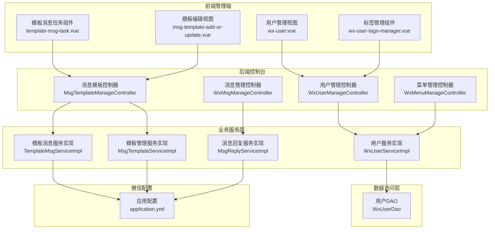
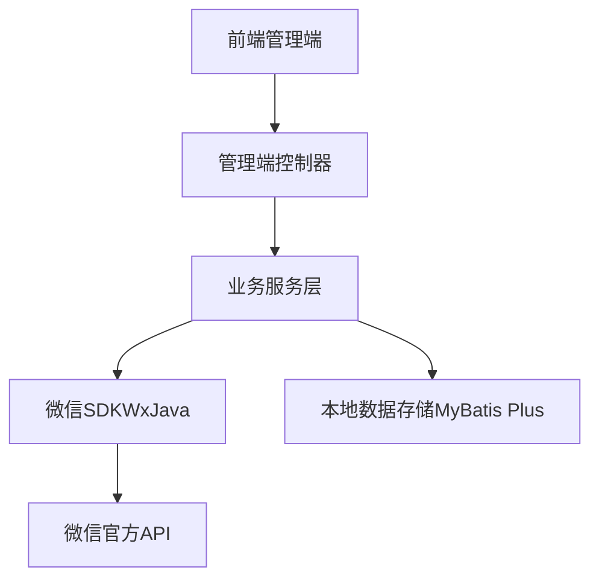
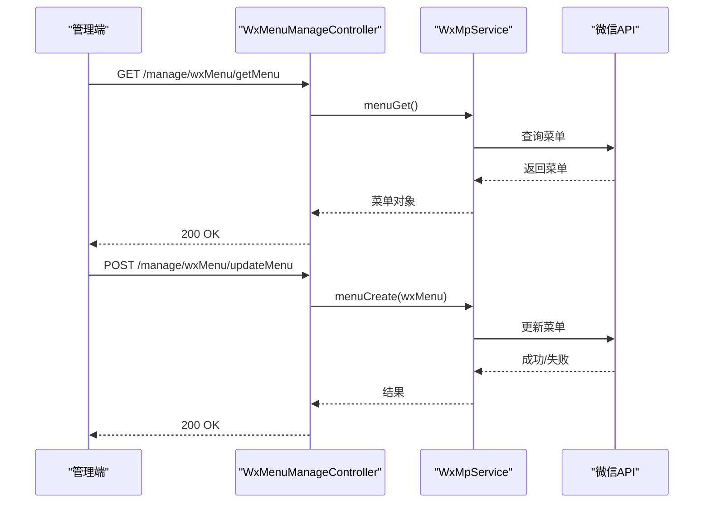
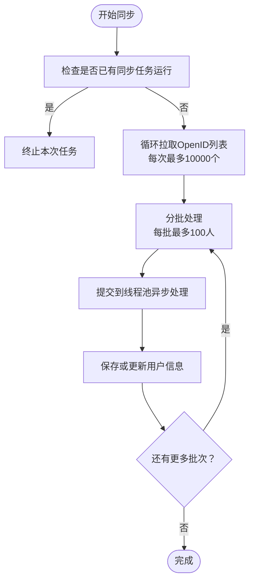
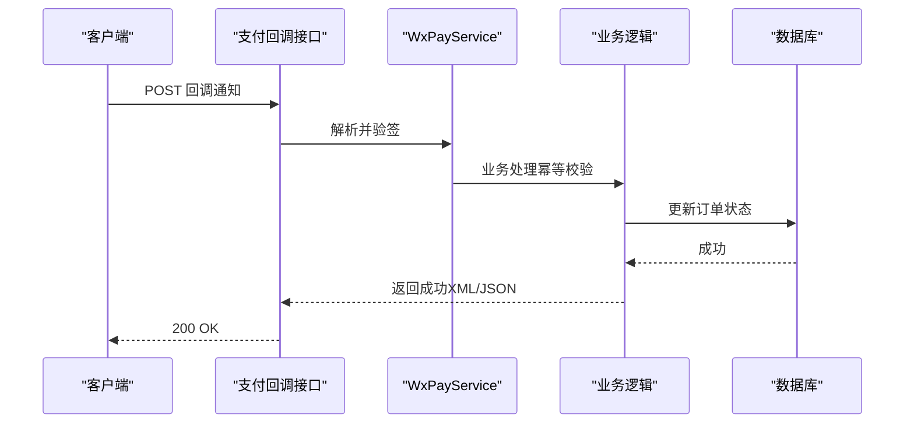
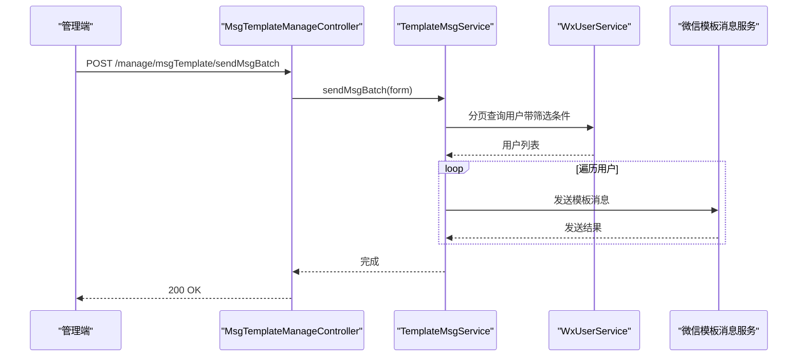
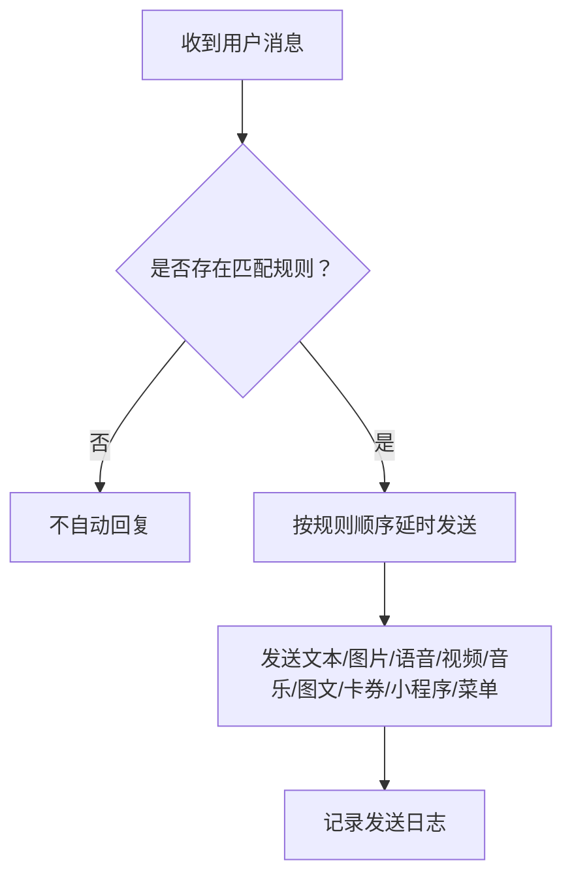
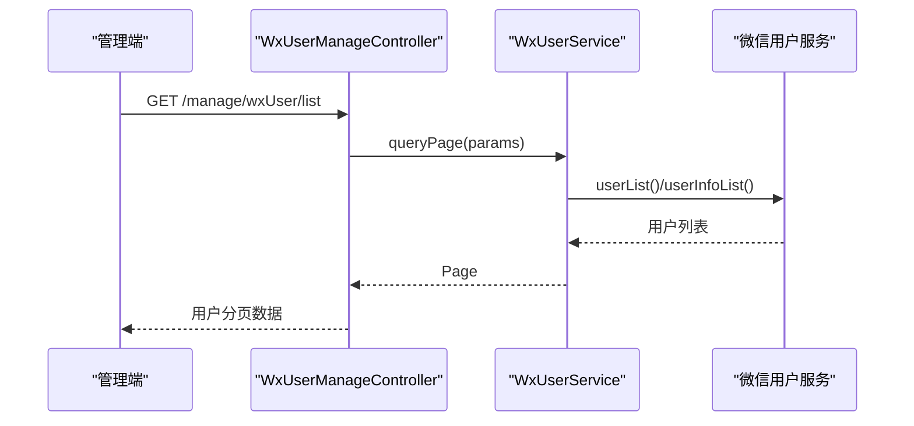
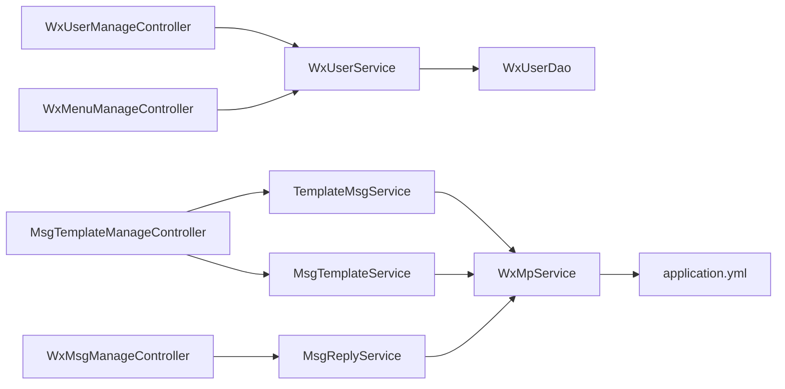

# 微信服务集成

<cite>
**本文引用的文件**
- [WxUserManageController.java](file://platform-admin/src/main/java/com/platform/modules/wx/controller/WxUserManageController.java)
- [WxMenuManageController.java](file://platform-admin/src/main/java/com/platform/modules/wx/controller/WxMenuManageController.java)
- [MsgTemplateManageController.java](file://platform-admin/src/main/java/com/platform/modules/wx/controller/MsgTemplateManageController.java)
- [WxMsgManageController.java](file://platform-admin/src/main/java/com/platform/modules/wx/controller/WxMsgManageController.java)
- [WxUserServiceImpl.java](file://platform-biz/src/main/java/com/platform/modules/wx/service/impl/WxUserServiceImpl.java)
- [MsgTemplateServiceImpl.java](file://platform-biz/src/main/java/com/platform/modules/wx/service/impl/MsgTemplateServiceImpl.java)
- [TemplateMsgServiceImpl.java](file://platform-biz/src/main/java/com/platform/modules/wx/service/impl/TemplateMsgServiceImpl.java)
- [MsgReplyServiceImpl.java](file://platform-biz/src/main/java/com/platform/modules/wx/service/impl/MsgReplyServiceImpl.java)
- [WxUserEntity.java](file://platform-biz/src/main/java/com/platform/modules/wx/entity/WxUserEntity.java)
- [MsgTemplateEntity.java](file://platform-biz/src/main/java/com/platform/modules/wx/entity/MsgTemplateEntity.java)
- [WxUserDao.java](file://platform-biz/src/main/java/com/platform/modules/wx/dao/WxUserDao.java)
- [application.yml](file://platform-admin/src/main/resources/application.yml)
- [wx-user.vue](file://platform-admin-ui/src/views/modules/wx/wx-user.vue)
- [template-msg-task.vue](file://platform-admin-ui/src/components/template-msg-task.vue)
- [wx-user-tags-manager.vue](file://platform-admin-ui/src/components/wx-user-tags-manager.vue)
- [msg-template-add-or-update.vue](file://platform-admin-ui/src/views/modules/wx/msg-template-add-or-update.vue)
</cite>

## 目录
1. [简介](#简介)
2. [项目结构](#项目结构)
3. [核心组件](#核心组件)
4. [架构总览](#架构总览)
5. [详细组件分析](#详细组件分析)
6. [依赖分析](#依赖分析)
7. [性能考虑](#性能考虑)
8. [故障排除指南](#故障排除指南)
9. [结论](#结论)
10. [附录](#附录)

## 简介
本文件系统性梳理平台在微信生态中的集成方案，覆盖微信公众号、小程序、支付、模板消息、用户与标签管理、素材管理等模块。文档从架构设计、组件职责、数据流、安全与限流策略、错误处理等方面进行深入分析，并提供可视化图示与可操作的实施建议，帮助开发者快速理解与落地。

## 项目结构
平台采用前后端分离架构，微信相关能力主要集中在后端 biz 层与 admin 控制台，前端通过 Vue 组件提供管理界面与交互体验。微信服务通过 WxJava SDK 与微信官方 API 对接，配置集中于后端配置文件。

**图表来源**
- [WxUserManageController.java:44-81](file://platform-admin/src/main/java/com/platform/modules/wx/controller/WxUserManageController.java#L44-L81)
- [WxMenuManageController.java:46-90](file://platform-admin/src/main/java/com/platform/modules/wx/controller/WxMenuManageController.java#L46-L90)
- [MsgTemplateManageController.java:49-177](file://platform-admin/src/main/java/com/platform/modules/wx/controller/MsgTemplateManageController.java#L49-L177)
- [WxMsgManageController.java:48-100](file://platform-admin/src/main/java/com/platform/modules/wx/controller/WxMsgManageController.java#L48-L100)
- [WxUserServiceImpl.java:54-219](file://platform-biz/src/main/java/com/platform/modules/wx/service/impl/WxUserServiceImpl.java#L54-L219)
- [TemplateMsgServiceImpl.java:46-101](file://platform-biz/src/main/java/com/platform/modules/wx/service/impl/TemplateMsgServiceImpl.java#L46-L101)
- [MsgTemplateServiceImpl.java:45-77](file://platform-biz/src/main/java/com/platform/modules/wx/service/impl/MsgTemplateServiceImpl.java#L45-L77)
- [MsgReplyServiceImpl.java:52-232](file://platform-biz/src/main/java/com/platform/modules/wx/service/impl/MsgReplyServiceImpl.java#L52-L232)
- [WxUserDao.java:29-37](file://platform-biz/src/main/java/com/platform/modules/wx/dao/WxUserDao.java#L29-L37)
- [application.yml:169-204](file://platform-admin/src/main/resources/application.yml#L169-L204)

**章节来源**
- [WxUserManageController.java:44-81](file://platform-admin/src/main/java/com/platform/modules/wx/controller/WxUserManageController.java#L44-L81)
- [WxMenuManageController.java:46-90](file://platform-admin/src/main/java/com/platform/modules/wx/controller/WxMenuManageController.java#L46-L90)
- [MsgTemplateManageController.java:49-177](file://platform-admin/src/main/java/com/platform/modules/wx/controller/MsgTemplateManageController.java#L49-L177)
- [WxMsgManageController.java:48-100](file://platform-admin/src/main/java/com/platform/modules/wx/controller/WxMsgManageController.java#L48-L100)
- [WxUserServiceImpl.java:54-219](file://platform-biz/src/main/java/com/platform/modules/wx/service/impl/WxUserServiceImpl.java#L54-L219)
- [TemplateMsgServiceImpl.java:46-101](file://platform-biz/src/main/java/com/platform/modules/wx/service/impl/TemplateMsgServiceImpl.java#L46-L101)
- [MsgTemplateServiceImpl.java:45-77](file://platform-biz/src/main/java/com/platform/modules/wx/service/impl/MsgTemplateServiceImpl.java#L45-L77)
- [MsgReplyServiceImpl.java:52-232](file://platform-biz/src/main/java/com/platform/modules/wx/service/impl/MsgReplyServiceImpl.java#L52-L232)
- [WxUserDao.java:29-37](file://platform-biz/src/main/java/com/platform/modules/wx/dao/WxUserDao.java#L29-L37)
- [application.yml:169-204](file://platform-admin/src/main/resources/application.yml#L169-L204)

## 核心组件
- 控制器层：提供 REST 接口，负责请求参数接收、权限校验与响应封装。
- 服务层：封装业务逻辑，协调微信 SDK 调用与本地数据持久化。
- 实体与 DAO：映射微信用户、模板消息等数据模型，支持分页查询与批量写入。
- 配置：集中管理公众号、小程序、支付等微信相关参数。

**章节来源**
- [WxUserManageController.java:44-81](file://platform-admin/src/main/java/com/platform/modules/wx/controller/WxUserManageController.java#L44-L81)
- [WxUserServiceImpl.java:54-219](file://platform-biz/src/main/java/com/platform/modules/wx/service/impl/WxUserServiceImpl.java#L54-L219)
- [WxUserEntity.java:44-171](file://platform-biz/src/main/java/com/platform/modules/wx/entity/WxUserEntity.java#L44-L171)
- [WxUserDao.java:29-37](file://platform-biz/src/main/java/com/platform/modules/wx/dao/WxUserDao.java#L29-L37)
- [application.yml:169-204](file://platform-admin/src/main/resources/application.yml#L169-L204)

## 架构总览
微信服务整体采用“控制器-服务-DAO-数据库”的分层架构，结合 WxJava SDK 与微信官方 API，实现公众号菜单、消息、模板消息、用户与标签、素材等能力。

**图表来源**
- [WxUserManageController.java:44-81](file://platform-admin/src/main/java/com/platform/modules/wx/controller/WxUserManageController.java#L44-L81)
- [WxUserServiceImpl.java:54-219](file://platform-biz/src/main/java/com/platform/modules/wx/service/impl/WxUserServiceImpl.java#L54-L219)
- [MsgReplyServiceImpl.java:52-232](file://platform-biz/src/main/java/com/platform/modules/wx/service/impl/MsgReplyServiceImpl.java#L52-L232)
- [MsgTemplateServiceImpl.java:45-77](file://platform-biz/src/main/java/com/platform/modules/wx/service/impl/MsgTemplateServiceImpl.java#L45-L77)
- [TemplateMsgServiceImpl.java:46-101](file://platform-biz/src/main/java/com/platform/modules/wx/service/impl/TemplateMsgServiceImpl.java#L46-L101)

## 详细组件分析

### 微信公众号集成
- 菜单管理：提供获取与发布菜单、网络检测接口，基于 WxJava 的菜单服务实现。
- 消息管理：提供消息列表、详情、回复与删除接口，支持多种客服消息类型。
- 用户管理：支持分页查询、批量刷新用户信息、取消关注状态更新。
- 标签管理：前端提供标签管理弹窗，后端通过用户服务与微信接口协同维护标签。

**图表来源**
- [WxMenuManageController.java:52-69](file://platform-admin/src/main/java/com/platform/modules/wx/controller/WxMenuManageController.java#L52-L69)

**章节来源**
- [WxMenuManageController.java:52-69](file://platform-admin/src/main/java/com/platform/modules/wx/controller/WxMenuManageController.java#L52-L69)
- [WxMsgManageController.java:54-86](file://platform-admin/src/main/java/com/platform/modules/wx/controller/WxMsgManageController.java#L54-L86)
- [WxUserManageController.java:50-80](file://platform-admin/src/main/java/com/platform/modules/wx/controller/WxUserManageController.java#L50-L80)
- [WxUserServiceImpl.java:144-146](file://platform-biz/src/main/java/com/platform/modules/wx/service/impl/WxUserServiceImpl.java#L144-L146)

### 微信小程序集成
- 用户属性管理：用户实体包含 openid、unionId、maOpenid 等字段，支持多端识别与统一用户模型。
- 用户同步：支持异步批量同步用户信息，按 100 人一批调用微信用户信息接口，避免超时与限流。
- 取消关注：提供取消关注状态更新接口，确保数据库与微信状态一致。

**图表来源**
- [WxUserServiceImpl.java:152-218](file://platform-biz/src/main/java/com/platform/modules/wx/service/impl/WxUserServiceImpl.java#L152-L218)

**章节来源**
- [WxUserEntity.java:54-105](file://platform-biz/src/main/java/com/platform/modules/wx/entity/WxUserEntity.java#L54-L105)
- [WxUserServiceImpl.java:152-218](file://platform-biz/src/main/java/com/platform/modules/wx/service/impl/WxUserServiceImpl.java#L152-L218)
- [WxUserDao.java:31-36](file://platform-biz/src/main/java/com/platform/modules/wx/dao/WxUserDao.java#L31-L36)

### 微信支付集成
- 支付配置：在配置文件中集中配置 appId、mchId、mchKey、p12 证书路径与回调通知地址。
- 回调处理：通过 WxJava 的支付服务处理回调，结合本地业务逻辑完成订单状态更新与幂等处理。
- 安全验证：回调参数校验、签名验证与证书校验，确保交易安全。

**图表来源**
- [application.yml:189-204](file://platform-admin/src/main/resources/application.yml#L189-L204)

**章节来源**
- [application.yml:189-204](file://platform-admin/src/main/resources/application.yml#L189-L204)

### 模板消息发送与管理
- 模板同步：从微信拉取私有模板并落库，支持按名称检索与状态启用。
- 批量发送：按用户筛选条件分页拉取用户，构建模板消息并异步发送，记录发送日志。
- 前端任务：提供模板消息任务组件，支持按标签、昵称、备注、扫码场景等筛选目标用户。

**图表来源**
- [MsgTemplateManageController.java:169-176](file://platform-admin/src/main/java/com/platform/modules/wx/controller/MsgTemplateManageController.java#L169-L176)
- [TemplateMsgServiceImpl.java:72-100](file://platform-biz/src/main/java/com/platform/modules/wx/service/impl/TemplateMsgServiceImpl.java#L72-L100)
- [WxUserServiceImpl.java:62-80](file://platform-biz/src/main/java/com/platform/modules/wx/service/impl/WxUserServiceImpl.java#L62-L80)

**章节来源**
- [MsgTemplateManageController.java:169-176](file://platform-admin/src/main/java/com/platform/modules/wx/controller/MsgTemplateManageController.java#L169-L176)
- [TemplateMsgServiceImpl.java:72-100](file://platform-biz/src/main/java/com/platform/modules/wx/service/impl/TemplateMsgServiceImpl.java#L72-L100)
- [MsgTemplateServiceImpl.java:70-76](file://platform-biz/src/main/java/com/platform/modules/wx/service/impl/MsgTemplateServiceImpl.java#L70-L76)
- [template-msg-task.vue:100-150](file://platform-admin-ui/src/components/template-msg-task.vue#L100-L150)

### 消息回复机制
- 自动回复：根据关键词匹配规则，定时调度发送不同类型的客服消息（文本、图片、语音、视频、音乐、图文、微信卡券、小程序卡片、消息菜单）。
- 手动回复：支持管理员手动选择回复类型与内容，立即发送并记录消息流水。

**图表来源**
- [MsgReplyServiceImpl.java:65-84](file://platform-biz/src/main/java/com/platform/modules/wx/service/impl/MsgReplyServiceImpl.java#L65-L84)

**章节来源**
- [MsgReplyServiceImpl.java:65-113](file://platform-biz/src/main/java/com/platform/modules/wx/service/impl/MsgReplyServiceImpl.java#L65-L113)
- [WxMsgManageController.java:78-86](file://platform-admin/src/main/java/com/platform/modules/wx/controller/WxMsgManageController.java#L78-L86)

### 用户与标签管理
- 用户查询：支持按 openid、昵称、城市、二维码场景、关注来源、标签等条件分页查询。
- 标签管理：前端提供标签增删改入口，后端通过用户服务与微信接口维护标签。
- 批量操作：支持批量绑定/解绑标签，结合模板消息任务进行定向推送。

**图表来源**
- [WxUserManageController.java:50-57](file://platform-admin/src/main/java/com/platform/modules/wx/controller/WxUserManageController.java#L50-L57)
- [WxUserServiceImpl.java:62-80](file://platform-biz/src/main/java/com/platform/modules/wx/service/impl/WxUserServiceImpl.java#L62-L80)

**章节来源**
- [WxUserManageController.java:50-80](file://platform-admin/src/main/java/com/platform/modules/wx/controller/WxUserManageController.java#L50-L80)
- [wx-user.vue:24-46](file://platform-admin-ui/src/views/modules/wx/wx-user.vue#L24-L46)
- [wx-user-tags-manager.vue:1-23](file://platform-admin-ui/src/components/wx-user-tags-manager.vue#L1-L23)

### 素材管理
- 草稿箱：支持草稿文章的新增、编辑与发布流程。
- 自由发布：支持已群发文章的自由发布与详情查看。
- 草稿同步：提供草稿与自由发布的数据同步与管理。

**章节来源**
- [WxMpDraftController.java](file://platform-admin/src/main/java/com/platform/modules/wx/controller/WxMpDraftController.java)
- [WxMpFreePublishController.java](file://platform-admin/src/main/java/com/platform/modules/wx/controller/WxMpFreePublishController.java)
- [WxAssetsManageController.java](file://platform-admin/src/main/java/com/platform/modules/wx/controller/WxAssetsManageController.java)

## 依赖分析
- 控制器依赖服务：各控制器通过构造注入方式依赖对应服务，降低耦合度。
- 服务依赖微信 SDK：服务层通过 WxMpService 或模板消息服务等调用微信接口。
- DAO 依赖 MyBatis Plus：DAO 提供基础 CRUD 与自定义 SQL（如取消关注）。
- 配置集中管理：application.yml 中集中配置公众号、小程序、支付参数，便于运维与切换环境。

**图表来源**
- [WxUserManageController.java:44-81](file://platform-admin/src/main/java/com/platform/modules/wx/controller/WxUserManageController.java#L44-L81)
- [WxMenuManageController.java:46-90](file://platform-admin/src/main/java/com/platform/modules/wx/controller/WxMenuManageController.java#L46-L90)
- [MsgTemplateManageController.java:49-177](file://platform-admin/src/main/java/com/platform/modules/wx/controller/MsgTemplateManageController.java#L49-L177)
- [WxMsgManageController.java:48-100](file://platform-admin/src/main/java/com/platform/modules/wx/controller/WxMsgManageController.java#L48-L100)
- [WxUserServiceImpl.java:54-219](file://platform-biz/src/main/java/com/platform/modules/wx/service/impl/WxUserServiceImpl.java#L54-L219)
- [TemplateMsgServiceImpl.java:46-101](file://platform-biz/src/main/java/com/platform/modules/wx/service/impl/TemplateMsgServiceImpl.java#L46-L101)
- [MsgTemplateServiceImpl.java:45-77](file://platform-biz/src/main/java/com/platform/modules/wx/service/impl/MsgTemplateServiceImpl.java#L45-L77)
- [MsgReplyServiceImpl.java:52-232](file://platform-biz/src/main/java/com/platform/modules/wx/service/impl/MsgReplyServiceImpl.java#L52-L232)
- [application.yml:169-204](file://platform-admin/src/main/resources/application.yml#L169-L204)

**章节来源**
- [WxUserManageController.java:44-81](file://platform-admin/src/main/java/com/platform/modules/wx/controller/WxUserManageController.java#L44-L81)
- [WxMenuManageController.java:46-90](file://platform-admin/src/main/java/com/platform/modules/wx/controller/WxMenuManageController.java#L46-L90)
- [MsgTemplateManageController.java:49-177](file://platform-admin/src/main/java/com/platform/modules/wx/controller/MsgTemplateManageController.java#L49-L177)
- [WxMsgManageController.java:48-100](file://platform-admin/src/main/java/com/platform/modules/wx/controller/WxMsgManageController.java#L48-L100)
- [WxUserServiceImpl.java:54-219](file://platform-biz/src/main/java/com/platform/modules/wx/service/impl/WxUserServiceImpl.java#L54-L219)
- [TemplateMsgServiceImpl.java:46-101](file://platform-biz/src/main/java/com/platform/modules/wx/service/impl/TemplateMsgServiceImpl.java#L46-L101)
- [MsgTemplateServiceImpl.java:45-77](file://platform-biz/src/main/java/com/platform/modules/wx/service/impl/MsgTemplateServiceImpl.java#L45-L77)
- [MsgReplyServiceImpl.java:52-232](file://platform-biz/src/main/java/com/platform/modules/wx/service/impl/MsgReplyServiceImpl.java#L52-L232)
- [application.yml:169-204](file://platform-admin/src/main/resources/application.yml#L169-L204)

## 性能考虑
- 异步与分批：用户同步与模板消息发送均采用异步与分批策略，避免阻塞主线程与超时。
- 并行处理：用户信息批量拉取使用并行流转换，提升吞吐。
- 限流与幂等：模板消息发送记录日志，结合业务侧幂等校验，避免重复推送。
- 线程池：通过统一的任务执行器提交任务，统一管理并发度与资源。

**章节来源**
- [WxUserServiceImpl.java:120-128](file://platform-biz/src/main/java/com/platform/modules/wx/service/impl/WxUserServiceImpl.java#L120-L128)
- [WxUserServiceImpl.java:196-216](file://platform-biz/src/main/java/com/platform/modules/wx/service/impl/WxUserServiceImpl.java#L196-L216)
- [TemplateMsgServiceImpl.java:56-70](file://platform-biz/src/main/java/com/platform/modules/wx/service/impl/TemplateMsgServiceImpl.java#L56-L70)
- [TemplateMsgServiceImpl.java:72-100](file://platform-biz/src/main/java/com/platform/modules/wx/service/impl/TemplateMsgServiceImpl.java#L72-L100)

## 故障排除指南
- 网络检测：菜单管理提供网络检测接口，用于排查回调连接问题。
- 错误日志：消息回复与模板消息发送均记录日志，便于定位异常。
- 参数校验：模板名称非空校验、批量发送参数校验，避免无效请求。
- 回调异常：支付回调需严格验签与幂等处理，失败时返回标准格式以便微信重试。

**章节来源**
- [WxMenuManageController.java:78-89](file://platform-admin/src/main/java/com/platform/modules/wx/controller/WxMenuManageController.java#L78-L89)
- [MsgReplyServiceImpl.java:110-112](file://platform-biz/src/main/java/com/platform/modules/wx/service/impl/MsgReplyServiceImpl.java#L110-L112)
- [TemplateMsgServiceImpl.java:60-69](file://platform-biz/src/main/java/com/platform/modules/wx/service/impl/TemplateMsgServiceImpl.java#L60-L69)
- [MsgTemplateServiceImpl.java:62-68](file://platform-biz/src/main/java/com/platform/modules/wx/service/impl/MsgTemplateServiceImpl.java#L62-L68)
- [application.yml:189-204](file://platform-admin/src/main/resources/application.yml#L189-L204)

## 结论
平台通过清晰的分层架构与完善的微信生态能力，实现了公众号菜单、消息、模板消息、用户与标签、素材以及支付回调的完整闭环。结合异步与分批策略、严格的日志与校验机制，能够在高并发场景下保持稳定与可维护性。建议在生产环境中持续完善监控与告警体系，确保微信接口调用的可观测性与安全性。

## 附录
- 配置项说明（摘录）
  - 公众号配置：appId、secret、token、aesKey
  - 小程序配置：appid、secret、token、aesKey、msgDataFormat
  - 支付配置：appId、mchId、mchKey、subAppId、subMchId、keyPath、baseNotifyUrl

**章节来源**
- [application.yml:169-204](file://platform-admin/src/main/resources/application.yml#L169-L204)