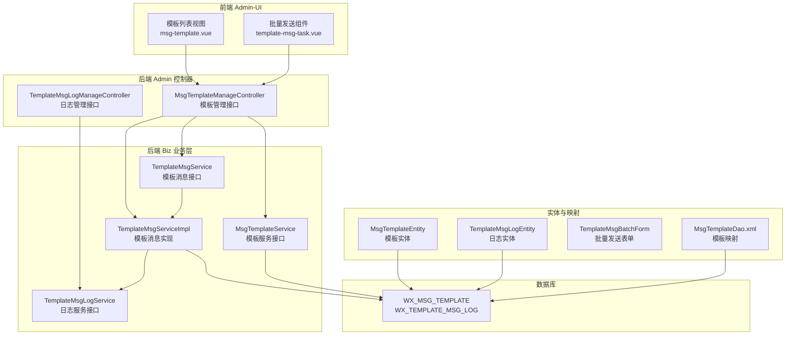
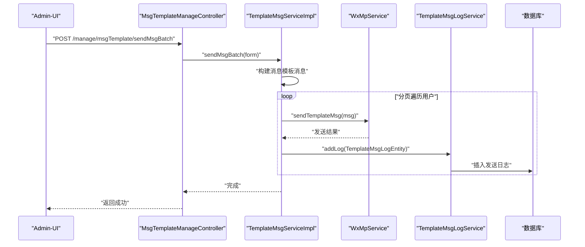
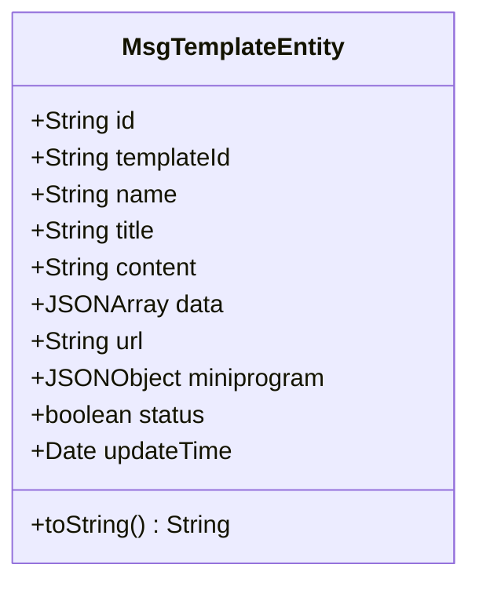
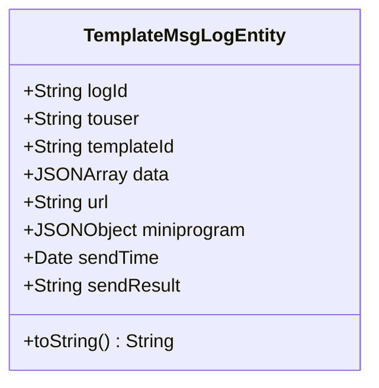
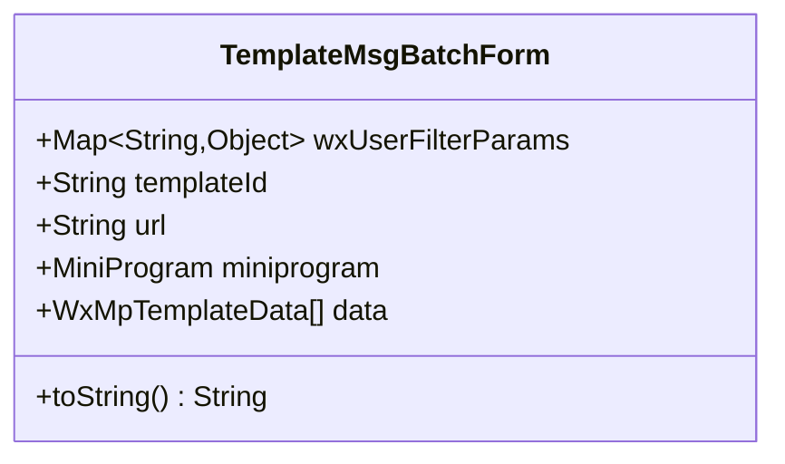
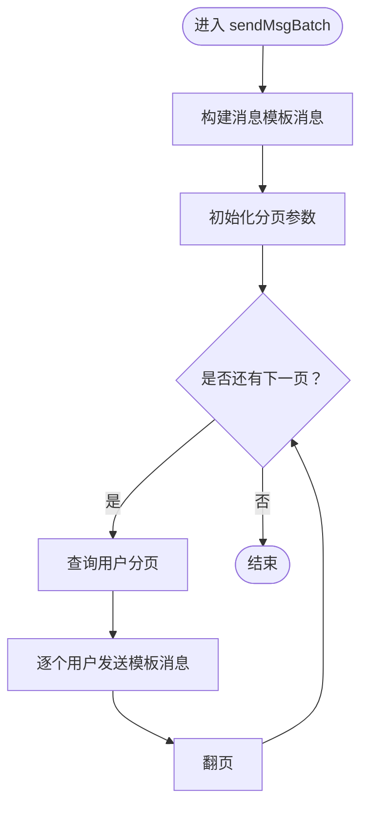
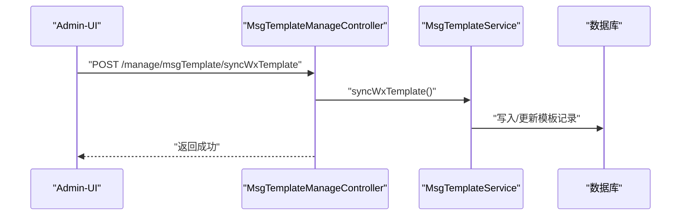
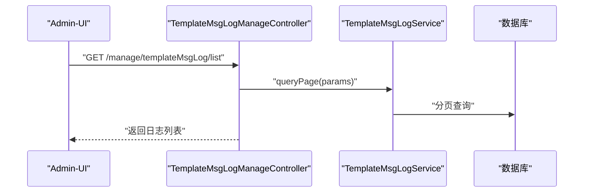
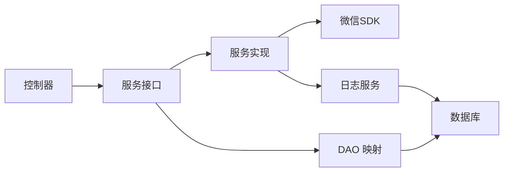
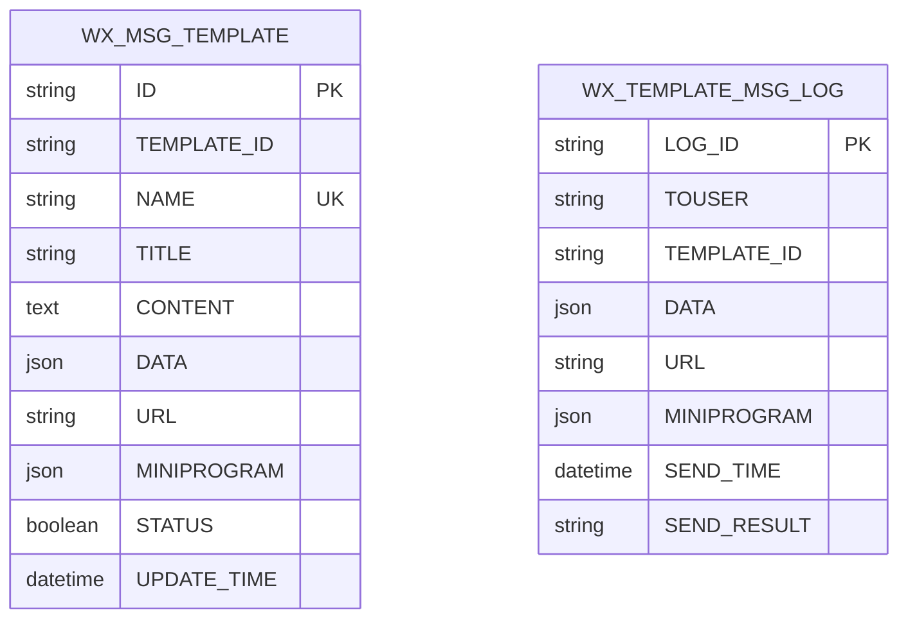

# 微信模板消息

<cite>
**本文引用的文件**
- [MsgTemplateManageController.java](file://platform-admin/src/main/java/com/platform/modules/wx/controller/MsgTemplateManageController.java)
- [TemplateMsgLogManageController.java](file://platform-admin/src/main/java/com/platform/modules/wx/controller/TemplateMsgLogManageController.java)
- [MsgTemplateEntity.java](file://platform-biz/src/main/java/com/platform/modules/wx/entity/MsgTemplateEntity.java)
- [TemplateMsgLogEntity.java](file://platform-biz/src/main/java/com/platform/modules/wx/entity/TemplateMsgLogEntity.java)
- [TemplateMsgBatchForm.java](file://platform-biz/src/main/java/com/platform/modules/wx/form/TemplateMsgBatchForm.java)
- [TemplateMsgService.java](file://platform-biz/src/main/java/com/platform/modules/wx/service/TemplateMsgService.java)
- [TemplateMsgServiceImpl.java](file://platform-biz/src/main/java/com/platform/modules/wx/service/impl/TemplateMsgServiceImpl.java)
- [MsgTemplateService.java](file://platform-biz/src/main/java/com/platform/modules/wx/service/MsgTemplateService.java)
- [MsgTemplateDao.xml](file://platform-biz/src/main/resources/mapper/wx/MsgTemplateDao.xml)
- [base.sql](file://_sql/base.sql)
- [template-msg-task.vue](file://platform-admin-ui/src/components/template-msg-task.vue)
- [msg-template.vue](file://platform-admin-ui/src/views/modules/wx/msg-template.vue)
</cite>

## 目录
1. [简介](#简介)
2. [项目结构](#项目结构)
3. [核心组件](#核心组件)
4. [架构总览](#架构总览)
5. [详细组件分析](#详细组件分析)
6. [依赖分析](#依赖分析)
7. [性能考虑](#性能考虑)
8. [故障排查指南](#故障排查指南)
9. [结论](#结论)
10. [附录](#附录)

## 简介
本文件面向“微信模板消息”能力，系统化梳理模板消息服务的实现，覆盖模板消息的获取、配置与发送流程；模板实体设计（模板ID、标题、内容、跳转链接等）；日志管理（发送记录、状态跟踪、错误处理）；批量发送（用户标签筛选、群发策略）；模板管理（模板列表、删除、更新）；发送接口实现（参数校验、异步处理）；以及审核与合规建议。文档以代码为依据，配合可视化图表帮助读者快速理解系统。

## 项目结构
微信模板消息相关模块主要分布在后端 Biz 层与 Admin 控制器层，前端 Admin-UI 提供模板管理与批量发送界面。关键目录与职责如下：
- 平台后端 Admin 控制器：负责对外 HTTP 接口，权限控制与日志记录
- 平台 Biz 业务层：封装模板消息发送、批量发送、模板同步、日志记录等核心逻辑
- 前端 Admin-UI：提供模板列表、同步、批量发送任务、日志查看等页面与组件
- 数据库：存储模板与发送日志

**图表来源**
- [MsgTemplateManageController.java:45-178](file://platform-admin/src/main/java/com/platform/modules/wx/controller/MsgTemplateManageController.java#L45-L178)
- [TemplateMsgLogManageController.java:41-94](file://platform-admin/src/main/java/com/platform/modules/wx/controller/TemplateMsgLogManageController.java#L41-L94)
- [TemplateMsgService.java:24-42](file://platform-biz/src/main/java/com/platform/modules/wx/service/TemplateMsgService.java#L24-L42)
- [TemplateMsgServiceImpl.java:41-102](file://platform-biz/src/main/java/com/platform/modules/wx/service/impl/TemplateMsgServiceImpl.java#L41-L102)
- [MsgTemplateService.java:28-58](file://platform-biz/src/main/java/com/platform/modules/wx/service/MsgTemplateService.java#L28-L58)
- [MsgTemplateEntity.java:35-78](file://platform-biz/src/main/java/com/platform/modules/wx/entity/MsgTemplateEntity.java#L35-L78)
- [TemplateMsgLogEntity.java:35-75](file://platform-biz/src/main/java/com/platform/modules/wx/entity/TemplateMsgLogEntity.java#L35-L75)
- [TemplateMsgBatchForm.java:31-54](file://platform-biz/src/main/java/com/platform/modules/wx/form/TemplateMsgBatchForm.java#L31-L54)
- [MsgTemplateDao.xml:1-6](file://platform-biz/src/main/resources/mapper/wx/MsgTemplateDao.xml#L1-L6)
- [base.sql:836-854](file://_sql/base.sql#L836-L854)

**章节来源**
- [MsgTemplateManageController.java:45-178](file://platform-admin/src/main/java/com/platform/modules/wx/controller/MsgTemplateManageController.java#L45-L178)
- [TemplateMsgLogManageController.java:41-94](file://platform-admin/src/main/java/com/platform/modules/wx/controller/TemplateMsgLogManageController.java#L41-L94)
- [MsgTemplateEntity.java:35-78](file://platform-biz/src/main/java/com/platform/modules/wx/entity/MsgTemplateEntity.java#L35-L78)
- [TemplateMsgLogEntity.java:35-75](file://platform-biz/src/main/java/com/platform/modules/wx/entity/TemplateMsgLogEntity.java#L35-L75)
- [TemplateMsgBatchForm.java:31-54](file://platform-biz/src/main/java/com/platform/modules/wx/form/TemplateMsgBatchForm.java#L31-L54)
- [TemplateMsgService.java:24-42](file://platform-biz/src/main/java/com/platform/modules/wx/service/TemplateMsgService.java#L24-L42)
- [TemplateMsgServiceImpl.java:41-102](file://platform-biz/src/main/java/com/platform/modules/wx/service/impl/TemplateMsgServiceImpl.java#L41-L102)
- [MsgTemplateService.java:28-58](file://platform-biz/src/main/java/com/platform/modules/wx/service/MsgTemplateService.java#L28-L58)
- [MsgTemplateDao.xml:1-6](file://platform-biz/src/main/resources/mapper/wx/MsgTemplateDao.xml#L1-L6)
- [base.sql:836-854](file://_sql/base.sql#L836-L854)

## 核心组件
- 模板实体 MsgTemplateEntity：承载模板ID、名称、标题、内容、JSON数据、跳转链接、小程序信息、状态与更新时间等字段，并支持从微信模板对象转换
- 日志实体 TemplateMsgLogEntity：记录发送目标用户、模板ID、消息数据、URL、小程序信息、发送时间与结果
- 批量发送表单 TemplateMsgBatchForm：封装批量发送所需的筛选条件、模板ID、URL、小程序信息与消息数据
- 模板消息服务接口 TemplateMsgService：定义单条发送与批量发送方法
- 模板消息实现 TemplateMsgServiceImpl：基于微信 SDK 异步发送模板消息，并落库发送日志
- 模板服务接口 MsgTemplateService：提供模板的分页查询、按名查询与同步公众号模板能力
- 管理控制器 MsgTemplateManageController：提供模板的增删改查、同步与批量发送接口
- 日志管理控制器 TemplateMsgLogManageController：提供日志的分页查询、详情查询与删除接口
- 前端组件 template-msg-task.vue 与视图 msg-template.vue：提供模板同步、批量发送任务与日志查看界面

**章节来源**
- [MsgTemplateEntity.java:35-78](file://platform-biz/src/main/java/com/platform/modules/wx/entity/MsgTemplateEntity.java#L35-L78)
- [TemplateMsgLogEntity.java:35-75](file://platform-biz/src/main/java/com/platform/modules/wx/entity/TemplateMsgLogEntity.java#L35-L75)
- [TemplateMsgBatchForm.java:31-54](file://platform-biz/src/main/java/com/platform/modules/wx/form/TemplateMsgBatchForm.java#L31-L54)
- [TemplateMsgService.java:24-42](file://platform-biz/src/main/java/com/platform/modules/wx/service/TemplateMsgService.java#L24-L42)
- [TemplateMsgServiceImpl.java:41-102](file://platform-biz/src/main/java/com/platform/modules/wx/service/impl/TemplateMsgServiceImpl.java#L41-L102)
- [MsgTemplateService.java:28-58](file://platform-biz/src/main/java/com/platform/modules/wx/service/MsgTemplateService.java#L28-L58)
- [MsgTemplateManageController.java:45-178](file://platform-admin/src/main/java/com/platform/modules/wx/controller/MsgTemplateManageController.java#L45-L178)
- [TemplateMsgLogManageController.java:41-94](file://platform-admin/src/main/java/com/platform/modules/wx/controller/TemplateMsgLogManageController.java#L41-L94)
- [template-msg-task.vue:48-150](file://platform-admin-ui/src/components/template-msg-task.vue#L48-L150)
- [msg-template.vue:1-171](file://platform-admin-ui/src/views/modules/wx/msg-template.vue#L1-L171)

## 架构总览
系统采用前后端分离架构，Admin 控制器提供 REST 接口，Biz 层封装业务逻辑并通过微信 SDK 调用微信模板消息能力，同时将发送结果写入日志表以便审计与追踪。

**图表来源**
- [MsgTemplateManageController.java:163-177](file://platform-admin/src/main/java/com/platform/modules/wx/controller/MsgTemplateManageController.java#L163-L177)
- [TemplateMsgServiceImpl.java:72-100](file://platform-biz/src/main/java/com/platform/modules/wx/service/impl/TemplateMsgServiceImpl.java#L72-L100)
- [TemplateMsgLogManageController.java:48-92](file://platform-admin/src/main/java/com/platform/modules/wx/controller/TemplateMsgLogManageController.java#L48-L92)

## 详细组件分析

### 模板实体设计
- 字段说明
  - 模板ID：用于标识微信模板
  - 名称：模板在系统内的唯一名称
  - 标题：模板标题
  - 内容：模板内容（含占位符）
  - 数据：消息数据数组（JSON 数组），用于动态替换内容中的占位符
  - URL：点击模板跳转链接
  - 小程序信息：JSON 对象，包含小程序相关参数
  - 状态：是否有效
  - 更新时间：记录最近更新时间
- 设计要点
  - 使用 JSON 类型处理器持久化复杂字段（数据与小程序信息）
  - 支持从微信模板对象构造实体，便于同步微信模板到本地

**图表来源**
- [MsgTemplateEntity.java:35-78](file://platform-biz/src/main/java/com/platform/modules/wx/entity/MsgTemplateEntity.java#L35-L78)

**章节来源**
- [MsgTemplateEntity.java:35-78](file://platform-biz/src/main/java/com/platform/modules/wx/entity/MsgTemplateEntity.java#L35-L78)
- [base.sql:836-854](file://_sql/base.sql#L836-L854)

### 日志实体与发送记录
- 字段说明
  - 日志ID：唯一标识
  - 接收用户：目标用户的 openid
  - 模板ID：使用的模板 ID
  - 数据：消息数据数组
  - URL：跳转链接
  - 小程序信息：JSON 对象
  - 发送时间：记录发送时间
  - 发送结果：发送结果文本（成功或异常信息）
- 设计要点
  - 构造函数接收微信模板消息对象与结果，自动填充字段
  - 便于后续审计、重试与问题定位

**图表来源**
- [TemplateMsgLogEntity.java:35-75](file://platform-biz/src/main/java/com/platform/modules/wx/entity/TemplateMsgLogEntity.java#L35-L75)

**章节来源**
- [TemplateMsgLogEntity.java:35-75](file://platform-biz/src/main/java/com/platform/modules/wx/entity/TemplateMsgLogEntity.java#L35-L75)
- [base.sql:836-854](file://_sql/base.sql#L836-L854)

### 批量发送表单与参数校验
- 参数说明
  - 用户筛选条件：Map 形式，支持标签、昵称、备注等筛选
  - 模板ID：必填
  - URL：可选
  - 小程序信息：可选
  - 消息数据：必填，列表形式
- 校验规则
  - 模板ID非空
  - 消息数据非空
  - 筛选条件参数非空

**图表来源**
- [TemplateMsgBatchForm.java:31-54](file://platform-biz/src/main/java/com/platform/modules/wx/form/TemplateMsgBatchForm.java#L31-L54)

**章节来源**
- [TemplateMsgBatchForm.java:31-54](file://platform-biz/src/main/java/com/platform/modules/wx/form/TemplateMsgBatchForm.java#L31-L54)

### 发送接口与异步处理
- 单条发送
  - 接口：TemplateMsgService#sendTemplateMsg
  - 实现：TemplateMsgServiceImpl#sendTemplateMsg
  - 行为：异步提交至线程池，调用微信 SDK 发送，捕获异常并记录结果，随后持久化日志
- 批量发送
  - 接口：TemplateMsgServiceImpl#sendMsgBatch
  - 行为：根据筛选条件分页拉取用户，逐个构建消息并异步发送，记录每条发送日志
  - 分页策略：每页固定大小，循环直至最后一页

**图表来源**
- [TemplateMsgServiceImpl.java:72-100](file://platform-biz/src/main/java/com/platform/modules/wx/service/impl/TemplateMsgServiceImpl.java#L72-L100)

**章节来源**
- [TemplateMsgService.java:24-42](file://platform-biz/src/main/java/com/platform/modules/wx/service/TemplateMsgService.java#L24-L42)
- [TemplateMsgServiceImpl.java:41-102](file://platform-biz/src/main/java/com/platform/modules/wx/service/impl/TemplateMsgServiceImpl.java#L41-L102)

### 模板管理与同步
- 模板管理接口
  - 列表、详情、按名查询、新增、修改、删除、同步公众号模板、批量发送
- 同步公众号模板
  - 调用 MsgTemplateService#syncWxTemplate，将微信平台的模板同步到本地表
- 前端集成
  - 模板列表页提供“同步公众号模板”按钮，调用后端接口
  - 批量发送组件支持选择模板、预览消息内容、按标签筛选用户并发起群发

**图表来源**
- [MsgTemplateManageController.java:148-161](file://platform-admin/src/main/java/com/platform/modules/wx/controller/MsgTemplateManageController.java#L148-L161)
- [MsgTemplateService.java:50-56](file://platform-biz/src/main/java/com/platform/modules/wx/service/MsgTemplateService.java#L50-L56)

**章节来源**
- [MsgTemplateManageController.java:45-178](file://platform-admin/src/main/java/com/platform/modules/wx/controller/MsgTemplateManageController.java#L45-L178)
- [msg-template.vue:163-171](file://platform-admin-ui/src/views/modules/wx/msg-template.vue#L163-L171)
- [template-msg-task.vue:100-150](file://platform-admin-ui/src/components/template-msg-task.vue#L100-L150)

### 日志管理与状态跟踪
- 日志接口
  - 列表、详情、删除
- 日志字段
  - 包含发送目标、模板ID、数据、URL、小程序信息、发送时间与结果
- 审计与排障
  - 可据此核对发送范围、失败原因与重试策略

**图表来源**
- [TemplateMsgLogManageController.java:48-92](file://platform-admin/src/main/java/com/platform/modules/wx/controller/TemplateMsgLogManageController.java#L48-L92)

**章节来源**
- [TemplateMsgLogManageController.java:41-94](file://platform-admin/src/main/java/com/platform/modules/wx/controller/TemplateMsgLogManageController.java#L41-L94)
- [TemplateMsgLogEntity.java:35-75](file://platform-biz/src/main/java/com/platform/modules/wx/entity/TemplateMsgLogEntity.java#L35-L75)

## 依赖分析
- 组件耦合
  - 控制器依赖服务接口，服务实现依赖微信 SDK 与日志服务
  - 实体与映射文件对应数据库表结构
- 外部依赖
  - 微信 SDK（WxMpService）用于模板消息发送
  - MyBatis Plus 与 JSON 类型处理器用于持久化复杂字段
- 潜在风险
  - 批量发送涉及大量用户循环，需注意分页与限流
  - 异常处理统一记录日志，避免阻塞主线程

**图表来源**
- [MsgTemplateManageController.java:45-178](file://platform-admin/src/main/java/com/platform/modules/wx/controller/MsgTemplateManageController.java#L45-L178)
- [TemplateMsgServiceImpl.java:41-102](file://platform-biz/src/main/java/com/platform/modules/wx/service/impl/TemplateMsgServiceImpl.java#L41-L102)
- [TemplateMsgLogManageController.java:41-94](file://platform-admin/src/main/java/com/platform/modules/wx/controller/TemplateMsgLogManageController.java#L41-L94)
- [MsgTemplateDao.xml:1-6](file://platform-biz/src/main/resources/mapper/wx/MsgTemplateDao.xml#L1-L6)

**章节来源**
- [TemplateMsgServiceImpl.java:41-102](file://platform-biz/src/main/java/com/platform/modules/wx/service/impl/TemplateMsgServiceImpl.java#L41-L102)
- [MsgTemplateDao.xml:1-6](file://platform-biz/src/main/resources/mapper/wx/MsgTemplateDao.xml#L1-L6)

## 性能考虑
- 分页与并发
  - 批量发送采用固定页大小分页遍历用户，避免一次性加载过多用户导致内存压力
  - 异步发送与线程池提交降低请求阻塞
- 数据持久化
  - JSON 字段使用类型处理器，减少序列化开销
- 网络与限流
  - 建议结合微信平台频率限制与自身线程池配置，合理设置并发度与退避策略
- 监控与告警
  - 建议对发送失败率、耗时分布进行监控，及时发现异常

## 故障排查指南
- 常见问题
  - 模板ID无效或未同步：检查同步接口是否执行成功，确认模板状态
  - 用户筛选条件不生效：确认筛选参数格式与默认分页参数
  - 发送失败：查看日志表中的发送结果字段，定位具体异常
- 排查步骤
  - 在日志管理界面查询发送记录，核对模板ID与目标用户
  - 结合控制器日志与服务实现日志，定位异常点
  - 对失败用户进行重试或人工干预

**章节来源**
- [TemplateMsgLogManageController.java:48-92](file://platform-admin/src/main/java/com/platform/modules/wx/controller/TemplateMsgLogManageController.java#L48-L92)
- [TemplateMsgServiceImpl.java:52-70](file://platform-biz/src/main/java/com/platform/modules/wx/service/impl/TemplateMsgServiceImpl.java#L52-L70)

## 结论
该模板消息系统以清晰的分层架构实现了模板管理、批量发送与日志审计能力。通过异步处理与分页策略保障了高并发场景下的稳定性；通过日志实体与管理接口提供了完善的审计与排障手段。建议在生产环境中结合微信平台限流策略与内部队列/重试机制进一步增强可靠性与可观测性。

## 附录

### 数据模型图

**图表来源**
- [base.sql:836-854](file://_sql/base.sql#L836-L854)

### 关键接口一览
- 模板管理
  - GET /manage/msgTemplate/list：分页查询模板
  - GET /manage/msgTemplate/info/{id}：按ID查询模板
  - GET /manage/msgTemplate/getByName：按名称查询模板
  - POST /manage/msgTemplate/save：新增模板
  - POST /manage/msgTemplate/update：修改模板
  - POST /manage/msgTemplate/delete：删除模板
  - POST /manage/msgTemplate/syncWxTemplate：同步公众号模板
  - POST /manage/msgTemplate/sendMsgBatch：批量发送模板消息
- 日志管理
  - GET /manage/templateMsgLog/list：分页查询日志
  - GET /manage/templateMsgLog/info/{logId}：按ID查询日志
  - POST /manage/templateMsgLog/delete：删除日志

**章节来源**
- [MsgTemplateManageController.java:53-177](file://platform-admin/src/main/java/com/platform/modules/wx/controller/MsgTemplateManageController.java#L53-L177)
- [TemplateMsgLogManageController.java:48-92](file://platform-admin/src/main/java/com/platform/modules/wx/controller/TemplateMsgLogManageController.java#L48-L92)