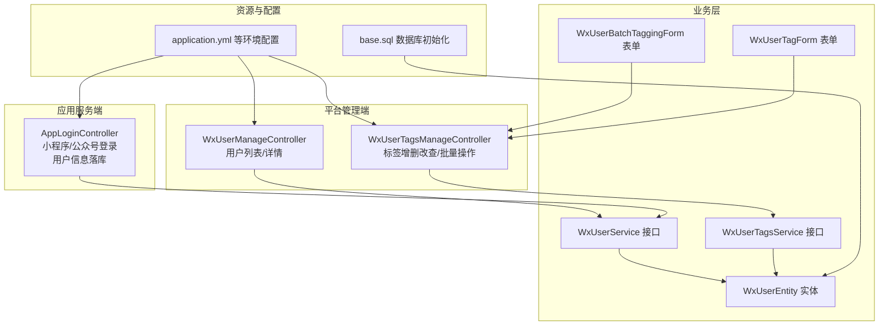
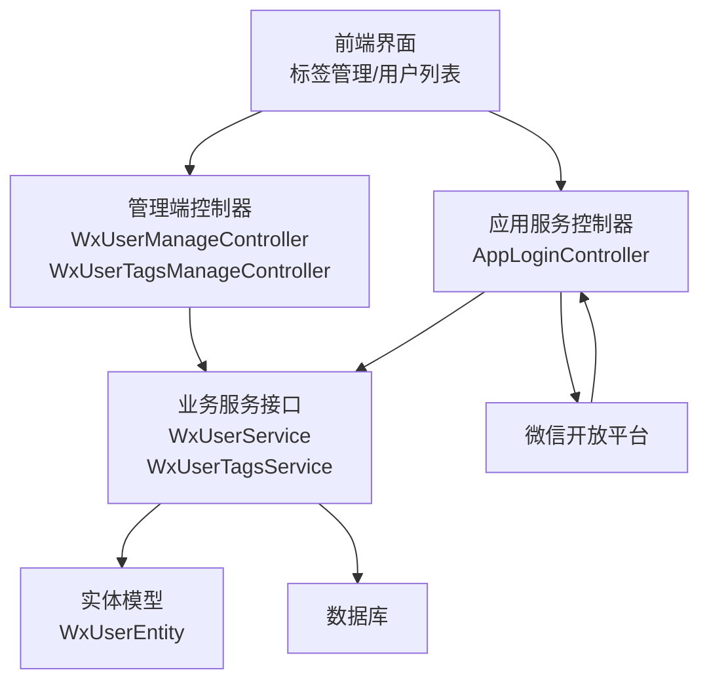
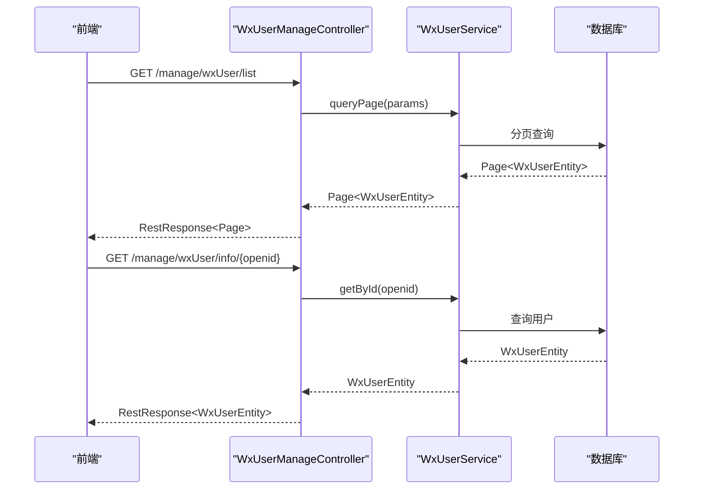
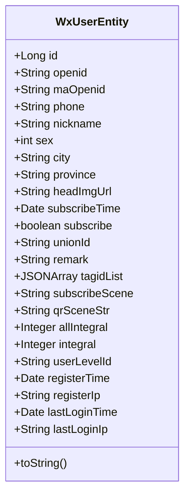
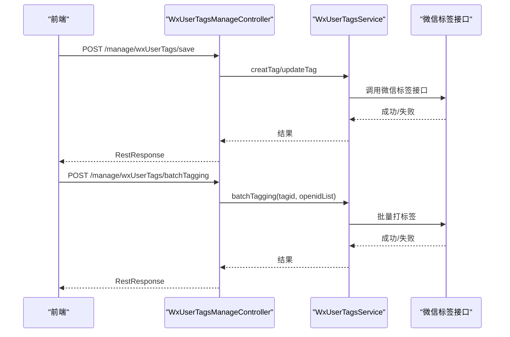
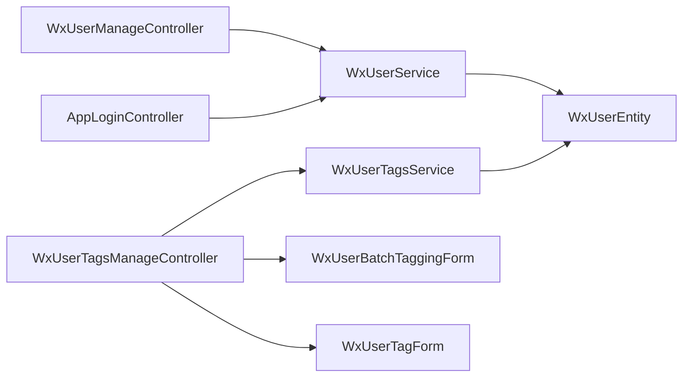

# 微信用户管理

<cite>
**本文引用的文件**
- [平台管理端控制器：WxUserManageController.java](file://platform-admin/src/main/java/com/platform/modules/wx/controller/WxUserManageController.java)
- [平台管理端控制器：WxUserTagsManageController.java](file://platform-admin/src/main/java/com/platform/modules/wx/controller/WxUserTagsManageController.java)
- [应用服务控制器：AppLoginController.java](file://platform-api/src/main/java/com/platform/modules/app/controller/AppLoginController.java)
- [微信用户实体：WxUserEntity.java](file://platform-biz/src/main/java/com/platform/modules/wx/entity/WxUserEntity.java)
- [微信用户服务接口：WxUserService.java](file://platform-biz/src/main/java/com/platform/modules/wx/service/WxUserService.java)
- [微信用户标签服务接口：WxUserTagsService.java](file://platform-biz/src/main/java/com/platform/modules/wx/service/WxUserTagsService.java)
- [微信用户批量标签表单：WxUserBatchTaggingForm.java](file://platform-biz/src/main/java/com/platform/modules/wx/form/WxUserBatchTaggingForm.java)
- [微信用户标签表单：WxUserTagForm.java](file://platform-biz/src/main/java/com/platform/modules/wx/form/WxUserTagForm.java)
- [系统配置：application.yml](file://platform-admin/src/main/resources/application.yml)
- [系统配置：application-dev.yml](file://platform-admin/src/main/resources/application-dev.yml)
- [系统配置：application-prod.yml](file://platform-admin/src/main/resources/application-prod.yml)
- [系统配置：application-test.yml](file://platform-admin/src/main/resources/application-test.yml)
- [数据库初始化脚本：base.sql](file://_sql/base.sql)
</cite>

## 目录
1. [简介](#简介)
2. [项目结构](#项目结构)
3. [核心组件](#核心组件)
4. [架构总览](#架构总览)
5. [详细组件分析](#详细组件分析)
6. [依赖关系分析](#依赖关系分析)
7. [性能与扩展性](#性能与扩展性)
8. [故障排查指南](#故障排查指南)
9. [结论](#结论)
10. [附录](#附录)

## 简介
本文件面向“微信用户管理”子系统，围绕以下目标展开：  
- 微信用户信息服务的实现：用户信息获取、同步与更新机制  
- 用户实体设计：基本信息、标签信息与统计数据  
- 用户标签管理：标签创建、用户打标签与批量操作  
- 用户分组与筛选：按标签、地区与时间条件进行分组  
- 用户行为追踪与分析：访问记录、购买行为与互动统计（概念性说明）  
- 隐私保护与数据安全：最小化采集、脱敏与访问控制  
- 定时同步与增量更新策略：基于微信接口与本地缓存的协同方案  

## 项目结构
该仓库采用多模块分层架构，微信用户管理相关能力主要分布在以下模块与包中：
- 平台管理端（platform-admin）：提供后台管理接口，如用户列表、详情、标签管理等  
- 应用服务端（platform-api）：提供小程序/公众号登录与用户信息落库逻辑  
- 业务层（platform-biz）：定义实体、服务接口与表单模型  
- 资源与配置：数据库初始化脚本、Spring Boot 配置文件  
- 前端界面（platform-admin-ui）：包含标签管理与用户列表视图组件

图表来源
- [平台管理端控制器：WxUserManageController.java:40-82](file://platform-admin/src/main/java/com/platform/modules/wx/controller/WxUserManageController.java#L40-L82)
- [平台管理端控制器：WxUserTagsManageController.java:35-112](file://platform-admin/src/main/java/com/platform/modules/wx/controller/WxUserTagsManageController.java#L35-L112)
- [应用服务控制器：AppLoginController.java:61-367](file://platform-api/src/main/java/com/platform/modules/app/controller/AppLoginController.java#L61-L367)
- [微信用户实体：WxUserEntity.java:37-171](file://platform-biz/src/main/java/com/platform/modules/wx/entity/WxUserEntity.java#L37-L171)
- [微信用户服务接口：WxUserService.java:27-73](file://platform-biz/src/main/java/com/platform/modules/wx/service/WxUserService.java#L27-L73)
- [微信用户标签服务接口：WxUserTagsService.java:26-99](file://platform-biz/src/main/java/com/platform/modules/wx/service/WxUserTagsService.java#L26-L99)
- [微信用户批量标签表单：WxUserBatchTaggingForm.java](file://platform-biz/src/main/java/com/platform/modules/wx/form/WxUserBatchTaggingForm.java)
- [微信用户标签表单：WxUserTagForm.java](file://platform-biz/src/main/java/com/platform/modules/wx/form/WxUserTagForm.java)
- [系统配置：application.yml](file://platform-admin/src/main/resources/application.yml)
- [数据库初始化脚本：base.sql](file://_sql/base.sql)

章节来源
- [平台管理端控制器：WxUserManageController.java:40-82](file://platform-admin/src/main/java/com/platform/modules/wx/controller/WxUserManageController.java#L40-L82)
- [平台管理端控制器：WxUserTagsManageController.java:35-112](file://platform-admin/src/main/java/com/platform/modules/wx/controller/WxUserTagsManageController.java#L35-L112)
- [应用服务控制器：AppLoginController.java:61-367](file://platform-api/src/main/java/com/platform/modules/app/controller/AppLoginController.java#L61-L367)
- [微信用户实体：WxUserEntity.java:37-171](file://platform-biz/src/main/java/com/platform/modules/wx/entity/WxUserEntity.java#L37-L171)
- [微信用户服务接口：WxUserService.java:27-73](file://platform-biz/src/main/java/com/platform/modules/wx/service/WxUserService.java#L27-L73)
- [微信用户标签服务接口：WxUserTagsService.java:26-99](file://platform-biz/src/main/java/com/platform/modules/wx/service/WxUserTagsService.java#L26-L99)
- [系统配置：application.yml](file://platform-admin/src/main/resources/application.yml)

## 核心组件
- 用户实体（WxUserEntity）：承载微信用户的基础信息、标签列表、订阅状态、积分与登录统计等字段，支持从微信用户对象映射构建  
- 用户服务接口（WxUserService）：提供分页查询、按 openid 更新、异步批量刷新、新增或更新、取消关注、同步公众号用户列表等能力  
- 标签服务接口（WxUserTagsService）：提供标签 CRUD、单个与批量打标签/取消标签等能力  
- 管理端控制器（WxUserManageController、WxUserTagsManageController）：暴露 REST 接口，负责权限校验与参数转发  
- 登录控制器（AppLoginController）：处理小程序/公众号登录流程，完成用户信息落库与 token 返回  
- 表单模型（WxUserBatchTaggingForm、WxUserTagForm）：封装批量标签与标签编辑请求体

章节来源
- [微信用户实体：WxUserEntity.java:37-171](file://platform-biz/src/main/java/com/platform/modules/wx/entity/WxUserEntity.java#L37-L171)
- [微信用户服务接口：WxUserService.java:27-73](file://platform-biz/src/main/java/com/platform/modules/wx/service/WxUserService.java#L27-L73)
- [微信用户标签服务接口：WxUserTagsService.java:26-99](file://platform-biz/src/main/java/com/platform/modules/wx/service/WxUserTagsService.java#L26-L99)
- [平台管理端控制器：WxUserManageController.java:40-82](file://platform-admin/src/main/java/com/platform/modules/wx/controller/WxUserManageController.java#L40-L82)
- [平台管理端控制器：WxUserTagsManageController.java:35-112](file://platform-admin/src/main/java/com/platform/modules/wx/controller/WxUserTagsManageController.java#L35-L112)
- [应用服务控制器：AppLoginController.java:61-367](file://platform-api/src/main/java/com/platform/modules/app/controller/AppLoginController.java#L61-L367)
- [微信用户批量标签表单：WxUserBatchTaggingForm.java](file://platform-biz/src/main/java/com/platform/modules/wx/form/WxUserBatchTaggingForm.java)
- [微信用户标签表单：WxUserTagForm.java](file://platform-biz/src/main/java/com/platform/modules/wx/form/WxUserTagForm.java)

## 架构总览
下图展示微信用户管理在系统中的交互关系：前端通过管理端控制器访问用户与标签数据；登录控制器对接微信开放平台完成用户信息落库；业务层服务接口由具体实现提供能力；数据库与微信接口共同构成数据来源。

图表来源
- [平台管理端控制器：WxUserManageController.java:40-82](file://platform-admin/src/main/java/com/platform/modules/wx/controller/WxUserManageController.java#L40-L82)
- [平台管理端控制器：WxUserTagsManageController.java:35-112](file://platform-admin/src/main/java/com/platform/modules/wx/controller/WxUserTagsManageController.java#L35-L112)
- [应用服务控制器：AppLoginController.java:61-367](file://platform-api/src/main/java/com/platform/modules/app/controller/AppLoginController.java#L61-L367)
- [微信用户实体：WxUserEntity.java:37-171](file://platform-biz/src/main/java/com/platform/modules/wx/entity/WxUserEntity.java#L37-L171)
- [微信用户服务接口：WxUserService.java:27-73](file://platform-biz/src/main/java/com/platform/modules/wx/service/WxUserService.java#L27-L73)
- [微信用户标签服务接口：WxUserTagsService.java:26-99](file://platform-biz/src/main/java/com/platform/modules/wx/service/WxUserTagsService.java#L26-L99)

## 详细组件分析

### 用户信息服务与同步机制
- 分页查询与详情：管理端控制器提供分页列表与按 openid 查询详情接口，权限控制严格  
- 用户信息获取与更新：服务接口定义了按 openid 刷新用户信息、异步批量刷新、新增或更新、取消关注以及同步公众号用户列表的能力  
- 登录流程与信息落库：登录控制器在小程序/公众号登录后，依据 unionid/openid 查重，合并基础信息并持久化，同时生成 token 返回  
- 实体映射：实体支持从微信用户对象构造，自动填充订阅状态、标签列表、场景值等字段

图表来源
- [平台管理端控制器：WxUserManageController.java:47-80](file://platform-admin/src/main/java/com/platform/modules/wx/controller/WxUserManageController.java#L47-L80)
- [微信用户服务接口：WxUserService.java:30-72](file://platform-biz/src/main/java/com/platform/modules/wx/service/WxUserService.java#L30-L72)

章节来源
- [平台管理端控制器：WxUserManageController.java:47-80](file://platform-admin/src/main/java/com/platform/modules/wx/controller/WxUserManageController.java#L47-L80)
- [微信用户服务接口：WxUserService.java:30-72](file://platform-biz/src/main/java/com/platform/modules/wx/service/WxUserService.java#L30-L72)
- [应用服务控制器：AppLoginController.java:177-237](file://platform-api/src/main/java/com/platform/modules/app/controller/AppLoginController.java#L177-L237)

### 用户实体设计
- 字段覆盖范围：基础信息（昵称、性别、城市、省份、头像）、订阅状态与时间、unionid/openid/ma_openid、备注与标签列表、关注场景与扫码场景值、积分与等级、注册/登录时间与 IP 等  
- 标签存储：标签 ID 列表以 JSON 数组形式存储，配合自定义类型处理器进行序列化/反序列化  
- 映射能力：支持从微信用户对象直接构造实体，自动填充订阅相关信息与标签数组

图表来源
- [微信用户实体：WxUserEntity.java:37-171](file://platform-biz/src/main/java/com/platform/modules/wx/entity/WxUserEntity.java#L37-L171)

章节来源
- [微信用户实体：WxUserEntity.java:37-171](file://platform-biz/src/main/java/com/platform/modules/wx/entity/WxUserEntity.java#L37-L171)

### 用户标签管理
- 标签 CRUD：支持创建、修改、删除标签  
- 单个与批量操作：支持为单个用户打标签/取消标签，以及批量打标签/取消标签  
- 控制器权限：所有标签相关接口均设置权限点，确保后台操作安全可控  
- 表单模型：提供标签编辑与批量标签请求体封装

图表来源
- [平台管理端控制器：WxUserTagsManageController.java:48-110](file://platform-admin/src/main/java/com/platform/modules/wx/controller/WxUserTagsManageController.java#L48-L110)
- [微信用户标签服务接口：WxUserTagsService.java:29-99](file://platform-biz/src/main/java/com/platform/modules/wx/service/WxUserTagsService.java#L29-L99)

章节来源
- [平台管理端控制器：WxUserTagsManageController.java:48-110](file://platform-admin/src/main/java/com/platform/modules/wx/controller/WxUserTagsManageController.java#L48-L110)
- [微信用户标签服务接口：WxUserTagsService.java:29-99](file://platform-biz/src/main/java/com/platform/modules/wx/service/WxUserTagsService.java#L29-L99)
- [微信用户批量标签表单：WxUserBatchTaggingForm.java](file://platform-biz/src/main/java/com/platform/modules/wx/form/WxUserBatchTaggingForm.java)
- [微信用户标签表单：WxUserTagForm.java](file://platform-biz/src/main/java/com/platform/modules/wx/form/WxUserTagForm.java)

### 用户分组与筛选
- 标签分组：通过标签 ID 列表字段可对用户进行标签维度的分组与筛选  
- 地区分组：基于城市/省份字段进行区域维度的筛选  
- 时间分组：基于注册时间、最后登录时间等字段进行时间段筛选  
- 管理端支持：分页查询接口已预留参数入口，便于扩展上述筛选条件

章节来源
- [微信用户实体：WxUserEntity.java:66-141](file://platform-biz/src/main/java/com/platform/modules/wx/entity/WxUserEntity.java#L66-L141)
- [平台管理端控制器：WxUserManageController.java:50-57](file://platform-admin/src/main/java/com/platform/modules/wx/controller/WxUserManageController.java#L50-L57)

### 用户行为追踪与数据分析（概念性）
- 访问记录：可通过最后登录时间与 IP 追踪用户活跃度  
- 购买行为：结合业务订单模块，可在用户维度统计消费频次与金额  
- 互动统计：结合消息与模板消息日志，统计互动指标  
- 注意：本节为概念性说明，不涉及具体代码实现

### 隐私保护与数据安全
- 最小化采集：仅在登录与授权场景采集必要信息（如 unionid/openid、头像、昵称、地区等）  
- 敏感信息处理：手机号在授权后才写入，且建议在存储与传输环节进行脱敏与加密  
- 访问控制：管理端接口均配置权限点，避免越权访问  
- 配置隔离：不同环境配置文件分离，敏感参数集中管理

章节来源
- [应用服务控制器：AppLoginController.java:148-169](file://platform-api/src/main/java/com/platform/modules/app/controller/AppLoginController.java#L148-L169)
- [平台管理端控制器：WxUserManageController.java:50-57](file://platform-admin/src/main/java/com/platform/modules/wx/controller/WxUserManageController.java#L50-L57)
- [平台管理端控制器：WxUserTagsManageController.java:51-86](file://platform-admin/src/main/java/com/platform/modules/wx/controller/WxUserTagsManageController.java#L51-L86)
- [系统配置：application.yml](file://platform-admin/src/main/resources/application.yml)

### 定时同步与增量更新策略
- 同步策略：服务接口提供同步公众号用户列表方法，可用于全量拉取与覆盖  
- 增量更新：建议结合微信用户列表接口的分页与时间过滤，定期执行增量更新  
- 异步刷新：提供异步批量刷新接口，降低高并发下的响应延迟  
- 缓存与去重：登录与查询流程已体现基于 unionid/openid 的查重与更新逻辑，可作为增量更新的参考

章节来源
- [微信用户服务接口：WxUserService.java:68-72](file://platform-biz/src/main/java/com/platform/modules/wx/service/WxUserService.java#L68-L72)
- [应用服务控制器：AppLoginController.java:200-223](file://platform-api/src/main/java/com/platform/modules/app/controller/AppLoginController.java#L200-L223)

## 依赖关系分析
- 控制器依赖服务接口：管理端控制器与登录控制器均依赖业务服务接口，解耦实现细节  
- 服务接口依赖实体：服务接口在持久化与查询中使用实体模型  
- 表单模型：标签管理控制器依赖表单模型进行请求体封装  
- 外部依赖：控制器声明了对微信 SDK 的异常处理能力，确保与微信接口的兼容性

图表来源
- [平台管理端控制器：WxUserManageController.java:40-82](file://platform-admin/src/main/java/com/platform/modules/wx/controller/WxUserManageController.java#L40-L82)
- [平台管理端控制器：WxUserTagsManageController.java:35-112](file://platform-admin/src/main/java/com/platform/modules/wx/controller/WxUserTagsManageController.java#L35-L112)
- [应用服务控制器：AppLoginController.java:61-367](file://platform-api/src/main/java/com/platform/modules/app/controller/AppLoginController.java#L61-L367)
- [微信用户实体：WxUserEntity.java:37-171](file://platform-biz/src/main/java/com/platform/modules/wx/entity/WxUserEntity.java#L37-L171)
- [微信用户服务接口：WxUserService.java:27-73](file://platform-biz/src/main/java/com/platform/modules/wx/service/WxUserService.java#L27-L73)
- [微信用户标签服务接口：WxUserTagsService.java:26-99](file://platform-biz/src/main/java/com/platform/modules/wx/service/WxUserTagsService.java#L26-L99)
- [微信用户批量标签表单：WxUserBatchTaggingForm.java](file://platform-biz/src/main/java/com/platform/modules/wx/form/WxUserBatchTaggingForm.java)
- [微信用户标签表单：WxUserTagForm.java](file://platform-biz/src/main/java/com/platform/modules/wx/form/WxUserTagForm.java)

## 性能与扩展性
- 分页查询：管理端控制器已提供分页接口，建议在大数据量场景下结合索引与筛选条件优化查询性能  
- 异步批量：服务接口提供异步批量刷新能力，适合高频更新场景  
- 缓存策略：建议在高频读取场景引入缓存（如 Redis），减少数据库压力  
- 扩展点：实体与服务接口已预留扩展字段与方法，便于后续增加统计维度与行为追踪

## 故障排查指南
- 登录失败：检查 code 有效性、签名验证、微信接口返回错误码  
- 标签操作异常：确认标签 ID 有效性、用户列表合法性与微信接口返回状态  
- 权限不足：核对管理端接口权限点是否正确配置  
- 配置问题：核对不同环境配置文件中的微信 AppId/Secret 与数据库连接参数

章节来源
- [应用服务控制器：AppLoginController.java:136-139](file://platform-api/src/main/java/com/platform/modules/app/controller/AppLoginController.java#L136-L139)
- [平台管理端控制器：WxUserTagsManageController.java:82-86](file://platform-admin/src/main/java/com/platform/modules/wx/controller/WxUserTagsManageController.java#L82-L86)

## 结论
本系统围绕微信用户管理提供了完整的前后端能力：  
- 用户信息获取、同步与更新机制完善，支持登录流程与实体映射  
- 用户标签管理覆盖 CRUD 与批量操作，具备权限控制与表单封装  
- 用户分组与筛选以实体字段为基础，易于扩展  
- 隐私与安全方面通过最小化采集与权限控制得到保障  
- 建议在生产环境中引入缓存与定时任务，完善增量同步与监控告警

## 附录
- 数据库初始化脚本：用于创建 WX_USER 表及相关索引  
- 环境配置：不同环境的 application.yml 文件，包含数据库与微信配置项

章节来源
- [数据库初始化脚本：base.sql](file://_sql/base.sql)
- [系统配置：application.yml](file://platform-admin/src/main/resources/application.yml)
- [系统配置：application-dev.yml](file://platform-admin/src/main/resources/application-dev.yml)
- [系统配置：application-prod.yml](file://platform-admin/src/main/resources/application-prod.yml)
- [系统配置：application-test.yml](file://platform-admin/src/main/resources/application-test.yml)