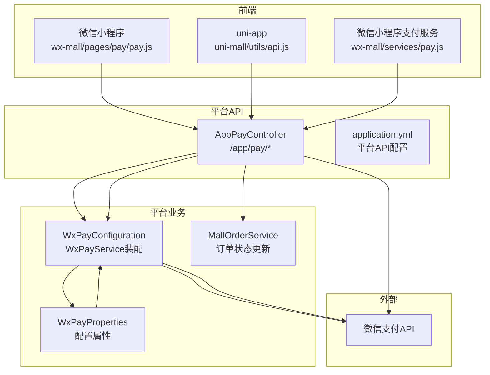
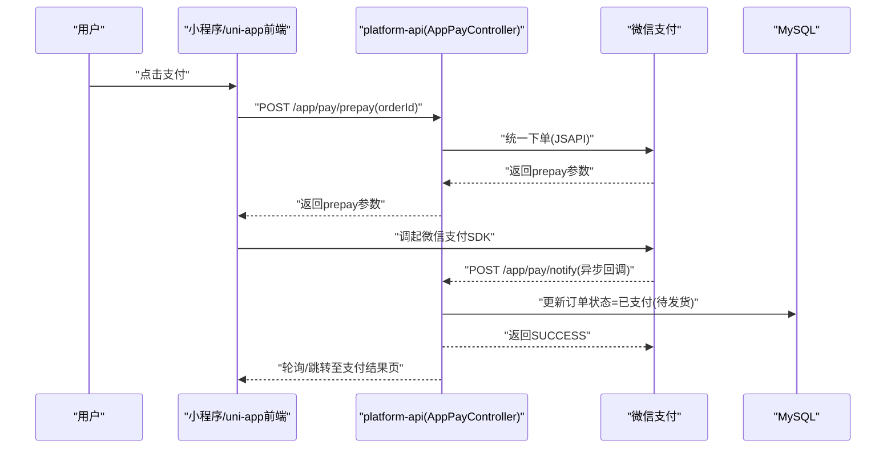
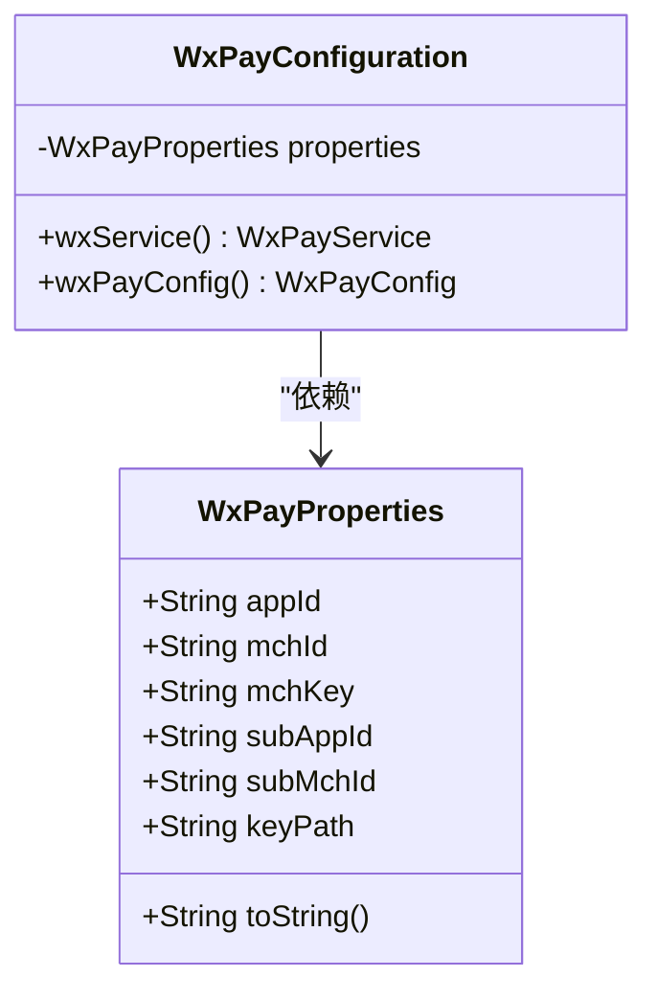
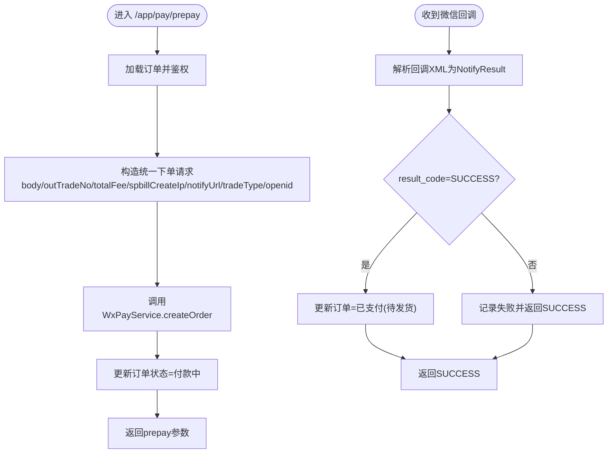
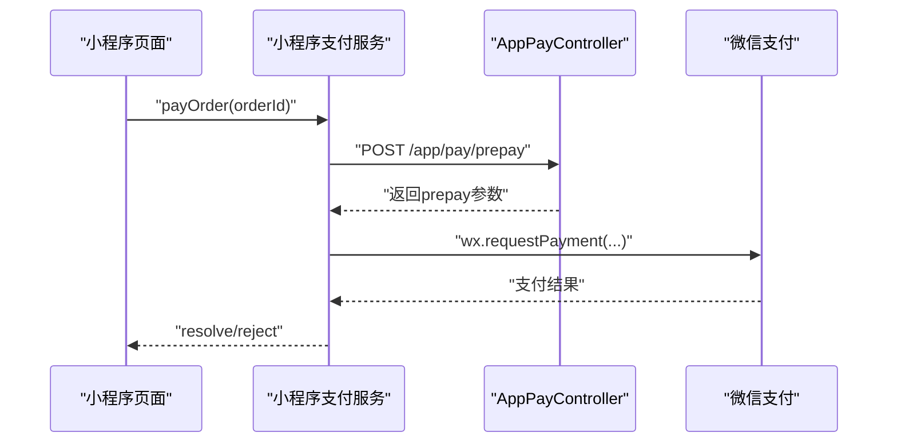
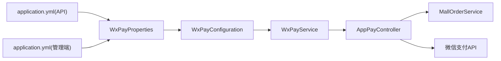

# 微信支付集成

<cite>
**本文引用的文件**
- [WxPayConfiguration.java](file://platform-biz/src/main/java/com/platform/config/WxPayConfiguration.java)
- [WxPayProperties.java](file://platform-biz/src/main/java/com/platform/config/WxPayProperties.java)
- [AppPayController.java](file://platform-api/src/main/java/com/platform/modules/app/controller/AppPayController.java)
- [application.yml（平台API）](file://platform-api/src/main/resources/application.yml)
- [application.yml（平台管理端）](file://platform-admin/src/main/resources/application.yml)
- [pay.js（微信小程序支付服务）](file://wx-mall/services/pay.js)
- [pay.js（微信小程序页面）](file://wx-mall/pages/pay/pay.js)
- [pay.js（uni-app支付服务）](file://uni-mall/utils/api.js)
- [MallOrderService.java](file://platform-biz/src/main/java/com/platform/modules/mall/service/MallOrderService.java)
- [MallOrderEntity.java](file://platform-biz/src/main/java/com/platform/modules/mall/entity/MallOrderEntity.java)
- [MallOrderGoodsService.java](file://platform-biz/src/main/java/com/platform/modules/mall/service/MallOrderGoodsService.java)
- [MallOrderGoodsEntity.java](file://platform-biz/src/main/java/com/platform/modules/mall/entity/MallOrderGoodsEntity.java)
- [时序架构图.mmd](file://docs/时序架构图.mmd)
</cite>

## 目录
1. [简介](#简介)
2. [项目结构](#项目结构)
3. [核心组件](#核心组件)
4. [架构总览](#架构总览)
5. [详细组件分析](#详细组件分析)
6. [依赖关系分析](#依赖关系分析)
7. [性能与安全考虑](#性能与安全考虑)
8. [故障排查指南](#故障排查指南)
9. [结论](#结论)
10. [附录：配置模板与流程示例](#附录配置模板与流程示例)

## 简介
本文件面向需要在本项目中集成微信支付的开发者，系统性说明微信支付配置类的使用方法、核心流程实现（统一下单、支付参数生成、签名与回调处理）、异步通知与订单状态更新策略，以及异常处理与最佳实践。文档同时提供从下单到支付完成的完整流程图示与配置模板，帮助快速落地。

## 项目结构
微信支付相关代码分布在三个模块：
- 平台API层（platform-api）：对外提供支付接口、接收微信回调并更新订单状态
- 平台业务层（platform-biz）：封装微信支付配置与属性，注入WxPayService
- 前端小程序与uni-app（wx-mall、uni-mall）：发起支付请求、调起微信支付SDK

图表来源
- [AppPayController.java:48-261](file://platform-api/src/main/java/com/platform/modules/app/controller/AppPayController.java#L48-L261)
- [WxPayConfiguration.java:35-65](file://platform-biz/src/main/java/com/platform/config/WxPayConfiguration.java#L35-L65)
- [WxPayProperties.java:27-72](file://platform-biz/src/main/java/com/platform/config/WxPayProperties.java#L27-L72)
- [application.yml（平台API）:157-195](file://platform-api/src/main/resources/application.yml#L157-L195)
- [application.yml（平台管理端）:169-204](file://platform-admin/src/main/resources/application.yml#L169-L204)

章节来源
- [AppPayController.java:48-261](file://platform-api/src/main/java/com/platform/modules/app/controller/AppPayController.java#L48-L261)
- [WxPayConfiguration.java:35-65](file://platform-biz/src/main/java/com/platform/config/WxPayConfiguration.java#L35-L65)
- [WxPayProperties.java:27-72](file://platform-biz/src/main/java/com/platform/config/WxPayProperties.java#L27-L72)
- [application.yml（平台API）:157-195](file://platform-api/src/main/resources/application.yml#L157-L195)
- [application.yml（平台管理端）:169-204](file://platform-admin/src/main/resources/application.yml#L169-L204)

## 核心组件
- WxPayProperties：声明式读取配置前缀“wx.pay”，提供appId、mchId、mchKey、subAppId、subMchId、keyPath、spbillCreateIp、baseNotifyUrl等关键参数。
- WxPayConfiguration：基于WxPayProperties装配WxPayService与WxPayConfig，设置沙箱开关、证书路径等。
- AppPayController：统一下单、查询订单、异步回调、退款等核心接口的实现入口。
- 前端支付服务：小程序/uni-app侧发起预支付请求、调起微信支付SDK、处理支付结果。

章节来源
- [WxPayProperties.java:27-72](file://platform-biz/src/main/java/com/platform/config/WxPayProperties.java#L27-L72)
- [WxPayConfiguration.java:35-65](file://platform-biz/src/main/java/com/platform/config/WxPayConfiguration.java#L35-L65)
- [AppPayController.java:48-261](file://platform-api/src/main/java/com/platform/modules/app/controller/AppPayController.java#L48-L261)
- [pay.js（微信小程序支付服务）:1-43](file://wx-mall/services/pay.js#L1-L43)
- [pay.js（微信小程序页面）:32-61](file://wx-mall/pages/pay/pay.js#L32-L61)
- [pay.js（uni-app支付服务）](file://uni-mall/utils/api.js)

## 架构总览
下图展示了从前端到微信支付的完整时序，包括统一下单、支付参数返回、调起支付、异步回调与订单状态更新。

图表来源
- [时序架构图.mmd:1-47](file://docs/时序架构图.mmd#L1-L47)
- [AppPayController.java:64-203](file://platform-api/src/main/java/com/platform/modules/app/controller/AppPayController.java#L64-L203)
- [pay.js（微信小程序页面）:32-61](file://wx-mall/pages/pay/pay.js#L32-L61)
- [pay.js（微信小程序支付服务）:11-39](file://wx-mall/services/pay.js#L11-L39)

## 详细组件分析

### 配置类与属性：WxPayConfiguration 与 WxPayProperties
- WxPayProperties
  - 作用域：读取配置前缀“wx.pay”
  - 关键参数：appId、mchId、mchKey、subAppId、subMchId、keyPath、spbillCreateIp、baseNotifyUrl
  - 使用场景：驱动WxPayConfig，决定支付主体、商户信息、证书位置与回调地址
- WxPayConfiguration
  - 作用：装配WxPayService与WxPayConfig
  - 细节：设置沙箱开关、证书路径、子商户信息；通过@EnableConfigurationProperties启用属性绑定

图表来源
- [WxPayProperties.java:27-72](file://platform-biz/src/main/java/com/platform/config/WxPayProperties.java#L27-L72)
- [WxPayConfiguration.java:35-65](file://platform-biz/src/main/java/com/platform/config/WxPayConfiguration.java#L35-L65)

章节来源
- [WxPayProperties.java:27-72](file://platform-biz/src/main/java/com/platform/config/WxPayProperties.java#L27-L72)
- [WxPayConfiguration.java:35-65](file://platform-biz/src/main/java/com/platform/config/WxPayConfiguration.java#L35-L65)

### 控制器：AppPayController 的核心流程
- 统一下单（/app/pay/prepay）
  - 参数构造：body、outTradeNo、totalFee、spbillCreateIp、notifyUrl、tradeType、openid
  - 调用WxPayService.createOrder生成预支付参数
  - 业务处理：写入订单的package值与支付状态为“付款中”
- 查询订单（/app/pay/query）
  - 调用WxPayService.queryOrder查询支付状态
  - 成功则更新订单状态为“已支付（待发货）”
- 异步回调（/app/pay/notify）
  - 解析微信回调XML为WxPayOrderNotifyResult
  - 根据result_code判断成功/失败，更新订单状态
- 退款（/app/pay/refund）
  - 构造退款请求，调用WxPayService.refund
  - 根据订单当前状态设置为“已退款/已退货”

图表来源
- [AppPayController.java:64-203](file://platform-api/src/main/java/com/platform/modules/app/controller/AppPayController.java#L64-L203)

章节来源
- [AppPayController.java:64-203](file://platform-api/src/main/java/com/platform/modules/app/controller/AppPayController.java#L64-L203)

### 前端支付流程：小程序与uni-app
- 小程序页面（wx-mall/pages/pay/pay.js）
  - 调用后端接口获取prepay参数
  - 调用wx.requestPayment传入时间戳、随机串、package、签名类型、paySign
  - 成功/失败分别跳转到支付结果页
- 小程序服务（wx-mall/services/pay.js）
  - 封装请求prepay与wx.requestPayment的Promise
- uni-app（uni-mall/utils/api.js）
  - 提供统一的支付调用入口，内部同样请求后端prepay并调起支付

图表来源
- [pay.js（微信小程序页面）:32-61](file://wx-mall/pages/pay/pay.js#L32-L61)
- [pay.js（微信小程序支付服务）:11-39](file://wx-mall/services/pay.js#L11-L39)
- [AppPayController.java:64-119](file://platform-api/src/main/java/com/platform/modules/app/controller/AppPayController.java#L64-L119)

章节来源
- [pay.js（微信小程序页面）:32-61](file://wx-mall/pages/pay/pay.js#L32-L61)
- [pay.js（微信小程序支付服务）:11-39](file://wx-mall/services/pay.js#L11-L39)
- [pay.js（uni-app支付服务）](file://uni-mall/utils/api.js)

### 订单模型与服务
- MallOrderService：提供订单查询、分页、更新等能力，支付回调与退款均依赖其更新订单状态
- MallOrderEntity：订单实体，包含支付状态、订单状态、发货状态、支付时间等字段
- MallOrderGoodsService/Entity：订单商品明细，用于生成body描述

章节来源
- [MallOrderService.java:40-102](file://platform-biz/src/main/java/com/platform/modules/mall/service/MallOrderService.java#L40-L102)
- [MallOrderEntity.java](file://platform-biz/src/main/java/com/platform/modules/mall/entity/MallOrderEntity.java)
- [MallOrderGoodsService.java](file://platform-biz/src/main/java/com/platform/modules/mall/service/MallOrderGoodsService.java)
- [MallOrderGoodsEntity.java](file://platform-biz/src/main/java/com/platform/modules/mall/entity/MallOrderGoodsEntity.java)

## 依赖关系分析
- 配置层
  - application.yml（平台API）读取“wx.pay”前缀，驱动WxPayProperties
  - application.yml（平台管理端）也包含相同前缀配置，便于多环境一致性
- 业务层
  - WxPayConfiguration装配WxPayService，依赖WxPayProperties
- 控制器层
  - AppPayController注入WxPayService与MallOrderService，完成统一下单、回调处理、退款
- 前端层
  - 小程序/uni-app通过HTTP请求与后端交互，最终调用微信支付SDK

图表来源
- [application.yml（平台API）:157-195](file://platform-api/src/main/resources/application.yml#L157-L195)
- [application.yml（平台管理端）:169-204](file://platform-admin/src/main/resources/application.yml#L169-L204)
- [WxPayProperties.java:27-72](file://platform-biz/src/main/java/com/platform/config/WxPayProperties.java#L27-L72)
- [WxPayConfiguration.java:35-65](file://platform-biz/src/main/java/com/platform/config/WxPayConfiguration.java#L35-L65)
- [AppPayController.java:50-58](file://platform-api/src/main/java/com/platform/modules/app/controller/AppPayController.java#L50-L58)

章节来源
- [application.yml（平台API）:157-195](file://platform-api/src/main/resources/application.yml#L157-L195)
- [application.yml（平台管理端）:169-204](file://platform-admin/src/main/resources/application.yml#L169-L204)
- [WxPayProperties.java:27-72](file://platform-biz/src/main/java/com/platform/config/WxPayProperties.java#L27-L72)
- [WxPayConfiguration.java:35-65](file://platform-biz/src/main/java/com/platform/config/WxPayConfiguration.java#L35-L65)
- [AppPayController.java:50-58](file://platform-api/src/main/java/com/platform/modules/app/controller/AppPayController.java#L50-L58)

## 性能与安全考虑
- 性能
  - 统一下单与回调处理均为短链路，避免在回调中做重逻辑
  - 建议对回调接口增加幂等校验（如基于outTradeNo去重）
- 安全
  - 证书路径keyPath需严格控制权限，生产环境建议使用绝对路径
  - baseNotifyUrl需为公网可达且HTTPS，确保微信回调可达
  - 对敏感参数（如mchKey）严禁明文存储于日志或前端
- 可靠性
  - 回调处理需保证返回SUCCESS，避免微信重复推送
  - 建议增加回调失败重试与人工复核机制

## 故障排查指南
- 回调不生效
  - 检查baseNotifyUrl是否正确、可访问且HTTPS
  - 确认WxPayConfig已正确注入keyPath与mchKey
- 支付失败
  - 查看AppPayController回调日志，确认result_code与outTradeNo
  - 核对tradeType与openid是否匹配（JSAPI需openid）
- 重复回调
  - 在回调入口增加幂等校验，避免重复更新订单状态
- 退款异常
  - 确认订单状态与退款状态映射逻辑一致
  - 核对退款金额与订单金额单位换算（元->分）

章节来源
- [AppPayController.java:163-203](file://platform-api/src/main/java/com/platform/modules/app/controller/AppPayController.java#L163-L203)
- [application.yml（平台API）:177-195](file://platform-api/src/main/resources/application.yml#L177-L195)

## 结论
本项目通过WxPayProperties与WxPayConfiguration实现了微信支付配置的集中化管理，AppPayController提供了统一下单、查询、回调与退款的完整闭环。结合小程序/uni-app的支付调用，形成从前端到微信支付再到订单状态更新的稳定流程。建议在生产环境中强化证书与回调的安全性与可靠性保障。

## 附录：配置模板与流程示例

### 配置模板（application.yml）
- 平台API层（wx.pay）
  - appId：公众号/小程序的appid
  - mchId：商户号
  - mchKey：商户密钥
  - subAppId/subMchId：服务商模式下的子商户信息
  - keyPath：apiclient_cert.p12证书路径（支持classpath:）
  - spbillCreateIp：APP/Native支付时必填
  - baseNotifyUrl：支付回调通知地址（公网HTTPS）
- 平台管理端（wx.pay）
  - 与API层保持一致，便于多环境统一

章节来源
- [application.yml（平台API）:177-195](file://platform-api/src/main/resources/application.yml#L177-L195)
- [application.yml（平台管理端）:169-204](file://platform-admin/src/main/resources/application.yml#L169-L204)

### 代码片段路径参考
- 统一下单与参数返回
  - [AppPayController.prepay:64-119](file://platform-api/src/main/java/com/platform/modules/app/controller/AppPayController.java#L64-L119)
- 查询订单状态
  - [AppPayController.query:124-156](file://platform-api/src/main/java/com/platform/modules/app/controller/AppPayController.java#L124-L156)
- 异步回调处理
  - [AppPayController.notify:163-203](file://platform-api/src/main/java/com/platform/modules/app/controller/AppPayController.java#L163-L203)
- 退款接口
  - [AppPayController.refund:208-248](file://platform-api/src/main/java/com/platform/modules/app/controller/AppPayController.java#L208-L248)
- 前端调起支付
  - [小程序页面 pay.js:32-61](file://wx-mall/pages/pay/pay.js#L32-L61)
  - [小程序支付服务 pay.js:11-39](file://wx-mall/services/pay.js#L11-L39)
  - [uni-app支付服务](file://uni-mall/utils/api.js)