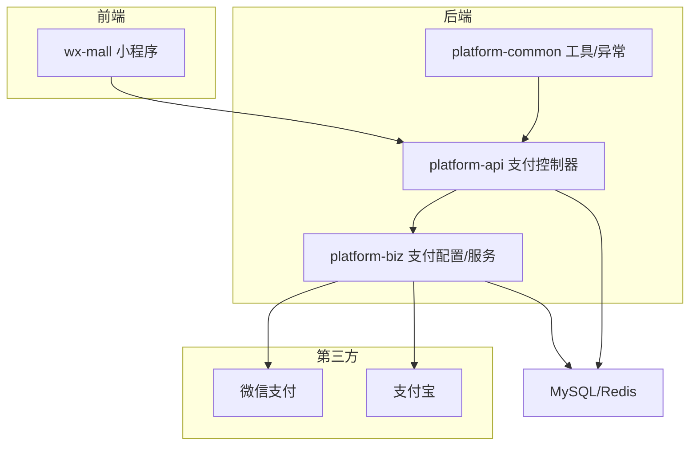
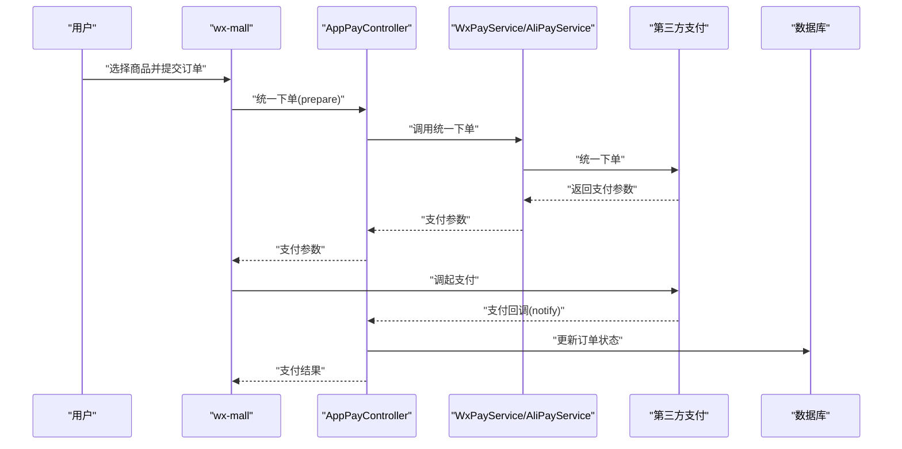
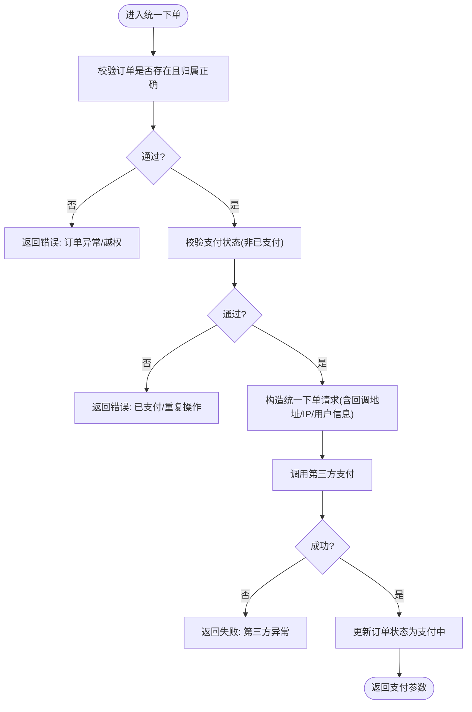
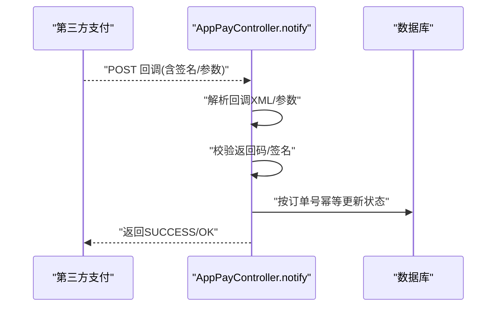
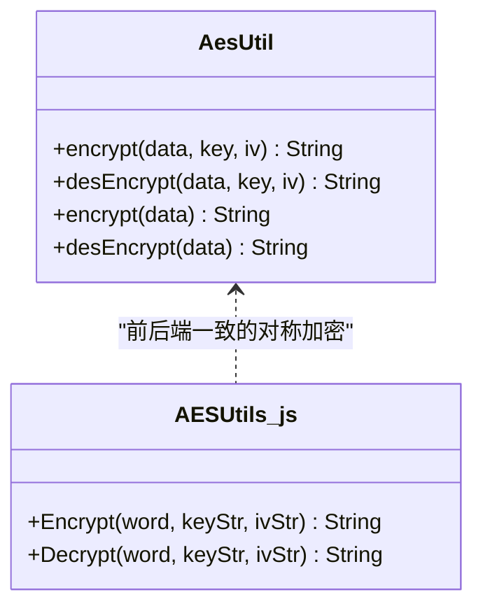
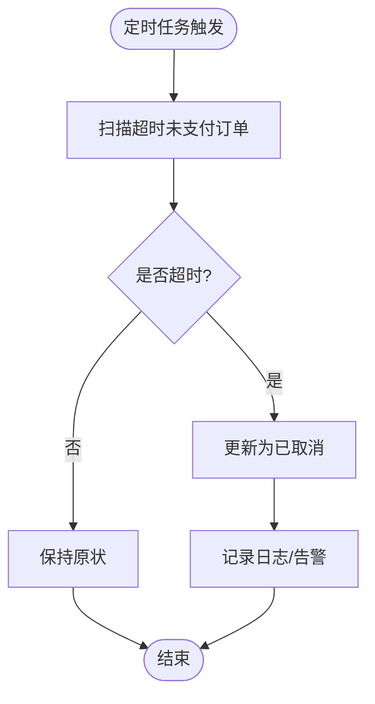
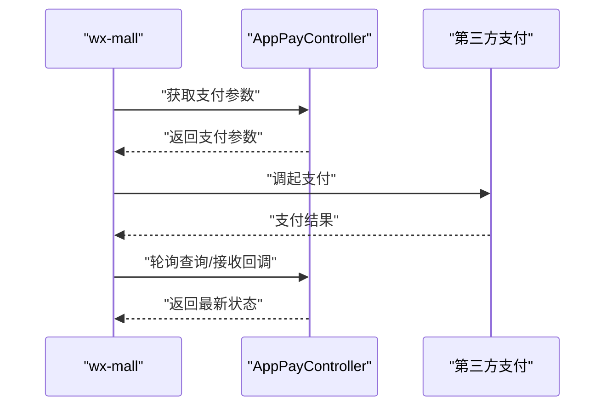
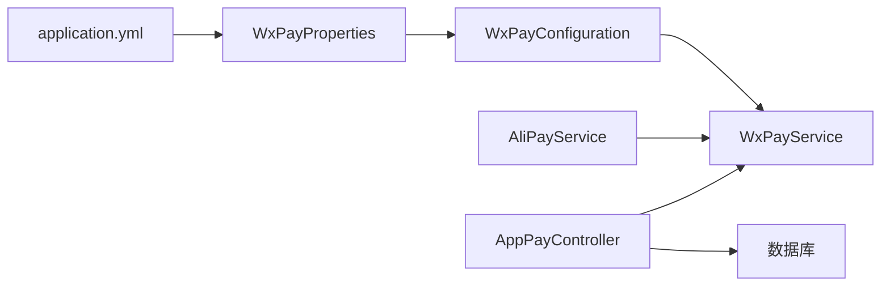

# 支付安全与风控

<cite>
**本文引用的文件**
- [AppPayController.java](file://platform-api/src/main/java/com/platform/modules/app/controller/AppPayController.java)
- [AliPayService.java](file://platform-biz/src/main/java/com/platform/config/AliPayService.java)
- [WxPayConfiguration.java](file://platform-biz/src/main/java/com/platform/config/WxPayConfiguration.java)
- [WxPayProperties.java](file://platform-biz/src/main/java/com/platform/config/WxPayProperties.java)
- [application.yml](file://platform-admin/src/main/resources/application.yml)
- [AesUtil.java](file://platform-common/src/main/java/com/platform/common/utils/AesUtil.java)
- [AESUtils.js](file://platform-admin-ui/src/utils/AESUtils.js)
- [BusinessException.java](file://platform-common/src/main/java/com/platform/common/exception/BusinessException.java)
- [pay.js](file://wx-mall/services/pay.js)
- [payResult.js](file://wx-mall/pages/payResult/payResult.js)
- [TestTask.java](file://platform-admin/src/main/java/com/platform/modules/job/task/TestTask.java)
- [系统架构说明.md](file://docs/系统架构说明.md)
- [时序架构图.mmd](file://docs/时序架构图.mmd)
</cite>

## 目录
1. [引言](#引言)
2. [项目结构](#项目结构)
3. [核心组件](#核心组件)
4. [架构总览](#架构总览)
5. [组件详解](#组件详解)
6. [依赖关系分析](#依赖关系分析)
7. [性能与可用性优化](#性能与可用性优化)
8. [故障排查指南](#故障排查指南)
9. [结论](#结论)
10. [附录](#附录)

## 引言
本文件聚焦于支付安全与风控，围绕支付过程中的参数校验、签名验证、防重放、加密传输与存储、风控识别与拦截、回调安全处理、成功率优化策略以及异常处理最佳实践展开。结合平台现有代码与配置，给出可落地的安全加固与风控方案。

## 项目结构
该平台采用多前端入口与双后端服务入口的架构，支付链路主要由小程序前端、API网关、业务服务与第三方支付通道构成。支付相关的关键位置包括：
- 前端：wx-mall 提供支付调用与结果页
- 后端：platform-api 提供支付入口与回调处理；platform-biz 提供支付配置与SDK封装；platform-common 提供通用工具与异常体系
- 配置：application.yml 提供微信/支付宝支付参数与回调地址

**图表来源**
- [时序架构图.mmd](file://docs/时序架构图.mmd)
- [系统架构说明.md](file://docs/系统架构说明.md)

**章节来源**
- [系统架构说明.md](file://docs/系统架构说明.md)
- [时序架构图.mmd](file://docs/时序架构图.mmd)

## 核心组件
- 支付控制器：负责统一下单、查询、回调、退款等入口，进行基础参数校验与业务状态更新
- 支付配置与SDK封装：提供微信/支付宝支付参数注入、回调地址配置与SDK调用
- 加密工具：提供前后端一致的AES加解密能力，用于敏感数据保护
- 异常体系：统一业务异常，便于风控与审计
- 前端支付流程：发起支付、接收回调结果、轮询查询状态

**章节来源**
- [AppPayController.java](file://platform-api/src/main/java/com/platform/modules/app/controller/AppPayController.java)
- [AliPayService.java](file://platform-biz/src/main/java/com/platform/config/AliPayService.java)
- [WxPayConfiguration.java](file://platform-biz/src/main/java/com/platform/config/WxPayConfiguration.java)
- [WxPayProperties.java](file://platform-biz/src/main/java/com/platform/config/WxPayProperties.java)
- [AesUtil.java](file://platform-common/src/main/java/com/platform/common/utils/AesUtil.java)
- [BusinessException.java](file://platform-common/src/main/java/com/platform/common/exception/BusinessException.java)
- [pay.js](file://wx-mall/services/pay.js)
- [payResult.js](file://wx-mall/pages/payResult/payResult.js)

## 架构总览
支付流程从用户端发起，经API层统一下单，调用第三方支付SDK，完成后台回调更新订单状态，前端轮询或接收回调结果。

**图表来源**
- [时序架构图.mmd](file://docs/时序架构图.mmd)
- [AppPayController.java](file://platform-api/src/main/java/com/platform/modules/app/controller/AppPayController.java)
- [WxPayConfiguration.java](file://platform-biz/src/main/java/com/platform/config/WxPayConfiguration.java)
- [AliPayService.java](file://platform-biz/src/main/java/com/platform/config/AliPayService.java)

## 组件详解

### 1) 参数校验与权限控制
- 订单存在性与归属校验：下单前校验订单是否存在且属于当前用户
- 支付状态校验：防止重复支付
- IP与用户态校验：统一下单时记录客户端IP
- 越权拦截：基于注解与用户上下文进行鉴权

**图表来源**
- [AppPayController.java](file://platform-api/src/main/java/com/platform/modules/app/controller/AppPayController.java)

**章节来源**
- [AppPayController.java](file://platform-api/src/main/java/com/platform/modules/app/controller/AppPayController.java)

### 2) 签名验证与回调安全
- 微信回调：解析回调XML，校验返回码，幂等更新订单状态
- 支付宝回调：通过SDK配置的回调地址与公钥/私钥参数进行验签与处理
- 回调地址一致性：确保回调URL与配置一致，避免钓鱼或篡改

**图表来源**
- [AppPayController.java](file://platform-api/src/main/java/com/platform/modules/app/controller/AppPayController.java)
- [AliPayService.java](file://platform-biz/src/main/java/com/platform/config/AliPayService.java)

**章节来源**
- [AppPayController.java](file://platform-api/src/main/java/com/platform/modules/app/controller/AppPayController.java)
- [AliPayService.java](file://platform-biz/src/main/java/com/platform/config/AliPayService.java)

### 3) 防重放与幂等设计
- 幂等键：使用商户订单号作为幂等键，避免重复处理
- 状态前置：支付中/已支付状态在下单阶段即写入，回调仅做最终确认
- 去重缓存：可在回调入口增加去重标记（如Redis key），结合TTL实现短时去重

**章节来源**
- [AppPayController.java](file://platform-api/src/main/java/com/platform/modules/app/controller/AppPayController.java)

### 4) 加密传输与存储安全
- 传输安全：回调地址与支付网关均使用HTTPS
- 敏感数据保护：提供AES工具类与前端CryptoJS实现，用于对称加密
- 密钥管理：建议将密钥置于安全配置中心或环境变量，避免硬编码

**图表来源**
- [AesUtil.java](file://platform-common/src/main/java/com/platform/common/utils/AesUtil.java)
- [AESUtils.js](file://platform-admin-ui/src/utils/AESUtils.js)

**章节来源**
- [AesUtil.java](file://platform-common/src/main/java/com/platform/common/utils/AesUtil.java)
- [AESUtils.js](file://platform-admin-ui/src/utils/AESUtils.js)
- [application.yml](file://platform-admin/src/main/resources/application.yml)

### 5) 支付风控实现方案
- 异常订单监控：定时任务扫描超时未支付订单并自动取消
- 风险交易识别：基于用户维度、金额阈值、设备/IP异常等维度建立规则
- 自动拦截：接入黑白名单、限额与风控引擎，阻断高危交易
- 回调审计：记录回调原始报文与验签结果，便于事后审计

**图表来源**
- [TestTask.java](file://platform-admin/src/main/java/com/platform/modules/job/task/TestTask.java)

**章节来源**
- [TestTask.java](file://platform-admin/src/main/java/com/platform/modules/job/task/TestTask.java)

### 6) 支付回调安全处理
- 回调地址验证：确保回调URL与配置一致
- 参数签名验证：使用平台侧配置的公钥/私钥参数进行验签
- 重复请求防护：基于订单号+签名摘要的去重缓存
- 成功响应：严格返回SUCCESS/OK，避免泄露内部错误细节

**章节来源**
- [AppPayController.java](file://platform-api/src/main/java/com/platform/modules/app/controller/AppPayController.java)
- [AliPayService.java](file://platform-biz/src/main/java/com/platform/config/AliPayService.java)

### 7) 前端支付流程与安全性
- 发起支付：从前端服务获取支付参数并调起支付SDK
- 结果处理：轮询查询或监听回调，避免依赖单一渠道
- 交互提示：失败时友好提示并引导重新支付

**图表来源**
- [pay.js](file://wx-mall/services/pay.js)
- [payResult.js](file://wx-mall/pages/payResult/payResult.js)
- [AppPayController.java](file://platform-api/src/main/java/com/platform/modules/app/controller/AppPayController.java)

**章节来源**
- [pay.js](file://wx-mall/services/pay.js)
- [payResult.js](file://wx-mall/pages/payResult/payResult.js)

### 8) 支付成功率优化策略
- 超时处理：统一下单与回调均设置合理超时，避免长时间占用资源
- 重试机制：对网络抖动或第三方瞬时异常进行指数退避重试
- 降级方案：当第三方不可用时，返回明确错误并引导用户稍后重试
- 前端轮询：在回调延迟场景下，提供订单状态轮询接口

**章节来源**
- [AppPayController.java](file://platform-api/src/main/java/com/platform/modules/app/controller/AppPayController.java)

## 依赖关系分析
- 控制器依赖业务服务与支付SDK
- 业务服务依赖配置类与第三方SDK
- 配置类从application.yml读取参数
- 前端通过API获取支付参数并调起支付

**图表来源**
- [application.yml](file://platform-admin/src/main/resources/application.yml)
- [WxPayProperties.java](file://platform-biz/src/main/java/com/platform/config/WxPayProperties.java)
- [WxPayConfiguration.java](file://platform-biz/src/main/java/com/platform/config/WxPayConfiguration.java)
- [AliPayService.java](file://platform-biz/src/main/java/com/platform/config/AliPayService.java)
- [AppPayController.java](file://platform-api/src/main/java/com/platform/modules/app/controller/AppPayController.java)

**章节来源**
- [application.yml](file://platform-admin/src/main/resources/application.yml)
- [WxPayProperties.java](file://platform-biz/src/main/java/com/platform/config/WxPayProperties.java)
- [WxPayConfiguration.java](file://platform-biz/src/main/java/com/platform/config/WxPayConfiguration.java)
- [AliPayService.java](file://platform-biz/src/main/java/com/platform/config/AliPayService.java)
- [AppPayController.java](file://platform-api/src/main/java/com/platform/modules/app/controller/AppPayController.java)

## 性能与可用性优化
- 异步回调：回调处理尽快返回，耗时逻辑放入异步队列
- 缓存命中：热点订单状态与参数使用缓存减少DB压力
- 超时与重试：合理设置超时与重试次数，避免雪崩
- 降级策略：第三方不可用时提供兜底页面与提示

[本节为通用指导，无需具体文件引用]

## 故障排查指南
- 回调失败：检查回调地址、签名参数与第三方回执
- 重复回调：确认幂等键与去重缓存
- 参数错误：核对统一下单参数与第三方SDK版本
- 异常抛出：使用统一异常类进行包装与定位

**章节来源**
- [BusinessException.java](file://platform-common/src/main/java/com/platform/common/exception/BusinessException.java)
- [AppPayController.java](file://platform-api/src/main/java/com/platform/modules/app/controller/AppPayController.java)

## 结论
通过参数校验、签名验证、幂等与去重、加密传输与存储、风控规则与定时任务、回调安全处理以及成功率优化策略，可显著提升支付链路的安全性与稳定性。建议在现有基础上进一步完善风控引擎、审计日志与密钥管理，持续迭代以应对复杂场景。

## 附录
- 配置要点：确保回调地址、证书与密钥正确配置
- 前端要点：与后端保持一致的加密参数与签名策略
- 运维要点：监控回调成功率、异常订单占比与第三方可用性

**章节来源**
- [application.yml](file://platform-admin/src/main/resources/application.yml)
- [AesUtil.java](file://platform-common/src/main/java/com/platform/common/utils/AesUtil.java)
- [AESUtils.js](file://platform-admin-ui/src/utils/AESUtils.js)
- [SystemArch.md](file://docs/系统架构说明.md)