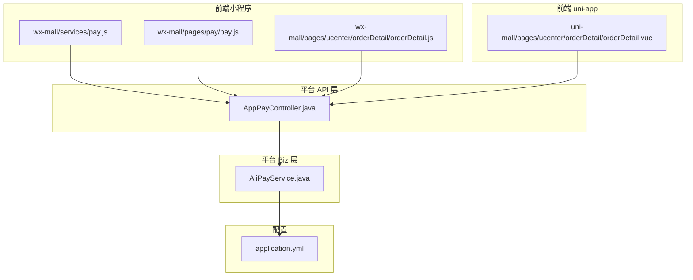
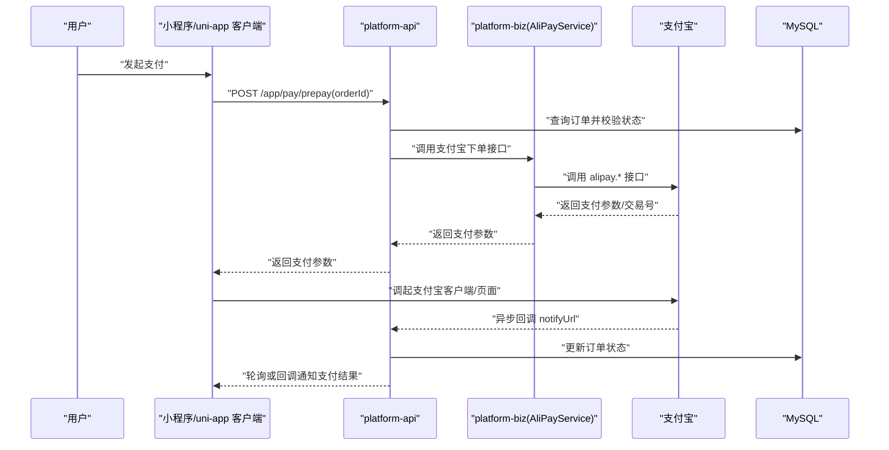
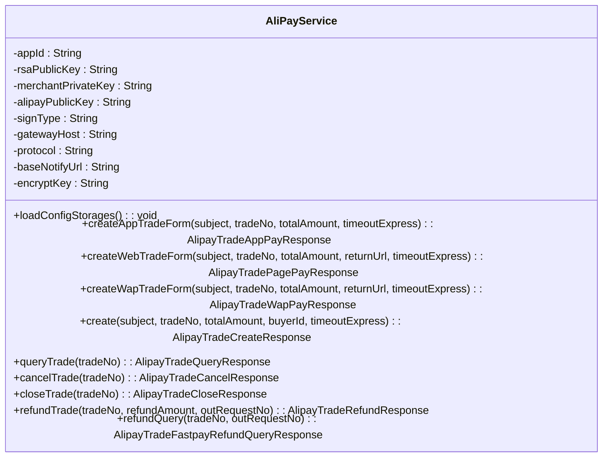
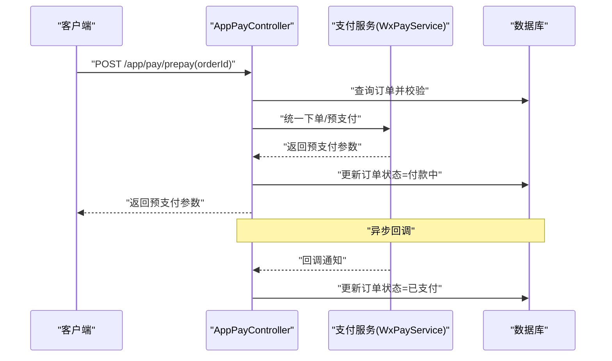
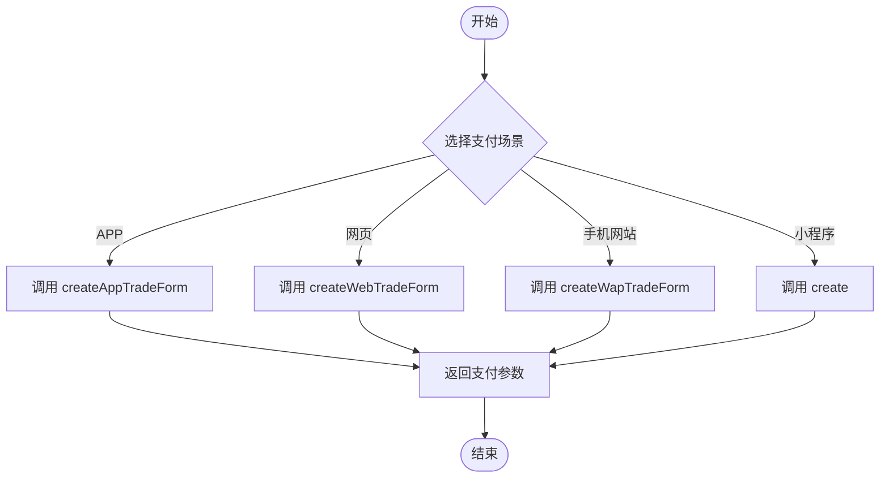
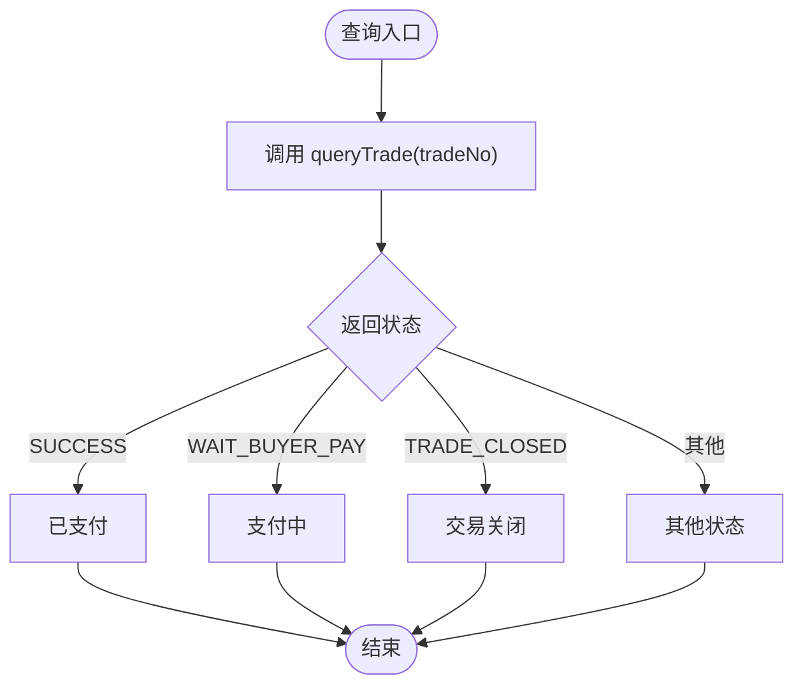
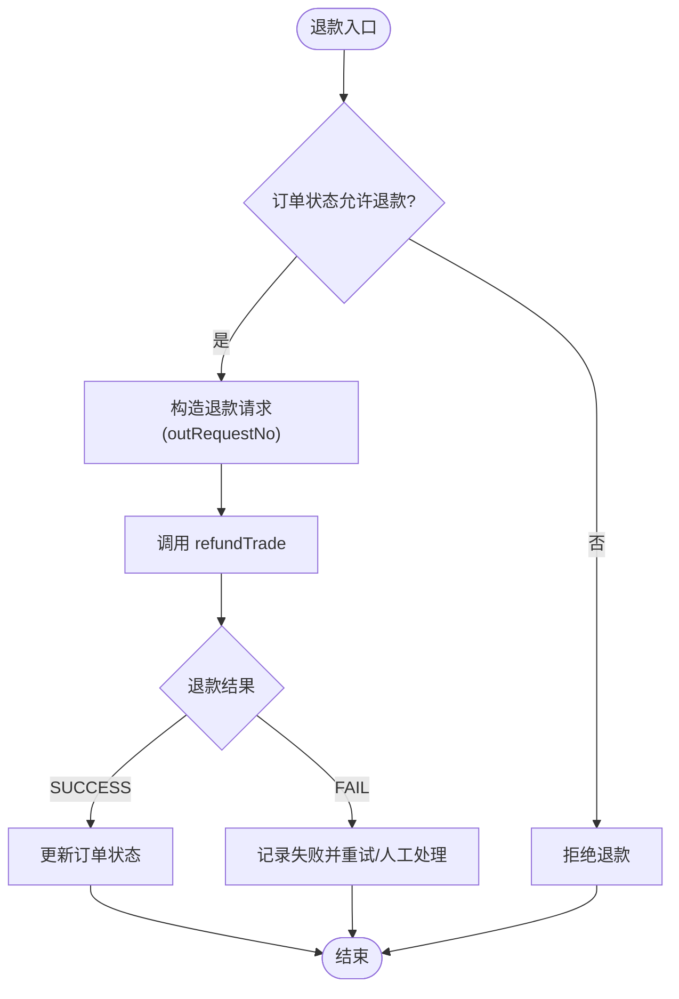
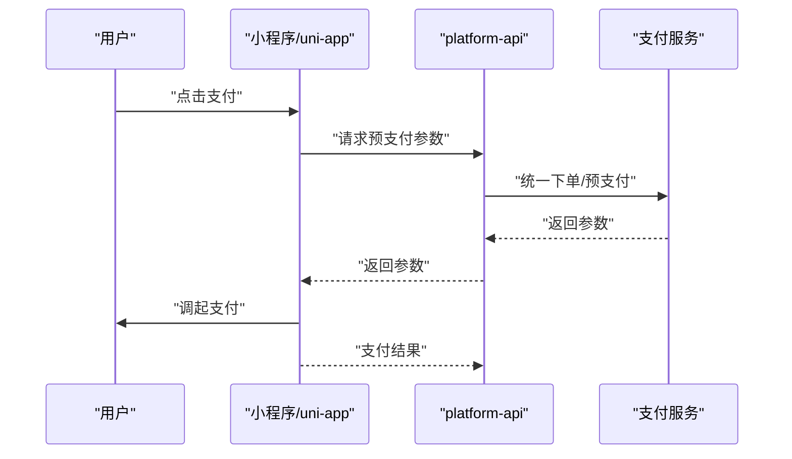
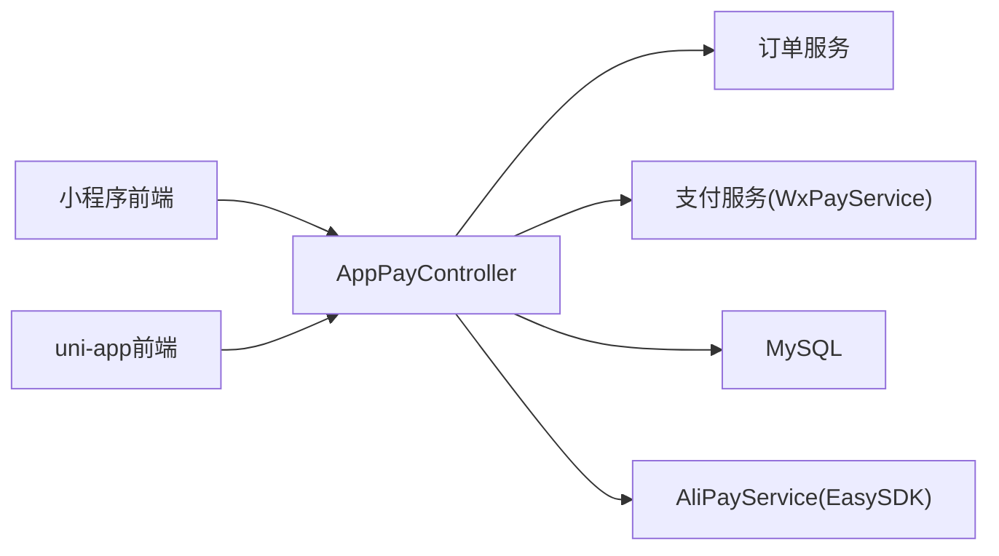

# 支付宝服务集成

<cite>
**本文档引用的文件**
- [AliPayService.java](file://platform-biz/src/main/java/com/platform/config/AliPayService.java)
- [application.yml](file://platform-admin/src/main/resources/application.yml)
- [AppPayController.java](file://platform-api/src/main/java/com/platform/modules/app/controller/AppPayController.java)
- [pay.js](file://wx-mall/services/pay.js)
- [pay.js](file://wx-mall/pages/pay/pay.js)
- [orderDetail.js](file://wx-mall/pages/ucenter/orderDetail/orderDetail.js)
- [orderDetail.vue](file://uni-mall/pages/ucenter/orderDetail/orderDetail.vue)
- [时序架构图.mmd](file://docs/时序架构图.mmd)
</cite>

## 目录
1. [简介](#简介)
2. [项目结构](#项目结构)
3. [核心组件](#核心组件)
4. [架构总览](#架构总览)
5. [详细组件分析](#详细组件分析)
6. [依赖关系分析](#依赖关系分析)
7. [性能考虑](#性能考虑)
8. [故障排除指南](#故障排除指南)
9. [结论](#结论)

## 简介
本文件面向支付宝服务集成，围绕 AliPayService 服务类展开，详细说明支付宝 SDK 初始化配置、支付场景实现（APP 支付、网页支付、手机网站支付、小程序支付）、订单创建与查询、退款处理、回调通知、以及安全验证与最佳实践。同时结合现有代码库中的微信支付实现进行对比参考，帮助读者快速理解与落地支付宝支付能力。

## 项目结构
支付宝相关能力主要分布在以下模块：
- 配置层：平台 Biz 层提供 AliPayService，封装支付宝 EasySDK 的初始化与各接口调用
- 控制层：平台 API 层提供 AppPayController（当前为微信支付实现），可作为支付宝接口对接的参考模板
- 前端层：小程序与 uni-app 提供支付调用与订单状态处理示例
- 配置文件：application.yml 中包含支付宝与微信支付的配置项

**图表来源**
- [AliPayService.java:1-146](file://platform-biz/src/main/java/com/platform/config/AliPayService.java#L1-L146)
- [AppPayController.java:1-261](file://platform-api/src/main/java/com/platform/modules/app/controller/AppPayController.java#L1-L261)
- [pay.js:1-43](file://wx-mall/services/pay.js#L1-L43)
- [pay.js:1-61](file://wx-mall/pages/pay/pay.js#L1-L61)
- [orderDetail.js:48-106](file://wx-mall/pages/ucenter/orderDetail/orderDetail.js#L48-L106)
- [orderDetail.vue:72-192](file://uni-mall/pages/ucenter/orderDetail/orderDetail.vue#L72-L192)
- [application.yml:143-167](file://platform-admin/src/main/resources/application.yml#L143-L167)

**章节来源**
- [AliPayService.java:1-146](file://platform-biz/src/main/java/com/platform/config/AliPayService.java#L1-L146)
- [application.yml:143-167](file://platform-admin/src/main/resources/application.yml#L143-L167)

## 核心组件
- AliPayService：基于支付宝 EasySDK 的服务封装，提供 APP/网页/手机网站/小程序支付下单、订单查询、撤销、关闭、退款、退款查询等能力
- AppPayController：当前为微信支付实现，可作为支付宝接口对接的参考模板（包括预支付参数生成、回调通知、退款处理等流程）
- 前端支付调用：小程序与 uni-app 提供支付参数获取与调起支付的示例

**章节来源**
- [AliPayService.java:1-146](file://platform-biz/src/main/java/com/platform/config/AliPayService.java#L1-L146)
- [AppPayController.java:1-261](file://platform-api/src/main/java/com/platform/modules/app/controller/AppPayController.java#L1-L261)

## 架构总览
支付宝支付在系统中的交互时序如下：

**图表来源**
- [时序架构图.mmd:1-47](file://docs/时序架构图.mmd#L1-L47)
- [AliPayService.java:65-106](file://platform-biz/src/main/java/com/platform/config/AliPayService.java#L65-L106)
- [AppPayController.java:64-119](file://platform-api/src/main/java/com/platform/modules/app/controller/AppPayController.java#L64-L119)

## 详细组件分析

### AliPayService 服务类
- 初始化配置
  - 通过 @PostConstruct 在启动时加载支付宝 SDK 配置，包括协议、网关、签名算法、应用 ID、商户私钥、支付宝公钥、AES 密钥、异步通知地址等
  - 异步通知地址由 baseNotifyUrl + "/app/pay/aliNotify" 组成，确保与后端回调接口一致
- 支付场景接口
  - APP 支付：对应 alipay.trade.app.pay，返回 APP 端可用的支付字符串
  - 网页支付：对应 alipay.trade.page.pay，返回 PC 端支付链接或表单
  - 手机网站支付：对应 alipay.trade.wap.pay，返回移动端支付链接或表单
  - 小程序支付：对应 alipay.trade.create，返回小程序端支付所需的交易号与买家号
- 订单管理接口
  - 订单查询：alipay.trade.query
  - 订单撤销：alipay.trade.cancel
  - 订单关闭：alipay.trade.close
- 退款接口
  - 交易退款：alipay.trade.refund（支持部分退款，out_request_no 必填）
  - 退款查询：alipay.trade.fastpay.refund.query

**图表来源**
- [AliPayService.java:1-146](file://platform-biz/src/main/java/com/platform/config/AliPayService.java#L1-L146)

**章节来源**
- [AliPayService.java:19-59](file://platform-biz/src/main/java/com/platform/config/AliPayService.java#L19-L59)
- [AliPayService.java:65-106](file://platform-biz/src/main/java/com/platform/config/AliPayService.java#L65-L106)
- [AliPayService.java:111-144](file://platform-biz/src/main/java/com/platform/config/AliPayService.java#L111-L144)

### 支付接口实现（参考微信支付模板）
虽然当前 AppPayController 使用的是微信支付实现，但其接口设计与流程可直接迁移到支付宝：
- 预支付参数生成
  - 校验订单状态与用户权限
  - 组装统一下单请求参数（商品描述、商户订单号、金额、回调地址、交易类型等）
  - 调用支付服务生成预支付参数并更新订单状态
- 支付回调通知
  - 解析回调 XML，校验签名与业务状态
  - 更新订单支付状态与时间
- 订单查询
  - 调用支付服务查询订单状态并更新本地状态
- 退款处理
  - 根据订单状态判断是否允许退款
  - 调用支付服务发起退款并更新订单状态

**图表来源**
- [AppPayController.java:64-119](file://platform-api/src/main/java/com/platform/modules/app/controller/AppPayController.java#L64-L119)
- [AppPayController.java:163-203](file://platform-api/src/main/java/com/platform/modules/app/controller/AppPayController.java#L163-L203)

**章节来源**
- [AppPayController.java:64-119](file://platform-api/src/main/java/com/platform/modules/app/controller/AppPayController.java#L64-L119)
- [AppPayController.java:163-203](file://platform-api/src/main/java/com/platform/modules/app/controller/AppPayController.java#L163-L203)
- [AppPayController.java:208-248](file://platform-api/src/main/java/com/platform/modules/app/controller/AppPayController.java#L208-L248)

### 支付场景调用方法
- APP 支付
  - 调用 AliPayService.createAppTradeForm，返回 APP 端支付字符串，客户端使用该字符串唤起支付宝 APP
- 网页支付
  - 调用 AliPayService.createWebTradeForm，返回 PC 端支付链接或表单，引导用户在浏览器完成支付
- 手机网站支付
  - 调用 AliPayService.createWapTradeForm，返回移动端支付链接或表单，适配手机浏览器
- 小程序支付
  - 调用 AliPayService.create，返回 trade_no 与 buyer_id，前端使用这两个参数发起支付

**图表来源**
- [AliPayService.java:65-106](file://platform-biz/src/main/java/com/platform/config/AliPayService.java#L65-L106)

**章节来源**
- [AliPayService.java:65-106](file://platform-biz/src/main/java/com/platform/config/AliPayService.java#L65-L106)

### 订单查询、取消与关闭
- 订单查询
  - 调用 AliPayService.queryTrade(tradeNo)，根据返回状态判断支付结果
- 订单撤销
  - 调用 AliPayService.cancelTrade(tradeNo)，适用于尚未完成的订单
- 订单关闭
  - 调用 AliPayService.closeTrade(tradeNo)，适用于已撤销或超时的订单

**图表来源**
- [AliPayService.java:111-127](file://platform-biz/src/main/java/com/platform/config/AliPayService.java#L111-L127)

**章节来源**
- [AliPayService.java:111-127](file://platform-biz/src/main/java/com/platform/config/AliPayService.java#L111-L127)

### 退款处理流程
- 全额退款
  - 调用 AliPayService.refundTrade(tradeNo, refundAmount, outRequestNo)，outRequestNo 唯一标识退款请求
- 部分退款
  - 同样调用 refundTrade，但 refundAmount 为部分金额，outRequestNo 必须唯一
- 退款查询
  - 调用 AliPayService.refundQuery(tradeNo, outRequestNo)，确认退款状态

**图表来源**
- [AliPayService.java:132-144](file://platform-biz/src/main/java/com/platform/config/AliPayService.java#L132-L144)

**章节来源**
- [AliPayService.java:132-144](file://platform-biz/src/main/java/com/platform/config/AliPayService.java#L132-L144)

### 回调通知与安全验证
- 异步通知地址
  - 在 AliPayService.loadConfigStorages 中统一设置 notifyUrl = baseNotifyUrl + "/app/pay/aliNotify"
  - 平台 API 层需提供 /app/pay/aliNotify 接口用于接收支付宝回调
- 安全验证要点
  - 校验签名：使用支付宝公钥验证回调签名
  - 校验参数一致性：比对 out_trade_no、total_amount 等关键字段
  - 功耗与幂等：回调处理需幂等，避免重复更新订单状态
  - 错误处理：解析失败或验签失败需记录日志并返回失败响应

**章节来源**
- [AliPayService.java:56-58](file://platform-biz/src/main/java/com/platform/config/AliPayService.java#L56-L58)
- [application.yml:165-166](file://platform-admin/src/main/resources/application.yml#L165-L166)

### 前端支付调用示例
- 小程序端
  - 通过 services/pay.js 的 payOrder 获取预支付参数并调用微信支付 SDK
  - pages/pay/pay.js 中演示了获取支付参数并调起支付的流程
- uni-app 端
  - uni-mall/pages/ucenter/orderDetail/orderDetail.vue 中提供了支付按钮与支付流程调用

**图表来源**
- [pay.js:11-39](file://wx-mall/services/pay.js#L11-L39)
- [pay.js:33-57](file://wx-mall/pages/pay/pay.js#L33-L57)
- [orderDetail.vue:179-186](file://uni-mall/pages/ucenter/orderDetail/orderDetail.vue#L179-L186)

**章节来源**
- [pay.js:11-39](file://wx-mall/services/pay.js#L11-L39)
- [pay.js:33-57](file://wx-mall/pages/pay/pay.js#L33-L57)
- [orderDetail.vue:179-186](file://uni-mall/pages/ucenter/orderDetail/orderDetail.vue#L179-L186)

## 依赖关系分析
- AliPayService 依赖支付宝 EasySDK，负责支付场景与订单管理接口的封装
- AppPayController 依赖订单服务与支付服务，负责业务流程编排与回调处理
- 前端通过 API 层获取支付参数并调起支付

**图表来源**
- [AppPayController.java:51-58](file://platform-api/src/main/java/com/platform/modules/app/controller/AppPayController.java#L51-L58)
- [AliPayService.java:1-146](file://platform-biz/src/main/java/com/platform/config/AliPayService.java#L1-L146)

**章节来源**
- [AppPayController.java:51-58](file://platform-api/src/main/java/com/platform/modules/app/controller/AppPayController.java#L51-L58)
- [AliPayService.java:1-146](file://platform-biz/src/main/java/com/platform/config/AliPayService.java#L1-L146)

## 性能考虑
- 异步回调处理：回调接口应快速响应，避免阻塞 IO，将业务处理放入队列或异步任务
- 幂等性：回调与轮询查询需保证同一笔订单多次处理不会重复更新状态
- 超时控制：合理设置 timeout_express，避免长时间占用资源
- 日志与监控：对回调、退款、查询等关键路径增加链路追踪与告警

## 故障排除指南
- 支付回调未到账
  - 检查 notifyUrl 配置是否正确
  - 核对支付宝公钥与签名验签流程
- 退款失败
  - 确认 out_request_no 唯一性与金额正确
  - 检查订单状态是否允许退款
- 订单状态不一致
  - 通过 queryTrade 对账，必要时手动触发 closeTrade 或 cancelTrade
- 前端无法调起支付
  - 确认预支付参数正确，回调地址与签名配置无误

**章节来源**
- [AliPayService.java:111-144](file://platform-biz/src/main/java/com/platform/config/AliPayService.java#L111-L144)
- [AppPayController.java:163-203](file://platform-api/src/main/java/com/platform/modules/app/controller/AppPayController.java#L163-L203)

## 结论
通过 AliPayService 对支付宝 EasySDK 的封装，系统实现了 APP、网页、手机网站与小程序多场景支付能力，并配套订单查询、撤销、关闭与退款处理。结合现有微信支付实现模板，可快速迁移至支付宝支付流程。建议在生产环境中严格遵循安全验证与幂等处理，完善监控与告警，确保支付流程稳定可靠。