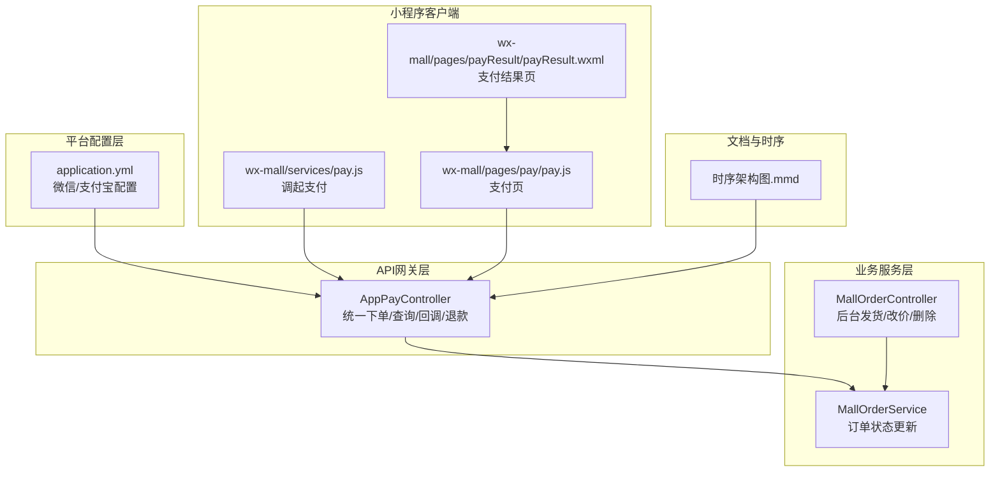
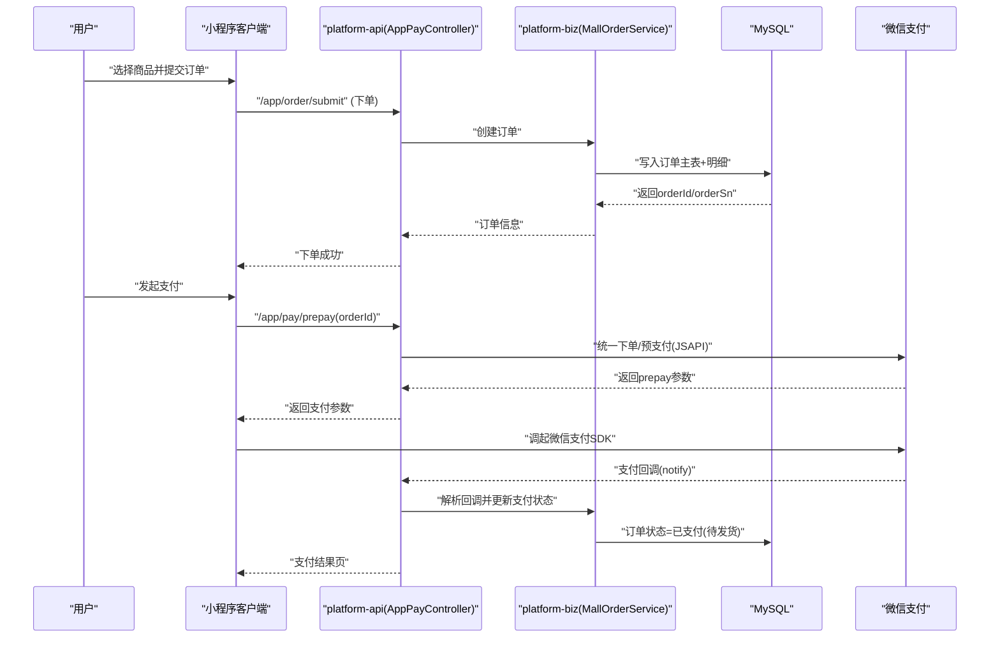
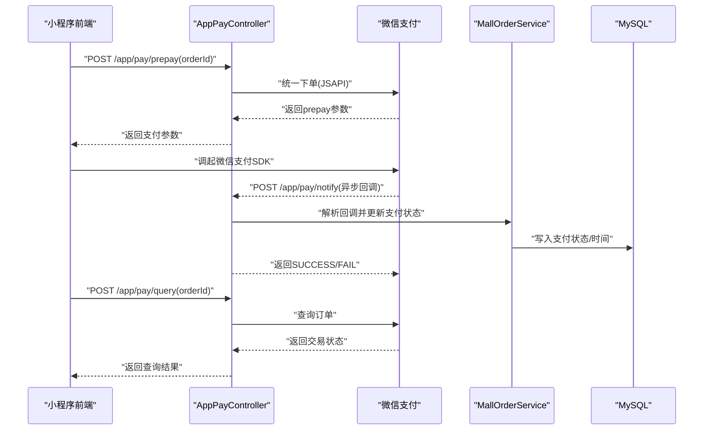
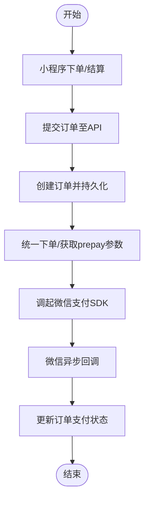
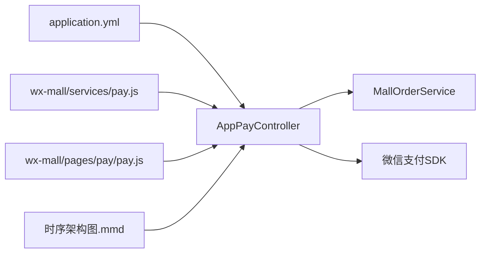

# 支付服务集成

<cite>
**本文引用的文件**
- [application.yml](file://platform-admin/src/main/resources/application.yml)
- [AppPayController.java](file://platform-api/src/main/java/com/platform/modules/app/controller/AppPayController.java)
- [MallOrderService.java](file://platform-biz/src/main/java/com/platform/modules/mall/service/MallOrderService.java)
- [MallOrderController.java](file://platform-admin/src/main/java/com/platform/modules/mall/controller/MallOrderController.java)
- [pay.js](file://wx-mall/services/pay.js)
- [pay.js](file://wx-mall/pages/pay/pay.js)
- [payResult.wxml](file://wx-mall/pages/payResult/payResult.wxml)
- [时序架构图.mmd](file://docs/时序架构图.mmd)
- [Agents.md](file://Agents.md)
</cite>

## 目录
1. [简介](#简介)
2. [项目结构](#项目结构)
3. [核心组件](#核心组件)
4. [架构总览](#架构总览)
5. [组件详解](#组件详解)
6. [依赖关系分析](#依赖关系分析)
7. [性能与稳定性](#性能与稳定性)
8. [故障排查指南](#故障排查指南)
9. [结论](#结论)
10. [附录](#附录)

## 简介
本文件面向支付服务集成场景，聚焦微信支付与支付宝支付的对接要点与最佳实践。结合现有代码库中的微信支付实现与配置，系统性阐述从下单到支付完成的端到端流程、签名与回调处理机制、状态管理与异常处理策略，并给出安全加固建议与性能优化方向。由于当前仓库未包含支付宝支付的Java实现代码，本文将以微信支付为主线，提供可落地的集成步骤与参考路径。

## 项目结构
围绕支付的关键模块分布如下：
- 平台配置层：平台管理端的配置文件集中了微信与支付宝的接入参数（如appId、公私钥、网关、回调地址等）。
- API网关层：对外暴露支付相关接口，负责统一下单、查询、回调、退款等入口。
- 业务服务层：封装订单状态流转与支付状态更新。
- 小程序客户端：发起支付参数请求、调用微信支付SDK、处理支付结果页。
- 文档与时序图：提供整体流程的可视化说明。

图表来源
- [application.yml:143-204](file://platform-admin/src/main/resources/application.yml#L143-L204)
- [AppPayController.java:48-261](file://platform-api/src/main/java/com/platform/modules/app/controller/AppPayController.java#L48-L261)
- [MallOrderService.java:40-101](file://platform-biz/src/main/java/com/platform/modules/mall/service/MallOrderService.java#L40-L101)
- [MallOrderController.java:55-261](file://platform-admin/src/main/java/com/platform/modules/mall/controller/MallOrderController.java#L55-L261)
- [pay.js:1-43](file://wx-mall/services/pay.js#L1-L43)
- [pay.js:1-61](file://wx-mall/pages/pay/pay.js#L1-L61)
- [payResult.wxml:1-23](file://wx-mall/pages/payResult/payResult.wxml#L1-L23)
- [时序架构图.mmd:1-47](file://docs/时序架构图.mmd#L1-L47)

章节来源
- [application.yml:143-204](file://platform-admin/src/main/resources/application.yml#L143-L204)
- [AppPayController.java:48-261](file://platform-api/src/main/java/com/platform/modules/app/controller/AppPayController.java#L48-L261)
- [MallOrderService.java:40-101](file://platform-biz/src/main/java/com/platform/modules/mall/service/MallOrderService.java#L40-L101)
- [MallOrderController.java:55-261](file://platform-admin/src/main/java/com/platform/modules/mall/controller/MallOrderController.java#L55-L261)
- [pay.js:1-43](file://wx-mall/services/pay.js#L1-L43)
- [pay.js:1-61](file://wx-mall/pages/pay/pay.js#L1-L61)
- [payResult.wxml:1-23](file://wx-mall/pages/payResult/payResult.wxml#L1-L23)
- [时序架构图.mmd:1-47](file://docs/时序架构图.mmd#L1-L47)

## 核心组件
- 支付配置中心：集中存放微信/支付宝的AppId、公私钥、网关、回调地址等敏感配置，确保统一管理与最小化变更面。
- 支付控制器：提供统一下单、查询、回调、退款等接口，负责与第三方支付平台交互。
- 订单服务：维护订单状态机，确保支付成功后的状态更新与幂等处理。
- 小程序支付服务：封装支付参数获取与微信支付SDK调起，处理成功/失败跳转。
- 后台管理：提供发货、改价、删除等操作，保障订单生命周期闭环。

章节来源
- [application.yml:143-204](file://platform-admin/src/main/resources/application.yml#L143-L204)
- [AppPayController.java:48-261](file://platform-api/src/main/java/com/platform/modules/app/controller/AppPayController.java#L48-L261)
- [MallOrderService.java:40-101](file://platform-biz/src/main/java/com/platform/modules/mall/service/MallOrderService.java#L40-L101)
- [MallOrderController.java:55-261](file://platform-admin/src/main/java/com/platform/modules/mall/controller/MallOrderController.java#L55-L261)
- [pay.js:1-43](file://wx-mall/services/pay.js#L1-L43)

## 架构总览
下图展示了从用户下单到支付完成的整体时序，涵盖小程序前端、API网关、业务服务、数据库与微信支付通道之间的交互。

图表来源
- [时序架构图.mmd:1-47](file://docs/时序架构图.mmd#L1-L47)
- [AppPayController.java:64-203](file://platform-api/src/main/java/com/platform/modules/app/controller/AppPayController.java#L64-L203)
- [MallOrderService.java:98-101](file://platform-biz/src/main/java/com/platform/modules/mall/service/MallOrderService.java#L98-L101)

章节来源
- [时序架构图.mmd:1-47](file://docs/时序架构图.mmd#L1-L47)
- [AppPayController.java:64-203](file://platform-api/src/main/java/com/platform/modules/app/controller/AppPayController.java#L64-L203)

## 组件详解

### 微信支付集成（基于现有代码）
- 配置项与参数
  - 在配置文件中定义微信支付的AppId、商户号、商户密钥、证书路径与回调地址等关键参数，确保与微信支付平台一致。
  - 统一下单请求体包含商品描述、商户订单号、金额、终端IP、回调地址、交易类型与用户标识等。
- 统一下单与支付参数
  - 控制器根据订单信息构造统一下单请求，调用支付服务创建预支付单，返回给小程序前端用于调起支付SDK。
  - 小程序侧通过服务封装或页面脚本发起支付，传入时间戳、随机串、package、签名类型与paySign等参数。
- 回调处理与状态更新
  - 支付回调接口接收微信异步通知，解析通知结果，校验签名与订单号，更新订单支付状态与时间。
  - 成功回调后，订单进入“已支付(待发货)”状态；失败则记录日志并返回成功告知微信避免重推。
- 查询与退款
  - 提供订单查询接口，轮询或主动查询支付状态，依据交易状态更新本地订单。
  - 退款接口支持按订单号发起退款，设置退款金额与原因，根据返回结果更新订单状态（如已发货场景标记退货退款）。

图表来源
- [AppPayController.java:64-203](file://platform-api/src/main/java/com/platform/modules/app/controller/AppPayController.java#L64-L203)
- [MallOrderService.java:98-101](file://platform-biz/src/main/java/com/platform/modules/mall/service/MallOrderService.java#L98-L101)

章节来源
- [application.yml:190-204](file://platform-admin/src/main/resources/application.yml#L190-L204)
- [AppPayController.java:64-203](file://platform-api/src/main/java/com/platform/modules/app/controller/AppPayController.java#L64-L203)
- [pay.js:11-39](file://wx-mall/services/pay.js#L11-L39)
- [pay.js:33-57](file://wx-mall/pages/pay/pay.js#L33-L57)

### 支付参数与签名要点
- 参数完整性：确保body、outTradeNo、totalFee、spbillCreateIp、notifyUrl、tradeType、openid等字段齐全。
- 金额转换：统一以分为单位进行计算，避免精度丢失。
- 签名与验签：遵循微信支付签名规范，回调时严格校验签名与订单号一致性。
- 回调幂等：对同一笔订单号的回调应做去重处理，防止重复更新状态。

章节来源
- [AppPayController.java:80-107](file://platform-api/src/main/java/com/platform/modules/app/controller/AppPayController.java#L80-L107)
- [AppPayController.java:166-203](file://platform-api/src/main/java/com/platform/modules/app/controller/AppPayController.java#L166-L203)

### 支付流程图（下单到支付完成）

图表来源
- [时序架构图.mmd:22-47](file://docs/时序架构图.mmd#L22-L47)
- [AppPayController.java:64-119](file://platform-api/src/main/java/com/platform/modules/app/controller/AppPayController.java#L64-L119)

章节来源
- [时序架构图.mmd:22-47](file://docs/时序架构图.mmd#L22-L47)

### 支付安全与防重放
- 回调签名验证：严格比对签名与订单号，拒绝伪造请求。
- 幂等控制：基于outTradeNo建立分布式锁或唯一索引，避免重复处理。
- 参数校验：对回调参数进行白名单校验，拒绝异常字段。
- 传输安全：回调地址使用HTTPS，证书与密钥妥善保管。
- 日志审计：记录回调原始XML与解析结果，便于追踪与复盘。

章节来源
- [AppPayController.java:166-203](file://platform-api/src/main/java/com/platform/modules/app/controller/AppPayController.java#L166-L203)
- [Agents.md:139-182](file://Agents.md#L139-L182)

### 支付状态管理与异常处理
- 状态机设计：未支付、支付中、已支付、已发货、已取消、已退款、退货中等状态清晰划分。
- 异常分支：统一下单失败、查询异常、回调异常均需捕获并返回友好提示。
- 后台治理：提供发货、改价、删除等操作，确保订单生命周期可控。

章节来源
- [MallOrderController.java:156-198](file://platform-admin/src/main/java/com/platform/modules/mall/controller/MallOrderController.java#L156-L198)
- [MallOrderController.java:206-245](file://platform-admin/src/main/java/com/platform/modules/mall/controller/MallOrderController.java#L206-L245)

### 支付成功率优化
- 重试策略：对网络抖动或第三方超时进行指数退避重试。
- 超时控制：统一下单与回调处理设置合理超时阈值。
- 缓存与降级：对热点订单查询进行缓存，极端情况下降级为只读查询。
- 监控告警：埋点统计成功率、耗时与错误码，及时发现异常。

## 依赖关系分析
- 配置依赖：API层通过配置文件读取微信/支付宝参数，确保与生产环境一致。
- 控制器依赖：AppPayController依赖订单服务与支付SDK，负责编排支付流程。
- 客户端依赖：小程序通过服务封装与页面脚本调用API，形成闭环。
- 文档依赖：时序图指导开发与联调，确保各环节职责清晰。

图表来源
- [application.yml:143-204](file://platform-admin/src/main/resources/application.yml#L143-L204)
- [AppPayController.java:50-58](file://platform-api/src/main/java/com/platform/modules/app/controller/AppPayController.java#L50-L58)
- [pay.js:1-43](file://wx-mall/services/pay.js#L1-L43)
- [pay.js:1-61](file://wx-mall/pages/pay/pay.js#L1-L61)
- [时序架构图.mmd:1-47](file://docs/时序架构图.mmd#L1-L47)

章节来源
- [application.yml:143-204](file://platform-admin/src/main/resources/application.yml#L143-L204)
- [AppPayController.java:50-58](file://platform-api/src/main/java/com/platform/modules/app/controller/AppPayController.java#L50-L58)
- [pay.js:1-43](file://wx-mall/services/pay.js#L1-L43)
- [pay.js:1-61](file://wx-mall/pages/pay/pay.js#L1-L61)
- [时序架构图.mmd:1-47](file://docs/时序架构图.mmd#L1-L47)

## 性能与稳定性
- 并发与锁：高并发场景下对同一订单的回调处理需加分布式锁，避免竞态。
- 异步解耦：回调处理采用异步队列，快速回包，保证微信侧回调可用性。
- 缓存策略：对查询频繁的状态与订单信息进行缓存，降低数据库压力。
- 限流与熔断：对支付接口设置限流与熔断策略，保护下游系统。

## 故障排查指南
- 回调不达：检查回调地址与签名配置，确认证书与密钥正确。
- 重复回调：排查幂等逻辑与数据库唯一索引，避免重复更新。
- 金额不一致：核对金额转换逻辑与数据库存储精度。
- 订单状态异常：通过后台管理接口核对发货/改价/删除操作的影响。
- 外部副作用：涉及退款等真实外部操作时，遵循最小化修改原则，先验证再上线。

章节来源
- [AppPayController.java:166-203](file://platform-api/src/main/java/com/platform/modules/app/controller/AppPayController.java#L166-L203)
- [MallOrderController.java:156-198](file://platform-admin/src/main/java/com/platform/modules/mall/controller/MallOrderController.java#L156-L198)
- [Agents.md:139-182](file://Agents.md#L139-L182)

## 结论
本项目已具备完整的微信支付集成基础：从配置、统一下单、回调处理到状态更新与查询退款均有清晰实现。建议在此基础上补充支付宝支付的Java实现与单元测试，完善风控与监控体系，并持续优化性能与稳定性，以支撑更高并发与更复杂业务场景。

## 附录
- 关键接口路径
  - 统一下单：POST /app/pay/prepay
  - 订单查询：POST /app/pay/query
  - 支付回调：POST /app/pay/notify
  - 订单退款：POST /app/pay/refund
- 小程序调用路径
  - 服务封装：wx-mall/services/pay.js
  - 支付页面：wx-mall/pages/pay/pay.js
  - 支付结果页：wx-mall/pages/payResult/payResult.wxml

章节来源
- [AppPayController.java:64-248](file://platform-api/src/main/java/com/platform/modules/app/controller/AppPayController.java#L64-L248)
- [pay.js:11-39](file://wx-mall/services/pay.js#L11-L39)
- [pay.js:33-57](file://wx-mall/pages/pay/pay.js#L33-L57)
- [payResult.wxml:1-23](file://wx-mall/pages/payResult/payResult.wxml#L1-L23)