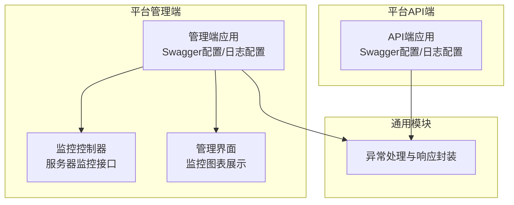
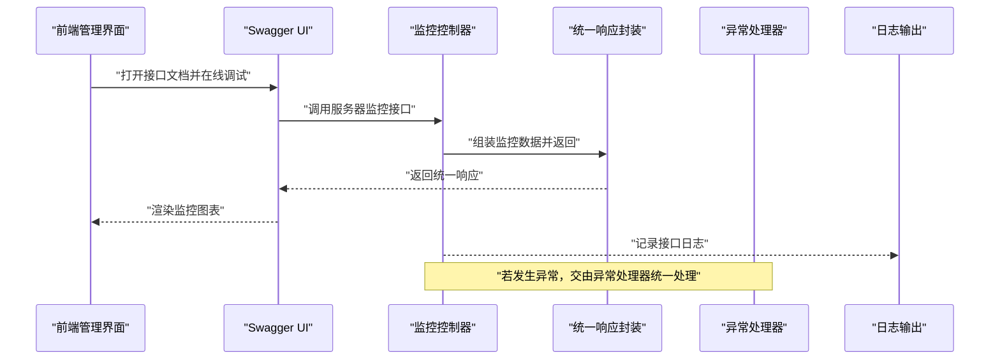
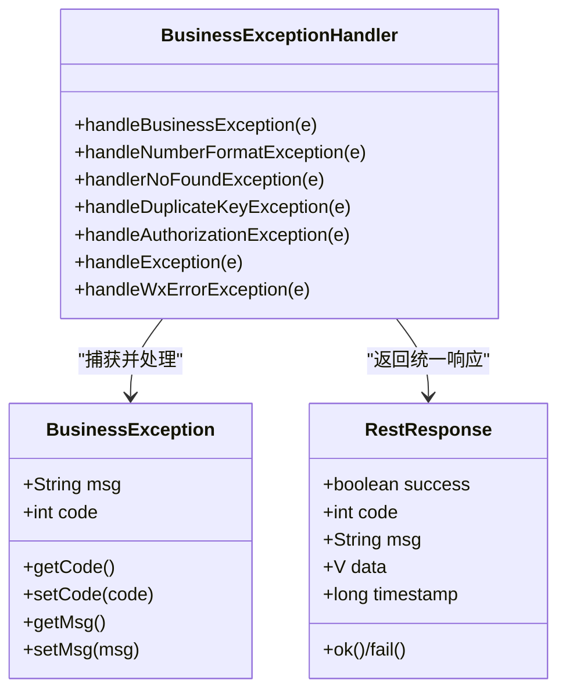
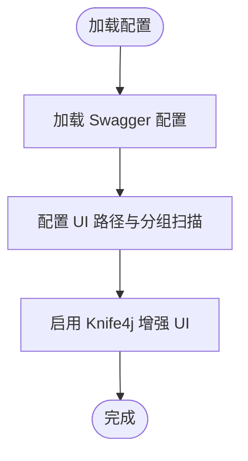
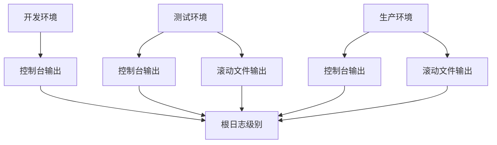
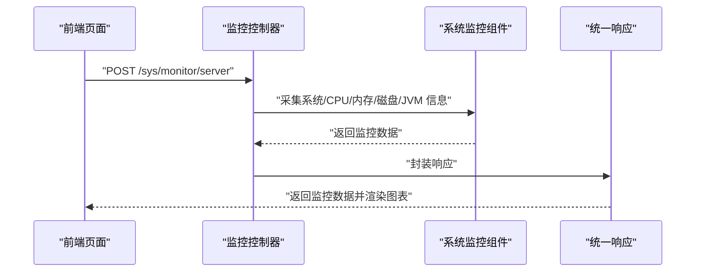
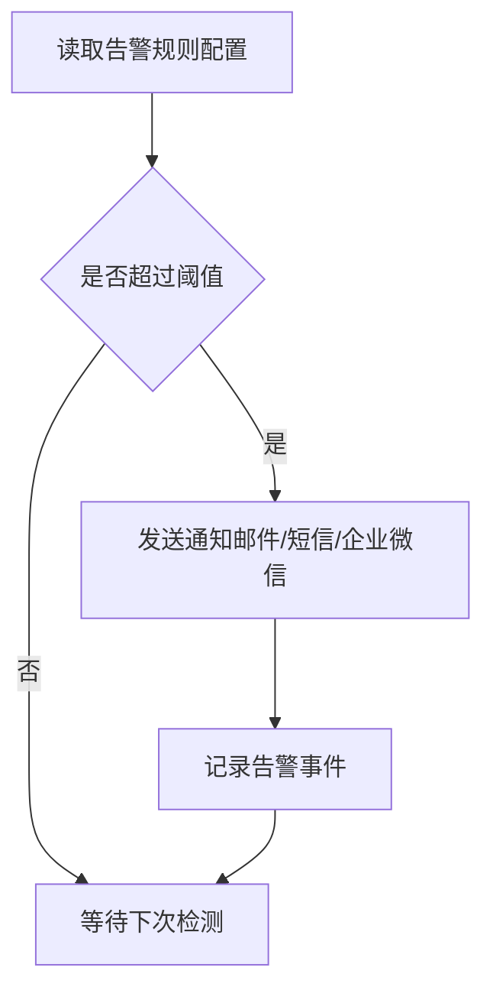
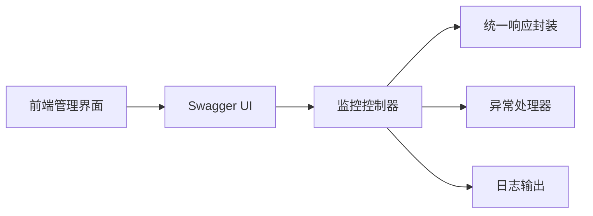

# 监控告警服务

<cite>
**本文引用的文件**
- [logback-spring.xml（管理端）](file://platform-admin/src/main/resources/logback-spring.xml)
- [logback-spring.xml（API端）](file://platform-api/src/main/resources/logback-spring.xml)
- [BusinessExceptionHandler.java](file://platform-common/src/main/java/com/platform/common/exception/BusinessExceptionHandler.java)
- [BusinessException.java](file://platform-common/src/main/java/com/platform/common/exception/BusinessException.java)
- [SwaggerConfig.java（管理端）](file://platform-admin/src/main/java/com/platform/config/SwaggerConfig.java)
- [SwaggerConfig.java（API端）](file://platform-api/src/main/java/com/platform/config/SwaggerConfig.java)
- [application.yml（管理端）](file://platform-admin/src/main/resources/application.yml)
- [application.yml（API端）](file://platform-api/src/main/resources/application.yml)
- [RestResponse.java](file://platform-common/src/main/java/com/platform/common/utils/RestResponse.java)
- [SysMonitorController.java](file://platform-admin/src/main/java/com/platform/modules/sys/controller/SysMonitorController.java)
- [home.vue](file://platform-admin-ui/src/views/common/home.vue)
- [SysConfigController.java](file://platform-admin/src/main/java/com/platform/modules/sys/controller/SysConfigController.java)
</cite>

## 目录
1. [简介](#简介)
2. [项目结构](#项目结构)
3. [核心组件](#核心组件)
4. [架构总览](#架构总览)
5. [组件详解](#组件详解)
6. [依赖关系分析](#依赖关系分析)
7. [性能与监控指标](#性能与监控指标)
8. [故障排查指南](#故障排查指南)
9. [结论](#结论)
10. [附录](#附录)

## 简介
本指南面向监控告警服务的集成与运维实践，围绕系统监控与告警机制、Swagger API 文档集成、异常处理、日志监控、性能指标采集与展示、告警规则与通知渠道、以及监控可视化与历史趋势分析展开。文档基于仓库现有实现进行梳理与说明，帮助读者快速理解并扩展监控体系。

## 项目结构
项目由多模块构成，监控与告警相关能力主要分布在以下模块：
- 平台管理端（platform-admin）：提供管理后台、系统监控接口、Swagger 文档、日志配置等
- 平台 API 端（platform-api）：提供移动端接口、Swagger 文档、日志配置等
- 通用模块（platform-common）：统一异常处理、响应封装、工具类等
- 前端管理界面（platform-admin-ui）：监控图表与可视化展示

**图表来源**
- [SwaggerConfig.java（管理端）:60-94](file://platform-admin/src/main/java/com/platform/config/SwaggerConfig.java#L60-L94)
- [SysMonitorController.java:45-83](file://platform-admin/src/main/java/com/platform/modules/sys/controller/SysMonitorController.java#L45-L83)
- [home.vue:1-1188](file://platform-admin-ui/src/views/common/home.vue#L1-L1188)
- [SwaggerConfig.java（API端）:58-94](file://platform-api/src/main/java/com/platform/config/SwaggerConfig.java#L58-L94)

**章节来源**
- [SwaggerConfig.java（管理端）:60-94](file://platform-admin/src/main/java/com/platform/config/SwaggerConfig.java#L60-L94)
- [SwaggerConfig.java（API端）:58-94](file://platform-api/src/main/java/com/platform/config/SwaggerConfig.java#L58-L94)
- [logback-spring.xml（管理端）:1-94](file://platform-admin/src/main/resources/logback-spring.xml#L1-L94)
- [logback-spring.xml（API端）:1-94](file://platform-api/src/main/resources/logback-spring.xml#L1-L94)

## 核心组件
- 统一异常处理与响应封装
  - 异常处理器集中捕获业务异常、参数异常、鉴权异常、重复键异常、微信错误等，统一返回 RestResponse 格式
  - 业务异常可携带自定义状态码与消息
- Swagger API 文档集成
  - 管理端与 API 端分别提供 OpenAPI 3.0 文档与 Knife4j 增强 UI
  - 支持按分组扫描包路径，便于接口分类与调试
- 日志监控与级别管理
  - 使用 Logback 配置不同环境的控制台与滚动文件输出，支持开发/测试/生产三套策略
- 性能与资源监控
  - 提供服务器监控接口，采集 CPU、内存、磁盘、JVM 等指标，并在前端以图表展示
- 告警规则与通知
  - 通过系统配置表维护告警阈值与通知开关，结合邮件等通知渠道实现告警下发

**章节来源**
- [BusinessExceptionHandler.java:36-99](file://platform-common/src/main/java/com/platform/common/exception/BusinessExceptionHandler.java#L36-L99)
- [BusinessException.java:28-73](file://platform-common/src/main/java/com/platform/common/exception/BusinessException.java#L28-L73)
- [RestResponse.java:34-121](file://platform-common/src/main/java/com/platform/common/utils/RestResponse.java#L34-L121)
- [SwaggerConfig.java（管理端）:60-94](file://platform-admin/src/main/java/com/platform/config/SwaggerConfig.java#L60-L94)
- [SwaggerConfig.java（API端）:58-94](file://platform-api/src/main/java/com/platform/config/SwaggerConfig.java#L58-L94)
- [logback-spring.xml（管理端）:14-89](file://platform-admin/src/main/resources/logback-spring.xml#L14-L89)
- [logback-spring.xml（API端）:14-89](file://platform-api/src/main/resources/logback-spring.xml#L14-L89)
- [SysMonitorController.java:45-83](file://platform-admin/src/main/java/com/platform/modules/sys/controller/SysMonitorController.java#L45-L83)
- [home.vue:1-1188](file://platform-admin-ui/src/views/common/home.vue#L1-L1188)
- [application.yml（管理端）:22-67](file://platform-admin/src/main/resources/application.yml#L22-L67)
- [application.yml（API端）:22-56](file://platform-api/src/main/resources/application.yml#L22-L56)

## 架构总览
下图展示了监控与告警的关键交互：前端通过 Swagger 在线调试接口，后端控制器返回统一响应，异常统一由异常处理器处理，日志由 Logback 输出到控制台与文件，监控数据通过服务器监控接口采集并在前端可视化展示。

**图表来源**
- [home.vue:1100-1188](file://platform-admin-ui/src/views/common/home.vue#L1100-L1188)
- [SysMonitorController.java:55-83](file://platform-admin/src/main/java/com/platform/modules/sys/controller/SysMonitorController.java#L55-L83)
- [RestResponse.java:79-121](file://platform-common/src/main/java/com/platform/common/utils/RestResponse.java#L79-L121)
- [BusinessExceptionHandler.java:36-99](file://platform-common/src/main/java/com/platform/common/exception/BusinessExceptionHandler.java#L36-L99)

## 组件详解

### 统一异常处理与响应封装
- 异常处理
  - 捕获业务异常、参数异常、路径不存在、重复键、鉴权异常、微信错误等，统一返回失败响应
  - 记录异常日志，便于定位问题
- 响应封装
  - RestResponse 提供成功/失败的多种构造方法，统一返回结构包含 success、code、msg、data、timestamp
- 业务异常
  - BusinessException 支持自定义消息与状态码，便于上层区分错误类型

**图表来源**
- [BusinessExceptionHandler.java:36-99](file://platform-common/src/main/java/com/platform/common/exception/BusinessExceptionHandler.java#L36-L99)
- [BusinessException.java:28-73](file://platform-common/src/main/java/com/platform/common/exception/BusinessException.java#L28-L73)
- [RestResponse.java:34-121](file://platform-common/src/main/java/com/platform/common/utils/RestResponse.java#L34-L121)

**章节来源**
- [BusinessExceptionHandler.java:36-99](file://platform-common/src/main/java/com/platform/common/exception/BusinessExceptionHandler.java#L36-L99)
- [BusinessException.java:28-73](file://platform-common/src/main/java/com/platform/common/exception/BusinessException.java#L28-L73)
- [RestResponse.java:34-121](file://platform-common/src/main/java/com/platform/common/utils/RestResponse.java#L34-L121)

### Swagger API 文档集成
- 管理端与 API 端均提供 OpenAPI 3.0 文档与 Knife4j 增强 UI
- 支持按分组扫描包路径，便于接口分类与在线调试
- 管理端提供多分组（全部、系统管理、微信管理），API 端提供移动端接口与微信服务器分组

**图表来源**
- [SwaggerConfig.java（管理端）:60-94](file://platform-admin/src/main/java/com/platform/config/SwaggerConfig.java#L60-L94)
- [SwaggerConfig.java（API端）:58-94](file://platform-api/src/main/java/com/platform/config/SwaggerConfig.java#L58-L94)
- [application.yml（管理端）:22-67](file://platform-admin/src/main/resources/application.yml#L22-L67)
- [application.yml（API端）:22-56](file://platform-api/src/main/resources/application.yml#L22-L56)

**章节来源**
- [SwaggerConfig.java（管理端）:60-94](file://platform-admin/src/main/java/com/platform/config/SwaggerConfig.java#L60-L94)
- [SwaggerConfig.java（API端）:58-94](file://platform-api/src/main/java/com/platform/config/SwaggerConfig.java#L58-L94)
- [application.yml（管理端）:22-67](file://platform-admin/src/main/resources/application.yml#L22-L67)
- [application.yml（API端）:22-56](file://platform-api/src/main/resources/application.yml#L22-L56)

### 日志监控配置（Logback）
- 开发环境：控制台彩色输出，日志级别较低，便于调试
- 测试/生产环境：控制台输出 + 滚动文件输出，按日期滚动，保留一定天数并限制总大小
- 管理端与 API 端分别配置独立的日志文件路径，便于区分

**图表来源**
- [logback-spring.xml（管理端）:14-89](file://platform-admin/src/main/resources/logback-spring.xml#L14-L89)
- [logback-spring.xml（API端）:14-89](file://platform-api/src/main/resources/logback-spring.xml#L14-L89)

**章节来源**
- [logback-spring.xml（管理端）:14-89](file://platform-admin/src/main/resources/logback-spring.xml#L14-L89)
- [logback-spring.xml（API端）:14-89](file://platform-api/src/main/resources/logback-spring.xml#L14-L89)

### 性能与资源监控（服务器监控）
- 控制器提供服务器监控接口，返回系统信息、CPU、内存、磁盘、JVM 等指标
- 前端使用 ECharts 将指标渲染为仪表盘图表，支持响应式调整
- 支持磁盘使用率聚合计算，便于整体资源评估

**图表来源**
- [SysMonitorController.java:55-83](file://platform-admin/src/main/java/com/platform/modules/sys/controller/SysMonitorController.java#L55-L83)
- [home.vue:1100-1188](file://platform-admin-ui/src/views/common/home.vue#L1100-L1188)
- [RestResponse.java:79-121](file://platform-common/src/main/java/com/platform/common/utils/RestResponse.java#L79-L121)

**章节来源**
- [SysMonitorController.java:45-83](file://platform-admin/src/main/java/com/platform/modules/sys/controller/SysMonitorController.java#L45-L83)
- [home.vue:1-1188](file://platform-admin-ui/src/views/common/home.vue#L1-L1188)
- [RestResponse.java:34-121](file://platform-common/src/main/java/com/platform/common/utils/RestResponse.java#L34-L121)

### 告警规则与通知渠道
- 告警规则可通过系统配置表维护，如阈值、开关等
- 通知渠道可结合邮件等外部系统进行告警下发
- 建议在配置表中增加告警规则与通知模板字段，便于统一管理

**图表来源**
- [SysConfigController.java:42-176](file://platform-admin/src/main/java/com/platform/modules/sys/controller/SysConfigController.java#L42-L176)
- [application.yml（管理端）:106-112](file://platform-admin/src/main/resources/application.yml#L106-L112)

**章节来源**
- [SysConfigController.java:42-176](file://platform-admin/src/main/java/com/platform/modules/sys/controller/SysConfigController.java#L42-L176)
- [application.yml（管理端）:106-112](file://platform-admin/src/main/resources/application.yml#L106-L112)

## 依赖关系分析
- 控制器依赖统一响应封装与异常处理，保证接口一致性
- 前端依赖 Swagger 文档进行接口调试，依赖监控控制器返回的数据进行可视化
- 日志配置贯穿各模块，确保运行期可观测性

**图表来源**
- [home.vue:1100-1188](file://platform-admin-ui/src/views/common/home.vue#L1100-L1188)
- [SysMonitorController.java:55-83](file://platform-admin/src/main/java/com/platform/modules/sys/controller/SysMonitorController.java#L55-L83)
- [RestResponse.java:79-121](file://platform-common/src/main/java/com/platform/common/utils/RestResponse.java#L79-L121)
- [BusinessExceptionHandler.java:36-99](file://platform-common/src/main/java/com/platform/common/exception/BusinessExceptionHandler.java#L36-L99)
- [logback-spring.xml（管理端）:14-89](file://platform-admin/src/main/resources/logback-spring.xml#L14-L89)

**章节来源**
- [home.vue:1-1188](file://platform-admin-ui/src/views/common/home.vue#L1-L1188)
- [SysMonitorController.java:45-83](file://platform-admin/src/main/java/com/platform/modules/sys/controller/SysMonitorController.java#L45-L83)
- [RestResponse.java:34-121](file://platform-common/src/main/java/com/platform/common/utils/RestResponse.java#L34-L121)
- [BusinessExceptionHandler.java:36-99](file://platform-common/src/main/java/com/platform/common/exception/BusinessExceptionHandler.java#L36-L99)
- [logback-spring.xml（管理端）:14-89](file://platform-admin/src/main/resources/logback-spring.xml#L14-L89)

## 性能与监控指标
- 接口响应时间
  - 建议在网关或过滤器层统计请求耗时，结合日志与指标系统进行采集
- 错误率
  - 通过异常处理器的失败响应统计错误率，结合日志级别进行归因
- 资源使用情况
  - 利用服务器监控接口采集 CPU、内存、磁盘、JVM 指标，前端以图表展示
- 建议
  - 引入指标埋点与可视化面板（如 Prometheus + Grafana），实现更细粒度的监控与告警

**章节来源**
- [SysMonitorController.java:55-83](file://platform-admin/src/main/java/com/platform/modules/sys/controller/SysMonitorController.java#L55-L83)
- [home.vue:1-1188](file://platform-admin-ui/src/views/common/home.vue#L1-L1188)
- [BusinessExceptionHandler.java:36-99](file://platform-common/src/main/java/com/platform/common/exception/BusinessExceptionHandler.java#L36-L99)

## 故障排查指南
- 接口 404 或路径不存在
  - 异常处理器统一返回“路径不存在，请检查路径是否正确”，建议检查 Swagger UI 路径与分组配置
- 参数异常
  - 数字格式异常会被捕获并返回“请求参数有误”，建议在前端校验与后端校验双管齐下
- 鉴权异常
  - 未授权访问会返回“没有权限，请联系管理员授权”，建议检查权限注解与登录状态
- 数据库重复键异常
  - 重复键异常被捕获并提示“数据库中已存在该记录”，建议在业务层进行幂等控制
- 微信错误
  - 微信错误会被捕获并返回具体错误码与错误信息，便于定位第三方接口问题

**章节来源**
- [BusinessExceptionHandler.java:46-98](file://platform-common/src/main/java/com/platform/common/exception/BusinessExceptionHandler.java#L46-L98)
- [application.yml（管理端）:22-67](file://platform-admin/src/main/resources/application.yml#L22-L67)
- [application.yml（API端）:22-56](file://platform-api/src/main/resources/application.yml#L22-L56)

## 结论
本项目已具备完善的监控与告警基础能力：统一异常处理与响应封装、Swagger 在线文档与调试、Logback 日志配置、服务器资源监控与前端可视化展示。建议在此基础上引入指标埋点与可视化面板，完善告警规则与通知渠道，形成闭环的监控告警体系。

## 附录
- Swagger UI 访问路径
  - 管理端：/swagger-ui.html
  - API 端：/swagger-ui.html
- API 文档路径
  - 管理端：/v3/api-docs
  - API 端：/v3/api-docs
- 日志文件位置
  - 管理端：/home/logs/platform-framework/info.log
  - API 端：/home/logs/platform-framework-api/info.log

**章节来源**
- [application.yml（管理端）:22-67](file://platform-admin/src/main/resources/application.yml#L22-L67)
- [application.yml（API端）:22-56](file://platform-api/src/main/resources/application.yml#L22-L56)
- [logback-spring.xml（管理端）:37-80](file://platform-admin/src/main/resources/logback-spring.xml#L37-L80)
- [logback-spring.xml（API端）:37-80](file://platform-api/src/main/resources/logback-spring.xml#L37-L80)