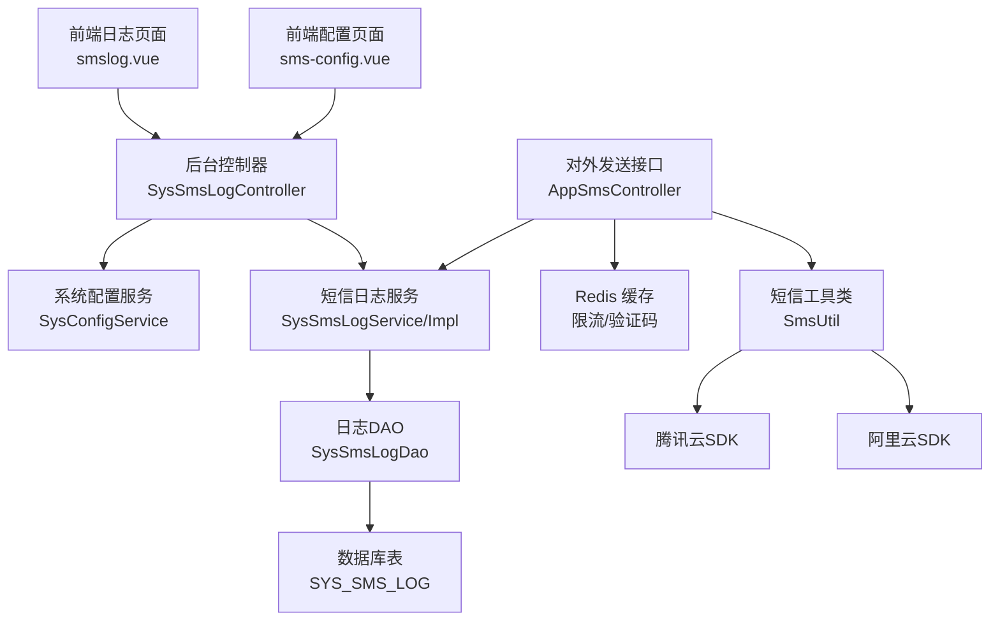
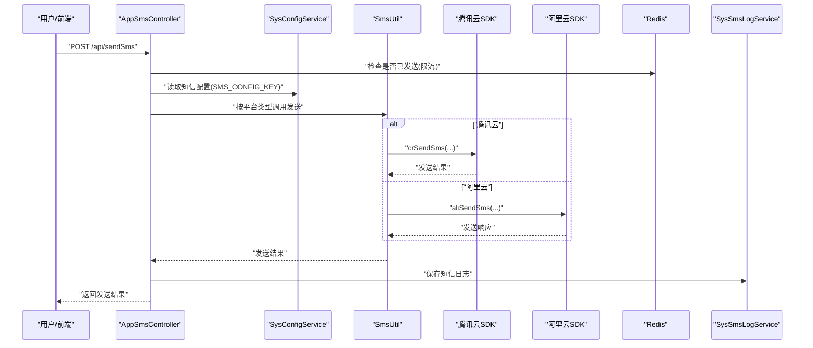
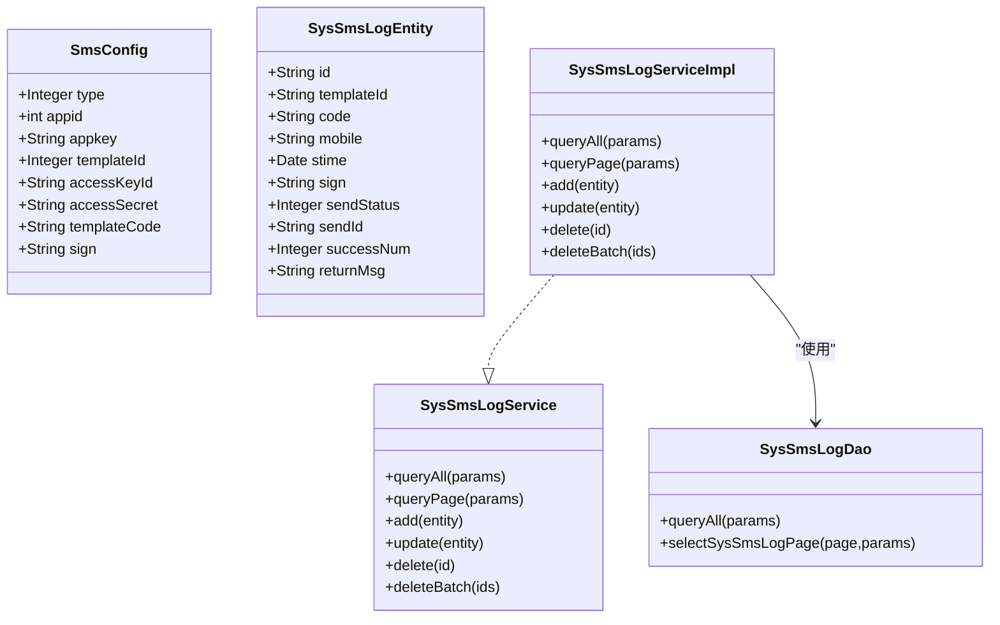
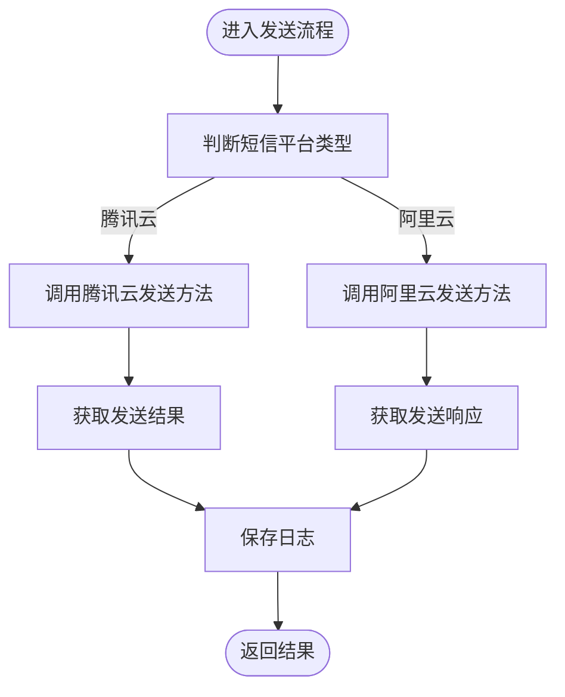
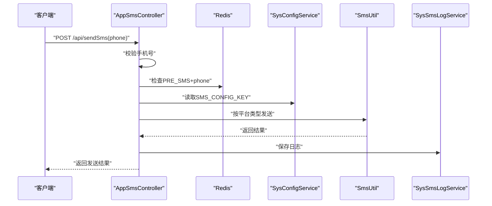
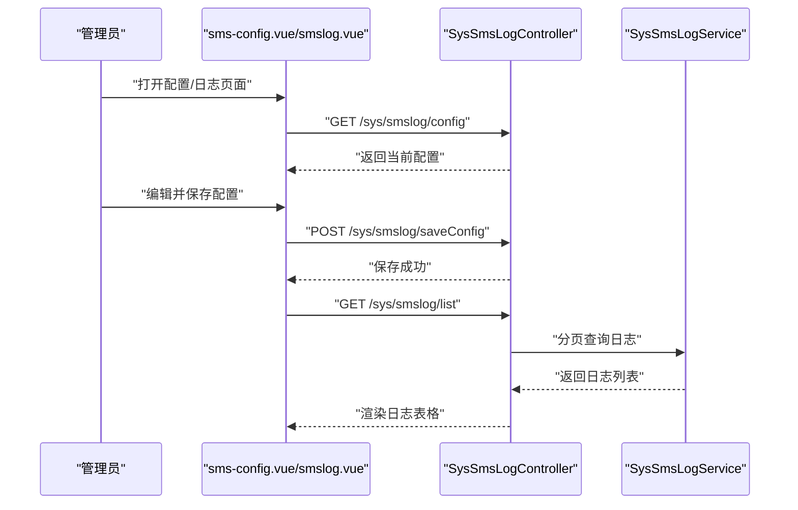
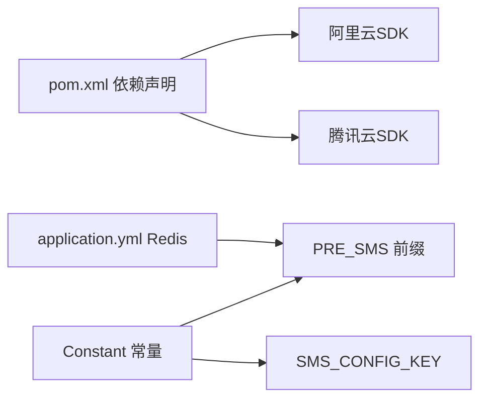

# 短信服务集成

<cite>
**本文引用的文件**
- [SmsConfig.java](file://platform-biz/src/main/java/com/platform/modules/sys/entity/SmsConfig.java)
- [SysSmsLogEntity.java](file://platform-biz/src/main/java/com/platform/modules/sys/entity/SysSmsLogEntity.java)
- [SysSmsLogDao.java](file://platform-biz/src/main/java/com/platform/modules/sys/dao/SysSmsLogDao.java)
- [SysSmsLogService.java](file://platform-biz/src/main/java/com/platform/modules/sys/service/SysSmsLogService.java)
- [SysSmsLogServiceImpl.java](file://platform-biz/src/main/java/com/platform/modules/sys/service/impl/SysSmsLogServiceImpl.java)
- [SmsUtil.java](file://platform-common/src/main/java/com/platform/common/utils/SmsUtil.java)
- [AppSmsController.java](file://platform-api/src/main/java/com/platform/modules/app/controller/AppSmsController.java)
- [SysSmsLogController.java](file://platform-admin/src/main/java/com/platform/modules/sys/controller/SysSmsLogController.java)
- [sms-config.vue](file://platform-admin-ui/src/views/modules/sys/sms-config.vue)
- [smslog.vue](file://platform-admin-ui/src/views/modules/sys/smslog.vue)
- [Constant.java](file://platform-common/src/main/java/com/platform/common/utils/Constant.java)
- [pom.xml](file://pom.xml)
- [application.yml](file://platform-admin/src/main/resources/application.yml)
</cite>

## 目录
1. [简介](#简介)
2. [项目结构](#项目结构)
3. [核心组件](#核心组件)
4. [架构总览](#架构总览)
5. [组件详解](#组件详解)
6. [依赖关系分析](#依赖关系分析)
7. [性能与成本优化](#性能与成本优化)
8. [故障排查指南](#故障排查指南)
9. [结论](#结论)
10. [附录](#附录)

## 简介
本指南面向需要在平台中集成短信服务的开发者与运维人员，系统讲解短信服务的配置与使用流程，涵盖短信配置实体设计、数据库存储、发送工具类实现（含阿里云与腾讯云 SDK）、模板与签名配置、发送限制、异步处理与失败重试策略、状态监控与日志记录、异常处理最佳实践，以及性能优化与成本控制建议。

## 项目结构
短信能力由“前端配置界面 + 后端控制器 + 通用工具 + 业务服务层 + 数据访问层 + 配置常量 + 依赖声明”构成，前后端职责清晰、层次分明：

- 前端：提供短信配置与发送日志管理界面
- 后端 API：对外提供发送短信接口
- 通用工具：封装阿里云与腾讯云短信 SDK 的调用
- 业务层：统一处理短信配置读取、日志落库、分页查询
- 数据层：MyBatis Mapper 负责 SYS_SMS_LOG 表的持久化
- 配置常量：集中管理短信配置 KEY、Redis 前缀、短信平台类型枚举等

图表来源
- [SysSmsLogController.java:154-176](file://platform-admin/src/main/java/com/platform/modules/sys/controller/SysSmsLogController.java#L154-L176)
- [AppSmsController.java:56-160](file://platform-api/src/main/java/com/platform/modules/app/controller/AppSmsController.java#L56-L160)
- [SmsUtil.java:48-175](file://platform-common/src/main/java/com/platform/common/utils/SmsUtil.java#L48-L175)
- [SysSmsLogServiceImpl.java:42-77](file://platform-biz/src/main/java/com/platform/modules/sys/service/impl/SysSmsLogServiceImpl.java#L42-L77)
- [SysSmsLogDao.java:37-55](file://platform-biz/src/main/java/com/platform/modules/sys/dao/SysSmsLogDao.java#L37-L55)

章节来源
- [SysSmsLogController.java:154-176](file://platform-admin/src/main/java/com/platform/modules/sys/controller/SysSmsLogController.java#L154-L176)
- [AppSmsController.java:56-160](file://platform-api/src/main/java/com/platform/modules/app/controller/AppSmsController.java#L56-L160)
- [SmsUtil.java:48-175](file://platform-common/src/main/java/com/platform/common/utils/SmsUtil.java#L48-L175)
- [SysSmsLogServiceImpl.java:42-77](file://platform-biz/src/main/java/com/platform/modules/sys/service/impl/SysSmsLogServiceImpl.java#L42-L77)
- [SysSmsLogDao.java:37-55](file://platform-biz/src/main/java/com/platform/modules/sys/dao/SysSmsLogDao.java#L37-L55)

## 核心组件
- 短信配置实体：封装短信平台类型、密钥、模板与签名等字段
- 日志实体：记录发送模板、手机号、签名、状态、返回消息等
- 工具类：封装阿里云与腾讯云短信发送方法，统一返回结果
- 对外接口：校验手机号、限流、生成验证码、调用工具类发送、落库日志
- 后台管理接口：读取/保存短信配置；分页查询短信日志
- 前端界面：配置页面与日志页面，支持查询、删除、批量删除

章节来源
- [SmsConfig.java:34-74](file://platform-biz/src/main/java/com/platform/modules/sys/entity/SmsConfig.java#L34-L74)
- [SysSmsLogEntity.java:36-80](file://platform-biz/src/main/java/com/platform/modules/sys/entity/SysSmsLogEntity.java#L36-L80)
- [SmsUtil.java:48-175](file://platform-common/src/main/java/com/platform/common/utils/SmsUtil.java#L48-L175)
- [AppSmsController.java:56-160](file://platform-api/src/main/java/com/platform/modules/app/controller/AppSmsController.java#L56-L160)
- [SysSmsLogController.java:154-176](file://platform-admin/src/main/java/com/platform/modules/sys/controller/SysSmsLogController.java#L154-L176)
- [sms-config.vue:1-163](file://platform-admin-ui/src/views/modules/sys/sms-config.vue#L1-L163)
- [smslog.vue:1-227](file://platform-admin-ui/src/views/modules/sys/smslog.vue#L1-L227)

## 架构总览
短信服务整体采用“接口层-服务层-数据访问层-外部SDK”的分层架构，前端通过 REST 接口与后端交互，后端通过工具类调用阿里云或腾讯云 SDK，发送结果写入 SYS_SMS_LOG 并返回客户端。

图表来源
- [AppSmsController.java:56-160](file://platform-api/src/main/java/com/platform/modules/app/controller/AppSmsController.java#L56-L160)
- [SmsUtil.java:68-175](file://platform-common/src/main/java/com/platform/common/utils/SmsUtil.java#L68-L175)
- [SysSmsLogServiceImpl.java:58-60](file://platform-biz/src/main/java/com/platform/modules/sys/service/impl/SysSmsLogServiceImpl.java#L58-L60)

章节来源
- [AppSmsController.java:56-160](file://platform-api/src/main/java/com/platform/modules/app/controller/AppSmsController.java#L56-L160)
- [SmsUtil.java:68-175](file://platform-common/src/main/java/com/platform/common/utils/SmsUtil.java#L68-L175)
- [SysSmsLogServiceImpl.java:58-60](file://platform-biz/src/main/java/com/platform/modules/sys/service/impl/SysSmsLogServiceImpl.java#L58-L60)

## 组件详解

### 短信配置实体与数据库存储
- 实体 SmsConfig：包含短信平台类型、腾讯云 appid/appkey/templateId 或阿里云 accessKeyId/accessSecret/templateCode，以及签名 sign
- 日志实体 SysSmsLogEntity：包含模板标识、验证码、手机号、发送时间、签名、发送状态、发送编号、成功数、返回消息等字段
- DAO/Service：提供分页查询、新增、删除等能力，排序默认按发送时间倒序

图表来源
- [SmsConfig.java:34-74](file://platform-biz/src/main/java/com/platform/modules/sys/entity/SmsConfig.java#L34-L74)
- [SysSmsLogEntity.java:36-80](file://platform-biz/src/main/java/com/platform/modules/sys/entity/SysSmsLogEntity.java#L36-L80)
- [SysSmsLogDao.java:37-55](file://platform-biz/src/main/java/com/platform/modules/sys/dao/SysSmsLogDao.java#L37-L55)
- [SysSmsLogService.java:34-79](file://platform-biz/src/main/java/com/platform/modules/sys/service/SysSmsLogService.java#L34-L79)
- [SysSmsLogServiceImpl.java:42-77](file://platform-biz/src/main/java/com/platform/modules/sys/service/impl/SysSmsLogServiceImpl.java#L42-L77)

章节来源
- [SmsConfig.java:34-74](file://platform-biz/src/main/java/com/platform/modules/sys/entity/SmsConfig.java#L34-L74)
- [SysSmsLogEntity.java:36-80](file://platform-biz/src/main/java/com/platform/modules/sys/entity/SysSmsLogEntity.java#L36-L80)
- [SysSmsLogDao.java:37-55](file://platform-biz/src/main/java/com/platform/modules/sys/dao/SysSmsLogDao.java#L37-L55)
- [SysSmsLogService.java:34-79](file://platform-biz/src/main/java/com/platform/modules/sys/service/SysSmsLogService.java#L34-L79)
- [SysSmsLogServiceImpl.java:42-77](file://platform-biz/src/main/java/com/platform/modules/sys/service/impl/SysSmsLogServiceImpl.java#L42-L77)

### 发送工具类实现（阿里云与腾讯云）
- 阿里云：通过 Client 创建发送客户端，构造 SendSmsRequest，设置签名、手机号、模板码与模板参数，返回 SendSmsResponse
- 腾讯云：提供单发与群发方法，支持带模板参数与不带模板参数两种场景，返回 SmsSingleSenderResult/SmsMultiSenderResult
- 工具类统一了两个平台的调用入口，便于在控制器中按配置类型选择

图表来源
- [SmsUtil.java:68-175](file://platform-common/src/main/java/com/platform/common/utils/SmsUtil.java#L68-L175)
- [AppSmsController.java:114-158](file://platform-api/src/main/java/com/platform/modules/app/controller/AppSmsController.java#L114-L158)

章节来源
- [SmsUtil.java:48-175](file://platform-common/src/main/java/com/platform/common/utils/SmsUtil.java#L48-L175)
- [AppSmsController.java:114-158](file://platform-api/src/main/java/com/platform/modules/app/controller/AppSmsController.java#L114-L158)

### 对外短信发送接口
- 输入校验：手机号正则校验
- 限流：Redis 中以 PRE_SMS 前缀记录手机号，5 分钟内不允许重复发送
- 配置校验：根据平台类型校验对应字段是否完整
- 生成验证码：4 位随机数字
- 发送与落库：调用 SmsUtil 发送，根据返回结果写入 SYS_SMS_LOG
- 异常处理：捕获异常并记录日志，返回失败

图表来源
- [AppSmsController.java:56-160](file://platform-api/src/main/java/com/platform/modules/app/controller/AppSmsController.java#L56-L160)
- [Constant.java:56-60](file://platform-common/src/main/java/com/platform/common/utils/Constant.java#L56-L60)

章节来源
- [AppSmsController.java:56-160](file://platform-api/src/main/java/com/platform/modules/app/controller/AppSmsController.java#L56-L160)
- [Constant.java:56-60](file://platform-common/src/main/java/com/platform/common/utils/Constant.java#L56-L60)

### 后台短信配置与日志管理
- 配置读取/保存：通过 SysSmsLogController 提供 /sys/smslog/config 与 /sys/smslog/saveConfig
- 日志查询：分页查询 SYS_SMS_LOG，支持按发送编号、手机号、发送状态筛选
- 前端界面：sms-config.vue 负责配置编辑与保存；smslog.vue 负责日志展示、查询与删除

图表来源
- [SysSmsLogController.java:154-176](file://platform-admin/src/main/java/com/platform/modules/sys/controller/SysSmsLogController.java#L154-L176)
- [sms-config.vue:74-157](file://platform-admin-ui/src/views/modules/sys/sms-config.vue#L74-L157)
- [smslog.vue:152-175](file://platform-admin-ui/src/views/modules/sys/smslog.vue#L152-L175)

章节来源
- [SysSmsLogController.java:154-176](file://platform-admin/src/main/java/com/platform/modules/sys/controller/SysSmsLogController.java#L154-L176)
- [sms-config.vue:74-157](file://platform-admin-ui/src/views/modules/sys/sms-config.vue#L74-L157)
- [smslog.vue:152-175](file://platform-admin-ui/src/views/modules/sys/smslog.vue#L152-L175)

## 依赖关系分析
- 依赖声明：pom.xml 中引入阿里云 Dysmsapi 与腾讯云 SMS Java SDK 依赖
- 配置常量：Constant 中定义 SMS_CONFIG_KEY、PRE_SMS 前缀、短信平台类型枚举
- Redis 配置：application.yml 中提供 Redis 连接参数，用于限流与验证码缓存

图表来源
- [pom.xml:420-437](file://pom.xml#L420-L437)
- [Constant.java:56-60](file://platform-common/src/main/java/com/platform/common/utils/Constant.java#L56-L60)
- [application.yml:81-98](file://platform-admin/src/main/resources/application.yml#L81-L98)

章节来源
- [pom.xml:420-437](file://pom.xml#L420-L437)
- [Constant.java:56-60](file://platform-common/src/main/java/com/platform/common/utils/Constant.java#L56-L60)
- [application.yml:81-98](file://platform-admin/src/main/resources/application.yml#L81-L98)

## 性能与成本优化
- 限流与去抖：使用 Redis 以 PRE_SMS 前缀对同一手机号在短时间内进行限流，避免重复发送
- 模板参数复用：统一模板参数结构，减少模板维护成本
- 异步发送：可将发送流程放入消息队列或异步任务，降低请求延迟
- 批量发送：对多手机号场景优先使用群发接口，减少网络往返
- 错误重试：对网络异常或临时性错误进行指数退避重试，避免雪崩
- 日志归档：对历史日志定期归档或清理，控制 SYS_SMS_LOG 表规模
- 成本控制：合理选择模板与签名，避免频繁变更；结合业务峰值进行配额规划

## 故障排查指南
- 配置缺失：若返回“请先配置短信平台信息/字段”，检查后台配置是否完整
- 发送失败：查看 SYS_SMS_LOG 的 returnMsg 字段，定位具体错误原因
- 限流问题：确认 Redis 中是否存在 PRE_SMS 前缀的键，检查过期时间
- 平台差异：阿里云与腾讯云模板参数与字段不同，需确保传参正确
- 异常处理：对外接口已捕获异常并记录日志，可在日志中定位异常栈

章节来源
- [AppSmsController.java:70-98](file://platform-api/src/main/java/com/platform/modules/app/controller/AppSmsController.java#L70-L98)
- [SysSmsLogEntity.java:78-80](file://platform-biz/src/main/java/com/platform/modules/sys/entity/SysSmsLogEntity.java#L78-L80)
- [Constant.java](file://platform-common/src/main/java/com/platform/common/utils/Constant.java#L60)

## 结论
本指南基于现有代码实现了短信服务的配置、发送、日志与管理功能，覆盖了主流短信平台的 SDK 集成与最佳实践。建议在生产环境中进一步完善异步发送、失败重试、日志监控与成本控制策略，持续优化用户体验与系统稳定性。

## 附录
- 前端页面
  - 短信配置页面：[sms-config.vue:1-163](file://platform-admin-ui/src/views/modules/sys/sms-config.vue#L1-L163)
  - 短信日志页面：[smslog.vue:1-227](file://platform-admin-ui/src/views/modules/sys/smslog.vue#L1-L227)
- 后端接口
  - 对外发送接口：[AppSmsController.java:56-160](file://platform-api/src/main/java/com/platform/modules/app/controller/AppSmsController.java#L56-L160)
  - 后台管理接口：[SysSmsLogController.java:154-176](file://platform-admin/src/main/java/com/platform/modules/sys/controller/SysSmsLogController.java#L154-L176)
- 工具与实体
  - 短信工具类：[SmsUtil.java:48-175](file://platform-common/src/main/java/com/platform/common/utils/SmsUtil.java#L48-L175)
  - 配置实体：[SmsConfig.java:34-74](file://platform-biz/src/main/java/com/platform/modules/sys/entity/SmsConfig.java#L34-L74)
  - 日志实体：[SysSmsLogEntity.java:36-80](file://platform-biz/src/main/java/com/platform/modules/sys/entity/SysSmsLogEntity.java#L36-L80)
  - 日志服务：[SysSmsLogService.java:34-79](file://platform-biz/src/main/java/com/platform/modules/sys/service/SysSmsLogService.java#L34-L79)，[SysSmsLogServiceImpl.java:42-77](file://platform-biz/src/main/java/com/platform/modules/sys/service/impl/SysSmsLogServiceImpl.java#L42-L77)
  - 日志 DAO：[SysSmsLogDao.java:37-55](file://platform-biz/src/main/java/com/platform/modules/sys/dao/SysSmsLogDao.java#L37-L55)
- 常量与依赖
  - 常量定义：[Constant.java:56-60](file://platform-common/src/main/java/com/platform/common/utils/Constant.java#L56-L60)
  - 依赖声明：[pom.xml:420-437](file://pom.xml#L420-L437)
  - Redis 配置：[application.yml:81-98](file://platform-admin/src/main/resources/application.yml#L81-L98)