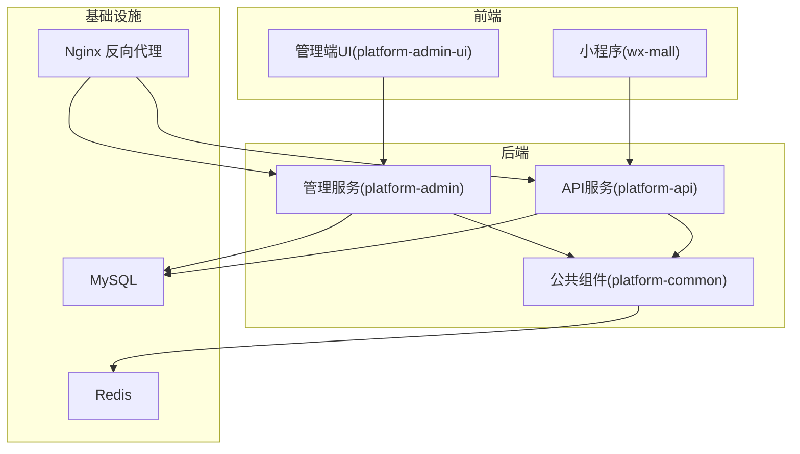
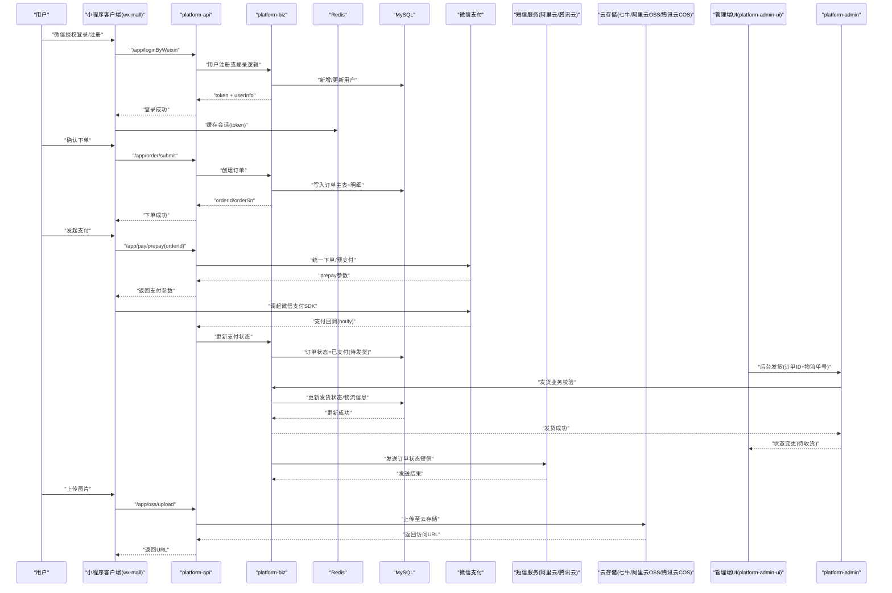
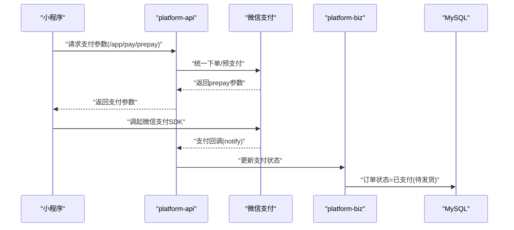
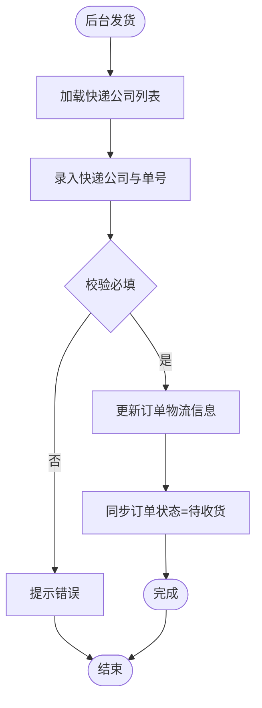
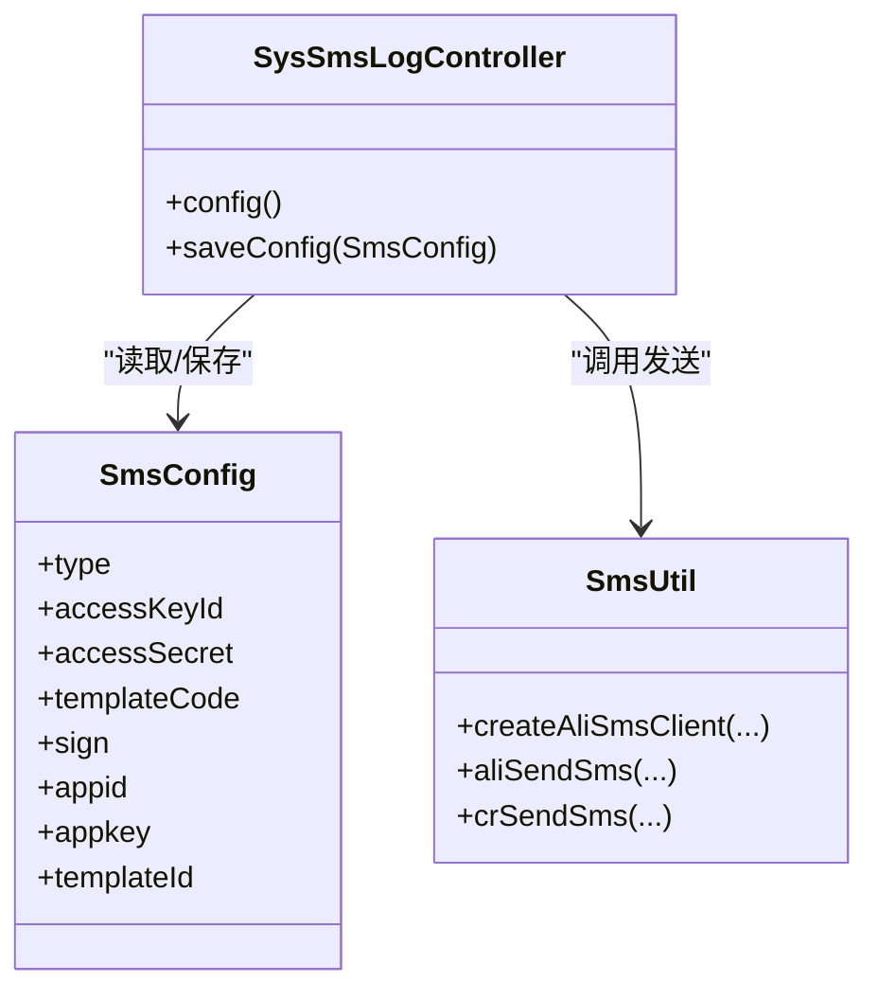
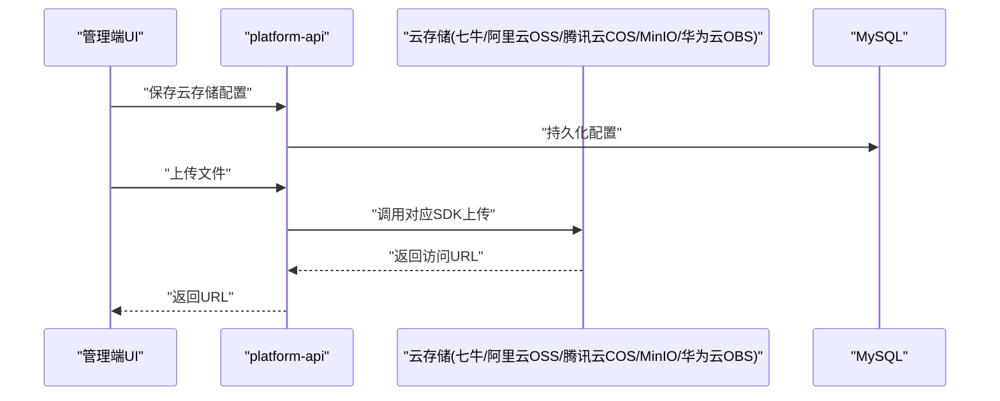
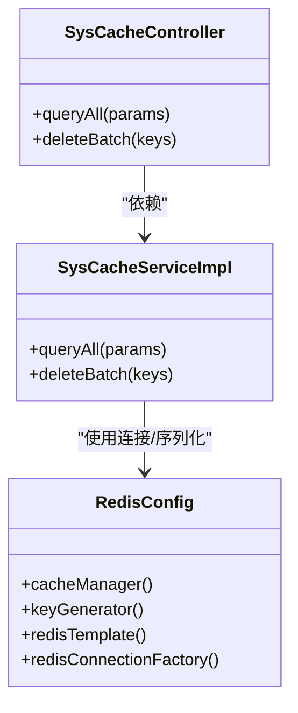
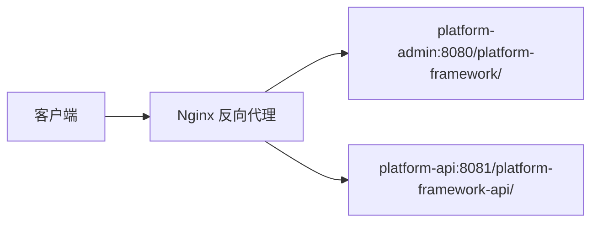
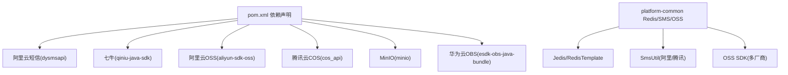

# 第三方服务集成

<cite>
**本文引用的文件**
- [application.yml（平台管理端）](file://platform-admin/src/main/resources/application.yml)
- [application.yml（平台API端）](file://platform-api/src/main/resources/application.yml)
- [支付服务（小程序端）](file://wx-mall/services/pay.js)
- [支付页面（小程序端）](file://wx-mall/pages/pay/pay.wxml)
- [支付结果页面（小程序端）](file://wx-mall/pages/payResult/payResult.wxml)
- [时序架构图](file://docs/时序架构图.mmd)
- [短信配置界面（管理端UI）](file://platform-admin-ui/src/views/modules/sys/sms-config.vue)
- [短信发送工具（公共组件）](file://platform-common/src/main/java/com/platform/common/utils/SmsUtil.java)
- [短信配置控制器（管理端）](file://platform-admin/src/main/java/com/platform/modules/sys/controller/SysSmsLogController.java)
- [云存储配置界面（管理端UI）](file://platform-admin-ui/src/views/modules/oss/oss-config.vue)
- [云存储配置控制器（管理端）](file://platform-admin/src/main/java/com/platform/modules/oss/controller/SysOssController.java)
- [云存储配置实体（Biz层）](file://platform-biz/src/main/java/com/platform/modules/oss/cloud/CloudStorageConfig.java)
- [Redis配置（公共组件）](file://platform-common/src/main/java/com/platform/config/RedisConfig.java)
- [Redis缓存服务（管理端）](file://platform-admin/src/main/java/com/platform/modules/sys/service/impl/SysCacheServiceImpl.java)
- [Redis缓存控制器（管理端）](file://platform-admin/src/main/java/com/platform/modules/sys/controller/SysCacheController.java)
- [Nginx反向代理配置](file://deploy/nginx/default.conf)
- [POM依赖（阿里云短信）](file://pom.xml)
- [系统配置表（SQL初始化）](file://_sql/base.sql)
</cite>

## 目录
1. [引言](#引言)
2. [项目结构](#项目结构)
3. [核心组件](#核心组件)
4. [架构总览](#架构总览)
5. [详细组件分析](#详细组件分析)
6. [依赖分析](#依赖分析)
7. [性能考虑](#性能考虑)
8. [故障排查指南](#故障排查指南)
9. [结论](#结论)
10. [附录](#附录)

## 引言
本指南面向需要在现有平台中集成第三方服务的开发者，覆盖支付、物流、短信、云存储、缓存、API网关与运维等主题。文档基于仓库中的实际实现与配置，提供从接入到上线的完整流程与最佳实践。

## 项目结构
项目采用多模块分层架构：
- 平台管理端（platform-admin）：后端管理服务，提供配置与后台运营能力
- 平台API端（platform-api）：对外提供移动端与小程序接口
- 平台公共组件（platform-common）：通用配置、工具与缓存
- 商城小程序（wx-mall）：微信小程序前端
- 管理端前端（platform-admin-ui）：管理后台前端
- 部署与文档（deploy、docs）：部署脚本、Nginx配置与架构说明

图表来源
- [Nginx反向代理配置:1-26](file://deploy/nginx/default.conf#L1-L26)

章节来源
- [Nginx反向代理配置:1-26](file://deploy/nginx/default.conf#L1-L26)

## 核心组件
- 支付集成：微信支付（小程序）、支付宝（配置项已预留）
- 短信集成：阿里云短信、腾讯云短信（SDK与配置）
- 云存储集成：七牛、阿里云OSS、腾讯云COS、MinIO、华为云OBS、本地磁盘
- 缓存集成：Redis（单机/哨兵/集群配置示例）
- API网关：Nginx统一入口与上下文路径
- 物流与订单：后台发货与物流单号维护

章节来源
- [application.yml（平台管理端）:143-204](file://platform-admin/src/main/resources/application.yml#L143-L204)
- [application.yml（平台API端）:132-194](file://platform-api/src/main/resources/application.yml#L132-L194)
- [短信发送工具（公共组件）:39-175](file://platform-common/src/main/java/com/platform/common/utils/SmsUtil.java#L39-L175)
- [云存储配置控制器（管理端）:108-139](file://platform-admin/src/main/java/com/platform/modules/oss/controller/SysOssController.java#L108-L139)
- [Redis配置（公共组件）:56-181](file://platform-common/src/main/java/com/platform/config/RedisConfig.java#L56-L181)

## 架构总览
下图展示了从前端到后端、再到第三方服务与数据库的整体交互流程，重点覆盖支付、物流与短信场景。

图表来源
- [时序架构图:1-64](file://docs/时序架构图.mmd#L1-L64)
- [支付服务（小程序端）:11-39](file://wx-mall/services/pay.js#L11-L39)
- [支付页面（小程序端）:1-29](file://wx-mall/pages/pay/pay.wxml#L1-L29)
- [支付结果页面（小程序端）:1-23](file://wx-mall/pages/payResult/payResult.wxml#L1-L23)

章节来源
- [时序架构图:1-64](file://docs/时序架构图.mmd#L1-L64)

## 详细组件分析

### 支付服务集成（微信支付、支付宝预留）
- 小程序端支付流程
  - 小程序调用后端接口获取支付参数
  - 使用微信支付 SDK 发起支付
  - 支付完成后跳转支付结果页
- 后端支付参数生成与回调处理
  - 平台API端提供统一下单/预支付参数接口
  - 平台管理端接收第三方回调并更新订单状态
  - 微信支付与支付宝支付的关键配置已在配置文件中预留

图表来源
- [支付服务（小程序端）:11-39](file://wx-mall/services/pay.js#L11-L39)
- [支付页面（小程序端）:1-29](file://wx-mall/pages/pay/pay.wxml#L1-L29)
- [支付结果页面（小程序端）:1-23](file://wx-mall/pages/payResult/payResult.wxml#L1-L23)
- [application.yml（平台管理端）:189-204](file://platform-admin/src/main/resources/application.yml#L189-L204)
- [application.yml（平台API端）:177-194](file://platform-api/src/main/resources/application.yml#L177-L194)

章节来源
- [支付服务（小程序端）:11-39](file://wx-mall/services/pay.js#L11-L39)
- [支付页面（小程序端）:1-29](file://wx-mall/pages/pay/pay.wxml#L1-L29)
- [支付结果页面（小程序端）:1-23](file://wx-mall/pages/payResult/payResult.wxml#L1-L23)
- [application.yml（平台管理端）:189-204](file://platform-admin/src/main/resources/application.yml#L189-L204)
- [application.yml（平台API端）:177-194](file://platform-api/src/main/resources/application.yml#L177-L194)

### 物流服务集成（快递查询、物流跟踪与同步）
- 后台发货流程
  - 管理端UI提供快递公司与单号录入
  - 调用后端接口更新订单物流信息
  - 订单状态流转至“待收货”
- 快递公司维护
  - 提供快递公司字典维护与查询接口

图表来源
- [短信配置界面（管理端UI）:1-102](file://platform-admin-ui/src/views/modules/sys/sms-config.vue#L1-L102)
- [时序架构图:49-64](file://docs/时序架构图.mmd#L49-L64)

章节来源
- [短信配置界面（管理端UI）:1-102](file://platform-admin-ui/src/views/modules/sys/sms-config.vue#L1-L102)
- [时序架构图:49-64](file://docs/时序架构图.mmd#L49-L64)

### 短信服务集成（阿里云短信、腾讯云短信）
- 配置入口
  - 管理端UI提供短信平台选择与参数配置
  - 配置项保存在系统配置表中
- 发送实现
  - 通过公共组件封装阿里云与腾讯云SDK
  - 支持单发、群发、模板参数替换
- 关键点
  - 短信签名与模板需在平台侧配置并通过校验
  - 发送结果记录在短信日志表中

图表来源
- [短信配置控制器（管理端）:154-176](file://platform-admin/src/main/java/com/platform/modules/sys/controller/SysSmsLogController.java#L154-L176)
- [短信发送工具（公共组件）:39-175](file://platform-common/src/main/java/com/platform/common/utils/SmsUtil.java#L39-L175)
- [系统配置表（SQL初始化）:331-332](file://_sql/base.sql#L331-L332)

章节来源
- [短信配置界面（管理端UI）:1-102](file://platform-admin-ui/src/views/modules/sys/sms-config.vue#L1-L102)
- [短信配置控制器（管理端）:154-176](file://platform-admin/src/main/java/com/platform/modules/sys/controller/SysSmsLogController.java#L154-L176)
- [短信发送工具（公共组件）:39-175](file://platform-common/src/main/java/com/platform/common/utils/SmsUtil.java#L39-L175)
- [系统配置表（SQL初始化）:331-332](file://_sql/base.sql#L331-L332)
- [POM依赖（阿里云短信）:420-425](file://pom.xml#L420-L425)

### 云存储服务集成（七牛、阿里云OSS、腾讯云COS、MinIO、华为云OBS、本地磁盘）
- 配置入口
  - 管理端UI提供多种存储类型选择与参数配置
  - 配置项保存在系统配置表中
- 上传流程
  - 前端上传文件至后端
  - 后端根据配置选择对应SDK上传
  - 返回访问URL供前端使用
- 支持的SDK
  - 七牛、阿里云OSS、腾讯云COS、MinIO、华为云OBS、本地磁盘

图表来源
- [云存储配置界面（管理端UI）:1-104](file://platform-admin-ui/src/views/modules/oss/oss-config.vue#L1-L104)
- [云存储配置控制器（管理端）:108-139](file://platform-admin/src/main/java/com/platform/modules/oss/controller/SysOssController.java#L108-L139)
- [云存储配置实体（Biz层）](file://platform-biz/src/main/java/com/platform/modules/oss/cloud/CloudStorageConfig.java)

章节来源
- [云存储配置界面（管理端UI）:1-104](file://platform-admin-ui/src/views/modules/oss/oss-config.vue#L1-L104)
- [云存储配置控制器（管理端）:108-139](file://platform-admin/src/main/java/com/platform/modules/oss/controller/SysOssController.java#L108-L139)
- [云存储配置实体（Biz层）](file://platform-biz/src/main/java/com/platform/modules/oss/cloud/CloudStorageConfig.java)

### 缓存服务集成（Redis）
- 配置与连接
  - 通过RedisConfig统一配置连接工厂、序列化策略与缓存管理器
  - 支持单机/哨兵/集群配置示例
- 管理与运维
  - 提供缓存查询与批量删除接口，便于调试与清理
  - 支持不同序列化策略适配复杂对象

图表来源
- [Redis配置（公共组件）:56-181](file://platform-common/src/main/java/com/platform/config/RedisConfig.java#L56-L181)
- [Redis缓存服务（管理端）:44-75](file://platform-admin/src/main/java/com/platform/modules/sys/service/impl/SysCacheServiceImpl.java#L44-L75)
- [Redis缓存控制器（管理端）:76-90](file://platform-admin/src/main/java/com/platform/modules/sys/controller/SysCacheController.java#L76-L90)

章节来源
- [Redis配置（公共组件）:56-181](file://platform-common/src/main/java/com/platform/config/RedisConfig.java#L56-L181)
- [Redis缓存服务（管理端）:44-75](file://platform-admin/src/main/java/com/platform/modules/sys/service/impl/SysCacheServiceImpl.java#L44-L75)
- [Redis缓存控制器（管理端）:76-90](file://platform-admin/src/main/java/com/platform/modules/sys/controller/SysCacheController.java#L76-L90)

### API网关集成（Nginx）
- 统一入口
  - Nginx作为反向代理，将不同上下文路径转发至对应后端服务
  - 平台管理端与API端分别暴露独立上下文路径
- 负载均衡与高可用
  - 可扩展为多实例部署并在上游做负载均衡
- 安全与可观测性
  - 可结合限流、鉴权与日志采集

图表来源
- [Nginx反向代理配置:1-26](file://deploy/nginx/default.conf#L1-L26)

章节来源
- [Nginx反向代理配置:1-26](file://deploy/nginx/default.conf#L1-L26)

## 依赖分析
- 短信SDK依赖
  - 阿里云短信SDK：在POM中声明
  - 腾讯云短信SDK：在公共组件中引入
- 云存储SDK依赖
  - 七牛、阿里云OSS、腾讯云COS、MinIO、华为云OBS均在POM中声明
- Redis依赖
  - Jedis连接池与Spring Data Redis在公共组件中配置

图表来源
- [POM依赖（阿里云短信）:420-425](file://pom.xml#L420-L425)
- [Redis配置（公共组件）:56-181](file://platform-common/src/main/java/com/platform/config/RedisConfig.java#L56-L181)
- [短信发送工具（公共组件）:21-31](file://platform-common/src/main/java/com/platform/common/utils/SmsUtil.java#L21-L31)

章节来源
- [POM依赖（阿里云短信）:420-425](file://pom.xml#L420-L425)
- [Redis配置（公共组件）:56-181](file://platform-common/src/main/java/com/platform/config/RedisConfig.java#L56-L181)
- [短信发送工具（公共组件）:21-31](file://platform-common/src/main/java/com/platform/common/utils/SmsUtil.java#L21-L31)

## 性能考虑
- Redis连接池与序列化
  - 合理设置最大连接数、最大等待时间与空闲连接数
  - 使用Jackson2Json序列化复杂对象，避免频繁反射
- 缓存策略
  - 对热点数据设置合理TTL，避免缓存雪崩
  - 区分业务缓存与会话缓存，避免序列化异常
- 短信与云存储
  - 短信发送建议异步化，避免阻塞主线程
  - 云存储上传建议分片与断点续传，提升稳定性
- Nginx与后端
  - 合理设置worker与IO线程，避免文件句柄耗尽
  - 对静态资源启用缓存与Gzip压缩

## 故障排查指南
- 支付回调未到账
  - 检查回调地址配置与HTTPS证书
  - 核对签名算法与参数顺序
  - 查看后端回调日志与重试机制
- 短信发送失败
  - 校验签名与模板是否通过审核
  - 检查阿里云/腾讯云AK配置与网络连通性
  - 查看短信日志表定位失败原因
- 云存储上传失败
  - 校验Endpoint、Bucket与凭证
  - 检查网络与SDK版本兼容性
- Redis序列化异常
  - 检查对象序列化策略与字段可见性
  - 使用StringRedisTemplate处理特殊键值
- Nginx转发异常
  - 检查上下文路径与代理头设置
  - 确认后端服务可达与端口开放

章节来源
- [Redis缓存服务（管理端）:55-62](file://platform-admin/src/main/java/com/platform/modules/sys/service/impl/SysCacheServiceImpl.java#L55-L62)
- [Nginx反向代理配置:11-25](file://deploy/nginx/default.conf#L11-L25)

## 结论
本指南基于现有代码与配置，给出了第三方服务集成的完整路径：从支付、物流、短信、云存储到缓存与API网关。建议在生产环境中进一步完善安全校验、熔断降级、监控告警与自动化测试，确保系统的稳定性与可维护性。

## 附录
- 配置项参考
  - 支付宝/微信支付：见平台管理端与API端配置文件
  - 短信：见管理端UI配置与短信日志控制器
  - 云存储：见管理端UI配置与OSS控制器
  - Redis：见RedisConfig与缓存控制器
- 部署建议
  - 使用Nginx统一入口，按模块拆分上下文路径
  - 多实例部署并配合负载均衡
  - 配置健康检查与自动扩缩容