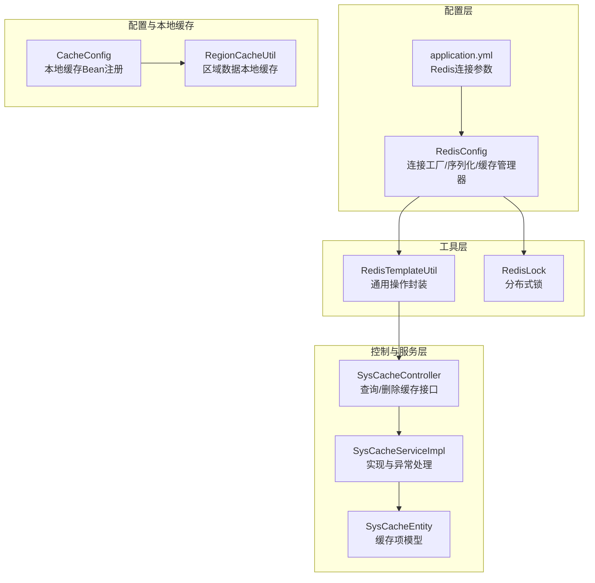
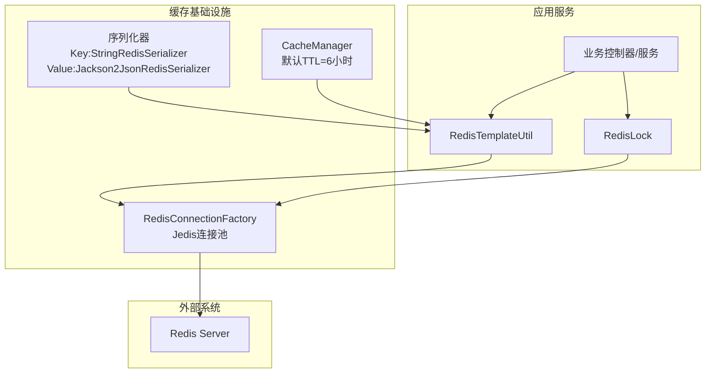
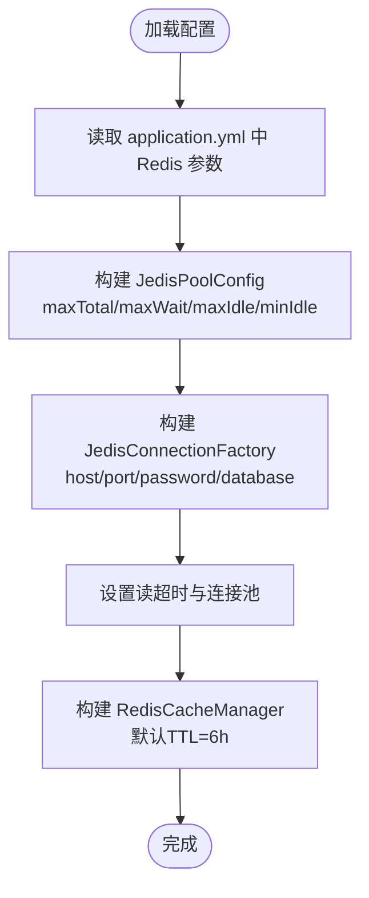
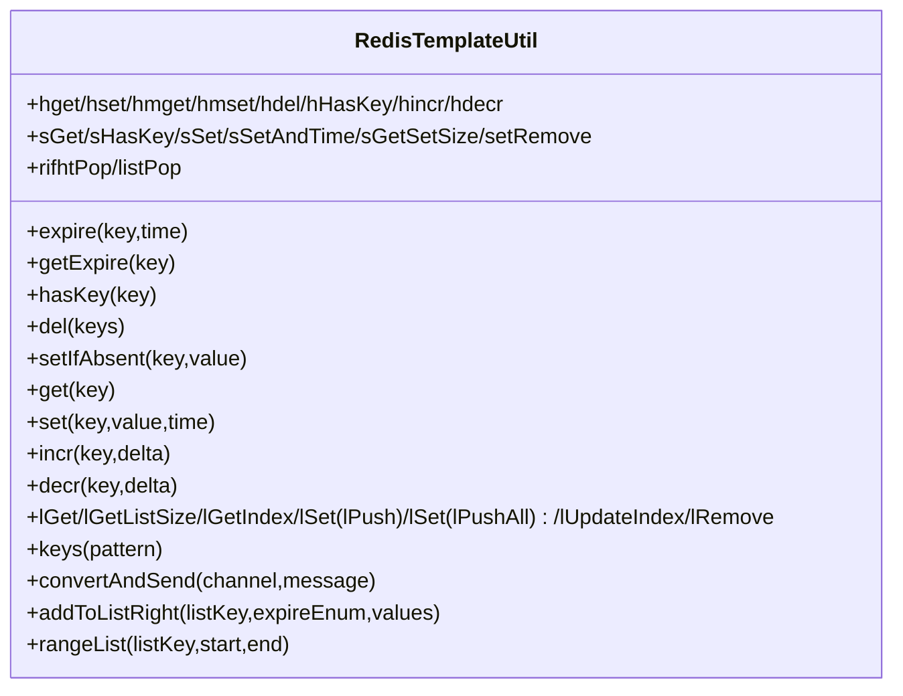
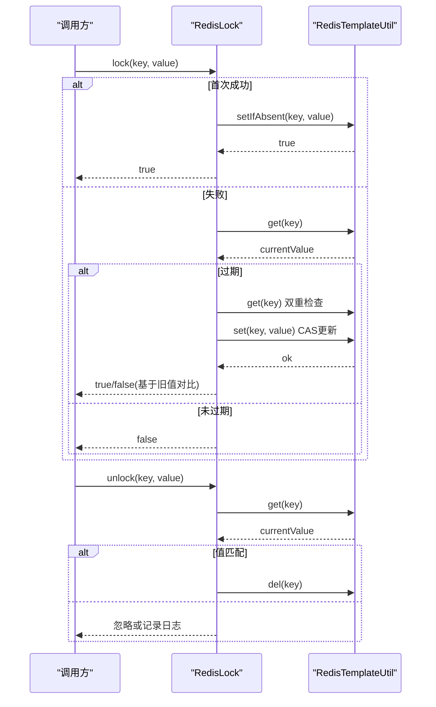
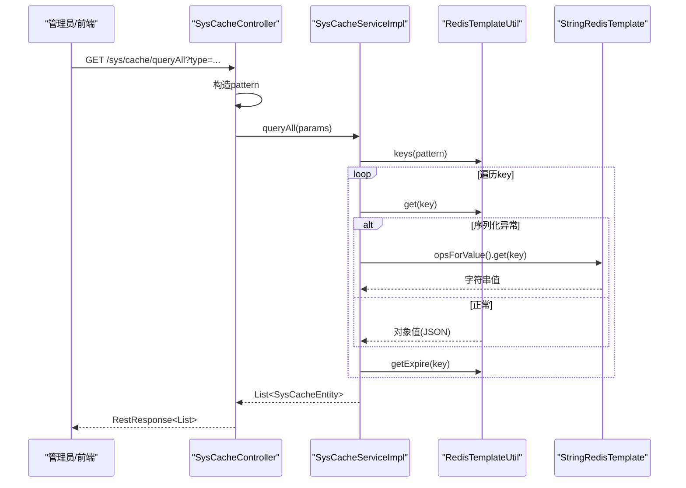
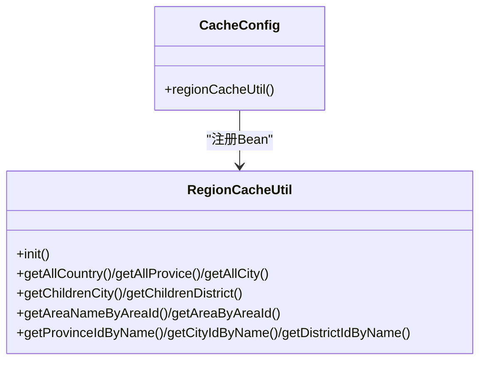
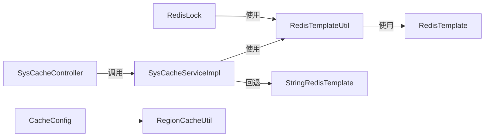

# 缓存服务集成

<cite>
**本文引用的文件**   
- [RedisConfig.java](file://platform-common/src/main/java/com/platform/config/RedisConfig.java)
- [RedisTemplateUtil.java](file://platform-common/src/main/java/com/platform/config/RedisTemplateUtil.java)
- [RedisLock.java](file://platform-common/src/main/java/com/platform/config/RedisLock.java)
- [SysCacheController.java](file://platform-admin/src/main/java/com/platform/modules/sys/controller/SysCacheController.java)
- [SysCacheService.java](file://platform-admin/src/main/java/com/platform/modules/sys/service/SysCacheService.java)
- [SysCacheServiceImpl.java](file://platform-admin/src/main/java/com/platform/modules/sys/service/impl/SysCacheServiceImpl.java)
- [SysCacheEntity.java](file://platform-admin/src/main/java/com/platform/modules/sys/entity/SysCacheEntity.java)
- [application.yml](file://platform-admin/src/main/resources/application.yml)
- [application-docker.yml](file://platform-admin/src/main/resources/application-docker.yml)
- [CacheConfig.java](file://platform-api/src/main/java/com/platform/config/CacheConfig.java)
- [RegionCacheUtil.java](file://platform-biz/src/main/java/com/platform/cache/RegionCacheUtil.java)
</cite>

## 目录
1. [简介](#简介)
2. [项目结构](#项目结构)
3. [核心组件](#核心组件)
4. [架构总览](#架构总览)
5. [组件详解](#组件详解)
6. [依赖关系分析](#依赖关系分析)
7. [性能与容量规划](#性能与容量规划)
8. [故障排查与运维建议](#故障排查与运维建议)
9. [结论](#结论)
10. [附录](#附录)

## 简介
本指南围绕平台项目的缓存服务集成展开，重点覆盖 Redis 缓存配置、RedisTemplate 工具类、分布式锁、缓存策略与一致性、性能优化与监控告警、故障恢复等主题。读者可据此完成 Redis 的接入、调优与运维。

## 项目结构
与缓存相关的关键模块分布如下：
- 配置层：Redis 连接、序列化、缓存管理器与连接池配置
- 工具层：RedisTemplate 封装，提供统一的键值、哈希、集合、列表等操作
- 分布式锁：基于 Redis 的简单互斥锁实现
- 控制与服务层：系统缓存管理的查询与删除接口及实现
- 配置与本地缓存：MyBatis Plus 本地缓存工具与区域缓存初始化

图表来源
- [RedisConfig.java:56-181](file://platform-common/src/main/java/com/platform/config/RedisConfig.java#L56-L181)
- [application.yml:81-98](file://platform-admin/src/main/resources/application.yml#L81-L98)
- [RedisTemplateUtil.java:42-682](file://platform-common/src/main/java/com/platform/config/RedisTemplateUtil.java#L42-L682)
- [RedisLock.java:35-81](file://platform-common/src/main/java/com/platform/config/RedisLock.java#L35-L81)
- [SysCacheController.java:44-91](file://platform-admin/src/main/java/com/platform/modules/sys/controller/SysCacheController.java#L44-L91)
- [SysCacheServiceImpl.java:40-76](file://platform-admin/src/main/java/com/platform/modules/sys/service/impl/SysCacheServiceImpl.java#L40-L76)
- [SysCacheEntity.java:31-46](file://platform-admin/src/main/java/com/platform/modules/sys/entity/SysCacheEntity.java#L31-L46)
- [CacheConfig.java:31-37](file://platform-api/src/main/java/com/platform/config/CacheConfig.java#L31-L37)
- [RegionCacheUtil.java:17-319](file://platform-biz/src/main/java/com/platform/cache/RegionCacheUtil.java#L17-L319)

章节来源
- [RedisConfig.java:56-181](file://platform-common/src/main/java/com/platform/config/RedisConfig.java#L56-L181)
- [application.yml:81-98](file://platform-admin/src/main/resources/application.yml#L81-L98)
- [RedisTemplateUtil.java:42-682](file://platform-common/src/main/java/com/platform/config/RedisTemplateUtil.java#L42-L682)
- [RedisLock.java:35-81](file://platform-common/src/main/java/com/platform/config/RedisLock.java#L35-L81)
- [SysCacheController.java:44-91](file://platform-admin/src/main/java/com/platform/modules/sys/controller/SysCacheController.java#L44-L91)
- [SysCacheServiceImpl.java:40-76](file://platform-admin/src/main/java/com/platform/modules/sys/service/impl/SysCacheServiceImpl.java#L40-L76)
- [SysCacheEntity.java:31-46](file://platform-admin/src/main/java/com/platform/modules/sys/entity/SysCacheEntity.java#L31-L46)
- [CacheConfig.java:31-37](file://platform-api/src/main/java/com/platform/config/CacheConfig.java#L31-L37)
- [RegionCacheUtil.java:17-319](file://platform-biz/src/main/java/com/platform/cache/RegionCacheUtil.java#L17-L319)

## 核心组件
- Redis 配置与连接池
  - 通过连接工厂装配 Jedis 连接池，支持单机模式，配置项来自 application.yml
  - 提供 CacheManager、KeyGenerator、序列化器（字符串键、JSON 值）
- RedisTemplate 工具类
  - 统一封装 String、Hash、Set、List 等常用操作，提供过期、存在性判断、模糊查询、消息通道等能力
- 分布式锁
  - 基于 setIfAbsent + 过期时间 + 值校验的简易互斥锁，支持加锁与解锁
- 系统缓存管理
  - 提供缓存查询与批量删除接口，内部兼容不同序列化场景
- 本地缓存与区域缓存
  - 注册本地缓存 Bean，提供区域数据的本地初始化与查询

章节来源
- [RedisConfig.java:56-181](file://platform-common/src/main/java/com/platform/config/RedisConfig.java#L56-L181)
- [RedisTemplateUtil.java:42-682](file://platform-common/src/main/java/com/platform/config/RedisTemplateUtil.java#L42-L682)
- [RedisLock.java:35-81](file://platform-common/src/main/java/com/platform/config/RedisLock.java#L35-L81)
- [SysCacheController.java:44-91](file://platform-admin/src/main/java/com/platform/modules/sys/controller/SysCacheController.java#L44-L91)
- [SysCacheServiceImpl.java:40-76](file://platform-admin/src/main/java/com/platform/modules/sys/service/impl/SysCacheServiceImpl.java#L40-L76)
- [CacheConfig.java:31-37](file://platform-api/src/main/java/com/platform/config/CacheConfig.java#L31-L37)
- [RegionCacheUtil.java:17-319](file://platform-biz/src/main/java/com/platform/cache/RegionCacheUtil.java#L17-L319)

## 架构总览
下图展示 Redis 在系统中的整体位置与交互关系：

图表来源
- [RedisConfig.java:94-100](file://platform-common/src/main/java/com/platform/config/RedisConfig.java#L94-L100)
- [RedisConfig.java:115-130](file://platform-common/src/main/java/com/platform/config/RedisConfig.java#L115-L130)
- [RedisConfig.java:153-180](file://platform-common/src/main/java/com/platform/config/RedisConfig.java#L153-L180)
- [RedisTemplateUtil.java:137-151](file://platform-common/src/main/java/com/platform/config/RedisTemplateUtil.java#L137-L151)

## 组件详解

### Redis 配置与连接池
- 连接参数来源
  - 数据库索引、主机、端口、密码、连接超时等均来自 application.yml
  - Docker 环境变量覆盖默认值
- 连接池配置
  - 最大活跃、最大空闲、最小空闲、最大等待时间
  - 读超时与连接池启用
- 缓存管理器
  - 默认 TTL 6 小时，键使用字符串序列化，值使用 JSON 序列化
  - KeyGenerator 生成规则包含类名、方法名与参数列表
- 连接工厂
  - 单机模式配置，支持哨兵/集群扩展（注释保留）

图表来源
- [application.yml:81-98](file://platform-admin/src/main/resources/application.yml#L81-L98)
- [application-docker.yml:17-20](file://platform-admin/src/main/resources/application-docker.yml#L17-L20)
- [RedisConfig.java:153-180](file://platform-common/src/main/java/com/platform/config/RedisConfig.java#L153-L180)
- [RedisConfig.java:94-100](file://platform-common/src/main/java/com/platform/config/RedisConfig.java#L94-L100)

章节来源
- [application.yml:81-98](file://platform-admin/src/main/resources/application.yml#L81-L98)
- [application-docker.yml:17-20](file://platform-admin/src/main/resources/application-docker.yml#L17-L20)
- [RedisConfig.java:56-181](file://platform-common/src/main/java/com/platform/config/RedisConfig.java#L56-L181)

### RedisTemplate 工具类
- 设计要点
  - 统一持有 RedisTemplate<String,Object>，键与哈希键使用字符串序列化，值使用 JSON 序列化
  - 提供字符串、哈希、集合、列表等常用操作
  - 支持过期设置、存在性判断、模糊查询 keys、消息通道 publish
  - 提供 BoundListOperations 的便捷方法（右侧入队、区间查询、左右弹出）
- 异常与边界
  - 多数操作捕获异常并返回布尔或空结果，便于上层容错
  - keys 操作仅用于管理端，生产环境建议配合模式匹配与分页

图表来源
- [RedisTemplateUtil.java:42-682](file://platform-common/src/main/java/com/platform/config/RedisTemplateUtil.java#L42-L682)

章节来源
- [RedisTemplateUtil.java:42-682](file://platform-common/src/main/java/com/platform/config/RedisTemplateUtil.java#L42-L682)

### 分布式锁
- 加锁流程
  - 使用 setIfAbsent(key, value) 争抢锁
  - 若失败，检查当前值是否过期，若过期则尝试 CAS 更新并再次比较旧值，确保并发安全
- 解锁流程
  - 校验当前值与期望值一致后删除 key，异常时记录日志
- 适用场景
  - 限流、幂等、串行化关键业务片段

图表来源
- [RedisLock.java:46-79](file://platform-common/src/main/java/com/platform/config/RedisLock.java#L46-L79)
- [RedisTemplateUtil.java:111-117](file://platform-common/src/main/java/com/platform/config/RedisTemplateUtil.java#L111-L117)

章节来源
- [RedisLock.java:35-81](file://platform-common/src/main/java/com/platform/config/RedisLock.java#L35-L81)
- [RedisTemplateUtil.java:42-170](file://platform-common/src/main/java/com/platform/config/RedisTemplateUtil.java#L42-L170)

### 系统缓存管理（查询与删除）
- 查询逻辑
  - 根据类型构造 pattern，使用 keys 模糊匹配
  - 优先使用通用 RedisTemplateUtil 获取值，遇到序列化异常时回退至 StringRedisTemplate
  - 记录剩余过期时间
- 删除逻辑
  - 批量删除指定 key

图表来源
- [SysCacheController.java:53-74](file://platform-admin/src/main/java/com/platform/modules/sys/controller/SysCacheController.java#L53-L74)
- [SysCacheServiceImpl.java:44-67](file://platform-admin/src/main/java/com/platform/modules/sys/service/impl/SysCacheServiceImpl.java#L44-L67)
- [SysCacheEntity.java:31-46](file://platform-admin/src/main/java/com/platform/modules/sys/entity/SysCacheEntity.java#L31-L46)

章节来源
- [SysCacheController.java:44-91](file://platform-admin/src/main/java/com/platform/modules/sys/controller/SysCacheController.java#L44-L91)
- [SysCacheServiceImpl.java:40-76](file://platform-admin/src/main/java/com/platform/modules/sys/service/impl/SysCacheServiceImpl.java#L40-L76)
- [SysCacheEntity.java:31-46](file://platform-admin/src/main/java/com/platform/modules/sys/entity/SysCacheEntity.java#L31-L46)

### 本地缓存与区域缓存
- 本地缓存
  - 通过 CacheConfig 注册 RegionCacheUtil Bean，作为本地缓存容器
- 区域缓存
  - 初始化时从服务层拉取区域数据，按类型与父子关系提供查询方法
  - 适用于高频读取但变更较少的静态数据

图表来源
- [CacheConfig.java:31-37](file://platform-api/src/main/java/com/platform/config/CacheConfig.java#L31-L37)
- [RegionCacheUtil.java:17-319](file://platform-biz/src/main/java/com/platform/cache/RegionCacheUtil.java#L17-L319)

章节来源
- [CacheConfig.java:31-37](file://platform-api/src/main/java/com/platform/config/CacheConfig.java#L31-L37)
- [RegionCacheUtil.java:17-319](file://platform-biz/src/main/java/com/platform/cache/RegionCacheUtil.java#L17-L319)

## 依赖关系分析
- 组件耦合
  - RedisTemplateUtil 依赖 RedisTemplate，被业务与工具层广泛使用
  - RedisLock 依赖 RedisTemplateUtil，实现轻量级分布式锁
  - SysCacheController/Service 依赖 RedisTemplateUtil 与 StringRedisTemplate，用于兼容不同序列化
  - CacheConfig/RegionCacheUtil 与 Redis 无直接耦合，属于本地缓存策略
- 外部依赖
  - Jedis 连接池、Spring Data Redis、Jackson 序列化
- 潜在风险
  - keys 模糊查询可能造成阻塞，建议仅在管理端使用
  - 分布式锁未使用 Redlock 等高级算法，适合简单场景

图表来源
- [RedisTemplateUtil.java:42-682](file://platform-common/src/main/java/com/platform/config/RedisTemplateUtil.java#L42-L682)
- [RedisLock.java:35-81](file://platform-common/src/main/java/com/platform/config/RedisLock.java#L35-L81)
- [SysCacheServiceImpl.java:40-76](file://platform-admin/src/main/java/com/platform/modules/sys/service/impl/SysCacheServiceImpl.java#L40-L76)
- [CacheConfig.java:31-37](file://platform-api/src/main/java/com/platform/config/CacheConfig.java#L31-L37)
- [RegionCacheUtil.java:17-319](file://platform-biz/src/main/java/com/platform/cache/RegionCacheUtil.java#L17-L319)

章节来源
- [RedisTemplateUtil.java:42-682](file://platform-common/src/main/java/com/platform/config/RedisTemplateUtil.java#L42-L682)
- [RedisLock.java:35-81](file://platform-common/src/main/java/com/platform/config/RedisLock.java#L35-L81)
- [SysCacheServiceImpl.java:40-76](file://platform-admin/src/main/java/com/platform/modules/sys/service/impl/SysCacheServiceImpl.java#L40-L76)
- [CacheConfig.java:31-37](file://platform-api/src/main/java/com/platform/config/CacheConfig.java#L31-L37)
- [RegionCacheUtil.java:17-319](file://platform-biz/src/main/java/com/platform/cache/RegionCacheUtil.java#L17-L319)

## 性能与容量规划
- 连接池与超时
  - 合理设置最大连接数、空闲数与最大等待时间，避免排队与 OOM
  - 读超时与连接超时需与业务 RT 目标匹配，防止请求堆积
- 序列化
  - 值使用 JSON 序列化，注意类版本与字段兼容
  - 键使用字符串序列化，避免跨服务键冲突
- TTL 与过期策略
  - CacheManager 默认 6 小时，针对热点数据可按业务设置更短 TTL
  - 对冷数据设置随机偏移，避免同时过期引发“缓存雪崩”
- 命中率优化
  - 使用多级缓存（本地+Redis），热点数据本地驻留
  - 对热点键设置只增型结构（如 HyperLogLog 统计 UV）
- 管理端操作
  - keys 模糊查询仅用于运维场景，建议配合模式与分页
- 监控与告警
  - 关键指标：命中率、慢查询、连接池使用率、内存占用、过期键比例
  - 告警阈值：连接池耗尽、命令阻塞、内存接近上限、过期键比例异常

[本节为通用指导，无需特定文件引用]

## 故障排查与运维建议
- 常见问题定位
  - 连接失败：核对 host/port/password/database 与网络连通性
  - 超时：检查 max-wait、timeout、JVM GC 与 Redis 压力
  - 序列化异常：确认对象具备默认构造与可序列化字段
  - 锁未释放：检查 unlock 的 value 与过期时间，避免长时间持有
- 运维建议
  - 生产环境禁用 keys 模糊查询，改用 SCAN 或业务侧维护索引
  - 对热 key 做副本或分片，避免单实例瓶颈
  - 定期巡检过期键比例，清理僵尸数据
  - 使用只读副本分流读流量，主节点专注写入

[本节为通用指导，无需特定文件引用]

## 结论
本项目通过集中式 Redis 配置、统一的 RedisTemplate 工具类与轻量级分布式锁，实现了稳定高效的缓存能力。结合本地缓存与合理的 TTL/过期策略，可在保证一致性的同时提升吞吐与延迟表现。建议在生产环境中完善监控与告警体系，并持续优化连接池与序列化策略以适配业务增长。

[本节为总结性内容，无需特定文件引用]

## 附录

### 缓存策略设计与防护
- 缓存穿透
  - 方案：布隆过滤器拦截非法 key；对空结果也缓存短 TTL
- 缓存雪崩
  - 方案：为 TTL 添加随机抖动；热点数据本地缓存；多级缓存降级
- 缓存击穿
  - 方案：热点 key 永不过期或单独保护；互斥锁保护首次加载

[本节为通用指导，无需特定文件引用]

### 缓存一致性与失效策略
- 读多写少场景：读取时允许短时脏读，后台异步刷新
- 写多场景：先写 DB，再删缓存；或写 DB 后更新缓存
- 广播失效：使用发布订阅或消息队列触发失效

[本节为通用指导，无需特定文件引用]

### Redis 配置清单（摘自 application.yml）
- 数据库索引、主机、端口、密码、连接超时
- 连接池：最大连接数、最大空闲、最小空闲、最大等待时间
- 缓存管理器：默认 TTL、键值序列化器

章节来源
- [application.yml:81-98](file://platform-admin/src/main/resources/application.yml#L81-L98)
- [application-docker.yml:17-20](file://platform-admin/src/main/resources/application-docker.yml#L17-L20)