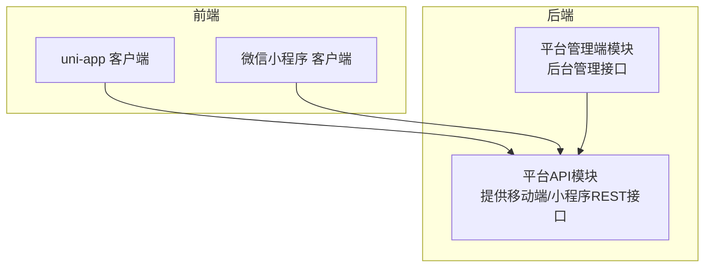
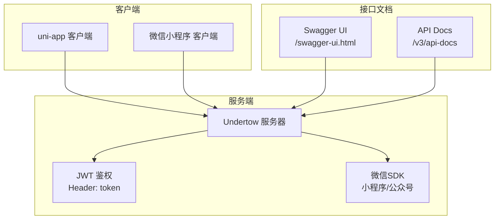
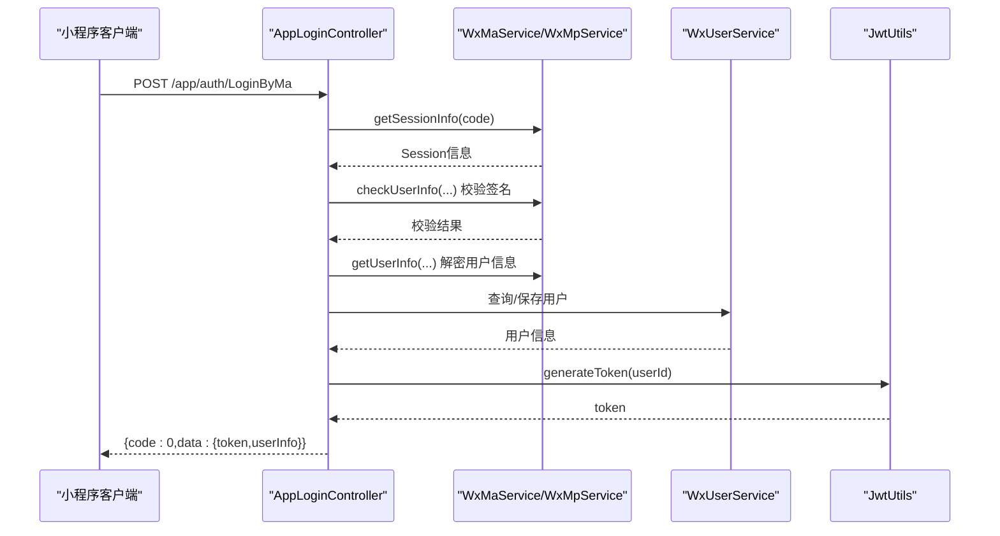
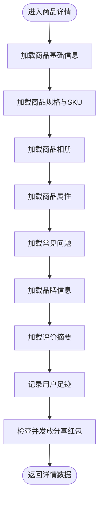
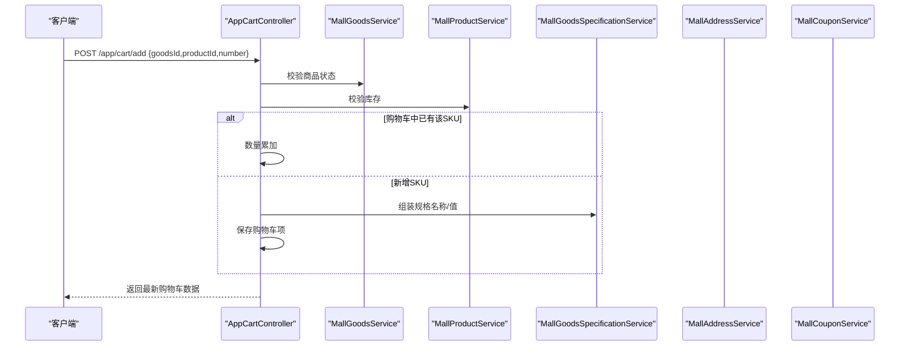
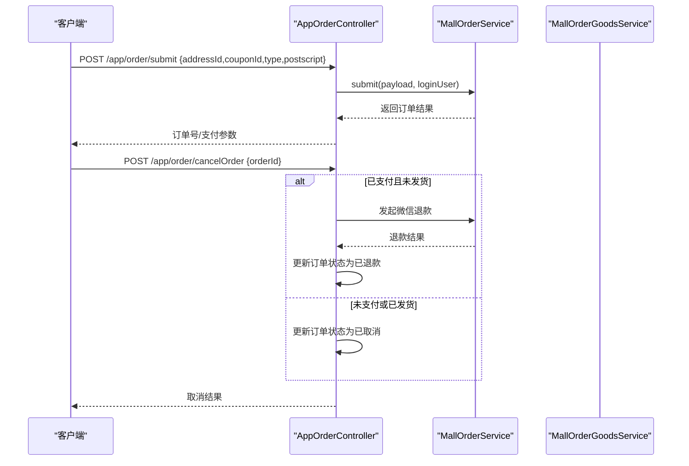
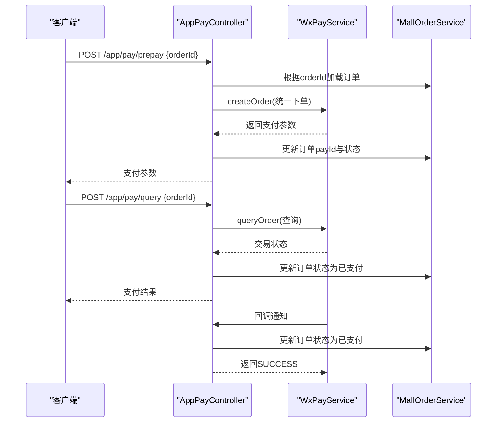
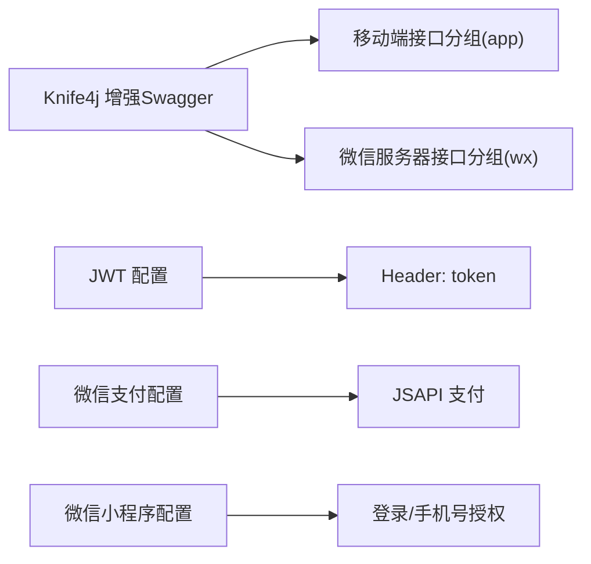

# 业务API接口

<cite>
**本文引用的文件**
- [平台启动类（API）](file://platform-api/src/main/java/com/platform/PlatformApiApplication.java)
- [平台启动类（管理端）](file://platform-admin/src/main/java/com/platform/PlatformAdminApplication.java)
- [应用层登录控制器](file://platform-api/src/main/java/com/platform/modules/app/controller/AppLoginController.java)
- [应用层商品控制器](file://platform-api/src/main/java/com/platform/modules/app/controller/AppGoodsController.java)
- [应用层购物车控制器](file://platform-api/src/main/java/com/platform/modules/app/controller/AppCartController.java)
- [应用层订单控制器](file://platform-api/src/main/java/com/platform/modules/app/controller/AppOrderController.java)
- [应用层支付控制器](file://platform-api/src/main/java/com/platform/modules/app/controller/AppPayController.java)
- [API应用配置（平台API）](file://platform-api/src/main/resources/application.yml)
- [API应用配置（平台管理端）](file://platform-admin/src/main/resources/application.yml)
- [小程序请求封装（uni-app）](file://uni-mall/utils/util.js)
- [小程序请求封装（微信小程序技能包）](file://wx-mall/skills/mall-guide-skill/apis/request.js)
- [小程序请求封装（购物车技能包）](file://wx-mall/skills/mall-checkout-skill/apis/request.js)
- [小程序请求封装（订单技能包）](file://wx-mall/skills/mall-order-skill/apis/request.js)
- [uni-app用户中心页面（登录流程示例）](file://uni-mall/pages/ucenter/index/index.vue)
</cite>

## 目录
1. [简介](#简介)
2. [项目结构](#项目结构)
3. [核心组件](#核心组件)
4. [架构总览](#架构总览)
5. [详细组件分析](#详细组件分析)
6. [依赖分析](#依赖分析)
7. [性能考虑](#性能考虑)
8. [故障排查指南](#故障排查指南)
9. [结论](#结论)
10. [附录](#附录)

## 简介
本文件为面向小程序与移动端的RESTful业务API接口文档，覆盖用户认证、商品浏览、购物车操作、订单处理、支付流程、用户中心等核心业务场景。文档提供接口的HTTP方法、URL模式、请求/响应数据结构、参数校验规则、错误码定义、鉴权机制、签名算法与安全防护措施，并给出调用示例、业务流程说明、异常处理策略、性能优化建议、版本管理与兼容性说明。

## 项目结构
后端采用多模块工程，平台API模块提供移动端与小程序统一的业务接口；前端包含uni-app与微信小程序两套客户端，分别通过各自的请求封装与后端交互。

**图表来源**
- [平台启动类（API）:51-91](file://platform-api/src/main/java/com/platform/PlatformApiApplication.java#L51-L91)
- [平台启动类（管理端）:52-92](file://platform-admin/src/main/java/com/platform/PlatformAdminApplication.java#L52-L92)

**章节来源**
- [平台启动类（API）:51-91](file://platform-api/src/main/java/com/platform/PlatformApiApplication.java#L51-L91)
- [平台启动类（管理端）:52-92](file://platform-admin/src/main/java/com/platform/PlatformAdminApplication.java#L52-L92)

## 核心组件
- 平台API模块：提供移动端与小程序统一REST接口，基于Spring Boot + SpringDoc OpenAPI + Knife4j，接口文档分组清晰，便于联调与测试。
- 平台管理端模块：提供后台管理接口，独立部署，便于运营与维护。
- 前端uni-app与微信小程序：通过各自请求封装与后端交互，统一携带token进行鉴权。

**章节来源**
- [API应用配置（平台API）:22-56](file://platform-api/src/main/resources/application.yml#L22-L56)
- [API应用配置（平台管理端）:22-67](file://platform-admin/src/main/resources/application.yml#L22-L67)

## 架构总览
后端服务通过 Undertow 提供高性能HTTP服务，接口文档通过 Knife4j 增强展示，支持移动端与微信服务器两类分组。前端通过统一的接口前缀与token头进行鉴权。

**图表来源**
- [API应用配置（平台API）:22-56](file://platform-api/src/main/resources/application.yml#L22-L56)
- [平台启动类（API）:51-91](file://platform-api/src/main/java/com/platform/PlatformApiApplication.java#L51-L91)

**章节来源**
- [API应用配置（平台API）:22-56](file://platform-api/src/main/resources/application.yml#L22-L56)
- [平台启动类（API）:51-91](file://platform-api/src/main/java/com/platform/PlatformApiApplication.java#L51-L91)

## 详细组件分析

### 用户认证接口
- 接口分组：移动端接口（app），微信服务器（wx）
- 鉴权机制：移动端接口通过JWT令牌鉴权，请求头携带token；微信服务器接口通过微信配置与签名校验
- 登录方式：
  - 微信小程序登录：code换取session，校验签名，解密用户信息，生成token
  - 微信公众号登录：code换取access_token与用户信息，生成token
  - APP端微信登录：使用已授权的access_token换取用户信息，生成token
  - 静默登录：仅使用code换取用户信息，若不存在则新建用户

**图表来源**
- [应用层登录控制器:78-140](file://platform-api/src/main/java/com/platform/modules/app/controller/AppLoginController.java#L78-L140)

**章节来源**
- [应用层登录控制器:78-140](file://platform-api/src/main/java/com/platform/modules/app/controller/AppLoginController.java#L78-L140)
- [API应用配置（平台API）:123-131](file://platform-api/src/main/resources/application.yml#L123-L131)

#### 接口清单（用户认证）
- POST /app/auth/LoginByMa
  - 功能：微信小程序登录
  - 请求头：Content-Type: application/json
  - 请求体：包含code与userInfo（rawData、signature、encryptedData、iv）
  - 成功响应：token与用户信息
  - 错误码：登录失败、签名验证失败、token生成异常
- POST /app/auth/LoginByMaPhone
  - 功能：微信小程序手机号授权
  - 请求体：code、userId
  - 成功响应：手机号授权成功
  - 错误码：手机号授权失败
- POST /app/auth/loginByMp
  - 功能：微信公众号登录
  - 请求体：code、mpAppId
  - 成功响应：token与用户信息
  - 错误码：登录失败
- POST /app/auth/AppLoginByWx
  - 功能：APP端微信登录
  - 请求体：包含已授权access_token
  - 成功响应：token与用户信息
  - 错误码：登录失败
- GET /app/auth/createJsapiSignature/{appid}?url=...
  - 功能：生成JSAPI签名
  - 成功响应：WxJsapiSignature
- GET /app/auth/{code}
  - 功能：静默登录
  - 成功响应：token与用户信息

**章节来源**
- [应用层登录控制器:78-364](file://platform-api/src/main/java/com/platform/modules/app/controller/AppLoginController.java#L78-L364)

### 商品浏览接口
- 接口分组：移动端接口（app）
- 功能：商品首页、商品详情、分类信息、商品列表、新品/热销推荐、相关商品、商品统计等
- 鉴权：部分接口无需登录（如首页、详情、列表），部分接口需登录（如收藏、足迹）

**图表来源**
- [应用层商品控制器:109-266](file://platform-api/src/main/java/com/platform/modules/app/controller/AppGoodsController.java#L109-L266)

**章节来源**
- [应用层商品控制器:73-404](file://platform-api/src/main/java/com/platform/modules/app/controller/AppGoodsController.java#L73-L404)

#### 接口清单（商品浏览）
- POST /app/goods/index
  - 功能：商品首页（在售商品列表）
  - 成功响应：商品列表
- POST /app/goods/detail
  - 功能：商品详情页数据
  - 参数：id、referrer（推荐人）
  - 成功响应：商品详情、规格、SKU、相册、属性、评价、品牌、收藏状态、足迹记录
- POST /app/goods/category
  - 功能：分类下的商品
  - 参数：id
  - 成功响应：当前分类、父分类、兄弟分类
- POST /app/goods/list
  - 功能：商品列表（支持品牌、关键词、新品、热销、排序）
  - 参数：categoryId、brandId、keyword、isNew、isHot、page、size、sort、order
  - 成功响应：筛选分类、商品分页列表
- POST /app/goods/filter
  - 功能：商品列表筛选的分类列表
  - 参数：categoryId、keyword、isNew、isHot
  - 成功响应：一级分类列表
- POST /app/goods/new
  - 功能：新品首发
  - 成功响应：横幅信息
- POST /app/goods/hot
  - 功能：人气推荐
  - 成功响应：横幅信息
- POST /app/goods/related
  - 功能：相关商品（推荐）
  - 参数：id
  - 成功响应：相关商品列表
- POST /app/goods/count
  - 功能：在售商品总数
  - 成功响应：商品数量
- POST /app/goods/productlist
  - 功能：商品列表（特价/团购筛选）
  - 参数：categoryId、isNew、discount、page、size、sort、order
  - 成功响应：商品分页列表（含购物车数量）

**章节来源**
- [应用层商品控制器:73-618](file://platform-api/src/main/java/com/platform/modules/app/controller/AppGoodsController.java#L73-L618)

### 购物车接口
- 接口分组：移动端接口（app）
- 功能：获取购物车、添加/减少/更新商品、勾选/取消勾选、删除、结算准备、优惠券选择
- 鉴权：均需登录

**图表来源**
- [应用层购物车控制器:154-220](file://platform-api/src/main/java/com/platform/modules/app/controller/AppCartController.java#L154-L220)

**章节来源**
- [应用层购物车控制器:58-497](file://platform-api/src/main/java/com/platform/modules/app/controller/AppCartController.java#L58-L497)

#### 接口清单（购物车）
- POST /app/cart/getCart
  - 功能：获取购物车中的数据
  - 成功响应：购物车列表、优惠信息提示、总计
- POST /app/cart/index
  - 功能：获取购物车信息
  - 成功响应：同上
- POST /app/cart/add
  - 功能：添加商品到购物车
  - 请求体：goodsId、productId、number
  - 成功响应：最新购物车数据
  - 错误码：商品已下架、库存不足
- POST /app/cart/minus
  - 功能：减少商品数量
  - 请求体：goodsId、productId、number
  - 成功响应：剩余数量
- POST /app/cart/update
  - 功能：更新指定购物车信息
  - 请求体：id、goodsId、productId、number
  - 成功响应：最新购物车数据
  - 错误码：库存不足
- POST /app/cart/checked
  - 功能：勾选/取消勾选商品
  - 请求体：productIds（逗号分隔）、isChecked
  - 成功响应：最新购物车数据
- POST /app/cart/delete
  - 功能：删除选中商品
  - 请求体：productIds（逗号分隔）
  - 成功响应：最新购物车数据
- POST /app/cart/goodscount
  - 功能：获取购物车商品总件数
  - 成功响应：cartTotal.goodsCount
- POST /app/cart/checkout
  - 功能：订单提交前的检验与填写相关信息
  - 参数：couponId、type（cart或direct）
  - 成功响应：运费、优惠券抵扣、选中商品列表、应付金额
- POST /app/cart/checkedCouponList
  - 功能：选择优惠券列表
  - 成功响应：可用优惠券列表

**章节来源**
- [应用层购物车控制器:58-497](file://platform-api/src/main/java/com/platform/modules/app/controller/AppCartController.java#L58-L497)

### 订单处理接口
- 接口分组：移动端接口（app）
- 功能：订单列表、订单详情、订单提交、取消订单、确认收货
- 鉴权：均需登录

**图表来源**
- [应用层订单控制器:165-244](file://platform-api/src/main/java/com/platform/modules/app/controller/AppOrderController.java#L165-L244)

**章节来源**
- [应用层订单控制器:59-270](file://platform-api/src/main/java/com/platform/modules/app/controller/AppOrderController.java#L59-L270)

#### 接口清单（订单）
- POST /app/order/list
  - 功能：获取订单列表
  - 参数：page、size
  - 成功响应：订单列表（含商品数量、商品明细）
- POST /app/order/detail
  - 功能：获取订单详情
  - 参数：orderId
  - 成功响应：订单信息、订单商品、可操作选项
  - 错误码：订单不存在、越权操作
- POST /app/order/submit
  - 功能：订单提交
  - 请求体：addressId、couponId、type、postscript
  - 成功响应：订单数据
  - 错误码：提交失败
- POST /app/order/cancelOrder
  - 功能：取消订单
  - 参数：orderId
  - 成功响应：取消结果
  - 错误码：订单不存在、越权操作、已发货/已收货不可取消、退款失败
- POST /app/order/confirmOrder
  - 功能：确认收货
  - 参数：orderId
  - 成功响应：确认结果
  - 错误码：订单不存在、越权操作、提交失败

**章节来源**
- [应用层订单控制器:59-270](file://platform-api/src/main/java/com/platform/modules/app/controller/AppOrderController.java#L59-L270)

### 支付流程接口
- 接口分组：移动端接口（app）
- 功能：统一下单、查询订单状态、支付回调、退款
- 鉴权：统一下单与查询需登录；回调接口无需登录
- 支付方式：微信JSAPI支付（小程序/公众号）

**图表来源**
- [应用层支付控制器:64-203](file://platform-api/src/main/java/com/platform/modules/app/controller/AppPayController.java#L64-L203)

**章节来源**
- [应用层支付控制器:64-260](file://platform-api/src/main/java/com/platform/modules/app/controller/AppPayController.java#L64-L260)

#### 接口清单（支付）
- POST /app/pay/prepay
  - 功能：获取支付的请求参数（统一下单）
  - 参数：orderId
  - 成功响应：微信支付参数
  - 错误码：订单已取消、越权操作、重复支付、下单失败
- POST /app/pay/query
  - 功能：查询订单状态
  - 参数：orderId
  - 成功响应：支付成功/支付中/失败
- POST /app/pay/refund
  - 功能：订单退款请求
  - 参数：orderId
  - 成功响应：退款结果
  - 错误码：订单已取消、越权操作、订单已退款、退款失败
- POST /app/pay/notify
  - 功能：微信支付回调接口（服务端异步通知）
  - 请求：微信回调XML
  - 成功响应：SUCCESS/FAIL

**章节来源**
- [应用层支付控制器:64-260](file://platform-api/src/main/java/com/platform/modules/app/controller/AppPayController.java#L64-L260)

### 用户中心接口
- 接口分组：移动端接口（app）
- 功能：用户信息、地址管理、收藏、足迹、优惠券、反馈、帮助等（由前端页面与后端接口配合）
- 鉴权：均需登录

**章节来源**
- [小程序请求封装（uni-app）:1-471](file://uni-mall/utils/util.js#L1-L471)
- [uni-app用户中心页面（登录流程示例）:107-160](file://uni-mall/pages/ucenter/index/index.vue#L107-L160)

## 依赖分析
- 接口文档：Knife4j增强Swagger UI，分组显示移动端与微信服务器接口，便于联调
- 鉴权：JWT令牌存储于Header，token键名可在配置中调整
- 微信集成：小程序/公众号SDK，支持登录、手机号授权、JSAPI签名、支付等
- 数据访问：MyBatis-Plus，逻辑删除、驼峰映射、自动缓存控制等配置

**图表来源**
- [API应用配置（平台API）:22-56](file://platform-api/src/main/resources/application.yml#L22-L56)
- [API应用配置（平台API）:123-131](file://platform-api/src/main/resources/application.yml#L123-L131)
- [API应用配置（平台API）:177-195](file://platform-api/src/main/resources/application.yml#L177-L195)

**章节来源**
- [API应用配置（平台API）:22-56](file://platform-api/src/main/resources/application.yml#L22-L56)
- [API应用配置（平台API）:123-131](file://platform-api/src/main/resources/application.yml#L123-L131)
- [API应用配置（平台API）:177-195](file://platform-api/src/main/resources/application.yml#L177-L195)

## 性能考虑
- Undertow线程模型：IO线程与工作线程分离，适合高并发短连接场景
- Redis连接池：合理配置最大连接数与等待时间，避免阻塞
- 接口文档：按分组扫描，减少不必要的扫描范围
- 前端请求：统一拦截器与loading提示，避免频繁重复请求

**章节来源**
- [API应用配置（平台API）:3-18](file://platform-api/src/main/resources/application.yml#L3-L18)
- [API应用配置（平台API）:70-82](file://platform-api/src/main/resources/application.yml#L70-L82)
- [API应用配置（平台API）:32-43](file://platform-api/src/main/resources/application.yml#L32-L43)

## 故障排查指南
- 登录失败
  - 检查code是否过期或已被使用
  - 校验签名：rawData与signature是否匹配
  - 确认用户信息解密是否成功
- 购物车异常
  - 库存不足：productId对应的库存小于购买数量
  - 规格变更：SKU变更导致合并/更新失败
- 订单状态异常
  - 未支付取消：检查退款接口返回码
  - 已发货不可取消：订单状态为已发货
- 支付回调
  - 回调签名验证：确保回调参数完整且签名正确
  - 重复回调：幂等处理，避免重复更新订单状态

**章节来源**
- [应用层登录控制器:88-140](file://platform-api/src/main/java/com/platform/modules/app/controller/AppLoginController.java#L88-L140)
- [应用层购物车控制器:160-220](file://platform-api/src/main/java/com/platform/modules/app/controller/AppCartController.java#L160-L220)
- [应用层订单控制器:200-244](file://platform-api/src/main/java/com/platform/modules/app/controller/AppOrderController.java#L200-L244)
- [应用层支付控制器:163-203](file://platform-api/src/main/java/com/platform/modules/app/controller/AppPayController.java#L163-L203)

## 结论
本接口文档覆盖了小程序与移动端的核心业务流程，提供了统一的鉴权、商品浏览、购物车、订单与支付能力。通过Knife4j分组与JWT鉴权，前后端协作清晰，具备良好的扩展性与维护性。建议在生产环境中结合监控与日志，持续优化接口性能与稳定性。

## 附录

### 鉴权机制与安全
- JWT令牌：Header中携带token键名，可在配置中调整
- 微信签名：登录时对用户信息进行签名校验
- 支付回调：严格校验回调参数与签名，防止伪造

**章节来源**
- [API应用配置（平台API）:123-131](file://platform-api/src/main/resources/application.yml#L123-L131)
- [应用层登录控制器:88-140](file://platform-api/src/main/java/com/platform/modules/app/controller/AppLoginController.java#L88-L140)
- [应用层支付控制器:163-203](file://platform-api/src/main/java/com/platform/modules/app/controller/AppPayController.java#L163-L203)

### 接口调用示例（前端）
- uni-app请求封装：统一设置token头、接口前缀、错误提示
- 微信小程序技能包：独立分包内请求工具，统一header与错误处理

**章节来源**
- [小程序请求封装（uni-app）:1-471](file://uni-mall/utils/util.js#L1-L471)
- [小程序请求封装（微信小程序技能包）:1-55](file://wx-mall/skills/mall-guide-skill/apis/request.js#L1-L55)
- [小程序请求封装（购物车技能包）:1-50](file://wx-mall/skills/mall-checkout-skill/apis/request.js#L1-L50)
- [小程序请求封装（订单技能包）:1-50](file://wx-mall/skills/mall-order-skill/apis/request.js#L1-L50)

### 版本管理与兼容性
- 接口文档版本：通过项目版本号与Knife4j footer展示
- 前端域名切换：技能包内统一配置API_BASE_URL，便于切换环境
- 配置兼容：不同环境（dev/test/prod）通过profiles切换

**章节来源**
- [API应用配置（平台API）:1-21](file://platform-api/src/main/resources/application.yml#L1-L21)
- [API应用配置（平台API）:63-65](file://platform-api/src/main/resources/application.yml#L63-L65)
- [小程序请求封装（微信小程序技能包）:2-3](file://wx-mall/skills/mall-guide-skill/apis/request.js#L2-L3)