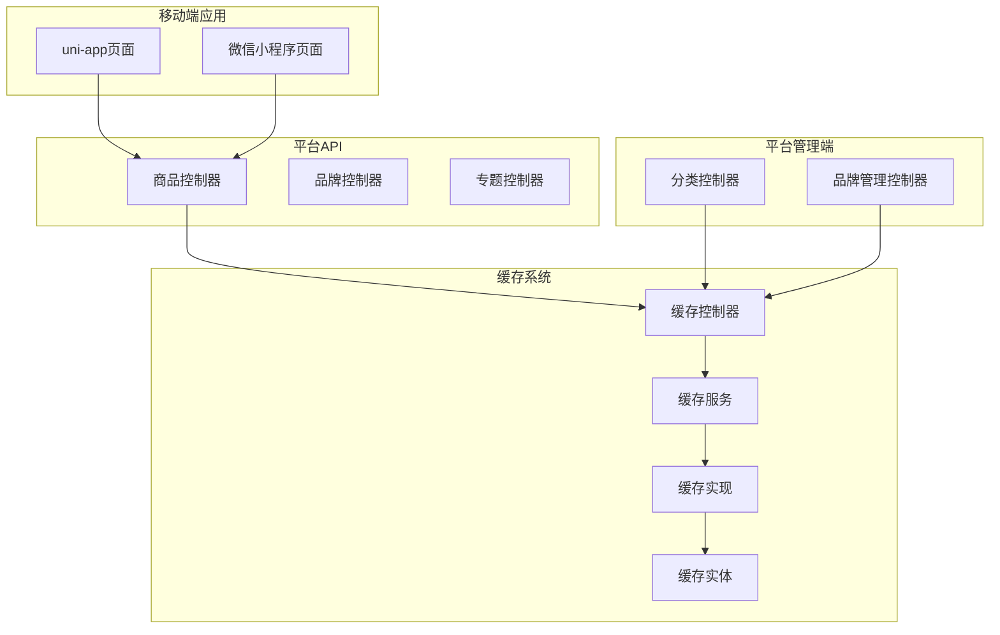
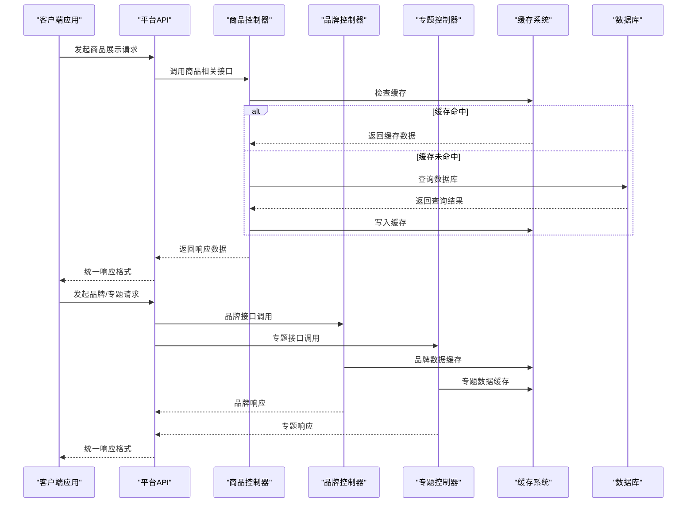
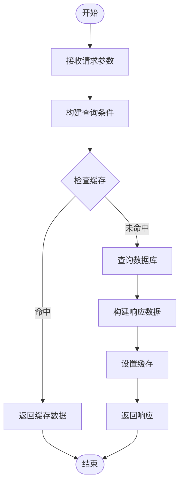
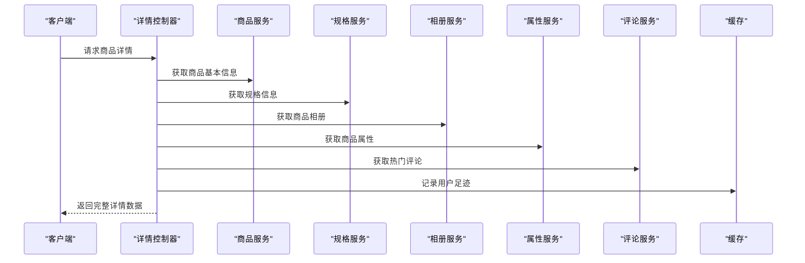
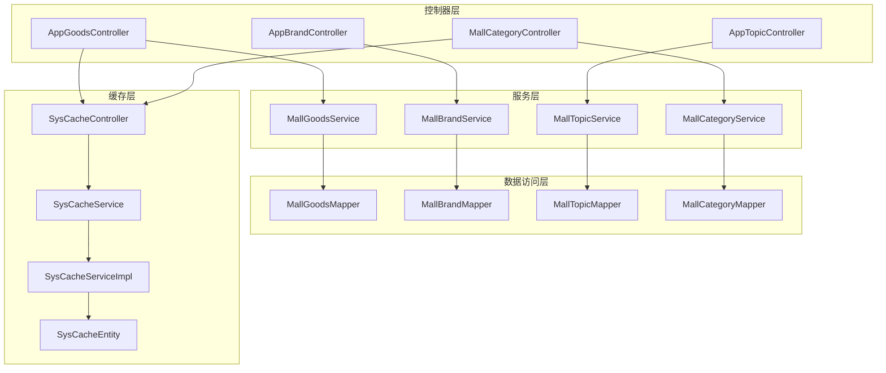

# 商品展示接口

<cite>
**本文档引用的文件**
- [AppGoodsController.java](file://platform-api/src/main/java/com/platform/modules/app/controller/AppGoodsController.java)
- [AppBrandController.java](file://platform-api/src/main/java/com/platform/modules/app/controller/AppBrandController.java)
- [AppTopicController.java](file://platform-api/src/main/java/com/platform/modules/app/controller/AppTopicController.java)
- [MallCategoryController.java](file://platform-admin/src/main/java/com/platform/modules/mall/controller/MallCategoryController.java)
- [MallBrandController.java](file://platform-admin/src/main/java/com/platform/modules/mall/controller/MallBrandController.java)
- [RestResponse.java](file://platform-common/src/main/java/com/platform/common/utils/RestResponse.java)
- [recommendGoods.js](file://uni-mall/skills/mall-guide-skill/apis/recommendGoods.js)
- [mcp.json](file://uni-mall/skills/mall-guide-skill/mcp.json)
- [hotGoods.js](file://wx-mall/pages/hotGoods/hotGoods.js)
- [newGoods.js](file://wx-mall/pages/newGoods/newGoods.js)
- [search.vue](file://uni-mall/pages/search/search.vue)
- [newGoods.vue](file://uni-mall/pages/newGoods/newGoods.vue)
- [SysCacheController.java](file://platform-admin/src/main/java/com/platform/modules/sys/controller/SysCacheController.java)
- [SysCacheService.java](file://platform-admin/src/main/java/com/platform/modules/sys/service/SysCacheService.java)
- [SysCacheServiceImpl.java](file://platform-admin/src/main/java/com/platform/modules/sys/service/impl/SysCacheServiceImpl.java)
- [SysCacheEntity.java](file://platform-admin/src/main/java/com/platform/modules/sys/entity/SysCacheEntity.java)
</cite>

## 目录
1. [简介](#简介)
2. [项目结构](#项目结构)
3. [核心组件](#核心组件)
4. [架构概览](#架构概览)
5. [详细组件分析](#详细组件分析)
6. [依赖分析](#依赖分析)
7. [性能考虑](#性能考虑)
8. [故障排除指南](#故障排除指南)
9. [结论](#结论)

## 简介
本文件为商品展示接口的技术文档，覆盖商品查询、分类浏览、品牌展示、专题页面等商品相关信息API。文档详细说明了各接口的HTTP方法、URL路径、查询参数、排序规则、分页机制以及响应数据结构；并阐述了商品数据缓存策略、图片处理、SEO优化和性能优化方案，提供完整的查询示例、参数组合和返回数据格式说明。

## 项目结构
该平台采用前后端分离架构，商品展示相关功能主要分布在以下模块：
- 平台API（后端）：提供商品、品牌、专题等REST接口
- 平台管理端（后端）：提供商品分类、品牌管理等后台接口
- 移动端（uni-app）：提供商品列表、搜索、推荐等功能页面
- 微信小程序：提供商品列表、新品、热销等页面
- 缓存管理：提供Redis缓存查询与清理能力



**图表来源**
- [AppGoodsController.java:1-619](file://platform-api/src/main/java/com/platform/modules/app/controller/AppGoodsController.java#L1-L619)
- [AppBrandController.java:1-74](file://platform-api/src/main/java/com/platform/modules/app/controller/AppBrandController.java#L1-L74)
- [AppTopicController.java:1-79](file://platform-api/src/main/java/com/platform/modules/app/controller/AppTopicController.java#L1-L79)
- [MallCategoryController.java:1-149](file://platform-admin/src/main/java/com/platform/modules/mall/controller/MallCategoryController.java#L1-L149)
- [SysCacheController.java:1-91](file://platform-admin/src/main/java/com/platform/modules/sys/controller/SysCacheController.java#L1-L91)

**章节来源**
- [AppGoodsController.java:1-619](file://platform-api/src/main/java/com/platform/modules/app/controller/AppGoodsController.java#L1-L619)
- [AppBrandController.java:1-74](file://platform-api/src/main/java/com/platform/modules/app/controller/AppBrandController.java#L1-L74)
- [AppTopicController.java:1-79](file://platform-api/src/main/java/com/platform/modules/app/controller/AppTopicController.java#L1-L79)
- [MallCategoryController.java:1-149](file://platform-admin/src/main/java/com/platform/modules/mall/controller/MallCategoryController.java#L1-L149)
- [SysCacheController.java:1-91](file://platform-admin/src/main/java/com/platform/modules/sys/controller/SysCacheController.java#L1-L91)

## 核心组件
本节概述商品展示相关的核心组件及其职责：
- 商品控制器：提供商品列表、详情、分类、筛选、推荐等接口
- 品牌控制器：提供品牌列表、详情接口
- 专题控制器：提供专题列表、详情、关联专题接口
- 分类控制器：提供商品分类的后台管理接口
- 缓存控制器：提供Redis缓存查询与清理接口

**章节来源**
- [AppGoodsController.java:1-619](file://platform-api/src/main/java/com/platform/modules/app/controller/AppGoodsController.java#L1-L619)
- [AppBrandController.java:1-74](file://platform-api/src/main/java/com/platform/modules/app/controller/AppBrandController.java#L1-L74)
- [AppTopicController.java:1-79](file://platform-api/src/main/java/com/platform/modules/app/controller/AppTopicController.java#L1-L79)
- [MallCategoryController.java:1-149](file://platform-admin/src/main/java/com/platform/modules/mall/controller/MallCategoryController.java#L1-L149)
- [SysCacheController.java:1-91](file://platform-admin/src/main/java/com/platform/modules/sys/controller/SysCacheController.java#L1-L91)

## 架构概览
商品展示接口的整体架构由前端应用调用平台API，平台API通过服务层访问数据库，同时利用缓存系统提升性能。



**图表来源**
- [AppGoodsController.java:296-404](file://platform-api/src/main/java/com/platform/modules/app/controller/AppGoodsController.java#L296-L404)
- [AppBrandController.java:39-57](file://platform-api/src/main/java/com/platform/modules/app/controller/AppBrandController.java#L39-L57)
- [AppTopicController.java:39-53](file://platform-api/src/main/java/com/platform/modules/app/controller/AppTopicController.java#L39-L53)
- [SysCacheController.java:53-74](file://platform-admin/src/main/java/com/platform/modules/sys/controller/SysCacheController.java#L53-L74)

## 详细组件分析

### 商品列表查询接口
商品列表查询是商品展示的核心接口，支持多种筛选条件和排序方式。

#### 接口定义
- HTTP方法：POST
- URL路径：/app/goods/list
- 权限要求：无需登录（匿名访问）

#### 请求参数
| 参数名 | 类型 | 必填 | 默认值 | 说明 |
|--------|------|------|--------|------|
| categoryId | Integer | 否 | 无 | 分类ID，0表示全部分类 |
| brandId | Integer | 否 | 无 | 品牌ID |
| keyword | String | 否 | 无 | 关键词搜索 |
| isNew | Integer | 否 | 无 | 是否新品（1=是） |
| isHot | Integer | 否 | 无 | 是否热销（1=是） |
| page | Integer | 否 | 1 | 页码 |
| size | Integer | 否 | 10 | 每页数量 |
| sort | String | 否 | 无 | 排序字段（price=价格, sell=销量） |
| order | String | 否 | 无 | 排序方向（asc=升序, desc=降序） |

#### 排序规则
- 默认按创建时间倒序排列
- 当sort为"price"时，按零售价排序
- 当sort为"sell"时，按销量排序

#### 分页机制
- 使用MyBatis-Plus分页插件
- 返回Page对象，包含records、total、current等字段

#### 响应数据结构
```json
{
  "success": true,
  "code": 0,
  "msg": "操作成功",
  "data": {
    "filterCategory": [
      {
        "id": 0,
        "name": "全部",
        "checked": true
      }
    ],
    "goodsList": {
      "records": [
        {
          "id": 1,
          "name": "商品名称",
          "listPicUrl": "https://example.com/image.jpg",
          "marketPrice": 100.00,
          "retailPrice": 80.00,
          "goodsBrief": "商品描述"
        }
      ],
      "total": 100,
      "current": 1
    }
  },
  "timestamp": 1691453288
}
```

#### 查询流程


**图表来源**
- [AppGoodsController.java:296-404](file://platform-api/src/main/java/com/platform/modules/app/controller/AppGoodsController.java#L296-L404)

**章节来源**
- [AppGoodsController.java:296-404](file://platform-api/src/main/java/com/platform/modules/app/controller/AppGoodsController.java#L296-L404)

### 商品详情获取接口
商品详情接口提供商品的完整信息，包括规格、相册、属性、评论等。

#### 接口定义
- HTTP方法：POST
- URL路径：/app/goods/detail
- 权限要求：需要登录

#### 请求参数
| 参数名 | 类型 | 必填 | 默认值 | 说明 |
|--------|------|------|--------|------|
| id | Integer | 是 | 无 | 商品ID |
| referrer | Long | 否 | 无 | 推荐人ID |

#### 响应数据结构
```json
{
  "success": true,
  "code": 0,
  "msg": "操作成功",
  "data": {
    "info": {
      "id": 1,
      "name": "商品名称",
      "listPicUrl": "https://example.com/image.jpg",
      "retailPrice": 80.00,
      "goodsDesc": "商品详情描述"
    },
    "gallery": [
      {"id": 1, "imageUrl": "https://example.com/gallery1.jpg"}
    ],
    "attribute": [
      {"name": "颜色", "value": "红色"}
    ],
    "userHasCollect": 1,
    "issue": [
      {"question": "常见问题", "answer": "解答内容"}
    ],
    "comment": {
      "count": 10,
      "data": {
        "content": "用户评价内容",
        "addTime": "2023-01-01",
        "nickname": "用户名",
        "avatar": "头像地址",
        "picList": []
      }
    },
    "brand": {
      "id": 1,
      "name": "品牌名称"
    },
    "specificationList": [
      {
        "specificationId": 1,
        "name": "规格名称",
        "valueList": [
          {"id": 1, "specificationId": 1, "value": "规格值"}
        ]
      }
    ],
    "productList": [
      {
        "id": 1,
        "goodsId": 1,
        "goodsSn": "SN001",
        "retailPrice": 80.00,
        "number": 100
      }
    ]
  }
}
```

#### 数据处理流程


**图表来源**
- [AppGoodsController.java:110-267](file://platform-api/src/main/java/com/platform/modules/app/controller/AppGoodsController.java#L110-L267)

**章节来源**
- [AppGoodsController.java:110-267](file://platform-api/src/main/java/com/platform/modules/app/controller/AppGoodsController.java#L110-L267)

### 分类筛选接口
分类筛选接口提供商品列表的分类筛选功能。

#### 接口定义
- HTTP方法：POST
- URL路径：/app/goods/filter
- 权限要求：无需登录

#### 请求参数
| 参数名 | 类型 | 必填 | 默认值 | 说明 |
|--------|------|------|--------|------|
| categoryId | Integer | 否 | 无 | 分类ID |
| keyword | String | 否 | 无 | 关键词 |
| isNew | Integer | 否 | 无 | 是否新品 |
| isHot | Integer | 否 | 无 | 是否热销 |

#### 响应数据结构
返回筛选后的分类列表，包含一级和二级分类信息。

**章节来源**
- [AppGoodsController.java:412-460](file://platform-api/src/main/java/com/platform/modules/app/controller/AppGoodsController.java#L412-L460)

### 品牌展示接口
品牌展示接口提供品牌列表和品牌详情功能。

#### 品牌列表接口
- HTTP方法：POST
- URL路径：/app/brand/list
- 权限要求：无需登录

##### 请求参数
| 参数名 | 类型 | 必填 | 默认值 | 说明 |
|--------|------|------|--------|------|
| page | Integer | 否 | 1 | 页码 |
| size | Integer | 否 | 10 | 每页数量 |

##### 响应数据结构
返回分页的品牌列表，包含品牌的基本信息。

#### 品牌详情接口
- HTTP方法：POST
- URL路径：/app/brand/detail
- 权限要求：无需登录

##### 请求参数
| 参数名 | 类型 | 必填 | 默认值 | 说明 |
|--------|------|------|--------|------|
| id | Integer | 是 | 无 | 品牌ID |

##### 响应数据结构
返回指定品牌的详细信息。

**章节来源**
- [AppBrandController.java:39-72](file://platform-api/src/main/java/com/platform/modules/app/controller/AppBrandController.java#L39-L72)

### 专题页面接口
专题页面接口提供专题列表、详情和关联专题功能。

#### 专题列表接口
- HTTP方法：POST
- URL路径：/app/topic/list
- 权限要求：无需登录

##### 请求参数
| 参数名 | 类型 | 必填 | 默认值 | 说明 |
|--------|------|------|--------|------|
| page | Integer | 是 | 无 | 页码 |
| size | Integer | 是 | 无 | 每页数量 |

##### 响应数据结构
返回分页的专题列表，包含标题、价格信息、场景图片等。

#### 专题详情接口
- HTTP方法：POST
- URL路径：/app/topic/detail
- 权限要求：无需登录

##### 请求参数
| 参数名 | 类型 | 必填 | 默认值 | 说明 |
|--------|------|------|--------|------|
| id | Integer | 是 | 无 | 专题ID |

##### 响应数据结构
返回指定专题的详细信息。

#### 关联专题接口
- HTTP方法：POST
- URL路径：/app/topic/related
- 权限要求：无需登录

##### 响应数据结构
返回关联的专题列表，最多4个。

**章节来源**
- [AppTopicController.java:39-77](file://platform-api/src/main/java/com/platform/modules/app/controller/AppTopicController.java#L39-L77)

### 热门推荐接口
热门推荐接口提供基于用户偏好的商品推荐功能。

#### 推荐接口（uni-app）
- 文件路径：uni-mall/skills/mall-guide-skill/apis/recommendGoods.js
- 功能：根据类型（热销/新品）推荐商品

##### 输入参数
| 参数名 | 类型 | 必填 | 默认值 | 说明 |
|--------|------|------|--------|------|
| type | String | 否 | isHot | 推荐类型（isHot/isNew） |
| categoryId | Integer | 否 | 0 | 分类ID |
| page | Integer | 否 | 1 | 页码 |
| size | Integer | 否 | 6 | 每页数量 |

##### 输出数据结构
```json
{
  "goodsList": [
    {
      "id": 1,
      "name": "商品名称",
      "goodsBrief": "商品描述",
      "retailPrice": 80.00,
      "sales": 100
    }
  ],
  "total": 100,
  "pages": 17,
  "type": "isHot"
}
```

**章节来源**
- [recommendGoods.js:1-50](file://uni-mall/skills/mall-guide-skill/apis/recommendGoods.js#L1-L50)
- [mcp.json:1-48](file://uni-mall/skills/mall-guide-skill/mcp.json#L1-L48)

## 依赖分析
商品展示接口的依赖关系如下：



**图表来源**
- [AppGoodsController.java:34-68](file://platform-api/src/main/java/com/platform/modules/app/controller/AppGoodsController.java#L34-L68)
- [AppBrandController.java:31-32](file://platform-api/src/main/java/com/platform/modules/app/controller/AppBrandController.java#L31-L32)
- [AppTopicController.java:31-32](file://platform-api/src/main/java/com/platform/modules/app/controller/AppTopicController.java#L31-L32)
- [SysCacheController.java:44-45](file://platform-admin/src/main/java/com/platform/modules/sys/controller/SysCacheController.java#L44-L45)

**章节来源**
- [AppGoodsController.java:1-619](file://platform-api/src/main/java/com/platform/modules/app/controller/AppGoodsController.java#L1-L619)
- [AppBrandController.java:1-74](file://platform-api/src/main/java/com/platform/modules/app/controller/AppBrandController.java#L1-L74)
- [AppTopicController.java:1-79](file://platform-api/src/main/java/com/platform/modules/app/controller/AppTopicController.java#L1-L79)
- [SysCacheController.java:1-91](file://platform-admin/src/main/java/com/platform/modules/sys/controller/SysCacheController.java#L1-L91)

## 性能考虑
基于现有代码分析，商品展示接口的性能优化方案如下：

### 缓存策略
1. **多级缓存架构**
   - 应用层缓存：使用Redis存储热点数据
   - 页面级缓存：对商品列表、品牌、专题等静态数据进行缓存
   - 数据级缓存：对频繁访问的商品详情进行缓存

2. **缓存失效策略**
   - 设置合理的TTL（默认24小时）
   - 数据更新时主动失效相关缓存
   - 支持手动清理缓存

3. **缓存预热**
   - 系统启动时预热热点商品数据
   - 定时任务更新热门商品缓存

### 图片处理
1. **CDN加速**
   - 商品图片统一通过CDN分发
   - 支持多种图片格式和尺寸

2. **懒加载**
   - 列表页使用懒加载减少首屏压力
   - 支持占位符和渐进式加载

### SEO优化
1. **页面元数据**
   - 商品详情页动态生成title、description
   - 支持Open Graph标签

2. **结构化数据**
   - 商品信息以JSON-LD格式提供
   - 支持Schema.org标准

### 性能监控
1. **接口响应时间监控**
   - 记录关键接口的响应时间
   - 异常响应时间告警

2. **缓存命中率统计**
   - 监控Redis缓存命中率
   - 分析缓存效果

## 故障排除指南
针对商品展示接口可能出现的问题提供排查指导：

### 常见问题及解决方案

#### 缓存相关问题
1. **缓存数据不一致**
   - 检查缓存失效策略配置
   - 验证数据更新时的缓存清理逻辑

2. **缓存穿透**
   - 对空结果设置短时缓存
   - 实施布隆过滤器

3. **缓存雪崩**
   - 为缓存设置随机TTL
   - 实施缓存降级策略

#### 数据查询问题
1. **查询性能慢**
   - 检查数据库索引配置
   - 优化复杂查询语句

2. **分页数据异常**
   - 验证分页参数边界
   - 检查总数计算逻辑

#### 响应格式问题
1. **统一响应格式异常**
   - 检查RestResponse序列化配置
   - 验证响应数据结构

**章节来源**
- [SysCacheController.java:53-74](file://platform-admin/src/main/java/com/platform/modules/sys/controller/SysCacheController.java#L53-L74)
- [SysCacheService.java:31-48](file://platform-admin/src/main/java/com/platform/modules/sys/service/SysCacheService.java#L31-L48)
- [SysCacheServiceImpl.java:44-76](file://platform-admin/src/main/java/com/platform/modules/sys/service/impl/SysCacheServiceImpl.java#L44-L76)
- [RestResponse.java:34-122](file://platform-common/src/main/java/com/platform/common/utils/RestResponse.java#L34-L122)

## 结论
本商品展示接口文档全面覆盖了商品查询、分类浏览、品牌展示、专题页面等核心功能。通过合理的缓存策略、性能优化方案和故障排除机制，能够有效提升用户体验和系统稳定性。建议在实际部署中结合业务特点进一步优化缓存策略和性能指标。