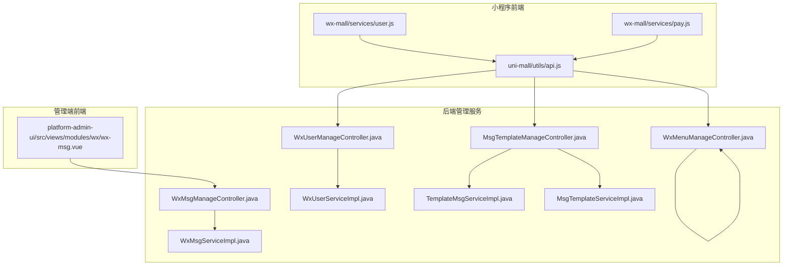
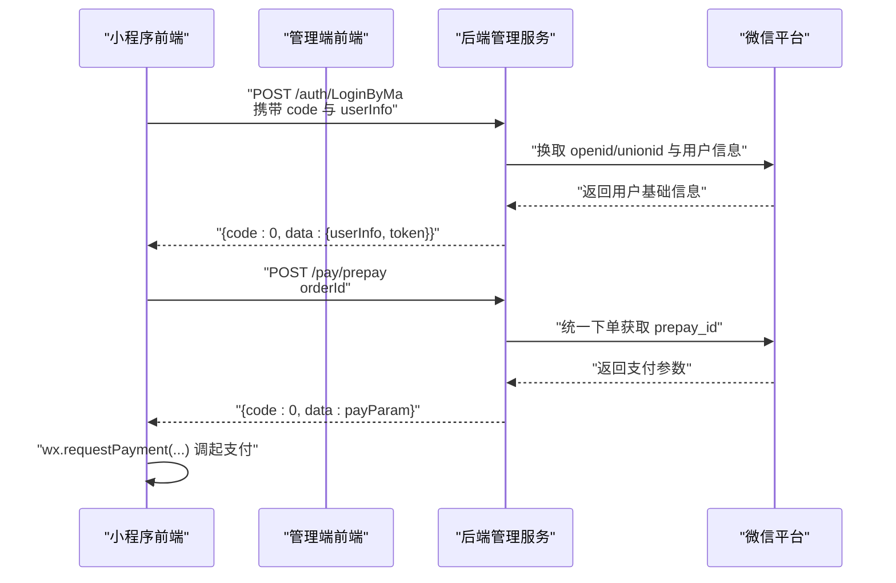
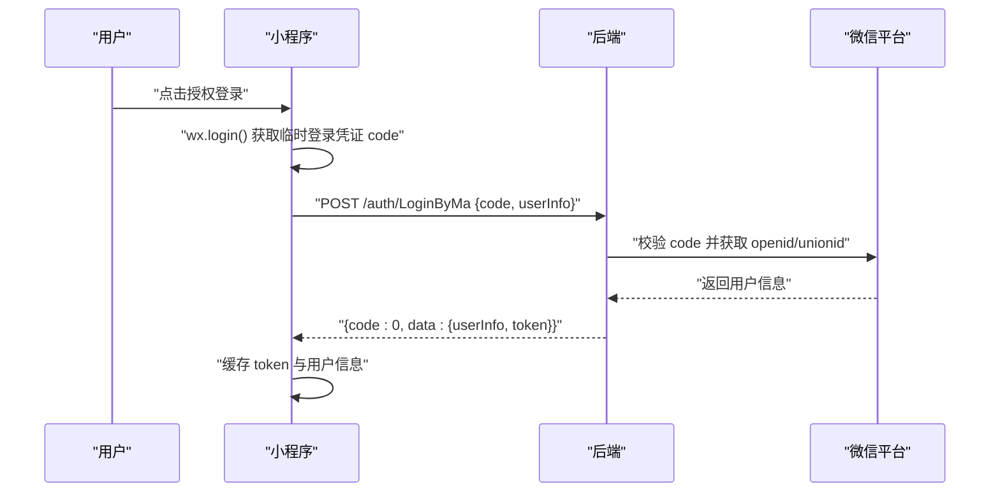
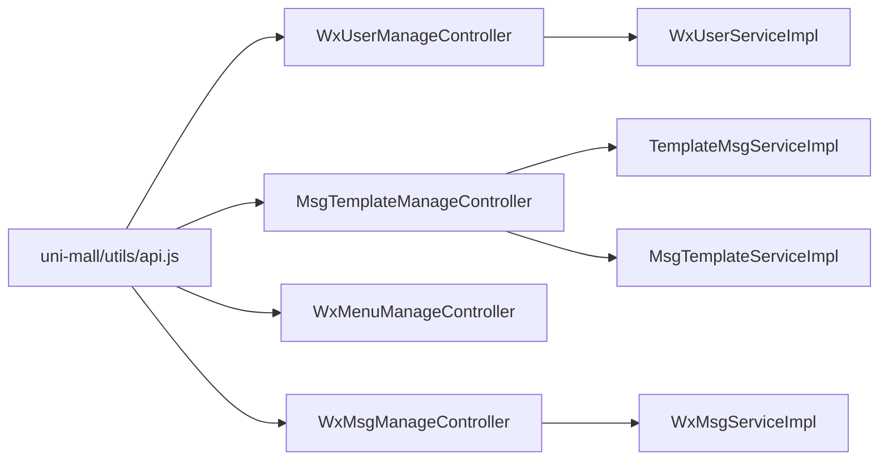

# 微信集成接口

<cite>
**本文引用的文件**
- [WxUserManageController.java](file://platform-admin/src/main/java/com/platform/modules/wx/controller/WxUserManageController.java)
- [MsgTemplateManageController.java](file://platform-admin/src/main/java/com/platform/modules/wx/controller/MsgTemplateManageController.java)
- [WxMenuManageController.java](file://platform-admin/src/main/java/com/platform/modules/wx/controller/WxMenuManageController.java)
- [WxMsgManageController.java](file://platform-admin/src/main/java/com/platform/modules/wx/controller/WxMsgManageController.java)
- [WxUserServiceImpl.java](file://platform-biz/src/main/java/com/platform/modules/wx/service/impl/WxUserServiceImpl.java)
- [TemplateMsgServiceImpl.java](file://platform-biz/src/main/java/com/platform/modules/wx/service/impl/TemplateMsgServiceImpl.java)
- [MsgTemplateServiceImpl.java](file://platform-biz/src/main/java/com/platform/modules/wx/service/impl/MsgTemplateServiceImpl.java)
- [WxMsgServiceImpl.java](file://platform-biz/src/main/java/com/platform/modules/wx/service/impl/WxMsgServiceImpl.java)
- [api.js](file://uni-mall/utils/api.js)
- [user.js](file://wx-mall/services/user.js)
- [pay.js](file://wx-mall/services/pay.js)
- [wx-msg.vue](file://platform-admin-ui/src/views/modules/wx/wx-msg.vue)
</cite>

## 目录
1. [简介](#简介)
2. [项目结构](#项目结构)
3. [核心组件](#核心组件)
4. [架构总览](#架构总览)
5. [详细组件分析](#详细组件分析)
6. [依赖分析](#依赖分析)
7. [性能考虑](#性能考虑)
8. [故障排除指南](#故障排除指南)
9. [结论](#结论)
10. [附录](#附录)

## 简介
本文件面向微信小程序与微信公众号的集成场景，系统性梳理后端接口、业务逻辑与前端调用方式，覆盖微信授权登录、微信支付、模板消息、用户信息获取、微信消息管理与菜单管理等能力。文档同时给出 OAuth2.0 授权流程要点、支付回调处理建议、消息推送机制以及平台适配策略，并提供完整集成示例与注意事项。

## 项目结构
围绕微信能力的关键模块分布如下：
- 后端管理端（Spring Boot）：微信公众号用户、模板消息、消息管理、菜单管理等控制器与服务实现
- 小程序前端（uni-app/微信小程序）：用户登录、支付下单与支付调起
- 管理后台前端（Vue）：消息列表、回复、模板管理、菜单管理等可视化操作

图表来源
- [user.js:1-74](file://wx-mall/services/user.js#L1-L74)
- [pay.js:1-44](file://wx-mall/services/pay.js#L1-L44)
- [api.js:1-81](file://uni-mall/utils/api.js#L1-L81)
- [wx-msg.vue:1-188](file://platform-admin-ui/src/views/modules/wx/wx-msg.vue#L1-L188)
- [WxUserManageController.java:1-82](file://platform-admin/src/main/java/com/platform/modules/wx/controller/WxUserManageController.java#L1-L82)
- [MsgTemplateManageController.java:1-178](file://platform-admin/src/main/java/com/platform/modules/wx/controller/MsgTemplateManageController.java#L1-L178)
- [WxMenuManageController.java:1-91](file://platform-admin/src/main/java/com/platform/modules/wx/controller/WxMenuManageController.java#L1-L91)
- [WxMsgManageController.java:1-101](file://platform-admin/src/main/java/com/platform/modules/wx/controller/WxMsgManageController.java#L1-L101)
- [WxUserServiceImpl.java:1-220](file://platform-biz/src/main/java/com/platform/modules/wx/service/impl/WxUserServiceImpl.java#L1-L220)
- [TemplateMsgServiceImpl.java:1-102](file://platform-biz/src/main/java/com/platform/modules/wx/service/impl/TemplateMsgServiceImpl.java#L1-L102)
- [MsgTemplateServiceImpl.java:1-78](file://platform-biz/src/main/java/com/platform/modules/wx/service/impl/MsgTemplateServiceImpl.java#L1-L78)
- [WxMsgServiceImpl.java:1-69](file://platform-biz/src/main/java/com/platform/modules/wx/service/impl/WxMsgServiceImpl.java#L1-L69)

章节来源
- [WxUserManageController.java:1-82](file://platform-admin/src/main/java/com/platform/modules/wx/controller/WxUserManageController.java#L1-L82)
- [MsgTemplateManageController.java:1-178](file://platform-admin/src/main/java/com/platform/modules/wx/controller/MsgTemplateManageController.java#L1-L178)
- [WxMenuManageController.java:1-91](file://platform-admin/src/main/java/com/platform/modules/wx/controller/WxMenuManageController.java#L1-L91)
- [WxMsgManageController.java:1-101](file://platform-admin/src/main/java/com/platform/modules/wx/controller/WxMsgManageController.java#L1-L101)
- [WxUserServiceImpl.java:1-220](file://platform-biz/src/main/java/com/platform/modules/wx/service/impl/WxUserServiceImpl.java#L1-L220)
- [TemplateMsgServiceImpl.java:1-102](file://platform-biz/src/main/java/com/platform/modules/wx/service/impl/TemplateMsgServiceImpl.java#L1-L102)
- [MsgTemplateServiceImpl.java:1-78](file://platform-biz/src/main/java/com/platform/modules/wx/service/impl/MsgTemplateServiceImpl.java#L1-L78)
- [WxMsgServiceImpl.java:1-69](file://platform-biz/src/main/java/com/platform/modules/wx/service/impl/WxMsgServiceImpl.java#L1-L69)
- [api.js:1-81](file://uni-mall/utils/api.js#L1-L81)
- [user.js:1-74](file://wx-mall/services/user.js#L1-L74)
- [pay.js:1-44](file://wx-mall/services/pay.js#L1-L44)
- [wx-msg.vue:1-188](file://platform-admin-ui/src/views/modules/wx/wx-msg.vue#L1-L188)

## 核心组件
- 公众号用户管理：分页查询、按 openid 列表查询、详情查询、异步刷新用户信息、全量同步粉丝
- 模板消息：分页查询、按名称查询、新增/修改/删除、同步公众号模板、批量发送模板消息
- 公众号菜单：获取菜单、创建/更新菜单、网络检测
- 微信消息：分页查询、回复、删除；消息入库异步化
- 小程序登录：换取登录凭证 code 并提交 userInfo，后端校验与落库，返回用户态与令牌
- 小程序支付：统一下单获取 prepay_id，调起微信支付

章节来源
- [WxUserManageController.java:47-80](file://platform-admin/src/main/java/com/platform/modules/wx/controller/WxUserManageController.java#L47-L80)
- [MsgTemplateManageController:59-176](file://platform-admin/src/main/java/com/platform/modules/wx/controller/MsgTemplateManageController.java#L59-L176)
- [WxMenuManageController:52-89](file://platform-admin/src/main/java/com/platform/modules/wx/controller/WxMenuManageController.java#L52-L89)
- [WxMsgManageController:54-86](file://platform-admin/src/main/java/com/platform/modules/wx/controller/WxMsgManageController.java#L54-L86)
- [WxUserServiceImpl:62-180](file://platform-biz/src/main/java/com/platform/modules/wx/service/impl/WxUserServiceImpl.java#L62-L180)
- [TemplateMsgServiceImpl:55-100](file://platform-biz/src/main/java/com/platform/modules/wx/service/impl/TemplateMsgServiceImpl.java#L55-L100)
- [MsgTemplateServiceImpl:48-76](file://platform-biz/src/main/java/com/platform/modules/wx/service/impl/MsgTemplateServiceImpl.java#L48-L76)
- [WxMsgServiceImpl:42-67](file://platform-biz/src/main/java/com/platform/modules/wx/service/impl/WxMsgServiceImpl.java#L42-L67)
- [api.js:13-79](file://uni-mall/utils/api.js#L13-L79)
- [user.js:11-38](file://wx-mall/services/user.js#L11-L38)
- [pay.js:11-39](file://wx-mall/services/pay.js#L11-L39)

## 架构总览
整体交互分为三段：小程序前端发起请求、后端管理服务处理业务、微信平台（公众号/小程序）提供能力。

图表来源
- [user.js:11-38](file://wx-mall/services/user.js#L11-L38)
- [pay.js:11-39](file://wx-mall/services/pay.js#L11-L39)
- [api.js:13-79](file://uni-mall/utils/api.js#L13-L79)

## 详细组件分析

### 授权登录（小程序）
- 接口定义
  - 方法：POST
  - 路径：/auth/LoginByMa
  - 请求体字段：code（登录凭证）、userInfo（用户公开信息）
  - 响应：code=0 表示成功，返回 userInfo 与 token
- 流程说明
  - 小程序端调用 wx.login 获取 code，随后携带 code 与 userInfo 调用后端
  - 后端通过微信平台校验 code 并获取 openid/unionid 与用户信息
  - 成功后写入用户态并下发 token，后续接口鉴权基于该 token
- 注意事项
  - 必须在后端完成 code 校验与用户信息落库
  - unionid 用于跨平台唯一标识，避免重复数据
  - 前端仅保存 token 与用户信息，不持久化敏感凭证

章节来源
- [api.js:13](file://uni-mall/utils/api.js#L13)
- [user.js:11-38](file://wx-mall/services/user.js#L11-L38)

### 微信支付（小程序）
- 接口定义
  - 方法：POST
  - 路径：/pay/prepay
  - 请求体字段：orderId
  - 响应：code=0 返回支付参数（含 prepay_id），前端据此调起支付
- 流程说明
  - 小程序端提交订单号获取 prepay_id
  - 后端统一下单并返回支付参数
  - 小程序端调用 wx.requestPayment 完成支付
- 注意事项
  - 支付参数签名与字段必须严格匹配
  - 支付完成后需在后端校验订单状态并更新业务状态

章节来源
- [api.js:36](file://uni-mall/utils/api.js#L36)
- [pay.js:11-39](file://wx-mall/services/pay.js#L11-L39)

### 模板消息（公众号）
- 接口定义
  - 分页查询模板：GET /manage/msgTemplate/list
  - 按名称查询模板：GET /manage/msgTemplate/getByName
  - 新增/修改/删除模板：POST /manage/msgTemplate/save, /update, /delete
  - 同步公众号模板：POST /manage/msgTemplate/syncWxTemplate
  - 批量发送模板消息：POST /manage/msgTemplate/sendMsgBatch
- 处理逻辑
  - 同步模板：清空本地模板表，从微信平台拉取私有模板并入库
  - 批量发送：按条件分页查询用户，逐个构建模板消息并异步发送
- 注意事项
  - 模板 ID 与内容变量需与微信平台一致
  - 批量发送采用分页与线程池并发，注意限流与幂等

章节来源
- [MsgTemplateManageController:59-176](file://platform-admin/src/main/java/com/platform/modules/wx/controller/MsgTemplateManageController.java#L59-L176)
- [MsgTemplateServiceImpl:70-76](file://platform-biz/src/main/java/com/platform/modules/wx/service/impl/MsgTemplateServiceImpl.java#L70-L76)
- [TemplateMsgServiceImpl:72-100](file://platform-biz/src/main/java/com/platform/modules/wx/service/impl/TemplateMsgServiceImpl.java#L72-L100)

### 用户信息获取（公众号）
- 接口定义
  - 分页查询用户：GET /manage/wxUser/list
  - 按 openid 列表查询：POST /manage/wxUser/listByIds
  - 查询单个用户：GET /manage/wxUser/info/{openid}
- 处理逻辑
  - 支持按 openid、昵称、城市、标签、二维码场景等条件过滤
  - 提供异步刷新用户信息与全量同步粉丝能力
- 注意事项
  - unionid 优先更新，避免重复数据
  - 同步任务加锁，避免并发重复执行

章节来源
- [WxUserManageController:50-80](file://platform-admin/src/main/java/com/platform/modules/wx/controller/WxUserManageController.java#L50-L80)
- [WxUserServiceImpl:62-180](file://platform-biz/src/main/java/com/platform/modules/wx/service/impl/WxUserServiceImpl.java#L62-L180)

### 微信消息管理（公众号）
- 接口定义
  - 分页查询消息：GET /manage/wxMsg/list
  - 查询单条消息：GET /manage/wxMsg/info/{id}
  - 回复消息：POST /manage/wxMsg/reply
  - 删除消息：POST /manage/wxMsg/delete
- 处理逻辑
  - 消息入库异步化，支持按消息类型、时间范围、openid 过滤
  - 管理端可对 24 小时内的消息进行回复
- 注意事项
  - 回复接口仅限 24 小时内有效
  - 消息预览组件用于渲染不同类型的消息内容

章节来源
- [WxMsgManageController:54-86](file://platform-admin/src/main/java/com/platform/modules/wx/controller/WxMsgManageController.java#L54-L86)
- [WxMsgServiceImpl:42-67](file://platform-biz/src/main/java/com/platform/modules/wx/service/impl/WxMsgServiceImpl.java#L42-L67)
- [wx-msg.vue:84-156](file://platform-admin-ui/src/views/modules/wx/wx-msg.vue#L84-L156)

### 公众号菜单管理
- 接口定义
  - 获取菜单：GET /manage/wxMenu/getMenu
  - 更新菜单：POST /manage/wxMenu/updateMenu
  - 网络检测：GET /manage/wxMenu/netCheck
- 处理逻辑
  - 通过 WxJava SDK 与微信平台交互
  - 支持 DNS/Ping 检测，辅助排查回调连接问题
- 注意事项
  - 菜单创建需遵循微信规范，按钮数量与层级限制

章节来源
- [WxMenuManageController:52-89](file://platform-admin/src/main/java/com/platform/modules/wx/controller/WxMenuManageController.java#L52-L89)

### OAuth2.0 授权流程（小程序）

图表来源
- [user.js:11-38](file://wx-mall/services/user.js#L11-L38)
- [api.js:13](file://uni-mall/utils/api.js#L13)

### 支付回调处理（建议）
- 建议流程
  - 小程序端调起支付后，监听 complete/fail 回调
  - 后端统一下单后记录订单状态为“待支付”
  - 微信支付结果通知由微信平台异步推送至后端回调地址
  - 后端验证签名与金额，更新订单状态并记录流水
- 注意事项
  - 回调地址需在微信商户平台配置
  - 对同一订单号的回调需做幂等处理

章节来源
- [pay.js:18-33](file://wx-mall/services/pay.js#L18-L33)
- [api.js:36](file://uni-mall/utils/api.js#L36)

### 消息推送机制（公众号）
- 消息入库
  - 后端接收来自微信平台的消息推送，异步入库
  - 支持文本、图片、语音、视频、图文、音乐、地理位置、链接等消息类型
- 消息回复
  - 管理端可在 24 小时内对消息进行回复
  - 支持客服接口或模板消息两种回复方式（视业务而定）

章节来源
- [WxMsgServiceImpl:63-67](file://platform-biz/src/main/java/com/platform/modules/wx/service/impl/WxMsgServiceImpl.java#L63-L67)
- [wx-msg.vue:132-135](file://platform-admin-ui/src/views/modules/wx/wx-msg.vue#L132-L135)

### 平台适配策略
- 小程序端
  - 使用 wx.login 获取 code，结合 userInfo 提交后端
  - 支付参数严格与后端返回一致，避免签名错误
- 管理端
  - 使用 WxJava SDK 与微信平台交互，确保菜单、模板消息、用户信息等接口稳定
  - 对高频操作（批量发送模板消息、同步用户）采用分页与线程池优化

章节来源
- [user.js:11-38](file://wx-mall/services/user.js#L11-L38)
- [pay.js:11-39](file://wx-mall/services/pay.js#L11-L39)
- [TemplateMsgServiceImpl:72-100](file://platform-biz/src/main/java/com/platform/modules/wx/service/impl/TemplateMsgServiceImpl.java#L72-L100)
- [WxUserServiceImpl:152-180](file://platform-biz/src/main/java/com/platform/modules/wx/service/impl/WxUserServiceImpl.java#L152-L180)

## 依赖分析
- 控制器与服务层
  - 控制器负责参数接收、鉴权与返回封装
  - 服务层封装与微信平台交互的具体逻辑，包括异步任务与批量处理
- 前后端交互
  - 小程序前端通过统一 API 文件调用后端接口
  - 管理端前端通过 Vue 组件与后端控制器交互

图表来源
- [api.js:13-79](file://uni-mall/utils/api.js#L13-L79)
- [WxUserManageController.java:44-80](file://platform-admin/src/main/java/com/platform/modules/wx/controller/WxUserManageController.java#L44-L80)
- [MsgTemplateManageController.java:48-176](file://platform-admin/src/main/java/com/platform/modules/wx/controller/MsgTemplateManageController.java#L48-L176)
- [WxMenuManageController.java:46-89](file://platform-admin/src/main/java/com/platform/modules/wx/controller/WxMenuManageController.java#L46-L89)
- [WxMsgManageController.java:47-86](file://platform-admin/src/main/java/com/platform/modules/wx/controller/WxMsgManageController.java#L47-L86)
- [WxUserServiceImpl.java:54-180](file://platform-biz/src/main/java/com/platform/modules/wx/service/impl/WxUserServiceImpl.java#L54-L180)
- [TemplateMsgServiceImpl.java:46-100](file://platform-biz/src/main/java/com/platform/modules/wx/service/impl/TemplateMsgServiceImpl.java#L46-L100)
- [MsgTemplateServiceImpl.java:45-76](file://platform-biz/src/main/java/com/platform/modules/wx/service/impl/MsgTemplateServiceImpl.java#L45-L76)
- [WxMsgServiceImpl.java:39-67](file://platform-biz/src/main/java/com/platform/modules/wx/service/impl/WxMsgServiceImpl.java#L39-L67)

## 性能考虑
- 异步与分页
  - 用户信息刷新与粉丝同步采用异步与分批处理，避免阻塞主线程
  - 模板消息批量发送按页查询用户，降低内存占用
- 并发控制
  - 同步任务加锁，防止重复执行
  - 线程池并发发送模板消息，提升吞吐
- 缓存与鉴权
  - 登录态与用户信息在前端短期缓存，减少重复请求
  - 后端对高并发接口进行限流与幂等校验

## 故障排除指南
- 授权登录失败
  - 检查 code 是否过期、是否正确提交 userInfo
  - 核对后端与微信平台的 appid/secret 配置
- 支付失败
  - 核对支付参数签名与字段一致性
  - 检查商户平台回调地址与证书配置
- 模板消息发送异常
  - 确认模板 ID 与变量名一致
  - 查看发送日志与微信返回错误码
- 粉丝同步卡住
  - 检查同步任务是否正在运行
  - 关注分页游标与微信接口频率限制

章节来源
- [WxUserServiceImpl.java:152-180](file://platform-biz/src/main/java/com/platform/modules/wx/service/impl/WxUserServiceImpl.java#L152-L180)
- [TemplateMsgServiceImpl.java:55-70](file://platform-biz/src/main/java/com/platform/modules/wx/service/impl/TemplateMsgServiceImpl.java#L55-L70)
- [MsgTemplateServiceImpl.java:70-76](file://platform-biz/src/main/java/com/platform/modules/wx/service/impl/MsgTemplateServiceImpl.java#L70-L76)

## 结论
本项目提供了从小程序登录、支付到公众号用户与消息管理的完整能力闭环。通过清晰的接口划分与异步化处理，兼顾了易用性与性能。建议在生产环境中完善回调校验、限流与监控告警，并持续维护模板消息与菜单的合规性。

## 附录
- 接口清单（示例）
  - 小程序登录：POST /auth/LoginByMa
  - 统一下单：POST /pay/prepay
  - 模板消息：GET/POST /manage/msgTemplate/*
  - 用户管理：GET/POST /manage/wxUser/*
  - 消息管理：GET/POST /manage/wxMsg/*
  - 菜单管理：GET/POST /manage/wxMenu/*