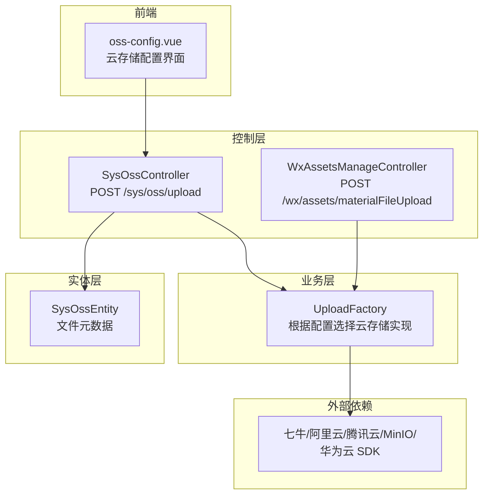
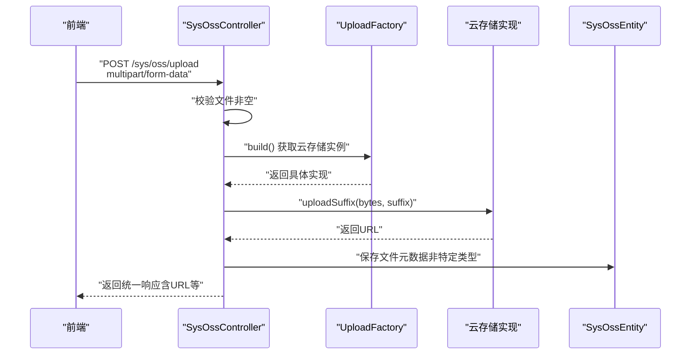
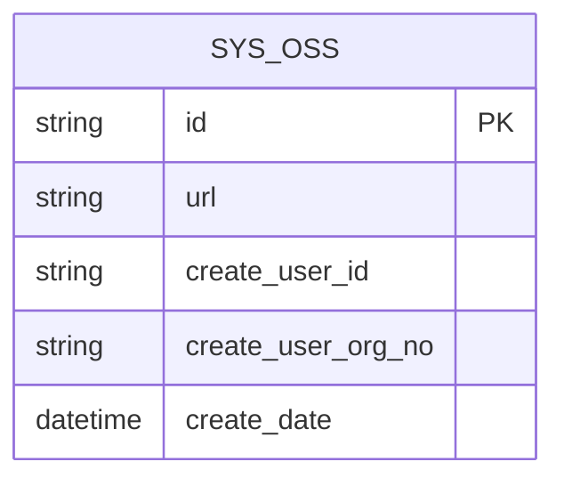
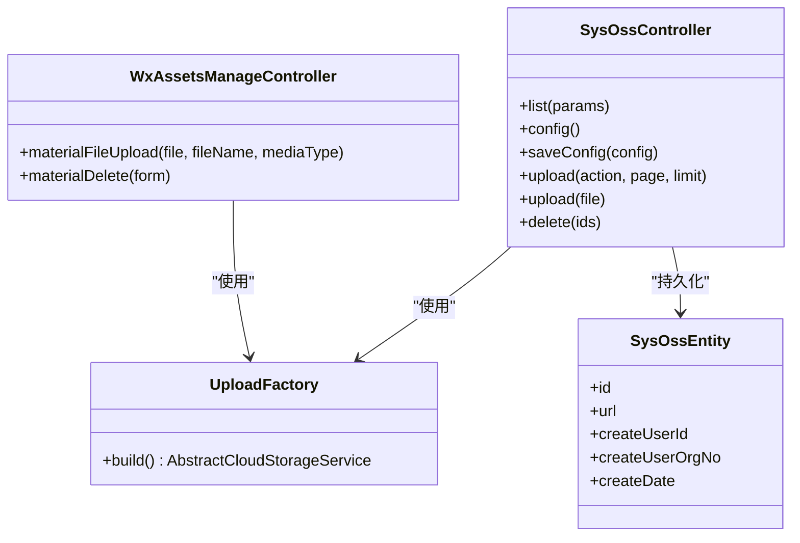
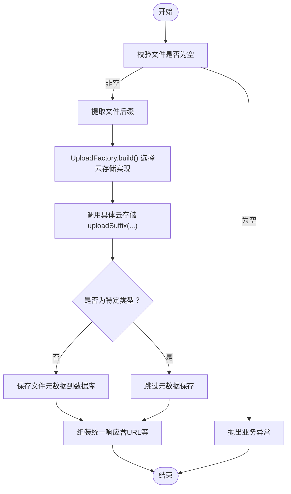
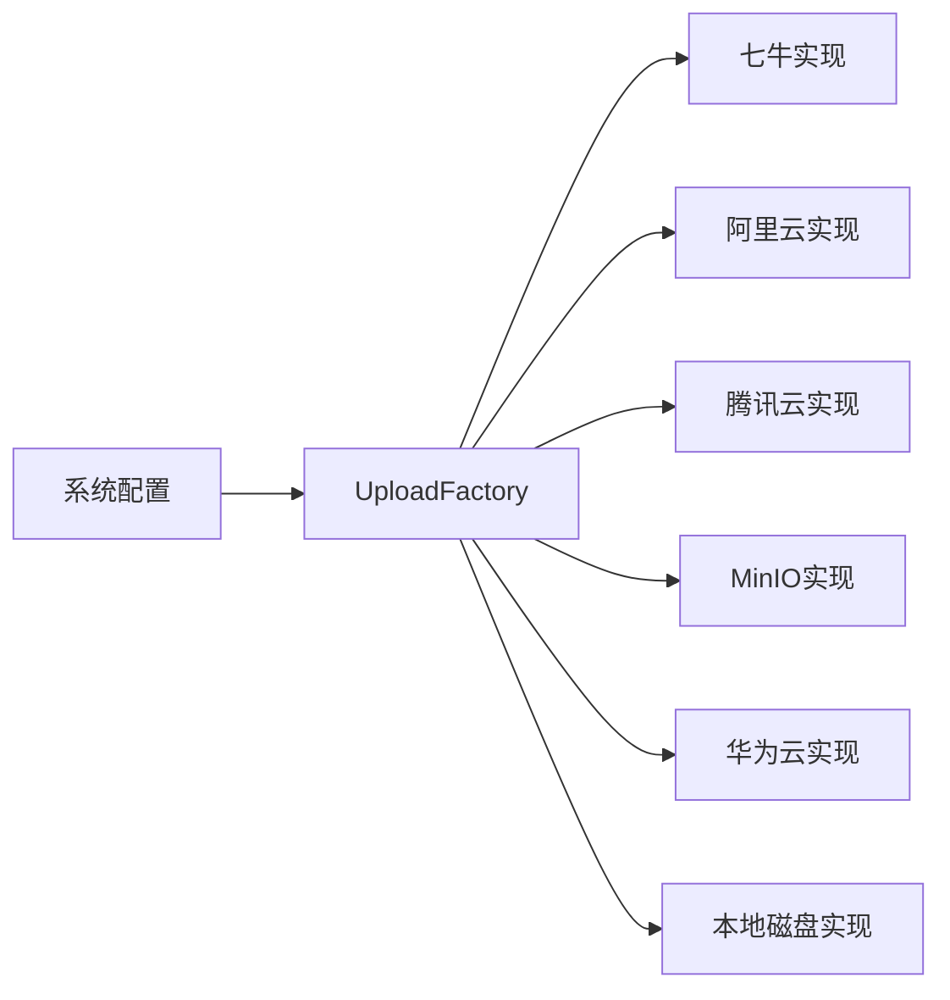

# 文件上传接口

<cite>
**本文引用的文件**
- [SysOssController.java](file://platform-admin/src/main/java/com/platform/modules/oss/controller/SysOssController.java)
- [WxAssetsManageController.java](file://platform-admin/src/main/java/com/platform/modules/wx/controller/WxAssetsManageController.java)
- [UploadFactory.java](file://platform-biz/src/main/java/com/platform/modules/oss/cloud/UploadFactory.java)
- [SysOssEntity.java](file://platform-biz/src/main/java/com/platform/modules/oss/entity/SysOssEntity.java)
- [oss-config.vue](file://platform-admin-ui/src/views/modules/oss/oss-config.vue)
- [pom.xml](file://pom.xml)
</cite>

## 目录
1. [简介](#简介)
2. [项目结构](#项目结构)
3. [核心组件](#核心组件)
4. [架构概览](#架构概览)
5. [详细组件分析](#详细组件分析)
6. [依赖分析](#依赖分析)
7. [性能考虑](#性能考虑)
8. [故障排查指南](#故障排查指南)
9. [结论](#结论)
10. [附录](#附录)

## 简介
本文件上传接口文档聚焦于系统中的媒体资源上传能力，覆盖图片与文件上传、缩略图生成、云存储集成、文件安全检查与防盗链机制、存储策略与CDN加速、以及完整的上传示例与错误处理方案。文档面向后端开发者与前端对接人员，提供清晰的接口定义、流程图与最佳实践。

## 项目结构
围绕文件上传的关键模块分布如下：
- 控制层：负责接收请求、参数校验与响应封装
- 业务层：负责云存储工厂选择与具体上传逻辑
- 实体层：持久化文件元数据
- 前端配置：云存储类型与参数配置界面
- 外部依赖：多种云存储SDK

图表来源
- [SysOssController.java:140-209](file://platform-admin/src/main/java/com/platform/modules/oss/controller/SysOssController.java#L140-L209)
- [WxAssetsManageController.java:120-130](file://platform-admin/src/main/java/com/platform/modules/wx/controller/WxAssetsManageController.java#L120-L130)
- [UploadFactory.java:38-56](file://platform-biz/src/main/java/com/platform/modules/oss/cloud/UploadFactory.java#L38-L56)
- [SysOssEntity.java:34-57](file://platform-biz/src/main/java/com/platform/modules/oss/entity/SysOssEntity.java#L34-L57)
- [oss-config.vue:1-104](file://platform-admin-ui/src/views/modules/oss/oss-config.vue#L1-L104)
- [pom.xml:255-286](file://pom.xml#L255-L286)

章节来源
- [SysOssController.java:140-209](file://platform-admin/src/main/java/com/platform/modules/oss/controller/SysOssController.java#L140-L209)
- [WxAssetsManageController.java:120-130](file://platform-admin/src/main/java/com/platform/modules/wx/controller/WxAssetsManageController.java#L120-L130)
- [UploadFactory.java:38-56](file://platform-biz/src/main/java/com/platform/modules/oss/cloud/UploadFactory.java#L38-L56)
- [SysOssEntity.java:34-57](file://platform-biz/src/main/java/com/platform/modules/oss/entity/SysOssEntity.java#L34-L57)
- [oss-config.vue:1-104](file://platform-admin-ui/src/views/modules/oss/oss-config.vue#L1-L104)
- [pom.xml:255-286](file://pom.xml#L255-L286)

## 核心组件
- 文件上传控制器（SysOssController）
  - 提供通用文件上传入口，支持UEditor兼容模式与标准上传模式
  - 支持分页查询与删除上传记录
- 微信素材上传控制器（WxAssetsManageController）
  - 提供微信公众号/小程序永久素材上传与删除
- 云存储工厂（UploadFactory）
  - 基于系统配置动态选择具体云存储实现（七牛、阿里云、腾讯云、MinIO、华为云、本地磁盘）
- 文件元数据实体（SysOssEntity）
  - 记录上传文件URL、创建人、组织、创建时间等

章节来源
- [SysOssController.java:140-209](file://platform-admin/src/main/java/com/platform/modules/oss/controller/SysOssController.java#L140-L209)
- [WxAssetsManageController.java:120-130](file://platform-admin/src/main/java/com/platform/modules/wx/controller/WxAssetsManageController.java#L120-L130)
- [UploadFactory.java:38-56](file://platform-biz/src/main/java/com/platform/modules/oss/cloud/UploadFactory.java#L38-L56)
- [SysOssEntity.java:34-57](file://platform-biz/src/main/java/com/platform/modules/oss/entity/SysOssEntity.java#L34-L57)

## 架构概览
文件上传整体流程：
- 前端通过表单提交文件
- 后端控制器接收并进行基础校验
- 工厂根据系统配置选择云存储实现
- 上传完成后写入文件元数据（除特定类型外）
- 返回统一响应（兼容UEditor）

图表来源
- [SysOssController.java:180-209](file://platform-admin/src/main/java/com/platform/modules/oss/controller/SysOssController.java#L180-L209)
- [UploadFactory.java:38-56](file://platform-biz/src/main/java/com/platform/modules/oss/cloud/UploadFactory.java#L38-L56)
- [SysOssEntity.java:34-57](file://platform-biz/src/main/java/com/platform/modules/oss/entity/SysOssEntity.java#L34-L57)

## 详细组件分析

### 接口定义与行为

- 通用文件上传
  - 方法与路径
    - POST /sys/oss/upload
  - 请求参数
    - 表单字段：file（必填，MultipartFile）
  - 支持的文件类型
    - 由UEditor配置决定，包括图片、视频、文件等类型集合
  - 大小限制
    - 图片：默认2MB
    - 视频：默认100MB
    - 文件：默认50MB
  - 安全策略
    - 上传前校验文件非空
    - 仅对非特定类型（如.p12）保存文件元数据
  - 响应格式
    - 统一响应对象，包含URL、状态、标题、原始名称等字段
  - 兼容性
    - 返回UEditor所需字段（url/state/title/original）

- UEditor配置与列表
  - GET /sys/oss/upload?action=config
    - 返回UEditor后台配置JSON
  - GET /sys/oss/upload?action=listimage&page=...&limit=...
    - 返回分页图片列表（兼容UEditor）

- 云存储配置
  - GET /sys/oss/config
    - 获取当前云存储配置
  - POST /sys/oss/saveConfig
    - 更新云存储配置（按类型校验对应参数）

- 文件管理
  - GET /sys/oss/list
    - 分页查询上传记录
  - POST /sys/oss/delete
    - 删除上传记录

- 微信素材上传
  - POST /wx/assets/materialFileUpload
  - 请求参数：file、fileName、mediaType
  - 返回微信素材上传结果

章节来源
- [SysOssController.java:147-209](file://platform-admin/src/main/java/com/platform/modules/oss/controller/SysOssController.java#L147-L209)
- [SysOssController.java:232-306](file://platform-admin/src/main/java/com/platform/modules/oss/controller/SysOssController.java#L232-L306)
- [SysOssController.java:94-139](file://platform-admin/src/main/java/com/platform/modules/oss/controller/SysOssController.java#L94-L139)
- [SysOssController.java:78-86](file://platform-admin/src/main/java/com/platform/modules/oss/controller/SysOssController.java#L78-L86)
- [SysOssController.java:217-225](file://platform-admin/src/main/java/com/platform/modules/oss/controller/SysOssController.java#L217-L225)
- [WxAssetsManageController.java:120-130](file://platform-admin/src/main/java/com/platform/modules/wx/controller/WxAssetsManageController.java#L120-L130)

### 数据模型

图表来源
- [SysOssEntity.java:34-57](file://platform-biz/src/main/java/com/platform/modules/oss/entity/SysOssEntity.java#L34-L57)

### 类关系图

图表来源
- [SysOssController.java:140-225](file://platform-admin/src/main/java/com/platform/modules/oss/controller/SysOssController.java#L140-L225)
- [WxAssetsManageController.java:120-146](file://platform-admin/src/main/java/com/platform/modules/wx/controller/WxAssetsManageController.java#L120-L146)
- [UploadFactory.java:38-56](file://platform-biz/src/main/java/com/platform/modules/oss/cloud/UploadFactory.java#L38-L56)
- [SysOssEntity.java:34-57](file://platform-biz/src/main/java/com/platform/modules/oss/entity/SysOssEntity.java#L34-L57)

### 上传流程与安全检查

图表来源
- [SysOssController.java:180-209](file://platform-admin/src/main/java/com/platform/modules/oss/controller/SysOssController.java#L180-L209)
- [UploadFactory.java:38-56](file://platform-biz/src/main/java/com/platform/modules/oss/cloud/UploadFactory.java#L38-L56)
- [SysOssEntity.java:34-57](file://platform-biz/src/main/java/com/platform/modules/oss/entity/SysOssEntity.java#L34-L57)

### 缩略图生成与图片处理
- 前端WebUploader提供生成缩略图的能力（makeThumb），可用于预览增强
- 图片压缩与尺寸限制由UEditor配置项控制（如图片压缩开关与最长边限制）
- 云端存储实现可进一步扩展图片处理（如裁剪、水印、格式转换），具体取决于所选云厂商能力

章节来源
- [SysOssController.java:232-306](file://platform-admin/src/main/java/com/platform/modules/oss/controller/SysOssController.java#L232-L306)
- [SysOssController.java:147-171](file://platform-admin/src/main/java/com/platform/modules/oss/controller/SysOssController.java#L147-L171)

### 云存储集成与配置
- 支持的云存储类型
  - 七牛、阿里云、腾讯云、MinIO、华为云、本地磁盘
- 配置方式
  - 通过管理界面选择存储类型并填写对应参数
  - 后端保存为系统配置，工厂按配置动态选择实现
- 依赖引入
  - Maven中已引入各云厂商SDK依赖

章节来源
- [oss-config.vue:1-104](file://platform-admin-ui/src/views/modules/oss/oss-config.vue#L1-L104)
- [SysOssController.java:110-139](file://platform-admin/src/main/java/com/platform/modules/oss/controller/SysOssController.java#L110-L139)
- [pom.xml:255-286](file://pom.xml#L255-L286)

### 防盗链与CDN加速
- CDN加速
  - 云存储配置中可设置域名前缀，用于拼接公开访问URL
- 防盗链
  - 通过云存储服务商提供的签名直传或Token机制实现（需在云存储实现中启用）
  - 建议结合白名单域名与过期时间策略

章节来源
- [SysOssController.java:94-139](file://platform-admin/src/main/java/com/platform/modules/oss/controller/SysOssController.java#L94-L139)
- [oss-config.vue:1-104](file://platform-admin-ui/src/views/modules/oss/oss-config.vue#L1-L104)

### 错误处理与示例

- 常见错误场景
  - 上传文件为空：抛出业务异常
  - 文件类型不在允许范围：UEditor侧会提示类型错误
  - 单文件大小超过限制：UEditor侧会提示大小错误
  - 服务端上传失败：根据云存储实现返回相应错误码
- 前端错误展示
  - UEditor对话框内根据错误码映射显示提示文本

章节来源
- [SysOssController.java:180-209](file://platform-admin/src/main/java/com/platform/modules/oss/controller/SysOssController.java#L180-L209)
- [SysOssController.java:232-306](file://platform-admin/src/main/java/com/platform/modules/oss/controller/SysOssController.java#L232-L306)

## 依赖分析
- 云存储实现选择
  - UploadFactory依据系统配置返回具体云存储服务实例
- 外部SDK依赖
  - 通过Maven引入各云厂商SDK，确保运行时可用
- 前后端耦合点
  - 上传接口返回字段与UEditor约定保持一致，便于前端解析

图表来源
- [UploadFactory.java:38-56](file://platform-biz/src/main/java/com/platform/modules/oss/cloud/UploadFactory.java#L38-L56)
- [pom.xml:255-286](file://pom.xml#L255-L286)

章节来源
- [UploadFactory.java:38-56](file://platform-biz/src/main/java/com/platform/modules/oss/cloud/UploadFactory.java#L38-L56)
- [pom.xml:255-286](file://pom.xml#L255-L286)

## 性能考虑
- 分片上传与断点续传
  - 建议在大文件场景采用分片上传，提升成功率与可恢复性
- 压缩与预览
  - 对图片进行压缩与缩略图生成，减少带宽与渲染开销
- CDN缓存
  - 合理设置缓存策略与TTL，结合版本化URL避免陈旧内容

## 故障排查指南
- 无法上传
  - 检查文件是否为空、类型是否在允许范围内、大小是否超限
  - 查看后端日志与异常栈，定位具体失败环节
- 上传成功但无记录
  - 确认文件类型是否为特定类型（如.p12），该类文件不会写入元数据
- 云存储配置错误
  - 在管理界面核对存储类型与参数，重新保存配置后重启生效
- 前端显示异常
  - 检查UEditor配置与返回字段一致性，确认错误码映射

章节来源
- [SysOssController.java:180-209](file://platform-admin/src/main/java/com/platform/modules/oss/controller/SysOssController.java#L180-L209)
- [SysOssController.java:232-306](file://platform-admin/src/main/java/com/platform/modules/oss/controller/SysOssController.java#L232-L306)
- [oss-config.vue:1-104](file://platform-admin-ui/src/views/modules/oss/oss-config.vue#L1-L104)

## 结论
本系统提供了完善的文件上传能力，覆盖通用上传、微信素材上传、多云存储集成与UEditor兼容。通过工厂模式与系统配置解耦具体云实现，配合前端缩略图与图片压缩策略，可在保证安全性的同时提升用户体验。建议在生产环境启用CDN与防盗链，并针对大文件场景引入分片上传与断点续传机制。

## 附录

### 接口一览表
- 通用文件上传
  - 方法：POST
  - 路径：/sys/oss/upload
  - 参数：file（MultipartFile，必填）
  - 响应：统一响应对象（包含URL等）
- UEditor配置与列表
  - GET /sys/oss/upload?action=config
  - GET /sys/oss/upload?action=listimage&page=&limit=
- 云存储配置
  - GET /sys/oss/config
  - POST /sys/oss/saveConfig
- 文件管理
  - GET /sys/oss/list
  - POST /sys/oss/delete
- 微信素材上传
  - POST /wx/assets/materialFileUpload
  - 参数：file、fileName、mediaType

章节来源
- [SysOssController.java:147-209](file://platform-admin/src/main/java/com/platform/modules/oss/controller/SysOssController.java#L147-L209)
- [SysOssController.java:232-306](file://platform-admin/src/main/java/com/platform/modules/oss/controller/SysOssController.java#L232-L306)
- [SysOssController.java:94-139](file://platform-admin/src/main/java/com/platform/modules/oss/controller/SysOssController.java#L94-L139)
- [SysOssController.java:78-86](file://platform-admin/src/main/java/com/platform/modules/oss/controller/SysOssController.java#L78-L86)
- [SysOssController.java:217-225](file://platform-admin/src/main/java/com/platform/modules/oss/controller/SysOssController.java#L217-L225)
- [WxAssetsManageController.java:120-130](file://platform-admin/src/main/java/com/platform/modules/wx/controller/WxAssetsManageController.java#L120-L130)