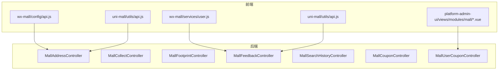
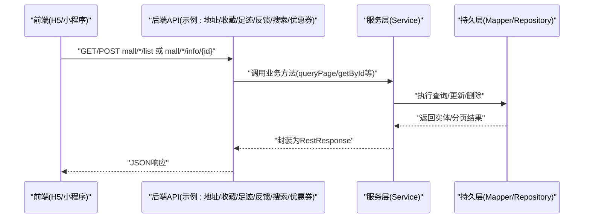
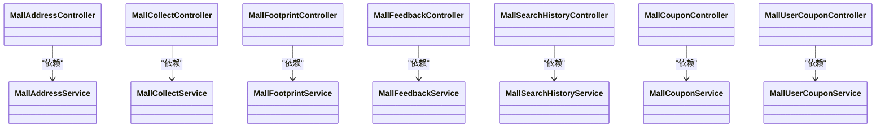

# 用户中心接口

<cite>
**本文引用的文件**
- [MallAddressController.java](file://platform-admin/src/main/java/com/platform/modules/mall/controller/MallAddressController.java)
- [MallCollectController.java](file://platform-admin/src/main/java/com/platform/modules/mall/controller/MallCollectController.java)
- [MallFootprintController.java](file://platform-admin/src/main/java/com/platform/modules/mall/controller/MallFootprintController.java)
- [MallFeedbackController.java](file://platform-admin/src/main/java/com/platform/modules/mall/controller/MallFeedbackController.java)
- [MallSearchHistoryController.java](file://platform-admin/src/main/java/com/platform/modules/mall/controller/MallSearchHistoryController.java)
- [MallCouponController.java](file://platform-admin/src/main/java/com/platform/modules/mall/controller/MallCouponController.java)
- [MallUserCouponController.java](file://platform-admin/src/main/java/com/platform/modules/mall/controller/MallUserCouponController.java)
- [api.js（微信小程序）](file://wx-mall/config/api.js)
- [api.js（H5/UniApp）](file://uni-mall/utils/api.js)
- [user.js（微信小程序用户服务）](file://wx-mall/services/user.js)
- [user.js（H5/UniApp 用户服务）](file://uni-mall/utils/api.js)
- [usercoupon.vue（后台优惠券列表）](file://platform-admin-ui/src/views/modules/mall/usercoupon.vue)
</cite>

## 目录
1. [简介](#简介)
2. [项目结构](#项目结构)
3. [核心组件](#核心组件)
4. [架构总览](#架构总览)
5. [详细组件分析](#详细组件分析)
6. [依赖关系分析](#依赖关系分析)
7. [性能与可用性建议](#性能与可用性建议)
8. [故障排查指南](#故障排查指南)
9. [结论](#结论)
10. [附录：接口清单与规范](#附录接口清单与规范)

## 简介
本文件面向“用户中心”相关接口，覆盖以下能力域：
- 用户个人信息管理（登录、绑定手机号、短信验证码等）
- 收货地址管理（列表、详情、新增、修改、删除）
- 商品收藏/取消收藏
- 浏览足迹查看与清理
- 优惠券领取/使用（平台券与用户券）
- 意见反馈提交
- 搜索历史管理

文档对每个接口给出：HTTP 方法、URL 路径、请求参数、业务规则与响应格式，并补充数据隐私保护、权限控制与用户体验优化策略。

## 项目结构
后端采用 Spring Boot + MyBatis-Plus 架构，用户中心相关接口集中在 mall 模块的若干 Controller 中；前端包含：
- 微信小程序端：pages/ucenter/* 页面与 services/user.js
- H5/UniApp 端：uni-mall/utils/api.js 统一定义接口前缀，页面在 pages/ucenter/* 下
- 后台管理端：platform-admin-ui 的 views/modules/mall/* 页面，如 usercoupon.vue

图表来源
- [MallAddressController.java](file://platform-admin/src/main/java/com/platform/modules/mall/controller/MallAddressController.java)
- [MallCollectController.java](file://platform-admin/src/main/java/com/platform/modules/mall/controller/MallCollectController.java)
- [MallFootprintController.java](file://platform-admin/src/main/java/com/platform/modules/mall/controller/MallFootprintController.java)
- [MallFeedbackController.java](file://platform-admin/src/main/java/com/platform/modules/mall/controller/MallFeedbackController.java)
- [MallSearchHistoryController.java](file://platform-admin/src/main/java/com/platform/modules/mall/controller/MallSearchHistoryController.java)
- [MallCouponController.java](file://platform-admin/src/main/java/com/platform/modules/mall/controller/MallCouponController.java)
- [MallUserCouponController.java](file://platform-admin/src/main/java/com/platform/modules/mall/controller/MallUserCouponController.java)
- [api.js（微信小程序）](file://wx-mall/config/api.js)
- [api.js（H5/UniApp）](file://uni-mall/utils/api.js)
- [user.js（微信小程序用户服务）](file://wx-mall/services/user.js)
- [user.js（H5/UniApp 用户服务）](file://uni-mall/utils/api.js)
- [usercoupon.vue（后台优惠券列表）](file://platform-admin-ui/src/views/modules/mall/usercoupon.vue)

章节来源
- [MallAddressController.java](file://platform-admin/src/main/java/com/platform/modules/mall/controller/MallAddressController.java)
- [MallCollectController.java](file://platform-admin/src/main/java/com/platform/modules/mall/controller/MallCollectController.java)
- [MallFootprintController.java](file://platform-admin/src/main/java/com/platform/modules/mall/controller/MallFootprintController.java)
- [MallFeedbackController.java](file://platform-admin/src/main/java/com/platform/modules/mall/controller/MallFeedbackController.java)
- [MallSearchHistoryController.java](file://platform-admin/src/main/java/com/platform/modules/mall/controller/MallSearchHistoryController.java)
- [MallCouponController.java](file://platform-admin/src/main/java/com/platform/modules/mall/controller/MallCouponController.java)
- [MallUserCouponController.java](file://platform-admin/src/main/java/com/platform/modules/mall/controller/MallUserCouponController.java)
- [api.js（微信小程序）](file://wx-mall/config/api.js)
- [api.js（H5/UniApp）](file://uni-mall/utils/api.js)
- [user.js（微信小程序用户服务）](file://wx-mall/services/user.js)
- [user.js（H5/UniApp 用户服务）](file://uni-mall/utils/api.js)
- [usercoupon.vue（后台优惠券列表）](file://platform-admin-ui/src/views/modules/mall/usercoupon.vue)

## 核心组件
- 地址管理：MallAddressController 提供地址列表、详情、新增、修改、删除等接口
- 收藏管理：MallCollectController 提供收藏列表、新增、删除等接口
- 足迹管理：MallFootprintController 提供足迹列表、详情、删除等接口
- 反馈管理：MallFeedbackController 提供反馈列表、详情、新增、删除等接口
- 搜索历史：MallSearchHistoryController 提供搜索历史列表、详情、新增、删除等接口
- 优惠券：MallCouponController（平台券）、MallUserCouponController（用户券）
- 登录与绑定：H5/UniApp 与微信小程序分别通过各自 api.js 定义的登录、绑定、短信接口调用后端

章节来源
- [MallAddressController.java](file://platform-admin/src/main/java/com/platform/modules/mall/controller/MallAddressController.java)
- [MallCollectController.java](file://platform-admin/src/main/java/com/platform/modules/mall/controller/MallCollectController.java)
- [MallFootprintController.java](file://platform-admin/src/main/java/com/platform/modules/mall/controller/MallFootprintController.java)
- [MallFeedbackController.java](file://platform-admin/src/main/java/com/platform/modules/mall/controller/MallFeedbackController.java)
- [MallSearchHistoryController.java](file://platform-admin/src/main/java/com/platform/modules/mall/controller/MallSearchHistoryController.java)
- [MallCouponController.java](file://platform-admin/src/main/java/com/platform/modules/mall/controller/MallCouponController.java)
- [MallUserCouponController.java](file://platform-admin/src/main/java/com/platform/modules/mall/controller/MallUserCouponController.java)
- [api.js（H5/UniApp）](file://uni-mall/utils/api.js)
- [api.js（微信小程序）](file://wx-mall/config/api.js)

## 架构总览
用户中心接口遵循统一的 REST 风格，控制器通过注解声明路由前缀与权限点，返回统一的 RestResponse 包装体。前端通过各自 api.js 统一拼接完整 URL 并发起请求。

图表来源
- [MallAddressController.java](file://platform-admin/src/main/java/com/platform/modules/mall/controller/MallAddressController.java)
- [MallCollectController.java](file://platform-admin/src/main/java/com/platform/modules/mall/controller/MallCollectController.java)
- [MallFootprintController.java](file://platform-admin/src/main/java/com/platform/modules/mall/controller/MallFootprintController.java)
- [MallFeedbackController.java](file://platform-admin/src/main/java/com/platform/modules/mall/controller/MallFeedbackController.java)
- [MallSearchHistoryController.java](file://platform-admin/src/main/java/com/platform/modules/mall/controller/MallSearchHistoryController.java)
- [MallCouponController.java](file://platform-admin/src/main/java/com/platform/modules/mall/controller/MallCouponController.java)
- [MallUserCouponController.java](file://platform-admin/src/main/java/com/platform/modules/mall/controller/MallUserCouponController.java)

## 详细组件分析

### 地址管理接口
- 接口前缀：mall/address
- 权限点：mall:address:list/save/update/delete/info
- 常用接口
  - GET mall/address/list：分页查询地址列表
  - GET mall/address/info/{id}：按主键查询地址详情
  - POST mall/address/save：新增地址
  - POST mall/address/update：修改地址
  - POST mall/address/delete：批量删除地址

请求参数与业务规则
- 新增/修改需传入地址实体字段（如姓名、电话、省市区、详细地址、是否默认等），具体字段以实体为准
- 删除支持传入多个主键 ID 数组

响应格式
- 统一返回 RestResponse<T>，成功时 T 为实体或字符串“ok”

章节来源
- [MallAddressController.java](file://platform-admin/src/main/java/com/platform/modules/mall/controller/MallAddressController.java)

### 收藏管理接口
- 接口前缀：mall/collect
- 权限点：mall:collect:list/save/update/delete/info
- 常用接口
  - GET mall/collect/list：分页查询收藏列表
  - GET mall/collect/info/{id}：按主键查询收藏详情
  - POST mall/collect/save：新增收藏
  - POST mall/collect/update：修改收藏
  - POST mall/collect/delete：批量删除收藏

请求参数与业务规则
- 新增/修改需传入收藏实体字段（如用户 ID、商品 ID 等），具体字段以实体为准
- 收藏/取消收藏通常由前端调用保存接口完成

响应格式
- 统一返回 RestResponse<T>，成功时 T 为字符串“ok”

章节来源
- [MallCollectController.java](file://platform-admin/src/main/java/com/platform/modules/mall/controller/MallCollectController.java)

### 足迹管理接口
- 接口前缀：mall/footprint
- 权限点：mall:footprint:list/save/update/delete/info
- 常用接口
  - GET mall/footprint/list：分页查询足迹列表
  - GET mall/footprint/info/{id}：按主键查询足迹详情
  - POST mall/footprint/save：新增足迹
  - POST mall/footprint/update：修改足迹
  - POST mall/footprint/delete：批量删除足迹

请求参数与业务规则
- 新增/修改需传入足迹实体字段（如用户 ID、商品 ID、访问时间等），具体字段以实体为准
- 支持按条件清理历史足迹

响应格式
- 统一返回 RestResponse<T>，成功时 T 为字符串“ok”

章节来源
- [MallFootprintController.java](file://platform-admin/src/main/java/com/platform/modules/mall/controller/MallFootprintController.java)

### 反馈管理接口
- 接口前缀：mall/feedback
- 权限点：mall:feedback:list/save/update/delete/info
- 常用接口
  - GET mall/feedback/list：分页查询反馈列表
  - GET mall/feedback/info/{msgId}：按主键查询反馈详情
  - POST mall/feedback/save：新增反馈
  - POST mall/feedback/update：修改反馈
  - POST mall/feedback/delete：批量删除反馈

请求参数与业务规则
- 新增/修改需传入反馈实体字段（如用户 ID、内容、图片等），具体字段以实体为准
- 支持后台审核与回复流程

响应格式
- 统一返回 RestResponse<T>，成功时 T 为字符串“ok”

章节来源
- [MallFeedbackController.java](file://platform-admin/src/main/java/com/platform/modules/mall/controller/MallFeedbackController.java)

### 搜索历史管理接口
- 接口前缀：mall/searchhistory
- 权限点：mall:searchhistory:list/save/update/delete/info
- 常用接口
  - GET mall/searchhistory/list：分页查询搜索历史列表
  - GET mall/searchhistory/info/{id}：按主键查询搜索历史详情
  - POST mall/searchhistory/save：新增搜索历史
  - POST mall/searchhistory/update：修改搜索历史
  - POST mall/searchhistory/delete：批量删除搜索历史

请求参数与业务规则
- 新增/修改需传入搜索历史实体字段（如用户 ID、关键词、时间等），具体字段以实体为准
- 支持清空历史记录

响应格式
- 统一返回 RestResponse<T>，成功时 T 为字符串“ok”

章节来源
- [MallSearchHistoryController.java](file://platform-admin/src/main/java/com/platform/modules/mall/controller/MallSearchHistoryController.java)

### 优惠券接口
- 平台券接口：mall/coupon
  - GET mall/coupon/list：分页查询平台券列表
  - GET mall/coupon/info/{id}：按主键查询平台券详情
  - POST mall/coupon/save/update/delete：新增/修改/删除
- 用户券接口：mall/usercoupon
  - GET mall/usercoupon/list：分页查询用户券列表（支持按昵称、券号、类型、状态筛选）
  - GET mall/usercoupon/info/{id}：按主键查询用户券详情
  - POST mall/usercoupon/save/update/delete：新增/修改/删除

前端调用参考
- H5/UniApp：utils/api.js 定义了 coupon/list、coupon/listByGoods 等接口前缀
- 微信小程序：config/api.js 定义了 coupon/list、coupon/listByGoods 等接口前缀

响应格式
- 统一返回 RestResponse<T>，成功时 T 为实体或分页对象

章节来源
- [MallCouponController.java](file://platform-admin/src/main/java/com/platform/modules/mall/controller/MallCouponController.java)
- [MallUserCouponController.java](file://platform-admin/src/main/java/com/platform/modules/mall/controller/MallUserCouponController.java)
- [api.js（H5/UniApp）](file://uni-mall/utils/api.js)
- [api.js（微信小程序）](file://wx-mall/config/api.js)
- [usercoupon.vue（后台优惠券列表）](file://platform-admin-ui/src/views/modules/mall/usercoupon.vue)

### 用户登录与绑定接口
- H5/UniApp
  - 登录：POST auth/login 或 auth/LoginByMa（以实际 api.js 定义为准）
  - 注册：POST auth/register
  - 发送短信验证码：POST user/smscode
  - 绑定手机：POST user/bindMobile
- 微信小程序
  - 登录：POST auth/login 或 auth/code（以实际 api.js 定义为准）
  - 用户信息：loginByWeixin 封装登录流程，成功后写入本地缓存 token 与 userInfo

章节来源
- [api.js（H5/UniApp）](file://uni-mall/utils/api.js)
- [api.js（微信小程序）](file://wx-mall/config/api.js)
- [user.js（微信小程序用户服务）](file://wx-mall/services/user.js)
- [user.js（H5/UniApp 用户服务）](file://uni-mall/utils/api.js)

## 依赖关系分析
- 控制器依赖对应 Service 层，Service 层依赖 Mapper/Repository 访问数据库
- 前端通过 api.js 统一拼接后端域名与接口前缀，避免硬编码
- 后端使用注解声明权限点，便于统一鉴权与菜单授权

图表来源
- [MallAddressController.java](file://platform-admin/src/main/java/com/platform/modules/mall/controller/MallAddressController.java)
- [MallCollectController.java](file://platform-admin/src/main/java/com/platform/modules/mall/controller/MallCollectController.java)
- [MallFootprintController.java](file://platform-admin/src/main/java/com/platform/modules/mall/controller/MallFootprintController.java)
- [MallFeedbackController.java](file://platform-admin/src/main/java/com/platform/modules/mall/controller/MallFeedbackController.java)
- [MallSearchHistoryController.java](file://platform-admin/src/main/java/com/platform/modules/mall/controller/MallSearchHistoryController.java)
- [MallCouponController.java](file://platform-admin/src/main/java/com/platform/modules/mall/controller/MallCouponController.java)
- [MallUserCouponController.java](file://platform-admin/src/main/java/com/platform/modules/mall/controller/MallUserCouponController.java)

## 性能与可用性建议
- 分页查询
  - 所有列表接口均提供分页能力，建议前端设置合理页大小与滚动加载策略，减少一次性渲染压力
- 缓存与懒加载
  - 对于收藏、足迹、搜索历史等高频读取场景，可在前端进行本地缓存与增量更新
- 请求合并
  - 对于多处需要用户身份的页面，尽量复用已登录态，避免重复登录请求
- 错误重试
  - 对网络异常或超时的请求，建议增加指数退避重试机制
- 数据脱敏
  - 返回给前端的用户信息应做脱敏处理（如隐藏部分手机号）

## 故障排查指南
- 登录态失效
  - 现象：调用受保护接口返回未授权
  - 处理：检查本地 token 是否存在且未过期，必要时引导重新登录
- 参数校验失败
  - 现象：接口返回参数错误或业务异常
  - 处理：核对必填字段与类型，确保主键 ID 正确
- 权限不足
  - 现象：返回无权限
  - 处理：确认当前用户角色是否具备 mall:* 权限点
- 分页数据为空
  - 现象：列表为空但 total>0
  - 处理：检查查询条件与分页参数，确认是否存在数据但被过滤

章节来源
- [MallAddressController.java](file://platform-admin/src/main/java/com/platform/modules/mall/controller/MallAddressController.java)
- [MallCollectController.java](file://platform-admin/src/main/java/com/platform/modules/mall/controller/MallCollectController.java)
- [MallFootprintController.java](file://platform-admin/src/main/java/com/platform/modules/mall/controller/MallFootprintController.java)
- [MallFeedbackController.java](file://platform-admin/src/main/java/com/platform/modules/mall/controller/MallFeedbackController.java)
- [MallSearchHistoryController.java](file://platform-admin/src/main/java/com/platform/modules/mall/controller/MallSearchHistoryController.java)
- [MallCouponController.java](file://platform-admin/src/main/java/com/platform/modules/mall/controller/MallCouponController.java)
- [MallUserCouponController.java](file://platform-admin/src/main/java/com/platform/modules/mall/controller/MallUserCouponController.java)

## 结论
本文档梳理了用户中心相关的核心接口，明确了前后端交互方式、权限控制与响应规范，并提供了性能与故障排查建议。建议在后续迭代中持续完善接口文档与自动化测试，保障用户体验与系统稳定性。

## 附录：接口清单与规范

### 通用规范
- 统一响应体：RestResponse<T>，成功时 code=0，message 为“操作成功”，data 为具体数据
- 分页参数：page、limit（或同义参数），默认合理值由后端控制
- 权限控制：各接口均标注所需权限点，仅具备相应权限可访问

### 地址管理
- GET mall/address/list：分页查询地址列表
- GET mall/address/info/{id}：查询地址详情
- POST mall/address/save：新增地址
- POST mall/address/update：修改地址
- POST mall/address/delete：批量删除地址

章节来源
- [MallAddressController.java](file://platform-admin/src/main/java/com/platform/modules/mall/controller/MallAddressController.java)

### 收藏管理
- GET mall/collect/list：分页查询收藏列表
- GET mall/collect/info/{id}：查询收藏详情
- POST mall/collect/save：新增收藏
- POST mall/collect/update：修改收藏
- POST mall/collect/delete：批量删除收藏

章节来源
- [MallCollectController.java](file://platform-admin/src/main/java/com/platform/modules/mall/controller/MallCollectController.java)

### 足迹管理
- GET mall/footprint/list：分页查询足迹列表
- GET mall/footprint/info/{id}：查询足迹详情
- POST mall/footprint/save：新增足迹
- POST mall/footprint/update：修改足迹
- POST mall/footprint/delete：批量删除足迹

章节来源
- [MallFootprintController.java](file://platform-admin/src/main/java/com/platform/modules/mall/controller/MallFootprintController.java)

### 反馈管理
- GET mall/feedback/list：分页查询反馈列表
- GET mall/feedback/info/{msgId}：查询反馈详情
- POST mall/feedback/save：新增反馈
- POST mall/feedback/update：修改反馈
- POST mall/feedback/delete：批量删除反馈

章节来源
- [MallFeedbackController.java](file://platform-admin/src/main/java/com/platform/modules/mall/controller/MallFeedbackController.java)

### 搜索历史管理
- GET mall/searchhistory/list：分页查询搜索历史列表
- GET mall/searchhistory/info/{id}：查询搜索历史详情
- POST mall/searchhistory/save：新增搜索历史
- POST mall/searchhistory/update：修改搜索历史
- POST mall/searchhistory/delete：批量删除搜索历史

章节来源
- [MallSearchHistoryController.java](file://platform-admin/src/main/java/com/platform/modules/mall/controller/MallSearchHistoryController.java)

### 优惠券管理
- 平台券
  - GET mall/coupon/list：分页查询平台券列表
  - GET mall/coupon/info/{id}：查询平台券详情
  - POST mall/coupon/save/update/delete：新增/修改/删除
- 用户券
  - GET mall/usercoupon/list：分页查询用户券列表（支持 nickname、couponSn、type、status 筛选）
  - GET mall/usercoupon/info/{id}：查询用户券详情
  - POST mall/usercoupon/save/update/delete：新增/修改/删除

章节来源
- [MallCouponController.java](file://platform-admin/src/main/java/com/platform/modules/mall/controller/MallCouponController.java)
- [MallUserCouponController.java](file://platform-admin/src/main/java/com/platform/modules/mall/controller/MallUserCouponController.java)
- [api.js（H5/UniApp）](file://uni-mall/utils/api.js)
- [api.js（微信小程序）](file://wx-mall/config/api.js)
- [usercoupon.vue（后台优惠券列表）](file://platform-admin-ui/src/views/modules/mall/usercoupon.vue)

### 用户登录与绑定
- H5/UniApp
  - POST auth/login：账号登录
  - POST auth/register：注册
  - POST user/smscode：发送短信验证码
  - POST user/bindMobile：绑定手机
- 微信小程序
  - loginByWeixin：封装登录流程，成功后写入本地缓存 token 与 userInfo

章节来源
- [api.js（H5/UniApp）](file://uni-mall/utils/api.js)
- [api.js（微信小程序）](file://wx-mall/config/api.js)
- [user.js（微信小程序用户服务）](file://wx-mall/services/user.js)
- [user.js（H5/UniApp 用户服务）](file://uni-mall/utils/api.js)