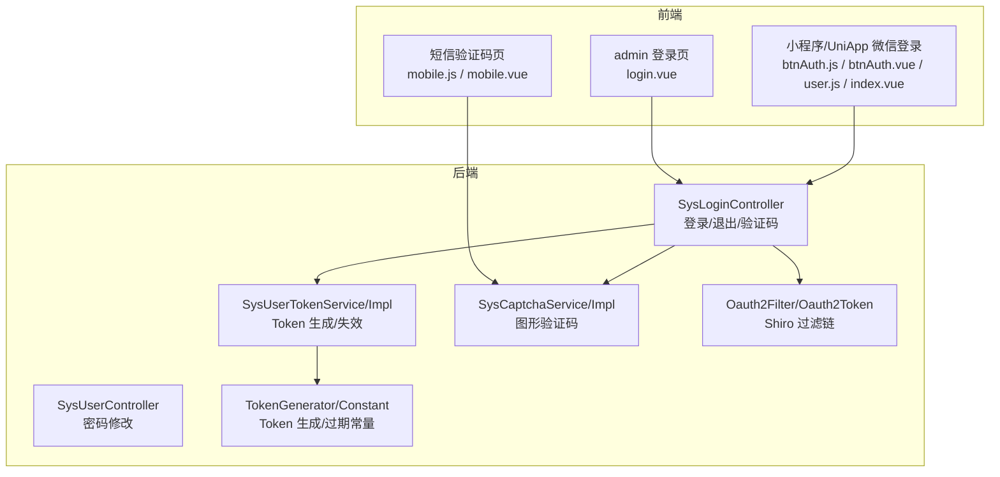
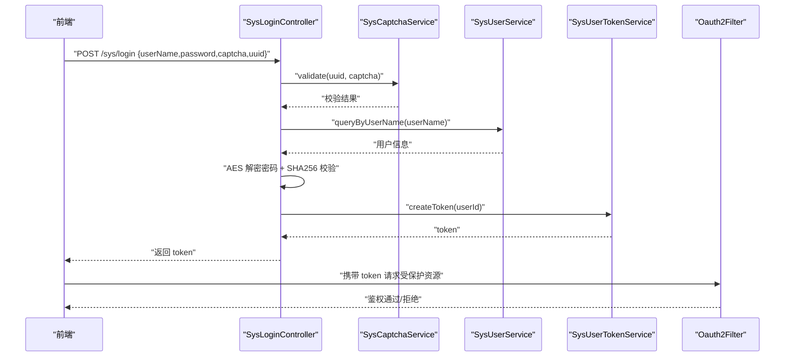
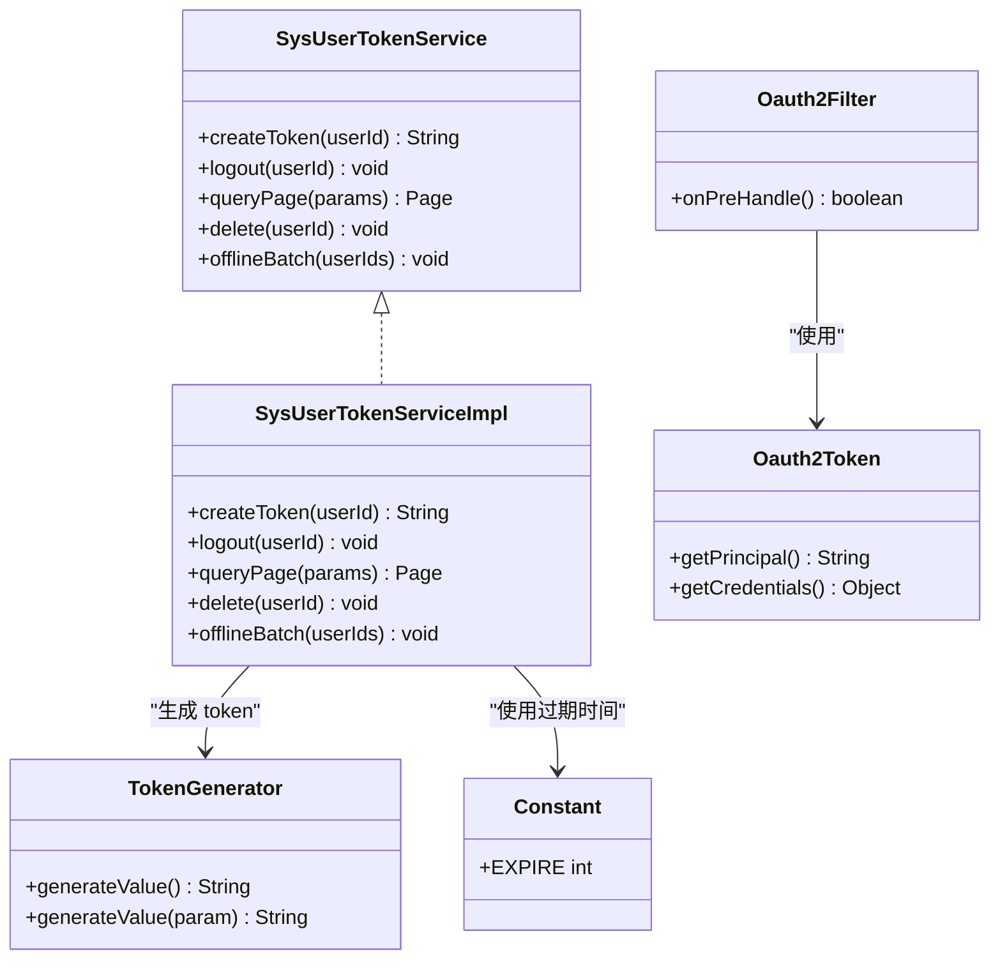
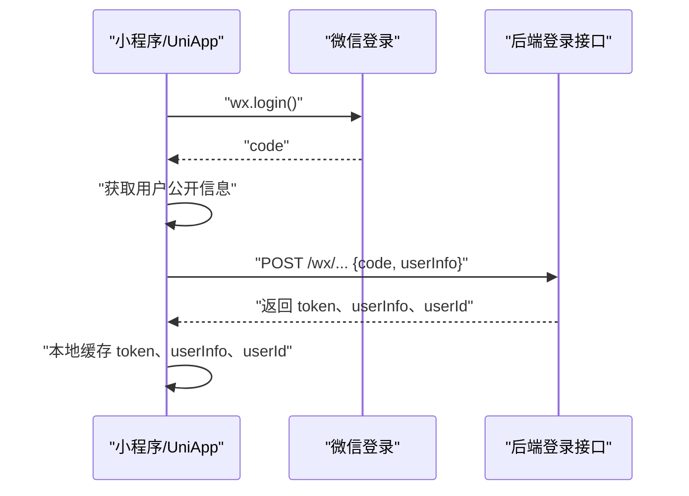
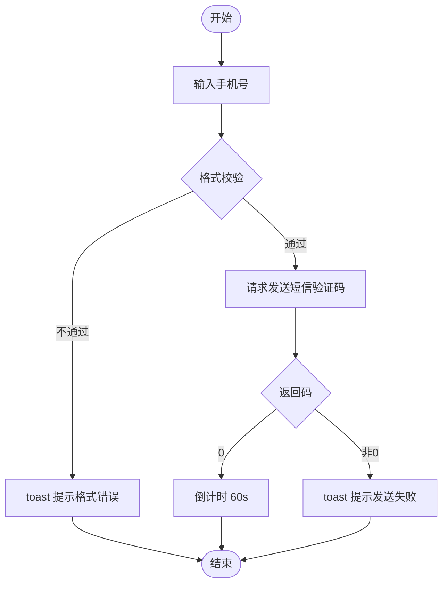
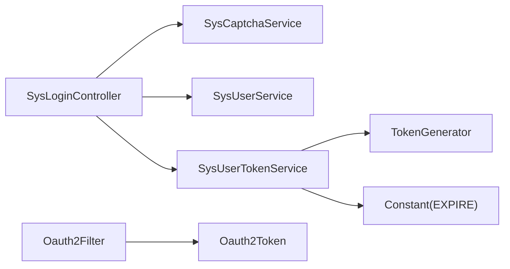

# 用户认证接口

<cite>
**本文引用的文件**
- [platform-admin/src/main/java/com/platform/modules/sys/controller/SysLoginController.java](file://platform-admin/src/main/java/com/platform/modules/sys/controller/SysLoginController.java)
- [platform-admin/src/main/java/com/platform/modules/sys/service/SysUserTokenService.java](file://platform-admin/src/main/java/com/platform/modules/sys/service/SysUserTokenService.java)
- [platform-admin/src/main/java/com/platform/modules/sys/service/impl/SysUserTokenServiceImpl.java](file://platform-admin/src/main/java/com/platform/modules/sys/service/impl/SysUserTokenServiceImpl.java)
- [platform-admin/src/main/java/com/platform/modules/sys/service/SysCaptchaService.java](file://platform-admin/src/main/java/com/platform/modules/sys/service/SysCaptchaService.java)
- [platform-admin/src/main/java/com/platform/modules/sys/service/impl/SysCaptchaServiceImpl.java](file://platform-admin/src/main/java/com/platform/modules/sys/service/impl/SysCaptchaServiceImpl.java)
- [platform-admin/src/main/java/com/platform/modules/sys/dao/SysCaptchaDao.java](file://platform-admin/src/main/java/com/platform/modules/sys/dao/SysCaptchaDao.java)
- [platform-admin/src/main/java/com/platform/modules/sys/form/SysLoginForm.java](file://platform-admin/src/main/java/com/platform/modules/sys/form/SysLoginForm.java)
- [platform-admin/src/main/java/com/platform/modules/sys/oauth2/Oauth2Token.java](file://platform-admin/src/main/java/com/platform/modules/sys/oauth2/Oauth2Token.java)
- [platform-admin/src/main/java/com/platform/modules/sys/oauth2/Oauth2Filter.java](file://platform-admin/src/main/java/com/platform/modules/sys/oauth2/Oauth2Filter.java)
- [platform-common/src/main/java/com/platform/common/utils/Constant.java](file://platform-common/src/main/java/com/platform/common/utils/Constant.java)
- [platform-common/src/main/java/com/platform/common/utils/TokenGenerator.java](file://platform-common/src/main/java/com/platform/common/utils/TokenGenerator.java)
- [platform-admin/src/main/java/com/platform/modules/sys/controller/SysUserController.java](file://platform-admin/src/main/java/com/platform/modules/sys/controller/SysUserController.java)
- [platform-admin-ui/src/views/common/login.vue](file://platform-admin-ui/src/views/common/login.vue)
- [wx-mall/pages/auth/btnAuth/btnAuth.js](file://wx-mall/pages/auth/btnAuth/btnAuth.js)
- [wx-mall/services/user.js](file://wx-mall/services/user.js)
- [uni-mall/pages/auth/btnAuth/btnAuth.vue](file://uni-mall/pages/auth/btnAuth/btnAuth.vue)
- [uni-mall/pages/ucenter/index/index.vue](file://uni-mall/pages/ucenter/index/index.vue)
- [wx-mall/pages/auth/mobile/mobile.js](file://wx-mall/pages/auth/mobile/mobile.js)
- [uni-mall/pages/auth/mobile/mobile.vue](file://uni-mall/pages/auth/mobile/mobile.vue)
</cite>

## 目录
1. [简介](#简介)
2. [项目结构](#项目结构)
3. [核心组件](#核心组件)
4. [架构总览](#架构总览)
5. [详细组件分析](#详细组件分析)
6. [依赖分析](#依赖分析)
7. [性能考虑](#性能考虑)
8. [故障排查指南](#故障排查指南)
9. [结论](#结论)
10. [附录](#附录)

## 简介
本文件面向平台的用户认证能力，覆盖后台管理系统登录、验证码、退出登录、密码修改等接口；同时梳理小程序端微信一键登录、短信验证码发送等能力。文档从接口定义、数据流、鉴权与会话、安全防护、异常处理、最佳实践等维度进行系统化说明，并提供流程图与时序图帮助理解。

## 项目结构
围绕认证的关键模块分布如下：
- 后端接口层：SysLoginController、SysUserController
- 服务层：SysUserTokenService、SysCaptchaService
- 实现层：SysUserTokenServiceImpl、SysCaptchaServiceImpl
- 工具与常量：TokenGenerator、Constant
- 前端页面：admin 登录页、小程序/UniApp 微信登录、短信验证码页

图表来源
- [platform-admin/src/main/java/com/platform/modules/sys/controller/SysLoginController.java:53-138](file://platform-admin/src/main/java/com/platform/modules/sys/controller/SysLoginController.java#L53-L138)
- [platform-admin/src/main/java/com/platform/modules/sys/controller/SysUserController.java:110-128](file://platform-admin/src/main/java/com/platform/modules/sys/controller/SysUserController.java#L110-L128)
- [platform-admin/src/main/java/com/platform/modules/sys/service/SysUserTokenService.java:32-70](file://platform-admin/src/main/java/com/platform/modules/sys/service/SysUserTokenService.java#L32-L70)
- [platform-admin/src/main/java/com/platform/modules/sys/service/impl/SysUserTokenServiceImpl.java:40-86](file://platform-admin/src/main/java/com/platform/modules/sys/service/impl/SysUserTokenServiceImpl.java#L40-L86)
- [platform-admin/src/main/java/com/platform/modules/sys/service/SysCaptchaService.java:31-47](file://platform-admin/src/main/java/com/platform/modules/sys/service/SysCaptchaService.java#L31-L47)
- [platform-admin/src/main/java/com/platform/modules/sys/service/impl/SysCaptchaServiceImpl.java:41-77](file://platform-admin/src/main/java/com/platform/modules/sys/service/impl/SysCaptchaServiceImpl.java#L41-L77)
- [platform-admin/src/main/java/com/platform/modules/sys/oauth2/Oauth2Filter.java:1-34](file://platform-admin/src/main/java/com/platform/modules/sys/oauth2/Oauth2Filter.java#L1-L34)
- [platform-admin/src/main/java/com/platform/modules/sys/oauth2/Oauth2Token.java:28-44](file://platform-admin/src/main/java/com/platform/modules/sys/oauth2/Oauth2Token.java#L28-L44)
- [platform-common/src/main/java/com/platform/common/utils/TokenGenerator.java:31-62](file://platform-common/src/main/java/com/platform/common/utils/TokenGenerator.java#L31-L62)
- [platform-common/src/main/java/com/platform/common/utils/Constant.java:46-46](file://platform-common/src/main/java/com/platform/common/utils/Constant.java#L46-L46)

章节来源
- [platform-admin/src/main/java/com/platform/modules/sys/controller/SysLoginController.java:53-138](file://platform-admin/src/main/java/com/platform/modules/sys/controller/SysLoginController.java#L53-L138)
- [platform-admin/src/main/java/com/platform/modules/sys/controller/SysUserController.java:110-128](file://platform-admin/src/main/java/com/platform/modules/sys/controller/SysUserController.java#L110-L128)

## 核心组件
- 登录控制器：负责验证码输出、用户名密码登录、退出登录
- 用户令牌服务：生成/失效 Token 并持久化
- 图形验证码服务：生成与校验图形验证码
- 密码修改控制器：对当前用户执行旧/新密码校验并更新
- 认证过滤器与令牌：基于 Shiro 的 OAuth2 令牌适配
- 工具与常量：Token 生成算法、默认过期时间等

章节来源
- [platform-admin/src/main/java/com/platform/modules/sys/controller/SysLoginController.java:53-138](file://platform-admin/src/main/java/com/platform/modules/sys/controller/SysLoginController.java#L53-L138)
- [platform-admin/src/main/java/com/platform/modules/sys/service/SysUserTokenService.java:32-70](file://platform-admin/src/main/java/com/platform/modules/sys/service/SysUserTokenService.java#L32-L70)
- [platform-admin/src/main/java/com/platform/modules/sys/service/impl/SysUserTokenServiceImpl.java:40-86](file://platform-admin/src/main/java/com/platform/modules/sys/service/impl/SysUserTokenServiceImpl.java#L40-L86)
- [platform-admin/src/main/java/com/platform/modules/sys/service/SysCaptchaService.java:31-47](file://platform-admin/src/main/java/com/platform/modules/sys/service/SysCaptchaService.java#L31-L47)
- [platform-admin/src/main/java/com/platform/modules/sys/service/impl/SysCaptchaServiceImpl.java:41-77](file://platform-admin/src/main/java/com/platform/modules/sys/service/impl/SysCaptchaServiceImpl.java#L41-L77)
- [platform-admin/src/main/java/com/platform/modules/sys/oauth2/Oauth2Token.java:28-44](file://platform-admin/src/main/java/com/platform/modules/sys/oauth2/Oauth2Token.java#L28-L44)
- [platform-admin/src/main/java/com/platform/modules/sys/oauth2/Oauth2Filter.java:1-34](file://platform-admin/src/main/java/com/platform/modules/sys/oauth2/Oauth2Filter.java#L1-L34)
- [platform-common/src/main/java/com/platform/common/utils/TokenGenerator.java:31-62](file://platform-common/src/main/java/com/platform/common/utils/TokenGenerator.java#L31-L62)
- [platform-common/src/main/java/com/platform/common/utils/Constant.java:46-46](file://platform-common/src/main/java/com/platform/common/utils/Constant.java#L46-L46)

## 架构总览
认证整体流程包括：前端发起登录请求携带用户名、AES 加密密码、图形验证码与 uuid；后端先校验验证码，再校验用户与密码，成功后生成 Token 并返回；后续请求通过 Shiro 过滤器校验 Token；退出登录时使旧 Token 失效。

图表来源
- [platform-admin/src/main/java/com/platform/modules/sys/controller/SysLoginController.java:85-123](file://platform-admin/src/main/java/com/platform/modules/sys/controller/SysLoginController.java#L85-L123)
- [platform-admin/src/main/java/com/platform/modules/sys/service/impl/SysCaptchaServiceImpl.java:62-77](file://platform-admin/src/main/java/com/platform/modules/sys/service/impl/SysCaptchaServiceImpl.java#L62-L77)
- [platform-admin/src/main/java/com/platform/modules/sys/service/impl/SysUserTokenServiceImpl.java:43-74](file://platform-admin/src/main/java/com/platform/modules/sys/service/impl/SysUserTokenServiceImpl.java#L43-L74)
- [platform-admin/src/main/java/com/platform/modules/sys/oauth2/Oauth2Filter.java:1-34](file://platform-admin/src/main/java/com/platform/modules/sys/oauth2/Oauth2Filter.java#L1-L34)

## 详细组件分析

### 登录接口（用户名/密码）
- 方法与路径
  - GET /captcha.jpg?uuid=...：获取图形验证码图片
  - POST /sys/login：用户名密码登录
  - POST /sys/logout：退出登录
- 请求参数
  - GET /captcha.jpg：uuid（必填）
  - POST /sys/login：SysLoginForm（userName、password、captcha、uuid）
  - POST /sys/logout：无
- 响应格式
  - 统一响应体：RestResponse<T>，包含 code、msg、data
  - 登录成功返回 token 字符串
- 错误码
  - 验证码不正确、解密失败、账号或密码不正确、账号被锁定、通用失败
- 参数校验与流程
  - 先校验 uuid+验证码，再查询用户并校验状态，随后 AES 解密与 SHA256 校验，最后生成 Token
- 异常处理
  - 验证码缺失/过期/不匹配返回明确提示
  - 用户不存在/锁定/密码错误返回相应提示
  - AES 解密异常返回“解密失败”
- 安全要点
  - 密码以 AES 加密传输，服务端再做 SHA256 校验
  - Token 默认过期时间为 6 小时
  - 使用 Shiro 过滤器进行统一鉴权

章节来源
- [platform-admin/src/main/java/com/platform/modules/sys/controller/SysLoginController.java:65-136](file://platform-admin/src/main/java/com/platform/modules/sys/controller/SysLoginController.java#L65-L136)
- [platform-admin/src/main/java/com/platform/modules/sys/form/SysLoginForm.java:29-34](file://platform-admin/src/main/java/com/platform/modules/sys/form/SysLoginForm.java#L29-L34)
- [platform-admin/src/main/java/com/platform/modules/sys/service/impl/SysCaptchaServiceImpl.java:44-77](file://platform-admin/src/main/java/com/platform/modules/sys/service/impl/SysCaptchaServiceImpl.java#L44-L77)
- [platform-common/src/main/java/com/platform/common/utils/Constant.java:46-46](file://platform-common/src/main/java/com/platform/common/utils/Constant.java#L46-L46)

### 退出登录接口
- 方法与路径
  - POST /sys/logout
- 行为
  - 调用 SysUserTokenService.logout(userId)，使当前用户的 Token 失效
- 安全要点
  - 服务端通过替换 Token 达到强制下线效果

章节来源
- [platform-admin/src/main/java/com/platform/modules/sys/controller/SysLoginController.java:131-136](file://platform-admin/src/main/java/com/platform/modules/sys/controller/SysLoginController.java#L131-L136)
- [platform-admin/src/main/java/com/platform/modules/sys/service/impl/SysUserTokenServiceImpl.java:76-86](file://platform-admin/src/main/java/com/platform/modules/sys/service/impl/SysUserTokenServiceImpl.java#L76-L86)

### 密码修改接口
- 方法与路径
  - POST /sys/user/password
- 请求参数
  - PasswordForm：password（旧密码）、newPassword（新密码）
- 行为
  - 使用用户盐值对旧密码与新密码分别做 SHA256，校验旧密码正确后更新
- 错误码
  - 新密码为空、原密码不正确

章节来源
- [platform-admin/src/main/java/com/platform/modules/sys/controller/SysUserController.java:110-128](file://platform-admin/src/main/java/com/platform/modules/sys/controller/SysUserController.java#L110-L128)

### 图形验证码接口
- 方法与路径
  - GET /captcha.jpg?uuid=...
- 行为
  - 生成随机验证码文本与图片，保存至 SysCaptchaEntity，5 分钟后过期
  - 校验时比较大小写无关且未过期
- 安全要点
  - 验证码按 uuid 存储，校验后即删除，防止复用

章节来源
- [platform-admin/src/main/java/com/platform/modules/sys/controller/SysLoginController.java:65-77](file://platform-admin/src/main/java/com/platform/modules/sys/controller/SysLoginController.java#L65-L77)
- [platform-admin/src/main/java/com/platform/modules/sys/service/impl/SysCaptchaServiceImpl.java:44-77](file://platform-admin/src/main/java/com/platform/modules/sys/service/impl/SysCaptchaServiceImpl.java#L44-L77)
- [platform-admin/src/main/java/com/platform/modules/sys/dao/SysCaptchaDao.java:30-33](file://platform-admin/src/main/java/com/platform/modules/sys/dao/SysCaptchaDao.java#L30-L33)

### JWT 令牌生成与验证机制
- 生成
  - 使用 TokenGenerator 生成 MD5 字符串作为 token
  - 设置过期时间为当前时间 + 6 小时（Constant.EXPIRE）
  - 保存或更新 SysUserTokenEntity
- 验证
  - 当前实现采用自研 Token 与 Shiro 过滤链结合的方式，而非标准 JWT
  - Oauth2Filter 通过 AuthenticationToken（Oauth2Token）接入 Shiro
- 会话管理
  - 登录生成新 token；退出通过替换 token 实现强制下线
  - 支持批量下线（删除多个用户 token 记录）

图表来源
- [platform-admin/src/main/java/com/platform/modules/sys/service/SysUserTokenService.java:32-70](file://platform-admin/src/main/java/com/platform/modules/sys/service/SysUserTokenService.java#L32-L70)
- [platform-admin/src/main/java/com/platform/modules/sys/service/impl/SysUserTokenServiceImpl.java:40-86](file://platform-admin/src/main/java/com/platform/modules/sys/service/impl/SysUserTokenServiceImpl.java#L40-L86)
- [platform-common/src/main/java/com/platform/common/utils/TokenGenerator.java:31-62](file://platform-common/src/main/java/com/platform/common/utils/TokenGenerator.java#L31-L62)
- [platform-common/src/main/java/com/platform/common/utils/Constant.java:46-46](file://platform-common/src/main/java/com/platform/common/utils/Constant.java#L46-L46)
- [platform-admin/src/main/java/com/platform/modules/sys/oauth2/Oauth2Token.java:28-44](file://platform-admin/src/main/java/com/platform/modules/sys/oauth2/Oauth2Token.java#L28-L44)
- [platform-admin/src/main/java/com/platform/modules/sys/oauth2/Oauth2Filter.java:1-34](file://platform-admin/src/main/java/com/platform/modules/sys/oauth2/Oauth2Filter.java#L1-L34)

### 第三方登录（微信授权）
- 小程序/UniApp 流程
  - 调用 wx.login 获取 code
  - 获取用户公开信息（getUserProfile 或 bindGetUserInfo）
  - 发起登录请求：POST AuthLoginByWeixin（含 code 与 userInfo）
  - 成功后本地缓存 token、userInfo、userId
- 前端调用示例（路径）
  - 小程序：[wx-mall/pages/auth/btnAuth/btnAuth.js:55-66](file://wx-mall/pages/auth/btnAuth/btnAuth.js#L55-L66)
  - UniApp：[uni-mall/pages/auth/btnAuth/btnAuth.vue:63-75](file://uni-mall/pages/auth/btnAuth/btnAuth.vue#L63-L75)
  - 页面入口：[uni-mall/pages/ucenter/index/index.vue:109-112](file://uni-mall/pages/ucenter/index/index.vue#L109-L112)
  - 服务封装：[wx-mall/services/user.js:11-38](file://wx-mall/services/user.js#L11-L38)

图表来源
- [wx-mall/pages/auth/btnAuth/btnAuth.js:30-66](file://wx-mall/pages/auth/btnAuth/btnAuth.js#L30-L66)
- [uni-mall/pages/auth/btnAuth/btnAuth.vue:35-75](file://uni-mall/pages/auth/btnAuth/btnAuth.vue#L35-L75)
- [uni-mall/pages/ucenter/index/index.vue:109-112](file://uni-mall/pages/ucenter/index/index.vue#L109-L112)
- [wx-mall/services/user.js:11-38](file://wx-mall/services/user.js#L11-L38)

### 短信验证码（移动端）
- 功能点
  - 输入手机号，点击“获取验证码”触发发送
  - 前端轮询倒计时，60 秒内不可重复发送
  - 发送成功/失败 toast 提示
- 前端调用示例（路径）
  - 小程序：[wx-mall/pages/auth/mobile/mobile.js:63-101](file://wx-mall/pages/auth/mobile/mobile.js#L63-L101)
  - UniApp：[uni-mall/pages/auth/mobile/mobile.vue:64-94](file://uni-mall/pages/auth/mobile/mobile.vue#L64-L94)

图表来源
- [wx-mall/pages/auth/mobile/mobile.js:34-101](file://wx-mall/pages/auth/mobile/mobile.js#L34-L101)
- [uni-mall/pages/auth/mobile/mobile.vue:60-94](file://uni-mall/pages/auth/mobile/mobile.vue#L60-L94)

## 依赖分析
- 控制器依赖服务接口，服务实现依赖工具类与常量
- 登录流程耦合验证码与用户服务，令牌服务独立于登录控制器但被其调用
- Shiro 过滤器通过 Oauth2Token 接入认证链路

图表来源
- [platform-admin/src/main/java/com/platform/modules/sys/controller/SysLoginController.java:55-57](file://platform-admin/src/main/java/com/platform/modules/sys/controller/SysLoginController.java#L55-L57)
- [platform-admin/src/main/java/com/platform/modules/sys/service/impl/SysUserTokenServiceImpl.java:40-74](file://platform-admin/src/main/java/com/platform/modules/sys/service/impl/SysUserTokenServiceImpl.java#L40-L74)
- [platform-common/src/main/java/com/platform/common/utils/TokenGenerator.java:31-62](file://platform-common/src/main/java/com/platform/common/utils/TokenGenerator.java#L31-L62)
- [platform-common/src/main/java/com/platform/common/utils/Constant.java:46-46](file://platform-common/src/main/java/com/platform/common/utils/Constant.java#L46-L46)
- [platform-admin/src/main/java/com/platform/modules/sys/oauth2/Oauth2Filter.java:1-34](file://platform-admin/src/main/java/com/platform/modules/sys/oauth2/Oauth2Filter.java#L1-L34)
- [platform-admin/src/main/java/com/platform/modules/sys/oauth2/Oauth2Token.java:28-44](file://platform-admin/src/main/java/com/platform/modules/sys/oauth2/Oauth2Token.java#L28-L44)

## 性能考虑
- Token 过期时间默认 6 小时，建议结合业务场景评估是否需要缩短或引入刷新机制
- 验证码图片生成与存储在内存与数据库之间平衡，注意高并发下的缓存与清理策略
- 登录接口涉及 AES 解密与 SHA256 哈希计算，建议在网关层限流与防刷

## 故障排查指南
- 登录失败
  - 验证码不正确：检查 uuid 是否传入、是否过期、是否区分大小写
  - 解密失败：确认前端是否正确 AES 加密、服务端密钥一致
  - 账号或密码不正确：核对用户名是否存在、状态是否正常、盐值与哈希是否匹配
- 退出登录无效
  - 确认客户端是否携带了旧 token；服务端已通过替换 token 实现强制下线
- 密码修改失败
  - 检查旧密码 SHA256 校验是否通过；确保新密码非空
- 微信登录异常
  - 确认 code 是否有效、userInfo 是否完整；后端是否正确转发与处理
- 短信验证码发送失败
  - 检查手机号格式、发送频率限制、短信通道配置

章节来源
- [platform-admin/src/main/java/com/platform/modules/sys/controller/SysLoginController.java:88-122](file://platform-admin/src/main/java/com/platform/modules/sys/controller/SysLoginController.java#L88-L122)
- [platform-admin/src/main/java/com/platform/modules/sys/controller/SysUserController.java:113-127](file://platform-admin/src/main/java/com/platform/modules/sys/controller/SysUserController.java#L113-L127)
- [platform-admin/src/main/java/com/platform/modules/sys/service/impl/SysCaptchaServiceImpl.java:62-77](file://platform-admin/src/main/java/com/platform/modules/sys/service/impl/SysCaptchaServiceImpl.java#L62-L77)

## 结论
本项目实现了基于自研 Token 的认证体系，配合 Shiro 过滤链完成统一鉴权；前端提供 admin 登录、微信一键登录与短信验证码等常用能力。建议在生产环境中进一步完善 Token 刷新、接口限流、日志审计与安全扫描，以提升整体安全性与稳定性。

## 附录

### 接口一览（摘要）
- 登录
  - 方法：POST
  - 路径：/sys/login
  - 请求体：SysLoginForm（userName、password、captcha、uuid）
  - 响应：RestResponse<String>（data 为 token）
- 退出登录
  - 方法：POST
  - 路径：/sys/logout
  - 响应：RestResponse
- 修改密码
  - 方法：POST
  - 路径：/sys/user/password
  - 请求体：PasswordForm（password、newPassword）
  - 响应：RestResponse
- 图形验证码
  - 方法：GET
  - 路径：/captcha.jpg?uuid=...
  - 响应：JPEG 图片
- 微信登录（前端调用）
  - 方法：POST
  - 路径：AuthLoginByWeixin（由前端页面和服务端约定）
  - 请求体：{code, userInfo}
  - 响应：token、userInfo、userId

章节来源
- [platform-admin/src/main/java/com/platform/modules/sys/controller/SysLoginController.java:65-136](file://platform-admin/src/main/java/com/platform/modules/sys/controller/SysLoginController.java#L65-L136)
- [platform-admin/src/main/java/com/platform/modules/sys/controller/SysUserController.java:110-128](file://platform-admin/src/main/java/com/platform/modules/sys/controller/SysUserController.java#L110-L128)
- [wx-mall/pages/auth/btnAuth/btnAuth.js:55-66](file://wx-mall/pages/auth/btnAuth/btnAuth.js#L55-L66)
- [uni-mall/pages/auth/btnAuth/btnAuth.vue:63-75](file://uni-mall/pages/auth/btnAuth/btnAuth.vue#L63-L75)