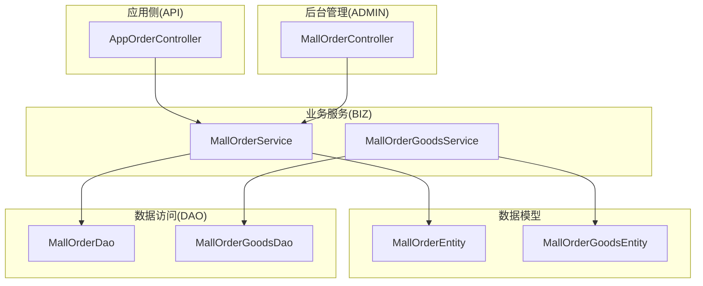
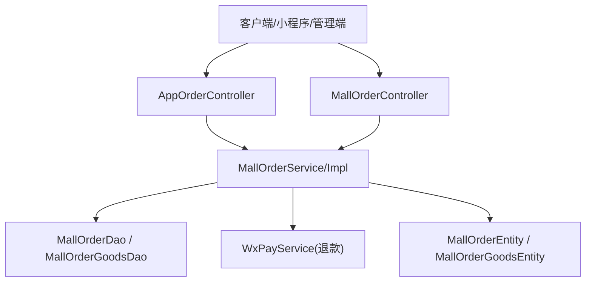
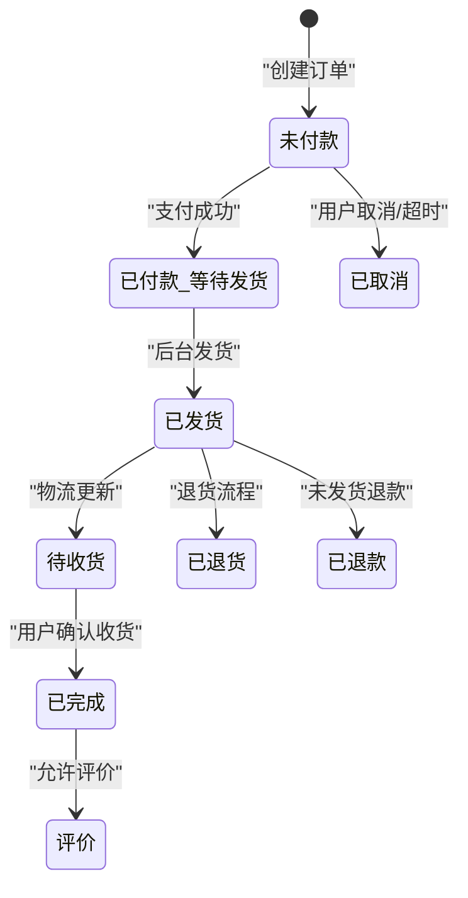
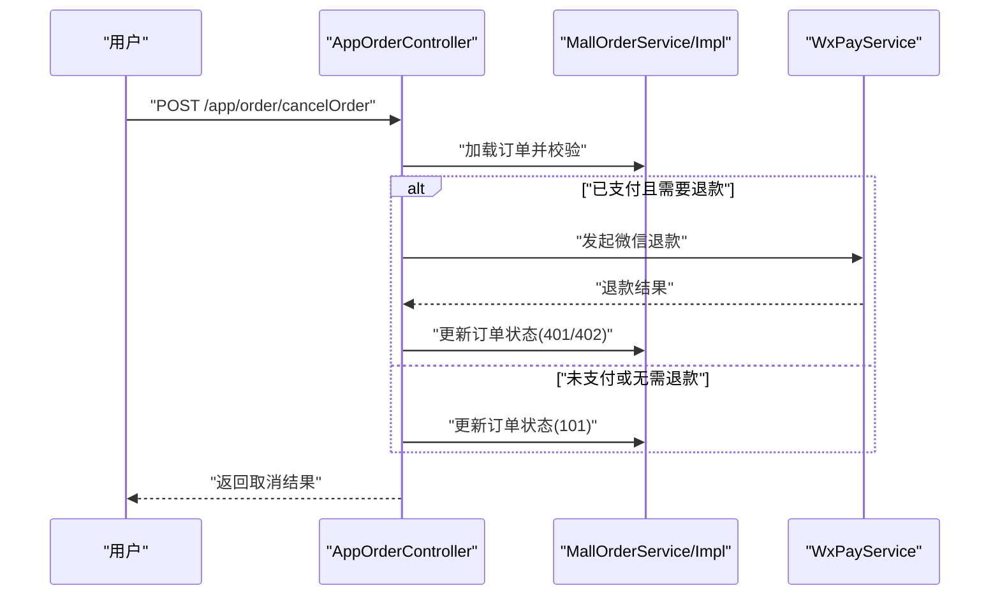
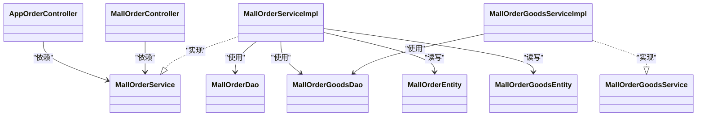

# 订单管理接口

<cite>
**本文引用的文件**
- [platform-admin/src/main/java/com/platform/modules/mall/controller/MallOrderController.java](file://platform-admin/src/main/java/com/platform/modules/mall/controller/MallOrderController.java)
- [platform-api/src/main/java/com/platform/modules/app/controller/AppOrderController.java](file://platform-api/src/main/java/com/platform/modules/app/controller/AppOrderController.java)
- [platform-biz/src/main/java/com/platform/modules/mall/service/MallOrderService.java](file://platform-biz/src/main/java/com/platform/modules/mall/service/MallOrderService.java)
- [platform-biz/src/main/java/com/platform/modules/mall/service/impl/MallOrderServiceImpl.java](file://platform-biz/src/main/java/com/platform/modules/mall/service/impl/MallOrderServiceImpl.java)
- [platform-biz/src/main/java/com/platform/modules/mall/entity/MallOrderEntity.java](file://platform-biz/src/main/java/com/platform/modules/mall/entity/MallOrderEntity.java)
- [platform-biz/src/main/java/com/platform/modules/mall/dao/MallOrderDao.java](file://platform-biz/src/main/java/com/platform/modules/mall/dao/MallOrderDao.java)
- [platform-biz/src/main/java/com/platform/modules/mall/service/MallOrderGoodsService.java](file://platform-biz/src/main/java/com/platform/modules/mall/service/MallOrderGoodsService.java)
- [platform-biz/src/main/java/com/platform/modules/mall/service/impl/MallOrderGoodsServiceImpl.java](file://platform-biz/src/main/java/com/platform/modules/mall/service/impl/MallOrderGoodsServiceImpl.java)
- [platform-biz/src/main/java/com/platform/modules/mall/entity/MallOrderGoodsEntity.java](file://platform-biz/src/main/java/com/platform/modules/mall/entity/MallOrderGoodsEntity.java)
- [platform-biz/src/main/java/com/platform/modules/mall/dao/MallOrderGoodsDao.java](file://platform-biz/src/main/java/com/platform/modules/mall/dao/MallOrderGoodsDao.java)
- [platform-api/src/main/java/com/platform/modules/app/request/ApiOrderSubmitRequest.java](file://platform-api/src/main/java/com/platform/modules/app/request/ApiOrderSubmitRequest.java)
- [wx-mall/pages/ucenter/orderDetail/orderDetail.js](file://wx-mall/pages/ucenter/orderDetail/orderDetail.js)
- [uni-mall/skills/mall-order-skill/SKILL.md](file://uni-mall/skills/mall-order-skill/SKILL.md)
- [wx-mall/skills/mall-order-skill/SKILL.md](file://wx-mall/skills/mall-order-skill/SKILL.md)
- [docs/时序架构图.mmd](file://docs/时序架构图.mmd)
</cite>

## 目录
1. [简介](#简介)
2. [项目结构](#项目结构)
3. [核心组件](#核心组件)
4. [架构总览](#架构总览)
5. [详细组件分析](#详细组件分析)
6. [依赖分析](#依赖分析)
7. [性能考虑](#性能考虑)
8. [故障排查指南](#故障排查指南)
9. [结论](#结论)
10. [附录](#附录)

## 简介
本接口文档聚焦订单生命周期管理与支付处理等核心业务API，覆盖订单创建、查询、发货、取消、确认收货、退款申请、订单详情与商品明细查询等关键能力。文档同时阐述订单状态机、支付流程集成、物流跟踪与售后服务等业务逻辑，并提供完整流程示例、状态转换图与异常处理策略，帮助前后端协同开发与运维排障。

## 项目结构
围绕订单管理的关键模块分布如下：
- 应用侧接口：AppOrderController 提供移动端/小程序侧订单相关能力
- 后台管理接口：MallOrderController 提供后台订单管理与运营操作
- 业务服务层：MallOrderService 及其实现负责订单提交、状态变更等核心逻辑
- 数据模型：MallOrderEntity、MallOrderGoodsEntity 反映订单与订单商品的数据结构
- DAO 层：MallOrderDao、MallOrderGoodsDao 负责数据库访问
- 小程序/前端技能：uni-mall 与 wx-mall 的订单技能与页面脚本用于展示与交互

图表来源
- [platform-api/src/main/java/com/platform/modules/app/controller/AppOrderController.java:1-271](file://platform-api/src/main/java/com/platform/modules/app/controller/AppOrderController.java#L1-271)
- [platform-admin/src/main/java/com/platform/modules/mall/controller/MallOrderController.java:1-262](file://platform-admin/src/main/java/com/platform/modules/mall/controller/MallOrderController.java#L1-262)
- [platform-biz/src/main/java/com/platform/modules/mall/service/MallOrderService.java:1-102](file://platform-biz/src/main/java/com/platform/modules/mall/service/MallOrderService.java#L1-102)
- [platform-biz/src/main/java/com/platform/modules/mall/service/impl/MallOrderServiceImpl.java:1-273](file://platform-biz/src/main/java/com/platform/modules/mall/service/impl/MallOrderServiceImpl.java#L1-273)
- [platform-biz/src/main/java/com/platform/modules/mall/entity/MallOrderEntity.java:1-362](file://platform-biz/src/main/java/com/platform/modules/mall/entity/MallOrderEntity.java#L1-362)
- [platform-biz/src/main/java/com/platform/modules/mall/entity/MallOrderGoodsEntity.java:1-200](file://platform-biz/src/main/java/com/platform/modules/mall/entity/MallOrderGoodsEntity.java#L1-200)
- [platform-biz/src/main/java/com/platform/modules/mall/dao/MallOrderDao.java](file://platform-biz/src/main/java/com/platform/modules/mall/dao/MallOrderDao.java)
- [platform-biz/src/main/java/com/platform/modules/mall/dao/MallOrderGoodsDao.java](file://platform-biz/src/main/java/com/platform/modules/mall/dao/MallOrderGoodsDao.java)

章节来源
- [platform-api/src/main/java/com/platform/modules/app/controller/AppOrderController.java:1-271](file://platform-api/src/main/java/com/platform/modules/app/controller/AppOrderController.java#L1-271)
- [platform-admin/src/main/java/com/platform/modules/mall/controller/MallOrderController.java:1-262](file://platform-admin/src/main/java/com/platform/modules/mall/controller/MallOrderController.java#L1-262)
- [platform-biz/src/main/java/com/platform/modules/mall/service/MallOrderService.java:1-102](file://platform-biz/src/main/java/com/platform/modules/mall/service/MallOrderService.java#L1-102)
- [platform-biz/src/main/java/com/platform/modules/mall/service/impl/MallOrderServiceImpl.java:1-273](file://platform-biz/src/main/java/com/platform/modules/mall/service/impl/MallOrderServiceImpl.java#L1-273)
- [platform-biz/src/main/java/com/platform/modules/mall/entity/MallOrderEntity.java:1-362](file://platform-biz/src/main/java/com/platform/modules/mall/entity/MallOrderEntity.java#L1-362)
- [platform-biz/src/main/java/com/platform/modules/mall/entity/MallOrderGoodsEntity.java:1-200](file://platform-biz/src/main/java/com/platform/modules/mall/entity/MallOrderGoodsEntity.java#L1-200)
- [platform-biz/src/main/java/com/platform/modules/mall/dao/MallOrderDao.java](file://platform-biz/src/main/java/com/platform/modules/mall/dao/MallOrderDao.java)
- [platform-biz/src/main/java/com/platform/modules/mall/dao/MallOrderGoodsDao.java](file://platform-biz/src/main/java/com/platform/modules/mall/dao/MallOrderGoodsDao.java)

## 核心组件
- AppOrderController：面向移动端/小程序的订单接口，包括列表、详情、提交、取消、确认收货等
- MallOrderController：面向后台管理的订单接口，包括列表、详情、发货、改价、删除等
- MallOrderService/Impl：订单业务逻辑封装，含订单提交、状态变更、分页查询等
- MallOrderEntity：订单主表实体，定义订单状态、支付状态、物流状态、金额等字段
- MallOrderGoodsService/Impl：订单商品明细服务，支撑订单详情中的商品列表
- MallOrderGoodsEntity：订单商品明细实体，支撑订单详情与售后场景

章节来源
- [platform-api/src/main/java/com/platform/modules/app/controller/AppOrderController.java:1-271](file://platform-api/src/main/java/com/platform/modules/app/controller/AppOrderController.java#L1-271)
- [platform-admin/src/main/java/com/platform/modules/mall/controller/MallOrderController.java:1-262](file://platform-admin/src/main/java/com/platform/modules/mall/controller/MallOrderController.java#L1-262)
- [platform-biz/src/main/java/com/platform/modules/mall/service/MallOrderService.java:1-102](file://platform-biz/src/main/java/com/platform/modules/mall/service/MallOrderService.java#L1-102)
- [platform-biz/src/main/java/com/platform/modules/mall/service/impl/MallOrderServiceImpl.java:1-273](file://platform-biz/src/main/java/com/platform/modules/mall/service/impl/MallOrderServiceImpl.java#L1-273)
- [platform-biz/src/main/java/com/platform/modules/mall/entity/MallOrderEntity.java:1-362](file://platform-biz/src/main/java/com/platform/modules/mall/entity/MallOrderEntity.java#L1-362)
- [platform-biz/src/main/java/com/platform/modules/mall/service/MallOrderGoodsService.java](file://platform-biz/src/main/java/com/platform/modules/mall/service/MallOrderGoodsService.java)
- [platform-biz/src/main/java/com/platform/modules/mall/service/impl/MallOrderGoodsServiceImpl.java](file://platform-biz/src/main/java/com/platform/modules/mall/service/impl/MallOrderGoodsServiceImpl.java)
- [platform-biz/src/main/java/com/platform/modules/mall/entity/MallOrderGoodsEntity.java:1-200](file://platform-biz/src/main/java/com/platform/modules/mall/entity/MallOrderGoodsEntity.java#L1-200)

## 架构总览
系统采用“接口层-业务层-数据层”的分层架构，AppOrderController 与 MallOrderController 分别面向终端用户与后台运营；业务层通过 MallOrderService/Impl 组织订单生命周期逻辑；DAO 层负责持久化；微信支付服务在取消订单时参与退款流程。

图表来源
- [platform-api/src/main/java/com/platform/modules/app/controller/AppOrderController.java:1-271](file://platform-api/src/main/java/com/platform/modules/app/controller/AppOrderController.java#L1-271)
- [platform-admin/src/main/java/com/platform/modules/mall/controller/MallOrderController.java:1-262](file://platform-admin/src/main/java/com/platform/modules/mall/controller/MallOrderController.java#L1-262)
- [platform-biz/src/main/java/com/platform/modules/mall/service/impl/MallOrderServiceImpl.java:1-273](file://platform-biz/src/main/java/com/platform/modules/mall/service/impl/MallOrderServiceImpl.java#L1-273)
- [platform-biz/src/main/java/com/platform/modules/mall/dao/MallOrderDao.java](file://platform-biz/src/main/java/com/platform/modules/mall/dao/MallOrderDao.java)
- [platform-biz/src/main/java/com/platform/modules/mall/dao/MallOrderGoodsDao.java](file://platform-biz/src/main/java/com/platform/modules/mall/dao/MallOrderGoodsDao.java)

## 详细组件分析

### 订单生命周期与状态机
订单状态采用单一字段表达，结合订单状态、支付状态、物流状态共同描述业务进展。状态机设计遵循“下单-支付-发货-收货-完成/售后”的主线流程。

图表来源
- [platform-biz/src/main/java/com/platform/modules/mall/entity/MallOrderEntity.java:270-360](file://platform-biz/src/main/java/com/platform/modules/mall/entity/MallOrderEntity.java#L270-360)
- [docs/时序架构图.mmd:49-64](file://docs/时序架构图.mmd#L49-L64)

章节来源
- [platform-biz/src/main/java/com/platform/modules/mall/entity/MallOrderEntity.java:270-360](file://platform-biz/src/main/java/com/platform/modules/mall/entity/MallOrderEntity.java#L270-360)
- [docs/时序架构图.mmd:49-64](file://docs/时序架构图.mmd#L49-L64)

### 订单创建（App侧）
- 接口方法与路径
  - 方法：POST
  - 路径：/app/order/submit
- 请求参数
  - addressId：收货地址ID
  - couponId：优惠券ID
  - type：下单类型（cart 或其他）
  - postscript：买家留言
- 业务说明
  - 根据 type 决定从购物车或直接购买生成订单
  - 计算商品总价、运费、优惠券抵扣后得出实际应付金额
  - 设置订单状态为“未付款”，并写入订单商品明细
- 响应格式
  - 成功返回订单信息；失败返回错误码与消息

章节来源
- [platform-api/src/main/java/com/platform/modules/app/controller/AppOrderController.java:165-195](file://platform-api/src/main/java/com/platform/modules/app/controller/AppOrderController.java#L165-195)
- [platform-biz/src/main/java/com/platform/modules/mall/service/impl/MallOrderServiceImpl.java:126-266](file://platform-biz/src/main/java/com/platform/modules/mall/service/impl/MallOrderServiceImpl.java#L126-266)
- [platform-api/src/main/java/com/platform/modules/app/request/ApiOrderSubmitRequest.java](file://platform-api/src/main/java/com/platform/modules/app/request/ApiOrderSubmitRequest.java)

### 订单查询（App侧）
- 接口方法与路径
  - 获取订单列表：POST /app/order/list
  - 获取订单详情：POST /app/order/detail
- 请求参数
  - 列表：page、size、userId（登录态注入）
  - 详情：orderId、userId（登录态注入）
- 业务说明
  - 列表按添加时间倒序返回，聚合商品数量与商品明细
  - 详情返回订单主信息、商品明细、可操作选项与物流信息占位
- 响应格式
  - 列表：包含 list、total、page、limit
  - 详情：包含 orderInfo、orderGoods、handleOption、shippingList

章节来源
- [platform-api/src/main/java/com/platform/modules/app/controller/AppOrderController.java:56-134](file://platform-api/src/main/java/com/platform/modules/app/controller/AppOrderController.java#L56-134)

### 订单取消（App侧）
- 接口方法与路径
  - 方法：POST
  - 路径：/app/order/cancelOrder
- 请求参数
  - orderId：订单ID
- 业务说明
  - 校验订单存在性与用户权限
  - 已发货/已收货不可取消
  - 已支付订单走微信支付退款流程，成功后设置相应状态（401/402），否则仅标记为已取消
- 响应格式
  - 成功/失败返回提示信息

图表来源
- [platform-api/src/main/java/com/platform/modules/app/controller/AppOrderController.java:197-244](file://platform-api/src/main/java/com/platform/modules/app/controller/AppOrderController.java#L197-244)
- [platform-biz/src/main/java/com/platform/modules/mall/service/impl/MallOrderServiceImpl.java:126-266](file://platform-biz/src/main/java/com/platform/modules/mall/service/impl/MallOrderServiceImpl.java#L126-266)

章节来源
- [platform-api/src/main/java/com/platform/modules/app/controller/AppOrderController.java:197-244](file://platform-api/src/main/java/com/platform/modules/app/controller/AppOrderController.java#L197-244)
- [wx-mall/pages/ucenter/orderDetail/orderDetail.js:48-106](file://wx-mall/pages/ucenter/orderDetail/orderDetail.js#L48-106)

### 确认收货（App侧）
- 接口方法与路径
  - 方法：POST
  - 路径：/app/order/confirmOrder
- 请求参数
  - orderId：订单ID
- 业务说明
  - 校验订单存在性与用户权限
  - 更新订单状态为“已完成”，物流状态为“已收货”，并记录确认时间
- 响应格式
  - 成功/失败返回提示信息

章节来源
- [platform-api/src/main/java/com/platform/modules/app/controller/AppOrderController.java:246-269](file://platform-api/src/main/java/com/platform/modules/app/controller/AppOrderController.java#L246-269)
- [docs/时序架构图.mmd:57-64](file://docs/时序架构图.mmd#L57-L64)

### 后台发货（Admin侧）
- 接口方法与路径
  - 方法：POST
  - 路径：/mall/order/ship
- 请求参数
  - id：订单ID
  - shippingNo：物流单号
  - shippingName：快递公司
- 业务说明
  - 校验订单存在性与支付状态
  - 仅未发货订单可发货，更新物流状态与订单状态，并写入物流信息
- 响应格式
  - 成功/失败返回提示信息

章节来源
- [platform-admin/src/main/java/com/platform/modules/mall/controller/MallOrderController.java:150-198](file://platform-admin/src/main/java/com/platform/modules/mall/controller/MallOrderController.java#L150-198)

### 支付前改价（Admin侧）
- 接口方法与路径
  - 方法：POST
  - 路径：/mall/order/adjustPrice
- 请求参数
  - id：订单ID
  - actualPrice：调整后的实付金额
- 业务说明
  - 仅未支付订单允许改价，更新实付金额与订单金额
- 响应格式
  - 成功/失败返回提示信息

章节来源
- [platform-admin/src/main/java/com/platform/modules/mall/controller/MallOrderController.java:200-245](file://platform-admin/src/main/java/com/platform/modules/mall/controller/MallOrderController.java#L200-245)

### 订单查询与详情（Admin侧）
- 接口方法与路径
  - 获取订单列表：GET /mall/order/list
  - 获取订单详情：GET /mall/order/info/{id}
  - 获取订单商品明细：GET /mall/order/goods/{id}
- 请求参数
  - 列表：分页参数与筛选条件
  - 详情：id
  - 明细：orderId
- 业务说明
  - 列表支持分页与排序
  - 详情返回订单与商品明细
- 响应格式
  - 列表：分页对象
  - 详情：订单实体
  - 明细：订单商品列表

章节来源
- [platform-admin/src/main/java/com/platform/modules/mall/controller/MallOrderController.java:60-119](file://platform-admin/src/main/java/com/platform/modules/mall/controller/MallOrderController.java#L60-119)

### 订单删除（Admin侧）
- 接口方法与路径
  - 方法：POST
  - 路径：/mall/order/delete
- 请求参数
  - ids：订单ID数组
- 业务说明
  - 批量删除订单
- 响应格式
  - 成功/失败返回提示信息

章节来源
- [platform-admin/src/main/java/com/platform/modules/mall/controller/MallOrderController.java:247-260](file://platform-admin/src/main/java/com/platform/modules/mall/controller/MallOrderController.java#L247-260)

### 评价管理（App侧）
- 接口方法与路径
  - 获取订单详情：POST /app/order/detail（已包含 handleOption）
- 业务说明
  - 已完成订单可进行“评价”操作
  - 评价相关接口由 AppCommentController 提供，此处聚焦订单详情中可操作项
- 响应格式
  - 返回订单详情与 handleOption 中的 comment 字段标识

章节来源
- [platform-api/src/main/java/com/platform/modules/app/controller/AppOrderController.java:96-134](file://platform-api/src/main/java/com/platform/modules/app/controller/AppOrderController.java#L96-134)
- [platform-biz/src/main/java/com/platform/modules/mall/entity/MallOrderEntity.java:304-360](file://platform-biz/src/main/java/com/platform/modules/mall/entity/MallOrderEntity.java#L304-360)

### 退款申请（App侧）
- 触发点
  - 已支付但未发货：走微信退款，状态变更为“已退款”
  - 已发货：走退货流程，状态变更为“已退货”
- 流程参考
  - 取消订单流程已内置退款逻辑，详见“订单取消（App侧）”

章节来源
- [platform-api/src/main/java/com/platform/modules/app/controller/AppOrderController.java:217-238](file://platform-api/src/main/java/com/platform/modules/app/controller/AppOrderController.java#L217-238)

### 物流跟踪（App侧）
- 接口方法与路径
  - 获取订单详情：POST /app/order/detail（返回 shippingList 占位）
- 业务说明
  - 详情页预留物流信息展示位置，实际物流轨迹可由外部服务对接
- 响应格式
  - 返回订单详情与 shippingList（占位）

章节来源
- [platform-api/src/main/java/com/platform/modules/app/controller/AppOrderController.java:96-134](file://platform-api/src/main/java/com/platform/modules/app/controller/AppOrderController.java#L96-134)

### 订单流程示例
- 场景一：用户下单并支付
  - 步骤：提交订单 → 支付 → 后台发货 → 用户确认收货 → 完成
- 场景二：用户申请退款
  - 步骤：提交订单 → 支付 → 用户取消（已支付）→ 微信退款 → 状态变更
- 场景三：用户申请退货
  - 步骤：提交订单 → 支付 → 后台发货 → 用户取消（已发货）→ 退货流程 → 状态变更

章节来源
- [docs/时序架构图.mmd:49-64](file://docs/时序架构图.mmd#L49-L64)
- [platform-api/src/main/java/com/platform/modules/app/controller/AppOrderController.java:197-244](file://platform-api/src/main/java/com/platform/modules/app/controller/AppOrderController.java#L197-244)

## 依赖分析
- 控制器到服务层
  - AppOrderController 依赖 MallOrderService 与 MallOrderGoodsService
  - MallOrderController 依赖 MallOrderService 与 MallOrderGoodsService
- 服务层到 DAO 层
  - MallOrderServiceImpl 依赖 MallOrderDao、MallOrderGoodsDao 等
- 实体模型
  - MallOrderEntity 与 MallOrderGoodsEntity 作为数据载体，贯穿各层

图表来源
- [platform-api/src/main/java/com/platform/modules/app/controller/AppOrderController.java:1-271](file://platform-api/src/main/java/com/platform/modules/app/controller/AppOrderController.java#L1-271)
- [platform-admin/src/main/java/com/platform/modules/mall/controller/MallOrderController.java:1-262](file://platform-admin/src/main/java/com/platform/modules/mall/controller/MallOrderController.java#L1-262)
- [platform-biz/src/main/java/com/platform/modules/mall/service/MallOrderService.java:1-102](file://platform-biz/src/main/java/com/platform/modules/mall/service/MallOrderService.java#L1-102)
- [platform-biz/src/main/java/com/platform/modules/mall/service/impl/MallOrderServiceImpl.java:1-273](file://platform-biz/src/main/java/com/platform/modules/mall/service/impl/MallOrderServiceImpl.java#L1-273)
- [platform-biz/src/main/java/com/platform/modules/mall/service/MallOrderGoodsService.java](file://platform-biz/src/main/java/com/platform/modules/mall/service/MallOrderGoodsService.java)
- [platform-biz/src/main/java/com/platform/modules/mall/service/impl/MallOrderGoodsServiceImpl.java](file://platform-biz/src/main/java/com/platform/modules/mall/service/impl/MallOrderGoodsServiceImpl.java)
- [platform-biz/src/main/java/com/platform/modules/mall/entity/MallOrderEntity.java:1-362](file://platform-biz/src/main/java/com/platform/modules/mall/entity/MallOrderEntity.java#L1-362)
- [platform-biz/src/main/java/com/platform/modules/mall/entity/MallOrderGoodsEntity.java:1-200](file://platform-biz/src/main/java/com/platform/modules/mall/entity/MallOrderGoodsEntity.java#L1-200)
- [platform-biz/src/main/java/com/platform/modules/mall/dao/MallOrderDao.java](file://platform-biz/src/main/java/com/platform/modules/mall/dao/MallOrderDao.java)
- [platform-biz/src/main/java/com/platform/modules/mall/dao/MallOrderGoodsDao.java](file://platform-biz/src/main/java/com/platform/modules/mall/dao/MallOrderGoodsDao.java)

章节来源
- [platform-api/src/main/java/com/platform/modules/app/controller/AppOrderController.java:1-271](file://platform-api/src/main/java/com/platform/modules/app/controller/AppOrderController.java#L1-271)
- [platform-admin/src/main/java/com/platform/modules/mall/controller/MallOrderController.java:1-262](file://platform-admin/src/main/java/com/platform/modules/mall/controller/MallOrderController.java#L1-262)
- [platform-biz/src/main/java/com/platform/modules/mall/service/MallOrderService.java:1-102](file://platform-biz/src/main/java/com/platform/modules/mall/service/MallOrderService.java#L1-102)
- [platform-biz/src/main/java/com/platform/modules/mall/service/impl/MallOrderServiceImpl.java:1-273](file://platform-biz/src/main/java/com/platform/modules/mall/service/impl/MallOrderServiceImpl.java#L1-273)
- [platform-biz/src/main/java/com/platform/modules/mall/entity/MallOrderEntity.java:1-362](file://platform-biz/src/main/java/com/platform/modules/mall/entity/MallOrderEntity.java#L1-362)
- [platform-biz/src/main/java/com/platform/modules/mall/entity/MallOrderGoodsEntity.java:1-200](file://platform-biz/src/main/java/com/platform/modules/mall/entity/MallOrderGoodsEntity.java#L1-200)

## 性能考虑
- 分页查询：列表接口统一使用分页参数，避免一次性加载大量订单数据
- 事务控制：订单提交与订单商品明细插入在事务内完成，保证一致性
- 缓存与热点：订单金额与优惠券等可结合缓存优化，减少重复计算
- 并发控制：取消订单与发货等关键操作需注意幂等与并发安全

## 故障排查指南
- 订单不存在
  - 现象：返回“订单不存在”
  - 排查：确认订单ID与用户是否匹配
- 权限校验失败
  - 现象：返回“越权操作”
  - 排查：确认登录态与订单归属
- 状态不满足操作
  - 现象：如“已发货，不能取消”、“已收货，不能取消”
  - 排查：检查订单状态与业务规则
- 退款失败
  - 现象：取消订单时退款异常
  - 排查：核对微信支付配置、订单金额、商户号与签名

章节来源
- [platform-api/src/main/java/com/platform/modules/app/controller/AppOrderController.java:200-244](file://platform-api/src/main/java/com/platform/modules/app/controller/AppOrderController.java#L200-244)
- [platform-admin/src/main/java/com/platform/modules/mall/controller/MallOrderController.java:150-198](file://platform-admin/src/main/java/com/platform/modules/mall/controller/MallOrderController.java#L150-198)

## 结论
本文档梳理了订单管理的核心接口与业务流程，明确了订单状态机、支付与退款集成、物流跟踪与售后服务的边界与实现要点。建议在后续迭代中完善前端交互提示、日志监控与异常告警，确保订单生命周期的稳定性与用户体验。

## 附录
- 订单技能与页面
  - uni-mall 与 wx-mall 的订单技能用于订单列表与详情查询，便于语音/文本交互场景快速定位订单
- 状态字段说明
  - 订单状态、支付状态、物流状态均以整型字段表达，具体含义见实体类注释与状态机图

章节来源
- [uni-mall/skills/mall-order-skill/SKILL.md:1-8](file://uni-mall/skills/mall-order-skill/SKILL.md#L1-8)
- [wx-mall/skills/mall-order-skill/SKILL.md:1-8](file://wx-mall/skills/mall-order-skill/SKILL.md#L1-8)
- [platform-biz/src/main/java/com/platform/modules/mall/entity/MallOrderEntity.java:270-360](file://platform-biz/src/main/java/com/platform/modules/mall/entity/MallOrderEntity.java#L270-360)