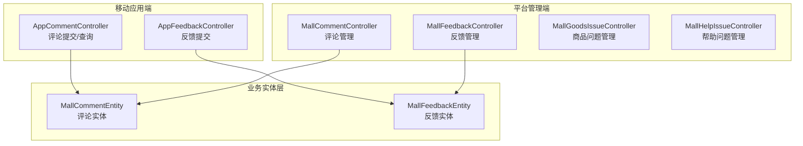
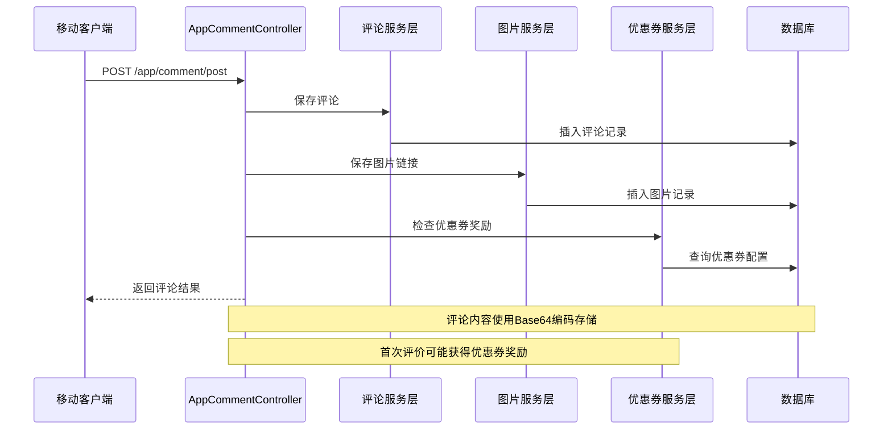
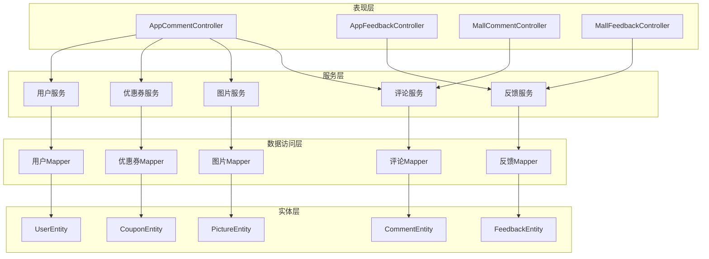

# 评论与咨询接口

<cite>
**本文档引用的文件**
- [MallCommentController.java](file://platform-admin/src/main/java/com/platform/modules/mall/controller/MallCommentController.java)
- [AppCommentController.java](file://platform-api/src/main/java/com/platform/modules/app/controller/AppCommentController.java)
- [MallFeedbackController.java](file://platform-admin/src/main/java/com/platform/modules/mall/controller/MallFeedbackController.java)
- [AppFeedbackController.java](file://platform-api/src/main/java/com/platform/modules/app/controller/AppFeedbackController.java)
- [MallGoodsIssueController.java](file://platform-admin/src/main/java/com/platform/modules/mall/controller/MallGoodsIssueController.java)
- [MallHelpIssueController.java](file://platform-admin/src/main/java/com/platform/modules/mall/controller/MallHelpIssueController.java)
- [ApiCommentPostRequest.java](file://platform-api/src/main/java/com/platform/modules/app/request/ApiCommentPostRequest.java)
- [ApiFeedbackSaveRequest.java](file://platform-api/src/main/java/com/platform/modules/app/request/ApiFeedbackSaveRequest.java)
- [MallCommentEntity.java](file://platform-biz/src/main/java/com/platform/modules/mall/entity/MallCommentEntity.java)
- [MallFeedbackEntity.java](file://platform-biz/src/main/java/com/platform/modules/mall/entity/MallFeedbackEntity.java)
</cite>

## 目录
1. [简介](#简介)
2. [项目结构](#项目结构)
3. [核心组件](#核心组件)
4. [架构概览](#架构概览)
5. [详细组件分析](#详细组件分析)
6. [依赖分析](#依赖分析)
7. [性能考虑](#性能考虑)
8. [故障排除指南](#故障排除指南)
9. [结论](#结论)

## 简介

本文件详细说明平台系统的评论与咨询相关API接口，涵盖商品评价、帮助咨询等用户互动功能。文档包含以下核心接口：

- 商品评价提交（App端）
- 评价列表查询（App端）
- 评价图片上传（App端）
- 帮助问题提交（App端）
- 帮助类型查询（管理端）
- 常见问题查看（管理端）

每个接口均记录HTTP方法、URL路径、请求参数、审核机制和响应格式，并说明评价内容审核、图片处理、用户权益保护和客服响应机制。

## 项目结构

评论与咨询功能主要分布在三个模块中：
- 平台管理端（platform-admin）：提供后台管理接口，用于评论和反馈的审核、查询和管理
- 移动应用端（platform-api）：提供面向移动端用户的评论和反馈接口
- 业务实体层（platform-biz）：定义评论、反馈、商品问题、帮助问题等核心数据模型



**图表来源**
- [MallCommentController.java:46-108](file://platform-admin/src/main/java/com/platform/modules/mall/controller/MallCommentController.java#L46-L108)
- [AppCommentController.java:34-181](file://platform-api/src/main/java/com/platform/modules/app/controller/AppCommentController.java#L34-L181)
- [MallFeedbackController.java:44-148](file://platform-admin/src/main/java/com/platform/modules/mall/controller/MallFeedbackController.java#L44-L148)
- [AppFeedbackController.java:27-53](file://platform-api/src/main/java/com/platform/modules/app/controller/AppFeedbackController.java#L27-L53)

## 核心组件

### 评论相关组件

系统提供完整的评论生命周期管理，包括提交、审核、展示和统计功能。

**章节来源**
- [MallCommentController.java:46-108](file://platform-admin/src/main/java/com/platform/modules/mall/controller/MallCommentController.java#L46-L108)
- [AppCommentController.java:34-181](file://platform-api/src/main/java/com/platform/modules/app/controller/AppCommentController.java#L34-L181)

### 反馈相关组件

提供用户反馈收集和管理功能，支持多种反馈类型和状态管理。

**章节来源**
- [MallFeedbackController.java:44-148](file://platform-admin/src/main/java/com/platform/modules/mall/controller/MallFeedbackController.java#L44-L148)
- [AppFeedbackController.java:27-53](file://platform-api/src/main/java/com/platform/modules/app/controller/AppFeedbackController.java#L27-L53)

### 问题管理组件

管理商品常见问题和帮助问题，为用户提供自助查询服务。

**章节来源**
- [MallGoodsIssueController.java:44-148](file://platform-admin/src/main/java/com/platform/modules/mall/controller/MallGoodsIssueController.java#L44-L148)
- [MallHelpIssueController.java:44-148](file://platform-admin/src/main/java/com/platform/modules/mall/controller/MallHelpIssueController.java#L44-L148)

## 架构概览

系统采用前后端分离架构，评论与咨询功能通过RESTful API进行交互：



**图表来源**
- [AppCommentController.java:48-115](file://platform-api/src/main/java/com/platform/modules/app/controller/AppCommentController.java#L48-L115)
- [MallCommentEntity.java](file://platform-biz/src/main/java/com/platform/modules/mall/entity/MallCommentEntity.java)

## 详细组件分析

### 商品评价接口

#### 评价提交接口

**接口定义**
- HTTP方法：POST
- URL路径：`/app/comment/post`
- 认证要求：需要登录用户令牌
- 功能描述：用户提交商品评价，支持文本内容和图片上传

**请求参数**
- typeId：评价类型标识（0表示商品评价）
- valueId：评价对象ID（对应商品ID）
- content：评价内容（支持Base64编码）
- imagesList：图片URL列表

**响应格式**
```json
{
  "code": 0,
  "message": "评论添加成功",
  "data": {
    "coupon": {
      "id": 1,
      "name": "新用户优惠券",
      "amount": 100
    }
  }
}
```

**审核机制**
- 评价状态默认设置为0（待审核）
- 管理员可在后台进行审核和管理
- 内容自动进行Base64编码存储

**章节来源**
- [AppCommentController.java:48-115](file://platform-api/src/main/java/com/platform/modules/app/controller/AppCommentController.java#L48-L115)
- [ApiCommentPostRequest.java](file://platform-api/src/main/java/com/platform/modules/app/request/ApiCommentPostRequest.java)

#### 评价列表查询接口

**接口定义**
- HTTP方法：POST
- URL路径：`/app/comment/list`
- 认证要求：无需登录
- 功能描述：查询指定商品的评价列表

**请求参数**
- typeId：评价类型（0=商品）
- valueId：商品ID
- showType：显示类型（1=仅显示有图片的评价）
- page：页码，默认1
- size：每页数量，默认10
- sort：排序字段
- order：排序方式（asc/desc）

**响应格式**
```json
{
  "code": 0,
  "message": "操作成功",
  "data": {
    "records": [
      {
        "id": 1,
        "userId": 1001,
        "userName": "张三",
        "content": "商品质量很好",
        "addTime": 1640995200,
        "picList": [
          {
            "id": 1,
            "commentId": 1,
            "picUrl": "https://example.com/image.jpg"
          }
        ]
      }
    ],
    "total": 150,
    "current": 1
  }
}
```

**处理逻辑**
- 自动解码Base64内容
- 关联用户信息查询
- 组装图片列表数据

**章节来源**
- [AppCommentController.java:136-180](file://platform-api/src/main/java/com/platform/modules/app/controller/AppCommentController.java#L136-L180)

#### 评价统计接口

**接口定义**
- HTTP方法：POST
- URL路径：`/app/comment/count`
- 功能描述：统计指定商品的评价总数和带图片评价数量

**请求参数**
- typeId：评价类型（0=商品）
- valueId：商品ID

**响应格式**
```json
{
  "code": 0,
  "message": "操作成功",
  "data": {
    "allCount": 150,
    "hasPicCount": 80
  }
}
```

**章节来源**
- [AppCommentController.java:117-134](file://platform-api/src/main/java/com/platform/modules/app/controller/AppCommentController.java#L117-L134)

### 帮助咨询接口

#### 反馈提交接口

**接口定义**
- HTTP方法：POST
- URL路径：`/app/feedback/save`
- 认证要求：需要登录用户令牌
- 功能描述：用户提交帮助咨询或问题反馈

**请求参数**
- mobile：用户手机号
- index：反馈类型（字典值）
- content：反馈内容

**响应格式**
```json
{
  "code": 0,
  "message": "感谢你的反馈",
  "data": {}
}
```

**状态机制**
- 状态字段默认设置为1（已读）
- 管理员可在后台查看和处理

**章节来源**
- [AppFeedbackController.java:33-52](file://platform-api/src/main/java/com/platform/modules/app/controller/AppFeedbackController.java#L33-L52)
- [ApiFeedbackSaveRequest.java](file://platform-api/src/main/java/com/platform/modules/app/request/ApiFeedbackSaveRequest.java)

#### 反馈管理接口

**管理端接口**
- 列表查询：GET `/mall/feedback/list`
- 详情查询：GET `/mall/feedback/info/{msgId}`
- 新增反馈：POST `/mall/feedback/save`
- 更新反馈：POST `/mall/feedback/update`
- 删除反馈：POST `/mall/feedback/delete`

**查询参数**
- page：页码
- limit：每页数量
- nickname：会员昵称
- mobile：手机号
- status：状态（0=未读，1=已读）
- feedType：反馈类型

**章节来源**
- [MallFeedbackController.java:58-147](file://platform-admin/src/main/java/com/platform/modules/mall/controller/MallFeedbackController.java#L58-L147)

### 问题管理接口

#### 商品问题管理

**管理端接口**
- 列表查询：GET `/mall/goodsissue/list`
- 详情查询：GET `/mall/goodsissue/info/{id}`
- 新增问题：POST `/mall/goodsissue/save`
- 更新问题：POST `/mall/goodsissue/update`
- 删除问题：POST `/mall/goodsissue/delete`

**数据结构**
```json
{
  "id": 1,
  "question": "如何申请退货？",
  "answer": "请在订单完成后7天内申请退货",
  "sortOrder": 1,
  "addTime": 1640995200
}
```

**章节来源**
- [MallGoodsIssueController.java:58-147](file://platform-admin/src/main/java/com/platform/modules/mall/controller/MallGoodsIssueController.java#L58-L147)

#### 帮助问题管理

**管理端接口**
- 列表查询：GET `/mall/helpissue/list`
- 详情查询：GET `/mall/helpissue/info/{id}`
- 新增问题：POST `/mall/helpissue/save`
- 更新问题：POST `/mall/helpissue/update`
- 删除问题：POST `/mall/helpissue/delete`

**章节来源**
- [MallHelpIssueController.java:58-147](file://platform-admin/src/main/java/com/platform/modules/mall/controller/MallHelpIssueController.java#L58-L147)

## 依赖分析

系统采用分层架构设计，各组件间依赖关系清晰：



**图表来源**
- [AppCommentController.java:34-46](file://platform-api/src/main/java/com/platform/modules/app/controller/AppCommentController.java#L34-L46)
- [AppFeedbackController.java:27-32](file://platform-api/src/main/java/com/platform/modules/app/controller/AppFeedbackController.java#L27-L32)
- [MallCommentController.java:46-52](file://platform-admin/src/main/java/com/platform/modules/mall/controller/MallCommentController.java#L46-L52)
- [MallFeedbackController.java:44-50](file://platform-admin/src/main/java/com/platform/modules/mall/controller/MallFeedbackController.java#L44-L50)

## 性能考虑

### 缓存策略
- 评价列表查询结果可考虑缓存热门商品的评价数据
- 用户信息查询可利用Redis缓存减少数据库压力
- 图片URL可使用CDN加速提升加载速度

### 分页优化
- 大数据量场景下确保分页查询的索引优化
- 评价图片列表按需加载，避免一次性传输大量数据

### 安全防护
- 评论内容进行XSS过滤和敏感词检测
- 文件上传进行类型验证和大小限制
- 接口调用频率限制防止恶意刷单

## 故障排除指南

### 常见问题诊断

**评论提交失败**
1. 检查用户登录状态是否有效
2. 验证请求参数完整性
3. 确认服务依赖（评论服务、图片服务）正常运行

**图片上传异常**
1. 检查图片URL是否可访问
2. 验证文件类型和大小限制
3. 确认存储服务配置正确

**反馈接收延迟**
1. 检查消息队列处理状态
2. 验证邮件/短信通知配置
3. 确认管理员账号状态

### 错误码说明

| 错误码 | 描述 | 处理建议 |
|--------|------|----------|
| 0 | 操作成功 | 正常流程 |
| -1 | 参数错误 | 检查请求参数 |
| -2 | 权限不足 | 验证用户权限 |
| -3 | 服务器错误 | 检查服务日志 |

**章节来源**
- [AppCommentController.java:110-114](file://platform-api/src/main/java/com/platform/modules/app/controller/AppCommentController.java#L110-L114)
- [AppFeedbackController.java:49-51](file://platform-api/src/main/java/com/platform/modules/app/controller/AppFeedbackController.java#L49-L51)

## 结论

本评论与咨询接口文档提供了完整的API规范和实现细节。系统通过合理的分层架构实现了用户互动功能的完整闭环：

- **用户体验**：简洁直观的移动端接口，支持图文并茂的评价体验
- **管理效率**：完善的后台管理系统，支持批量审核和统计分析
- **数据安全**：多重安全防护机制，保护用户隐私和数据安全
- **扩展性**：模块化设计便于功能扩展和维护升级

建议在实际部署中重点关注缓存策略、安全防护和监控告警机制，确保系统的稳定性和可靠性。