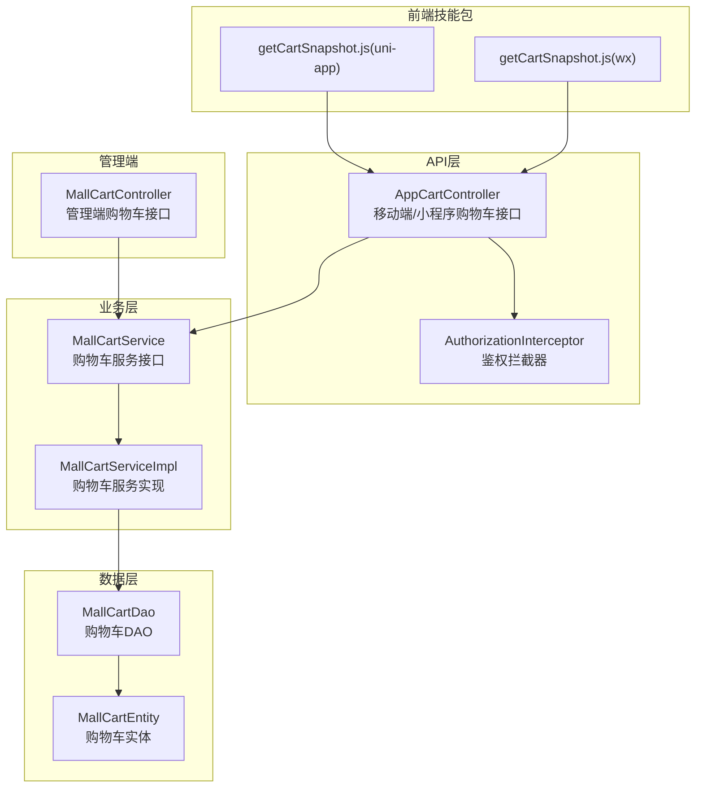
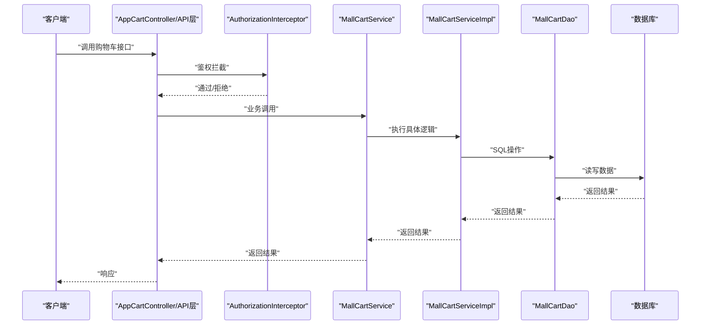
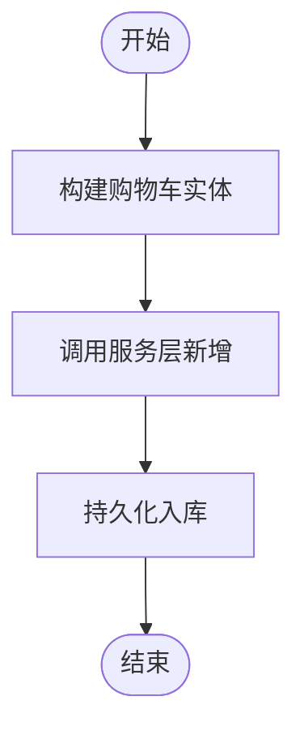
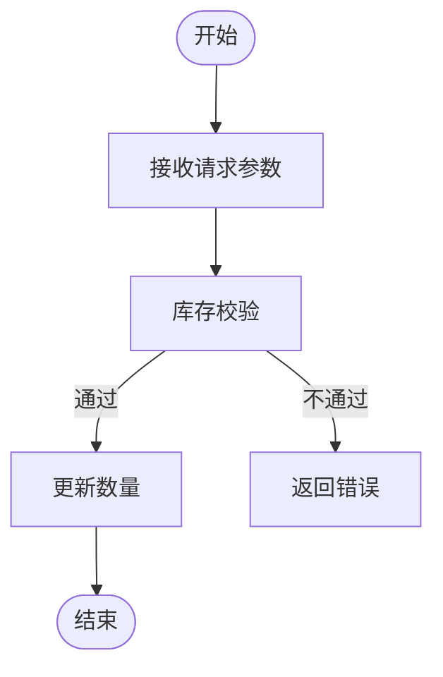
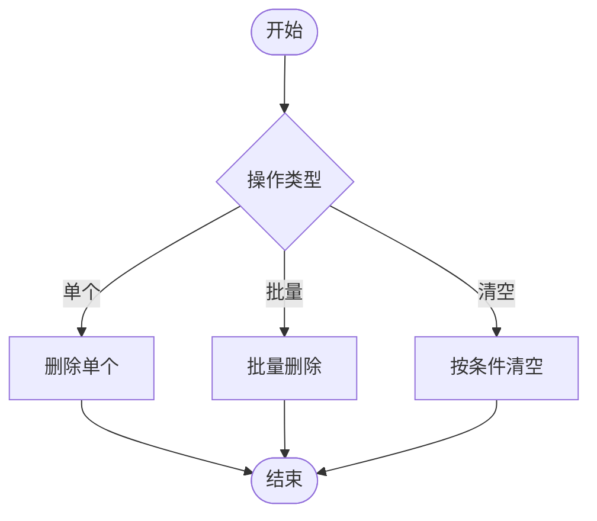
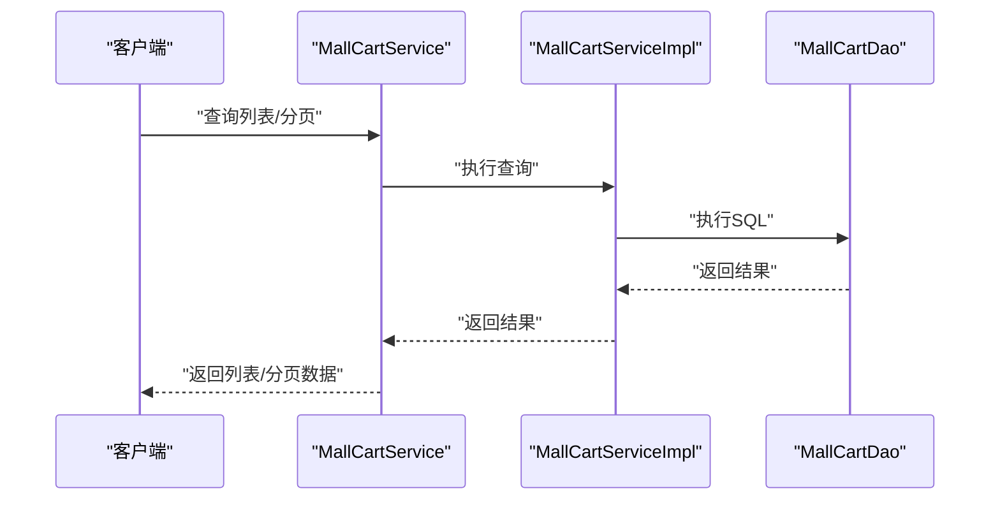
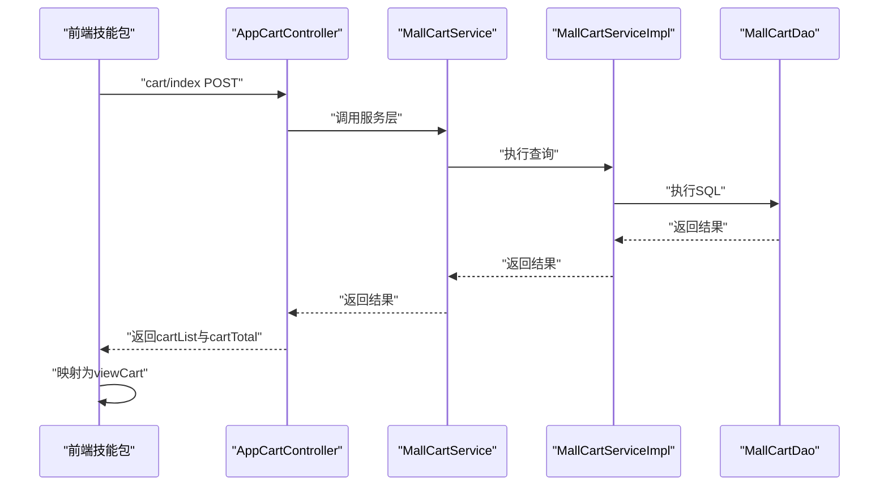
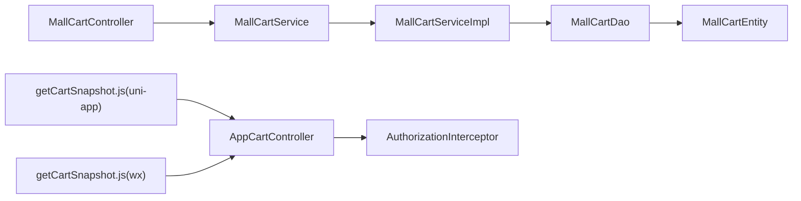

# 购物车接口

<cite>
**本文引用的文件**
- [MallCartController.java](file://platform-admin/src/main/java/com/platform/modules/mall/controller/MallCartController.java)
- [MallCartService.java](file://platform-biz/src/main/java/com/platform/modules/mall/service/MallCartService.java)
- [MallCartServiceImpl.java](file://platform-biz/src/main/java/com/platform/modules/mall/service/impl/MallCartServiceImpl.java)
- [MallCartDao.java](file://platform-biz/src/main/java/com/platform/modules/mall/dao/MallCartDao.java)
- [MallCartEntity.java](file://platform-biz/src/main/java/com/platform/modules/mall/entity/MallCartEntity.java)
- [getCartSnapshot.js（uni-app）](file://uni-mall/skills/mall-checkout-skill/apis/getCartSnapshot.js)
- [getCartSnapshot.js（微信小程序）](file://wx-mall/skills/mall-checkout-skill/apis/getCartSnapshot.js)
- [AppCartController.java](file://platform-api/src/main/java/com/platform/modules/app/controller/AppCartController.java)
- [AuthorizationInterceptor.java](file://platform-api/src/main/java/com/platform/interceptor/AuthorizationInterceptor.java)
</cite>

## 目录
1. [简介](#简介)
2. [项目结构](#项目结构)
3. [核心组件](#核心组件)
4. [架构总览](#架构总览)
5. [详细组件分析](#详细组件分析)
6. [依赖分析](#依赖分析)
7. [性能考虑](#性能考虑)
8. [故障排查指南](#故障排查指南)
9. [结论](#结论)
10. [附录](#附录)

## 简介
本文件面向电商系统的“购物车”能力，系统性梳理后端管理端与前端应用侧的购物车接口，覆盖以下核心场景：
- 添加商品到购物车
- 修改购物车商品数量
- 删除购物项
- 清空购物车
- 购物车列表查询
- 批量操作（如批量删除）
- 购物车快照与结算前校验（由前端技能包提供）

同时，文档说明了购物车数据持久化、库存检查、价格计算、优惠券匹配等业务逻辑的职责边界与实现要点，并给出完整操作流程示例、异常处理策略与数据一致性保障方案。

## 项目结构
围绕购物车能力，代码主要分布在如下模块：
- 后端管理端：平台管理后台提供购物车的增删改查与分页查询接口，便于运营人员维护与核对。
- 后端API层：对外提供移动端与小程序端的购物车相关接口（如“我的购物车”、“购物车快照”），并结合鉴权拦截器进行权限控制。
- 业务服务层：封装购物车的业务逻辑，包括批量删除、勾选状态同步、按用户与商品规格清理等。
- 数据访问层：提供购物车的查询、分页、更新勾选状态、按条件删除等DAO方法。
- 前端技能包：提供“购物车快照”能力，用于下单前的购物车数据拉取与校验。

图表来源
- [MallCartController.java:44-148](file://platform-admin/src/main/java/com/platform/modules/mall/controller/MallCartController.java#L44-L148)
- [AppCartController.java](file://platform-api/src/main/java/com/platform/modules/app/controller/AppCartController.java)
- [MallCartService.java:35-98](file://platform-biz/src/main/java/com/platform/modules/mall/service/MallCartService.java#L35-L98)
- [MallCartServiceImpl.java:40-126](file://platform-biz/src/main/java/com/platform/modules/mall/service/impl/MallCartServiceImpl.java#L40-L126)
- [MallCartDao.java:38-65](file://platform-biz/src/main/java/com/platform/modules/mall/dao/MallCartDao.java#L38-L65)
- [MallCartEntity.java:36-106](file://platform-biz/src/main/java/com/platform/modules/mall/entity/MallCartEntity.java#L36-L106)
- [getCartSnapshot.js（uni-app）:1-38](file://uni-mall/skills/mall-checkout-skill/apis/getCartSnapshot.js#L1-L38)
- [getCartSnapshot.js（微信小程序）:1-38](file://wx-mall/skills/mall-checkout-skill/apis/getCartSnapshot.js#L1-L38)
- [AuthorizationInterceptor.java](file://platform-api/src/main/java/com/platform/interceptor/AuthorizationInterceptor.java#L47)

章节来源
- [MallCartController.java:44-148](file://platform-admin/src/main/java/com/platform/modules/mall/controller/MallCartController.java#L44-L148)
- [MallCartService.java:35-98](file://platform-biz/src/main/java/com/platform/modules/mall/service/MallCartService.java#L35-L98)
- [MallCartServiceImpl.java:40-126](file://platform-biz/src/main/java/com/platform/modules/mall/service/impl/MallCartServiceImpl.java#L40-L126)
- [MallCartDao.java:38-65](file://platform-biz/src/main/java/com/platform/modules/mall/dao/MallCartDao.java#L38-L65)
- [MallCartEntity.java:36-106](file://platform-biz/src/main/java/com/platform/modules/mall/entity/MallCartEntity.java#L36-L106)
- [getCartSnapshot.js（uni-app）:1-38](file://uni-mall/skills/mall-checkout-skill/apis/getCartSnapshot.js#L1-L38)
- [getCartSnapshot.js（微信小程序）:1-38](file://wx-mall/skills/mall-checkout-skill/apis/getCartSnapshot.js#L1-L38)
- [AppCartController.java](file://platform-api/src/main/java/com/platform/modules/app/controller/AppCartController.java)
- [AuthorizationInterceptor.java](file://platform-api/src/main/java/com/platform/interceptor/AuthorizationInterceptor.java#L47)

## 核心组件
- 控制器层
  - 管理端控制器：提供购物车列表、分页、详情、新增、修改、删除等接口，供后台运营使用。
  - API控制器：提供移动端/小程序端购物车相关接口，配合鉴权拦截器进行权限控制。
- 服务层
  - 定义购物车查询、分页、新增、修改、删除、批量删除、勾选状态更新、按用户与商品规格删除等方法。
  - 实现类承担事务性批量删除、勾选状态同步与一致性处理。
- 数据访问层
  - 提供通用查询、自定义分页、勾选状态更新、按用户与商品规格删除、按条件删除等DAO方法。
- 实体层
  - 定义购物车字段：用户标识、商品与产品信息、价格、数量、勾选状态、规格属性等。
- 前端技能包
  - 提供“购物车快照”能力，用于下单前拉取购物车清单与统计信息。

章节来源
- [MallCartController.java:44-148](file://platform-admin/src/main/java/com/platform/modules/mall/controller/MallCartController.java#L44-L148)
- [MallCartService.java:35-98](file://platform-biz/src/main/java/com/platform/modules/mall/service/MallCartService.java#L35-L98)
- [MallCartServiceImpl.java:40-126](file://platform-biz/src/main/java/com/platform/modules/mall/service/impl/MallCartServiceImpl.java#L40-L126)
- [MallCartDao.java:38-65](file://platform-biz/src/main/java/com/platform/modules/mall/dao/MallCartDao.java#L38-L65)
- [MallCartEntity.java:36-106](file://platform-biz/src/main/java/com/platform/modules/mall/entity/MallCartEntity.java#L36-L106)
- [getCartSnapshot.js（uni-app）:1-38](file://uni-mall/skills/mall-checkout-skill/apis/getCartSnapshot.js#L1-L38)
- [getCartSnapshot.js（微信小程序）:1-38](file://wx-mall/skills/mall-checkout-skill/apis/getCartSnapshot.js#L1-L38)

## 架构总览
下图展示了从客户端到后端服务与数据库的整体交互路径，以及鉴权拦截器对API层的统一控制。

图表来源
- [AppCartController.java](file://platform-api/src/main/java/com/platform/modules/app/controller/AppCartController.java)
- [AuthorizationInterceptor.java](file://platform-api/src/main/java/com/platform/interceptor/AuthorizationInterceptor.java#L47)
- [MallCartService.java:35-98](file://platform-biz/src/main/java/com/platform/modules/mall/service/MallCartService.java#L35-L98)
- [MallCartServiceImpl.java:40-126](file://platform-biz/src/main/java/com/platform/modules/mall/service/impl/MallCartServiceImpl.java#L40-L126)
- [MallCartDao.java:38-65](file://platform-biz/src/main/java/com/platform/modules/mall/dao/MallCartDao.java#L38-L65)

## 详细组件分析

### 管理端购物车接口
- 接口概览
  - GET /mall/cart/queryAll：查询所有购物车列表（运营查询）
  - GET /mall/cart/list：分页查询购物车列表
  - GET /mall/cart/info/{id}：根据主键查询详情
  - POST /mall/cart/save：新增购物车项
  - POST /mall/cart/update：修改购物车项
  - POST /mall/cart/delete：批量删除购物车项
- 请求与响应
  - 请求参数：分页查询使用Map参数；新增/修改传入购物车实体对象；批量删除传入主键数组。
  - 响应格式：统一使用RestResponse包装，成功返回ok，失败返回错误信息。
- 权限控制：均需相应权限，如mall:cart:list、mall:cart:info、mall:cart:save、mall:cart:update、mall:cart:delete。
- 业务规则
  - 新增/修改：保存或更新购物车项。
  - 删除：支持单个与批量删除。
  - 分页：默认按主键倒序。
- 异常处理
  - 权限不足：返回403。
  - 参数非法：返回400。
  - 业务异常：返回500并携带错误信息。

章节来源
- [MallCartController.java:58-147](file://platform-admin/src/main/java/com/platform/modules/mall/controller/MallCartController.java#L58-L147)
- [MallCartService.java:35-98](file://platform-biz/src/main/java/com/platform/modules/mall/service/MallCartService.java#L35-L98)
- [MallCartServiceImpl.java:40-126](file://platform-biz/src/main/java/com/platform/modules/mall/service/impl/MallCartServiceImpl.java#L40-L126)

### API层购物车接口（移动端/小程序）
- 接口概览
  - “我的购物车”与“购物车快照”：由前端技能包调用后端API，拉取购物车清单与统计信息。
  - 鉴权拦截：统一在AuthorizationInterceptor中配置忽略路径，如/cart/myCart等。
- 请求与响应
  - 前端通过agentRequest调用后端接口，后端返回cartList与cartTotal等字段。
  - 前端技能包对返回数据进行映射与封装，输出viewCart视图所需的数据结构。
- 业务规则
  - 登录态校验：若未登录，技能包会提示先登录。
  - 快照一致性：返回的商品数量、金额、勾选项等用于下单前校验。
- 异常处理
  - 未登录：提示先登录。
  - 网络异常/后端错误：捕获错误并返回错误信息。

章节来源
- [getCartSnapshot.js（uni-app）:1-38](file://uni-mall/skills/mall-checkout-skill/apis/getCartSnapshot.js#L1-L38)
- [getCartSnapshot.js（微信小程序）:1-38](file://wx-mall/skills/mall-checkout-skill/apis/getCartSnapshot.js#L1-L38)
- [AuthorizationInterceptor.java](file://platform-api/src/main/java/com/platform/interceptor/AuthorizationInterceptor.java#L47)

### 购物车数据模型
- 关键字段
  - 用户标识、商品与产品信息、市场价/零售价、数量、勾选状态、规格属性、图片地址等。
- 复杂度与性能
  - 实体为简单POJO，序列化开销低；查询与分页通过MyBatis-Plus实现，复杂度取决于SQL与索引设计。
- 一致性
  - 勾选状态更新与批量删除在服务实现中通过事务保障一致性。

章节来源
- [MallCartEntity.java:36-106](file://platform-biz/src/main/java/com/platform/modules/mall/entity/MallCartEntity.java#L36-L106)

### 业务逻辑与处理流程

#### 添加商品到购物车
- 流程
  - 前端选择商品与规格后提交至后端。
  - 后端接收参数，构造购物车实体并调用服务层新增。
  - 服务层保存实体，返回成功。
- 关键点
  - 若同用户同商品同规格已存在，可按业务策略合并数量或去重。
  - 建议在新增前进行库存检查与价格校验。

章节来源
- [MallCartService.java:62-67](file://platform-biz/src/main/java/com/platform/modules/mall/service/MallCartService.java#L62-L67)
- [MallCartServiceImpl.java:62-64](file://platform-biz/src/main/java/com/platform/modules/mall/service/impl/MallCartServiceImpl.java#L62-L64)

#### 修改购物车数量
- 流程
  - 前端发起修改请求，携带购物车项主键与新数量。
  - 后端调用服务层更新方法，更新对应记录的数量字段。
- 关键点
  - 更新前建议进行库存校验，防止超卖。
  - 若数量为0，可转为删除逻辑。

章节来源
- [MallCartService.java:70-75](file://platform-biz/src/main/java/com/platform/modules/mall/service/MallCartService.java#L70-L75)
- [MallCartServiceImpl.java:67-69](file://platform-biz/src/main/java/com/platform/modules/mall/service/impl/MallCartServiceImpl.java#L67-L69)

#### 删除购物项与清空购物车
- 单个删除
  - 调用服务层删除方法，删除指定主键的购物车项。
- 批量删除
  - 调用服务层批量删除方法，传入多个主键数组。
- 清空购物车
  - 可通过按用户与勾选状态条件删除，或批量删除全部项。

章节来源
- [MallCartService.java:77-91](file://platform-biz/src/main/java/com/platform/modules/mall/service/MallCartService.java#L77-L91)
- [MallCartServiceImpl.java:72-80](file://platform-biz/src/main/java/com/platform/modules/mall/service/impl/MallCartServiceImpl.java#L72-L80)
- [MallCartDao.java:60-65](file://platform-biz/src/main/java/com/platform/modules/mall/dao/MallCartDao.java#L60-L65)

#### 购物车列表查询与分页
- 列表查询
  - 支持全量查询与按条件查询。
- 分页查询
  - 默认按主键倒序，支持传入分页参数。
- 勾选状态与一致性
  - 勾选状态更新时，服务实现会同步其他规格商品的勾选状态，确保同一商品仅保留一个勾选项。

章节来源
- [MallCartService.java:37-59](file://platform-biz/src/main/java/com/platform/modules/mall/service/MallCartService.java#L37-L59)
- [MallCartServiceImpl.java:42-59](file://platform-biz/src/main/java/com/platform/modules/mall/service/impl/MallCartServiceImpl.java#L42-L59)
- [MallCartDao.java:40-55](file://platform-biz/src/main/java/com/platform/modules/mall/dao/MallCartDao.java#L40-L55)

#### 结算前购物车快照
- 流程
  - 前端技能包在结算页调用后端接口，获取购物车清单与总计信息。
  - 技能包对返回数据进行映射，输出viewCart视图所需字段。
- 关键点
  - 登录态校验：未登录则提示先登录。
  - 返回字段：cartList、goodsCount、checkedGoodsCount、goodsAmount、checkedGoodsAmount等。

章节来源
- [getCartSnapshot.js（uni-app）:1-38](file://uni-mall/skills/mall-checkout-skill/apis/getCartSnapshot.js#L1-L38)
- [getCartSnapshot.js（微信小程序）:1-38](file://wx-mall/skills/mall-checkout-skill/apis/getCartSnapshot.js#L1-L38)

### 业务规则与数据一致性

- 库存检查
  - 在新增/修改数量时，应校验商品库存，避免超卖。
  - 建议在服务层或网关层增加库存校验与扣减的原子性处理。
- 价格计算
  - 零售价用于前端展示与结算；若涉及促销价，应在下单前重新计算。
- 优惠券匹配
  - 购物车快照用于展示商品与金额，优惠券匹配通常在下单流程中完成。
- 勾选状态一致性
  - 同一商品的不同规格只能勾选一个，服务实现会在更新勾选状态时同步其他规格项。
- 并发与事务
  - 批量删除与勾选状态更新使用事务保障一致性，避免部分更新导致的数据不一致。

章节来源
- [MallCartServiceImpl.java:77-115](file://platform-biz/src/main/java/com/platform/modules/mall/service/impl/MallCartServiceImpl.java#L77-L115)
- [MallCartDao.java:57-65](file://platform-biz/src/main/java/com/platform/modules/mall/dao/MallCartDao.java#L57-L65)

## 依赖分析
- 组件耦合
  - 控制器依赖服务接口；服务实现依赖DAO；DAO依赖实体与MyBatis-Plus。
  - 前端技能包通过API层间接依赖服务层。
- 外部依赖
  - 鉴权拦截器统一处理API层的权限与登录态校验。
- 潜在风险
  - 若未在新增/修改数量处加入库存校验，可能导致超卖。
  - 勾选状态更新逻辑需确保同一商品仅保留一个勾选项。

图表来源
- [MallCartController.java:44-148](file://platform-admin/src/main/java/com/platform/modules/mall/controller/MallCartController.java#L44-L148)
- [MallCartService.java:35-98](file://platform-biz/src/main/java/com/platform/modules/mall/service/MallCartService.java#L35-L98)
- [MallCartServiceImpl.java:40-126](file://platform-biz/src/main/java/com/platform/modules/mall/service/impl/MallCartServiceImpl.java#L40-L126)
- [MallCartDao.java:38-65](file://platform-biz/src/main/java/com/platform/modules/mall/dao/MallCartDao.java#L38-L65)
- [MallCartEntity.java:36-106](file://platform-biz/src/main/java/com/platform/modules/mall/entity/MallCartEntity.java#L36-L106)
- [getCartSnapshot.js（uni-app）:1-38](file://uni-mall/skills/mall-checkout-skill/apis/getCartSnapshot.js#L1-L38)
- [getCartSnapshot.js（微信小程序）:1-38](file://wx-mall/skills/mall-checkout-skill/apis/getCartSnapshot.js#L1-L38)
- [AppCartController.java](file://platform-api/src/main/java/com/platform/modules/app/controller/AppCartController.java)
- [AuthorizationInterceptor.java](file://platform-api/src/main/java/com/platform/interceptor/AuthorizationInterceptor.java#L47)

## 性能考虑
- 查询优化
  - 对用户ID、商品ID、规格ID建立合适索引，提升分页与条件查询性能。
  - 分页查询默认按主键倒序，避免全表扫描。
- 写入优化
  - 批量删除使用事务，减少多次往返；在高并发场景建议引入队列或异步处理。
- 前端渲染
  - 购物车快照仅传输必要字段，避免冗余数据传输。

## 故障排查指南
- 未登录
  - 现象：调用购物车快照接口返回“未登录”提示。
  - 处理：先登录，再重试。
- 权限不足
  - 现象：管理端接口返回403。
  - 处理：确认账号是否具备mall:cart:*权限。
- 参数错误
  - 现象：接口返回400。
  - 处理：检查请求参数是否正确（如主键、数量、规格等）。
- 数据不一致
  - 现象：勾选状态异常或同一商品多规格同时勾选。
  - 处理：检查服务实现的勾选状态同步逻辑，确保事务内完成。

章节来源
- [getCartSnapshot.js（uni-app）:5-7](file://uni-mall/skills/mall-checkout-skill/apis/getCartSnapshot.js#L5-L7)
- [MallCartController.java:58-147](file://platform-admin/src/main/java/com/platform/modules/mall/controller/MallCartController.java#L58-L147)
- [MallCartServiceImpl.java:83-115](file://platform-biz/src/main/java/com/platform/modules/mall/service/impl/MallCartServiceImpl.java#L83-L115)

## 结论
本购物车接口体系覆盖了管理端与前端应用侧的关键能力，通过清晰的分层设计与事务保障，实现了购物车的增删改查、批量操作与一致性控制。建议在后续迭代中完善库存校验、价格重算与优惠券匹配等环节，以进一步提升交易链路的稳定性与用户体验。

## 附录

### 接口一览（管理端）
- GET /mall/cart/queryAll
  - 功能：查询所有购物车列表
  - 权限：mall:cart:list
  - 响应：RestResponse<List<MallCartEntity>>
- GET /mall/cart/list
  - 功能：分页查询购物车列表
  - 权限：mall:cart:list
  - 响应：RestResponse<Page<MallCartEntity>>
- GET /mall/cart/info/{id}
  - 功能：根据主键查询详情
  - 权限：mall:cart:info
  - 响应：RestResponse<MallCartEntity>
- POST /mall/cart/save
  - 功能：新增购物车项
  - 权限：mall:cart:save
  - 响应：RestResponse<String>
- POST /mall/cart/update
  - 功能：修改购物车项
  - 权限：mall:cart:update
  - 响应：RestResponse<String>
- POST /mall/cart/delete
  - 功能：批量删除购物车项
  - 权限：mall:cart:delete
  - 响应：RestResponse<String>

章节来源
- [MallCartController.java:58-147](file://platform-admin/src/main/java/com/platform/modules/mall/controller/MallCartController.java#L58-L147)

### 接口一览（API层）
- 购物车快照（前端技能包调用）
  - 路径：cart/index（POST）
  - 功能：返回cartList与cartTotal，前端映射为viewCart
  - 登录态：需要登录
  - 响应：cartList、goodsCount、checkedGoodsCount、goodsAmount、checkedGoodsAmount

章节来源
- [getCartSnapshot.js（uni-app）:1-38](file://uni-mall/skills/mall-checkout-skill/apis/getCartSnapshot.js#L1-L38)
- [getCartSnapshot.js（微信小程序）:1-38](file://wx-mall/skills/mall-checkout-skill/apis/getCartSnapshot.js#L1-L38)
- [AuthorizationInterceptor.java](file://platform-api/src/main/java/com/platform/interceptor/AuthorizationInterceptor.java#L47)