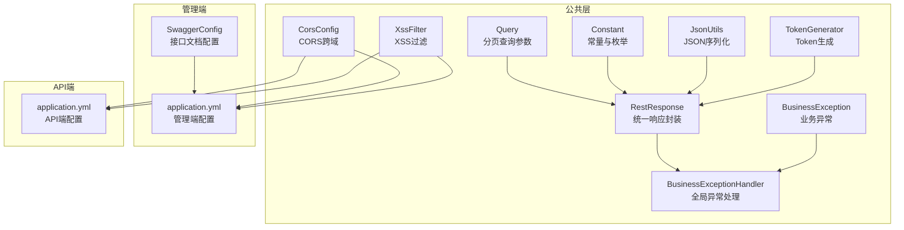
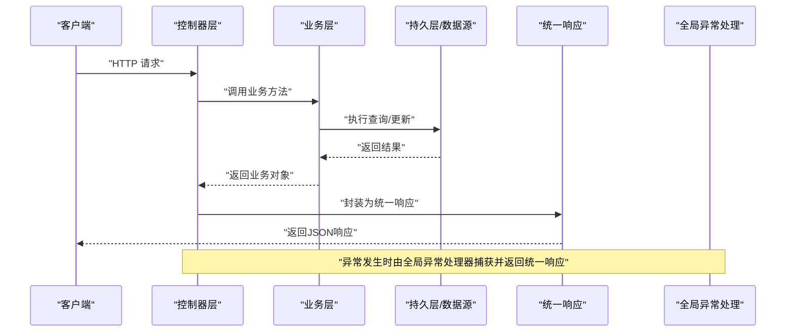
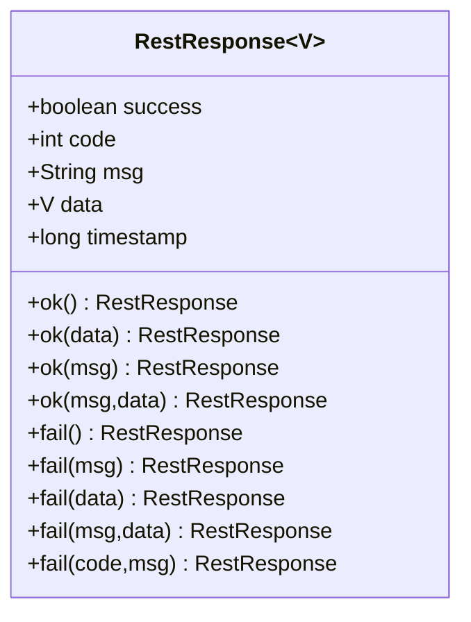
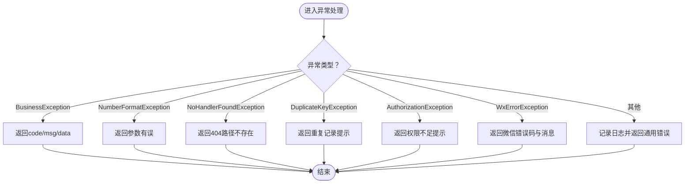
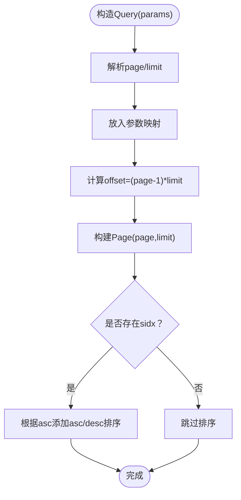
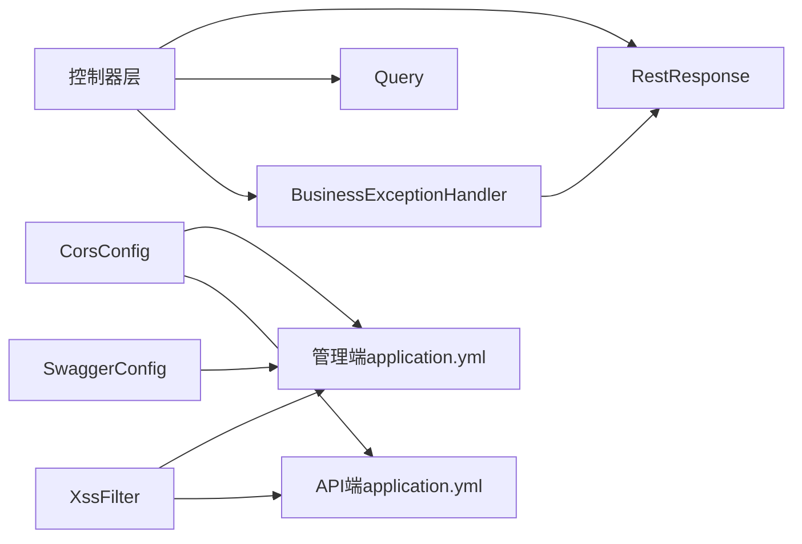

# 接口契约规范

<cite>
**本文引用的文件**
- [RestResponse.java](file://platform-common/src/main/java/com/platform/common/utils/RestResponse.java)
- [BusinessException.java](file://platform-common/src/main/java/com/platform/common/exception/BusinessException.java)
- [BusinessExceptionHandler.java](file://platform-common/src/main/java/com/platform/common/exception/BusinessExceptionHandler.java)
- [Query.java](file://platform-common/src/main/java/com/platform/common/utils/Query.java)
- [CorsConfig.java](file://platform-common/src/main/java/com/platform/config/CorsConfig.java)
- [Constant.java](file://platform-common/src/main/java/com/platform/common/utils/Constant.java)
- [JsonUtils.java](file://platform-common/src/main/java/com/platform/common/utils/JsonUtils.java)
- [TokenGenerator.java](file://platform-common/src/main/java/com/platform/common/utils/TokenGenerator.java)
- [XssFilter.java](file://platform-common/src/main/java/com/platform/common/xss/XssFilter.java)
- [application.yml（管理端）](file://platform-admin/src/main/resources/application.yml)
- [application.yml（API端）](file://platform-api/src/main/resources/application.yml)
- [SwaggerConfig.java](file://platform-admin/src/main/java/com/platform/config/SwaggerConfig.java)
</cite>

## 目录
1. [引言](#引言)
2. [项目结构](#项目结构)
3. [核心组件](#核心组件)
4. [架构总览](#架构总览)
5. [详细组件分析](#详细组件分析)
6. [依赖分析](#依赖分析)
7. [性能考虑](#性能考虑)
8. [故障排查指南](#故障排查指南)
9. [结论](#结论)
10. [附录](#附录)

## 引言
本规范面向平台所有接口开发者，统一平台API的响应格式、错误码与异常处理、请求参数与分页查询、数据校验、接口版本与兼容策略、废弃接口处理、CORS跨域、HTTP状态码使用、文档生成与测试规范等，确保接口一致性、可维护性与可测试性。

## 项目结构
平台采用多模块分层架构，接口契约相关能力集中在公共模块与各业务模块的控制器层：
- 平台公共模块（platform-common）：统一响应封装、异常处理、分页查询、安全过滤、工具类等
- 平台管理端（platform-admin）：后台管理接口，基于SpringDoc/OpenAPI/Knife4j生成接口文档
- 平台API端（platform-api）：移动端与微信服务端接口，同样启用接口文档与Swagger配置
- 各业务模块（mall/sys/wx/oss等）：控制器层实现具体接口

图表来源
- [RestResponse.java:34-121](file://platform-common/src/main/java/com/platform/common/utils/RestResponse.java#L34-L121)
- [BusinessExceptionHandler.java:36-99](file://platform-common/src/main/java/com/platform/common/exception/BusinessExceptionHandler.java#L36-L99)
- [Query.java:32-98](file://platform-common/src/main/java/com/platform/common/utils/Query.java#L32-L98)
- [CorsConfig.java:35-61](file://platform-common/src/main/java/com/platform/config/CorsConfig.java#L35-L61)
- [XssFilter.java:30-62](file://platform-common/src/main/java/com/platform/common/xss/XssFilter.java#L30-L62)
- [Constant.java:26-239](file://platform-common/src/main/java/com/platform/common/utils/Constant.java#L26-L239)
- [JsonUtils.java:27-34](file://platform-common/src/main/java/com/platform/common/utils/JsonUtils.java#L27-L34)
- [TokenGenerator.java:31-62](file://platform-common/src/main/java/com/platform/common/utils/TokenGenerator.java#L31-L62)
- [application.yml（管理端）:22-67](file://platform-admin/src/main/resources/application.yml#L22-L67)
- [application.yml（API端）:22-56](file://platform-api/src/main/resources/application.yml#L22-L56)
- [SwaggerConfig.java:58-94](file://platform-admin/src/main/java/com/platform/config/SwaggerConfig.java#L58-L94)

章节来源
- [application.yml（管理端）:1-205](file://platform-admin/src/main/resources/application.yml#L1-L205)
- [application.yml（API端）:1-195](file://platform-api/src/main/resources/application.yml#L1-L195)
- [SwaggerConfig.java:58-94](file://platform-admin/src/main/java/com/platform/config/SwaggerConfig.java#L58-L94)

## 核心组件
- 统一响应封装：提供统一的响应结构、成功/失败标记、状态码、消息、数据体、时间戳
- 全局异常处理：将业务异常、参数异常、权限异常、路径不存在、重复键冲突、微信错误等映射为统一响应
- 分页查询参数：内置page/limit/sidx/asc等分页与排序参数解析
- CORS跨域：开放允许凭据、任意源、任意头、任意方法，并设置缓存有效期
- 安全过滤：XSS过滤器对请求包装，排除特定路径
- 常量与枚举：集中定义系统常量、定时任务状态、云服务提供商、短信类型等
- JSON工具：统一JSON序列化输出
- Token生成：基于MD5生成Token，异常时抛出业务异常
- 接口文档：基于SpringDoc与Knife4j，按模块分组展示

章节来源
- [RestResponse.java:34-121](file://platform-common/src/main/java/com/platform/common/utils/RestResponse.java#L34-L121)
- [BusinessExceptionHandler.java:36-99](file://platform-common/src/main/java/com/platform/common/exception/BusinessExceptionHandler.java#L36-L99)
- [Query.java:32-98](file://platform-common/src/main/java/com/platform/common/utils/Query.java#L32-L98)
- [CorsConfig.java:35-61](file://platform-common/src/main/java/com/platform/config/CorsConfig.java#L35-L61)
- [XssFilter.java:30-62](file://platform-common/src/main/java/com/platform/common/xss/XssFilter.java#L30-L62)
- [Constant.java:26-239](file://platform-common/src/main/java/com/platform/common/utils/Constant.java#L26-L239)
- [JsonUtils.java:27-34](file://platform-common/src/main/java/com/platform/common/utils/JsonUtils.java#L27-L34)
- [TokenGenerator.java:31-62](file://platform-common/src/main/java/com/platform/common/utils/TokenGenerator.java#L31-L62)

## 架构总览
下图展示了接口调用链路与统一响应、异常处理、分页查询、CORS与安全过滤的关键交互。

图表来源
- [RestResponse.java:79-121](file://platform-common/src/main/java/com/platform/common/utils/RestResponse.java#L79-L121)
- [BusinessExceptionHandler.java:46-98](file://platform-common/src/main/java/com/platform/common/exception/BusinessExceptionHandler.java#L46-L98)

## 详细组件分析

### 统一响应封装（RestResponse）
- 字段定义：success、code、msg、data、timestamp
- 成功/失败工厂方法：ok()/fail()系列重载，支持仅消息、仅数据、消息+数据组合
- 默认成功码为0，失败码为HTTP 500
- 响应示例：包含字段说明与示例值，便于接口文档与前端消费

图表来源
- [RestResponse.java:34-121](file://platform-common/src/main/java/com/platform/common/utils/RestResponse.java#L34-L121)

章节来源
- [RestResponse.java:34-121](file://platform-common/src/main/java/com/platform/common/utils/RestResponse.java#L34-L121)

### 全局异常处理（BusinessExceptionHandler）
- 业务异常：BusinessException映射为统一响应，携带自定义code与message
- 参数异常：NumberFormatException统一提示“请求参数有误”
- 路径不存在：NoHandlerFoundException映射为404
- 数据库重复键：DuplicateKeyException统一提示“数据库中已存在该记录”
- 权限异常：AuthorizationException统一提示“没有权限，请联系管理员授权”
- 微信错误：WxErrorException提取errorCode与errorMsg
- 其他异常：统一记录日志并返回通用错误信息

图表来源
- [BusinessExceptionHandler.java:46-98](file://platform-common/src/main/java/com/platform/common/exception/BusinessExceptionHandler.java#L46-L98)

章节来源
- [BusinessExceptionHandler.java:36-99](file://platform-common/src/main/java/com/platform/common/exception/BusinessExceptionHandler.java#L36-L99)

### 分页查询参数（Query）
- 支持参数：page、limit、sidx（排序字段）、asc（升序/降序布尔）
- 自动计算offset与构建MyBatis-Plus Page对象
- 默认每页10条，第1页；默认升序
- 提供getCurrPage/getLimit/getPage访问器

图表来源
- [Query.java:49-84](file://platform-common/src/main/java/com/platform/common/utils/Query.java#L49-L84)

章节来源
- [Query.java:32-98](file://platform-common/src/main/java/com/platform/common/utils/Query.java#L32-L98)

### CORS跨域配置（CorsConfig）
- 允许凭据（Cookie/Session）
- 允许任意源、任意头、任意方法
- 预检请求缓存有效期24小时
- 对/**路径生效

章节来源
- [CorsConfig.java:35-61](file://platform-common/src/main/java/com/platform/config/CorsConfig.java#L35-L61)

### 安全过滤（XssFilter）
- 对请求进行包装，统一XSS过滤
- 排除特定路径（如模型服务路径），不进行过滤
- 作为Servlet Filter接入

章节来源
- [XssFilter.java:30-62](file://platform-common/src/main/java/com/platform/common/xss/XssFilter.java#L30-L62)

### 常量与枚举（Constant）
- 登录用户键、微信配置键、系统标识、过期时间、缓存前缀等
- 定时任务状态枚举（正常/暂停）
- 云服务商枚举（七牛、阿里、腾讯、本地、MinIO、华为）
- 短信类型枚举（腾讯云、阿里云）

章节来源
- [Constant.java:26-239](file://platform-common/src/main/java/com/platform/common/utils/Constant.java#L26-L239)

### JSON工具（JsonUtils）
- 使用Gson Pretty Printing输出统一JSON格式

章节来源
- [JsonUtils.java:27-34](file://platform-common/src/main/java/com/platform/common/utils/JsonUtils.java#L27-L34)

### Token生成（TokenGenerator）
- 基于MD5生成Token
- 异常时抛出业务异常

章节来源
- [TokenGenerator.java:31-62](file://platform-common/src/main/java/com/platform/common/utils/TokenGenerator.java#L31-L62)

### 接口文档（Swagger/Knife4j）
- 管理端：按模块分组（全部、系统管理、微信管理），UI路径与API Docs路径配置
- API端：移动端接口与微信服务器接口分组
- Knife4j增强：语言、实体类列表、参数缓存、自定义Footer

章节来源
- [application.yml（管理端）:22-67](file://platform-admin/src/main/resources/application.yml#L22-L67)
- [application.yml（API端）:22-56](file://platform-api/src/main/resources/application.yml#L22-L56)
- [SwaggerConfig.java:58-94](file://platform-admin/src/main/java/com/platform/config/SwaggerConfig.java#L58-L94)

## 依赖分析
- 控制器层依赖统一响应封装与分页查询参数
- 全局异常处理依赖统一响应封装
- CORS与XSS过滤在应用配置中启用
- 接口文档配置分别在管理端与API端的application.yml中声明

图表来源
- [RestResponse.java:79-121](file://platform-common/src/main/java/com/platform/common/utils/RestResponse.java#L79-L121)
- [BusinessExceptionHandler.java:46-98](file://platform-common/src/main/java/com/platform/common/exception/BusinessExceptionHandler.java#L46-L98)
- [Query.java:32-98](file://platform-common/src/main/java/com/platform/common/utils/Query.java#L32-L98)
- [CorsConfig.java:35-61](file://platform-common/src/main/java/com/platform/config/CorsConfig.java#L35-L61)
- [XssFilter.java:30-62](file://platform-common/src/main/java/com/platform/common/xss/XssFilter.java#L30-L62)
- [application.yml（管理端）:22-67](file://platform-admin/src/main/resources/application.yml#L22-L67)
- [application.yml（API端）:22-56](file://platform-api/src/main/resources/application.yml#L22-L56)
- [SwaggerConfig.java:58-94](file://platform-admin/src/main/java/com/platform/config/SwaggerConfig.java#L58-L94)

## 性能考虑
- 分页查询：建议合理设置limit上限，避免一次性拉取大量数据
- CORS预检缓存：合理设置MaxAge，减少重复OPTIONS请求
- JSON序列化：统一使用Pretty Printing，便于调试但可能增加体积，生产环境可按需调整
- 异常处理：避免在异常处理中进行重型操作，保持快速返回

## 故障排查指南
- 统一响应字段缺失：确认控制器是否使用统一响应封装
- 参数异常：检查NumberFormatException映射，核对传参类型与范围
- 路径不存在：确认URL是否匹配控制器映射，或是否被CORS/XSS过滤器拦截
- 权限问题：确认AuthorizationException映射，检查鉴权流程
- 重复键冲突：确认DuplicateKeyException映射，检查唯一约束
- 微信错误：确认WxErrorException映射，检查微信接口返回码与消息
- CORS问题：确认CorsFilter配置，检查允许的源、头、方法与凭据设置
- XSS拦截：确认XssFilter排除路径，避免对特定接口误拦截

章节来源
- [BusinessExceptionHandler.java:46-98](file://platform-common/src/main/java/com/platform/common/exception/BusinessExceptionHandler.java#L46-L98)
- [CorsConfig.java:35-61](file://platform-common/src/main/java/com/platform/config/CorsConfig.java#L35-L61)
- [XssFilter.java:30-62](file://platform-common/src/main/java/com/platform/common/xss/XssFilter.java#L30-L62)

## 结论
通过统一响应封装、全局异常处理、分页查询参数、CORS与安全过滤、接口文档配置等机制，平台实现了接口契约的标准化与工程化落地。建议在新增接口时严格遵循本规范，确保一致性与可维护性。

## 附录

### 接口命名规范与URL设计原则
- 资源命名：使用名词复数形式，如/users、/orders
- 层级结构：按功能模块划分路径前缀，如/sys、/app、/wx
- 版本控制：建议在URL中显式包含版本号，如/app/v1、/wx/v1
- 动作语义：GET/POST/PUT/DELETE明确对应读取、创建、更新、删除

### HTTP状态码使用标准
- 200：成功
- 400：参数错误、请求格式错误
- 401：未授权或令牌无效
- 403：权限不足
- 404：资源不存在
- 500：服务器内部错误

### 错误码定义与分类
- 成功：0
- 业务错误：自定义正整数错误码
- 参数错误：NumberFormatException映射
- 路径不存在：404
- 权限不足：403
- 重复记录：提示重复键冲突
- 微信错误：使用微信返回的错误码与消息

章节来源
- [RestResponse.java:73-77](file://platform-common/src/main/java/com/platform/common/utils/RestResponse.java#L73-L77)
- [BusinessExceptionHandler.java:46-98](file://platform-common/src/main/java/com/platform/common/exception/BusinessExceptionHandler.java#L46-L98)

### 请求参数规范
- 分页参数：page（默认1）、limit（默认10）、sidx（排序字段）、asc（默认true）
- 字符串与布尔值：遵循前后端约定，避免空字符串与null混用
- 文件上传：参考multipart配置的最大文件与请求大小

章节来源
- [Query.java:41-84](file://platform-common/src/main/java/com/platform/common/utils/Query.java#L41-L84)
- [application.yml（管理端）:76-80](file://platform-admin/src/main/resources/application.yml#L76-L80)
- [application.yml（API端）:65-69](file://platform-api/src/main/resources/application.yml#L65-L69)

### 分页查询标准
- 默认每页10条，第1页
- 支持升序/降序排序
- 建议在控制器中接收Query并传递给业务层

章节来源
- [Query.java:41-84](file://platform-common/src/main/java/com/platform/common/utils/Query.java#L41-L84)

### 数据验证规则
- 前端校验：必填、长度、格式
- 后端校验：参数类型、范围、业务规则
- 异常映射：NumberFormatException等统一返回“请求参数有误”

章节来源
- [BusinessExceptionHandler.java:57-61](file://platform-common/src/main/java/com/platform/common/exception/BusinessExceptionHandler.java#L57-L61)

### 接口版本管理策略与兼容性
- 版本号：建议在URL中显式包含版本号（如/app/v1）
- 向后兼容：新增字段建议可选，变更字段建议保留旧字段一段时间
- 废弃接口：提供迁移指引与过渡期，逐步下线

### 废弃接口处理机制
- 标记：在接口文档中标注废弃与替代方案
- 过渡期：提供新旧接口共存，逐步引导客户端迁移
- 下线：到期后移除旧接口

### 统一异常处理机制与错误信息标准化
- 业务异常：BusinessException，携带自定义code与message
- 全局异常：BusinessExceptionHandler，统一映射为统一响应
- 错误信息：中文友好提示，必要时补充英文说明

章节来源
- [BusinessException.java:28-73](file://platform-common/src/main/java/com/platform/common/exception/BusinessException.java#L28-L73)
- [BusinessExceptionHandler.java:46-98](file://platform-common/src/main/java/com/platform/common/exception/BusinessExceptionHandler.java#L46-L98)

### CORS跨域配置
- 允许凭据、任意源、任意头、任意方法
- 预检缓存有效期24小时
- 对/**路径生效

章节来源
- [CorsConfig.java:35-61](file://platform-common/src/main/java/com/platform/config/CorsConfig.java#L35-L61)

### 接口测试规范、Mock数据与文档生成
- 测试规范：单元测试覆盖核心业务逻辑，集成测试覆盖接口契约
- Mock数据：使用固定示例数据，确保可重复性
- 文档生成：基于SpringDoc与Knife4j，按模块分组展示，支持在线调试

章节来源
- [application.yml（管理端）:22-67](file://platform-admin/src/main/resources/application.yml#L22-L67)
- [application.yml（API端）:22-56](file://platform-api/src/main/resources/application.yml#L22-L56)
- [SwaggerConfig.java:58-94](file://platform-admin/src/main/java/com/platform/config/SwaggerConfig.java#L58-L94)