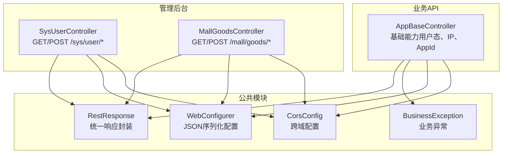
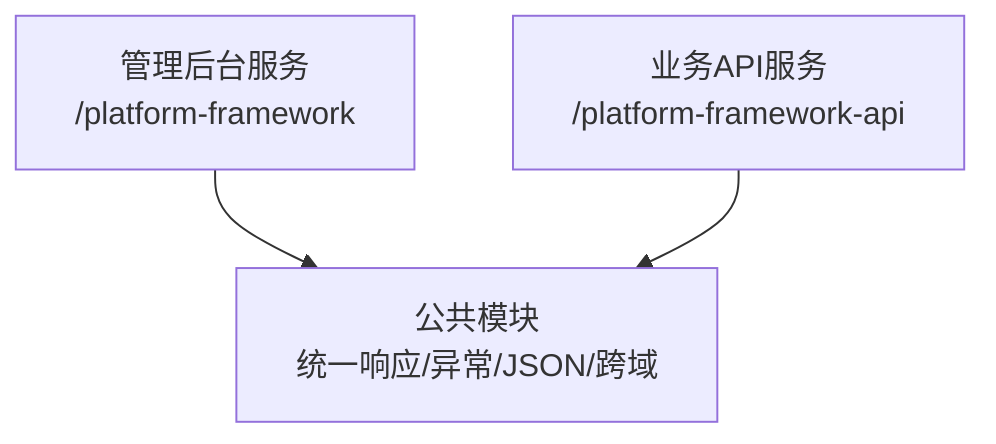
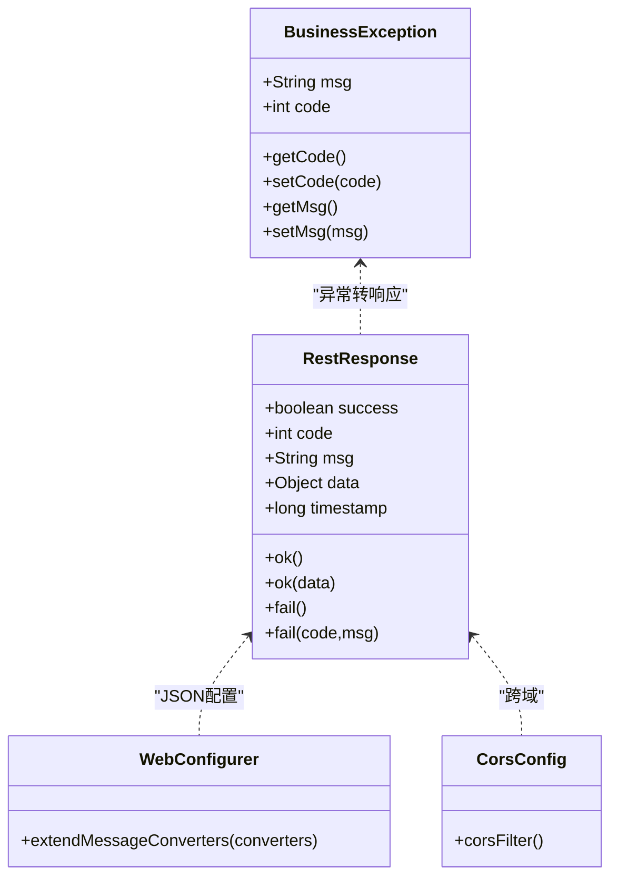
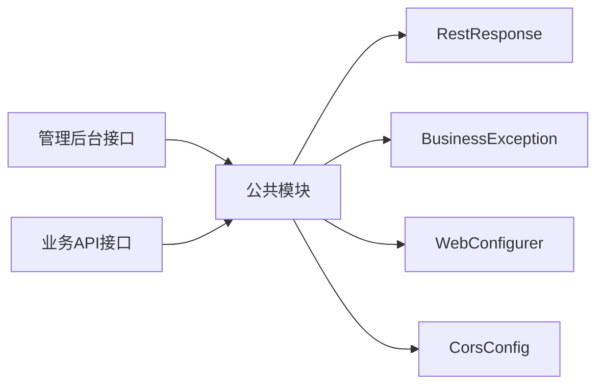

# 接口文档

<cite>
**本文引用的文件**   
- [application.yml（管理后台）](file://platform-admin/src/main/resources/application.yml)
- [application.yml（业务API）](file://platform-api/src/main/resources/application.yml)
- [RestResponse.java](file://platform-common/src/main/java/com/platform/common/utils/RestResponse.java)
- [BusinessException.java](file://platform-common/src/main/java/com/platform/common/exception/BusinessException.java)
- [WebConfigurer.java](file://platform-common/src/main/java/com/platform/config/WebConfigurer.java)
- [CorsConfig.java](file://platform-common/src/main/java/com/platform/config/CorsConfig.java)
- [SysUserController.java](file://platform-admin/src/main/java/com/platform/modules/sys/controller/SysUserController.java)
- [MallGoodsController.java](file://platform-admin/src/main/java/com/platform/modules/mall/controller/MallGoodsController.java)
- [AppBaseController.java](file://platform-api/src/main/java/com/platform/modules/app/controller/AppBaseController.java)
</cite>

## 目录
1. [简介](#简介)
2. [项目结构](#项目结构)
3. [核心组件](#核心组件)
4. [架构总览](#架构总览)
5. [详细组件分析](#详细组件分析)
6. [依赖分析](#依赖分析)
7. [性能考虑](#性能考虑)
8. [故障排查指南](#故障排查指南)
9. [结论](#结论)
10. [附录](#附录)

## 简介
本接口文档面向管理后台与业务API两大体系，覆盖平台提供的RESTful接口设计与实现要点。文档内容包括：
- 管理后台API：HTTP方法、URL模式、请求/响应模式、权限控制与认证方式
- 业务API：移动端与小程序接口的设计规范、参数校验规则、返回值格式
- 鉴权机制、权限控制策略与安全考虑
- 接口调用示例、错误处理策略与状态码说明
- 接口测试指南、性能优化建议与版本管理方案
- 业务逻辑、数据流转与异常处理机制

## 项目结构
平台由多模块构成，接口文档聚焦于以下模块：
- 平台管理后台（管理端）：提供系统管理、商品管理等后台接口
- 平台业务API（移动端/小程序）：提供移动端与小程序相关接口
- 平台公共模块：统一响应封装、异常处理、跨域与JSON配置

图表来源
- [SysUserController.java:50-243](file://platform-admin/src/main/java/com/platform/modules/sys/controller/SysUserController.java#L50-L243)
- [MallGoodsController.java:46-184](file://platform-admin/src/main/java/com/platform/modules/mall/controller/MallGoodsController.java#L46-L184)
- [AppBaseController.java:34-102](file://platform-api/src/main/java/com/platform/modules/app/controller/AppBaseController.java#L34-L102)
- [RestResponse.java:29-122](file://platform-common/src/main/java/com/platform/common/utils/RestResponse.java#L29-L122)
- [BusinessException.java:23-74](file://platform-common/src/main/java/com/platform/common/exception/BusinessException.java#L23-L74)
- [WebConfigurer.java:34-62](file://platform-common/src/main/java/com/platform/config/WebConfigurer.java#L34-L62)
- [CorsConfig.java:30-63](file://platform-common/src/main/java/com/platform/config/CorsConfig.java#L30-L63)

章节来源
- [application.yml（管理后台）:1-205](file://platform-admin/src/main/resources/application.yml#L1-L205)
- [application.yml（业务API）:1-195](file://platform-api/src/main/resources/application.yml#L1-L195)

## 核心组件
- 统一响应封装：RestResponse 提供统一的响应结构，包含 success、code、msg、data、timestamp 字段，便于前端与第三方集成消费
- 异常模型：BusinessException 提供可携带业务码的异常模型，配合统一异常处理器可输出标准响应
- JSON配置：WebConfigurer 统一设置 Jackson 反序列化行为与日期格式，确保接口一致性
- 跨域配置：CorsConfig 允许任意来源、方法与头，便于联调与跨端访问

章节来源
- [RestResponse.java:29-122](file://platform-common/src/main/java/com/platform/common/utils/RestResponse.java#L29-L122)
- [BusinessException.java:23-74](file://platform-common/src/main/java/com/platform/common/exception/BusinessException.java#L23-L74)
- [WebConfigurer.java:34-62](file://platform-common/src/main/java/com/platform/config/WebConfigurer.java#L34-L62)
- [CorsConfig.java:30-63](file://platform-common/src/main/java/com/platform/config/CorsConfig.java#L30-L63)

## 架构总览
管理后台与业务API分别运行在独立的服务中，共享公共模块能力：
- 管理后台：上下文路径 /platform-framework，Swagger UI 访问 /swagger-ui.html，按包扫描生成接口文档
- 业务API：上下文路径 /platform-framework-api，Swagger UI 访问 /swagger-ui.html，按包扫描生成接口文档
- 公共模块：提供统一响应、异常、JSON与跨域配置

图表来源
- [application.yml（管理后台）:1-205](file://platform-admin/src/main/resources/application.yml#L1-L205)
- [application.yml（业务API）:1-195](file://platform-api/src/main/resources/application.yml#L1-L195)

## 详细组件分析

### 管理后台接口（系统用户）
- 控制器：SysUserController
- 基础路径：/sys/user
- 关键接口
  - GET /sys/user/queryAll：查询所有用户（需权限 sys:dict:list）
  - GET /sys/user/list：分页查询用户（需权限 sys:user:list），支持数据范围过滤
  - GET /sys/user/info：获取当前登录用户信息
  - POST /sys/user/password：修改当前用户密码（参数含旧密码与新密码）
  - GET /sys/user/info/{userId}：按主键查询用户详情（含角色列表）
  - POST /sys/user/save：新增用户（参数校验 AddGroup）
  - POST /sys/user/update：修改用户（参数校验 UpdateGroup）
  - POST /sys/user/delete：批量删除用户（禁止删除超级管理员与当前用户）
  - POST /sys/user/resetPw：批量重置密码（禁止重置超级管理员与当前用户）

请求/响应模式
- 请求：JSON；分页接口使用查询参数
- 响应：统一由 RestResponse 包装，包含 success、code、msg、data、timestamp
- 权限控制：基于注解 RequiresPermissions，结合 Shiro 使用

章节来源
- [SysUserController.java:50-243](file://platform-admin/src/main/java/com/platform/modules/sys/controller/SysUserController.java#L50-L243)
- [RestResponse.java:29-122](file://platform-common/src/main/java/com/platform/common/utils/RestResponse.java#L29-L122)

### 管理后台接口（商品管理）
- 控制器：MallGoodsController
- 基础路径：/mall/goods
- 关键接口
  - GET /mall/goods/queryAll：查询所有商品（需权限 mall:goods:list）
  - GET /mall/goods/list：分页查询商品（需权限 mall:goods:list）
  - GET /mall/goods/info/{id}：按主键查询商品详情（需权限 mall:goods:info）
  - GET /mall/goods/aggregate/{id}：商品聚合详情（需权限 mall:goods:info）
  - POST /mall/goods/save：新增商品（需权限 mall:goods:save）
  - POST /mall/goods/aggregate/save：新增聚合（需权限 mall:goods:save）
  - POST /mall/goods/update：修改商品（需权限 mall:goods:update）
  - POST /mall/goods/aggregate/update：修改聚合（需权限 mall:goods:update）
  - POST /mall/goods/delete：批量删除商品（需权限 mall:goods:delete）

请求/响应模式
- 请求：JSON；分页接口使用查询参数
- 响应：统一由 RestResponse 包装
- 权限控制：基于注解 RequiresPermissions

章节来源
- [MallGoodsController.java:46-184](file://platform-admin/src/main/java/com/platform/modules/mall/controller/MallGoodsController.java#L46-L184)
- [RestResponse.java:29-122](file://platform-common/src/main/java/com/platform/common/utils/RestResponse.java#L29-L122)

### 业务API（移动端/小程序）
- 基础控制器：AppBaseController
- 关键能力
  - 获取请求方 IP：支持 x-forwarded-for
  - 获取 maAppId：从请求属性读取
  - 用户态解析：从请求头读取用户标识，查询用户实体获取用户ID
  - 参数绑定：统一去除字符串前后空格

请求/响应模式
- 请求：JSON
- 响应：统一由 RestResponse 包装
- 鉴权：通过请求头携带用户标识，控制器内部解析用户ID

章节来源
- [AppBaseController.java:34-102](file://platform-api/src/main/java/com/platform/modules/app/controller/AppBaseController.java#L34-L102)
- [RestResponse.java:29-122](file://platform-common/src/main/java/com/platform/common/utils/RestResponse.java#L29-L122)

### 统一响应与异常
- 统一响应：RestResponse 提供 ok()/fail() 多种静态工厂方法，统一输出结构
- 业务异常：BusinessException 支持自定义 code 与 msg，便于区分业务错误与系统错误
- JSON配置：WebConfigurer 设置 Jackson 反序列化忽略未知字段、日期格式与字符集
- 跨域配置：CorsConfig 允许任意来源、方法与头，便于联调

图表来源
- [RestResponse.java:29-122](file://platform-common/src/main/java/com/platform/common/utils/RestResponse.java#L29-L122)
- [BusinessException.java:23-74](file://platform-common/src/main/java/com/platform/common/exception/BusinessException.java#L23-L74)
- [WebConfigurer.java:34-62](file://platform-common/src/main/java/com/platform/config/WebConfigurer.java#L34-L62)
- [CorsConfig.java:30-63](file://platform-common/src/main/java/com/platform/config/CorsConfig.java#L30-L63)

## 依赖分析
- 管理后台与业务API均依赖公共模块，共享统一响应、异常、JSON与跨域配置
- 管理后台接口使用 Shiro 注解进行权限控制
- 业务API通过 AppBaseController 解析用户态与请求属性

图表来源
- [SysUserController.java:50-243](file://platform-admin/src/main/java/com/platform/modules/sys/controller/SysUserController.java#L50-L243)
- [MallGoodsController.java:46-184](file://platform-admin/src/main/java/com/platform/modules/mall/controller/MallGoodsController.java#L46-L184)
- [AppBaseController.java:34-102](file://platform-api/src/main/java/com/platform/modules/app/controller/AppBaseController.java#L34-L102)
- [RestResponse.java:29-122](file://platform-common/src/main/java/com/platform/common/utils/RestResponse.java#L29-L122)
- [BusinessException.java:23-74](file://platform-common/src/main/java/com/platform/common/exception/BusinessException.java#L23-L74)
- [WebConfigurer.java:34-62](file://platform-common/src/main/java/com/platform/config/WebConfigurer.java#L34-L62)
- [CorsConfig.java:30-63](file://platform-common/src/main/java/com/platform/config/CorsConfig.java#L30-L63)

## 性能考虑
- Undertow 线程与缓冲配置：合理设置 IO 线程与工作线程数量，避免文件句柄耗尽
- JSON序列化：统一忽略未知字段，减少反序列化开销与兼容性问题
- 跨域配置：生产环境建议限定来源与方法，降低安全风险与无效请求
- 分页查询：优先使用分页接口，避免一次性加载大量数据

## 故障排查指南
- 统一响应结构：检查响应中的 code、msg、success 字段，定位业务错误与系统错误
- 异常模型：业务异常携带自定义 code，便于前端与第三方识别
- 日志与审计：管理后台接口使用注解记录操作日志，便于追踪
- 参数校验：管理后台接口对新增/修改实体进行分组校验，确保入参合法
- 跨域问题：确认浏览器端与后端 CORS 配置一致，避免预检失败

章节来源
- [RestResponse.java:29-122](file://platform-common/src/main/java/com/platform/common/utils/RestResponse.java#L29-L122)
- [BusinessException.java:23-74](file://platform-common/src/main/java/com/platform/common/exception/BusinessException.java#L23-L74)
- [SysUserController.java:50-243](file://platform-admin/src/main/java/com/platform/modules/sys/controller/SysUserController.java#L50-L243)

## 结论
本接口文档梳理了管理后台与业务API的核心接口与实现细节，明确了统一响应、异常处理、权限控制与跨域配置等关键能力。建议在实际接入时：
- 严格遵循统一响应结构与参数校验规则
- 在生产环境收紧跨域策略与权限控制
- 使用分页接口与缓存策略提升性能
- 借助 Swagger UI 与 Knife4j 文档进行联调与测试

## 附录

### 接口调用示例（示意）
- 管理后台
  - 登录后访问：GET /platform-framework/sys/user/list?page=1&limit=10
  - 新增用户：POST /platform-framework/sys/user/save（Body：用户JSON，需权限 sys:user:save）
- 业务API
  - 移动端/小程序：GET /platform-framework-api/app/some-endpoint（Header：携带用户标识）

### 错误处理策略与状态码
- 统一响应：success=true 表示成功，false 表示失败；code=0 表示成功，非0表示失败；msg 为提示信息
- 业务异常：BusinessException 可携带自定义 code，便于区分业务错误

章节来源
- [RestResponse.java:29-122](file://platform-common/src/main/java/com/platform/common/utils/RestResponse.java#L29-L122)
- [BusinessException.java:23-74](file://platform-common/src/main/java/com/platform/common/exception/BusinessException.java#L23-L74)

### 版本管理方案
- 项目版本通过配置文件注入，接口文档 Footer 展示版本号，便于追踪与回溯
- Swagger/Knife4j 文档按分组展示不同模块接口，便于版本演进与维护

章节来源
- [application.yml（管理后台）:1-205](file://platform-admin/src/main/resources/application.yml#L1-L205)
- [application.yml（业务API）:1-195](file://platform-api/src/main/resources/application.yml#L1-L195)