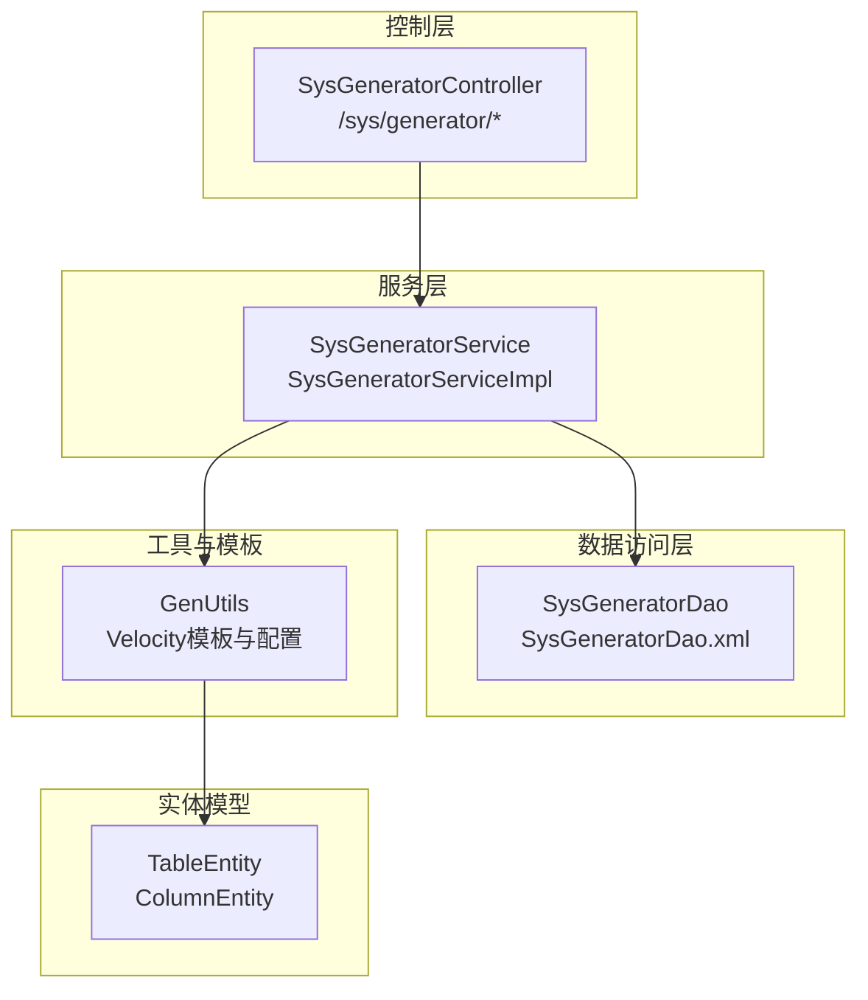
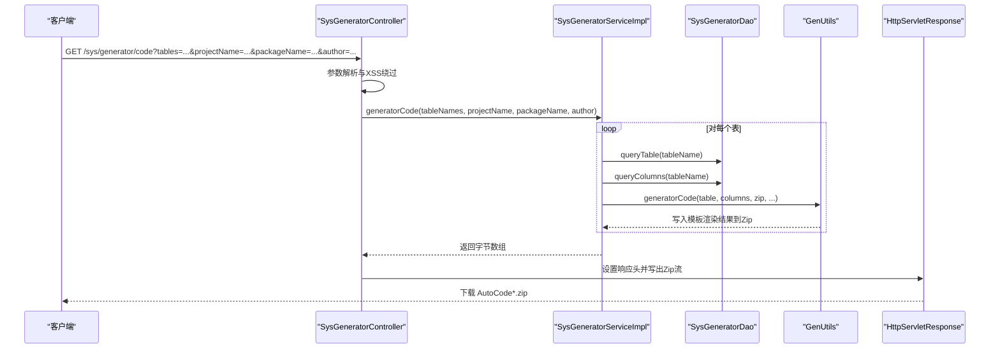
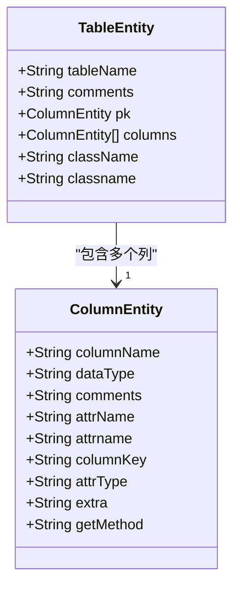
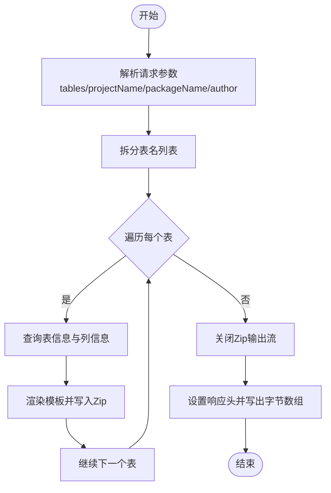
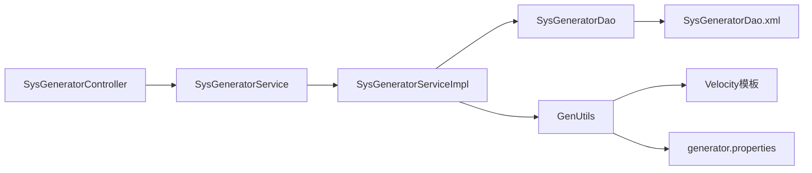

# 代码生成API

<cite>
**本文引用的文件**
- [SysGeneratorController.java](file://platform-admin/src/main/java/com/platform/modules/gen/controller/SysGeneratorController.java)
- [SysGeneratorService.java](file://platform-admin/src/main/java/com/platform/modules/gen/service/SysGeneratorService.java)
- [SysGeneratorServiceImpl.java](file://platform-admin/src/main/java/com/platform/modules/gen/service/impl/SysGeneratorServiceImpl.java)
- [SysGeneratorDao.java](file://platform-admin/src/main/java/com/platform/modules/gen/dao/SysGeneratorDao.java)
- [TableEntity.java](file://platform-admin/src/main/java/com/platform/modules/gen/entity/TableEntity.java)
- [ColumnEntity.java](file://platform-admin/src/main/java/com/platform/modules/gen/entity/ColumnEntity.java)
- [GenUtils.java](file://platform-admin/src/main/java/com/platform/modules/gen/utils/GenUtils.java)
- [generator.properties](file://platform-admin/src/main/resources/gen/generator.properties)
- [Controller.java.vm](file://platform-admin/src/main/resources/gen/template/Controller.java.vm)
- [Dao.java.vm](file://platform-admin/src/main/resources/gen/template/Dao.java.vm)
- [Dao.xml.vm](file://platform-admin/src/main/resources/gen/template/Dao.xml.vm)
- [Entity.java.vm](file://platform-admin/src/main/resources/gen/template/Entity.java.vm)
- [Service.java.vm](file://platform-admin/src/main/resources/gen/template/Service.java.vm)
- [ServiceImpl.java.vm](file://platform-admin/src/main/resources/gen/template/ServiceImpl.java.vm)
- [vue.vm](file://platform-admin/src/main/resources/gen/template/vue.vm)
- [add-or-update.vue.vm](file://platform-admin/src/main/resources/gen/template/add-or-update.vue.vm)
- [menu.sql.vm](file://platform-admin/src/main/resources/gen/template/menu.sql.vm)
- [SysGeneratorDao.xml](file://platform-admin/src/main/resources/mapper/gen/SysGeneratorDao.xml)
</cite>

## 目录
1. [简介](#简介)
2. [项目结构](#项目结构)
3. [核心组件](#核心组件)
4. [架构总览](#架构总览)
5. [详细组件分析](#详细组件分析)
6. [依赖分析](#依赖分析)
7. [性能考虑](#性能考虑)
8. [故障排查指南](#故障排查指南)
9. [结论](#结论)
10. [附录](#附录)

## 简介
本文件为平台“代码自动生成系统”的API接口文档，覆盖以下能力：
- 代码生成配置与模板管理
- 批量代码生成（后端Java + 前端Vue + 菜单SQL）
- 接口定义：HTTP方法、URL路径、请求参数、响应格式、状态码与错误处理
- 模板机制与配置项说明
- 生成配置示例、模板定制与批量生成流程
- 最佳实践、模板开发指南与扩展方法

该系统基于Spring Boot + MyBatis-Plus + Velocity模板引擎实现，支持从数据库表元数据生成标准工程骨架代码。

## 项目结构
围绕代码生成功能的核心目录与文件如下：
- 控制层：SysGeneratorController
- 服务层：SysGeneratorService 及其实现 SysGeneratorServiceImpl
- 数据访问层：SysGeneratorDao 及其 XML 映射
- 实体模型：TableEntity、ColumnEntity
- 工具与模板：GenUtils、Velocity 模板与 generator.properties 配置

图表来源
- [SysGeneratorController.java:55-105](file://platform-admin/src/main/java/com/platform/modules/gen/controller/SysGeneratorController.java#L55-L105)
- [SysGeneratorService.java:36-72](file://platform-admin/src/main/java/com/platform/modules/gen/service/SysGeneratorService.java#L36-L72)
- [SysGeneratorServiceImpl.java:42-94](file://platform-admin/src/main/java/com/platform/modules/gen/service/impl/SysGeneratorServiceImpl.java#L42-L94)
- [SysGeneratorDao.java:39-66](file://platform-admin/src/main/java/com/platform/modules/gen/dao/SysGeneratorDao.java#L39-L66)
- [GenUtils.java:49-213](file://platform-admin/src/main/java/com/platform/modules/gen/utils/GenUtils.java#L49-L213)
- [TableEntity.java:30-105](file://platform-admin/src/main/java/com/platform/modules/gen/entity/TableEntity.java#L30-L105)
- [ColumnEntity.java:28-137](file://platform-admin/src/main/java/com/platform/modules/gen/entity/ColumnEntity.java#L28-L137)

章节来源
- [SysGeneratorController.java:55-105](file://platform-admin/src/main/java/com/platform/modules/gen/controller/SysGeneratorController.java#L55-L105)
- [SysGeneratorService.java:36-72](file://platform-admin/src/main/java/com/platform/modules/gen/service/SysGeneratorService.java#L36-L72)
- [SysGeneratorServiceImpl.java:42-94](file://platform-admin/src/main/java/com/platform/modules/gen/service/impl/SysGeneratorServiceImpl.java#L42-L94)
- [SysGeneratorDao.java:39-66](file://platform-admin/src/main/java/com/platform/modules/gen/dao/SysGeneratorDao.java#L39-L66)
- [GenUtils.java:49-213](file://platform-admin/src/main/java/com/platform/modules/gen/utils/GenUtils.java#L49-L213)
- [TableEntity.java:30-105](file://platform-admin/src/main/java/com/platform/modules/gen/entity/TableEntity.java#L30-L105)
- [ColumnEntity.java:28-137](file://platform-admin/src/main/java/com/platform/modules/gen/entity/ColumnEntity.java#L28-L137)

## 核心组件
- 控制器 SysGeneratorController
  - 提供分页查询数据库表列表与批量生成代码的HTTP接口
  - 权限注解要求：sys:generator:list、sys:generator:code
- 服务层 SysGeneratorService/SysGeneratorServiceImpl
  - 封装分页查询、表与列元数据查询、批量代码生成逻辑
- DAO 层 SysGeneratorDao + XML
  - 提供分页查询、查询表信息、查询列信息的SQL映射
- 工具与模板 GenUtils
  - 组织模板数据、渲染Velocity模板、打包Zip输出
- 实体模型 TableEntity、ColumnEntity
  - 描述表与列的元数据结构

章节来源
- [SysGeneratorController.java:55-105](file://platform-admin/src/main/java/com/platform/modules/gen/controller/SysGeneratorController.java#L55-L105)
- [SysGeneratorService.java:36-72](file://platform-admin/src/main/java/com/platform/modules/gen/service/SysGeneratorService.java#L36-L72)
- [SysGeneratorServiceImpl.java:42-94](file://platform-admin/src/main/java/com/platform/modules/gen/service/impl/SysGeneratorServiceImpl.java#L42-L94)
- [SysGeneratorDao.java:39-66](file://platform-admin/src/main/java/com/platform/modules/gen/dao/SysGeneratorDao.java#L39-L66)
- [GenUtils.java:49-213](file://platform-admin/src/main/java/com/platform/modules/gen/utils/GenUtils.java#L49-L213)
- [TableEntity.java:30-105](file://platform-admin/src/main/java/com/platform/modules/gen/entity/TableEntity.java#L30-L105)
- [ColumnEntity.java:28-137](file://platform-admin/src/main/java/com/platform/modules/gen/entity/ColumnEntity.java#L28-L137)

## 架构总览
下图展示从HTTP请求到代码生成与下载的完整调用链路：

图表来源
- [SysGeneratorController.java:82-103](file://platform-admin/src/main/java/com/platform/modules/gen/controller/SysGeneratorController.java#L82-L103)
- [SysGeneratorServiceImpl.java:75-91](file://platform-admin/src/main/java/com/platform/modules/gen/service/impl/SysGeneratorServiceImpl.java#L75-L91)
- [SysGeneratorDao.java:48-64](file://platform-admin/src/main/java/com/platform/modules/gen/dao/SysGeneratorDao.java#L48-L64)
- [GenUtils.java:68-188](file://platform-admin/src/main/java/com/platform/modules/gen/utils/GenUtils.java#L68-L188)

## 详细组件分析

### 接口定义与使用说明

- 接口一：分页查询所有表
  - 方法与路径：GET /sys/generator/list
  - 权限：sys:generator:list
  - 请求参数（示例）：
    - pageNum：页码
    - pageSize：每页条数
    - tableName：可选，表名模糊匹配
  - 响应格式：统一返回对象，包含分页数据
  - 状态码：200 成功；业务异常按全局异常处理
  - 错误处理：权限不足返回403；查询异常由全局异常捕获器处理

  章节来源
  - [SysGeneratorController.java:66-74](file://platform-admin/src/main/java/com/platform/modules/gen/controller/SysGeneratorController.java#L66-L74)
  - [SysGeneratorService.java:36-43](file://platform-admin/src/main/java/com/platform/modules/gen/service/SysGeneratorService.java#L36-L43)
  - [SysGeneratorServiceImpl.java:47-53](file://platform-admin/src/main/java/com/platform/modules/gen/service/impl/SysGeneratorServiceImpl.java#L47-L53)

- 接口二：生成代码并下载压缩包
  - 方法与路径：GET /sys/generator/code
  - 权限：sys:generator:code
  - 请求参数（示例）：
    - tables：以逗号分隔的表名列表（必填）
    - projectName：项目名称（必填）
    - packageName：基础包名（必填）
    - author：作者（可选）
  - 响应格式：application/octet-stream（Zip压缩包）
  - 状态码：200 成功；403 权限不足；500 生成异常
  - 错误处理：模板渲染失败或IO异常将抛出业务异常；下载前设置Content-Disposition与长度头

  章节来源
  - [SysGeneratorController.java:82-103](file://platform-admin/src/main/java/com/platform/modules/gen/controller/SysGeneratorController.java#L82-L103)
  - [SysGeneratorServiceImpl.java:75-91](file://platform-admin/src/main/java/com/platform/modules/gen/service/impl/SysGeneratorServiceImpl.java#L75-L91)
  - [GenUtils.java:68-188](file://platform-admin/src/main/java/com/platform/modules/gen/utils/GenUtils.java#L68-L188)

### 模板机制与配置

- 模板清单（Velocity）
  - 后端Java：Entity.java.vm、Dao.java.vm、Dao.xml.vm、Service.java.vm、ServiceImpl.java.vm、Controller.java.vm
  - 前端Vue：vue.vm、add-or-update.vue.vm
  - 菜单SQL：menu.sql.vm
- 模板数据上下文（部分关键键）
  - tableName、comments、pk、className、classname、pathName、columns、package、projectName、author、datetime、pre、hasDate、hasBigDecimal
- 配置文件 generator.properties
  - 定义数据库字段类型到Java类型的映射（如 tinyint -> Integer 等）

章节来源
- [GenUtils.java:51-63](file://platform-admin/src/main/java/com/platform/modules/gen/utils/GenUtils.java#L51-L63)
- [GenUtils.java:147-188](file://platform-admin/src/main/java/com/platform/modules/gen/utils/GenUtils.java#L147-L188)
- [generator.properties:1-21](file://platform-admin/src/main/resources/gen/generator.properties#L1-L21)

### 数据模型

图表来源
- [TableEntity.java:30-105](file://platform-admin/src/main/java/com/platform/modules/gen/entity/TableEntity.java#L30-L105)
- [ColumnEntity.java:28-137](file://platform-admin/src/main/java/com/platform/modules/gen/entity/ColumnEntity.java#L28-L137)

章节来源
- [TableEntity.java:30-105](file://platform-admin/src/main/java/com/platform/modules/gen/entity/TableEntity.java#L30-L105)
- [ColumnEntity.java:28-137](file://platform-admin/src/main/java/com/platform/modules/gen/entity/ColumnEntity.java#L28-L137)

### 生成流程与算法

图表来源
- [SysGeneratorController.java:86-103](file://platform-admin/src/main/java/com/platform/modules/gen/controller/SysGeneratorController.java#L86-L103)
- [SysGeneratorServiceImpl.java:75-91](file://platform-admin/src/main/java/com/platform/modules/gen/service/impl/SysGeneratorServiceImpl.java#L75-L91)
- [GenUtils.java:68-188](file://platform-admin/src/main/java/com/platform/modules/gen/utils/GenUtils.java#L68-L188)

章节来源
- [SysGeneratorController.java:82-103](file://platform-admin/src/main/java/com/platform/modules/gen/controller/SysGeneratorController.java#L82-L103)
- [SysGeneratorServiceImpl.java:75-91](file://platform-admin/src/main/java/com/platform/modules/gen/service/impl/SysGeneratorServiceImpl.java#L75-L91)
- [GenUtils.java:68-188](file://platform-admin/src/main/java/com/platform/modules/gen/utils/GenUtils.java#L68-L188)

## 依赖分析
- 控制器依赖服务接口
- 服务实现依赖DAO与工具类
- 工具类依赖Velocity模板与配置文件
- DAO依赖MyBatis-Plus与XML映射

图表来源
- [SysGeneratorController.java:55-105](file://platform-admin/src/main/java/com/platform/modules/gen/controller/SysGeneratorController.java#L55-L105)
- [SysGeneratorService.java:36-72](file://platform-admin/src/main/java/com/platform/modules/gen/service/SysGeneratorService.java#L36-L72)
- [SysGeneratorServiceImpl.java:42-94](file://platform-admin/src/main/java/com/platform/modules/gen/service/impl/SysGeneratorServiceImpl.java#L42-L94)
- [SysGeneratorDao.java:39-66](file://platform-admin/src/main/java/com/platform/modules/gen/dao/SysGeneratorDao.java#L39-L66)
- [GenUtils.java:49-213](file://platform-admin/src/main/java/com/platform/modules/gen/utils/GenUtils.java#L49-L213)
- [SysGeneratorDao.xml](file://platform-admin/src/main/resources/mapper/gen/SysGeneratorDao.xml)

章节来源
- [SysGeneratorController.java:55-105](file://platform-admin/src/main/java/com/platform/modules/gen/controller/SysGeneratorController.java#L55-L105)
- [SysGeneratorService.java:36-72](file://platform-admin/src/main/java/com/platform/modules/gen/service/SysGeneratorService.java#L36-L72)
- [SysGeneratorServiceImpl.java:42-94](file://platform-admin/src/main/java/com/platform/modules/gen/service/impl/SysGeneratorServiceImpl.java#L42-L94)
- [SysGeneratorDao.java:39-66](file://platform-admin/src/main/java/com/platform/modules/gen/dao/SysGeneratorDao.java#L39-L66)
- [GenUtils.java:49-213](file://platform-admin/src/main/java/com/platform/modules/gen/utils/GenUtils.java#L49-L213)
- [SysGeneratorDao.xml](file://platform-admin/src/main/resources/mapper/gen/SysGeneratorDao.xml)

## 性能考虑
- 批量生成时对每个表依次查询表与列元数据，建议在tables数量较大时分批调用，避免长时间占用连接池
- Zip写入为内存流输出，大体量生成时注意JVM堆内存与NIO缓冲区限制
- 模板渲染为CPU密集型操作，建议在高并发场景下增加线程池隔离与超时控制
- 建议开启数据库连接池与SQL慢查询监控，避免分页查询与列查询成为瓶颈

## 故障排查指南
- 权限不足
  - 现象：返回403
  - 处理：确认用户具备 sys:generator:list 或 sys:generator:code 权限
- 表不存在或不可见
  - 现象：分页查询为空或生成时报错
  - 处理：检查表名是否正确、schema是否匹配、驱动类名配置
- 模板渲染失败
  - 现象：抛出业务异常，提示渲染模板失败
  - 处理：检查模板语法、上下文变量是否齐全
- 下载文件为空或损坏
  - 现象：Zip无法打开
  - 处理：确认Zip输出流已关闭、响应头设置正确、网络传输未截断

章节来源
- [SysGeneratorController.java:66-74](file://platform-admin/src/main/java/com/platform/modules/gen/controller/SysGeneratorController.java#L66-L74)
- [SysGeneratorController.java:82-103](file://platform-admin/src/main/java/com/platform/modules/gen/controller/SysGeneratorController.java#L82-L103)
- [GenUtils.java:184-186](file://platform-admin/src/main/java/com/platform/modules/gen/utils/GenUtils.java#L184-L186)

## 结论
本代码生成API通过清晰的分层设计与Velocity模板机制，实现了从数据库表到前后端工程骨架的自动化生成。接口简洁、权限明确、易于集成与扩展。建议在生产环境中结合权限体系、连接池与监控策略，确保稳定高效运行。

## 附录

### 接口一览（汇总）
- GET /sys/generator/list
  - 权限：sys:generator:list
  - 功能：分页查询数据库表
- GET /sys/generator/code
  - 权限：sys:generator:code
  - 功能：批量生成代码并下载Zip

章节来源
- [SysGeneratorController.java:66-74](file://platform-admin/src/main/java/com/platform/modules/gen/controller/SysGeneratorController.java#L66-L74)
- [SysGeneratorController.java:82-103](file://platform-admin/src/main/java/com/platform/modules/gen/controller/SysGeneratorController.java#L82-L103)

### 生成配置示例（请求参数）
- tables：多个表名以逗号分隔（例如：sys_user,sys_role）
- projectName：项目名称（例如：my-project）
- packageName：基础包名（例如：com.example.project）
- author：作者（可选）

章节来源
- [SysGeneratorController.java:86-95](file://platform-admin/src/main/java/com/platform/modules/gen/controller/SysGeneratorController.java#L86-L95)

### 模板定制与扩展
- 新增模板
  - 在资源目录 gen/template 下新增.vm文件
  - 在工具类模板清单中注册新模板路径
- 自定义上下文
  - 在模板数据组装处添加新的键值对
- 字段类型映射
  - 在 generator.properties 中扩展数据库类型到Java类型的映射

章节来源
- [GenUtils.java:51-63](file://platform-admin/src/main/java/com/platform/modules/gen/utils/GenUtils.java#L51-L63)
- [GenUtils.java:147-188](file://platform-admin/src/main/java/com/platform/modules/gen/utils/GenUtils.java#L147-L188)
- [generator.properties:1-21](file://platform-admin/src/main/resources/gen/generator.properties#L1-L21)

### 最佳实践
- 使用稳定的表名命名规范（如 module_prefix_id），便于生成分包与菜单SQL
- 在生成前校验表与列元数据，避免缺失主键或关键字段导致模板渲染异常
- 对批量生成任务进行限速与重试策略，避免瞬时高负载
- 将生成产物纳入版本控制，便于回溯与对比