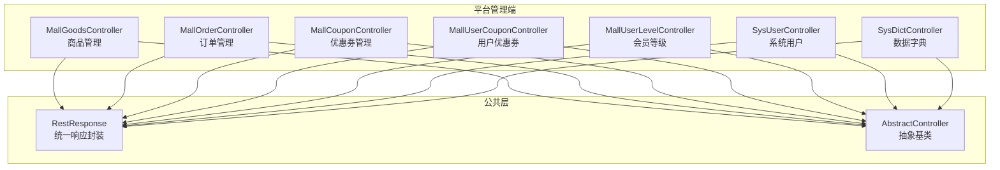
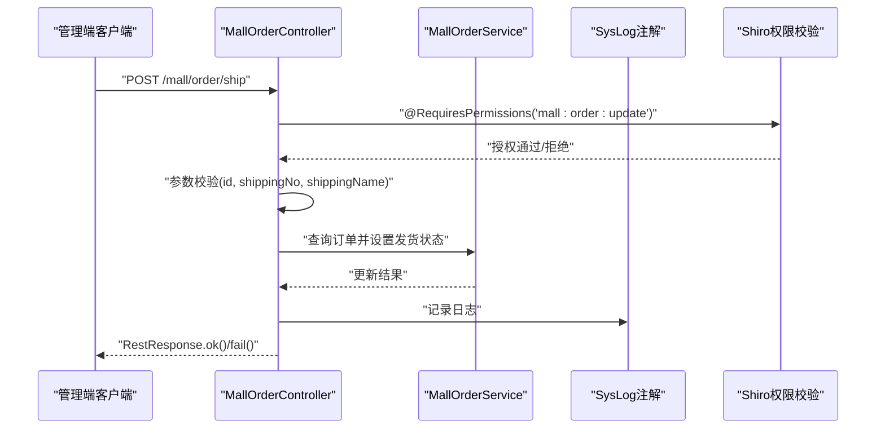
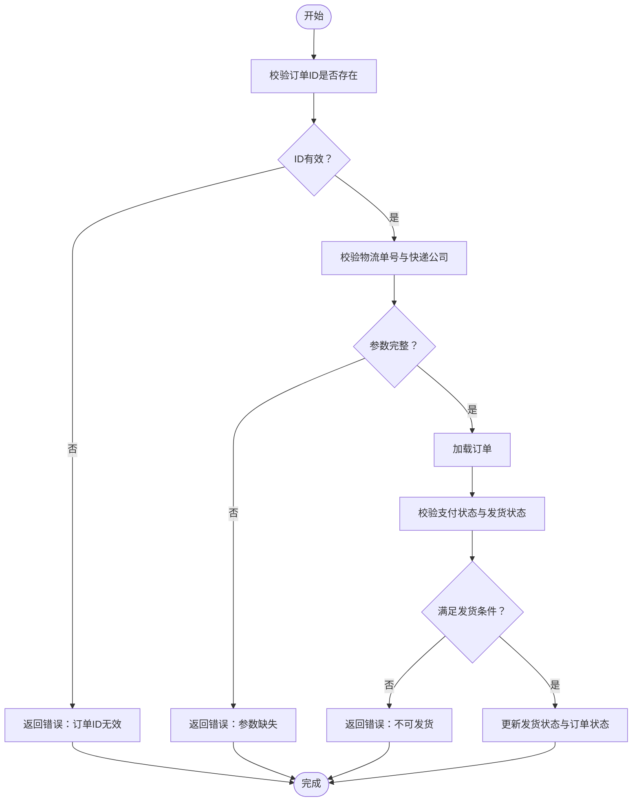
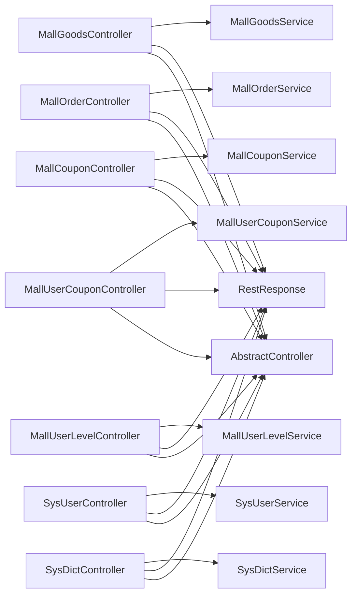

# 商城管理API

<cite>
**本文引用的文件**
- [MallGoodsController.java](file://platform-admin/src/main/java/com/platform/modules/mall/controller/MallGoodsController.java)
- [MallOrderController.java](file://platform-admin/src/main/java/com/platform/modules/mall/controller/MallOrderController.java)
- [MallCouponController.java](file://platform-admin/src/main/java/com/platform/modules/mall/controller/MallCouponController.java)
- [MallUserCouponController.java](file://platform-admin/src/main/java/com/platform/modules/mall/controller/MallUserCouponController.java)
- [MallUserLevelController.java](file://platform-admin/src/main/java/com/platform/modules/mall/controller/MallUserLevelController.java)
- [SysUserController.java](file://platform-admin/src/main/java/com/platform/modules/sys/controller/SysUserController.java)
- [SysDictController.java](file://platform-admin/src/main/java/com/platform/modules/sys/controller/SysDictController.java)
- [RestResponse.java](file://platform-common/src/main/java/com/platform/common/utils/RestResponse.java)
- [AbstractController.java](file://platform-admin/src/main/java/com/platform/modules/sys/controller/AbstractController.java)
- [Shiro权限注解](file://platform-admin/src/main/java/com/platform/modules/mall/controller/MallGoodsController.java)
</cite>

## 目录
1. [简介](#简介)
2. [项目结构](#项目结构)
3. [核心组件](#核心组件)
4. [架构总览](#架构总览)
5. [详细组件分析](#详细组件分析)
6. [依赖分析](#依赖分析)
7. [性能考虑](#性能考虑)
8. [故障排查指南](#故障排查指南)
9. [结论](#结论)
10. [附录](#附录)

## 简介
本文件为商城管理系统的后台管理API接口文档，覆盖商品管理、订单管理、用户与权限管理、营销管理（优惠券）以及内容/字典管理等核心业务模块。文档对每个接口的HTTP方法、URL路径、请求参数、响应格式、状态码与错误处理进行说明，并补充业务逻辑、数据校验规则与权限控制策略。同时提供接口调用示例、参数说明、返回值格式、业务流程图、常见问题与性能优化建议。

## 项目结构
后端采用Spring Boot + MyBatis-Plus + Shiro权限体系，管理端控制器位于platform-admin模块，统一通过@RestController暴露REST接口；公共响应封装在platform-common模块；各业务模块控制器位于modules/mall与modules/sys下。

图表来源
- [MallGoodsController.java:46-184](file://platform-admin/src/main/java/com/platform/modules/mall/controller/MallGoodsController.java#L46-L184)
- [MallOrderController.java:51-262](file://platform-admin/src/main/java/com/platform/modules/mall/controller/MallOrderController.java#L51-L262)
- [MallCouponController.java:44-149](file://platform-admin/src/main/java/com/platform/modules/mall/controller/MallCouponController.java#L44-L149)
- [MallUserCouponController.java:44-149](file://platform-admin/src/main/java/com/platform/modules/mall/controller/MallUserCouponController.java#L44-L149)
- [MallUserLevelController.java:44-149](file://platform-admin/src/main/java/com/platform/modules/mall/controller/MallUserLevelController.java#L44-L149)
- [SysUserController.java:50-243](file://platform-admin/src/main/java/com/platform/modules/sys/controller/SysUserController.java#L50-L243)
- [SysDictController.java:50-176](file://platform-admin/src/main/java/com/platform/modules/sys/controller/SysDictController.java#L50-L176)
- [RestResponse.java](file://platform-common/src/main/java/com/platform/common/utils/RestResponse.java)
- [AbstractController.java](file://platform-admin/src/main/java/com/platform/modules/sys/controller/AbstractController.java)

章节来源
- [MallGoodsController.java:46-184](file://platform-admin/src/main/java/com/platform/modules/mall/controller/MallGoodsController.java#L46-L184)
- [MallOrderController.java:51-262](file://platform-admin/src/main/java/com/platform/modules/mall/controller/MallOrderController.java#L51-L262)
- [MallCouponController.java:44-149](file://platform-admin/src/main/java/com/platform/modules/mall/controller/MallCouponController.java#L44-L149)
- [MallUserCouponController.java:44-149](file://platform-admin/src/main/java/com/platform/modules/mall/controller/MallUserCouponController.java#L44-L149)
- [MallUserLevelController.java:44-149](file://platform-admin/src/main/java/com/platform/modules/mall/controller/MallUserLevelController.java#L44-L149)
- [SysUserController.java:50-243](file://platform-admin/src/main/java/com/platform/modules/sys/controller/SysUserController.java#L50-L243)
- [SysDictController.java:50-176](file://platform-admin/src/main/java/com/platform/modules/sys/controller/SysDictController.java#L50-L176)
- [RestResponse.java](file://platform-common/src/main/java/com/platform/common/utils/RestResponse.java)
- [AbstractController.java](file://platform-admin/src/main/java/com/platform/modules/sys/controller/AbstractController.java)

## 核心组件
- 统一响应封装：RestResponse提供标准的响应结构，包括状态码、消息与数据体，便于前端统一处理。
- 抽象控制器：AbstractController提供通用能力（如获取当前用户、组织机构范围等），各业务控制器继承以复用。
- 权限控制：基于Shiro注解（如@RequiresPermissions）实现细粒度权限校验，确保接口访问安全。

章节来源
- [RestResponse.java](file://platform-common/src/main/java/com/platform/common/utils/RestResponse.java)
- [AbstractController.java](file://platform-admin/src/main/java/com/platform/modules/sys/controller/AbstractController.java)
- [MallGoodsController.java:34-35](file://platform-admin/src/main/java/com/platform/modules/mall/controller/MallGoodsController.java#L34-L35)

## 架构总览
以下序列图展示一次典型“订单发货”接口的调用链路，体现控制器、服务层与权限校验的关系。

图表来源
- [MallOrderController.java:156-198](file://platform-admin/src/main/java/com/platform/modules/mall/controller/MallOrderController.java#L156-L198)
- [Shiro权限注解:34-35](file://platform-admin/src/main/java/com/platform/modules/mall/controller/MallGoodsController.java#L34-L35)

## 详细组件分析

### 商品管理接口
- 基础路径：/mall/goods
- 权限前缀：mall:goods:*

接口清单
- GET /mall/goods/queryAll
  - 功能：查询全部商品列表
  - 权限：mall:goods:list
  - 请求参数：查询条件（Map）
  - 响应：RestResponse<List<MallGoodsEntity>>
  - 错误：无显式校验，异常由统一异常处理器处理
  - 示例：GET /mall/goods/queryAll?name=手机&categoryId=1

- GET /mall/goods/list
  - 功能：分页查询商品
  - 权限：mall:goods:list
  - 请求参数：分页与筛选条件（Map）
  - 响应：RestResponse<Page<MallGoodsEntity>>
  - 示例：GET /mall/goods/list?page=1&limit=20

- GET /mall/goods/info/{id}
  - 功能：按ID查询商品详情
  - 权限：mall:goods:info
  - 路径参数：id（整型）
  - 响应：RestResponse<MallGoodsEntity>
  - 示例：GET /mall/goods/info/123

- GET /mall/goods/aggregate/{id}
  - 功能：查询商品聚合详情（含规格、属性、画册等）
  - 权限：mall:goods:info
  - 响应：RestResponse<GoodsAggregateDTO>
  - 示例：GET /mall/goods/aggregate/123

- POST /mall/goods/save
  - 功能：新增商品
  - 权限：mall:goods:save
  - 请求体：MallGoodsEntity
  - 响应：RestResponse<String>
  - 示例：POST /mall/goods/save（Body为商品JSON）

- POST /mall/goods/aggregate/save
  - 功能：新增商品聚合（一次性写入商品+规格+属性+画册）
  - 权限：mall:goods:save
  - 请求体：GoodsAggregateDTO
  - 响应：RestResponse<Integer>（返回主键ID）
  - 示例：POST /mall/goods/aggregate/save（Body为聚合DTO）

- POST /mall/goods/update
  - 功能：修改商品
  - 权限：mall:goods:update
  - 请求体：MallGoodsEntity
  - 响应：RestResponse<String>
  - 示例：POST /mall/goods/update（Body为商品JSON）

- POST /mall/goods/aggregate/update
  - 功能：修改商品聚合
  - 权限：mall:goods:update
  - 请求体：GoodsAggregateDTO
  - 响应：RestResponse<Integer>
  - 示例：POST /mall/goods/aggregate/update（Body为聚合DTO）

- POST /mall/goods/delete
  - 功能：批量删除商品
  - 权限：mall:goods:delete
  - 请求体：ids（整型数组）
  - 响应：RestResponse<String>
  - 示例：POST /mall/goods/delete（Body为[1,2,3]）

业务逻辑与校验
- 列表/详情/聚合接口均受权限控制
- 聚合新增/修改涉及多表一致性，建议在服务层进行事务性处理
- 建议在新增/修改接口增加字段必填与格式校验（如名称长度、价格范围等）

章节来源
- [MallGoodsController.java:55-182](file://platform-admin/src/main/java/com/platform/modules/mall/controller/MallGoodsController.java#L55-L182)

### 订单管理接口
- 基础路径：/mall/order
- 权限前缀：mall:order:*

接口清单
- GET /mall/order/queryAll
  - 功能：查询全部订单
  - 权限：mall:order:list
  - 响应：RestResponse<List<MallOrderEntity>>

- GET /mall/order/list
  - 功能：分页查询订单
  - 权限：mall:order:list
  - 响应：RestResponse<Page<MallOrderEntity>>

- GET /mall/order/info/{id}
  - 功能：查询订单详情
  - 权限：mall:order:info
  - 响应：RestResponse<MallOrderEntity>

- GET /mall/order/goods/{id}
  - 功能：按订单ID查询订单商品明细
  - 权限：mall:order:info
  - 响应：RestResponse<List<MallOrderGoodsEntity>>

- POST /mall/order/save
  - 功能：新增订单
  - 权限：mall:order:save
  - 请求体：MallOrderEntity
  - 响应：RestResponse<String>

- POST /mall/order/update
  - 功能：通用修改（提示使用“发货/改价”专用接口）
  - 权限：mall:order:update
  - 响应：RestResponse.fail("订单不支持通用修改，请使用“发货”或“改价”操作")

- POST /mall/order/ship
  - 功能：订单发货
  - 权限：mall:order:update
  - 请求体：Map（id, shippingNo, shippingName）
  - 校验：id存在、物流单号与快递公司非空、订单已支付且未发货
  - 响应：RestResponse.ok("发货成功") 或错误信息

- POST /mall/order/adjustPrice
  - 功能：支付前改价（仅未支付订单）
  - 权限：mall:order:update
  - 请求体：Map（id, actualPrice）
  - 校验：id存在、价格非负、订单未支付
  - 响应：RestResponse.ok("改价成功") 或错误信息

- POST /mall/order/delete
  - 功能：批量删除订单
  - 权限：mall:order:delete
  - 请求体：ids（整型数组）
  - 响应：RestResponse<String>

业务流程图（发货）

图表来源
- [MallOrderController.java:156-198](file://platform-admin/src/main/java/com/platform/modules/mall/controller/MallOrderController.java#L156-L198)

章节来源
- [MallOrderController.java:60-260](file://platform-admin/src/main/java/com/platform/modules/mall/controller/MallOrderController.java#L60-L260)

### 营销管理接口（优惠券）
- 基础路径：/mall/coupon
- 权限前缀：mall:coupon:*

接口清单
- GET /mall/coupon/queryAll
  - 权限：mall:coupon:list
  - 响应：RestResponse<List<MallCouponEntity>>

- GET /mall/coupon/list
  - 权限：mall:coupon:list
  - 响应：RestResponse<Page<MallCouponEntity>>

- GET /mall/coupon/info/{id}
  - 权限：mall:coupon:info
  - 响应：RestResponse<MallCouponEntity>

- POST /mall/coupon/save
  - 权限：mall:coupon:save
  - 请求体：MallCouponEntity
  - 响应：RestResponse<String>

- POST /mall/coupon/update
  - 权限：mall:coupon:update
  - 请求体：MallCouponEntity
  - 响应：RestResponse<String>

- POST /mall/coupon/delete
  - 权限：mall:coupon:delete
  - 请求体：ids（整型数组）
  - 响应：RestResponse<String>

章节来源
- [MallCouponController.java:52-147](file://platform-admin/src/main/java/com/platform/modules/mall/controller/MallCouponController.java#L52-L147)

### 用户与会员管理接口
- 用户优惠券基础路径：/mall/usercoupon
  - 权限前缀：mall:usercoupon:*
- 会员等级基础路径：/mall/userlevel
  - 权限前缀：mall:userlevel:*

用户优惠券接口（与优惠券不同，是用户持有状态）
- GET /mall/usercoupon/queryAll
- GET /mall/usercoupon/list
- GET /mall/usercoupon/info/{id}
- POST /mall/usercoupon/save
- POST /mall/usercoupon/update
- POST /mall/usercoupon/delete

会员等级接口
- GET /mall/userlevel/queryAll
- GET /mall/userlevel/list
- GET /mall/userlevel/info/{id}
- POST /mall/userlevel/save
- POST /mall/userlevel/update
- POST /mall/userlevel/delete

章节来源
- [MallUserCouponController.java:52-147](file://platform-admin/src/main/java/com/platform/modules/mall/controller/MallUserCouponController.java#L52-L147)
- [MallUserLevelController.java:52-147](file://platform-admin/src/main/java/com/platform/modules/mall/controller/MallUserLevelController.java#L52-L147)

### 系统管理接口（用户与字典）
- 系统用户基础路径：/sys/user
  - 权限前缀：sys:user:*
- 数据字典基础路径：/sys/dict
  - 权限前缀：sys:dict:*

系统用户接口
- GET /sys/user/queryAll
- GET /sys/user/list
- GET /sys/user/info
- GET /sys/user/info/{userId}
- POST /sys/user/save
- POST /sys/user/update
- POST /sys/user/password
- POST /sys/user/delete
- POST /sys/user/resetPw

数据字典接口
- GET /sys/dict/queryAll
- GET /sys/dict/list
- GET /sys/dict/info/{id}
- GET /sys/dict/queryByCode
- POST /sys/dict/save
- POST /sys/dict/update
- POST /sys/dict/delete

章节来源
- [SysUserController.java:59-241](file://platform-admin/src/main/java/com/platform/modules/sys/controller/SysUserController.java#L59-L241)
- [SysDictController.java:58-174](file://platform-admin/src/main/java/com/platform/modules/sys/controller/SysDictController.java#L58-L174)

## 依赖分析
- 控制器依赖于服务层（Service）与统一响应封装（RestResponse）
- 权限控制通过Shiro注解在控制器层面生效
- 抽象控制器提供通用上下文（如当前用户、数据范围等）

图表来源
- [MallGoodsController.java:52-53](file://platform-admin/src/main/java/com/platform/modules/mall/controller/MallGoodsController.java#L52-L53)
- [MallOrderController.java:57-58](file://platform-admin/src/main/java/com/platform/modules/mall/controller/MallOrderController.java#L57-L58)
- [MallCouponController.java](file://platform-admin/src/main/java/com/platform/modules/mall/controller/MallCouponController.java#L50)
- [MallUserCouponController.java](file://platform-admin/src/main/java/com/platform/modules/mall/controller/MallUserCouponController.java#L50)
- [MallUserLevelController.java](file://platform-admin/src/main/java/com/platform/modules/mall/controller/MallUserLevelController.java#L50)
- [SysUserController.java:56-57](file://platform-admin/src/main/java/com/platform/modules/sys/controller/SysUserController.java#L56-L57)
- [SysDictController.java:55-56](file://platform-admin/src/main/java/com/platform/modules/sys/controller/SysDictController.java#L55-L56)
- [RestResponse.java](file://platform-common/src/main/java/com/platform/common/utils/RestResponse.java)
- [AbstractController.java](file://platform-admin/src/main/java/com/platform/modules/sys/controller/AbstractController.java)

## 性能考虑
- 分页查询：优先使用list接口并传入page/limit参数，避免一次性拉取大量数据
- 缓存策略：对高频读取的数据（如字典、品牌、分类）引入Redis缓存，降低数据库压力
- 接口幂等：对写操作（发货、改价、删除）建议结合唯一键或幂等令牌，防止重复提交
- 日志与审计：启用SysLog注解记录关键操作，便于追踪与审计
- 并发控制：对高并发场景（如秒杀、改价）建议引入分布式锁或队列异步处理

## 故障排查指南
- 权限不足
  - 现象：返回失败，提示无权限
  - 处理：确认用户角色是否具备对应权限（mall:*、sys:*）
  - 参考：各接口上的@RequiresPermissions注解
- 参数校验失败
  - 现象：发货/改价接口返回参数缺失或格式错误
  - 处理：检查请求体字段（id、shippingNo、shippingName、actualPrice）是否齐全且类型正确
- 订单状态异常
  - 现象：发货失败，提示未支付或已发货
  - 处理：确认订单支付状态与发货状态，仅未支付且未发货的订单可发货
- 统一响应结构
  - 所有接口遵循RestResponse结构，前端可统一解析status、msg与data字段

章节来源
- [MallOrderController.java:160-197](file://platform-admin/src/main/java/com/platform/modules/mall/controller/MallOrderController.java#L160-L197)
- [MallOrderController.java:206-244](file://platform-admin/src/main/java/com/platform/modules/mall/controller/MallOrderController.java#L206-L244)
- [RestResponse.java](file://platform-common/src/main/java/com/platform/common/utils/RestResponse.java)

## 结论
本文档梳理了商城管理系统的商品、订单、用户与营销等核心模块的管理端API，明确了接口职责、权限控制、数据校验与响应规范。建议在生产环境中配合缓存、日志与审计机制，持续优化接口性能与稳定性。

## 附录
- 统一响应结构
  - 字段：status（状态码）、msg（消息）、data（数据体）
  - 成功：status=0，msg通常为空或“操作成功”
  - 失败：status非0，msg包含具体错误信息
- 权限前缀
  - 商品：mall:goods:*
  - 订单：mall:order:*
  - 优惠券：mall:coupon:*
  - 用户优惠券：mall:usercoupon:*
  - 会员等级：mall:userlevel:*
  - 系统用户：sys:user:*
  - 数据字典：sys:dict:*

章节来源
- [RestResponse.java](file://platform-common/src/main/java/com/platform/common/utils/RestResponse.java)
- [MallGoodsController.java:34-35](file://platform-admin/src/main/java/com/platform/modules/mall/controller/MallGoodsController.java#L34-L35)
- [MallOrderController.java:34-35](file://platform-admin/src/main/java/com/platform/modules/mall/controller/MallOrderController.java#L34-L35)
- [MallCouponController.java:32-33](file://platform-admin/src/main/java/com/platform/modules/mall/controller/MallCouponController.java#L32-L33)
- [MallUserCouponController.java:32-33](file://platform-admin/src/main/java/com/platform/modules/mall/controller/MallUserCouponController.java#L32-L33)
- [MallUserLevelController.java:32-33](file://platform-admin/src/main/java/com/platform/modules/mall/controller/MallUserLevelController.java#L32-L33)
- [SysUserController.java:37-38](file://platform-admin/src/main/java/com/platform/modules/sys/controller/SysUserController.java#L37-L38)
- [SysDictController.java:37-38](file://platform-admin/src/main/java/com/platform/modules/sys/controller/SysDictController.java#L37-L38)