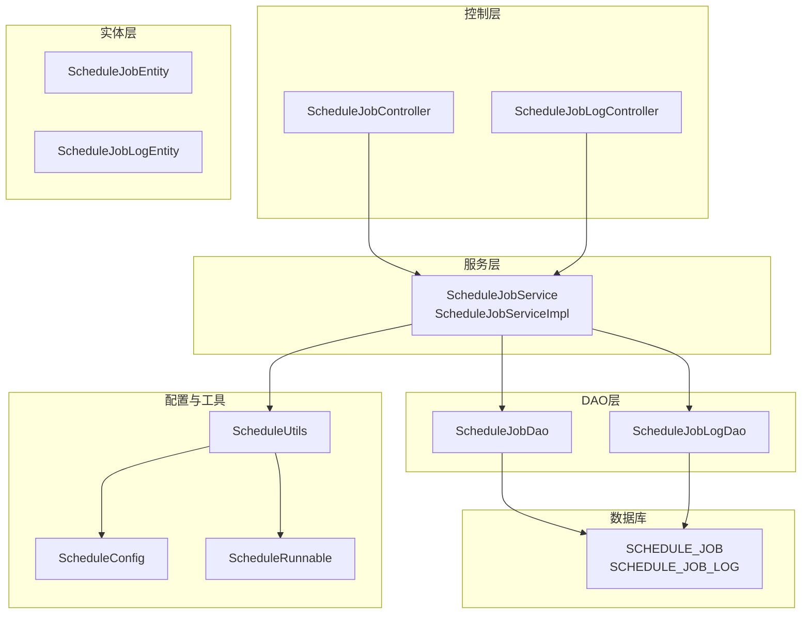
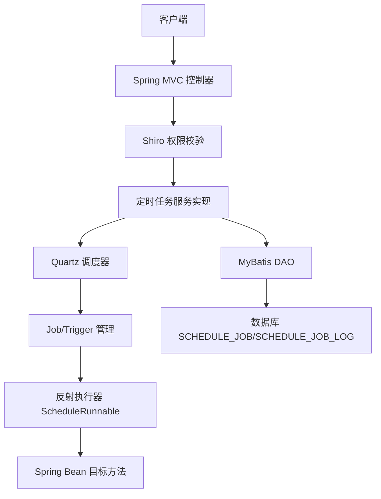
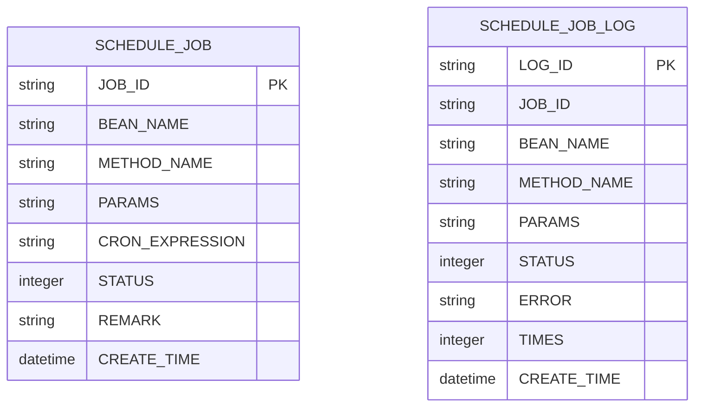
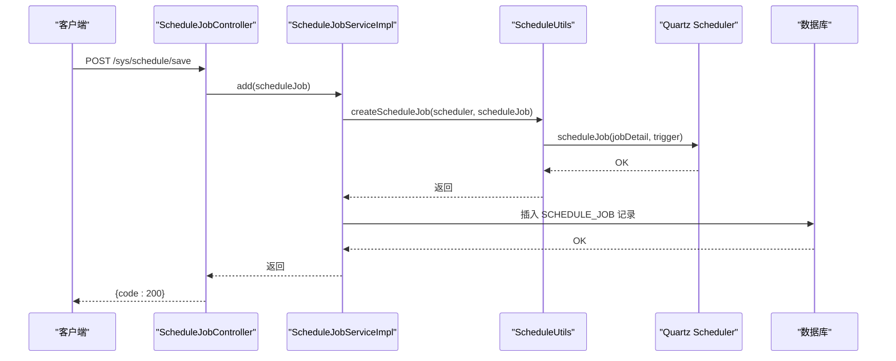
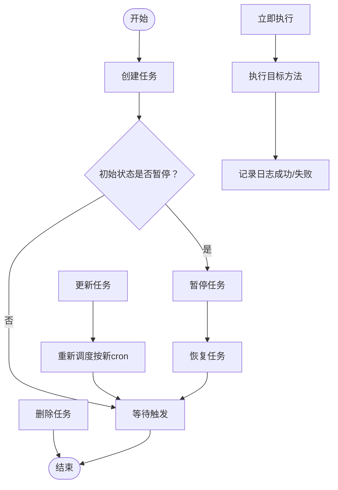
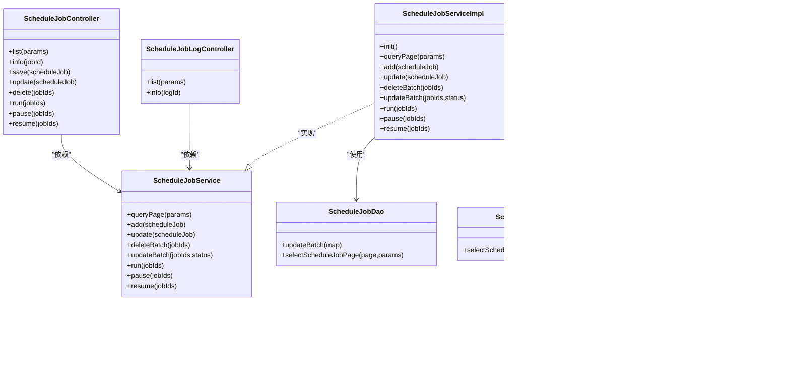

# 定时任务API

<cite>
**本文引用的文件**   
- [ScheduleJobController.java](file://platform-admin/src/main/java/com/platform/modules/job/controller/ScheduleJobController.java)
- [ScheduleJobLogController.java](file://platform-admin/src/main/java/com/platform/modules/job/controller/ScheduleJobLogController.java)
- [ScheduleJobService.java](file://platform-admin/src/main/java/com/platform/modules/job/service/ScheduleJobService.java)
- [ScheduleJobServiceImpl.java](file://platform-admin/src/main/java/com/platform/modules/job/service/impl/ScheduleJobServiceImpl.java)
- [ScheduleJobDao.java](file://platform-admin/src/main/java/com/platform/modules/job/dao/ScheduleJobDao.java)
- [ScheduleJobLogDao.java](file://platform-admin/src/main/java/com/platform/modules/job/dao/ScheduleJobLogDao.java)
- [ScheduleJobEntity.java](file://platform-admin/src/main/java/com/platform/modules/job/entity/ScheduleJobEntity.java)
- [ScheduleJobLogEntity.java](file://platform-admin/src/main/java/com/platform/modules/job/entity/ScheduleJobLogEntity.java)
- [ScheduleConfig.java](file://platform-admin/src/main/java/com/platform/modules/job/config/ScheduleConfig.java)
- [ScheduleUtils.java](file://platform-admin/src/main/java/com/platform/modules/job/utils/ScheduleUtils.java)
- [ScheduleRunnable.java](file://platform-admin/src/main/java/com/platform/modules/job/utils/ScheduleRunnable.java)
- [ScheduleJobDao.xml](file://platform-admin/src/main/resources/mapper/job/ScheduleJobDao.xml)
- [ScheduleJobLogDao.xml](file://platform-admin/src/main/resources/mapper/job/ScheduleJobLogDao.xml)
</cite>

## 目录
1. [简介](#简介)
2. [项目结构](#项目结构)
3. [核心组件](#核心组件)
4. [架构总览](#架构总览)
5. [详细组件分析](#详细组件分析)
6. [依赖分析](#依赖分析)
7. [性能考虑](#性能考虑)
8. [故障排查指南](#故障排查指南)
9. [结论](#结论)
10. [附录](#附录)

## 简介
本文件为平台定时任务管理系统的接口规范与技术说明文档，覆盖以下能力：
- 定时任务的创建、修改、删除、启动（暂停）、恢复（取消暂停）、立即执行
- 定时任务列表与详情查询
- 执行日志的分页查询与详情查询
- 调度机制与执行策略（基于 Quartz 的 Cron 触发）
- 监控与日志记录
- 任务配置示例、Cron 表达式说明、执行日志分析
- 最佳实践、性能优化建议与故障排查方法

## 项目结构
定时任务模块位于 platform-admin 工程中，采用典型的分层架构：
- 控制层：提供 REST 接口，负责权限校验与参数封装
- 服务层：封装业务逻辑，协调 Quartz 调度器与持久化
- DAO 层：MyBatis 映射数据库访问
- 实体层：映射数据库表结构
- 配置层：Quartz 调度器工厂与集群配置
- 工具层：封装 Quartz Job/Trigger 构建、运行与管理

图表来源
- [ScheduleJobController.java:1-178](file://platform-admin/src/main/java/com/platform/modules/job/controller/ScheduleJobController.java#L1-L178)
- [ScheduleJobLogController.java:1-79](file://platform-admin/src/main/java/com/platform/modules/job/controller/ScheduleJobLogController.java#L1-L79)
- [ScheduleJobService.java:1-92](file://platform-admin/src/main/java/com/platform/modules/job/service/ScheduleJobService.java#L1-L92)
- [ScheduleJobServiceImpl.java:1-140](file://platform-admin/src/main/java/com/platform/modules/job/service/impl/ScheduleJobServiceImpl.java#L1-L140)
- [ScheduleJobDao.java:1-56](file://platform-admin/src/main/java/com/platform/modules/job/dao/ScheduleJobDao.java#L1-L56)
- [ScheduleJobLogDao.java:1-27](file://platform-admin/src/main/java/com/platform/modules/job/dao/ScheduleJobLogDao.java#L1-L27)
- [ScheduleJobEntity.java:1-91](file://platform-admin/src/main/java/com/platform/modules/job/entity/ScheduleJobEntity.java#L1-L91)
- [ScheduleJobLogEntity.java:1-84](file://platform-admin/src/main/java/com/platform/modules/job/entity/ScheduleJobLogEntity.java#L1-L84)
- [ScheduleConfig.java:1-76](file://platform-admin/src/main/java/com/platform/modules/job/config/ScheduleConfig.java#L1-L76)
- [ScheduleUtils.java:1-167](file://platform-admin/src/main/java/com/platform/modules/job/utils/ScheduleUtils.java#L1-L167)
- [ScheduleRunnable.java:1-64](file://platform-admin/src/main/java/com/platform/modules/job/utils/ScheduleRunnable.java#L1-L64)

章节来源
- [ScheduleJobController.java:1-178](file://platform-admin/src/main/java/com/platform/modules/job/controller/ScheduleJobController.java#L1-L178)
- [ScheduleJobLogController.java:1-79](file://platform-admin/src/main/java/com/platform/modules/job/controller/ScheduleJobLogController.java#L1-L79)
- [ScheduleJobService.java:1-92](file://platform-admin/src/main/java/com/platform/modules/job/service/ScheduleJobService.java#L1-L92)
- [ScheduleJobServiceImpl.java:1-140](file://platform-admin/src/main/java/com/platform/modules/job/service/impl/ScheduleJobServiceImpl.java#L1-L140)
- [ScheduleJobDao.java:1-56](file://platform-admin/src/main/java/com/platform/modules/job/dao/ScheduleJobDao.java#L1-L56)
- [ScheduleJobLogDao.java:1-27](file://platform-admin/src/main/java/com/platform/modules/job/dao/ScheduleJobLogDao.java#L1-L27)
- [ScheduleJobEntity.java:1-91](file://platform-admin/src/main/java/com/platform/modules/job/entity/ScheduleJobEntity.java#L1-L91)
- [ScheduleJobLogEntity.java:1-84](file://platform-admin/src/main/java/com/platform/modules/job/entity/ScheduleJobLogEntity.java#L1-L84)
- [ScheduleConfig.java:1-76](file://platform-admin/src/main/java/com/platform/modules/job/config/ScheduleConfig.java#L1-L76)
- [ScheduleUtils.java:1-167](file://platform-admin/src/main/java/com/platform/modules/job/utils/ScheduleUtils.java#L1-L167)
- [ScheduleRunnable.java:1-64](file://platform-admin/src/main/java/com/platform/modules/job/utils/ScheduleRunnable.java#L1-L64)

## 核心组件
- 控制器
  - 定时任务控制器：提供列表、详情、保存、更新、删除、立即执行、暂停、恢复等接口
  - 定时任务日志控制器：提供日志列表与详情查询接口
- 服务与实现
  - 定时任务服务接口与实现：封装 Quartz 调度器操作、批量更新状态、初始化加载
- DAO 与实体
  - 定时任务 DAO 与 XML：分页查询、批量更新状态
  - 定时任务日志 DAO 与 XML：分页查询
  - 实体类：映射数据库字段与校验约束
- 配置与工具
  - Quartz 调度器配置：线程池、JobStore、集群、启动延迟、覆盖现有作业
  - 调度工具：构建 Job/Trigger、创建/更新/暂停/恢复/删除、立即执行
  - 反射执行器：通过 Spring 上下文获取 Bean 并反射调用目标方法

章节来源
- [ScheduleJobController.java:40-178](file://platform-admin/src/main/java/com/platform/modules/job/controller/ScheduleJobController.java#L40-L178)
- [ScheduleJobLogController.java:40-79](file://platform-admin/src/main/java/com/platform/modules/job/controller/ScheduleJobLogController.java#L40-L79)
- [ScheduleJobService.java:32-92](file://platform-admin/src/main/java/com/platform/modules/job/service/ScheduleJobService.java#L32-L92)
- [ScheduleJobServiceImpl.java:43-140](file://platform-admin/src/main/java/com/platform/modules/job/service/impl/ScheduleJobServiceImpl.java#L43-L140)
- [ScheduleJobDao.java:36-56](file://platform-admin/src/main/java/com/platform/modules/job/dao/ScheduleJobDao.java#L36-L56)
- [ScheduleJobLogDao.java:4-27](file://platform-admin/src/main/java/com/platform/modules/job/dao/ScheduleJobLogDao.java#L4-L27)
- [ScheduleJobEntity.java:36-91](file://platform-admin/src/main/java/com/platform/modules/job/entity/ScheduleJobEntity.java#L36-L91)
- [ScheduleJobLogEntity.java:33-84](file://platform-admin/src/main/java/com/platform/modules/job/entity/ScheduleJobLogEntity.java#L33-L84)
- [ScheduleConfig.java:33-76](file://platform-admin/src/main/java/com/platform/modules/job/config/ScheduleConfig.java#L33-L76)
- [ScheduleUtils.java:31-167](file://platform-admin/src/main/java/com/platform/modules/job/utils/ScheduleUtils.java#L31-L167)
- [ScheduleRunnable.java:33-64](file://platform-admin/src/main/java/com/platform/modules/job/utils/ScheduleRunnable.java#L33-L64)

## 架构总览
系统以 Spring Boot + Quartz 为核心，使用 PostgreSQL 存储调度元数据，支持集群部署与高可用。

图表来源
- [ScheduleJobController.java:40-178](file://platform-admin/src/main/java/com/platform/modules/job/controller/ScheduleJobController.java#L40-L178)
- [ScheduleJobServiceImpl.java:43-140](file://platform-admin/src/main/java/com/platform/modules/job/service/impl/ScheduleJobServiceImpl.java#L43-L140)
- [ScheduleConfig.java:33-76](file://platform-admin/src/main/java/com/platform/modules/job/config/ScheduleConfig.java#L33-L76)
- [ScheduleUtils.java:31-167](file://platform-admin/src/main/java/com/platform/modules/job/utils/ScheduleUtils.java#L31-L167)
- [ScheduleRunnable.java:33-64](file://platform-admin/src/main/java/com/platform/modules/job/utils/ScheduleRunnable.java#L33-L64)

## 详细组件分析

### 接口清单与规范

- 基础路径
  - 定时任务接口：/sys/schedule
  - 定时任务日志接口：/sys/scheduleLog

- 列表查询
  - 方法：GET
  - 路径：/sys/schedule/list
  - 权限：sys:schedule:list
  - 请求参数：分页与筛选（如 beanName 等）
  - 响应：分页结果，包含任务列表
  - 状态码：200 成功；异常时返回统一错误响应

- 详情查询
  - 方法：GET
  - 路径：/sys/schedule/info/{jobId}
  - 权限：sys:schedule:info
  - 响应：单个任务详情

- 新增任务
  - 方法：POST
  - 路径：/sys/schedule/save
  - 权限：sys:schedule:save
  - 请求体：任务对象（含 beanName、methodName、params、cronExpression、remark 等）
  - 校验：后端进行实体校验
  - 响应：成功标识

- 修改任务
  - 方法：POST
  - 路径：/sys/schedule/update
  - 权限：sys:schedule:update
  - 请求体：任务对象
  - 校验：后端进行实体校验
  - 响应：成功标识

- 删除任务
  - 方法：POST
  - 路径：/sys/schedule/delete
  - 权限：sys:schedule:delete
  - 请求体：jobIds 数组
  - 响应：成功标识

- 立即执行
  - 方法：POST
  - 路径：/sys/schedule/run
  - 权限：sys:schedule:run
  - 请求体：jobIds 数组
  - 响应：成功标识

- 暂停任务
  - 方法：POST
  - 路径：/sys/schedule/pause
  - 权限：sys:schedule:pause
  - 请求体：jobIds 数组
  - 响应：成功标识

- 恢复任务
  - 方法：POST
  - 路径：/sys/schedule/resume
  - 权限：sys:schedule:resume
  - 请求体：jobIds 数组
  - 响应：成功标识

- 日志列表查询
  - 方法：GET
  - 路径：/sys/scheduleLog/list
  - 权限：sys:schedule:log
  - 请求参数：分页与筛选（如 beanName、methodName 等）
  - 响应：分页结果，包含日志列表

- 日志详情查询
  - 方法：GET
  - 路径：/sys/scheduleLog/info/{logId}
  - 权限：sys:schedule:log
  - 响应：单条日志详情

章节来源
- [ScheduleJobController.java:48-178](file://platform-admin/src/main/java/com/platform/modules/job/controller/ScheduleJobController.java#L48-L178)
- [ScheduleJobLogController.java:48-79](file://platform-admin/src/main/java/com/platform/modules/job/controller/ScheduleJobLogController.java#L48-L79)

### 数据模型

图表来源
- [ScheduleJobEntity.java:36-91](file://platform-admin/src/main/java/com/platform/modules/job/entity/ScheduleJobEntity.java#L36-L91)
- [ScheduleJobLogEntity.java:33-84](file://platform-admin/src/main/java/com/platform/modules/job/entity/ScheduleJobLogEntity.java#L33-L84)

章节来源
- [ScheduleJobEntity.java:36-91](file://platform-admin/src/main/java/com/platform/modules/job/entity/ScheduleJobEntity.java#L36-L91)
- [ScheduleJobLogEntity.java:33-84](file://platform-admin/src/main/java/com/platform/modules/job/entity/ScheduleJobLogEntity.java#L33-L84)

### 调度机制与执行策略

- 调度器配置
  - 使用 Quartz 的 SchedulerFactoryBean 进行集中配置
  - 线程池：SimpleThreadPool，线程数 20，优先级 5
  - JobStore：LocalDataSourceJobStore，PostgreSQL 委托
  - 集群：启用 isClustered，检查间隔 15000ms，最大并发错失处理数 1
  - 启动策略：startupDelay=30 秒，autoStartup=true，overwriteExistingJobs=true
  - 表前缀：QRTZ_

- 任务构建与管理
  - JobKey/TriggerKey：统一以“TASK_”前缀拼接 jobId
  - CronTrigger：基于 cronExpression 构建，错失处理策略为“不做任何处理”
  - reschedule：当更新任务时，按新 cronExpression 重建触发器并保留参数
  - 状态同步：若任务初始状态为暂停，则在创建后立即暂停

- 反射执行
  - 通过 Spring 上下文获取目标 Bean
  - 支持带参或无参方法反射调用
  - 异常包装为业务异常并上抛

图表来源
- [ScheduleJobController.java:84-94](file://platform-admin/src/main/java/com/platform/modules/job/controller/ScheduleJobController.java#L84-L94)
- [ScheduleJobServiceImpl.java:74-82](file://platform-admin/src/main/java/com/platform/modules/job/service/impl/ScheduleJobServiceImpl.java#L74-L82)
- [ScheduleUtils.java:62-86](file://platform-admin/src/main/java/com/platform/modules/job/utils/ScheduleUtils.java#L62-L86)

章节来源
- [ScheduleConfig.java:33-76](file://platform-admin/src/main/java/com/platform/modules/job/config/ScheduleConfig.java#L33-L76)
- [ScheduleUtils.java:31-167](file://platform-admin/src/main/java/com/platform/modules/job/utils/ScheduleUtils.java#L31-L167)
- [ScheduleRunnable.java:33-64](file://platform-admin/src/main/java/com/platform/modules/job/utils/ScheduleRunnable.java#L33-L64)

### 执行流程与状态机

图表来源
- [ScheduleJobServiceImpl.java:48-62](file://platform-admin/src/main/java/com/platform/modules/job/service/impl/ScheduleJobServiceImpl.java#L48-L62)
- [ScheduleUtils.java:88-117](file://platform-admin/src/main/java/com/platform/modules/job/utils/ScheduleUtils.java#L88-L117)
- [ScheduleUtils.java:120-132](file://platform-admin/src/main/java/com/platform/modules/job/utils/ScheduleUtils.java#L120-L132)
- [ScheduleUtils.java:134-154](file://platform-admin/src/main/java/com/platform/modules/job/utils/ScheduleUtils.java#L134-L154)
- [ScheduleUtils.java:156-165](file://platform-admin/src/main/java/com/platform/modules/job/utils/ScheduleUtils.java#L156-L165)

## 依赖分析

图表来源
- [ScheduleJobController.java:40-178](file://platform-admin/src/main/java/com/platform/modules/job/controller/ScheduleJobController.java#L40-L178)
- [ScheduleJobLogController.java:40-79](file://platform-admin/src/main/java/com/platform/modules/job/controller/ScheduleJobLogController.java#L40-L79)
- [ScheduleJobService.java:32-92](file://platform-admin/src/main/java/com/platform/modules/job/service/ScheduleJobService.java#L32-L92)
- [ScheduleJobServiceImpl.java:43-140](file://platform-admin/src/main/java/com/platform/modules/job/service/impl/ScheduleJobServiceImpl.java#L43-L140)
- [ScheduleJobDao.java:36-56](file://platform-admin/src/main/java/com/platform/modules/job/dao/ScheduleJobDao.java#L36-L56)
- [ScheduleJobLogDao.java:4-27](file://platform-admin/src/main/java/com/platform/modules/job/dao/ScheduleJobLogDao.java#L4-L27)
- [ScheduleUtils.java:31-167](file://platform-admin/src/main/java/com/platform/modules/job/utils/ScheduleUtils.java#L31-L167)
- [ScheduleRunnable.java:33-64](file://platform-admin/src/main/java/com/platform/modules/job/utils/ScheduleRunnable.java#L33-L64)
- [ScheduleConfig.java:33-76](file://platform-admin/src/main/java/com/platform/modules/job/config/ScheduleConfig.java#L33-L76)

章节来源
- [ScheduleJobController.java:40-178](file://platform-admin/src/main/java/com/platform/modules/job/controller/ScheduleJobController.java#L40-L178)
- [ScheduleJobLogController.java:40-79](file://platform-admin/src/main/java/com/platform/modules/job/controller/ScheduleJobLogController.java#L40-L79)
- [ScheduleJobService.java:32-92](file://platform-admin/src/main/java/com/platform/modules/job/service/ScheduleJobService.java#L32-L92)
- [ScheduleJobServiceImpl.java:43-140](file://platform-admin/src/main/java/com/platform/modules/job/service/impl/ScheduleJobServiceImpl.java#L43-L140)
- [ScheduleJobDao.java:36-56](file://platform-admin/src/main/java/com/platform/modules/job/dao/ScheduleJobDao.java#L36-L56)
- [ScheduleJobLogDao.java:4-27](file://platform-admin/src/main/java/com/platform/modules/job/dao/ScheduleJobLogDao.java#L4-L27)
- [ScheduleUtils.java:31-167](file://platform-admin/src/main/java/com/platform/modules/job/utils/ScheduleUtils.java#L31-L167)
- [ScheduleRunnable.java:33-64](file://platform-admin/src/main/java/com/platform/modules/job/utils/ScheduleRunnable.java#L33-L64)
- [ScheduleConfig.java:33-76](file://platform-admin/src/main/java/com/platform/modules/job/config/ScheduleConfig.java#L33-L76)

## 性能考虑
- 线程池规模：默认 20 个线程，可根据任务并发需求与 CPU 核心数调整
- 集群一致性：启用集群模式，降低单点风险；合理设置 checkinInterval 与 misfire 处理阈值
- 错失处理：当前策略为“不做任何处理”，避免大量堆积；如需补偿，请评估任务幂等性与资源占用
- 启动延迟：startupDelay=30 秒，避免应用刚启动时并发调度造成抖动
- 数据库压力：分页查询与条件过滤，避免全表扫描；索引建议：jobId、beanName、methodName、createTime
- 反射开销：尽量减少复杂参数传递；必要时预序列化参数字符串

## 故障排查指南
- 常见问题定位
  - 任务未触发：检查 cron 表达式合法性、任务状态（正常/暂停）、Quartz 调度器是否启动
  - 任务执行失败：查看 SCHEDULE_JOB_LOG 中的 error 字段与 times 耗时
  - 并发冲突：确认集群配置与锁机制；检查 misfire 阈值与 maxMisfiresToHandleAtATime
  - 权限不足：确认用户是否具备相应 sys:schedule:* 权限
- 关键日志字段
  - 日志状态：0 成功、1 失败
  - 失败原因：error 字段记录异常信息
  - 耗时：times（毫秒）
- 快速修复步骤
  - 重试失败任务：先暂停再恢复，或直接立即执行
  - 调整调度策略：修改 cron 表达式或暂停/恢复任务
  - 清理无效任务：删除后重建

章节来源
- [ScheduleJobLogEntity.java:65-77](file://platform-admin/src/main/java/com/platform/modules/job/entity/ScheduleJobLogEntity.java#L65-L77)
- [ScheduleConfig.java:53-58](file://platform-admin/src/main/java/com/platform/modules/job/config/ScheduleConfig.java#L53-L58)
- [ScheduleUtils.java:68-70](file://platform-admin/src/main/java/com/platform/modules/job/utils/ScheduleUtils.java#L68-L70)

## 结论
该定时任务系统基于 Quartz 提供稳定可靠的调度能力，结合 Spring Boot 与 PostgreSQL 实现了可扩展、可集群的任务管理与监控。通过清晰的接口设计与完善的日志体系，能够满足生产环境对任务编排、可观测性与高可用的要求。

## 附录

### Cron 表达式说明
- Quartz Cron 表达式由 6 或 7 个字段组成（秒 分 时 日 月 周 年），支持通配符、范围、步长与特殊字符
- 建议
  - 避免过于密集的调度频率
  - 对周期性任务使用固定间隔或明确的时间点
  - 在变更表达式前评估对系统负载的影响

### 任务配置示例（字段说明）
- jobId：任务唯一标识
- beanName：Spring Bean 名称（反射调用的目标类）
- methodName：方法名称（可带参或无参）
- params：传入参数（JSON 字符串或简单字符串）
- cronExpression：Cron 表达式
- status：任务状态（正常/暂停）
- remark：备注
- createTime：创建时间

章节来源
- [ScheduleJobEntity.java:49-78](file://platform-admin/src/main/java/com/platform/modules/job/entity/ScheduleJobEntity.java#L49-L78)