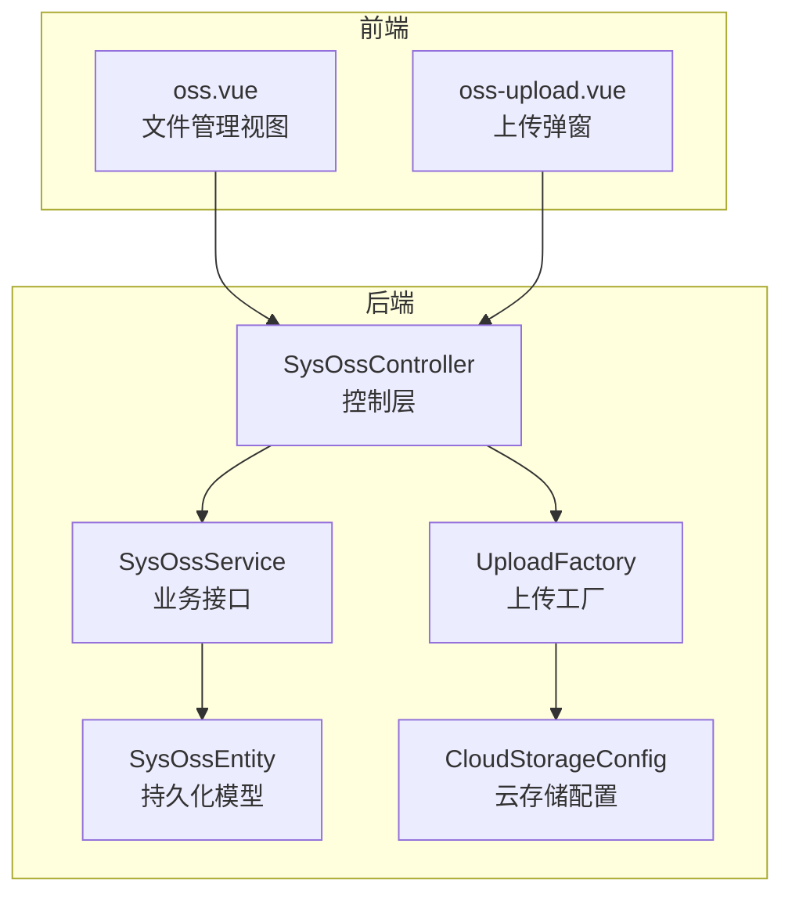
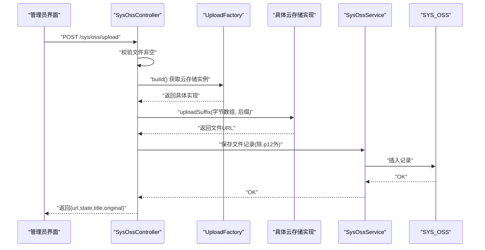
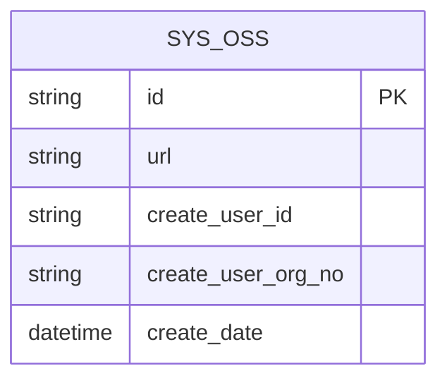
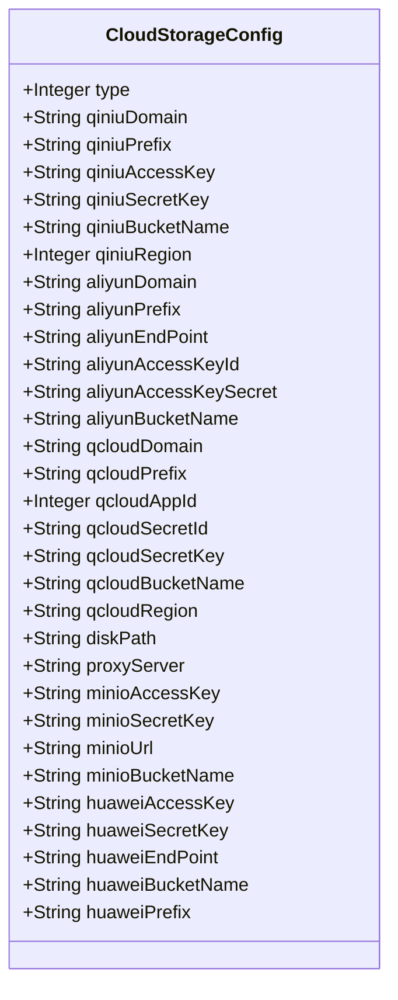
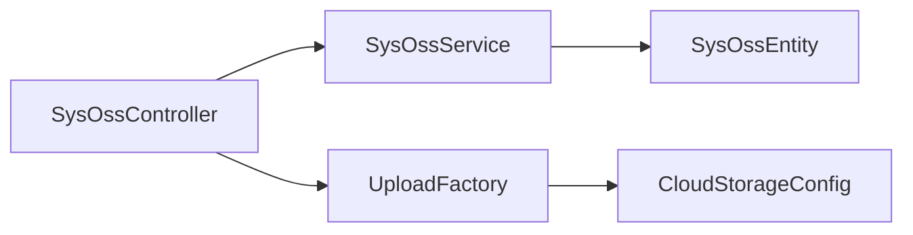

# 对象存储API

<cite>
**本文引用的文件**
- [SysOssController.java](file://platform-admin/src/main/java/com/platform/modules/oss/controller/SysOssController.java)
- [SysOssService.java](file://platform-biz/src/main/java/com/platform/modules/oss/service/SysOssService.java)
- [SysOssEntity.java](file://platform-biz/src/main/java/com/platform/modules/oss/entity/SysOssEntity.java)
- [CloudStorageConfig.java](file://platform-biz/src/main/java/com/platform/modules/oss/cloud/CloudStorageConfig.java)
- [UploadFactory.java](file://platform-biz/src/main/java/com/platform/modules/oss/cloud/UploadFactory.java)
- [oss.vue](file://platform-admin-ui/src/views/modules/oss/oss.vue)
- [oss-upload.vue](file://platform-admin-ui/src/views/modules/oss/oss-upload.vue)
</cite>

## 目录
1. [简介](#简介)
2. [项目结构](#项目结构)
3. [核心组件](#核心组件)
4. [架构总览](#架构总览)
5. [详细组件分析](#详细组件分析)
6. [依赖分析](#依赖分析)
7. [性能考虑](#性能考虑)
8. [故障排查指南](#故障排查指南)
9. [结论](#结论)
10. [附录](#附录)

## 简介
本文件面向平台文件存储管理系统，提供对象存储API接口规范与实现说明，覆盖文件上传、云存储配置、文件管理与云存储集成等能力。文档从接口定义、请求/响应格式、状态码与错误处理、上传流程、存储策略与安全控制等方面进行系统化阐述，并给出上传示例、优化建议与常见问题解决方案。

## 项目结构
对象存储相关模块在后端采用“控制层-业务层-实体与云存储配置”的分层设计；前端通过管理界面调用后端接口完成文件上传、配置查看与编辑、文件列表与删除等操作。

图表来源
- [SysOssController.java:52-309](file://platform-admin/src/main/java/com/platform/modules/oss/controller/SysOssController.java#L52-L309)
- [SysOssService.java:33-42](file://platform-biz/src/main/java/com/platform/modules/oss/service/SysOssService.java#L33-L42)
- [SysOssEntity.java:34-57](file://platform-biz/src/main/java/com/platform/modules/oss/entity/SysOssEntity.java#L34-L57)
- [UploadFactory.java:31-58](file://platform-biz/src/main/java/com/platform/modules/oss/cloud/UploadFactory.java#L31-L58)
- [CloudStorageConfig.java:37-187](file://platform-biz/src/main/java/com/platform/modules/oss/cloud/CloudStorageConfig.java#L37-L187)
- [oss.vue:105-195](file://platform-admin-ui/src/views/modules/oss/oss.vue#L105-L195)
- [oss-upload.vue:24-73](file://platform-admin-ui/src/views/modules/oss/oss-upload.vue#L24-L73)

章节来源
- [SysOssController.java:52-309](file://platform-admin/src/main/java/com/platform/modules/oss/controller/SysOssController.java#L52-L309)
- [SysOssService.java:33-42](file://platform-biz/src/main/java/com/platform/modules/oss/service/SysOssService.java#L33-L42)
- [SysOssEntity.java:34-57](file://platform-biz/src/main/java/com/platform/modules/oss/entity/SysOssEntity.java#L34-L57)
- [CloudStorageConfig.java:37-187](file://platform-biz/src/main/java/com/platform/modules/oss/cloud/CloudStorageConfig.java#L37-L187)
- [UploadFactory.java:31-58](file://platform-biz/src/main/java/com/platform/modules/oss/cloud/UploadFactory.java#L31-L58)
- [oss.vue:105-195](file://platform-admin-ui/src/views/modules/oss/oss.vue#L105-L195)
- [oss-upload.vue:24-73](file://platform-admin-ui/src/views/modules/oss/oss-upload.vue#L24-L73)

## 核心组件
- 控制器：SysOssController 提供文件上传、列表分页、云存储配置读取与保存、文件删除等接口。
- 业务接口：SysOssService 定义分页查询能力。
- 实体模型：SysOssEntity 映射 SYS_OSS 表，记录文件URL、创建人、组织、创建时间等。
- 云存储配置：CloudStorageConfig 定义多种云厂商配置字段及校验规则。
- 上传工厂：UploadFactory 基于系统配置动态选择具体云存储实现。

章节来源
- [SysOssController.java:52-309](file://platform-admin/src/main/java/com/platform/modules/oss/controller/SysOssController.java#L52-L309)
- [SysOssService.java:33-42](file://platform-biz/src/main/java/com/platform/modules/oss/service/SysOssService.java#L33-L42)
- [SysOssEntity.java:34-57](file://platform-biz/src/main/java/com/platform/modules/oss/entity/SysOssEntity.java#L34-L57)
- [CloudStorageConfig.java:37-187](file://platform-biz/src/main/java/com/platform/modules/oss/cloud/CloudStorageConfig.java#L37-L187)
- [UploadFactory.java:31-58](file://platform-biz/src/main/java/com/platform/modules/oss/cloud/UploadFactory.java#L31-L58)

## 架构总览
对象存储接口围绕“统一上传入口 + 工厂选择云实现 + 配置驱动 + 数据持久化”展开。前端通过管理界面发起请求，后端根据当前云存储配置选择对应实现，完成文件上传并写入数据库记录。

图表来源
- [SysOssController.java:179-209](file://platform-admin/src/main/java/com/platform/modules/oss/controller/SysOssController.java#L179-L209)
- [UploadFactory.java:38-56](file://platform-biz/src/main/java/com/platform/modules/oss/cloud/UploadFactory.java#L38-L56)
- [SysOssService.java:33-42](file://platform-biz/src/main/java/com/platform/modules/oss/service/SysOssService.java#L33-L42)
- [SysOssEntity.java:34-57](file://platform-biz/src/main/java/com/platform/modules/oss/entity/SysOssEntity.java#L34-L57)

## 详细组件分析

### 接口清单与规范

- 列表分页查询
  - 方法与路径：GET /sys/oss/list
  - 请求参数：
    - page：页码
    - limit：每页条数
    - url：可选，按URL过滤
  - 响应：分页结果，包含 records、total 等
  - 权限：无需特殊权限
  - 错误：无显式错误码定义，遵循全局异常处理

  章节来源
  - [SysOssController.java:78-86](file://platform-admin/src/main/java/com/platform/modules/oss/controller/SysOssController.java#L78-L86)

- 云存储配置信息
  - 方法与路径：GET /sys/oss/config
  - 权限：sys:oss:config
  - 响应：CloudStorageConfig 对象
  - 错误：鉴权失败返回未授权

  章节来源
  - [SysOssController.java:93-100](file://platform-admin/src/main/java/com/platform/modules/oss/controller/SysOssController.java#L93-L100)

- 修改云存储配置
  - 方法与路径：POST /sys/oss/saveConfig
  - 权限：sys:oss:config
  - 请求体：CloudStorageConfig
  - 校验：根据 type 选择不同分组校验
  - 响应：成功标识
  - 错误：参数校验失败、类型不匹配

  章节来源
  - [SysOssController.java:108-139](file://platform-admin/src/main/java/com/platform/modules/oss/controller/SysOssController.java#L108-L139)
  - [CloudStorageConfig.java:44-83](file://platform-biz/src/main/java/com/platform/modules/oss/cloud/CloudStorageConfig.java#L44-L83)

- 上传文件（表单）
  - 方法与路径：POST /sys/oss/upload
  - 参数：multipart/form-data，字段名为 file
  - 响应：包含 url、state、title、original 的对象
  - 特殊逻辑：.p12 文件不入库
  - 错误：文件为空抛业务异常

  章节来源
  - [SysOssController.java:179-209](file://platform-admin/src/main/java/com/platform/modules/oss/controller/SysOssController.java#L179-L209)

- 上传文件（兼容UEditor GET）
  - 方法与路径：GET /sys/oss/upload
  - 参数：action（config 或 listimage）、page、limit
  - 响应：
    - action=config：返回UEditor配置JSON字符串
    - action=listimage：返回分页列表与状态
  - 权限：无需特殊权限

  章节来源
  - [SysOssController.java:146-171](file://platform-admin/src/main/java/com/platform/modules/oss/controller/SysOssController.java#L146-L171)

- 删除文件记录
  - 方法与路径：POST /sys/oss/delete
  - 权限：sys:oss:delete
  - 请求体：字符串数组 ids
  - 响应：成功标识

  章节来源
  - [SysOssController.java:217-225](file://platform-admin/src/main/java/com/platform/modules/oss/controller/SysOssController.java#L217-L225)

### 上传流程与策略

- 上传流程
  - 前端通过 oss-upload.vue 发起上传，携带 token
  - 后端接收文件，解析后缀，调用 UploadFactory.build() 获取云存储实现
  - 将文件字节数组与后缀传入具体实现，获得URL
  - 除.p12外均写入 SYS_OSS 记录
  - 返回兼容UEditor的字段集合

- 存储策略
  - 支持多家云存储与本地磁盘，通过配置项 type 选择
  - 不同云厂商字段差异由 CloudStorageConfig 的分组校验约束
  - 本地磁盘模式支持代理服务器与存储路径配置

- 安全控制
  - 配置读取与修改受权限控制（sys:oss:config）
  - 删除记录受权限控制（sys:oss:delete）
  - 上传接口未显式鉴权注解，但前端会附带token参数，实际鉴权由网关/拦截器负责

章节来源
- [oss-upload.vue:36-38](file://platform-admin-ui/src/views/modules/oss/oss-upload.vue#L36-L38)
- [SysOssController.java:179-209](file://platform-admin/src/main/java/com/platform/modules/oss/controller/SysOssController.java#L179-L209)
- [UploadFactory.java:38-56](file://platform-biz/src/main/java/com/platform/modules/oss/cloud/UploadFactory.java#L38-L56)
- [CloudStorageConfig.java:44-187](file://platform-biz/src/main/java/com/platform/modules/oss/cloud/CloudStorageConfig.java#L44-L187)
- [SysOssEntity.java:34-57](file://platform-biz/src/main/java/com/platform/modules/oss/entity/SysOssEntity.java#L34-L57)

### 数据模型

图表来源
- [SysOssEntity.java:34-57](file://platform-biz/src/main/java/com/platform/modules/oss/entity/SysOssEntity.java#L34-L57)

章节来源
- [SysOssEntity.java:34-57](file://platform-biz/src/main/java/com/platform/modules/oss/entity/SysOssEntity.java#L34-L57)

### 云存储配置模型

图表来源
- [CloudStorageConfig.java:37-187](file://platform-biz/src/main/java/com/platform/modules/oss/cloud/CloudStorageConfig.java#L37-L187)

章节来源
- [CloudStorageConfig.java:37-187](file://platform-biz/src/main/java/com/platform/modules/oss/cloud/CloudStorageConfig.java#L37-L187)

### 前端交互要点
- oss.vue：提供文件列表、分页、复制URL、批量删除入口
- oss-upload.vue：拖拽/点击上传，限制图片类型，成功后提示并可继续上传

章节来源
- [oss.vue:105-195](file://platform-admin-ui/src/views/modules/oss/oss.vue#L105-L195)
- [oss-upload.vue:24-73](file://platform-admin-ui/src/views/modules/oss/oss-upload.vue#L24-L73)

## 依赖分析

图表来源
- [SysOssController.java:52-309](file://platform-admin/src/main/java/com/platform/modules/oss/controller/SysOssController.java#L52-L309)
- [SysOssService.java:33-42](file://platform-biz/src/main/java/com/platform/modules/oss/service/SysOssService.java#L33-L42)
- [SysOssEntity.java:34-57](file://platform-biz/src/main/java/com/platform/modules/oss/entity/SysOssEntity.java#L34-L57)
- [UploadFactory.java:31-58](file://platform-biz/src/main/java/com/platform/modules/oss/cloud/UploadFactory.java#L31-L58)
- [CloudStorageConfig.java:37-187](file://platform-biz/src/main/java/com/platform/modules/oss/cloud/CloudStorageConfig.java#L37-L187)

章节来源
- [SysOssController.java:52-309](file://platform-admin/src/main/java/com/platform/modules/oss/controller/SysOssController.java#L52-L309)
- [SysOssService.java:33-42](file://platform-biz/src/main/java/com/platform/modules/oss/service/SysOssService.java#L33-L42)
- [SysOssEntity.java:34-57](file://platform-biz/src/main/java/com/platform/modules/oss/entity/SysOssEntity.java#L34-L57)
- [UploadFactory.java:31-58](file://platform-biz/src/main/java/com/platform/modules/oss/cloud/UploadFactory.java#L31-L58)
- [CloudStorageConfig.java:37-187](file://platform-biz/src/main/java/com/platform/modules/oss/cloud/CloudStorageConfig.java#L37-L187)

## 性能考虑
- 上传文件大小限制：UEditor配置中对图片与文件最大尺寸有明确上限，避免过大文件导致内存压力与网络拥塞。
- 压缩策略：图片上传可启用压缩，降低带宽与存储成本。
- 并发与队列：大流量场景建议引入消息队列异步处理上传与入库，减轻主流程压力。
- CDN加速：云存储配置支持域名前缀，结合CDN可显著提升访问速度。
- 本地磁盘：代理服务器与路径配置可用于内网或边缘节点部署，减少跨域与跨机房传输。

## 故障排查指南
- 上传失败
  - 现象：返回错误信息或无响应
  - 排查：确认文件非空、类型符合要求、云存储配置正确且可用
  - 参考
    - [SysOssController.java:181-184](file://platform-admin/src/main/java/com/platform/modules/oss/controller/SysOssController.java#L181-L184)
    - [oss-upload.vue:42-46](file://platform-admin-ui/src/views/modules/oss/oss-upload.vue#L42-L46)

- 配置保存失败
  - 现象：保存后仍报错或无效
  - 排查：检查 type 与对应分组字段是否满足校验规则
  - 参考
    - [SysOssController.java:112-134](file://platform-admin/src/main/java/com/platform/modules/oss/controller/SysOssController.java#L112-L134)
    - [CloudStorageConfig.java:44-83](file://platform-biz/src/main/java/com/platform/modules/oss/cloud/CloudStorageConfig.java#L44-L83)

- 权限不足
  - 现象：无法查看/修改配置或删除记录
  - 排查：确认具备 sys:oss:config/sys:oss:delete 权限
  - 参考
    - [SysOssController.java:95-96](file://platform-admin/src/main/java/com/platform/modules/oss/controller/SysOssController.java#L95-L96)
    - [SysOssController.java:220-221](file://platform-admin/src/main/java/com/platform/modules/oss/controller/SysOssController.java#L220-L221)

- .p12 文件未入库
  - 现象：上传成功但数据库无记录
  - 说明：.p12 文件不入库，属预期行为
  - 参考
    - [SysOssController.java:192-201](file://platform-admin/src/main/java/com/platform/modules/oss/controller/SysOssController.java#L192-L201)

## 结论
该对象存储API以统一上传入口为核心，通过配置驱动实现多云/本地存储切换，配合UEditor兼容接口与基础文件管理功能，满足平台内容管理与资源分发需求。建议在生产环境完善鉴权、限流与异步化处理，并结合CDN与压缩策略优化性能与成本。

## 附录

### 上传示例（基于前端交互）
- 打开“上传文件”弹窗，拖拽或点击选择图片
- 成功后若全部上传完成，弹窗提示是否继续操作
- 关闭弹窗后触发父组件刷新列表

章节来源
- [oss-upload.vue:36-71](file://platform-admin-ui/src/views/modules/oss/oss-upload.vue#L36-L71)
- [oss.vue:160-166](file://platform-admin-ui/src/views/modules/oss/oss.vue#L160-L166)