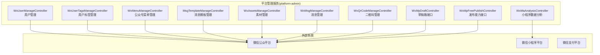
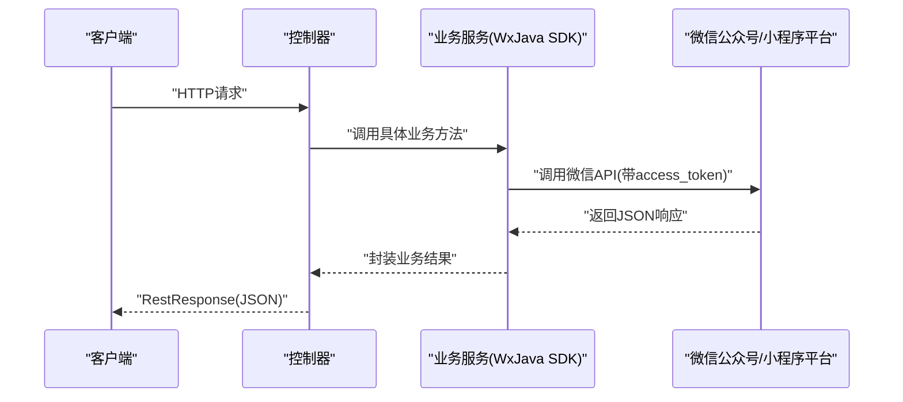
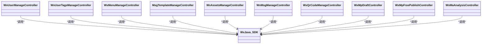

# 微信管理API

<cite>
**本文引用的文件**
- [application.yml](file://platform-admin/src/main/resources/application.yml)
- [WxUserManageController.java](file://platform-admin/src/main/java/com/platform/modules/wx/controller/WxUserManageController.java)
- [WxUserTagsManageController.java](file://platform-admin/src/main/java/com/platform/modules/wx/controller/WxUserTagsManageController.java)
- [WxMenuManageController.java](file://platform-admin/src/main/java/com/platform/modules/wx/controller/WxMenuManageController.java)
- [MsgTemplateManageController.java](file://platform-admin/src/main/java/com/platform/modules/wx/controller/MsgTemplateManageController.java)
- [WxAssetsManageController.java](file://platform-admin/src/main/java/com/platform/modules/wx/controller/WxAssetsManageController.java)
- [WxMsgManageController.java](file://platform-admin/src/main/java/com/platform/modules/wx/controller/WxMsgManageController.java)
- [WxQrCodeManageController.java](file://platform-admin/src/main/java/com/platform/modules/wx/controller/WxQrCodeManageController.java)
- [WxMpDraftController.java](file://platform-admin/src/main/java/com/platform/modules/wx/controller/WxMpDraftController.java)
- [WxMpFreePublishController.java](file://platform-admin/src/main/java/com/platform/modules/wx/controller/WxMpFreePublishController.java)
- [WxMaAnalysisController.java](file://platform-admin/src/main/java/com/platform/modules/wx/controller/WxMaAnalysisController.java)
</cite>

## 目录
1. [简介](#简介)
2. [项目结构](#项目结构)
3. [核心组件](#核心组件)
4. [架构总览](#架构总览)
5. [详细组件分析](#详细组件分析)
6. [依赖关系分析](#依赖关系分析)
7. [性能与并发特性](#性能与并发特性)
8. [调试与排障指南](#调试与排障指南)
9. [结论](#结论)
10. [附录](#附录)

## 简介
本文件为“微信管理API”的接口规范文档，覆盖微信公众号管理、微信小程序管理、消息模板管理、素材管理、用户标签管理、菜单管理、草稿箱与发布、二维码管理以及小程序数据分析等模块。文档面向后端与前端开发者，提供各接口的HTTP方法、URL路径、请求参数、响应格式、状态码与错误处理策略，并结合项目实际配置说明认证机制、回调处理与调用流程。

## 项目结构
后端基于Spring Boot工程，微信相关接口集中在平台管理模块（platform-admin）的wx包下，统一通过REST风格暴露，使用Knife4j/SpringDoc聚合接口文档，按模块分组展示。微信配置集中于application.yml，包含公众号、小程序、支付等关键参数。

图表来源
- [WxUserManageController.java:44-81](file://platform-admin/src/main/java/com/platform/modules/wx/controller/WxUserManageController.java#L44-L81)
- [WxUserTagsManageController.java:44-111](file://platform-admin/src/main/java/com/platform/modules/wx/controller/WxUserTagsManageController.java#L44-L111)
- [WxMenuManageController.java:46-90](file://platform-admin/src/main/java/com/platform/modules/wx/controller/WxMenuManageController.java#L46-L90)
- [MsgTemplateManageController.java:48-177](file://platform-admin/src/main/java/com/platform/modules/wx/controller/MsgTemplateManageController.java#L48-L177)
- [WxAssetsManageController.java:47-147](file://platform-admin/src/main/java/com/platform/modules/wx/controller/WxAssetsManageController.java#L47-L147)
- [WxMsgManageController.java:46-100](file://platform-admin/src/main/java/com/platform/modules/wx/controller/WxMsgManageController.java#L46-L100)
- [WxQrCodeManageController.java:48-101](file://platform-admin/src/main/java/com/platform/modules/wx/controller/WxQrCodeManageController.java#L48-L101)
- [WxMpDraftController.java:49-196](file://platform-admin/src/main/java/com/platform/modules/wx/controller/WxMpDraftController.java#L49-L196)
- [WxMpFreePublishController.java:43-137](file://platform-admin/src/main/java/com/platform/modules/wx/controller/WxMpFreePublishController.java#L43-L137)
- [WxMaAnalysisController.java:52-216](file://platform-admin/src/main/java/com/platform/modules/wx/controller/WxMaAnalysisController.java#L52-L216)

章节来源
- [application.yml:169-205](file://platform-admin/src/main/resources/application.yml#L169-L205)

## 核心组件
- 控制器层：各模块控制器统一返回RestResponse封装结果，遵循“GET/POST + /manage/{module}/{action}”的路径约定。
- 权限控制：接口普遍标注@RequiresPermissions，配合Shiro鉴权。
- 第三方SDK：公众号/小程序使用WxJava SDK，通过WxMpService、WxMaAnalysisService等服务调用微信接口。
- 配置中心：微信公众号、小程序、支付参数集中于application.yml，便于切换环境与多环境部署。

章节来源
- [WxUserManageController.java:44-81](file://platform-admin/src/main/java/com/platform/modules/wx/controller/WxUserManageController.java#L44-L81)
- [WxUserTagsManageController.java:44-111](file://platform-admin/src/main/java/com/platform/modules/wx/controller/WxUserTagsManageController.java#L44-L111)
- [WxMenuManageController.java:46-90](file://platform-admin/src/main/java/com/platform/modules/wx/controller/WxMenuManageController.java#L46-L90)
- [MsgTemplateManageController.java:48-177](file://platform-admin/src/main/java/com/platform/modules/wx/controller/MsgTemplateManageController.java#L48-L177)
- [WxAssetsManageController.java:47-147](file://platform-admin/src/main/java/com/platform/modules/wx/controller/WxAssetsManageController.java#L47-L147)
- [WxMsgManageController.java:46-100](file://platform-admin/src/main/java/com/platform/modules/wx/controller/WxMsgManageController.java#L46-L100)
- [WxQrCodeManageController.java:48-101](file://platform-admin/src/main/java/com/platform/modules/wx/controller/WxQrCodeManageController.java#L48-L101)
- [WxMpDraftController.java:49-196](file://platform-admin/src/main/java/com/platform/modules/wx/controller/WxMpDraftController.java#L49-L196)
- [WxMpFreePublishController.java:43-137](file://platform-admin/src/main/java/com/platform/modules/wx/controller/WxMpFreePublishController.java#L43-L137)
- [WxMaAnalysisController.java:52-216](file://platform-admin/src/main/java/com/platform/modules/wx/controller/WxMaAnalysisController.java#L52-L216)

## 架构总览
微信管理API通过平台管理服务统一承接业务请求，内部通过WxJava SDK对接微信开放平台。接口文档由Knife4j聚合，按模块分组展示；权限由Shiro拦截校验；微信配置集中于application.yml，便于运维与安全管控。

图表来源
- [WxMenuManageController.java:54-68](file://platform-admin/src/main/java/com/platform/modules/wx/controller/WxMenuManageController.java#L54-L68)
- [WxAssetsManageController.java:123-129](file://platform-admin/src/main/java/com/platform/modules/wx/controller/WxAssetsManageController.java#L123-L129)
- [WxMaAnalysisController.java:74-78](file://platform-admin/src/main/java/com/platform/modules/wx/controller/WxMaAnalysisController.java#L74-L78)

## 详细组件分析

### 公众号用户管理
- 接口1：分页查询用户列表
  - 方法与路径：GET /manage/wxUser/list
  - 权限：wx:wxuser:list
  - 请求参数：分页与筛选条件（Map形式）
  - 响应：分页对象，包含用户列表
  - 错误：无显式异常捕获，依赖全局异常处理
- 接口2：按OpenID批量查询
  - 方法与路径：POST /manage/wxUser/listByIds
  - 权限：wx:wxuser:list
  - 请求体：字符串数组openids
  - 响应：用户列表
- 接口3：根据OpenID查询详情
  - 方法与路径：GET /manage/wxUser/info/{openid}
  - 权限：wx:wxuser:info
  - 路径参数：openid
  - 响应：用户实体

章节来源
- [WxUserManageController.java:50-80](file://platform-admin/src/main/java/com/platform/modules/wx/controller/WxUserManageController.java#L50-L80)

### 公众号用户标签管理
- 接口1：查询所有标签
  - 方法与路径：GET /manage/wxUserTags/list
  - 权限：wx:wxuser:info
  - 响应：标签列表
- 接口2：新增或更新标签
  - 方法与路径：POST /manage/wxUserTags/save
  - 权限：wx:wxuser:save
  - 请求体：标签表单（含id/name）
  - 响应：成功/失败
- 接口3：删除标签
  - 方法与路径：POST /manage/wxUserTags/delete/{tagid}
  - 权限：wx:wxuser:save
  - 路径参数：tagid
  - 响应：成功/失败
- 接口4：批量打标签
  - 方法与路径：POST /manage/wxUserTags/batchTagging
  - 权限：wx:wxuser:save
  - 请求体：批量表单（tagid+openidList）
  - 响应：成功/失败
- 接口5：批量取消标签
  - 方法与路径：POST /manage/wxUserTags/batchUnTagging
  - 权限：wx:wxuser:save
  - 请求体：批量表单（tagid+openidList）
  - 响应：成功/失败

章节来源
- [WxUserTagsManageController.java:51-110](file://platform-admin/src/main/java/com/platform/modules/wx/controller/WxUserTagsManageController.java#L51-L110)

### 公众号菜单管理
- 接口1：获取当前菜单
  - 方法与路径：GET /manage/wxMenu/getMenu
  - 响应：公众号菜单结构
- 接口2：创建/更新菜单
  - 方法与路径：POST /manage/wxMenu/updateMenu
  - 权限：wx:menu:save
  - 请求体：WxMenu对象
  - 响应：成功/失败
- 接口3：网络检测
  - 方法与路径：GET /manage/wxMenu/netCheck
  - 响应：网络检测结果
  - 参数：action（dns/ping/all）

章节来源
- [WxMenuManageController.java:53-89](file://platform-admin/src/main/java/com/platform/modules/wx/controller/WxMenuManageController.java#L53-L89)

### 消息模板管理
- 接口1：分页查询模板
  - 方法与路径：GET /manage/msgTemplate/list
  - 权限：wx:msgtemplate:list
  - 响应：分页模板列表
- 接口2：根据主键查询模板
  - 方法与路径：GET /manage/msgTemplate/info/{id}
  - 权限：wx:msgtemplate:info
  - 路径参数：id
  - 响应：模板实体
- 接口3：根据名称查询模板
  - 方法与路径：GET /manage/msgTemplate/getByName
  - 权限：wx:msgtemplate:info
  - 查询参数：name
  - 响应：模板实体
- 接口4：新增模板
  - 方法与路径：POST /manage/msgTemplate/save
  - 权限：wx:msgtemplate:save
  - 请求体：模板实体
  - 响应：成功/失败
- 接口5：修改模板
  - 方法与路径：POST /manage/msgTemplate/update
  - 权限：wx:msgtemplate:update
  - 请求体：模板实体
  - 响应：成功/失败
- 接口6：删除模板
  - 方法与路径：POST /manage/msgTemplate/delete
  - 权限：wx:msgtemplate:delete
  - 请求体：id数组
  - 响应：成功/失败
- 接口7：同步公众号模板
  - 方法与路径：POST /manage/msgTemplate/syncWxTemplate
  - 权限：wx:msgtemplate:save
  - 响应：成功/失败
- 接口8：批量发送模板消息
  - 方法与路径：POST /manage/msgTemplate/sendMsgBatch
  - 权限：wx:msgtemplate:save
  - 请求体：批量发送表单
  - 响应：成功/失败

章节来源
- [MsgTemplateManageController.java:60-176](file://platform-admin/src/main/java/com/platform/modules/wx/controller/MsgTemplateManageController.java#L60-L176)

### 素材管理
- 接口1：获取素材总数
  - 方法与路径：GET /manage/wxAssets/materialCount
  - 响应：素材数量统计
- 接口2：获取图文素材详情
  - 方法与路径：GET /manage/wxAssets/materialNewsInfo
  - 查询参数：mediaId
  - 响应：图文素材详情
- 接口3：分页获取非图文素材
  - 方法与路径：GET /manage/wxAssets/materialFileBatchGet
  - 权限：wx:wxassets:list
  - 查询参数：type（默认image）、page（默认1）
  - 响应：非图文素材分页结果
- 接口4：分页获取图文素材
  - 方法与路径：GET /manage/wxAssets/materialNewsBatchGet
  - 权限：wx:wxassets:list
  - 查询参数：page（默认1）
  - 响应：图文素材分页结果
- 接口5：上传永久素材
  - 方法与路径：POST /manage/wxAssets/materialFileUpload
  - 权限：wx:wxassets:save
  - 表单参数：file、fileName、mediaType
  - 响应：上传结果（含mediaId等）
- 接口6：删除素材
  - 方法与路径：POST /manage/wxAssets/materialDelete
  - 权限：wx:wxassets:delete
  - 请求体：删除表单（含mediaId）
  - 响应：布尔结果

章节来源
- [WxAssetsManageController.java:58-146](file://platform-admin/src/main/java/com/platform/modules/wx/controller/WxAssetsManageController.java#L58-L146)

### 消息管理
- 接口1：分页查询消息
  - 方法与路径：GET /manage/wxMsg/list
  - 权限：wx:wxmsg:list
  - 响应：分页消息列表
- 接口2：根据主键查询消息
  - 方法与路径：GET /manage/wxMsg/info/{id}
  - 权限：wx:wxmsg:info
  - 路径参数：id
  - 响应：消息实体
- 接口3：回复公众号消息
  - 方法与路径：POST /manage/wxMsg/reply
  - 权限：wx:wxmsg:save
  - 请求体：回复表单（openid、replyType、replyContent）
  - 响应：成功/失败
- 接口4：删除消息
  - 方法与路径：POST /manage/wxMsg/delete
  - 权限：wx:wxmsg:delete
  - 请求体：id数组
  - 响应：成功/失败

章节来源
- [WxMsgManageController.java:55-99](file://platform-admin/src/main/java/com/platform/modules/wx/controller/WxMsgManageController.java#L55-L99)

### 二维码管理
- 接口1：创建带参二维码ticket
  - 方法与路径：POST /manage/wxQrCode/createTicket
  - 权限：wx:wxqrcode:save
  - 请求体：二维码表单
  - 响应：ticket信息
- 接口2：分页查询二维码
  - 方法与路径：GET /manage/wxQrCode/list
  - 权限：wx:wxqrcode:list
  - 响应：分页二维码列表
- 接口3：根据主键查询二维码
  - 方法与路径：GET /manage/wxQrCode/info/{id}
  - 权限：wx:wxqrcode:info
  - 路径参数：id
  - 响应：二维码实体
- 接口4：删除二维码
  - 方法与路径：POST /manage/wxQrCode/delete
  - 权限：wx:wxqrcode:delete
  - 请求体：id数组
  - 响应：成功/失败

章节来源
- [WxQrCodeManageController.java:57-99](file://platform-admin/src/main/java/com/platform/modules/wx/controller/WxQrCodeManageController.java#L57-L99)

### 草稿箱接口
- 接口1：新建草稿
  - 方法与路径：POST /manage/draft/addDraft
  - 权限：wx:draft:addDraft
  - 请求体：完整草稿参数
  - 响应：成功/失败
- 接口2：修改草稿
  - 方法与路径：POST /manage/draft/updateDraft
  - 权限：wx:draft:updateDraft
  - 请求体：修改草稿表单
  - 响应：成功/失败
- 接口3：获取草稿信息
  - 方法与路径：GET /manage/draft/getDraft/{mediaId}
  - 权限：wx:draft:getDraft
  - 路径参数：mediaId
  - 响应：草稿详情
- 接口4：删除草稿
  - 方法与路径：POST /manage/draft/delDraft
  - 权限：wx:draft:delDraft
  - 请求体：JSON对象（含mediaId）
  - 响应：成功/失败
- 接口5：获取草稿列表
  - 方法与路径：GET /manage/draft/listDraft
  - 权限：wx:draft:listDraft
  - 查询参数：page（默认1）、limit（默认10）
  - 响应：草稿列表

章节来源
- [WxMpDraftController.java:65-194](file://platform-admin/src/main/java/com/platform/modules/wx/controller/WxMpDraftController.java#L65-L194)

### 发布能力接口
- 接口1：删除发布
  - 方法与路径：POST /manage/freepublish/deletePush
  - 权限：wx:freepublish:deletePush
  - 请求体：JSON对象（articleId、可选index）
  - 响应：成功/失败
- 接口2：获取成功发布列表
  - 方法与路径：GET /manage/freepublish/getPublicationRecords
  - 权限：wx:freepublish:getPublicationRecords
  - 查询参数：page（默认1）、limit（默认10）
  - 响应：发布记录列表
- 接口3：通过articleId获取已发布文章
  - 方法与路径：GET /manage/freepublish/getArticleFromId
  - 权限：wx:freepublish:getArticleFromId
  - 查询参数：articleId
  - 响应：发布文章详情
- 接口4：发布接口
  - 方法与路径：GET /manage/freepublish/submit/{mediaId}
  - 权限：wx:freepublish:submit
  - 路径参数：mediaId
  - 响应：发布ID

章节来源
- [WxMpFreePublishController.java:62-135](file://platform-admin/src/main/java/com/platform/modules/wx/controller/WxMpFreePublishController.java#L62-L135)

### 小程序数据分析
- 接口1：查询概况趋势（当日）
  - 方法与路径：GET /manage/maanalysis/getDailySummaryTrend
  - 查询参数：date（可选，默认昨天）
  - 响应：概况趋势列表
- 接口2：获取日访问趋势（当日）
  - 方法与路径：GET /manage/maanalysis/getDailyVisitTrend
  - 查询参数：date（可选，默认昨天）
  - 响应：日访问趋势列表
- 接口3：获取周访问趋势（自然周）
  - 方法与路径：GET /manage/maanalysis/getWeeklyVisitTrend
  - 查询参数：date（可选，默认上周）
  - 响应：周访问趋势列表
- 接口4：获取月访问趋势（自然月）
  - 方法与路径：GET /manage/maanalysis/getMonthlyVisitTrend
  - 查询参数：date（可选，默认上月）
  - 响应：月访问趋势列表
- 接口5：获取访问分布（当日）
  - 方法与路径：GET /manage/maanalysis/getVisitDistribution
  - 查询参数：date（可选，默认昨天）
  - 响应：访问分布
- 接口6：获取访问页面数据（当日）
  - 方法与路径：GET /manage/maanalysis/getVisitPage
  - 查询参数：date（可选，默认昨天）
  - 响应：包含列表与日期的Map

章节来源
- [WxMaAnalysisController.java:64-215](file://platform-admin/src/main/java/com/platform/modules/wx/controller/WxMaAnalysisController.java#L64-L215)

## 依赖关系分析
- 控制器到服务：各控制器通过构造注入服务类，服务内部调用WxJava SDK完成微信接口交互。
- 权限模型：接口标注@RequiresPermissions，统一由Shiro拦截器校验。
- 配置依赖：微信公众号/小程序/支付参数集中于application.yml，控制器通过SDK默认读取配置。
- 文档聚合：Knife4j按模块分组展示，便于前后端联调与测试。

图表来源
- [WxUserManageController.java:45](file://platform-admin/src/main/java/com/platform/modules/wx/controller/WxUserManageController.java#L45)
- [WxUserTagsManageController.java:46](file://platform-admin/src/main/java/com/platform/modules/wx/controller/WxUserTagsManageController.java#L46)
- [WxMenuManageController.java:47](file://platform-admin/src/main/java/com/platform/modules/wx/controller/WxMenuManageController.java#L47)
- [MsgTemplateManageController.java:51](file://platform-admin/src/main/java/com/platform/modules/wx/controller/MsgTemplateManageController.java#L51)
- [WxAssetsManageController.java:49](file://platform-admin/src/main/java/com/platform/modules/wx/controller/WxAssetsManageController.java#L49)
- [WxMsgManageController.java:49](file://platform-admin/src/main/java/com/platform/modules/wx/controller/WxMsgManageController.java#L49)
- [WxQrCodeManageController.java:51](file://platform-admin/src/main/java/com/platform/modules/wx/controller/WxQrCodeManageController.java#L51)
- [WxMpDraftController.java:51](file://platform-admin/src/main/java/com/platform/modules/wx/controller/WxMpDraftController.java#L51)
- [WxMpFreePublishController.java:45](file://platform-admin/src/main/java/com/platform/modules/wx/controller/WxMpFreePublishController.java#L45)
- [WxMaAnalysisController.java:54](file://platform-admin/src/main/java/com/platform/modules/wx/controller/WxMaAnalysisController.java#L54)

## 性能与并发特性
- 并发模型：接口为无状态REST服务，适合水平扩展；I/O密集型接口受微信API限流与网络延迟影响较大。
- 缓存策略：建议在业务层对热点数据（如模板、菜单、素材元数据）增加本地缓存，降低重复拉取频率。
- 异步处理：批量发送模板消息、素材上传等耗时操作建议异步化，避免阻塞主线程。
- 超时与重试：对外部调用建议设置合理超时与指数退避重试，提升稳定性。

## 调试与排障指南
- 接口文档：通过Knife4j/Swagger UI访问接口文档，按模块分组查看与调试。
- 权限问题：若返回无权限，请确认登录用户是否具备对应@RequiresPermissions权限。
- 微信接口异常：WxJava SDK抛出的WxErrorException需捕获并返回友好提示；常见原因包括access_token过期、参数缺失或格式错误。
- 网络检测：菜单管理提供netCheck接口，可用于排查回调连接问题。
- 日志审计：控制器使用@SysLog记录关键操作，便于追踪问题。

章节来源
- [WxMenuManageController.java:80-88](file://platform-admin/src/main/java/com/platform/modules/wx/controller/WxMenuManageController.java#L80-L88)
- [application.yml:22-67](file://platform-admin/src/main/resources/application.yml#L22-L67)

## 结论
本项目通过清晰的模块划分与统一的REST接口设计，实现了对微信生态的全面管理能力。结合WxJava SDK与Knife4j文档体系，能够高效支撑公众号、小程序、素材、模板、菜单、二维码、草稿与发布、数据分析等场景的日常运营与开发需求。建议在生产环境中完善鉴权、缓存、异步与监控体系，持续优化用户体验与系统稳定性。

## 附录
- 认证与回调
  - 认证：接口通过Shiro鉴权，需确保登录态有效且具备相应权限。
  - 回调：菜单管理提供网络检测接口，便于排查回调连通性问题。
- 配置要点
  - 微信公众号/小程序/支付参数位于application.yml，部署时请按环境正确配置。
- 最佳实践
  - 使用分页参数控制数据规模，避免一次性加载过多数据。
  - 对高频接口增加本地缓存，减少对微信平台的请求压力。
  - 批量操作建议异步化，结合任务队列与状态查询。