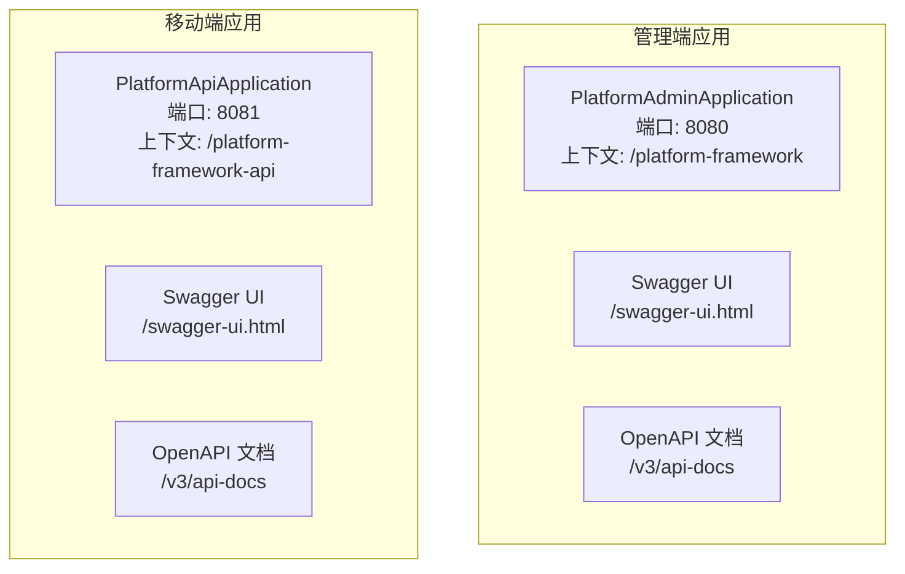
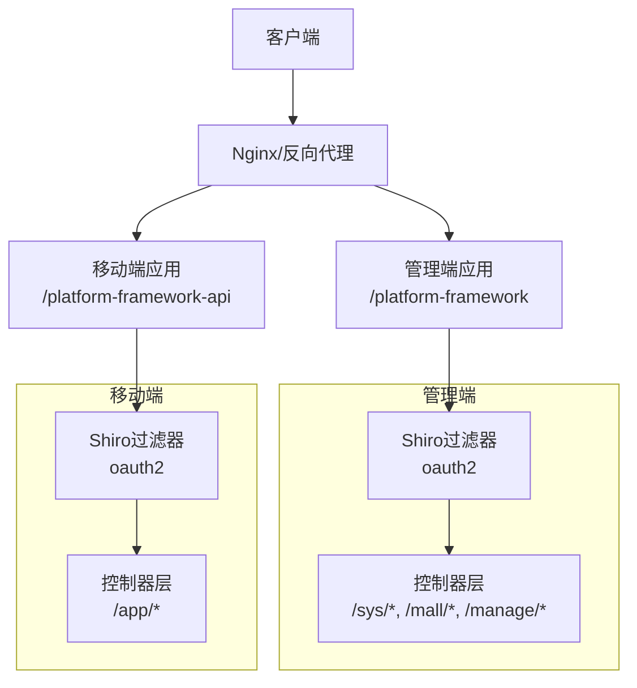
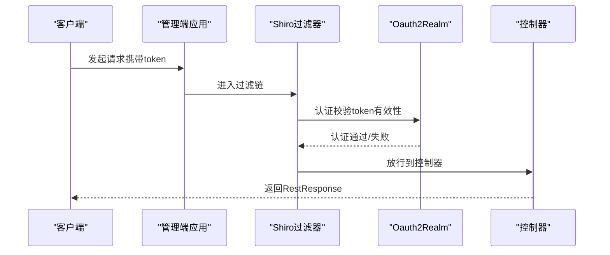
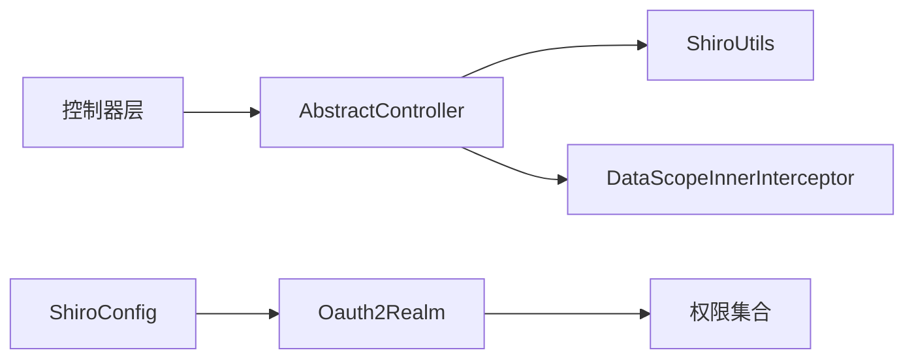

# 管理后台API

<cite>
**本文引用的文件**
- [PlatformAdminApplication.java](file://platform-admin/src/main/java/com/platform/PlatformAdminApplication.java)
- [application.yml（管理端）](file://platform-admin/src/main/resources/application.yml)
- [AbstractController.java](file://platform-admin/src/main/java/com/platform/modules/sys/controller/AbstractController.java)
- [SysUserController.java](file://platform-admin/src/main/java/com/platform/modules/sys/controller/SysUserController.java)
- [SysRoleController.java](file://platform-admin/src/main/java/com/platform/modules/sys/controller/SysRoleController.java)
- [SysMenuController.java](file://platform-admin/src/main/java/com/platform/modules/sys/controller/SysMenuController.java)
- [SysConfigController.java](file://platform-admin/src/main/java/com/platform/modules/sys/controller/SysConfigController.java)
- [MallGoodsController.java](file://platform-admin/src/main/java/com/platform/modules/mall/controller/MallGoodsController.java)
- [WxUserManageController.java](file://platform-admin/src/main/java/com/platform/modules/wx/controller/WxUserManageController.java)
- [WxMenuManageController.java](file://platform-admin/src/main/java/com/platform/modules/wx/controller/WxMenuManageController.java)
- [ShiroConfig.java](file://platform-admin/src/main/java/com/platform/config/ShiroConfig.java)
- [Oauth2Realm.java](file://platform-admin/src/main/java/com/platform/modules/sys/oauth2/Oauth2Realm.java)
- [DataScopeInnerInterceptor.java](file://platform-admin/src/main/java/com/platform/datascope/DataScopeInnerInterceptor.java)
- [RestResponse.java](file://platform-common/src/main/java/com/platform/common/utils/RestResponse.java)
- [PlatformApiApplication.java](file://platform-api/src/main/java/com/platform/PlatformApiApplication.java)
- [application.yml（移动端）](file://platform-api/src/main/resources/application.yml)
</cite>

## 目录
1. [简介](#简介)
2. [项目结构](#项目结构)
3. [核心组件](#核心组件)
4. [架构总览](#架构总览)
5. [详细组件分析](#详细组件分析)
6. [依赖分析](#依赖分析)
7. [性能考虑](#性能考虑)
8. [故障排除指南](#故障排除指南)
9. [结论](#结论)
10. [附录](#附录)

## 简介
本文件为平台管理后台API接口文档，覆盖系统管理、商品管理、用户管理、微信管理等模块的RESTful接口规范。文档面向管理员与系统集成开发者，提供接口的HTTP方法、URL路径、请求参数、响应格式、状态码与错误处理说明；同时阐述权限控制机制、认证方式与安全策略，并给出接口调用示例、参数验证规则、业务逻辑说明、测试方法、常见问题与性能优化建议。

## 项目结构
后端由两个独立Spring Boot应用组成：
- 平台管理端（管理后台）：提供系统管理、商品管理、微信管理等后台功能，基于SpringDoc OpenAPI生成接口文档，支持Knife4j增强。
- 移动端接口（APP/小程序）：提供移动端相关接口，同样基于SpringDoc OpenAPI生成接口文档。

两套应用分别运行在不同端口与上下文路径下，互不干扰。

图表来源
- [PlatformAdminApplication.java:1-93](file://platform-admin/src/main/java/com/platform/PlatformAdminApplication.java#L1-L93)
- [application.yml（管理端）:1-205](file://platform-admin/src/main/resources/application.yml#L1-L205)
- [PlatformApiApplication.java:1-92](file://platform-api/src/main/java/com/platform/PlatformApiApplication.java#L1-L92)
- [application.yml（移动端）:1-195](file://platform-api/src/main/resources/application.yml#L1-L195)

章节来源
- [PlatformAdminApplication.java:1-93](file://platform-admin/src/main/java/com/platform/PlatformAdminApplication.java#L1-L93)
- [application.yml（管理端）:1-205](file://platform-admin/src/main/resources/application.yml#L1-L205)
- [PlatformApiApplication.java:1-92](file://platform-api/src/main/java/com/platform/PlatformApiApplication.java#L1-L92)
- [application.yml（移动端）:1-195](file://platform-api/src/main/resources/application.yml#L1-L195)

## 核心组件
- 统一响应封装：所有接口统一返回RestResponse结构，包含success、code、msg、data、timestamp等字段，便于前端统一处理。
- 控制器基类：AbstractController提供获取当前登录用户、用户ID、机构ID、数据权限构造等通用能力。
- 权限与认证：基于Apache Shiro，使用OAuth2令牌进行认证，支持权限注解（如@RequiresPermissions）与拦截链配置。
- 数据权限：通过DataScopeInnerInterceptor在SQL层面注入数据范围条件，确保用户仅能看到授权范围内的数据。
- 接口文档：SpringDoc OpenAPI + Knife4j，按模块分组展示，管理端与移动端分别配置。

章节来源
- [RestResponse.java:1-122](file://platform-common/src/main/java/com/platform/common/utils/RestResponse.java#L1-L122)
- [AbstractController.java:1-92](file://platform-admin/src/main/java/com/platform/modules/sys/controller/AbstractController.java#L1-L92)
- [ShiroConfig.java:1-99](file://platform-admin/src/main/java/com/platform/config/ShiroConfig.java#L1-L99)
- [Oauth2Realm.java:1-88](file://platform-admin/src/main/java/com/platform/modules/sys/oauth2/Oauth2Realm.java#L1-L88)
- [DataScopeInnerInterceptor.java:1-48](file://platform-admin/src/main/java/com/platform/datascope/DataScopeInnerInterceptor.java#L1-L48)

## 架构总览
管理端与移动端通过独立的应用入口启动，分别暴露不同的上下文路径与端口。管理端通过Shiro拦截器对除白名单外的所有请求进行OAuth2认证与权限校验；移动端应用同样通过Shiro过滤器链保护接口。

图表来源
- [ShiroConfig.java:63-86](file://platform-admin/src/main/java/com/platform/config/ShiroConfig.java#L63-L86)
- [application.yml（管理端）:22-67](file://platform-admin/src/main/resources/application.yml#L22-L67)
- [application.yml（移动端）:22-56](file://platform-api/src/main/resources/application.yml#L22-L56)

## 详细组件分析

### 系统管理模块（系统用户、角色、菜单、配置）

- 系统用户
  - GET /sys/user/queryAll：查询所有用户（带权限校验）
  - GET /sys/user/list：分页查询用户（带权限校验）
  - GET /sys/user/info：获取当前登录用户信息
  - POST /sys/user/password：修改当前用户密码（含旧密码校验）
  - GET /sys/user/info/{userId}：按ID查询用户详情（带权限校验）
  - POST /sys/user/save：新增用户（带权限校验）
  - POST /sys/user/update：修改用户（带权限校验）
  - POST /sys/user/delete：批量删除用户（带权限校验）
  - POST /sys/user/resetPw：批量重置密码（带权限校验）

- 角色管理
  - GET /sys/role/list：分页查询角色（带权限校验）
  - GET /sys/role/select：角色列表（带权限校验）
  - GET /sys/role/info/{roleId}：按ID查询角色详情（带权限校验）
  - POST /sys/role/save：新增角色（带权限校验）
  - POST /sys/role/update：修改角色（带权限校验）
  - POST /sys/role/delete：批量删除角色（带权限校验）

- 系统菜单
  - GET /sys/menu/nav：获取导航菜单、权限集合、字典、组织、用户列表
  - GET /sys/menu/list：所有菜单列表（带权限校验）
  - GET /sys/menu/select：选择菜单（带权限校验）
  - GET /sys/menu/info/{menuId}：按ID查询菜单详情（带权限校验）
  - POST /sys/menu/save：新增菜单（带权限校验）
  - POST /sys/menu/update：修改菜单（带权限校验）
  - POST /sys/menu/delete/{menuId}：删除菜单（带权限校验）

- 系统配置
  - GET /sys/config/list：分页查询配置（带权限校验）
  - GET /sys/config/queryKeyValues：查询状态为启用的键值对（带权限校验）
  - GET /sys/config/info/{id}：按ID查询配置（带权限校验）
  - POST /sys/config/save：新增配置（带权限校验）
  - POST /sys/config/update：修改配置（带权限校验）
  - POST /sys/config/delete：批量删除配置（带权限校验）
  - GET /sys/config/getConfigValue：按key查询value（带权限校验）
  - POST /sys/config/saveConfigValue：按key更新value（带权限校验）

- 响应格式
  - 统一使用RestResponse封装，包含success、code、msg、data、timestamp字段。成功时code为0，失败时为服务器内部错误码。

- 权限控制
  - 使用@RequiresPermissions标注具体权限点，如sys:user:list、sys:role:save等。
  - Shiro过滤器链对除白名单外的请求进行oauth2认证。

- 参数验证
  - 控制器内使用ValidatorUtils进行实体校验，新增与修改场景分别对应AddGroup与UpdateGroup。

- 业务逻辑
  - 用户密码修改需提供旧密码并进行SHA-256加盐校验。
  - 删除用户/角色前进行特殊账户与自身账户保护。
  - 菜单新增/修改时进行父子类型与URL完整性校验。

章节来源
- [SysUserController.java:1-243](file://platform-admin/src/main/java/com/platform/modules/sys/controller/SysUserController.java#L1-L243)
- [SysRoleController.java:1-169](file://platform-admin/src/main/java/com/platform/modules/sys/controller/SysRoleController.java#L1-L169)
- [SysMenuController.java:1-252](file://platform-admin/src/main/java/com/platform/modules/sys/controller/SysMenuController.java#L1-L252)
- [SysConfigController.java:1-177](file://platform-admin/src/main/java/com/platform/modules/sys/controller/SysConfigController.java#L1-L177)
- [AbstractController.java:1-92](file://platform-admin/src/main/java/com/platform/modules/sys/controller/AbstractController.java#L1-L92)
- [RestResponse.java:1-122](file://platform-common/src/main/java/com/platform/common/utils/RestResponse.java#L1-L122)
- [ShiroConfig.java:63-86](file://platform-admin/src/main/java/com/platform/config/ShiroConfig.java#L63-L86)

### 商品管理模块（商城商品）

- 商品管理
  - GET /mall/goods/queryAll：查询所有商品（带权限校验）
  - GET /mall/goods/list：分页查询商品（带权限校验）
  - GET /mall/goods/info/{id}：按ID查询商品详情（带权限校验）
  - GET /mall/goods/aggregate/{id}：商品聚合详情（带权限校验）
  - POST /mall/goods/save：新增商品（带权限校验）
  - POST /mall/goods/aggregate/save：新增商品聚合（带权限校验）
  - POST /mall/goods/update：修改商品（带权限校验）
  - POST /mall/goods/aggregate/update：修改商品聚合（带权限校验）
  - POST /mall/goods/delete：批量删除商品（带权限校验）

- 响应格式
  - 统一使用RestResponse封装，data为商品实体或分页结果。

- 权限控制
  - 使用mall:goods:*系列权限点进行校验。

章节来源
- [MallGoodsController.java:1-184](file://platform-admin/src/main/java/com/platform/modules/mall/controller/MallGoodsController.java#L1-L184)
- [RestResponse.java:1-122](file://platform-common/src/main/java/com/platform/common/utils/RestResponse.java#L1-L122)

### 微信管理模块（公众号粉丝、菜单）

- 公众号粉丝
  - GET /manage/wxUser/list：分页查询粉丝（带权限校验）
  - POST /manage/wxUser/listByIds：按openids批量查询粉丝（带权限校验）
  - GET /manage/wxUser/info/{openid}：按openid查询粉丝详情（带权限校验）

- 微信公众号菜单
  - GET /manage/wxMenu/getMenu：获取公众号菜单
  - POST /manage/wxMenu/updateMenu：发布公众号菜单（带权限校验）
  - GET /manage/wxMenu/netCheck：网络检测（域名解析与Ping）

- 响应格式
  - 统一使用RestResponse封装。

- 权限控制
  - 粉丝管理使用wx:wxuser:*系列权限点；菜单管理使用wx:menu:save。

章节来源
- [WxUserManageController.java:1-82](file://platform-admin/src/main/java/com/platform/modules/wx/controller/WxUserManageController.java#L1-L82)
- [WxMenuManageController.java:1-91](file://platform-admin/src/main/java/com/platform/modules/wx/controller/WxMenuManageController.java#L1-L91)
- [RestResponse.java:1-122](file://platform-common/src/main/java/com/platform/common/utils/RestResponse.java#L1-L122)

### 认证与权限流程（序列图）

图表来源
- [ShiroConfig.java:63-86](file://platform-admin/src/main/java/com/platform/config/ShiroConfig.java#L63-L86)
- [Oauth2Realm.java:68-87](file://platform-admin/src/main/java/com/platform/modules/sys/oauth2/Oauth2Realm.java#L68-L87)

## 依赖分析
- 控制器依赖统一的抽象基类，间接依赖Shiro工具与数据权限服务。
- Shiro配置定义了过滤链，将/oauth2过滤器应用于除白名单外的所有路径。
- OAuth2Realm负责认证与授权，从ShiroService加载用户权限集合。
- DataScopeInnerInterceptor在MyBatis层注入数据范围，保障数据隔离。

图表来源
- [AbstractController.java:35-91](file://platform-admin/src/main/java/com/platform/modules/sys/controller/AbstractController.java#L35-L91)
- [ShiroConfig.java:63-86](file://platform-admin/src/main/java/com/platform/config/ShiroConfig.java#L63-L86)
- [Oauth2Realm.java:52-87](file://platform-admin/src/main/java/com/platform/modules/sys/oauth2/Oauth2Realm.java#L52-L87)
- [DataScopeInnerInterceptor.java:40-48](file://platform-admin/src/main/java/com/platform/datascope/DataScopeInnerInterceptor.java#L40-L48)

章节来源
- [AbstractController.java:1-92](file://platform-admin/src/main/java/com/platform/modules/sys/controller/AbstractController.java#L1-L92)
- [ShiroConfig.java:1-99](file://platform-admin/src/main/java/com/platform/config/ShiroConfig.java#L1-L99)
- [Oauth2Realm.java:1-88](file://platform-admin/src/main/java/com/platform/modules/sys/oauth2/Oauth2Realm.java#L1-L88)
- [DataScopeInnerInterceptor.java:1-48](file://platform-admin/src/main/java/com/platform/datascope/DataScopeInnerInterceptor.java#L1-L48)

## 性能考虑
- 线程模型：管理端与移动端均采用Undertow，IO线程与工作线程数量可按并发需求调整，避免“打开文件数过多”等问题。
- 文件上传：multipart大小限制为100MB，适用于图片/资源上传场景。
- 缓存与序列化：MyBatis-Plus关闭全局缓存，避免复杂场景下的缓存一致性问题；JSON序列化采用驼峰映射与自定义序列化器。
- 数据权限：在SQL层注入数据范围，减少不必要的数据传输与前端筛选成本。
- 接口文档：SpringDoc与Knife4j提升联调效率，减少接口沟通成本。

章节来源
- [application.yml（管理端）:3-18](file://platform-admin/src/main/resources/application.yml#L3-L18)
- [application.yml（移动端）:3-18](file://platform-api/src/main/resources/application.yml#L3-L18)
- [application.yml（管理端）:76-79](file://platform-admin/src/main/resources/application.yml#L76-L79)
- [application.yml（移动端）:65-69](file://platform-api/src/main/resources/application.yml#L65-L69)
- [application.yml（管理端）:113-142](file://platform-admin/src/main/resources/application.yml#L113-L142)
- [application.yml（移动端）:96-122](file://platform-api/src/main/resources/application.yml#L96-L122)

## 故障排除指南
- 认证失败
  - 现象：返回“token失效，请重新登录”或401未授权。
  - 排查：确认请求头携带正确的token，检查token是否过期；确认Shiro过滤链未误拦截。
  - 参考
    - [Oauth2Realm.java:74-77](file://platform-admin/src/main/java/com/platform/modules/sys/oauth2/Oauth2Realm.java#L74-L77)
    - [ShiroConfig.java:63-86](file://platform-admin/src/main/java/com/platform/config/ShiroConfig.java#L63-L86)

- 权限不足
  - 现象：返回“操作失败”，提示无权限。
  - 排查：确认当前用户是否具备sys:*或mall:*等目标权限点；检查角色与权限绑定。
  - 参考
    - [SysUserController.java:67](file://platform-admin/src/main/java/com/platform/modules/sys/controller/SysUserController.java#L67)
    - [SysRoleController.java:62](file://platform-admin/src/main/java/com/platform/modules/sys/controller/SysRoleController.java#L62)

- 账号锁定
  - 现象：返回“账号已被锁定,请联系管理员”。
  - 排查：检查用户状态字段，解锁后再试。
  - 参考
    - [Oauth2Realm.java:82-84](file://platform-admin/src/main/java/com/platform/modules/sys/oauth2/Oauth2Realm.java#L82-L84)

- 数据权限导致查询为空
  - 现象：查询结果为空或范围受限。
  - 排查：确认当前用户的数据范围配置（机构号），检查DataScope构造逻辑。
  - 参考
    - [AbstractController.java:73-90](file://platform-admin/src/main/java/com/platform/modules/sys/controller/AbstractController.java#L73-L90)
    - [DataScopeInnerInterceptor.java:40-48](file://platform-admin/src/main/java/com/platform/datascope/DataScopeInnerInterceptor.java#L40-L48)

- 菜单删除失败
  - 现象：提示“请先删除子菜单或按钮”。
  - 排查：先删除子级菜单或按钮后再执行删除。
  - 参考
    - [SysMenuController.java:196-204](file://platform-admin/src/main/java/com/platform/modules/sys/controller/SysMenuController.java#L196-L204)

章节来源
- [Oauth2Realm.java:68-87](file://platform-admin/src/main/java/com/platform/modules/sys/oauth2/Oauth2Realm.java#L68-L87)
- [ShiroConfig.java:63-86](file://platform-admin/src/main/java/com/platform/config/ShiroConfig.java#L63-L86)
- [SysUserController.java:67](file://platform-admin/src/main/java/com/platform/modules/sys/controller/SysUserController.java#L67)
- [SysRoleController.java:62](file://platform-admin/src/main/java/com/platform/modules/sys/controller/SysRoleController.java#L62)
- [AbstractController.java:73-90](file://platform-admin/src/main/java/com/platform/modules/sys/controller/AbstractController.java#L73-L90)
- [DataScopeInnerInterceptor.java:40-48](file://platform-admin/src/main/java/com/platform/datascope/DataScopeInnerInterceptor.java#L40-L48)
- [SysMenuController.java:196-204](file://platform-admin/src/main/java/com/platform/modules/sys/controller/SysMenuController.java#L196-L204)

## 结论
本项目通过清晰的模块划分、统一的响应封装、完善的权限与认证体系以及可扩展的数据权限机制，为管理后台提供了稳定可靠的RESTful接口能力。配合SpringDoc与Knife4j，开发者可快速定位接口、完成联调与测试。建议在生产环境中结合Nginx进行反向代理与限流，并持续关注Shiro与MyBatis-Plus的版本升级以获得更好的安全性与性能。

## 附录

### 接口调用示例（通用）
- 获取管理端接口文档
  - 请求：GET http://localhost:8080/platform-framework/swagger-ui.html
  - 说明：管理端接口文档页面
- 获取移动端接口文档
  - 请求：GET http://localhost:8081/platform-framework-api/swagger-ui.html
  - 说明：移动端接口文档页面
- 登录获取token
  - 请求：POST /sys/login（示例，实际路径以接口文档为准）
  - 说明：登录成功后返回token，后续请求在请求头携带token
- 查询用户列表
  - 请求：GET /sys/user/list?page=1&limit=10
  - 请求头：Authorization: Bearer <token>
  - 响应：RestResponse封装的分页结果
- 新增商品
  - 请求：POST /mall/goods/save
  - 请求头：Authorization: Bearer <token>
  - 请求体：商品JSON对象
  - 响应：RestResponse成功/失败

章节来源
- [application.yml（管理端）:22-67](file://platform-admin/src/main/resources/application.yml#L22-L67)
- [application.yml（移动端）:22-56](file://platform-api/src/main/resources/application.yml#L22-L56)
- [RestResponse.java:86-121](file://platform-common/src/main/java/com/platform/common/utils/RestResponse.java#L86-L121)