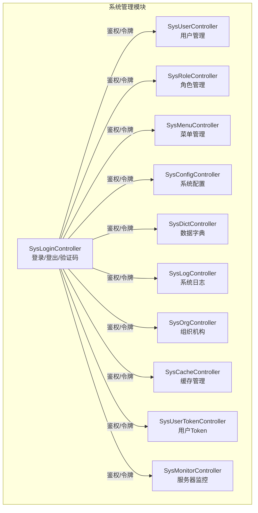
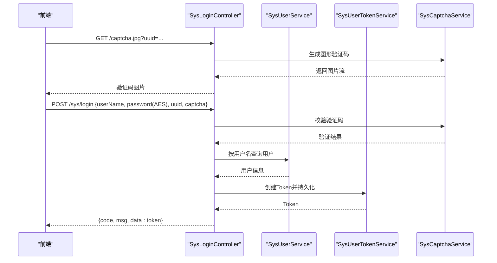
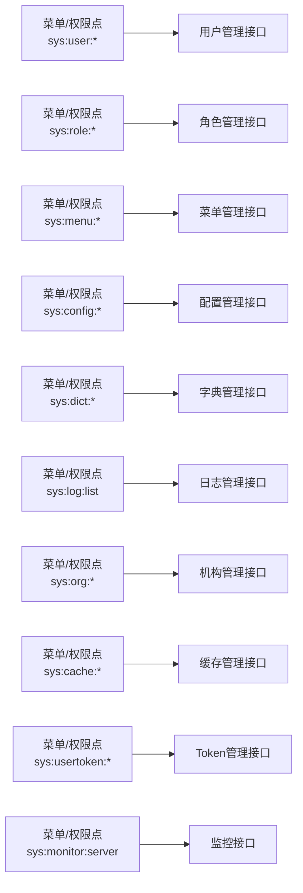

# 系统管理API

<cite>
**本文引用的文件**
- [SysUserController.java](file://platform-admin/src/main/java/com/platform/modules/sys/controller/SysUserController.java)
- [SysRoleController.java](file://platform-admin/src/main/java/com/platform/modules/sys/controller/SysRoleController.java)
- [SysMenuController.java](file://platform-admin/src/main/java/com/platform/modules/sys/controller/SysMenuController.java)
- [SysConfigController.java](file://platform-admin/src/main/java/com/platform/modules/sys/controller/SysConfigController.java)
- [SysDictController.java](file://platform-admin/src/main/java/com/platform/modules/sys/controller/SysDictController.java)
- [SysLogController.java](file://platform-admin/src/main/java/com/platform/modules/sys/controller/SysLogController.java)
- [SysOrgController.java](file://platform-admin/src/main/java/com/platform/modules/sys/controller/SysOrgController.java)
- [SysCacheController.java](file://platform-admin/src/main/java/com/platform/modules/sys/controller/SysCacheController.java)
- [SysLoginController.java](file://platform-admin/src/main/java/com/platform/modules/sys/controller/SysLoginController.java)
- [SysUserTokenController.java](file://platform-admin/src/main/java/com/platform/modules/sys/controller/SysUserTokenController.java)
- [SysMonitorController.java](file://platform-admin/src/main/java/com/platform/modules/sys/controller/SysMonitorController.java)
- [base.sql](file://_sql/base.sql)
</cite>

## 目录
1. [简介](#简介)
2. [项目结构](#项目结构)
3. [核心组件](#核心组件)
4. [架构总览](#架构总览)
5. [详细组件分析](#详细组件分析)
6. [依赖分析](#依赖分析)
7. [性能考虑](#性能考虑)
8. [故障排查指南](#故障排查指南)
9. [结论](#结论)
10. [附录](#附录)

## 简介
本文件为平台管理系统“系统管理”模块的API接口文档，覆盖系统配置管理、数据字典管理、日志管理、菜单管理、组织机构管理、角色管理和用户管理等核心功能。文档对每个接口的HTTP方法、URL路径、请求参数、响应格式、状态码与错误处理进行说明；阐述权限控制机制、认证方式与安全策略；并提供接口调用示例、参数验证规则、业务逻辑说明、测试方法、常见问题与性能优化建议。

## 项目结构
系统管理API位于后端模块 platform-admin 的 sys 包内，采用按功能域划分的控制器层设计，统一通过 RestController 提供REST风格接口，权限控制基于 Apache Shiro 注解实现，返回体统一使用 RestResponse 包装。

图表来源
- [SysLoginController.java:1-139](file://platform-admin/src/main/java/com/platform/modules/sys/controller/SysLoginController.java#L1-L139)
- [SysUserController.java:1-243](file://platform-admin/src/main/java/com/platform/modules/sys/controller/SysUserController.java#L1-L243)
- [SysRoleController.java:1-169](file://platform-admin/src/main/java/com/platform/modules/sys/controller/SysRoleController.java#L1-L169)
- [SysMenuController.java:1-252](file://platform-admin/src/main/java/com/platform/modules/sys/controller/SysMenuController.java#L1-L252)
- [SysConfigController.java:1-177](file://platform-admin/src/main/java/com/platform/modules/sys/controller/SysConfigController.java#L1-L177)
- [SysDictController.java:1-176](file://platform-admin/src/main/java/com/platform/modules/sys/controller/SysDictController.java#L1-L176)
- [SysLogController.java:1-64](file://platform-admin/src/main/java/com/platform/modules/sys/controller/SysLogController.java#L1-L64)
- [SysOrgController.java:1-139](file://platform-admin/src/main/java/com/platform/modules/sys/controller/SysOrgController.java#L1-L139)
- [SysCacheController.java:1-92](file://platform-admin/src/main/java/com/platform/modules/sys/controller/SysCacheController.java#L1-L92)
- [SysUserTokenController.java:1-77](file://platform-admin/src/main/java/com/platform/modules/sys/controller/SysUserTokenController.java#L1-L77)
- [SysMonitorController.java:1-83](file://platform-admin/src/main/java/com/platform/modules/sys/controller/SysMonitorController.java#L1-L83)

章节来源
- [SysLoginController.java:1-139](file://platform-admin/src/main/java/com/platform/modules/sys/controller/SysLoginController.java#L1-L139)
- [SysUserController.java:1-243](file://platform-admin/src/main/java/com/platform/modules/sys/controller/SysUserController.java#L1-L243)
- [SysRoleController.java:1-169](file://platform-admin/src/main/java/com/platform/modules/sys/controller/SysRoleController.java#L1-L169)
- [SysMenuController.java:1-252](file://platform-admin/src/main/java/com/platform/modules/sys/controller/SysMenuController.java#L1-L252)
- [SysConfigController.java:1-177](file://platform-admin/src/main/java/com/platform/modules/sys/controller/SysConfigController.java#L1-L177)
- [SysDictController.java:1-176](file://platform-admin/src/main/java/com/platform/modules/sys/controller/SysDictController.java#L1-L176)
- [SysLogController.java:1-64](file://platform-admin/src/main/java/com/platform/modules/sys/controller/SysLogController.java#L1-L64)
- [SysOrgController.java:1-139](file://platform-admin/src/main/java/com/platform/modules/sys/controller/SysOrgController.java#L1-L139)
- [SysCacheController.java:1-92](file://platform-admin/src/main/java/com/platform/modules/sys/controller/SysCacheController.java#L1-L92)
- [SysUserTokenController.java:1-77](file://platform-admin/src/main/java/com/platform/modules/sys/controller/SysUserTokenController.java#L1-L77)
- [SysMonitorController.java:1-83](file://platform-admin/src/main/java/com/platform/modules/sys/controller/SysMonitorController.java#L1-L83)

## 核心组件
- 认证与会话：登录/登出、验证码、AES解密、SHA256加盐密码校验、Token生成与存储。
- 权限控制：基于注解的权限点（如 sys:user:list、sys:role:save 等）。
- 统一响应：RestResponse 包装成功/失败、消息与数据。
- 数据访问：MyBatis-Plus 分页查询与条件构造器。
- 安全校验：参数校验、XSS/SQL注入过滤、IP/请求头工具。

章节来源
- [SysLoginController.java:85-136](file://platform-admin/src/main/java/com/platform/modules/sys/controller/SysLoginController.java#L85-L136)
- [SysUserController.java:155-217](file://platform-admin/src/main/java/com/platform/modules/sys/controller/SysUserController.java#L155-L217)
- [SysRoleController.java:121-167](file://platform-admin/src/main/java/com/platform/modules/sys/controller/SysRoleController.java#L121-L167)
- [SysMenuController.java:150-205](file://platform-admin/src/main/java/com/platform/modules/sys/controller/SysMenuController.java#L150-L205)
- [SysConfigController.java:101-145](file://platform-admin/src/main/java/com/platform/modules/sys/controller/SysConfigController.java#L101-L145)
- [SysDictController.java:108-149](file://platform-admin/src/main/java/com/platform/modules/sys/controller/SysDictController.java#L108-L149)
- [SysLogController.java:55-62](file://platform-admin/src/main/java/com/platform/modules/sys/controller/SysLogController.java#L55-L62)
- [SysOrgController.java:124-137](file://platform-admin/src/main/java/com/platform/modules/sys/controller/SysOrgController.java#L124-L137)
- [SysCacheController.java:53-90](file://platform-admin/src/main/java/com/platform/modules/sys/controller/SysCacheController.java#L53-L90)
- [SysUserTokenController.java:53-75](file://platform-admin/src/main/java/com/platform/modules/sys/controller/SysUserTokenController.java#L53-L75)
- [SysMonitorController.java:55-83](file://platform-admin/src/main/java/com/platform/modules/sys/controller/SysMonitorController.java#L55-L83)

## 架构总览
系统管理API采用前后端分离架构，前端通过HTTP请求调用后端接口，后端以Spring MVC + Shiro完成鉴权与授权，服务层负责业务编排，DAO层执行数据库操作。

图表来源
- [SysLoginController.java:65-123](file://platform-admin/src/main/java/com/platform/modules/sys/controller/SysLoginController.java#L65-L123)
- [SysUserController.java:98-102](file://platform-admin/src/main/java/com/platform/modules/sys/controller/SysUserController.java#L98-L102)
- [SysUserTokenController.java:131-136](file://platform-admin/src/main/java/com/platform/modules/sys/controller/SysUserTokenController.java#L131-L136)

## 详细组件分析

### 登录与会话
- 接口定义
  - GET /captcha.jpg
    - 功能：获取图形验证码
    - 请求参数：uuid
    - 响应：图片流
  - POST /sys/login
    - 功能：账号密码登录
    - 请求体：SysLoginForm（用户名、AES加密密码、uuid、验证码）
    - 响应：token
  - POST /sys/logout
    - 功能：退出登录
    - 请求体：无
    - 响应：空

- 权限与安全
  - 验证码校验通过后才允许登录
  - 密码使用AES解密后再做SHA256+salt校验
  - 成功后生成并持久化Token

- 错误处理
  - 验证码错误、账号不存在、账号锁定、密码错误、解密失败等均返回明确错误信息

章节来源
- [SysLoginController.java:65-136](file://platform-admin/src/main/java/com/platform/modules/sys/controller/SysLoginController.java#L65-L136)

### 用户管理
- 接口定义
  - GET /sys/user/queryAll
    - 功能：查询所有用户（带数据权限）
    - 权限：sys:dict:list
    - 响应：用户列表
  - GET /sys/user/list
    - 功能：分页查询用户（带数据权限）
    - 权限：sys:user:list
    - 响应：分页结果
  - GET /sys/user/info
    - 功能：获取当前登录用户信息
    - 响应：用户对象
  - GET /sys/user/info/{userId}
    - 功能：按ID查询用户详情（含角色列表）
    - 权限：sys:user:info
    - 响应：用户对象
  - POST /sys/user/save
    - 功能：新增用户
    - 权限：sys:user:save
    - 请求体：SysUserEntity（校验组 AddGroup）
    - 响应：操作结果
  - POST /sys/user/update
    - 功能：修改用户
    - 权限：sys:user:update
    - 请求体：SysUserEntity（校验组 UpdateGroup）
    - 响应：操作结果
  - POST /sys/user/delete
    - 功能：批量删除用户（禁止删除超级管理员与当前用户）
    - 权限：sys:user:delete
    - 请求体：userId数组
    - 响应：操作结果
  - POST /sys/user/resetPw
    - 功能：批量重置密码（禁止重置超级管理员与当前用户）
    - 权限：sys:user:resetPw
    - 请求体：userId数组
    - 响应：操作结果
  - POST /sys/user/password
    - 功能：修改当前用户密码
    - 请求体：PasswordForm（原密码、新密码）
    - 响应：操作结果

- 参数验证与业务逻辑
  - 新增/修改时使用分组校验
  - 删除/重置前进行内置白名单与自删保护
  - 密码修改使用当前用户盐值进行SHA256二次哈希

- 错误处理
  - 参数为空、原密码不正确、禁止删除/重置等场景返回明确提示

章节来源
- [SysUserController.java:65-241](file://platform-admin/src/main/java/com/platform/modules/sys/controller/SysUserController.java#L65-L241)

### 角色管理
- 接口定义
  - GET /sys/role/list
    - 功能：分页查询角色（带数据权限）
    - 权限：sys:role:list
    - 响应：分页结果
  - GET /sys/role/select
    - 功能：获取角色列表（带数据权限）
    - 权限：sys:role:select
    - 响应：角色列表
  - GET /sys/role/info/{roleId}
    - 功能：按ID查询角色详情（含菜单与机构列表）
    - 权限：sys:role:info
    - 响应：角色对象
  - POST /sys/role/save
    - 功能：新增角色
    - 权限：sys:role:save
    - 请求体：SysRoleEntity
    - 响应：操作结果
  - POST /sys/role/update
    - 功能：修改角色
    - 权限：sys:role:update
    - 请求体：SysRoleEntity
    - 响应：操作结果
  - POST /sys/role/delete
    - 功能：批量删除角色
    - 权限：sys:role:delete
    - 请求体：roleId数组
    - 响应：操作结果

- 参数验证与业务逻辑
  - 新增/修改时实体校验
  - 查询详情时关联加载菜单ID与机构ID列表

- 错误处理
  - 通用参数校验异常与业务异常均有明确返回

章节来源
- [SysRoleController.java:61-167](file://platform-admin/src/main/java/com/platform/modules/sys/controller/SysRoleController.java#L61-L167)

### 菜单管理
- 接口定义
  - GET /sys/menu/nav
    - 功能：获取当前用户的导航菜单、权限集合及基础数据
    - 响应：菜单树、权限集合、数据字典、组织、用户列表
  - GET /sys/menu/list
    - 功能：获取所有菜单列表
    - 权限：sys:menu:list
    - 响应：菜单列表
  - GET /sys/menu/select
    - 功能：选择菜单（用于新增/编辑菜单）
    - 权限：sys:menu:select
    - 响应：菜单树（含顶级节点）
  - GET /sys/menu/info/{menuId}
    - 功能：按ID查询菜单详情（含父级名称）
    - 权限：sys:menu:info
    - 响应：菜单对象
  - POST /sys/menu/save
    - 功能：新增菜单
    - 权限：sys:menu:save
    - 请求体：SysMenuEntity（校验组 AddGroup）
    - 响应：操作结果
  - POST /sys/menu/update
    - 功能：修改菜单
    - 权限：sys:menu:update
    - 请求体：SysMenuEntity（校验组 UpdateGroup）
    - 响应：操作结果
  - POST /sys/menu/delete/{menuId}
    - 功能：删除菜单（需无子菜单/按钮）
    - 权限：sys:menu:delete
    - 响应：操作结果

- 参数验证与业务逻辑
  - 新增/修改时进行字段完整性与父子类型约束校验
  - 目录/菜单的父级必须为目录；按钮的父级必须为菜单

- 错误处理
  - 存在子项时禁止删除；非法父子类型时抛出业务异常

章节来源
- [SysMenuController.java:67-250](file://platform-admin/src/main/java/com/platform/modules/sys/controller/SysMenuController.java#L67-L250)

### 系统配置管理
- 接口定义
  - GET /sys/config/list
    - 功能：分页查询系统配置
    - 权限：sys:config:list
    - 响应：分页结果
  - GET /sys/config/queryKeyValues
    - 功能：查询状态为0的键值对
    - 权限：sys:config:list
    - 响应：键值对列表
  - GET /sys/config/info/{id}
    - 功能：按ID查询配置详情
    - 权限：sys:config:info
    - 响应：配置对象
  - POST /sys/config/save
    - 功能：新增配置
    - 权限：sys:config:save
    - 请求体：SysConfigEntity
    - 响应：操作结果
  - POST /sys/config/update
    - 功能：修改配置
    - 权限：sys:config:update
    - 请求体：SysConfigEntity
    - 响应：操作结果
  - POST /sys/config/delete
    - 功能：批量删除配置
    - 权限：sys:config:delete
    - 请求体：id数组
    - 响应：操作结果
  - GET /sys/config/getConfigValue
    - 功能：按key查询value
    - 权限：sys:config:getConfigValue
    - 响应：value
  - POST /sys/config/saveConfigValue
    - 功能：按key更新value
    - 权限：sys:config:saveConfigValue
    - 请求体：SysConfigEntity
    - 响应：操作结果

- 参数验证与业务逻辑
  - 新增/修改时实体校验
  - 支持按key读取/更新配置值

- 错误处理
  - 通用参数校验异常与业务异常均有明确返回

章节来源
- [SysConfigController.java:57-175](file://platform-admin/src/main/java/com/platform/modules/sys/controller/SysConfigController.java#L57-L175)

### 数据字典管理
- 接口定义
  - GET /sys/dict/queryAll
    - 功能：查询所有字典项（带参数过滤）
    - 权限：sys:dict:list
    - 响应：字典列表
  - GET /sys/dict/list
    - 功能：分页查询字典项
    - 权限：sys:dict:list
    - 响应：分页结果
  - GET /sys/dict/info/{id}
    - 功能：按ID查询字典详情
    - 权限：sys:dict:info
    - 响应：字典对象
  - POST /sys/dict/save
    - 功能：新增字典项
    - 权限：sys:dict:save
    - 请求体：SysDictEntity（校验组 AddGroup）
    - 响应：操作结果
  - POST /sys/dict/update
    - 功能：修改字典项
    - 权限：sys:dict:update
    - 请求体：SysDictEntity（校验组 UpdateGroup）
    - 响应：操作结果
  - POST /sys/dict/delete
    - 功能：批量删除字典项
    - 权限：sys:dict:delete
    - 请求体：id数组
    - 响应：操作结果
  - GET /sys/dict/queryByCode
    - 功能：按code查询字典项与分组名称
    - 响应：字典列表与分组名称

- 参数验证与业务逻辑
  - 新增/修改时实体校验
  - 支持按分组code联动查询

- 错误处理
  - 通用参数校验异常与业务异常均有明确返回

章节来源
- [SysDictController.java:65-174](file://platform-admin/src/main/java/com/platform/modules/sys/controller/SysDictController.java#L65-L174)

### 日志管理
- 接口定义
  - GET /sys/log/list
    - 功能：分页查询系统日志
    - 权限：sys:log:list
    - 响应：分页结果

- 参数验证与业务逻辑
  - 使用分页查询日志记录

- 错误处理
  - 无特殊异常处理，遵循统一响应包装

章节来源
- [SysLogController.java:55-62](file://platform-admin/src/main/java/com/platform/modules/sys/controller/SysLogController.java#L55-L62)

### 组织机构管理
- 接口定义
  - GET /sys/org/queryAll
    - 功能：查询所有机构并按sort排序
    - 权限：sys:org:list
    - 响应：机构列表
  - GET /sys/org/info/{orgNo}
    - 功能：按ID查询机构详情
    - 权限：sys:org:info
    - 响应：机构对象
  - POST /sys/org/save
    - 功能：新增机构
    - 权限：sys:org:save
    - 请求体：SysOrgEntity
    - 响应：操作结果
  - POST /sys/org/update
    - 功能：修改机构
    - 权限：sys:org:update
    - 请求体：SysOrgEntity
    - 响应：操作结果
  - POST /sys/org/delete
    - 功能：删除机构（需无子机构）
    - 权限：sys:org:delete
    - 请求体：orgNo
    - 响应：操作结果

- 参数验证与业务逻辑
  - 新增/修改时实体校验
  - 删除前检查是否存在子机构

- 错误处理
  - 存在子机构时禁止删除；通用参数校验异常与业务异常均有明确返回

章节来源
- [SysOrgController.java:59-137](file://platform-admin/src/main/java/com/platform/modules/sys/controller/SysOrgController.java#L59-L137)

### 缓存管理
- 接口定义
  - GET /sys/cache/queryAll
    - 功能：按类型查询缓存（全部/Session/系统/业务）
    - 权限：sys:cache:queryAll
    - 请求参数：type（枚举：全部/Session/系统/业务）
    - 响应：缓存列表
  - POST /sys/cache/deleteCache
    - 功能：批量删除Redis缓存
    - 权限：sys:cache:deleteCache
    - 请求体：keys数组
    - 响应：操作结果

- 参数验证与业务逻辑
  - 根据type动态拼接pattern进行匹配查询
  - 批量删除时直接透传key数组

- 错误处理
  - 无特殊异常处理，遵循统一响应包装

章节来源
- [SysCacheController.java:53-90](file://platform-admin/src/main/java/com/platform/modules/sys/controller/SysCacheController.java#L53-L90)

### 用户Token管理
- 接口定义
  - GET /sys/usertoken/list
    - 功能：分页查询用户Token
    - 权限：sys:usertoken:list
    - 响应：分页结果
  - POST /sys/usertoken/offline
    - 功能：批量下线用户（删除Token记录）
    - 权限：sys:usertoken:offline
    - 请求体：userIds数组
    - 响应：操作结果

- 参数验证与业务逻辑
  - 下线即删除对应用户Token记录

- 错误处理
  - 无特殊异常处理，遵循统一响应包装

章节来源
- [SysUserTokenController.java:53-75](file://platform-admin/src/main/java/com/platform/modules/sys/controller/SysUserTokenController.java#L53-L75)

### 服务器监控
- 接口定义
  - POST /sys/monitor/server
    - 功能：获取服务器运行指标（系统/CPU/内存/JVM/磁盘/处理器信息）
    - 权限：sys:monitor:server
    - 响应：监控聚合数据

- 参数验证与业务逻辑
  - 调用OshiMonitor采集系统信息并汇总

- 错误处理
  - 无特殊异常处理，遵循统一响应包装

章节来源
- [SysMonitorController.java:55-83](file://platform-admin/src/main/java/com/platform/modules/sys/controller/SysMonitorController.java#L55-L83)

## 依赖分析
- 权限点来源
  - 菜单与权限点在数据库中初始化，例如“用户管理”、“角色管理”、“菜单管理”、“配置管理”、“字典管理”、“日志管理”、“机构管理”、“缓存管理”、“Token管理”、“监控”等。
  - 示例：base.sql 中包含多条菜单与权限点初始化记录，体现各模块的权限点命名规范（如 sys:user:list、sys:role:save 等）。

图表来源
- [base.sql:462-473](file://_sql/base.sql#L462-L473)

章节来源
- [base.sql:462-473](file://_sql/base.sql#L462-L473)

## 性能考虑
- 分页查询：所有列表接口均支持分页，建议前端设置合理页大小并启用懒加载。
- 缓存策略：字典、配置等静态数据可结合Redis缓存；注意缓存失效与一致性。
- 并发控制：Token下线与验证码校验需避免并发冲突，必要时引入分布式锁。
- SQL优化：复杂查询建议建立索引（如用户状态、角色创建人、菜单层级等）。
- 监控指标：定期采集CPU/内存/磁盘使用率，结合告警阈值进行容量规划。

## 故障排查指南
- 登录失败
  - 检查验证码是否正确、uuid是否有效
  - 确认账号存在且未锁定
  - 核对AES解密流程与SHA256加盐逻辑
- 删除失败
  - 用户/角色/菜单/机构删除前需确认无子项依赖
- 权限不足
  - 确认当前用户具备对应权限点（如 sys:user:list、sys:role:save 等）
- 缓存查询不到
  - 检查type参数与pattern匹配是否正确
- Token下线无效
  - 确认userIds是否正确传递，核对Token存储与清理逻辑

章节来源
- [SysLoginController.java:85-136](file://platform-admin/src/main/java/com/platform/modules/sys/controller/SysLoginController.java#L85-L136)
- [SysUserController.java:205-217](file://platform-admin/src/main/java/com/platform/modules/sys/controller/SysUserController.java#L205-L217)
- [SysRoleController.java:161-167](file://platform-admin/src/main/java/com/platform/modules/sys/controller/SysRoleController.java#L161-L167)
- [SysMenuController.java:194-205](file://platform-admin/src/main/java/com/platform/modules/sys/controller/SysMenuController.java#L194-L205)
- [SysOrgController.java:128-137](file://platform-admin/src/main/java/com/platform/modules/sys/controller/SysOrgController.java#L128-L137)
- [SysCacheController.java:57-71](file://platform-admin/src/main/java/com/platform/modules/sys/controller/SysCacheController.java#L57-L71)
- [SysUserTokenController.java:70-75](file://platform-admin/src/main/java/com/platform/modules/sys/controller/SysUserTokenController.java#L70-L75)

## 结论
本接口文档系统性梳理了平台管理模块的REST接口，明确了认证与权限控制、参数校验、业务逻辑与错误处理。建议在生产环境中配合完善的网关鉴权、HTTPS传输、敏感信息脱敏与审计日志，持续优化分页与缓存策略，确保系统稳定与高性能。

## 附录
- 统一响应结构
  - 成功：{ code: 200, msg: "成功", data: ... }
  - 失败：{ code: 非200, msg: "错误信息", data: null }
- 常用权限点示例
  - 用户：sys:user:list, sys:user:info, sys:user:save, sys:user:update, sys:user:delete, sys:user:resetPw, sys:user:password
  - 角色：sys:role:list, sys:role:select, sys:role:info, sys:role:save, sys:role:update, sys:role:delete
  - 菜单：sys:menu:list, sys:menu:select, sys:menu:info, sys:menu:save, sys:menu:update, sys:menu:delete
  - 配置：sys:config:list, sys:config:info, sys:config:save, sys:config:update, sys:config:delete, sys:config:getConfigValue, sys:config:saveConfigValue
  - 字典：sys:dict:list, sys:dict:info, sys:dict:save, sys:dict:update, sys:dict:delete
  - 日志：sys:log:list
  - 机构：sys:org:list, sys:org:info, sys:org:save, sys:org:update, sys:org:delete
  - 缓存：sys:cache:queryAll, sys:cache:deleteCache
  - Token：sys:usertoken:list, sys:usertoken:offline
  - 监控：sys:monitor:server

章节来源
- [SysUserController.java:82-241](file://platform-admin/src/main/java/com/platform/modules/sys/controller/SysUserController.java#L82-L241)
- [SysRoleController.java:62-167](file://platform-admin/src/main/java/com/platform/modules/sys/controller/SysRoleController.java#L62-L167)
- [SysMenuController.java:93-205](file://platform-admin/src/main/java/com/platform/modules/sys/controller/SysMenuController.java#L93-L205)
- [SysConfigController.java:58-175](file://platform-admin/src/main/java/com/platform/modules/sys/controller/SysConfigController.java#L58-L175)
- [SysDictController.java:81-174](file://platform-admin/src/main/java/com/platform/modules/sys/controller/SysDictController.java#L81-L174)
- [SysLogController.java:57-62](file://platform-admin/src/main/java/com/platform/modules/sys/controller/SysLogController.java#L57-L62)
- [SysOrgController.java:60-137](file://platform-admin/src/main/java/com/platform/modules/sys/controller/SysOrgController.java#L60-L137)
- [SysCacheController.java:54-90](file://platform-admin/src/main/java/com/platform/modules/sys/controller/SysCacheController.java#L54-L90)
- [SysUserTokenController.java:55-75](file://platform-admin/src/main/java/com/platform/modules/sys/controller/SysUserTokenController.java#L55-L75)
- [SysMonitorController.java:57-83](file://platform-admin/src/main/java/com/platform/modules/sys/controller/SysMonitorController.java#L57-L83)
- [base.sql:462-473](file://_sql/base.sql#L462-L473)