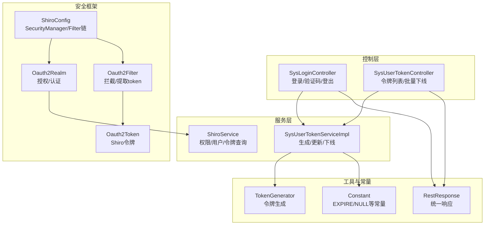
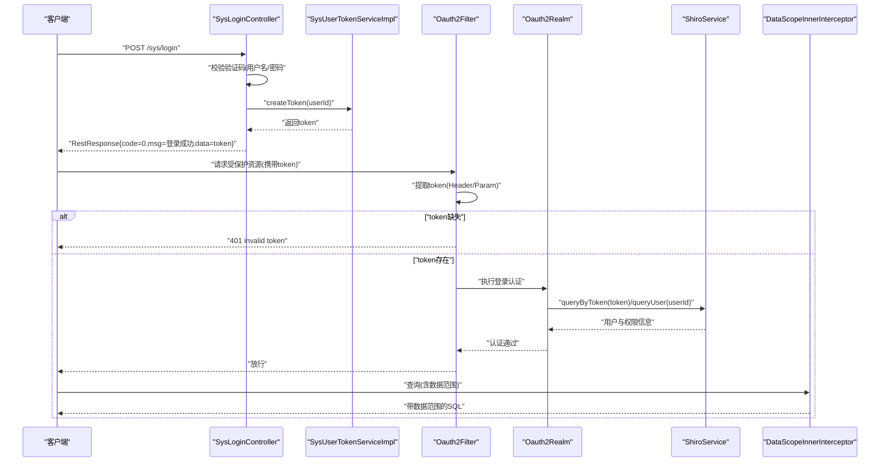
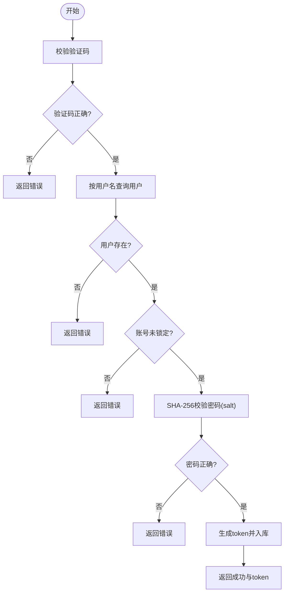
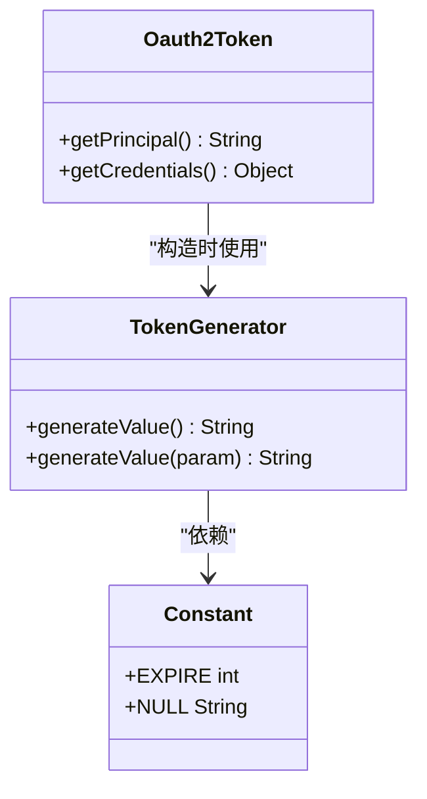
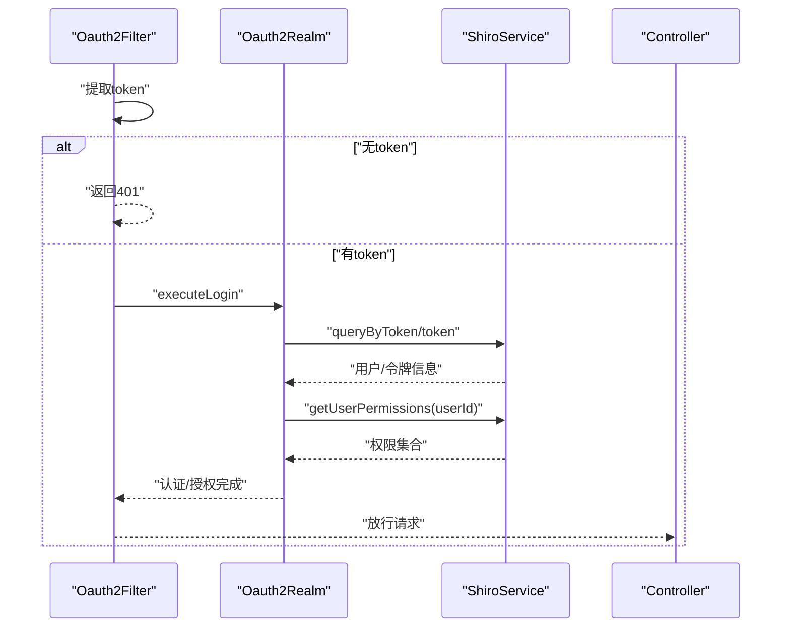
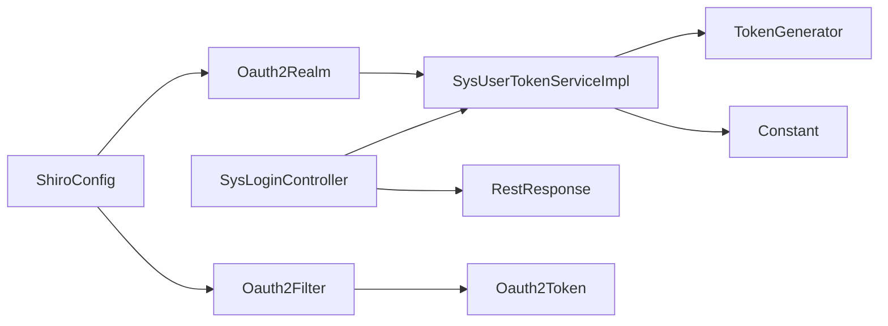

# 认证授权接口

<cite>
**本文引用的文件**
- [platform-admin/src/main/java/com/platform/modules/sys/controller/SysLoginController.java](file://platform-admin/src/main/java/com/platform/modules/sys/controller/SysLoginController.java)
- [platform-admin/src/main/java/com/platform/modules/sys/controller/SysUserTokenController.java](file://platform-admin/src/main/java/com/platform/modules/sys/controller/SysUserTokenController.java)
- [platform-admin/src/main/java/com/platform/modules/sys/oauth2/Oauth2Filter.java](file://platform-admin/src/main/java/com/platform/modules/sys/oauth2/Oauth2Filter.java)
- [platform-admin/src/main/java/com/platform/modules/sys/oauth2/Oauth2Realm.java](file://platform-admin/src/main/java/com/platform/modules/sys/oauth2/Oauth2Realm.java)
- [platform-admin/src/main/java/com/platform/modules/sys/oauth2/Oauth2Token.java](file://platform-admin/src/main/java/com/platform/modules/sys/oauth2/Oauth2Token.java)
- [platform-admin/src/main/java/com/platform/config/ShiroConfig.java](file://platform-admin/src/main/java/com/platform/config/ShiroConfig.java)
- [platform-biz/src/main/java/com/platform/modules/sys/service/ShiroService.java](file://platform-biz/src/main/java/com/platform/modules/sys/service/ShiroService.java)
- [platform-biz/src/main/java/com/platform/modules/sys/service/impl/SysUserTokenServiceImpl.java](file://platform-biz/src/main/java/com/platform/modules/sys/service/impl/SysUserTokenServiceImpl.java)
- [platform-common/src/main/java/com/platform/common/utils/Constant.java](file://platform-common/src/main/java/com/platform/common/utils/Constant.java)
- [platform-common/src/main/java/com/platform/common/utils/TokenGenerator.java](file://platform-common/src/main/java/com/platform/common/utils/TokenGenerator.java)
- [platform-common/src/main/java/com/platform/common/utils/RestResponse.java](file://platform-common/src/main/java/com/platform/common/utils/RestResponse.java)
- [platform-admin/src/main/java/com/platform/datascope/DataScopeInnerInterceptor.java](file://platform-admin/src/main/java/com/platform/datascope/DataScopeInnerInterceptor.java)
</cite>

## 目录
1. [简介](#简介)
2. [项目结构](#项目结构)
3. [核心组件](#核心组件)
4. [架构总览](#架构总览)
5. [详细组件分析](#详细组件分析)
6. [依赖分析](#依赖分析)
7. [性能考虑](#性能考虑)
8. [故障排查指南](#故障排查指南)
9. [结论](#结论)
10. [附录](#附录)

## 简介
本文件面向开发者与运维人员，系统化梳理平台的认证与权限控制体系，覆盖登录认证、令牌生成与校验、权限验证、接口拦截、Shiro权限框架集成、自定义注解使用以及安全最佳实践。文档以代码为依据，配合流程图与类图，帮助快速理解并正确集成认证授权能力。

## 项目结构
围绕认证授权的关键模块分布于 admin 与 biz 层：
- 控制层：登录控制器、用户令牌控制器
- 安全框架：Shiro 配置、Realm、过滤器、自定义令牌
- 服务层：ShiroService 接口、用户令牌服务实现
- 工具与常量：统一响应体、令牌生成器、全局常量

图表来源
- [platform-admin/src/main/java/com/platform/modules/sys/controller/SysLoginController.java:85-123](file://platform-admin/src/main/java/com/platform/modules/sys/controller/SysLoginController.java#L85-L123)
- [platform-admin/src/main/java/com/platform/modules/sys/controller/SysUserTokenController.java:47-75](file://platform-admin/src/main/java/com/platform/modules/sys/controller/SysUserTokenController.java#L47-L75)
- [platform-admin/src/main/java/com/platform/config/ShiroConfig.java:44-86](file://platform-admin/src/main/java/com/platform/config/ShiroConfig.java#L44-L86)
- [platform-admin/src/main/java/com/platform/modules/sys/oauth2/Oauth2Realm.java:41-87](file://platform-admin/src/main/java/com/platform/modules/sys/oauth2/Oauth2Realm.java#L41-L87)
- [platform-admin/src/main/java/com/platform/modules/sys/oauth2/Oauth2Filter.java:41-116](file://platform-admin/src/main/java/com/platform/modules/sys/oauth2/Oauth2Filter.java#L41-L116)
- [platform-admin/src/main/java/com/platform/modules/sys/oauth2/Oauth2Token.java:28-44](file://platform-admin/src/main/java/com/platform/modules/sys/oauth2/Oauth2Token.java#L28-L44)
- [platform-biz/src/main/java/com/platform/modules/sys/service/ShiroService.java:32-56](file://platform-biz/src/main/java/com/platform/modules/sys/service/ShiroService.java#L32-L56)
- [platform-biz/src/main/java/com/platform/modules/sys/service/impl/SysUserTokenServiceImpl.java:43-79](file://platform-biz/src/main/java/com/platform/modules/sys/service/impl/SysUserTokenServiceImpl.java#L43-L79)
- [platform-common/src/main/java/com/platform/common/utils/RestResponse.java:34-121](file://platform-common/src/main/java/com/platform/common/utils/RestResponse.java#L34-L121)
- [platform-common/src/main/java/com/platform/common/utils/TokenGenerator.java:31-62](file://platform-common/src/main/java/com/platform/common/utils/TokenGenerator.java#L31-L62)
- [platform-common/src/main/java/com/platform/common/utils/Constant.java:26-46](file://platform-common/src/main/java/com/platform/common/utils/Constant.java#L26-L46)

章节来源
- [platform-admin/src/main/java/com/platform/modules/sys/controller/SysLoginController.java:85-123](file://platform-admin/src/main/java/com/platform/modules/sys/controller/SysLoginController.java#L85-L123)
- [platform-admin/src/main/java/com/platform/config/ShiroConfig.java:44-86](file://platform-admin/src/main/java/com/platform/config/ShiroConfig.java#L44-L86)

## 核心组件
- 登录控制器：负责验证码校验、用户身份校验、生成并下发令牌
- 令牌控制器：提供令牌列表查询与批量下线（强制踢人）
- Shiro 过滤器：统一从请求头或参数提取 token，对未携带 token 的请求直接返回 401
- 自定义 Realm：基于 token 查询用户与权限，校验账号状态
- Shiro 配置：注册 Realm、SessionManager、过滤链映射
- 令牌服务：生成新 token、更新过期时间、下线处理
- 工具与常量：统一响应体、令牌生成算法、过期时间常量

章节来源
- [platform-admin/src/main/java/com/platform/modules/sys/controller/SysLoginController.java:85-123](file://platform-admin/src/main/java/com/platform/modules/sys/controller/SysLoginController.java#L85-L123)
- [platform-admin/src/main/java/com/platform/modules/sys/oauth2/Oauth2Filter.java:41-116](file://platform-admin/src/main/java/com/platform/modules/sys/oauth2/Oauth2Filter.java#L41-L116)
- [platform-admin/src/main/java/com/platform/modules/sys/oauth2/Oauth2Realm.java:41-87](file://platform-admin/src/main/java/com/platform/modules/sys/oauth2/Oauth2Realm.java#L41-L87)
- [platform-admin/src/main/java/com/platform/config/ShiroConfig.java:44-86](file://platform-admin/src/main/java/com/platform/config/ShiroConfig.java#L44-L86)
- [platform-biz/src/main/java/com/platform/modules/sys/service/impl/SysUserTokenServiceImpl.java:43-79](file://platform-biz/src/main/java/com/platform/modules/sys/service/impl/SysUserTokenServiceImpl.java#L43-L79)
- [platform-common/src/main/java/com/platform/common/utils/RestResponse.java:34-121](file://platform-common/src/main/java/com/platform/common/utils/RestResponse.java#L34-L121)
- [platform-common/src/main/java/com/platform/common/utils/TokenGenerator.java:31-62](file://platform-common/src/main/java/com/platform/common/utils/TokenGenerator.java#L31-L62)
- [platform-common/src/main/java/com/platform/common/utils/Constant.java:26-46](file://platform-common/src/main/java/com/platform/common/utils/Constant.java#L26-L46)

## 架构总览
下图展示从客户端到后端的认证与权限控制关键路径，包括登录、拦截、认证与授权、权限检查与数据范围控制。

图表来源
- [platform-admin/src/main/java/com/platform/modules/sys/controller/SysLoginController.java:85-123](file://platform-admin/src/main/java/com/platform/modules/sys/controller/SysLoginController.java#L85-L123)
- [platform-admin/src/main/java/com/platform/modules/sys/oauth2/Oauth2Filter.java:41-116](file://platform-admin/src/main/java/com/platform/modules/sys/oauth2/Oauth2Filter.java#L41-L116)
- [platform-admin/src/main/java/com/platform/modules/sys/oauth2/Oauth2Realm.java:41-87](file://platform-admin/src/main/java/com/platform/modules/sys/oauth2/Oauth2Realm.java#L41-L87)
- [platform-biz/src/main/java/com/platform/modules/sys/service/ShiroService.java:32-56](file://platform-biz/src/main/java/com/platform/modules/sys/service/ShiroService.java#L32-L56)
- [platform-admin/src/main/java/com/platform/datascope/DataScopeInnerInterceptor.java:50-67](file://platform-admin/src/main/java/com/platform/datascope/DataScopeInnerInterceptor.java#L50-L67)

## 详细组件分析

### 登录认证流程
- 验证码：提供验证码图片接口，提交登录时需校验 uuid 与 captcha
- 密码解密与校验：前端 AES 解密后提交，后端使用 SHA-256+salt 校验
- 账号状态：锁定状态禁止登录
- 令牌生成：成功后生成 token 并写入数据库，设置过期时间

图表来源
- [platform-admin/src/main/java/com/platform/modules/sys/controller/SysLoginController.java:85-123](file://platform-admin/src/main/java/com/platform/modules/sys/controller/SysLoginController.java#L85-L123)
- [platform-biz/src/main/java/com/platform/modules/sys/service/impl/SysUserTokenServiceImpl.java:43-79](file://platform-biz/src/main/java/com/platform/modules/sys/service/impl/SysUserTokenServiceImpl.java#L43-L79)
- [platform-common/src/main/java/com/platform/common/utils/Constant.java:44-46](file://platform-common/src/main/java/com/platform/common/utils/Constant.java#L44-L46)

章节来源
- [platform-admin/src/main/java/com/platform/modules/sys/controller/SysLoginController.java:85-123](file://platform-admin/src/main/java/com/platform/modules/sys/controller/SysLoginController.java#L85-L123)
- [platform-biz/src/main/java/com/platform/modules/sys/service/impl/SysUserTokenServiceImpl.java:43-79](file://platform-biz/src/main/java/com/platform/modules/sys/service/impl/SysUserTokenServiceImpl.java#L43-L79)
- [platform-common/src/main/java/com/platform/common/utils/Constant.java:44-46](file://platform-common/src/main/java/com/platform/common/utils/Constant.java#L44-L46)

### JWT 令牌管理与刷新机制
- 令牌类型：采用自定义的 OAuth2 风格令牌，非标准 JWT 结构
- 生成策略：使用 MD5 摘要生成稳定且不可逆的 token 字符串
- 过期策略：登录时生成 token 并设置过期时间（常量定义）
- 刷新机制：当前实现未提供独立刷新接口；建议在客户端轮询或在服务端扩展“续期”逻辑（例如在访问时延长过期时间）

图表来源
- [platform-admin/src/main/java/com/platform/modules/sys/oauth2/Oauth2Token.java:28-44](file://platform-admin/src/main/java/com/platform/modules/sys/oauth2/Oauth2Token.java#L28-L44)
- [platform-common/src/main/java/com/platform/common/utils/TokenGenerator.java:31-62](file://platform-common/src/main/java/com/platform/common/utils/TokenGenerator.java#L31-L62)
- [platform-common/src/main/java/com/platform/common/utils/Constant.java:44-46](file://platform-common/src/main/java/com/platform/common/utils/Constant.java#L44-L46)

章节来源
- [platform-admin/src/main/java/com/platform/modules/sys/oauth2/Oauth2Token.java:28-44](file://platform-admin/src/main/java/com/platform/modules/sys/oauth2/Oauth2Token.java#L28-L44)
- [platform-common/src/main/java/com/platform/common/utils/TokenGenerator.java:31-62](file://platform-common/src/main/java/com/platform/common/utils/TokenGenerator.java#L31-L62)
- [platform-common/src/main/java/com/platform/common/utils/Constant.java:44-46](file://platform-common/src/main/java/com/platform/common/utils/Constant.java#L44-L46)

### 权限验证与接口拦截
- 拦截策略：Shiro 过滤器对所有受保护路径进行拦截，默认要求携带 token
- 认证流程：过滤器提取 token，交由 Realm 执行认证；Realm 通过 ShiroService 查询用户与权限
- 授权流程：Realm 将用户权限集合注入到授权信息对象，供后续注解与编程式校验使用
- 白名单：静态资源、登录、验证码等无需认证

图表来源
- [platform-admin/src/main/java/com/platform/modules/sys/oauth2/Oauth2Filter.java:41-116](file://platform-admin/src/main/java/com/platform/modules/sys/oauth2/Oauth2Filter.java#L41-L116)
- [platform-admin/src/main/java/com/platform/modules/sys/oauth2/Oauth2Realm.java:41-87](file://platform-admin/src/main/java/com/platform/modules/sys/oauth2/Oauth2Realm.java#L41-L87)
- [platform-biz/src/main/java/com/platform/modules/sys/service/ShiroService.java:32-56](file://platform-biz/src/main/java/com/platform/modules/sys/service/ShiroService.java#L32-L56)

章节来源
- [platform-admin/src/main/java/com/platform/config/ShiroConfig.java:63-86](file://platform-admin/src/main/java/com/platform/config/ShiroConfig.java#L63-L86)
- [platform-admin/src/main/java/com/platform/modules/sys/oauth2/Oauth2Filter.java:41-116](file://platform-admin/src/main/java/com/platform/modules/sys/oauth2/Oauth2Filter.java#L41-L116)
- [platform-admin/src/main/java/com/platform/modules/sys/oauth2/Oauth2Realm.java:41-87](file://platform-admin/src/main/java/com/platform/modules/sys/oauth2/Oauth2Realm.java#L41-L87)
- [platform-biz/src/main/java/com/platform/modules/sys/service/ShiroService.java:32-56](file://platform-biz/src/main/java/com/platform/modules/sys/service/ShiroService.java#L32-L56)

### OAuth2 集成方案与自定义注解
- OAuth2 集成：通过自定义 Oauth2Filter 与 Oauth2Realm 实现基于 token 的认证与授权，未引入外部 OAuth2 提供商 SDK
- 自定义注解：项目中存在权限注解与切面相关文件（如 RequiresPermissions、AuthorizationAspect），但当前登录与令牌接口未直接使用注解进行权限控制；权限主要通过 Realm 授权与拦截器生效

章节来源
- [platform-admin/src/main/java/com/platform/modules/sys/oauth2/Oauth2Filter.java:41-116](file://platform-admin/src/main/java/com/platform/modules/sys/oauth2/Oauth2Filter.java#L41-L116)
- [platform-admin/src/main/java/com/platform/modules/sys/oauth2/Oauth2Realm.java:41-87](file://platform-admin/src/main/java/com/platform/modules/sys/oauth2/Oauth2Realm.java#L41-L87)

### 数据范围控制与权限边界
- 数据范围拦截器：在查询前动态拼接组织机构与用户维度的数据范围条件，避免越权访问
- 超级管理员豁免：系统管理员不受数据范围限制

章节来源
- [platform-admin/src/main/java/com/platform/datascope/DataScopeInnerInterceptor.java:50-67](file://platform-admin/src/main/java/com/platform/datascope/DataScopeInnerInterceptor.java#L50-L67)

## 依赖分析
- 组件耦合
  - 控制器依赖服务层；服务层依赖工具与常量；Realm 依赖 ShiroService；过滤器依赖 Realm
- 外部依赖
  - Shiro（认证/授权）、MyBatis-Plus（分页与DAO）、FastJSON（序列化）、Spring Web MVC（HTTP）
- 潜在风险
  - 当前未发现循环依赖
  - 过滤链映射集中于 ShiroConfig，建议结合白名单与路径匹配策略优化

图表来源
- [platform-admin/src/main/java/com/platform/modules/sys/controller/SysLoginController.java:85-123](file://platform-admin/src/main/java/com/platform/modules/sys/controller/SysLoginController.java#L85-L123)
- [platform-biz/src/main/java/com/platform/modules/sys/service/impl/SysUserTokenServiceImpl.java:43-79](file://platform-biz/src/main/java/com/platform/modules/sys/service/impl/SysUserTokenServiceImpl.java#L43-L79)
- [platform-common/src/main/java/com/platform/common/utils/RestResponse.java:34-121](file://platform-common/src/main/java/com/platform/common/utils/RestResponse.java#L34-L121)
- [platform-common/src/main/java/com/platform/common/utils/TokenGenerator.java:31-62](file://platform-common/src/main/java/com/platform/common/utils/TokenGenerator.java#L31-L62)
- [platform-common/src/main/java/com/platform/common/utils/Constant.java:44-46](file://platform-common/src/main/java/com/platform/common/utils/Constant.java#L44-L46)
- [platform-admin/src/main/java/com/platform/config/ShiroConfig.java:44-86](file://platform-admin/src/main/java/com/platform/config/ShiroConfig.java#L44-L86)
- [platform-admin/src/main/java/com/platform/modules/sys/oauth2/Oauth2Realm.java:41-87](file://platform-admin/src/main/java/com/platform/modules/sys/oauth2/Oauth2Realm.java#L41-L87)
- [platform-admin/src/main/java/com/platform/modules/sys/oauth2/Oauth2Filter.java:41-116](file://platform-admin/src/main/java/com/platform/modules/sys/oauth2/Oauth2Filter.java#L41-L116)
- [platform-admin/src/main/java/com/platform/modules/sys/oauth2/Oauth2Token.java:28-44](file://platform-admin/src/main/java/com/platform/modules/sys/oauth2/Oauth2Token.java#L28-L44)

## 性能考虑
- 令牌存储：建议将 token 存入高性能缓存（Redis）以降低数据库压力
- 过期策略：可考虑“惰性过期”或“滑动过期”，减少频繁重登
- 拦截开销：过滤器仅做 token 提取与必要校验，避免在拦截器中执行复杂逻辑
- 数据范围：尽量在 SQL 层面完成数据范围拼接，减少应用层二次过滤

## 故障排查指南
- 401 无效 token
  - 现象：未携带 token 或 token 为空
  - 排查：确认请求头或参数名是否为 token；检查白名单路径是否误拦截
  - 参考
    - [platform-admin/src/main/java/com/platform/modules/sys/oauth2/Oauth2Filter.java:61-76](file://platform-admin/src/main/java/com/platform/modules/sys/oauth2/Oauth2Filter.java#L61-L76)
- 登录失败
  - 现象：验证码错误、账号不存在、密码错误、账号锁定
  - 排查：核对验证码 uuid 与输入；确认用户状态；检查密码加密与盐值
  - 参考
    - [platform-admin/src/main/java/com/platform/modules/sys/controller/SysLoginController.java:85-123](file://platform-admin/src/main/java/com/platform/modules/sys/controller/SysLoginController.java#L85-L123)
- 令牌失效
  - 现象：token 过期或被下线
  - 排查：检查过期时间常量与生成逻辑；确认是否被批量下线
  - 参考
    - [platform-admin/src/main/java/com/platform/modules/sys/oauth2/Oauth2Realm.java:73-77](file://platform-admin/src/main/java/com/platform/modules/sys/oauth2/Oauth2Realm.java#L73-L77)
    - [platform-biz/src/main/java/com/platform/modules/sys/service/impl/SysUserTokenServiceImpl.java:76-79](file://platform-biz/src/main/java/com/platform/modules/sys/service/impl/SysUserTokenServiceImpl.java#L76-L79)
- 权限不足
  - 现象：返回 403 或被拦截
  - 排查：确认用户权限集合是否包含所需权限；检查注解与拦截器配置
  - 参考
    - [platform-admin/src/main/java/com/platform/modules/sys/oauth2/Oauth2Realm.java:52-63](file://platform-admin/src/main/java/com/platform/modules/sys/oauth2/Oauth2Realm.java#L52-L63)

章节来源
- [platform-admin/src/main/java/com/platform/modules/sys/oauth2/Oauth2Filter.java:61-76](file://platform-admin/src/main/java/com/platform/modules/sys/oauth2/Oauth2Filter.java#L61-L76)
- [platform-admin/src/main/java/com/platform/modules/sys/oauth2/Oauth2Realm.java:73-77](file://platform-admin/src/main/java/com/platform/modules/sys/oauth2/Oauth2Realm.java#L73-L77)
- [platform-admin/src/main/java/com/platform/modules/sys/controller/SysLoginController.java:85-123](file://platform-admin/src/main/java/com/platform/modules/sys/controller/SysLoginController.java#L85-L123)
- [platform-biz/src/main/java/com/platform/modules/sys/service/impl/SysUserTokenServiceImpl.java:76-79](file://platform-biz/src/main/java/com/platform/modules/sys/service/impl/SysUserTokenServiceImpl.java#L76-L79)

## 结论
该认证授权体系以 Shiro 为核心，结合自定义过滤器与 Realm 实现了基于 token 的认证与授权；登录流程清晰、拦截策略明确、权限边界通过数据范围拦截器进一步强化。建议在现有基础上完善令牌刷新与缓存策略，并评估引入更通用的 JWT 生态以增强跨系统互操作性。

## 附录

### 接口定义与调用示例

- 登录
  - 方法与路径：POST /sys/login
  - 请求体字段：username、password（已 AES 解密）、uuid、captcha
  - 成功响应：code=0，data=token
  - 失败响应：返回具体错误信息
  - 参考
    - [platform-admin/src/main/java/com/platform/modules/sys/controller/SysLoginController.java:85-123](file://platform-admin/src/main/java/com/platform/modules/sys/controller/SysLoginController.java#L85-L123)
    - [platform-common/src/main/java/com/platform/common/utils/RestResponse.java:34-121](file://platform-common/src/main/java/com/platform/common/utils/RestResponse.java#L34-L121)

- 验证码
  - 方法与路径：GET captcha.jpg
  - 参数：uuid
  - 响应：图片流
  - 参考
    - [platform-admin/src/main/java/com/platform/modules/sys/controller/SysLoginController.java:65-77](file://platform-admin/src/main/java/com/platform/modules/sys/controller/SysLoginController.java#L65-L77)

- 退出系统
  - 方法与路径：POST /sys/logout
  - 响应：code=0 表示成功
  - 参考
    - [platform-admin/src/main/java/com/platform/modules/sys/controller/SysLoginController.java:131-136](file://platform-admin/src/main/java/com/platform/modules/sys/controller/SysLoginController.java#L131-L136)

- 令牌列表
  - 方法与路径：GET sys/usertoken/list
  - 权限：sys:usertoken:list
  - 参考
    - [platform-admin/src/main/java/com/platform/modules/sys/controller/SysUserTokenController.java:53-60](file://platform-admin/src/main/java/com/platform/modules/sys/controller/SysUserTokenController.java#L53-L60)

- 批量下线用户
  - 方法与路径：POST sys/usertoken/offline
  - 权限：sys:usertoken:offline
  - 参考
    - [platform-admin/src/main/java/com/platform/modules/sys/controller/SysUserTokenController.java:68-75](file://platform-admin/src/main/java/com/platform/modules/sys/controller/SysUserTokenController.java#L68-L75)

### 安全最佳实践
- 强制 HTTPS：所有认证接口必须启用 TLS
- 最小权限：严格区分角色与权限，避免过度授权
- 令牌安全：建议迁移到标准 JWT 并启用签名与加密；缩短过期时间并支持刷新
- 缓存策略：将 token 与会话信息放入 Redis，开启过期与清理策略
- 日志审计：对登录、登出、权限拒绝事件进行记录与告警
- 输入校验：对 token 与参数进行长度、格式与范围校验