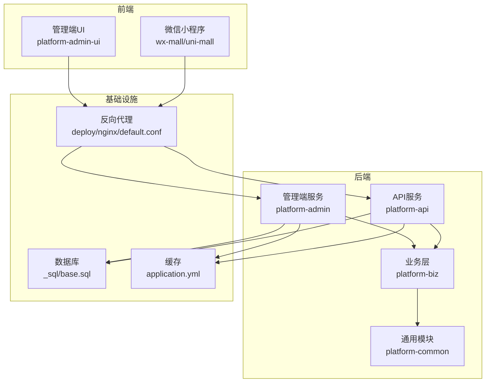
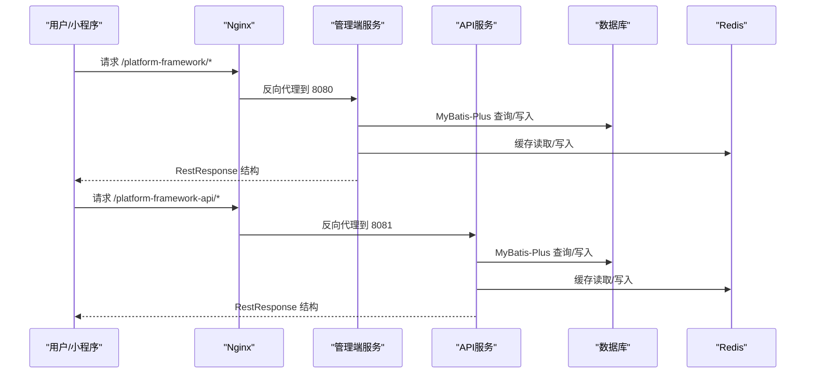
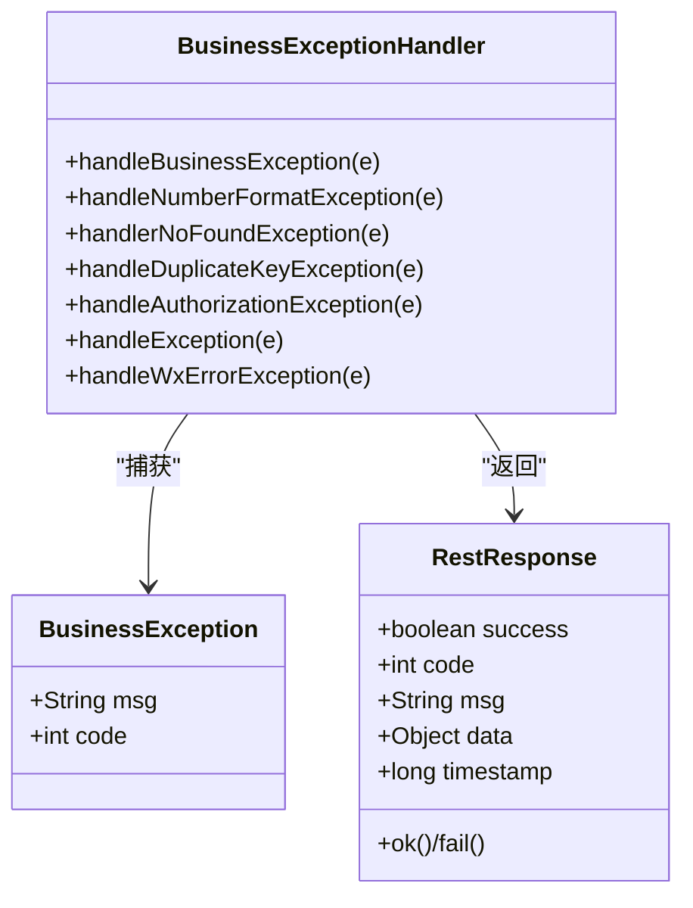
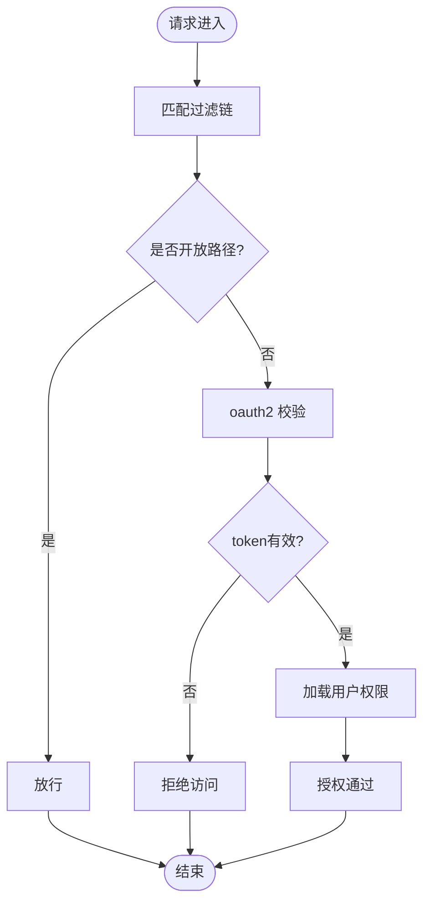
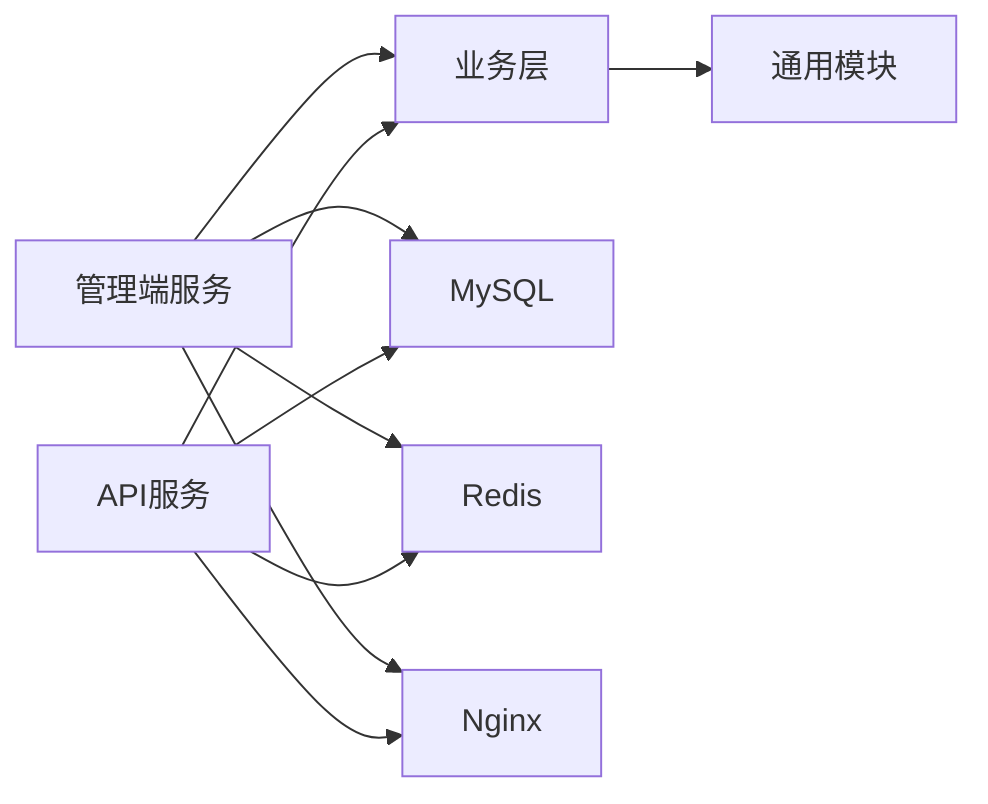

# 故障排查

<cite>
**本文引用的文件**
- [application.yml（管理端）](file://platform-admin/src/main/resources/application.yml)
- [application.yml（API端）](file://platform-api/src/main/resources/application.yml)
- [logback-spring.xml（管理端）](file://platform-admin/src/main/resources/logback-spring.xml)
- [logback-spring.xml（API端）](file://platform-api/src/main/resources/logback-spring.xml)
- [BusinessException.java](file://platform-common/src/main/java/com/platform/common/exception/BusinessException.java)
- [BusinessExceptionHandler.java](file://platform-common/src/main/java/com/platform/common/exception/BusinessExceptionHandler.java)
- [application-dev.yml（管理端）](file://platform-admin/src/main/resources/application-dev.yml)
- [application-dev.yml（API端）](file://platform-api/src/main/resources/application-dev.yml)
- [default.conf（Nginx）](file://deploy/nginx/default.conf)
- [base.sql](file://_sql/base.sql)
- [ShiroConfig.java](file://platform-admin/src/main/java/com/platform/config/ShiroConfig.java)
- [FilterConfig.java](file://platform-admin/src/main/java/com/platform/config/FilterConfig.java)
- [Oauth2Realm.java](file://platform-admin/src/main/java/com/platform/modules/sys/oauth2/Oauth2Realm.java)
- [RestResponse.java](file://platform-common/src/main/java/com/platform/common/utils/RestResponse.java)
</cite>

## 目录
1. [简介](#简介)
2. [项目结构](#项目结构)
3. [核心组件](#核心组件)
4. [架构总览](#架构总览)
5. [详细组件分析](#详细组件分析)
6. [依赖分析](#依赖分析)
7. [性能考量](#性能考量)
8. [故障排查指南](#故障排查指南)
9. [结论](#结论)
10. [附录](#附录)

## 简介
本指南面向开发者与运维工程师，聚焦于平台在启动失败、数据库连接、权限配置、微信接口异常等方面的快速定位与处置；同时提供日志分析方法、监控指标解读、应急流程、常见错误码与预防性维护建议，帮助团队高效排障与稳定运行。

## 项目结构
平台由多模块组成，包含管理端与API端后端服务、前端UI、微信小程序与公众号能力、定时调度、对象存储、以及部署与监控配置。整体采用Spring Boot + Undertow + Druid + MyBatis-Plus + Shiro + 微信SDK的组合。

图表来源
- [default.conf（Nginx）:1-28](file://deploy/nginx/default.conf#L1-L28)
- [application.yml（管理端）:1-205](file://platform-admin/src/main/resources/application.yml#L1-L205)
- [application.yml（API端）:1-195](file://platform-api/src/main/resources/application.yml#L1-L195)

章节来源
- [application.yml（管理端）:1-205](file://platform-admin/src/main/resources/application.yml#L1-L205)
- [application.yml（API端）:1-195](file://platform-api/src/main/resources/application.yml#L1-L195)
- [default.conf（Nginx）:1-28](file://deploy/nginx/default.conf#L1-L28)

## 核心组件
- 日志与配置
  - 管理端与API端均使用Logback按环境(profile)输出控制台与滚动文件日志，生产环境默认降低Web日志级别，便于问题定位与性能控制。
- 异常处理
  - 统一异常处理器捕获业务异常、参数异常、路径不存在、重复键、鉴权异常及微信错误，统一返回RestResponse结构，便于前端与监控系统消费。
- 数据库与连接池
  - 使用Druid连接池，提供慢SQL统计、监控页面、白名单与登录凭证，便于在开发/测试环境下快速诊断SQL与连接问题。
- 权限与安全
  - 基于Shiro的OAuth2过滤链，开放部分静态与文档路径，其余请求强制oauth2校验；Realm负责token校验与用户权限加载。
- 微信生态
  - 配置了公众号、小程序、支付等参数，结合业务模块实现消息、模板与支付回调处理。
- 反向代理
  - Nginx将前端静态资源与后端服务路由至对应容器端口，确保上下文路径与代理头一致。

章节来源
- [logback-spring.xml（管理端）:1-94](file://platform-admin/src/main/resources/logback-spring.xml#L1-L94)
- [logback-spring.xml（API端）:1-94](file://platform-api/src/main/resources/logback-spring.xml#L1-L94)
- [BusinessExceptionHandler.java:1-100](file://platform-common/src/main/java/com/platform/common/exception/BusinessExceptionHandler.java#L1-L100)
- [RestResponse.java:1-122](file://platform-common/src/main/java/com/platform/common/utils/RestResponse.java#L1-L122)
- [application-dev.yml（管理端）:1-47](file://platform-admin/src/main/resources/application-dev.yml#L1-L47)
- [application-dev.yml（API端）:1-47](file://platform-api/src/main/resources/application-dev.yml#L1-L47)
- [ShiroConfig.java:1-99](file://platform-admin/src/main/java/com/platform/config/ShiroConfig.java#L1-L99)
- [FilterConfig.java:1-45](file://platform-admin/src/main/java/com/platform/config/FilterConfig.java#L1-L45)
- [Oauth2Realm.java:1-88](file://platform-admin/src/main/java/com/platform/modules/sys/oauth2/Oauth2Realm.java#L1-L88)
- [application.yml（管理端）:169-204](file://platform-admin/src/main/resources/application.yml#L169-L204)
- [application.yml（API端）:157-194](file://platform-api/src/main/resources/application.yml#L157-L194)
- [default.conf（Nginx）:1-28](file://deploy/nginx/default.conf#L1-L28)

## 架构总览
下图展示从浏览器/小程序到后端服务、数据库与缓存的整体交互路径，以及关键异常与日志落点。

图表来源
- [default.conf（Nginx）:11-25](file://deploy/nginx/default.conf#L11-L25)
- [application.yml（管理端）:4-20](file://platform-admin/src/main/resources/application.yml#L4-L20)
- [application.yml（API端）:4-20](file://platform-api/src/main/resources/application.yml#L4-L20)

## 详细组件分析

### 异常处理与统一响应
- 统一异常处理器覆盖业务异常、参数异常、路径不存在、重复键、鉴权异常、微信错误等，返回RestResponse，包含success、code、msg、data、timestamp等字段，便于前端与监控系统解析。
- 关键点
  - 业务异常：携带自定义code与message。
  - 路径不存在：返回404语义提示。
  - 重复键：提示数据库记录已存在。
  - 鉴权异常：提示无权限。
  - 微信错误：透传微信错误码与错误信息。

图表来源
- [BusinessException.java:1-74](file://platform-common/src/main/java/com/platform/common/exception/BusinessException.java#L1-L74)
- [BusinessExceptionHandler.java:1-100](file://platform-common/src/main/java/com/platform/common/exception/BusinessExceptionHandler.java#L1-L100)
- [RestResponse.java:1-122](file://platform-common/src/main/java/com/platform/common/utils/RestResponse.java#L1-L122)

章节来源
- [BusinessException.java:1-74](file://platform-common/src/main/java/com/platform/common/exception/BusinessException.java#L1-L74)
- [BusinessExceptionHandler.java:1-100](file://platform-common/src/main/java/com/platform/common/exception/BusinessExceptionHandler.java#L1-L100)
- [RestResponse.java:1-122](file://platform-common/src/main/java/com/platform/common/utils/RestResponse.java#L1-L122)

### 权限与安全（Shiro）
- 过滤链
  - 开放路径：/druid/**、/sys/login、/captcha.jpg、/swagger-ui/**、/doc.html、/favicon.ico、/webjars/**、/v3/api-docs/**。
  - 其余路径强制oauth2过滤。
- Realm
  - 校验token有效性与过期时间，拉取用户状态与权限集合，返回授权信息。
- 关键点
  - 若登录或权限相关接口异常，优先检查过滤链配置与token有效性。

图表来源
- [ShiroConfig.java:63-86](file://platform-admin/src/main/java/com/platform/config/ShiroConfig.java#L63-L86)
- [FilterConfig.java:34-45](file://platform-admin/src/main/java/com/platform/config/FilterConfig.java#L34-L45)
- [Oauth2Realm.java:68-87](file://platform-admin/src/main/java/com/platform/modules/sys/oauth2/Oauth2Realm.java#L68-L87)

章节来源
- [ShiroConfig.java:1-99](file://platform-admin/src/main/java/com/platform/config/ShiroConfig.java#L1-L99)
- [FilterConfig.java:1-45](file://platform-admin/src/main/java/com/platform/config/FilterConfig.java#L1-L45)
- [Oauth2Realm.java:1-88](file://platform-admin/src/main/java/com/platform/modules/sys/oauth2/Oauth2Realm.java#L1-L88)

### 日志与级别配置
- 环境差异
  - dev：控制台彩色输出，com.platform包调试级别，适合本地开发。
  - test/prod：控制台+滚动文件，prod对Web日志降级，减少噪声。
- 关键落点
  - 异常处理器统一记录error日志，便于检索。
  - Druid慢SQL与统计在开发/测试环境开启，生产环境可按需启用。

章节来源
- [logback-spring.xml（管理端）:1-94](file://platform-admin/src/main/resources/logback-spring.xml#L1-L94)
- [logback-spring.xml（API端）:1-94](file://platform-api/src/main/resources/logback-spring.xml#L1-L94)
- [BusinessExceptionHandler.java:87-98](file://platform-common/src/main/java/com/platform/common/exception/BusinessExceptionHandler.java#L87-L98)

### 数据库与连接池（Druid）
- 开发/测试环境
  - Druid监控页面：/druid，白名单与登录凭据可配置。
  - 慢SQL阈值、合并SQL统计等参数可调整。
- 生产环境
  - 通过application-*.yml配置远端MySQL，连接池参数与慢SQL统计按需开启。

章节来源
- [application-dev.yml（管理端）:37-47](file://platform-admin/src/main/resources/application-dev.yml#L37-L47)
- [application-dev.yml（API端）:37-47](file://platform-api/src/main/resources/application-dev.yml#L37-L47)
- [application.yml（管理端）:1-205](file://platform-admin/src/main/resources/application.yml#L1-L205)
- [application.yml（API端）:1-195](file://platform-api/src/main/resources/application.yml#L1-L195)

### 反向代理与上下文路径
- Nginx将前端静态资源与后端服务分别代理到不同后端容器端口与上下文路径，确保Header传递与路径一致性。

章节来源
- [default.conf（Nginx）:1-28](file://deploy/nginx/default.conf#L1-L28)

## 依赖分析
- 组件耦合
  - 业务层依赖通用模块（异常、工具、Redis配置等），后端服务依赖业务层与基础配置。
  - 管理端与API端共享通用异常与响应模型，保证对外接口一致性。
- 外部依赖
  - MySQL、Redis、Nginx、微信平台。
- 潜在风险
  - 过度依赖全局异常处理器导致日志分散；建议在关键业务处补充上下文日志以便回溯。

图表来源
- [application.yml（管理端）:1-205](file://platform-admin/src/main/resources/application.yml#L1-L205)
- [application.yml（API端）:1-195](file://platform-api/src/main/resources/application.yml#L1-L195)
- [default.conf（Nginx）:1-28](file://deploy/nginx/default.conf#L1-L28)

## 性能考量
- 连接池与线程
  - Undertow线程与缓冲参数影响并发与内存占用，建议结合压测结果调整。
- SQL与缓存
  - 开启Druid慢SQL统计，配合索引与分页优化；合理设置Redis过期策略与容量上限。
- 日志
  - 生产环境降低Web日志级别，避免I/O成为瓶颈。

章节来源
- [application.yml（管理端）:4-18](file://platform-admin/src/main/resources/application.yml#L4-L18)
- [application.yml（API端）:4-18](file://platform-api/src/main/resources/application.yml#L4-L18)
- [application-dev.yml（管理端）:33-36](file://platform-admin/src/main/resources/application-dev.yml#L33-L36)
- [application-dev.yml（API端）:33-36](file://platform-api/src/main/resources/application-dev.yml#L33-L36)

## 故障排查指南

### 启动失败排查
- 症状
  - 服务无法启动或启动后立即退出。
- 诊断步骤
  - 查看日志：确认Logback配置是否正确加载，是否存在数据库驱动缺失、端口冲突、上下文路径冲突。
  - 环境变量：确认active profile与配置文件是否匹配。
  - 依赖检查：确认MySQL/Redis可达，连接串与凭据正确。
- 常见原因
  - 端口被占用（8080/8081）、上下文路径冲突、数据库驱动或版本不兼容、Nginx未正确代理。
- 临时措施
  - 切换到dev/test环境，降低日志级别，逐步注释非关键配置。
- 永久修复
  - 明确各环境配置差异，统一配置模板与校验脚本。

章节来源
- [logback-spring.xml（管理端）:14-27](file://platform-admin/src/main/resources/logback-spring.xml#L14-L27)
- [logback-spring.xml（API端）:14-27](file://platform-api/src/main/resources/logback-spring.xml#L14-L27)
- [application.yml（管理端）:4-20](file://platform-admin/src/main/resources/application.yml#L4-L20)
- [application.yml（API端）:4-20](file://platform-api/src/main/resources/application.yml#L4-L20)
- [default.conf（Nginx）:11-25](file://deploy/nginx/default.conf#L11-L25)

### 数据库连接问题
- 症状
  - 启动时报连接失败、SQL执行超时、Druid监控页面无法访问。
- 诊断步骤
  - 确认数据库连通性与凭据，检查连接池参数（初始连接、最大活跃、最大等待、空闲阈值）。
  - 在开发/测试环境访问/druid，查看慢SQL与连接状态。
- 常见原因
  - 地址/端口错误、网络ACL限制、数据库未启动、连接池耗尽。
- 临时措施
  - 提高maxActive与maxWait，缩短validationQuery时间，临时开启慢SQL日志。
- 永久修复
  - 规范数据库与连接池参数，增加健康检查与告警。

章节来源
- [application-dev.yml（管理端）:7-36](file://platform-admin/src/main/resources/application-dev.yml#L7-L36)
- [application-dev.yml（API端）:7-36](file://platform-api/src/main/resources/application-dev.yml#L7-L36)
- [application.yml（管理端）:1-205](file://platform-admin/src/main/resources/application.yml#L1-L205)
- [application.yml（API端）:1-195](file://platform-api/src/main/resources/application.yml#L1-L195)

### 权限配置问题
- 症状
  - 登录成功但访问受限、提示无权限或token失效。
- 诊断步骤
  - 检查Shiro过滤链配置，确认/oauth2过滤是否生效。
  - 校验用户状态与权限集合是否正确加载。
- 常见原因
  - 过滤链遗漏开放路径、token过期或被顶号、用户状态被锁定。
- 临时措施
  - 临时将目标路径加入匿名放行，确认是否为权限问题。
- 永久修复
  - 明确权限矩阵与过滤链清单，定期审计用户状态与权限。

章节来源
- [ShiroConfig.java:63-86](file://platform-admin/src/main/java/com/platform/config/ShiroConfig.java#L63-L86)
- [FilterConfig.java:34-45](file://platform-admin/src/main/java/com/platform/config/FilterConfig.java#L34-L45)
- [Oauth2Realm.java:68-87](file://platform-admin/src/main/java/com/platform/modules/sys/oauth2/Oauth2Realm.java#L68-L87)

### 微信接口异常
- 症状
  - 微信回调失败、消息发送异常、支付回调验签失败。
- 诊断步骤
  - 检查微信配置（appId、secret、mchId、mchKey、证书路径、回调地址）。
  - 关注BusinessExceptionHandler对WxErrorException的处理，核对错误码与错误信息。
- 常见原因
  - 配置项缺失或错误、证书路径不正确、回调地址与平台配置不一致、时间戳/签名不一致。
- 临时措施
  - 临时打印关键参数与签名过程，核对微信平台日志。
- 永久修复
  - 建立配置校验清单与自动化校验脚本，统一证书与回调地址管理。

章节来源
- [application.yml（管理端）:169-204](file://platform-admin/src/main/resources/application.yml#L169-L204)
- [application.yml（API端）:157-194](file://platform-api/src/main/resources/application.yml#L157-L194)
- [BusinessExceptionHandler.java:93-98](file://platform-common/src/main/java/com/platform/common/exception/BusinessExceptionHandler.java#L93-L98)

### 日志分析方法
- 日志级别与落点
  - dev：彩色控制台+DEBUG，便于开发调试。
  - test/prod：控制台+滚动文件，prod降低Web日志级别。
  - 异常统一走error级别，便于检索。
- 关键日志解读
  - 异常处理器：关注BusinessException、WxErrorException、AuthorizationException等。
  - Druid：关注慢SQL与连接池状态。
- 错误定位技巧
  - 以timestamp与trace维度聚合日志，结合请求上下文ID定位调用链。
  - 对高频错误进行聚合统计与告警。

章节来源
- [logback-spring.xml（管理端）:14-89](file://platform-admin/src/main/resources/logback-spring.xml#L14-L89)
- [logback-spring.xml（API端）:14-89](file://platform-api/src/main/resources/logback-spring.xml#L14-L89)
- [BusinessExceptionHandler.java:46-98](file://platform-common/src/main/java/com/platform/common/exception/BusinessExceptionHandler.java#L46-L98)

### 监控指标与异常判断
- 系统资源
  - CPU、内存、磁盘、连接数：结合操作系统与容器监控，设定阈值告警。
- 应用性能
  - QPS、P95/P99延迟、异常率、GC频率：通过APM或Prometheus+Grafana采集。
- 业务指标
  - 登录成功率、支付回调成功率、微信消息送达率：通过埋点与日志聚合统计。
- 异常判断标准
  - 异常率突增、P99延迟超阈、连接池耗尽、慢SQL占比上升。

章节来源
- [application.yml（管理端）:4-18](file://platform-admin/src/main/resources/application.yml#L4-L18)
- [application.yml（API端）:4-18](file://platform-api/src/main/resources/application.yml#L4-L18)
- [application-dev.yml（管理端）:33-36](file://platform-admin/src/main/resources/application-dev.yml#L33-L36)
- [application-dev.yml（API端）:33-36](file://platform-api/src/main/resources/application-dev.yml#L33-L36)

### 故障应急处理流程
- 问题上报
  - 快速复现、收集日志与截图、标注时间窗与影响范围。
- 影响评估
  - 评估用户影响面、业务中断时长、是否可回滚。
- 临时方案
  - 临时放行特定路径、切换只读模式、降级非关键功能。
- 永久修复
  - 根因分析、修复上线、回归测试、总结复盘。

章节来源
- [BusinessExceptionHandler.java:46-98](file://platform-common/src/main/java/com/platform/common/exception/BusinessExceptionHandler.java#L46-L98)

### 常见错误码与解决步骤
- 业务异常（自定义）
  - 表现：统一返回fail(code, msg)，前端据此提示。
  - 解决：根据code与message定位业务分支，修正参数或数据状态。
- 路径不存在
  - 表现：返回404语义提示。
  - 解决：检查路由与Swagger文档路径。
- 重复键
  - 表现：数据库已存在记录。
  - 解决：去重或变更唯一键策略。
- 鉴权异常
  - 表现：无权限或token失效。
  - 解决：检查过滤链与token有效期。
- 微信错误
  - 表现：透传微信错误码与错误信息。
  - 解决：核对配置与签名，检查回调地址与证书。

章节来源
- [BusinessException.java:28-70](file://platform-common/src/main/java/com/platform/common/exception/BusinessException.java#L28-L70)
- [BusinessExceptionHandler.java:46-98](file://platform-common/src/main/java/com/platform/common/exception/BusinessExceptionHandler.java#L46-L98)
- [RestResponse.java:79-121](file://platform-common/src/main/java/com/platform/common/utils/RestResponse.java#L79-L121)

### 预防性维护最佳实践
- 配置治理
  - 分环境配置模板化，统一校验与审批流程。
- 健康检查
  - 定期检查数据库连通性、Redis可用性、Nginx上游状态。
- 日志与审计
  - 保留关键操作日志与审计轨迹，定期轮转与归档。
- 回滚与演练
  - 建立一键回滚与演练机制，确保变更可控。

章节来源
- [application.yml（管理端）:1-205](file://platform-admin/src/main/resources/application.yml#L1-L205)
- [application.yml（API端）:1-195](file://platform-api/src/main/resources/application.yml#L1-L195)
- [logback-spring.xml（管理端）:37-89](file://platform-admin/src/main/resources/logback-spring.xml#L37-L89)
- [logback-spring.xml（API端）:37-89](file://platform-api/src/main/resources/logback-spring.xml#L37-L89)

## 结论
通过规范的日志与异常处理、完善的权限与代理配置、以及针对数据库与微信生态的专项排查手段，平台可在复杂场景下快速定位问题并恢复服务。建议持续完善监控与告警体系、加强配置治理与演练，提升整体稳定性与可维护性。

## 附录
- 数据库初始化
  - 可参考base.sql中的表结构与示例数据，确保初始化顺序与依赖满足。
- 微信配置要点
  - 确保回调地址、证书路径、密钥与平台配置一致，避免验签失败。

章节来源
- [base.sql:257-293](file://_sql/base.sql#L257-L293)
- [application.yml（管理端）:169-204](file://platform-admin/src/main/resources/application.yml#L169-L204)
- [application.yml（API端）:157-194](file://platform-api/src/main/resources/application.yml#L157-L194)