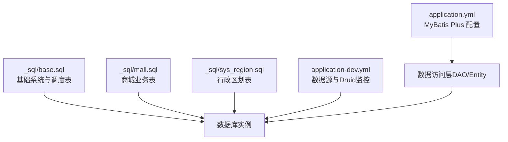
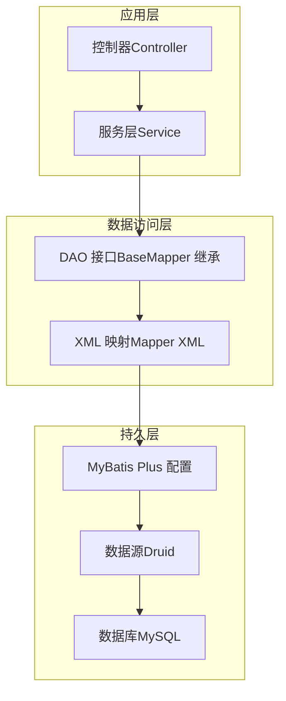
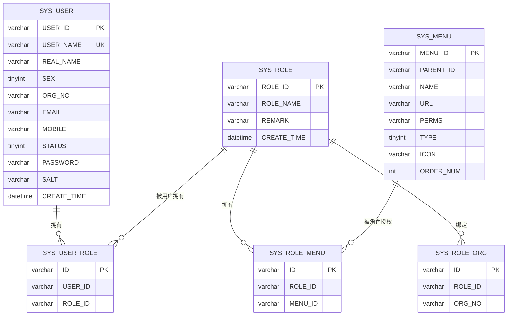
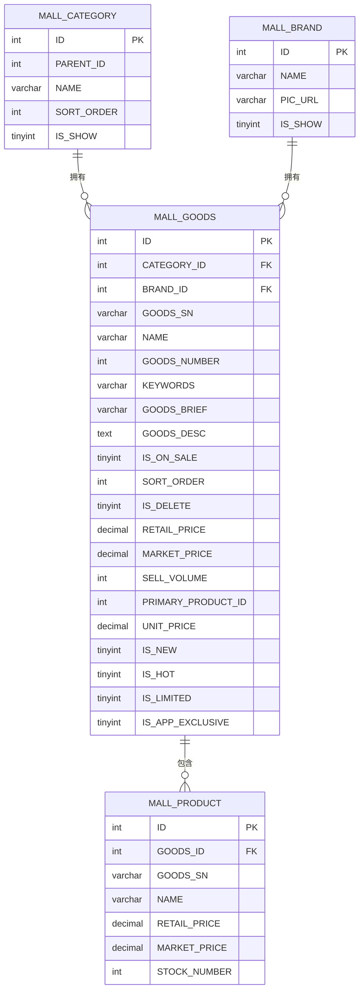
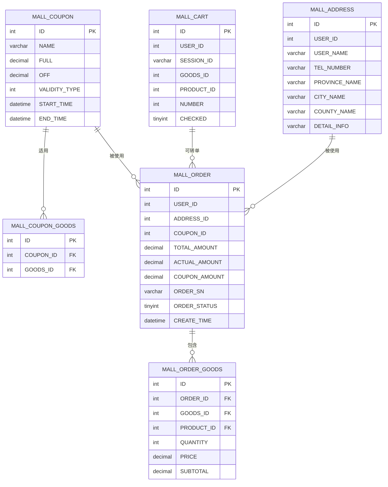
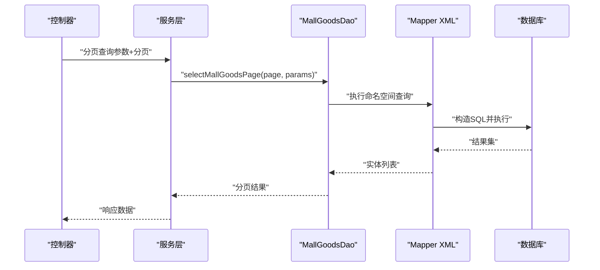
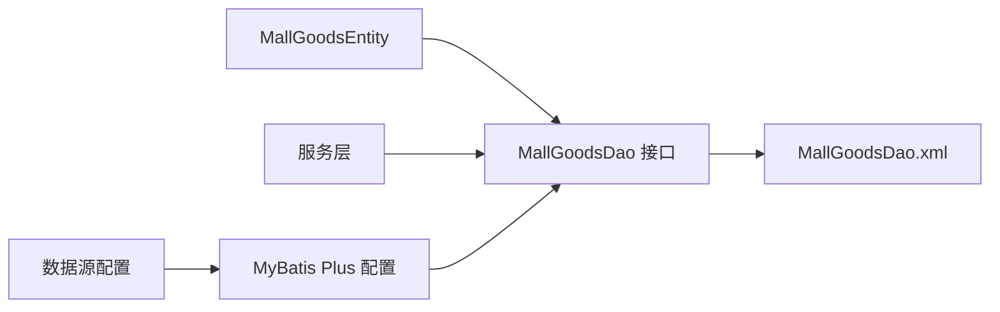

# 数据库设计

<cite>
**本文引用的文件**
- [base.sql](file://_sql/base.sql)
- [mall.sql](file://_sql/mall.sql)
- [sys_region.sql](file://_sql/sys_region.sql)
- [application.yml](file://platform-admin/src/main/resources/application.yml)
- [application-dev.yml](file://platform-admin/src/main/resources/application-dev.yml)
- [MallGoodsEntity.java](file://platform-biz/src/main/java/com/platform/modules/mall/entity/MallGoodsEntity.java)
- [SysUserEntity.java](file://platform-biz/src/main/java/com/platform/modules/sys/entity/SysUserEntity.java)
- [MallGoodsDao.java](file://platform-biz/src/main/java/com/platform/modules/mall/dao/MallGoodsDao.java)
- [MallGoodsDao.xml](file://platform-biz/src/main/resources/mapper/mall/MallGoodsDao.xml)
</cite>

## 目录
1. [简介](#简介)
2. [项目结构](#项目结构)
3. [核心组件](#核心组件)
4. [架构总览](#架构总览)
5. [详细组件分析](#详细组件分析)
6. [依赖分析](#依赖分析)
7. [性能考虑](#性能考虑)
8. [故障排查指南](#故障排查指南)
9. [结论](#结论)
10. [附录](#附录)

## 简介
本文件面向数据库管理员与开发者，系统性梳理平台的数据架构与表结构设计，覆盖用户、商品、订单、权限等关键业务实体，阐述范式设计、索引与查询优化策略，明确表间关系与外键约束，解释数据访问层（DAO）基于 MyBatis Plus 的设计与 SQL 映射配置，并提供数据库初始化脚本说明、迁移与版本管理建议，以及数据安全、备份恢复与性能监控最佳实践。

## 项目结构
- 数据库初始化脚本位于 _sql 目录：
  - 基础系统表与调度表：base.sql
  - 商城业务表：mall.sql
  - 行政区划表：sys_region.sql
- 应用配置中包含数据源与 MyBatis Plus 的基础配置：
  - application.yml：通用配置（含 MyBatis Plus 配置项）
  - application-dev.yml：开发环境数据源与 Druid 监控配置

**图表来源**
- [base.sql](file://_sql/base.sql)
- [mall.sql](file://_sql/mall.sql)
- [sys_region.sql](file://_sql/sys_region.sql)
- [application.yml](file://platform-admin/src/main/resources/application.yml)
- [application-dev.yml](file://platform-admin/src/main/resources/application-dev.yml)

**章节来源**
- [application.yml](file://platform-admin/src/main/resources/application.yml)
- [application-dev.yml](file://platform-admin/src/main/resources/application-dev.yml)

## 核心组件
- 系统用户与权限
  - 实体：SysUserEntity（用户）、SysRoleEntity（角色）、SysRoleMenuEntity（角色-菜单）、SysUserRoleEntity（用户-角色）、SYS_USER_ROLE、SYS_ROLE_MENU、SYS_ROLE、SYS_MENU、SYS_ORG、SYS_ROLE_ORG 等
  - 设计要点：用户与角色多对多，角色与菜单/机构多对多；通过 SYS_MENU 的权限标识与前端路由配合实现细粒度权限控制
- 商品与库存
  - 实体：MallGoodsEntity（商品）、MallCategoryEntity（分类）、MallBrandEntity（品牌）、MallProductEntity（SKU）、MallGoodsSpecificationEntity（规格）、MallAttributeEntity（属性）等
  - 设计要点：商品与 SKU 关联，属性与参数类型关联，支持多规格组合与价格体系
- 订单与交易
  - 实体：MallOrderEntity（订单）、MallOrderGoodsEntity（订单商品明细）、MallCartEntity（购物车）、MallAddressEntity（收货地址）、MallUserCouponEntity（用户优惠券）、MallCouponEntity（优惠券）、MallCouponGoodsEntity（优惠券适用商品）
  - 设计要点：订单与订单明细一对多，购物车与用户/商品关联，优惠券与商品范围绑定
- 系统配置与日志
  - 实体：SYS_CONFIG（系统配置）、SYS_LOG（操作日志）、SYS_SMS_LOG（短信发送日志）、SYS_CAPTCHA（验证码）、SYS_DICT/SYS_DICT_GROUP（数据字典）

**章节来源**
- [SysUserEntity.java](file://platform-biz/src/main/java/com/platform/modules/sys/entity/SysUserEntity.java)
- [MallGoodsEntity.java](file://platform-biz/src/main/java/com/platform/modules/mall/entity/MallGoodsEntity.java)
- [base.sql](file://_sql/base.sql)
- [mall.sql](file://_sql/mall.sql)

## 架构总览
平台数据库采用集中式关系型数据库（MySQL），通过 MyBatis Plus 提供 ORM 能力，DAO 层统一继承 BaseMapper，XML 映射文件按模块组织，结合分页插件与动态数据源（application-dev.yml 中的 dynamic 配置）实现灵活扩展。

**图表来源**
- [application.yml](file://platform-admin/src/main/resources/application.yml)
- [application-dev.yml](file://platform-admin/src/main/resources/application-dev.yml)
- [MallGoodsDao.java](file://platform-biz/src/main/java/com/platform/modules/mall/dao/MallGoodsDao.java)
- [MallGoodsDao.xml](file://platform-biz/src/main/resources/mapper/mall/MallGoodsDao.xml)

## 详细组件分析

### 用户与权限实体关系
- 关系模型
  - SYS_USER 与 SYS_USER_ROLE 多对多
  - SYS_ROLE 与 SYS_ROLE_MENU、SYS_ROLE_ORG 多对多
  - SYS_MENU 为权限载体，按层级组织菜单树
- 字段设计要点
  - 用户表包含登录名、真实姓名、性别、状态、邮箱、手机号、盐值、密码等
  - 角色表包含角色名与备注
  - 角色-菜单/机构中间表用于权限与数据范围控制
- 索引与约束
  - 用户名唯一索引
  - 角色-菜单/机构唯一组合索引
  - 外键约束保证引用完整性

**图表来源**
- [base.sql](file://_sql/base.sql)

**章节来源**
- [base.sql](file://_sql/base.sql)
- [SysUserEntity.java](file://platform-biz/src/main/java/com/platform/modules/sys/entity/SysUserEntity.java)

### 商品与库存实体关系
- 关系模型
  - MallGoods 与 MallCategory（分类）、MallBrand（品牌）多对一
  - MallGoods 与 MallProduct（SKU）一对多
  - MallGoods 与 MallGoodsSpecification（规格）多对多（通过中间表）
  - MallGoods 与 MallAttribute（属性）多对多（通过中间表）
- 字段设计要点
  - 商品表包含名称、货号、关键词、简述、描述、上下架状态、排序、主图、列表图、零售价、市场价、销售量、单位价格、新品/热销/限时/APP专属标记等
  - SKU 表承载价格、库存、规格组合等
  - 规格与属性支持灵活扩展
- 索引与约束
  - 商品主键、分类/品牌外键索引
  - SKU 与商品的外键索引
  - 规格/属性中间表唯一性与外键约束

**图表来源**
- [mall.sql](file://_sql/mall.sql)
- [MallGoodsEntity.java](file://platform-biz/src/main/java/com/platform/modules/mall/entity/MallGoodsEntity.java)

**章节来源**
- [mall.sql](file://_sql/mall.sql)
- [MallGoodsEntity.java](file://platform-biz/src/main/java/com/platform/modules/mall/entity/MallGoodsEntity.java)

### 订单与交易实体关系
- 关系模型
  - MallOrder 与 MallOrderGoods 一对多
  - MallOrder 与 MallAddress（收货地址）一对一
  - MallOrder 与 MallUserCoupon（使用优惠券）一对一
  - MallCart 与 MallGoods/MallProduct 关联
  - MallCoupon 与 MallCouponGoods（适用商品）多对多
- 字段设计要点
  - 订单表包含下单用户、收货地址、支付状态、配送方式、优惠金额、应付金额、下单时间等
  - 订单明细表包含商品快照、数量、单价、小计等
  - 购物车表包含用户/会话、商品、规格、数量、勾选项等
- 索引与约束
  - 订单主键与外键索引
  - 订单明细与订单、商品、SKU 的外键索引
  - 购物车会话/用户索引

**图表来源**
- [mall.sql](file://_sql/mall.sql)

**章节来源**
- [mall.sql](file://_sql/mall.sql)

### 数据访问层（DAO）与 MyBatis Plus
- 配置要点
  - MyBatis Plus：mapperLocations、typeAliasesPackage、驼峰映射、全局逻辑删除字段配置
  - 开发环境：动态数据源（master/second）、Druid 连接池参数、慢 SQL 监控
- DAO 设计
  - MallGoodsDao 继承 BaseMapper，提供通用 CRUD 与自定义分页查询方法
  - XML 映射文件集中定义条件查询、分页、聚合统计等 SQL
- 查询流程示意

**图表来源**
- [MallGoodsDao.java](file://platform-biz/src/main/java/com/platform/modules/mall/dao/MallGoodsDao.java)
- [MallGoodsDao.xml](file://platform-biz/src/main/resources/mapper/mall/MallGoodsDao.xml)
- [application.yml](file://platform-admin/src/main/resources/application.yml)
- [application-dev.yml](file://platform-admin/src/main/resources/application-dev.yml)

**章节来源**
- [MallGoodsDao.java](file://platform-biz/src/main/java/com/platform/modules/mall/dao/MallGoodsDao.java)
- [MallGoodsDao.xml](file://platform-biz/src/main/resources/mapper/mall/MallGoodsDao.xml)
- [application.yml](file://platform-admin/src/main/resources/application.yml)
- [application-dev.yml](file://platform-admin/src/main/resources/application-dev.yml)

## 依赖分析
- 组件耦合
  - 实体与 DAO 通过注解与 XML 映射绑定，DAO 仅依赖接口契约
  - 服务层依赖 DAO 接口，不直接依赖 SQL
- 外部依赖
  - MyBatis Plus、MySQL 驱动、Druid 连接池
- 可能的循环依赖
  - 通过接口与分层清晰划分，避免实体间直接互相引用导致循环

**图表来源**
- [MallGoodsEntity.java](file://platform-biz/src/main/java/com/platform/modules/mall/entity/MallGoodsEntity.java)
- [MallGoodsDao.java](file://platform-biz/src/main/java/com/platform/modules/mall/dao/MallGoodsDao.java)
- [MallGoodsDao.xml](file://platform-biz/src/main/resources/mapper/mall/MallGoodsDao.xml)
- [application.yml](file://platform-admin/src/main/resources/application.yml)
- [application-dev.yml](file://platform-admin/src/main/resources/application-dev.yml)

**章节来源**
- [MallGoodsEntity.java](file://platform-biz/src/main/java/com/platform/modules/mall/entity/MallGoodsEntity.java)
- [MallGoodsDao.java](file://platform-biz/src/main/java/com/platform/modules/mall/dao/MallGoodsDao.java)
- [MallGoodsDao.xml](file://platform-biz/src/main/resources/mapper/mall/MallGoodsDao.xml)
- [application.yml](file://platform-admin/src/main/resources/application.yml)
- [application-dev.yml](file://platform-admin/src/main/resources/application-dev.yml)

## 性能考虑
- 索引策略
  - 用户名唯一索引（登录/检索）
  - 商品：分类、品牌、关键字、上下架状态、主键索引
  - 订单：用户、订单号、状态、创建时间复合索引
  - 购物车：用户/会话、商品、勾选状态
  - 区域：parent_id、type、agency_id 索引
- 查询优化
  - 使用条件片段（<sql>）复用查询条件，避免重复拼接
  - 分页查询使用 offset/limit，避免全量扫描
  - 聚合统计使用 group by 并在 where 中尽早过滤
- 缓存与连接池
  - Druid 连接池参数（初始连接、最大活跃、最小空闲、超时、慢 SQL 配置）
  - MyBatis Plus 关闭二级缓存，避免复杂场景下的脏读风险
- 监控
  - Druid 监控页面开放白名单与登录凭证
  - 启用慢 SQL 日志，定期分析执行计划

**章节来源**
- [mall.sql](file://_sql/mall.sql)
- [base.sql](file://_sql/base.sql)
- [sys_region.sql](file://_sql/sys_region.sql)
- [application-dev.yml](file://platform-admin/src/main/resources/application-dev.yml)
- [application.yml](file://platform-admin/src/main/resources/application.yml)

## 故障排查指南
- 登录/权限问题
  - 检查 SYS_USER 表是否存在对应用户名，密码与盐值是否正确
  - 核对 SYS_USER_ROLE 与 SYS_ROLE_MENU 是否正确绑定
- 商品查询异常
  - 检查 MallGoodsDao.xml 中的条件片段是否正确传入参数（categoryId/name/keyword 等）
  - 确认分页参数 offset/limit 是否合理
- 订单数据不一致
  - 核对 MallOrder 与 MallOrderGoods 的外键一致性
  - 检查库存扣减与订单状态变更是否原子执行
- 数据源/连接池问题
  - 查看 Druid 监控页面（statViewServlet）确认连接数、慢 SQL、合并 SQL 等指标
  - 检查 maxActive、minIdle、maxWait 等参数是否合理

**章节来源**
- [base.sql](file://_sql/base.sql)
- [mall.sql](file://_sql/mall.sql)
- [application-dev.yml](file://platform-admin/src/main/resources/application-dev.yml)

## 结论
本设计以 MyBatis Plus 为核心，结合模块化 DAO/XML 映射，实现了用户、商品、订单、权限等关键业务的清晰分层与可维护性。通过规范的表结构、索引与查询优化策略，满足了商城高频读写场景的需求。建议在生产环境中完善备份恢复与监控告警体系，持续优化热点查询与慢 SQL。

## 附录

### 数据库初始化脚本说明
- base.sql：系统基础表与调度相关表（Quartz 调度器表、定时任务与日志、验证码、系统配置、字典、菜单、角色、用户、日志、短信日志等）
- mall.sql：商城业务表（商品、分类、品牌、规格、属性、订单、购物车、优惠券等）
- sys_region.sql：行政区划表（省市区层级）

**章节来源**
- [base.sql](file://_sql/base.sql)
- [mall.sql](file://_sql/mall.sql)
- [sys_region.sql](file://_sql/sys_region.sql)

### 数据迁移与版本管理
- 建议采用版本化迁移脚本，按模块拆分（sys、mall、wx 等），每次变更新增独立文件并记录变更说明
- 迁移顺序：先基础表（base.sql），再业务表（mall.sql），最后补充数据（如字典、配置）
- 回滚策略：保留变更前的备份与逆向脚本，确保幂等性（如唯一索引冲突、重复插入处理）

### 数据安全与合规
- 密码存储：使用盐值与安全哈希算法，避免明文存储
- 权限控制：基于菜单权限与数据范围（角色-机构）双重控制
- 日志审计：启用 SYS_LOG 与 Druid 慢 SQL 日志，定期审计敏感操作

### 备份恢复与性能监控
- 备份：定期全量备份与增量备份，验证恢复流程
- 恢复：制定 RPO/RTO 指标，演练跨版本兼容性
- 监控：结合 Druid 监控面板与数据库慢查询日志，建立告警阈值与巡检清单