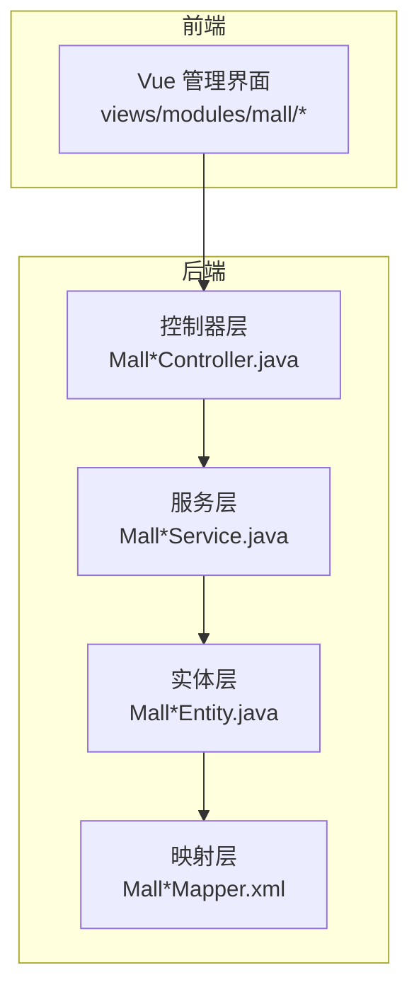
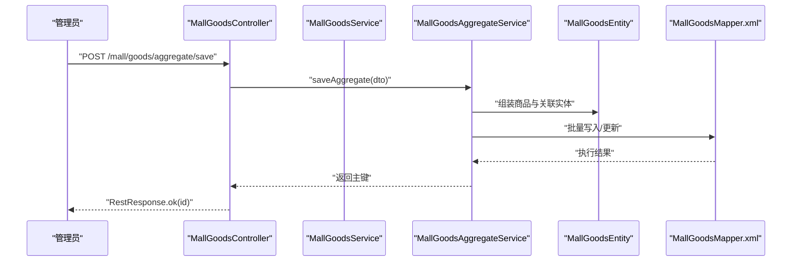
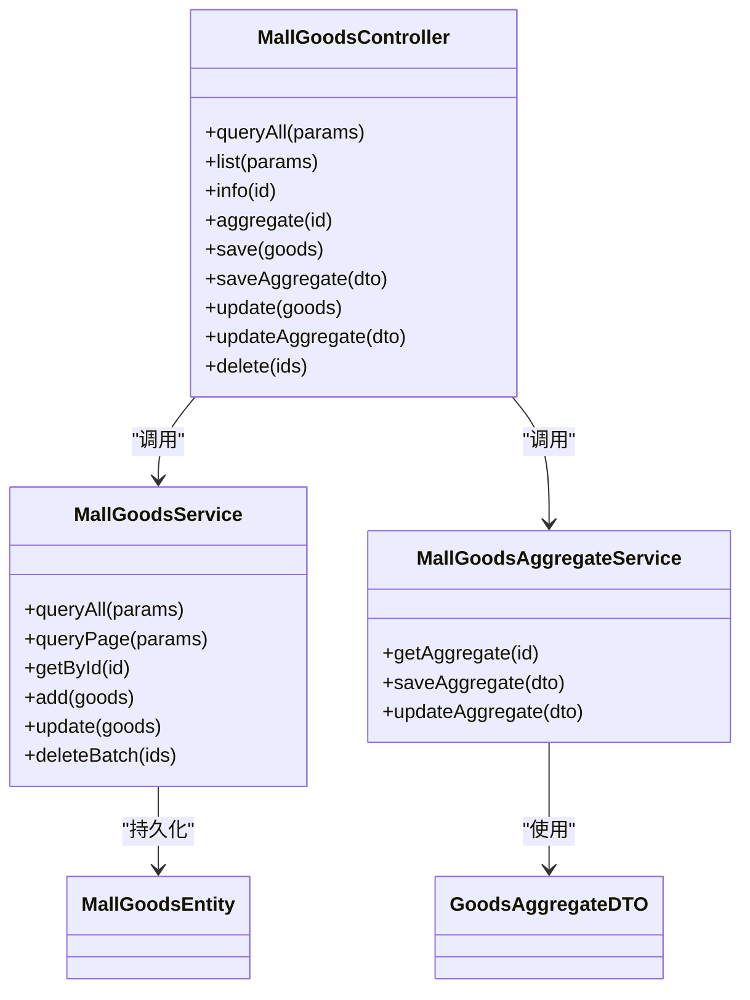
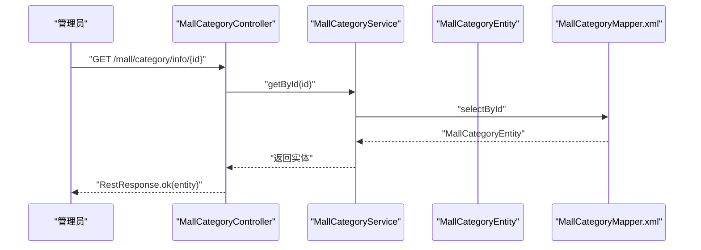
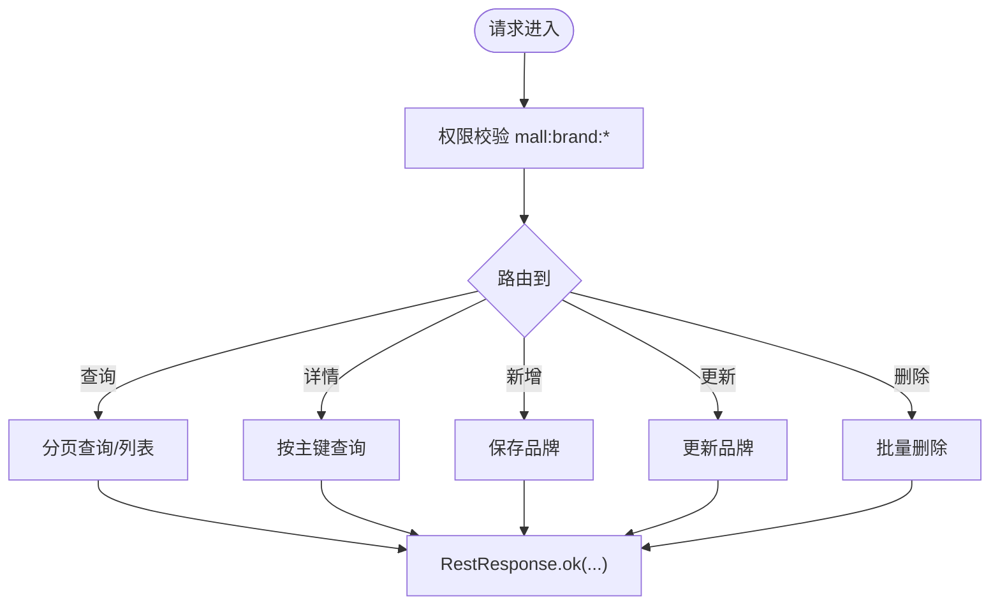
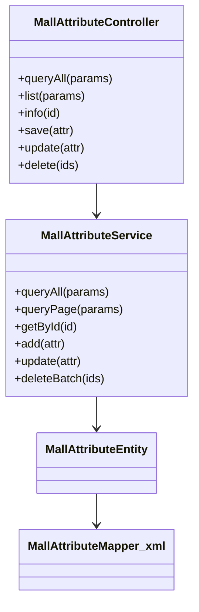
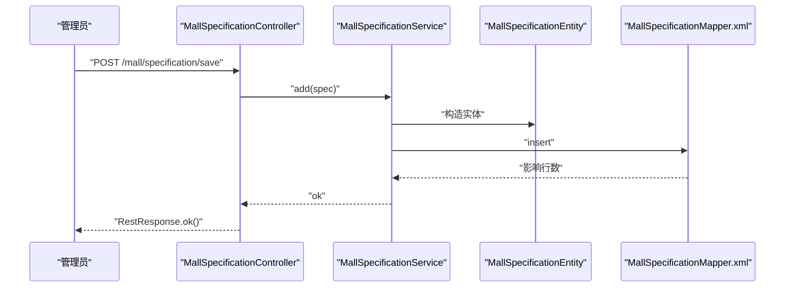
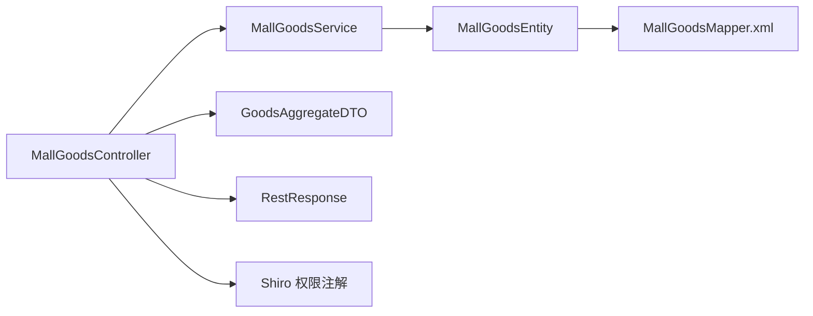

# 商品管理功能

<cite>
**本文引用的文件**
- [MallGoodsController.java](file://platform-admin/src/main/java/com/platform/modules/mall/controller/MallGoodsController.java)
- [MallCategoryController.java](file://platform-admin/src/main/java/com/platform/modules/mall/controller/MallCategoryController.java)
- [MallBrandController.java](file://platform-admin/src/main/java/com/platform/modules/mall/controller/MallBrandController.java)
- [MallAttributeController.java](file://platform-admin/src/main/java/com/platform/modules/mall/controller/MallAttributeController.java)
- [MallSpecificationController.java](file://platform-admin/src/main/java/com/platform/modules/mall/controller/MallSpecificationController.java)
- [GoodsAggregateDTO.java](file://platform-admin/src/main/java/com/platform/modules/mall/dto/GoodsAggregateDTO.java)
- [MallGoodsService.java](file://platform-biz/src/main/java/com/platform/modules/mall/service/MallGoodsService.java)
- [MallGoodsAggregateService.java](file://platform-biz/src/main/java/com/platform/modules/mall/service/MallGoodsAggregateService.java)
- [MallCategoryService.java](file://platform-biz/src/main/java/com/platform/modules/mall/service/MallCategoryService.java)
- [MallBrandService.java](file://platform-biz/src/main/java/com/platform/modules/mall/service/MallBrandService.java)
- [MallAttributeService.java](file://platform-biz/src/main/java/com/platform/modules/mall/service/MallAttributeService.java)
- [MallSpecificationService.java](file://platform-biz/src/main/java/com/platform/modules/mall/service/MallSpecificationService.java)
- [MallGoodsEntity.java](file://platform-biz/src/main/java/com/platform/modules/mall/entity/MallGoodsEntity.java)
- [MallCategoryEntity.java](file://platform-biz/src/main/java/com/platform/modules/mall/entity/MallCategoryEntity.java)
- [MallBrandEntity.java](file://platform-biz/src/main/java/com/platform/modules/mall/entity/MallBrandEntity.java)
- [MallAttributeEntity.java](file://platform-biz/src/main/java/com/platform/modules/mall/entity/MallAttributeEntity.java)
- [MallSpecificationEntity.java](file://platform-biz/src/main/java/com/platform/modules/mall/entity/MallSpecificationEntity.java)
- [MallGoodsGalleryEntity.java](file://platform-biz/src/main/java/com/platform/modules/mall/entity/MallGoodsGalleryEntity.java)
- [MallGoodsIssueEntity.java](file://platform-biz/src/main/java/com/platform/modules/mall/entity/MallGoodsIssueEntity.java)
- [MallGoodsAttributeEntity.java](file://platform-biz/src/main/java/com/platform/modules/mall/entity/MallGoodsAttributeEntity.java)
- [MallGoodsSpecificationEntity.java](file://platform-biz/src/main/java/com/platform/modules/mall/entity/MallGoodsSpecificationEntity.java)
- [MallGoodsMapper.xml](file://platform-biz/src/main/resources/mapper/mall/MallGoodsMapper.xml)
- [MallCategoryMapper.xml](file://platform-biz/src/main/resources/mapper/mall/MallCategoryMapper.xml)
- [MallBrandMapper.xml](file://platform-biz/src/main/resources/mapper/mall/MallBrandMapper.xml)
- [MallAttributeMapper.xml](file://platform-biz/src/main/resources/mapper/mall/MallAttributeMapper.xml)
- [MallSpecificationMapper.xml](file://platform-biz/src/main/resources/mapper/mall/MallSpecificationMapper.xml)
- [MallGoodsGalleryMapper.xml](file://platform-biz/src/main/resources/mapper/mall/MallGoodsGalleryMapper.xml)
- [MallGoodsIssueMapper.xml](file://platform-biz/src/main/resources/mapper/mall/MallGoodsIssueMapper.xml)
- [MallGoodsAttributeMapper.xml](file://platform-biz/src/main/resources/mapper/mall/MallGoodsAttributeMapper.xml)
- [MallGoodsSpecificationMapper.xml](file://platform-biz/src/main/resources/mapper/mall/MallGoodsSpecificationMapper.xml)
- [application.yml](file://platform-admin/src/main/resources/application.yml)
- [RestResponse.java](file://platform-common/src/main/java/com/platform/common/utils/RestResponse.java)
- [BaseController.java](file://platform-admin/src/main/java/com/platform/modules/sys/controller/AbstractController.java)
</cite>

## 目录
1. [简介](#简介)
2. [项目结构](#项目结构)
3. [核心组件](#核心组件)
4. [架构总览](#架构总览)
5. [详细组件分析](#详细组件分析)
6. [依赖分析](#依赖分析)
7. [性能考虑](#性能考虑)
8. [故障排查指南](#故障排查指南)
9. [结论](#结论)
10. [附录](#附录)

## 简介
本文件面向商品运营人员与开发者，系统性梳理平台的商品管理体系，覆盖商品信息管理（基本信息、详情、图片、状态）、商品分类体系（层级、属性、关联）、品牌管理（信息、关联、展示）、商品属性规格管理（属性、规格、SKU、价格策略）等核心能力。文档以代码为依据，结合接口设计、数据模型与业务流程，提供可操作的实现参考。

## 项目结构
平台采用前后端分离架构，商品管理相关功能主要分布在以下层次：
- 控制器层：各模块控制器负责接收请求、鉴权与调用服务层
- 服务层：封装业务逻辑，协调实体与持久化
- 实体与映射：定义数据模型与MyBatis映射
- 前端页面：提供商品、分类、品牌、属性、规格等管理界面

图表来源
- [MallGoodsController.java:1-184](file://platform-admin/src/main/java/com/platform/modules/mall/controller/MallGoodsController.java#L1-L184)
- [MallCategoryController.java:1-149](file://platform-admin/src/main/java/com/platform/modules/mall/controller/MallCategoryController.java#L1-L149)
- [MallBrandController.java:1-149](file://platform-admin/src/main/java/com/platform/modules/mall/controller/MallBrandController.java#L1-L149)
- [MallAttributeController.java:1-149](file://platform-admin/src/main/java/com/platform/modules/mall/controller/MallAttributeController.java#L1-L149)
- [MallSpecificationController.java:1-149](file://platform-admin/src/main/java/com/platform/modules/mall/controller/MallSpecificationController.java#L1-L149)

章节来源
- [MallGoodsController.java:1-184](file://platform-admin/src/main/java/com/platform/modules/mall/controller/MallGoodsController.java#L1-L184)
- [MallCategoryController.java:1-149](file://platform-admin/src/main/java/com/platform/modules/mall/controller/MallCategoryController.java#L1-L149)
- [MallBrandController.java:1-149](file://platform-admin/src/main/java/com/platform/modules/mall/controller/MallBrandController.java#L1-L149)
- [MallAttributeController.java:1-149](file://platform-admin/src/main/java/com/platform/modules/mall/controller/MallAttributeController.java#L1-L149)
- [MallSpecificationController.java:1-149](file://platform-admin/src/main/java/com/platform/modules/mall/controller/MallSpecificationController.java#L1-L149)

## 核心组件
- 商品控制器：提供商品列表、详情、聚合详情、保存、更新、删除等接口；支持分页与权限校验
- 分类控制器：提供分类列表、详情、保存、更新、删除等接口
- 品牌控制器：提供品牌列表、详情、保存、更新、删除等接口
- 属性控制器：提供属性列表、详情、保存、更新、删除等接口
- 规格控制器：提供规格列表、详情、保存、更新、删除等接口
- 聚合DTO：用于商品新增/更新的聚合提交，包含商品基础信息、图片、属性、规格等

章节来源
- [MallGoodsController.java:50-183](file://platform-admin/src/main/java/com/platform/modules/mall/controller/MallGoodsController.java#L50-L183)
- [MallCategoryController.java:48-148](file://platform-admin/src/main/java/com/platform/modules/mall/controller/MallCategoryController.java#L48-L148)
- [MallBrandController.java:48-148](file://platform-admin/src/main/java/com/platform/modules/mall/controller/MallBrandController.java#L48-L148)
- [MallAttributeController.java:48-148](file://platform-admin/src/main/java/com/platform/modules/mall/controller/MallAttributeController.java#L48-L148)
- [MallSpecificationController.java:48-148](file://platform-admin/src/main/java/com/platform/modules/mall/controller/MallSpecificationController.java#L48-L148)
- [GoodsAggregateDTO.java](file://platform-admin/src/main/java/com/platform/modules/mall/dto/GoodsAggregateDTO.java)

## 架构总览
商品管理遵循“控制器-服务-实体-映射”的分层架构，统一通过REST接口对外提供能力，使用Shiro进行权限控制，返回统一的响应包装对象。

图表来源
- [MallGoodsController.java:134-138](file://platform-admin/src/main/java/com/platform/modules/mall/controller/MallGoodsController.java#L134-L138)
- [MallGoodsAggregateService.java](file://platform-biz/src/main/java/com/platform/modules/mall/service/MallGoodsAggregateService.java)
- [MallGoodsMapper.xml](file://platform-biz/src/main/resources/mapper/mall/MallGoodsMapper.xml)

## 详细组件分析

### 商品管理模块
- 功能点
  - 列表与分页：支持按条件查询与分页
  - 详情：支持按主键查询单条记录
  - 聚合详情：一次性返回商品基础信息、图片、属性、规格等聚合数据
  - 新增/更新：支持普通保存与聚合保存，聚合保存会同时处理图片、属性、规格等
  - 删除：支持批量删除
- 接口要点
  - 权限注解：如 mall:goods:list/save/update/delete
  - 统一响应：RestResponse 包装返回
  - 聚合DTO：GoodsAggregateDTO 支持一次提交多实体

图表来源
- [MallGoodsController.java:50-183](file://platform-admin/src/main/java/com/platform/modules/mall/controller/MallGoodsController.java#L50-L183)
- [MallGoodsService.java](file://platform-biz/src/main/java/com/platform/modules/mall/service/MallGoodsService.java)
- [MallGoodsAggregateService.java](file://platform-biz/src/main/java/com/platform/modules/mall/service/MallGoodsAggregateService.java)
- [GoodsAggregateDTO.java](file://platform-admin/src/main/java/com/platform/modules/mall/dto/GoodsAggregateDTO.java)
- [MallGoodsEntity.java](file://platform-biz/src/main/java/com/platform/modules/mall/entity/MallGoodsEntity.java)

章节来源
- [MallGoodsController.java:55-182](file://platform-admin/src/main/java/com/platform/modules/mall/controller/MallGoodsController.java#L55-L182)
- [MallGoodsService.java](file://platform-biz/src/main/java/com/platform/modules/mall/service/MallGoodsService.java)
- [MallGoodsAggregateService.java](file://platform-biz/src/main/java/com/platform/modules/mall/service/MallGoodsAggregateService.java)
- [GoodsAggregateDTO.java](file://platform-admin/src/main/java/com/platform/modules/mall/dto/GoodsAggregateDTO.java)
- [MallGoodsEntity.java](file://platform-biz/src/main/java/com/platform/modules/mall/entity/MallGoodsEntity.java)

### 商品分类模块
- 功能点
  - 列表与分页：支持按条件查询与分页
  - 详情：按主键查询
  - 新增/更新/删除：标准CURD
- 关键特性
  - 支持树形结构（通常由前端渲染）
  - 可与商品建立多对多或一对多关联

图表来源
- [MallCategoryController.java:91-96](file://platform-admin/src/main/java/com/platform/modules/mall/controller/MallCategoryController.java#L91-L96)
- [MallCategoryService.java](file://platform-biz/src/main/java/com/platform/modules/mall/service/MallCategoryService.java)
- [MallCategoryEntity.java](file://platform-biz/src/main/java/com/platform/modules/mall/entity/MallCategoryEntity.java)
- [MallCategoryMapper.xml](file://platform-biz/src/main/resources/mapper/mall/MallCategoryMapper.xml)

章节来源
- [MallCategoryController.java:58-147](file://platform-admin/src/main/java/com/platform/modules/mall/controller/MallCategoryController.java#L58-L147)
- [MallCategoryService.java](file://platform-biz/src/main/java/com/platform/modules/mall/service/MallCategoryService.java)
- [MallCategoryEntity.java](file://platform-biz/src/main/java/com/platform/modules/mall/entity/MallCategoryEntity.java)
- [MallCategoryMapper.xml](file://platform-biz/src/main/resources/mapper/mall/MallCategoryMapper.xml)

### 品牌管理模块
- 功能点
  - 列表与分页：支持按条件查询与分页
  - 详情：按主键查询
  - 新增/更新/删除：标准CURD
- 关联关系
  - 品牌与商品存在一对多或多对多关联，用于筛选与展示

图表来源
- [MallBrandController.java:58-147](file://platform-admin/src/main/java/com/platform/modules/mall/controller/MallBrandController.java#L58-L147)
- [MallBrandService.java](file://platform-biz/src/main/java/com/platform/modules/mall/service/MallBrandService.java)
- [MallBrandEntity.java](file://platform-biz/src/main/java/com/platform/modules/mall/entity/MallBrandEntity.java)
- [MallBrandMapper.xml](file://platform-biz/src/main/resources/mapper/mall/MallBrandMapper.xml)

章节来源
- [MallBrandController.java:58-147](file://platform-admin/src/main/java/com/platform/modules/mall/controller/MallBrandController.java#L58-L147)
- [MallBrandService.java](file://platform-biz/src/main/java/com/platform/modules/mall/service/MallBrandService.java)
- [MallBrandEntity.java](file://platform-biz/src/main/java/com/platform/modules/mall/entity/MallBrandEntity.java)
- [MallBrandMapper.xml](file://platform-biz/src/main/resources/mapper/mall/MallBrandMapper.xml)

### 商品属性模块
- 功能点
  - 列表与分页：支持按条件查询与分页
  - 详情：按主键查询
  - 新增/更新/删除：标准CURD
- 应用场景
  - 定义商品可选属性（如颜色、尺寸），供商品详情页展示与SKU生成使用

图表来源
- [MallAttributeController.java:58-147](file://platform-admin/src/main/java/com/platform/modules/mall/controller/MallAttributeController.java#L58-L147)
- [MallAttributeService.java](file://platform-biz/src/main/java/com/platform/modules/mall/service/MallAttributeService.java)
- [MallAttributeEntity.java](file://platform-biz/src/main/java/com/platform/modules/mall/entity/MallAttributeEntity.java)
- [MallAttributeMapper.xml](file://platform-biz/src/main/resources/mapper/mall/MallAttributeMapper.xml)

章节来源
- [MallAttributeController.java:58-147](file://platform-admin/src/main/java/com/platform/modules/mall/controller/MallAttributeController.java#L58-L147)
- [MallAttributeService.java](file://platform-biz/src/main/java/com/platform/modules/mall/service/MallAttributeService.java)
- [MallAttributeEntity.java](file://platform-biz/src/main/java/com/platform/modules/mall/entity/MallAttributeEntity.java)
- [MallAttributeMapper.xml](file://platform-biz/src/main/resources/mapper/mall/MallAttributeMapper.xml)

### 商品规格模块
- 功能点
  - 列表与分页：支持按条件查询与分页
  - 详情：按主键查询
  - 新增/更新/删除：标准CURD
- 应用场景
  - 定义规格项（如内存容量、网络类型），与属性配合生成SKU与价格策略

图表来源
- [MallSpecificationController.java:107-113](file://platform-admin/src/main/java/com/platform/modules/mall/controller/MallSpecificationController.java#L107-L113)
- [MallSpecificationService.java](file://platform-biz/src/main/java/com/platform/modules/mall/service/MallSpecificationService.java)
- [MallSpecificationEntity.java](file://platform-biz/src/main/java/com/platform/modules/mall/entity/MallSpecificationEntity.java)
- [MallSpecificationMapper.xml](file://platform-biz/src/main/resources/mapper/mall/MallSpecificationMapper.xml)

章节来源
- [MallSpecificationController.java:58-147](file://platform-admin/src/main/java/com/platform/modules/mall/controller/MallSpecificationController.java#L58-L147)
- [MallSpecificationService.java](file://platform-biz/src/main/java/com/platform/modules/mall/service/MallSpecificationService.java)
- [MallSpecificationEntity.java](file://platform-biz/src/main/java/com/platform/modules/mall/entity/MallSpecificationEntity.java)
- [MallSpecificationMapper.xml](file://platform-biz/src/main/resources/mapper/mall/MallSpecificationMapper.xml)

### 商品图片与问题模块
- 商品图片（Gallery）
  - 用于存储商品轮播图、细节图等
  - 支持列表、详情、新增、更新、删除
- 商品常见问题（Issue）
  - 用于FAQ类目，提升转化率与客服效率

章节来源
- [MallGoodsGalleryController.java](file://platform-admin/src/main/java/com/platform/modules/mall/controller/MallGoodsGalleryController.java)
- [MallGoodsIssueController.java](file://platform-admin/src/main/java/com/platform/modules/mall/controller/MallGoodsIssueController.java)
- [MallGoodsGalleryEntity.java](file://platform-biz/src/main/java/com/platform/modules/mall/entity/MallGoodsGalleryEntity.java)
- [MallGoodsIssueEntity.java](file://platform-biz/src/main/java/com/platform/modules/mall/entity/MallGoodsIssueEntity.java)
- [MallGoodsGalleryMapper.xml](file://platform-biz/src/main/resources/mapper/mall/MallGoodsGalleryMapper.xml)
- [MallGoodsIssueMapper.xml](file://platform-biz/src/main/resources/mapper/mall/MallGoodsIssueMapper.xml)

## 依赖分析
- 控制器依赖服务：每个控制器持有对应服务实例，通过依赖注入完成装配
- 服务依赖实体与映射：服务层通过实体与XML映射进行数据库交互
- 统一响应：RestResponse 提供统一的响应结构
- 权限控制：基于Shiro注解进行权限校验
- 配置中心：application.yml 提供运行时配置

图表来源
- [MallGoodsController.java:50-183](file://platform-admin/src/main/java/com/platform/modules/mall/controller/MallGoodsController.java#L50-L183)
- [MallGoodsService.java](file://platform-biz/src/main/java/com/platform/modules/mall/service/MallGoodsService.java)
- [MallGoodsEntity.java](file://platform-biz/src/main/java/com/platform/modules/mall/entity/MallGoodsEntity.java)
- [MallGoodsMapper.xml](file://platform-biz/src/main/resources/mapper/mall/MallGoodsMapper.xml)
- [GoodsAggregateDTO.java](file://platform-admin/src/main/java/com/platform/modules/mall/dto/GoodsAggregateDTO.java)
- [RestResponse.java](file://platform-common/src/main/java/com/platform/common/utils/RestResponse.java)
- [application.yml](file://platform-admin/src/main/resources/application.yml)

章节来源
- [MallGoodsController.java:50-183](file://platform-admin/src/main/java/com/platform/modules/mall/controller/MallGoodsController.java#L50-L183)
- [RestResponse.java](file://platform-common/src/main/java/com/platform/common/utils/RestResponse.java)
- [application.yml](file://platform-admin/src/main/resources/application.yml)

## 性能考虑
- 分页查询：优先使用分页接口，避免一次性加载大量数据
- 聚合保存：通过聚合DTO减少多次往返，降低网络开销
- 缓存策略：对分类、品牌等静态数据可引入缓存，减少数据库压力
- 批量删除：使用批量接口进行删除，减少事务次数
- 图片上传：建议使用CDN与缩略图策略，优化前端加载速度

## 故障排查指南
- 权限不足
  - 现象：接口返回未授权
  - 处理：确认用户是否具备 mall:goods:list/save/update/delete 等权限
- 参数错误
  - 现象：接口报错或返回空数据
  - 处理：检查请求参数格式与必填字段
- 数据不一致
  - 现象：聚合保存后部分数据未生效
  - 处理：核对 GoodsAggregateDTO 字段映射与服务层事务边界
- 响应异常
  - 现象：返回非预期结构
  - 处理：确认 RestResponse 使用方式与全局异常处理

章节来源
- [MallGoodsController.java:61-68](file://platform-admin/src/main/java/com/platform/modules/mall/controller/MallGoodsController.java#L61-L68)
- [MallGoodsController.java:120-127](file://platform-admin/src/main/java/com/platform/modules/mall/controller/MallGoodsController.java#L120-L127)
- [MallGoodsController.java:148-155](file://platform-admin/src/main/java/com/platform/modules/mall/controller/MallGoodsController.java#L148-L155)
- [MallGoodsController.java:176-182](file://platform-admin/src/main/java/com/platform/modules/mall/controller/MallGoodsController.java#L176-L182)

## 结论
该商品管理模块以清晰的分层架构实现了从商品、分类、品牌到属性与规格的全链路管理能力。通过聚合保存与统一响应，提升了开发效率与用户体验。建议在实际部署中完善缓存与CDN策略，并持续优化权限与日志体系。

## 附录
- 常用接口清单
  - 商品：GET/POST /mall/goods/list, GET /mall/goods/info/{id}, POST /mall/goods/save, POST /mall/goods/update, POST /mall/goods/delete
  - 聚合：POST /mall/goods/aggregate/save, POST /mall/goods/aggregate/update
  - 分类：GET/POST /mall/category/*
  - 品牌：GET/POST /mall/brand/*
  - 属性：GET/POST /mall/attribute/*
  - 规格：GET/POST /mall/specification/*