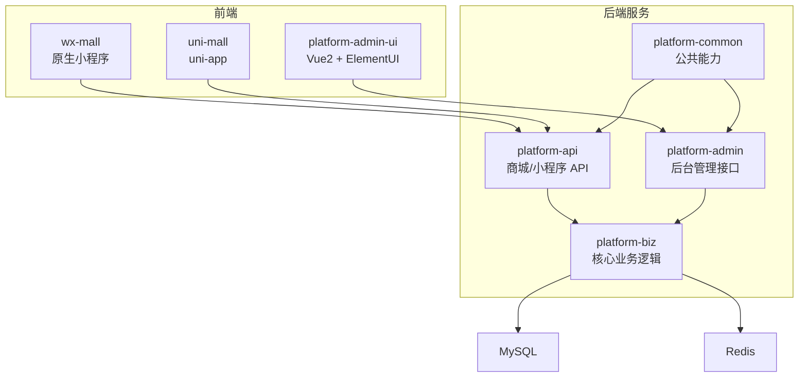
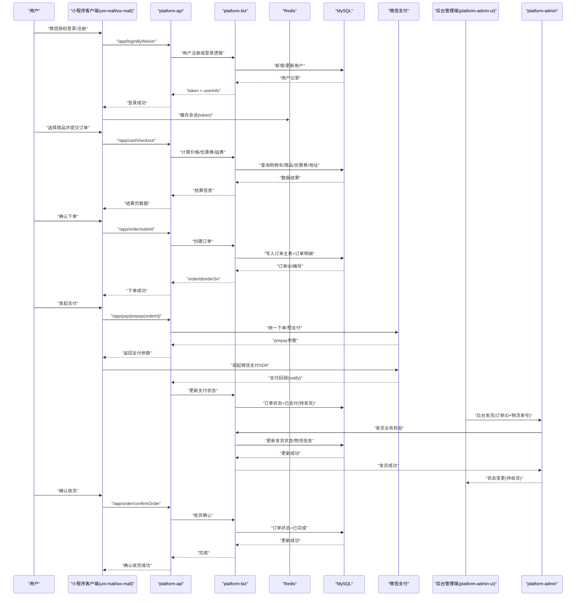
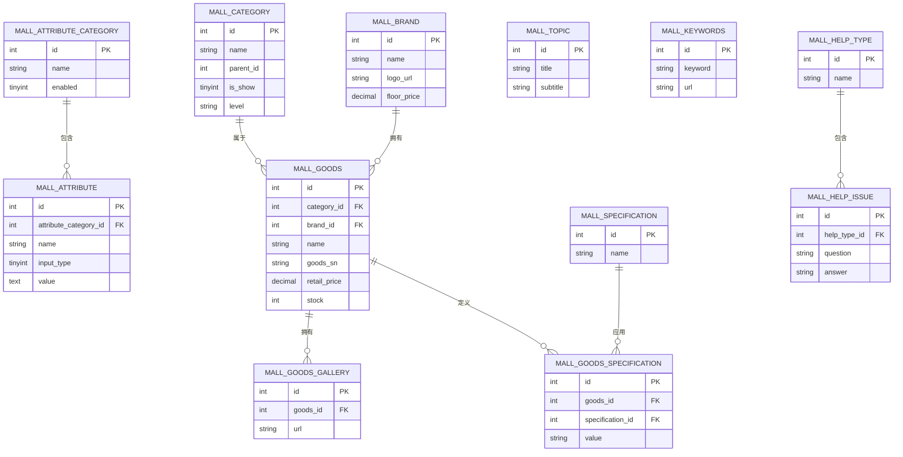
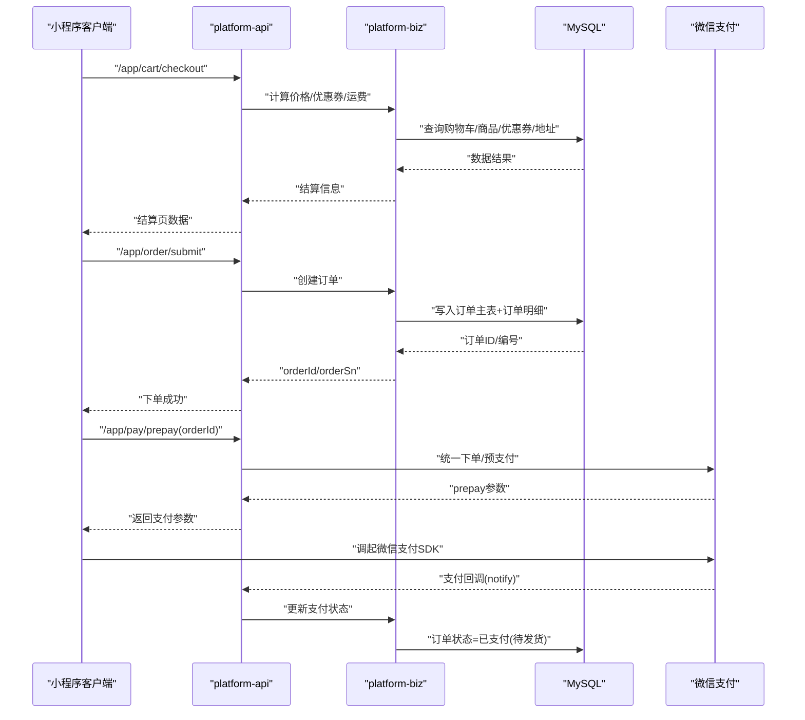
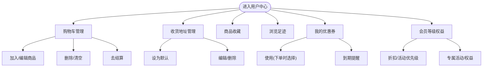
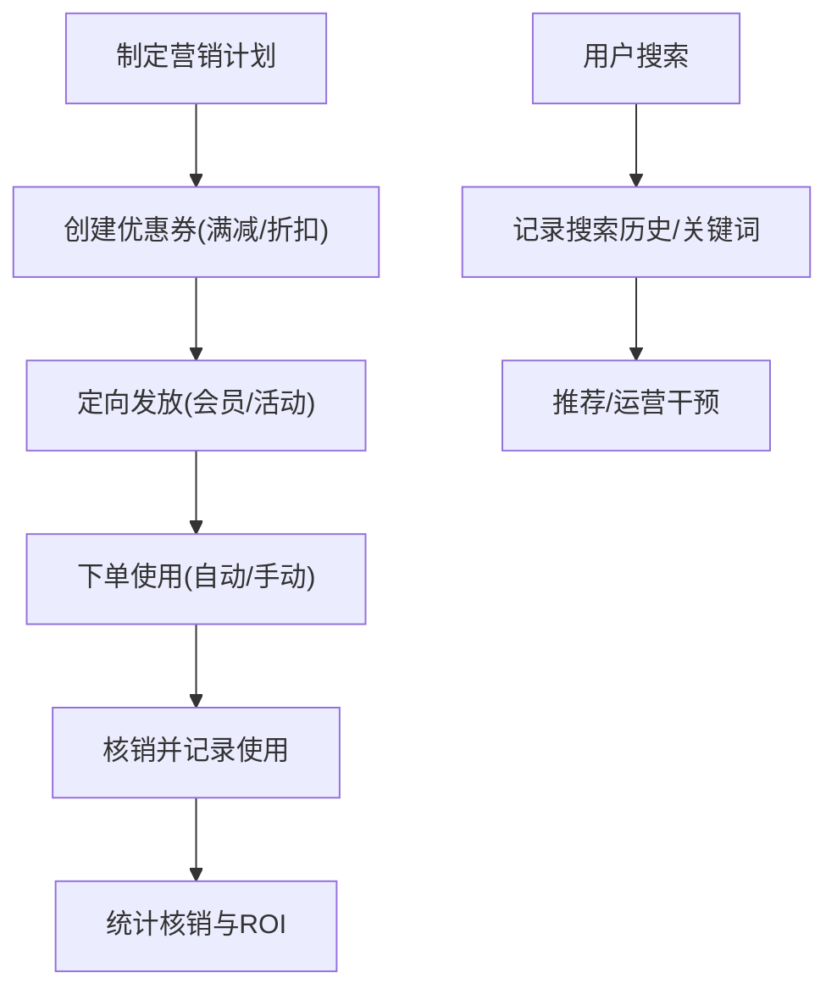
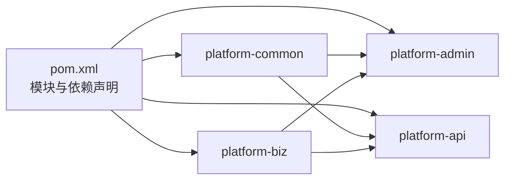

# 商城业务模块

<cite>
**本文引用的文件**
- [PlatformAdminApplication.java](file://platform-admin/src/main/java/com/platform/PlatformAdminApplication.java)
- [PlatformApiApplication.java](file://platform-api/src/main/java/com/platform/PlatformApiApplication.java)
- [pom.xml](file://pom.xml)
- [mall.sql](file://_sql/mall.sql)
- [MallGoodsService.java](file://platform-biz/src/main/java/com/platform/modules/mall/service/MallGoodsService.java)
- [MallOrderService.java](file://platform-biz/src/main/java/com/platform/modules/mall/service/MallOrderService.java)
- [MallCartService.java](file://platform-biz/src/main/java/com/platform/modules/mall/service/MallCartService.java)
- [MallCouponService.java](file://platform-biz/src/main/java/com/platform/modules/mall/service/MallCouponService.java)
- [时序架构图.mmd](file://docs/时序架构图.mmd)
- [Agents.md](file://Agents.md)
</cite>

## 目录
1. [简介](#简介)
2. [项目结构](#项目结构)
3. [核心组件](#核心组件)
4. [架构总览](#架构总览)
5. [详细组件分析](#详细组件分析)
6. [依赖分析](#依赖分析)
7. [性能考虑](#性能考虑)
8. [故障排查指南](#故障排查指南)
9. [结论](#结论)
10. [附录](#附录)

## 简介
本文件面向产品经理、业务分析师与开发者，系统性梳理平台的商城业务模块，覆盖商品管理、订单处理、用户体系、营销活动等核心业务域。文档基于实际代码与数据库结构，提供业务流程、数据模型与接口设计的参考，帮助快速理解与落地实现。

## 项目结构
平台采用多模块分层架构：
- platform-admin：后台管理接口服务
- platform-api：商城/小程序 API 服务
- platform-biz：核心业务逻辑、Service、DAO、MyBatis Mapper
- platform-common：公共配置、工具、缓存与通用能力
- 平台前端：platform-admin-ui（Vue2 + ElementUI）、wx-mall（原生小程序）、uni-mall（uni-app）

图表来源
- [pom.xml:42-47](file://pom.xml#L42-L47)
- [PlatformAdminApplication.java:49-51](file://platform-admin/src/main/java/com/platform/PlatformAdminApplication.java#L49-L51)
- [PlatformApiApplication.java:49-51](file://platform-api/src/main/java/com/platform/PlatformApiApplication.java#L49-L51)

章节来源
- [pom.xml:42-47](file://pom.xml#L42-L47)
- [Agents.md:15-26](file://Agents.md#L15-L26)

## 核心组件
- 商品管理：商品、分类、品牌、属性与规格、相册、专题等
- 订单处理：下单、支付、发货、售后闭环
- 用户体系：购物车、收货地址、收藏、足迹、优惠券、会员等级
- 营销活动：优惠券、关键词、搜索历史、帮助与反馈

章节来源
- [mall.sql:1-800](file://_sql/mall.sql#L1-L800)
- [MallGoodsService.java:29-98](file://platform-biz/src/main/java/com/platform/modules/mall/service/MallGoodsService.java#L29-L98)
- [MallOrderService.java:31-101](file://platform-biz/src/main/java/com/platform/modules/mall/service/MallOrderService.java#L31-L101)
- [MallCartService.java:29-98](file://platform-biz/src/main/java/com/platform/modules/mall/service/MallCartService.java#L29-L98)
- [MallCouponService.java:29-96](file://platform-biz/src/main/java/com/platform/modules/mall/service/MallCouponService.java#L29-L96)

## 架构总览
系统采用“前端小程序/管理端 + API 层 + 业务层 + 数据持久化”的分层设计。支付通过微信支付通道完成，后台管理端负责订单发货与运营配置。

图表来源
- [时序架构图.mmd:1-64](file://docs/时序架构图.mmd#L1-L64)

章节来源
- [时序架构图.mmd:1-64](file://docs/时序架构图.mmd#L1-L64)

## 详细组件分析

### 商品管理模块
- 功能范围：商品信息维护、分类树形结构、品牌管理、属性与规格、相册、专题、关键词、帮助与反馈
- 关键实体：商品、分类、品牌、属性、规格、相册、专题、关键词、帮助类型/问题
- 业务要点：
  - 分类支持层级结构与展示控制
  - 属性与规格用于差异化定价与库存管理
  - 相册与详情富文本支撑商品展示
  - 专题聚合与关键词检索提升曝光

图表来源
- [mall.sql:1-800](file://_sql/mall.sql#L1-L800)

章节来源
- [mall.sql:1-800](file://_sql/mall.sql#L1-L800)
- [MallGoodsService.java:29-98](file://platform-biz/src/main/java/com/platform/modules/mall/service/MallGoodsService.java#L29-L98)

### 订单处理模块
- 功能范围：下单、支付、发货、收货、售后
- 关键实体：订单、订单商品、物流与支付信息
- 业务要点：
  - 结算页聚合购物车、优惠券、地址与运费
  - 支付通过微信支付通道完成，回调更新订单状态
  - 后台管理端录入物流单号并更新状态

图表来源
- [时序架构图.mmd:22-47](file://docs/时序架构图.mmd#L22-L47)

章节来源
- [MallOrderService.java:31-101](file://platform-biz/src/main/java/com/platform/modules/mall/service/MallOrderService.java#L31-L101)
- [时序架构图.mmd:22-47](file://docs/时序架构图.mmd#L22-L47)

### 用户体系模块
- 功能范围：购物车、收货地址、收藏、足迹、优惠券、会员等级
- 关键实体：购物车、地址、收藏、足迹、优惠券、用户优惠券、会员等级
- 业务要点：
  - 购物车支持勾选、数量变更与按用户/产品清理
  - 收货地址支持默认项设置
  - 优惠券与会员等级联动影响折扣策略

图表来源
- [mall.sql:40-120](file://_sql/mall.sql#L40-L120)
- [MallCartService.java:29-98](file://platform-biz/src/main/java/com/platform/modules/mall/service/MallCartService.java#L29-L98)

章节来源
- [mall.sql:40-120](file://_sql/mall.sql#L40-L120)
- [MallCartService.java:29-98](file://platform-biz/src/main/java/com/platform/modules/mall/service/MallCartService.java#L29-L98)

### 营销活动模块
- 功能范围：优惠券发放与核销、促销活动、搜索历史、关键词、帮助与反馈
- 关键实体：优惠券、用户优惠券、关键词、搜索历史、帮助类型/问题
- 业务要点：
  - 优惠券按用户维度发放与核销
  - 搜索历史与关键词辅助推荐与运营

图表来源
- [mall.sql:1-800](file://_sql/mall.sql#L1-L800)
- [MallCouponService.java:29-96](file://platform-biz/src/main/java/com/platform/modules/mall/service/MallCouponService.java#L29-L96)

章节来源
- [mall.sql:1-800](file://_sql/mall.sql#L1-L800)
- [MallCouponService.java:29-96](file://platform-biz/src/main/java/com/platform/modules/mall/service/MallCouponService.java#L29-L96)

## 依赖分析
- 模块依赖：多模块聚合构建，API/BIZ/Admin 通过 common 提供的缓存、工具与配置协同
- 外部依赖：MySQL、Redis、微信支付 SDK、Knife4j 文档、Shiro 权限、JJWT 鉴权等

图表来源
- [pom.xml:42-47](file://pom.xml#L42-L47)

章节来源
- [pom.xml:42-47](file://pom.xml#L42-L47)

## 性能考虑
- 缓存策略：利用 Redis 缓存会话、热点数据与接口结果，降低数据库压力
- 分页与索引：订单、商品、优惠券等高频查询需合理分页与索引设计
- 异步处理：支付回调、发货通知等可异步处理，避免阻塞主流程
- 读写分离：高并发场景建议引入读写分离与连接池优化

## 故障排查指南
- 登录/会话异常：检查 Redis 会话是否正常、token 生成与校验逻辑
- 下单失败：核对购物车、库存、价格计算与优惠券可用性
- 支付回调：确认回调地址、签名验证与幂等处理
- 发货异常：核对订单状态流转、物流信息与后台校验逻辑
- 数据一致性：关注事务边界与分布式锁使用

章节来源
- [Agents.md:139-182](file://Agents.md#L139-L182)

## 结论
本模块以清晰的分层与模块划分支撑了完整的电商闭环：从前端交互到 API、业务、数据与支付通道。围绕商品、订单、用户与营销四大领域，提供了可扩展的数据模型与流程设计，便于持续迭代与业务创新。

## 附录
- 快速定位建议：
  - 后台管理：platform-admin
  - 商城接口：platform-api
  - 业务逻辑：platform-biz
  - 数据问题优先查看 DAO 与 XML Mapper
  - 配置与缓存：platform-common

章节来源
- [Agents.md:28-34](file://Agents.md#L28-L34)
- [Agents.md:145-162](file://Agents.md#L145-L162)