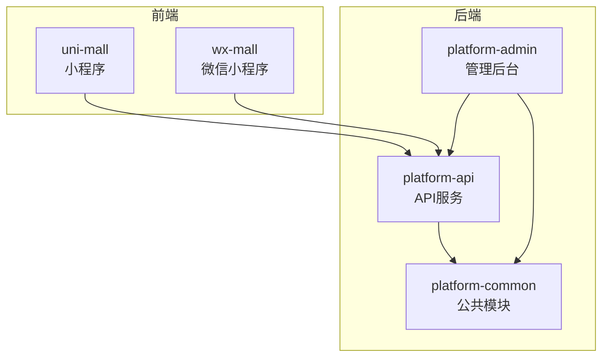
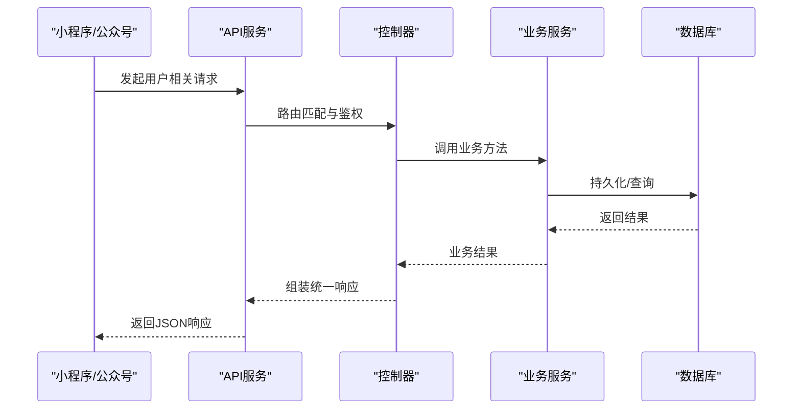
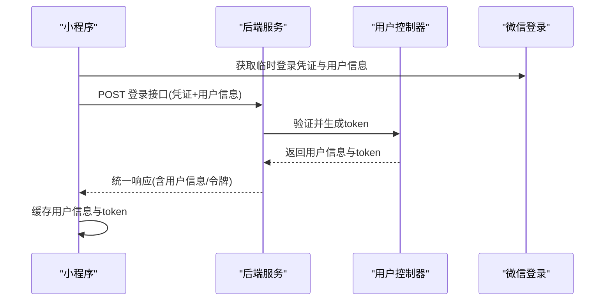
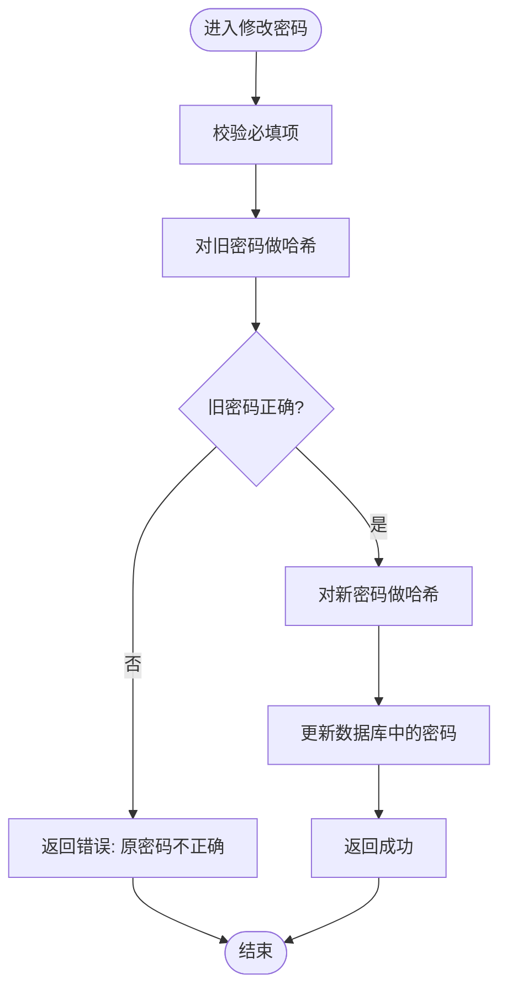
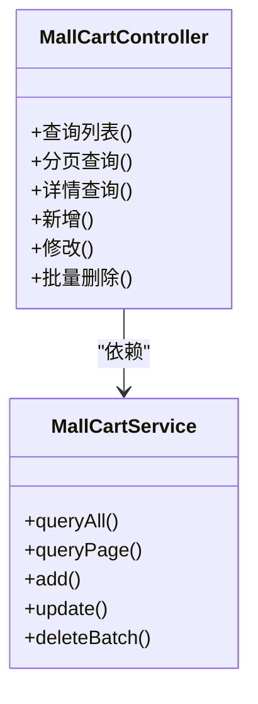
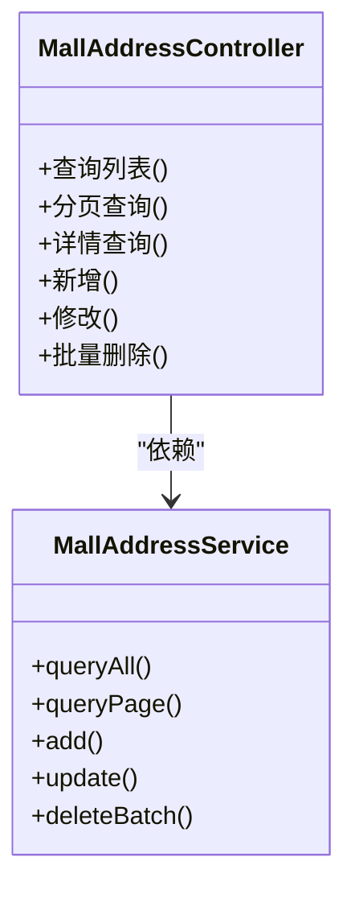
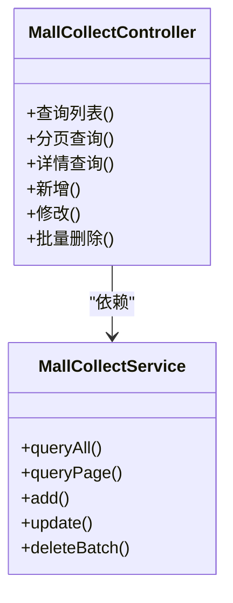
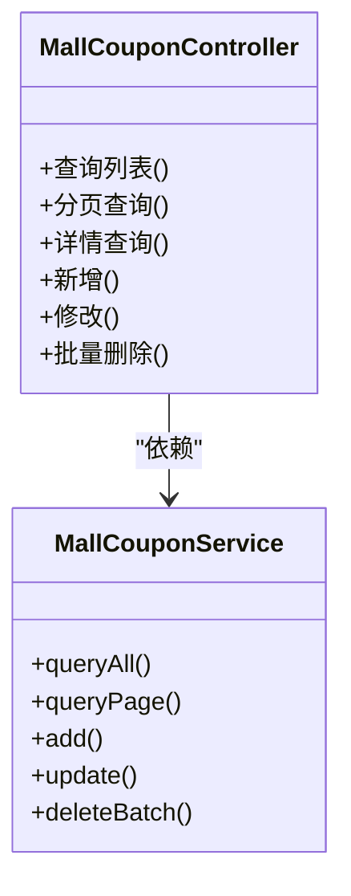
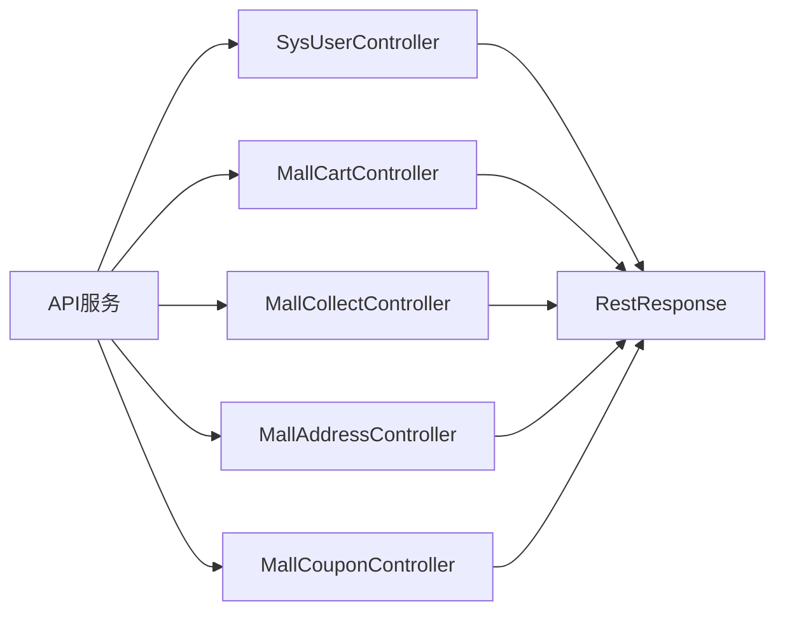

# 用户管理体系

<cite>
**本文引用的文件**
- [PlatformAdminApplication.java](file://platform-admin/src/main/java/com/platform/PlatformAdminApplication.java)
- [PlatformApiApplication.java](file://platform-api/src/main/java/com/platform/PlatformApiApplication.java)
- [RestResponse.java](file://platform-common/src/main/java/com/platform/common/utils/RestResponse.java)
- [SysUserController.java](file://platform-admin/src/main/java/com/platform/modules/sys/controller/SysUserController.java)
- [MallCartController.java](file://platform-admin/src/main/java/com/platform/modules/mall/controller/MallCartController.java)
- [MallCollectController.java](file://platform-admin/src/main/java/com/platform/modules/mall/controller/MallCollectController.java)
- [MallAddressController.java](file://platform-admin/src/main/java/com/platform/modules/mall/controller/MallAddressController.java)
- [MallCouponController.java](file://platform-admin/src/main/java/com/platform/modules/mall/controller/MallCouponController.java)
- [api.js](file://uni-mall/utils/api.js)
- [user.js](file://wx-mall/services/user.js)
- [index.js](file://wx-mall/pages/ucenter/index/index.js)
</cite>

## 目录
1. [简介](#简介)
2. [项目结构](#项目结构)
3. [核心组件](#核心组件)
4. [架构总览](#架构总览)
5. [详细组件分析](#详细组件分析)
6. [依赖分析](#依赖分析)
7. [性能考虑](#性能考虑)
8. [故障排查指南](#故障排查指南)
9. [结论](#结论)
10. [附录](#附录)

## 简介
本文件面向用户运营与开发者，系统化梳理平台的用户管理体系，覆盖以下能力域：
- 用户身份与安全：注册登录、个人信息维护、密码管理、账户安全
- 购物车管理：添加商品、数量修改、删除商品、购物车合并
- 收货地址管理：地址增删改、默认地址设置、地区联动
- 收藏功能：商品收藏、店铺收藏、收藏列表管理
- 优惠券管理：优惠券领取、使用记录、过期管理
- 用户足迹：浏览记录、搜索历史、商品访问追踪

文档以“前端小程序/公众号 + 后端API + 管理后台”三层结构为主线，结合控制器、服务层与通用响应模型，给出端到端流程与实现要点。

## 项目结构
平台采用多模块分层架构：
- 平台启动器：分别提供管理后台与API服务的启动入口
- 公共模块：统一响应体、工具类、配置与拦截器
- 业务模块：mall与sys两大域，分别承载商城业务与系统管理
- 前端工程：uni-app小程序与微信小程序两套UI，提供用户中心与业务交互

图表来源
- [PlatformApiApplication.java:1-92](file://platform-api/src/main/java/com/platform/PlatformApiApplication.java#L1-L92)
- [PlatformAdminApplication.java:1-93](file://platform-admin/src/main/java/com/platform/PlatformAdminApplication.java#L1-L93)

章节来源
- [PlatformApiApplication.java:1-92](file://platform-api/src/main/java/com/platform/PlatformApiApplication.java#L1-L92)
- [PlatformAdminApplication.java:1-93](file://platform-admin/src/main/java/com/platform/PlatformAdminApplication.java#L1-L93)

## 核心组件
- 统一响应模型：封装success/code/msg/data/timestamp，规范前后端交互契约
- 控制器层：按业务域划分REST接口，提供分页查询、新增/修改/删除、详情查询等标准能力
- 业务服务：围绕用户相关实体（购物车、收藏、地址、优惠券）提供CRUD与聚合查询
- 前端服务：封装登录态校验、微信登录、用户信息拉取与本地缓存

章节来源
- [RestResponse.java:1-122](file://platform-common/src/main/java/com/platform/common/utils/RestResponse.java#L1-L122)
- [SysUserController.java:1-243](file://platform-admin/src/main/java/com/platform/modules/sys/controller/SysUserController.java#L1-L243)
- [MallCartController.java:1-149](file://platform-admin/src/main/java/com/platform/modules/mall/controller/MallCartController.java#L1-L149)
- [MallCollectController.java:1-149](file://platform-admin/src/main/java/com/platform/modules/mall/controller/MallCollectController.java#L1-L149)
- [MallAddressController.java:1-149](file://platform-admin/src/main/java/com/platform/modules/mall/controller/MallAddressController.java#L1-L149)
- [MallCouponController.java:1-149](file://platform-admin/src/main/java/com/platform/modules/mall/controller/MallCouponController.java#L1-L149)

## 架构总览
用户相关功能由前端触发请求，经API网关/控制器进入服务层，持久化至数据库；管理后台提供运营侧的查询与批量操作。

图表来源
- [PlatformApiApplication.java:1-92](file://platform-api/src/main/java/com/platform/PlatformApiApplication.java#L1-L92)
- [RestResponse.java:1-122](file://platform-common/src/main/java/com/platform/common/utils/RestResponse.java#L1-L122)

## 详细组件分析

### 用户注册登录与个人信息
- 登录流程
  - 小程序通过微信授权获取用户信息，调用后端登录接口换取token与用户信息
  - 登录成功后，前端将用户信息与token写入本地缓存，后续请求携带token进行鉴权
- 个人信息维护
  - 管理后台提供用户列表、详情、修改、重置密码等能力
  - 前端用户中心展示头像、昵称等基础资料，支持刷新与登出

图表来源
- [user.js:1-74](file://wx-mall/services/user.js#L1-L74)
- [api.js:13](file://uni-mall/utils/api.js#L13)
- [index.js:50-100](file://wx-mall/pages/ucenter/index/index.js#L50-L100)

章节来源
- [user.js:1-74](file://wx-mall/services/user.js#L1-L74)
- [api.js:13](file://uni-mall/utils/api.js#L13)
- [index.js:50-100](file://wx-mall/pages/ucenter/index/index.js#L50-L100)

### 密码管理与账户安全
- 管理后台提供修改密码接口，校验原密码与新密码，采用哈希算法加密后更新
- 登录态校验：前端检查本地token与session有效性，确保会话安全

图表来源
- [SysUserController.java:110-128](file://platform-admin/src/main/java/com/platform/modules/sys/controller/SysUserController.java#L110-L128)

章节来源
- [SysUserController.java:110-128](file://platform-admin/src/main/java/com/platform/modules/sys/controller/SysUserController.java#L110-L128)
- [user.js:43-57](file://wx-mall/services/user.js#L43-L57)

### 购物车管理
- 接口能力
  - 分页查询、详情查询、新增、修改、批量删除
  - 前端常用：添加商品、更新数量、勾选、删除、下单前快照
- 数据模型
  - 控制器与服务层围绕购物车实体提供标准CRUD与分页查询

图表来源
- [MallCartController.java:1-149](file://platform-admin/src/main/java/com/platform/modules/mall/controller/MallCartController.java#L1-L149)

章节来源
- [MallCartController.java:1-149](file://platform-admin/src/main/java/com/platform/modules/mall/controller/MallCartController.java#L1-L149)
- [api.js:26-33](file://uni-mall/utils/api.js#L26-L33)

### 收货地址管理
- 接口能力
  - 列表/详情/新增/修改/批量删除
  - 前端常用：列表、详情、保存、删除、地区联动
- 运营能力
  - 管理后台支持地址维度的查询与批量维护

图表来源
- [MallAddressController.java:1-149](file://platform-admin/src/main/java/com/platform/modules/mall/controller/MallAddressController.java#L1-L149)

章节来源
- [MallAddressController.java:1-149](file://platform-admin/src/main/java/com/platform/modules/mall/controller/MallAddressController.java#L1-L149)
- [api.js:53-58](file://uni-mall/utils/api.js#L53-L58)

### 收藏功能
- 接口能力
  - 列表/详情/新增/修改/批量删除
  - 前端常用：收藏列表、添加或取消收藏
- 运营能力
  - 管理后台支持收藏维度的查询与批量维护

图表来源
- [MallCollectController.java:1-149](file://platform-admin/src/main/java/com/platform/modules/mall/controller/MallCollectController.java#L1-L149)

章节来源
- [MallCollectController.java:1-149](file://platform-admin/src/main/java/com/platform/modules/mall/controller/MallCollectController.java#L1-L149)
- [api.js:38-39](file://uni-mall/utils/api.js#L38-L39)

### 优惠券使用管理
- 接口能力
  - 列表/详情/新增/修改/批量删除
  - 前端常用：优惠券列表、商品可用券查询
- 运营能力
  - 管理后台支持优惠券维度的查询与批量维护

图表来源
- [MallCouponController.java:1-149](file://platform-admin/src/main/java/com/platform/modules/mall/controller/MallCouponController.java#L1-L149)

章节来源
- [MallCouponController.java:1-149](file://platform-admin/src/main/java/com/platform/modules/mall/controller/MallCouponController.java#L1-L149)
- [api.js:74-75](file://uni-mall/utils/api.js#L74-L75)

### 用户足迹追踪
- 接口能力
  - 列表/删除
  - 前端常用：足迹列表、清空足迹
- 运营能力
  - 管理后台支持足迹维度的查询与批量维护

章节来源
- [api.js:65-66](file://uni-mall/utils/api.js#L65-L66)

## 依赖分析
- 统一响应模型
  - 所有控制器返回值均包装为统一响应体，便于前端一致处理与错误收敛
- 控制器与服务层
  - 控制器负责路由、鉴权与参数校验，服务层负责业务逻辑与数据访问
- 前后端约定
  - 前端通过api.js集中定义接口路径，后端控制器按路径映射提供服务

图表来源
- [RestResponse.java:1-122](file://platform-common/src/main/java/com/platform/common/utils/RestResponse.java#L1-L122)
- [SysUserController.java:1-243](file://platform-admin/src/main/java/com/platform/modules/sys/controller/SysUserController.java#L1-L243)
- [MallCartController.java:1-149](file://platform-admin/src/main/java/com/platform/modules/mall/controller/MallCartController.java#L1-L149)
- [MallCollectController.java:1-149](file://platform-admin/src/main/java/com/platform/modules/mall/controller/MallCollectController.java#L1-L149)
- [MallAddressController.java:1-149](file://platform-admin/src/main/java/com/platform/modules/mall/controller/MallAddressController.java#L1-L149)
- [MallCouponController.java:1-149](file://platform-admin/src/main/java/com/platform/modules/mall/controller/MallCouponController.java#L1-L149)

## 性能考虑
- 统一响应体：减少前端分支判断，提升跨端一致性与可维护性
- 分页查询：对用户相关列表接口建议使用分页，避免一次性加载大量数据
- 缓存策略：前端对用户信息与token进行本地缓存，降低重复登录成本
- 接口幂等：对修改类接口建议引入幂等控制，防止重复提交造成状态不一致

## 故障排查指南
- 登录失败
  - 检查前端是否正确传递临时登录凭证与用户信息
  - 核对后端登录接口返回的token与用户信息是否写入本地缓存
- 修改密码失败
  - 确认旧密码校验是否通过
  - 检查哈希算法与盐值是否一致
- 购物车/收藏/地址/优惠券异常
  - 使用管理后台的列表/详情接口核对数据状态
  - 关注统一响应体中的code与msg字段定位问题

章节来源
- [user.js:11-38](file://wx-mall/services/user.js#L11-L38)
- [SysUserController.java:110-128](file://platform-admin/src/main/java/com/platform/modules/sys/controller/SysUserController.java#L110-L128)
- [RestResponse.java:1-122](file://platform-common/src/main/java/com/platform/common/utils/RestResponse.java#L1-L122)

## 结论
本用户管理体系以统一响应体与标准化控制器为核心，覆盖从登录认证到购物车、收藏、地址、优惠券与足迹的全链路能力。通过管理后台提供的查询与批量维护能力，配合前端的本地缓存与会话校验，形成稳定高效的用户运营支撑体系。

## 附录
- 前端接口清单（节选）
  - 登录：auth/LoginByMa
  - 购物车：cart/index/add/update/delete/checked/goodscount/checkout
  - 收藏：collect/list/addordelete
  - 地址：address/list/detail/save/delete
  - 优惠券：coupon/list/listByGoods
  - 足迹：footprint/list/delete

章节来源
- [api.js:13-79](file://uni-mall/utils/api.js#L13-L79)