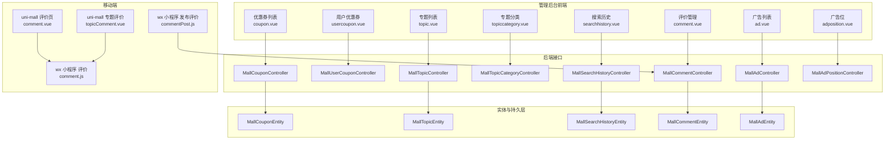
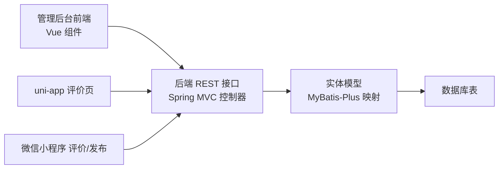
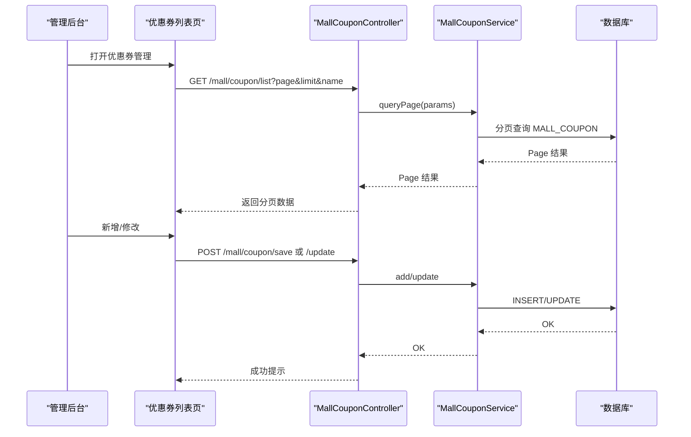
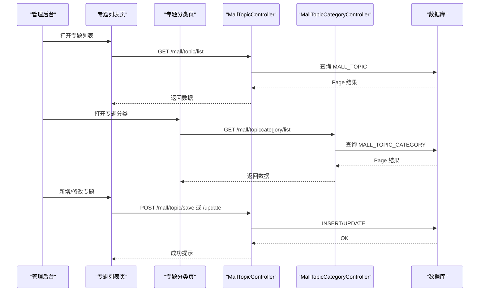
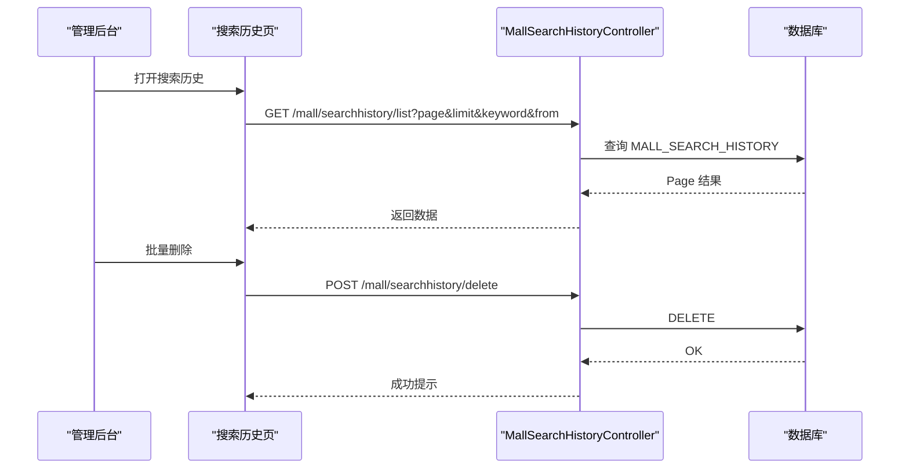
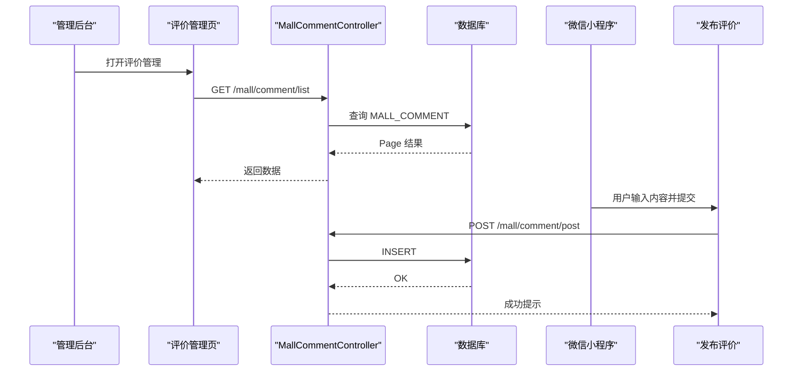
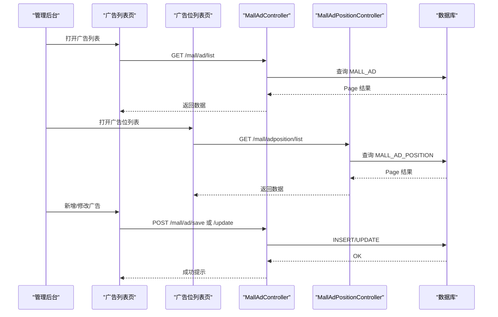
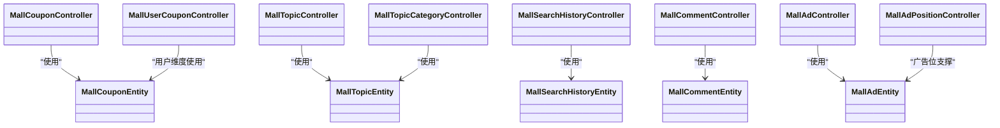
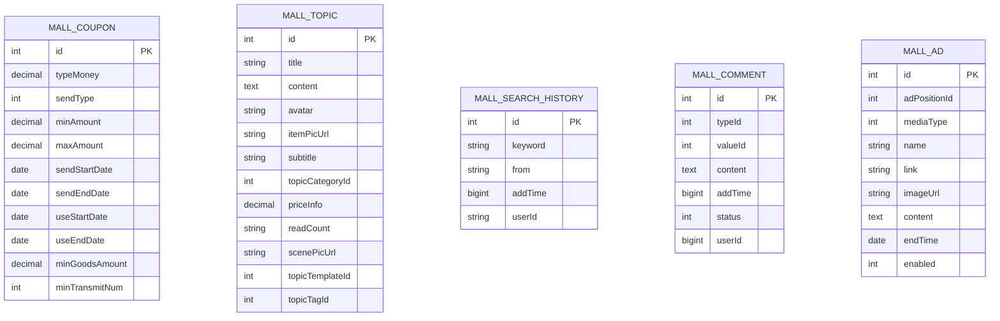

# 营销活动系统

<cite>
**本文引用的文件**
- [platform-admin/src/main/java/com/platform/modules/mall/controller/MallCouponController.java](file://platform-admin/src/main/java/com/platform/modules/mall/controller/MallCouponController.java)
- [platform-admin/src/main/java/com/platform/modules/mall/controller/MallUserCouponController.java](file://platform-admin/src/main/java/com/platform/modules/mall/controller/MallUserCouponController.java)
- [platform-admin/src/main/java/com/platform/modules/mall/controller/MallTopicController.java](file://platform-admin/src/main/java/com/platform/modules/mall/controller/MallTopicController.java)
- [platform-admin/src/main/java/com/platform/modules/mall/controller/MallTopicCategoryController.java](file://platform-admin/src/main/java/com/platform/modules/mall/controller/MallTopicCategoryController.java)
- [platform-admin/src/main/java/com/platform/modules/mall/controller/MallSearchHistoryController.java](file://platform-admin/src/main/java/com/platform/modules/mall/controller/MallSearchHistoryController.java)
- [platform-admin/src/main/java/com/platform/modules/mall/controller/MallCommentController.java](file://platform-admin/src/main/java/com/platform/modules/mall/controller/MallCommentController.java)
- [platform-admin/src/main/java/com/platform/modules/mall/controller/MallAdController.java](file://platform-admin/src/main/java/com/platform/modules/mall/controller/MallAdController.java)
- [platform-admin/src/main/java/com/platform/modules/mall/controller/MallAdPositionController.java](file://platform-admin/src/main/java/com/platform/modules/mall/controller/MallAdPositionController.java)
- [platform-biz/src/main/java/com/platform/modules/mall/entity/MallCouponEntity.java](file://platform-biz/src/main/java/com/platform/modules/mall/entity/MallCouponEntity.java)
- [platform-biz/src/main/java/com/platform/modules/mall/entity/MallTopicEntity.java](file://platform-biz/src/main/java/com/platform/modules/mall/entity/MallTopicEntity.java)
- [platform-biz/src/main/java/com/platform/modules/mall/entity/MallSearchHistoryEntity.java](file://platform-biz/src/main/java/com/platform/modules/mall/entity/MallSearchHistoryEntity.java)
- [platform-biz/src/main/java/com/platform/modules/mall/entity/MallCommentEntity.java](file://platform-biz/src/main/java/com/platform/modules/mall/entity/MallCommentEntity.java)
- [platform-biz/src/main/java/com/platform/modules/mall/entity/MallAdEntity.java](file://platform-biz/src/main/java/com/platform/modules/mall/entity/MallAdEntity.java)
- [platform-admin-ui/src/views/modules/mall/coupon.vue](file://platform-admin-ui/src/views/modules/mall/coupon.vue)
- [platform-admin-ui/src/views/modules/mall/coupon-add-or-update.vue](file://platform-admin-ui/src/views/modules/mall/coupon-add-or-update.vue)
- [platform-admin-ui/src/views/modules/mall/usercoupon.vue](file://platform-admin-ui/src/views/modules/mall/usercoupon.vue)
- [platform-admin-ui/src/views/modules/mall/topic.vue](file://platform-admin-ui/src/views/modules/mall/topic.vue)
- [platform-admin-ui/src/views/modules/mall/topic-add-or-update.vue](file://platform-admin-ui/src/views/modules/mall/topic-add-or-update.vue)
- [platform-admin-ui/src/views/modules/mall/topiccategory.vue](file://platform-admin-ui/src/views/modules/mall/topiccategory.vue)
- [platform-admin-ui/src/views/modules/mall/searchhistory.vue](file://platform-admin-ui/src/views/modules/mall/searchhistory.vue)
- [platform-admin-ui/src/views/modules/mall/comment.vue](file://platform-admin-ui/src/views/modules/mall/comment.vue)
- [platform-admin-ui/src/views/modules/mall/ad.vue](file://platform-admin-ui/src/views/modules/mall/ad.vue)
- [platform-admin-ui/src/views/modules/mall/ad-add-or-update.vue](file://platform-admin-ui/src/views/modules/mall/ad-add-or-update.vue)
- [platform-admin-ui/src/views/modules/mall/adposition.vue](file://platform-admin-ui/src/views/modules/mall/adposition.vue)
- [uni-mall/pages/comment/comment.vue](file://uni-mall/pages/comment/comment.vue)
- [uni-mall/pages/topicComment/topicComment.vue](file://uni-mall/pages/topicComment/topicComment.vue)
- [wx-mall/pages/comment/comment.js](file://wx-mall/pages/comment/comment.js)
- [wx-mall/pages/topicComment/topicComment.js](file://wx-mall/pages/topicComment/topicComment.js)
- [wx-mall/pages/commentPost/commentPost.js](file://wx-mall/pages/commentPost/commentPost.js)
</cite>

## 目录
1. [简介](#简介)
2. [项目结构](#项目结构)
3. [核心组件](#核心组件)
4. [架构总览](#架构总览)
5. [详细组件分析](#详细组件分析)
6. [依赖关系分析](#依赖关系分析)
7. [性能考虑](#性能考虑)
8. [故障排查指南](#故障排查指南)
9. [结论](#结论)
10. [附录](#附录)

## 简介
本文件面向营销运营与开发人员，系统化梳理平台的营销活动能力，覆盖以下核心模块：
- 优惠券管理：优惠券类型、发放策略、使用规则、有效期管理
- 专题活动：专题页面、内容编辑、分类管理、展示配置
- 搜索历史：用户搜索记录、热门关键词统计、搜索行为分析
- 商品评价：评价内容、图片处理、统计分析、回复管理
- 广告管理：广告位、广告内容、投放策略、效果统计

文档从架构、数据模型、业务流程到前端界面与移动端交互进行全景式说明，并提供可视化图示与排障建议。

## 项目结构
后端采用三层控制器-服务-持久层，前端基于 Vue 的管理后台，移动端包含 uni-app 与微信小程序两套实现。营销相关模块主要集中在 mall 模块下，控制器统一暴露 REST 接口，实体类映射数据库表。

图表来源
- [platform-admin-ui/src/views/modules/mall/coupon.vue](file://platform-admin-ui/src/views/modules/mall/coupon.vue)
- [platform-admin-ui/src/views/modules/mall/usercoupon.vue](file://platform-admin-ui/src/views/modules/mall/usercoupon.vue)
- [platform-admin-ui/src/views/modules/mall/topic.vue](file://platform-admin-ui/src/views/modules/mall/topic.vue)
- [platform-admin-ui/src/views/modules/mall/topiccategory.vue](file://platform-admin-ui/src/views/modules/mall/topiccategory.vue)
- [platform-admin-ui/src/views/modules/mall/searchhistory.vue](file://platform-admin-ui/src/views/modules/mall/searchhistory.vue)
- [platform-admin-ui/src/views/modules/mall/comment.vue](file://platform-admin-ui/src/views/modules/mall/comment.vue)
- [platform-admin-ui/src/views/modules/mall/ad.vue](file://platform-admin-ui/src/views/modules/mall/ad.vue)
- [platform-admin-ui/src/views/modules/mall/adposition.vue](file://platform-admin-ui/src/views/modules/mall/adposition.vue)
- [platform-admin/src/main/java/com/platform/modules/mall/controller/MallCouponController.java](file://platform-admin/src/main/java/com/platform/modules/mall/controller/MallCouponController.java)
- [platform-admin/src/main/java/com/platform/modules/mall/controller/MallUserCouponController.java](file://platform-admin/src/main/java/com/platform/modules/mall/controller/MallUserCouponController.java)
- [platform-admin/src/main/java/com/platform/modules/mall/controller/MallTopicController.java](file://platform-admin/src/main/java/com/platform/modules/mall/controller/MallTopicController.java)
- [platform-admin/src/main/java/com/platform/modules/mall/controller/MallTopicCategoryController.java](file://platform-admin/src/main/java/com/platform/modules/mall/controller/MallTopicCategoryController.java)
- [platform-admin/src/main/java/com/platform/modules/mall/controller/MallSearchHistoryController.java](file://platform-admin/src/main/java/com/platform/modules/mall/controller/MallSearchHistoryController.java)
- [platform-admin/src/main/java/com/platform/modules/mall/controller/MallCommentController.java](file://platform-admin/src/main/java/com/platform/modules/mall/controller/MallCommentController.java)
- [platform-admin/src/main/java/com/platform/modules/mall/controller/MallAdController.java](file://platform-admin/src/main/java/com/platform/modules/mall/controller/MallAdController.java)
- [platform-admin/src/main/java/com/platform/modules/mall/controller/MallAdPositionController.java](file://platform-admin/src/main/java/com/platform/modules/mall/controller/MallAdPositionController.java)
- [platform-biz/src/main/java/com/platform/modules/mall/entity/MallCouponEntity.java](file://platform-biz/src/main/java/com/platform/modules/mall/entity/MallCouponEntity.java)
- [platform-biz/src/main/java/com/platform/modules/mall/entity/MallTopicEntity.java](file://platform-biz/src/main/java/com/platform/modules/mall/entity/MallTopicEntity.java)
- [platform-biz/src/main/java/com/platform/modules/mall/entity/MallSearchHistoryEntity.java](file://platform-biz/src/main/java/com/platform/modules/mall/entity/MallSearchHistoryEntity.java)
- [platform-biz/src/main/java/com/platform/modules/mall/entity/MallCommentEntity.java](file://platform-biz/src/main/java/com/platform/modules/mall/entity/MallCommentEntity.java)
- [platform-biz/src/main/java/com/platform/modules/mall/entity/MallAdEntity.java](file://platform-biz/src/main/java/com/platform/modules/mall/entity/MallAdEntity.java)
- [uni-mall/pages/comment/comment.vue](file://uni-mall/pages/comment/comment.vue)
- [uni-mall/pages/topicComment/topicComment.vue](file://uni-mall/pages/topicComment/topicComment.vue)
- [wx-mall/pages/comment/comment.js](file://wx-mall/pages/comment/comment.js)
- [wx-mall/pages/topicComment/topicComment.js](file://wx-mall/pages/topicComment/topicComment.js)
- [wx-mall/pages/commentPost/commentPost.js](file://wx-mall/pages/commentPost/commentPost.js)

章节来源
- [platform-admin/src/main/java/com/platform/modules/mall/controller/MallCouponController.java](file://platform-admin/src/main/java/com/platform/modules/mall/controller/MallCouponController.java)
- [platform-admin/src/main/java/com/platform/modules/mall/controller/MallTopicController.java](file://platform-admin/src/main/java/com/platform/modules/mall/controller/MallTopicController.java)
- [platform-admin/src/main/java/com/platform/modules/mall/controller/MallSearchHistoryController.java](file://platform-admin/src/main/java/com/platform/modules/mall/controller/MallSearchHistoryController.java)
- [platform-admin/src/main/java/com/platform/modules/mall/controller/MallCommentController.java](file://platform-admin/src/main/java/com/platform/modules/mall/controller/MallCommentController.java)
- [platform-admin/src/main/java/com/platform/modules/mall/controller/MallAdController.java](file://platform-admin/src/main/java/com/platform/modules/mall/controller/MallAdController.java)
- [platform-admin/src/main/java/com/platform/modules/mall/controller/MallAdPositionController.java](file://platform-admin/src/main/java/com/platform/modules/mall/controller/MallAdPositionController.java)

## 核心组件
- 优惠券模块：支持优惠券类型、发放策略、最低消费门槛、最高抵扣、有效期、最小转发数等字段；提供后台分页查询、新增、修改、删除与详情接口。
- 专题模块：支持专题标题、内容、封面、子标题、分类、价格、场景图、模板与标签等字段；支持专题分类的增删改查。
- 搜索历史模块：支持关键字、来源（PC/小程序/APP）、添加时间、用户标识与昵称等字段；支持按条件筛选与批量删除。
- 评价模块：支持评价类型、关联对象、内容、状态、用户信息、图片列表等；支持后台审核与前端展示。
- 广告模块：支持广告位、媒体类型、名称、链接、图片、内容、结束时间、启用状态等；支持广告位的宽高描述与广告的启用状态展示。

章节来源
- [platform-biz/src/main/java/com/platform/modules/mall/entity/MallCouponEntity.java](file://platform-biz/src/main/java/com/platform/modules/mall/entity/MallCouponEntity.java)
- [platform-biz/src/main/java/com/platform/modules/mall/entity/MallTopicEntity.java](file://platform-biz/src/main/java/com/platform/modules/mall/entity/MallTopicEntity.java)
- [platform-biz/src/main/java/com/platform/modules/mall/entity/MallSearchHistoryEntity.java](file://platform-biz/src/main/java/com/platform/modules/mall/entity/MallSearchHistoryEntity.java)
- [platform-biz/src/main/java/com/platform/modules/mall/entity/MallCommentEntity.java](file://platform-biz/src/main/java/com/platform/modules/mall/entity/MallCommentEntity.java)
- [platform-biz/src/main/java/com/platform/modules/mall/entity/MallAdEntity.java](file://platform-biz/src/main/java/com/platform/modules/mall/entity/MallAdEntity.java)

## 架构总览
营销活动系统由“管理后台前端 + 后端控制器 + 实体模型”构成，移动端通过调用后端接口完成用户侧功能。

图表来源
- [platform-admin-ui/src/views/modules/mall/coupon.vue](file://platform-admin-ui/src/views/modules/mall/coupon.vue)
- [platform-admin/src/main/java/com/platform/modules/mall/controller/MallCouponController.java](file://platform-admin/src/main/java/com/platform/modules/mall/controller/MallCouponController.java)
- [platform-biz/src/main/java/com/platform/modules/mall/entity/MallCouponEntity.java](file://platform-biz/src/main/java/com/platform/modules/mall/entity/MallCouponEntity.java)
- [uni-mall/pages/comment/comment.vue](file://uni-mall/pages/comment/comment.vue)
- [wx-mall/pages/comment/comment.js](file://wx-mall/pages/comment/comment.js)
- [wx-mall/pages/commentPost/commentPost.js](file://wx-mall/pages/commentPost/commentPost.js)

## 详细组件分析

### 优惠券管理
- 功能要点
  - 类型与面额：支持固定金额抵扣、最低消费门槛、最高抵扣上限
  - 发放策略：支持多种发放类型（如注册、下单、任务等）
  - 有效期：发放有效期与使用有效期分别控制
  - 使用规则：最低商品金额、最小转发数等
  - 用户维度：用户优惠券记录用于核销与状态跟踪
- 前端界面
  - 列表页支持查询、批量删除、分页
  - 新增/修改弹窗支持表单校验与保存
- 后端接口
  - 分页查询、详情、新增、修改、删除
  - 用户优惠券提供独立控制器与接口

图表来源
- [platform-admin-ui/src/views/modules/mall/coupon.vue](file://platform-admin-ui/src/views/modules/mall/coupon.vue)
- [platform-admin-ui/src/views/modules/mall/coupon-add-or-update.vue](file://platform-admin-ui/src/views/modules/mall/coupon-add-or-update.vue)
- [platform-admin/src/main/java/com/platform/modules/mall/controller/MallCouponController.java](file://platform-admin/src/main/java/com/platform/modules/mall/controller/MallCouponController.java)
- [platform-biz/src/main/java/com/platform/modules/mall/entity/MallCouponEntity.java](file://platform-biz/src/main/java/com/platform/modules/mall/entity/MallCouponEntity.java)

章节来源
- [platform-admin-ui/src/views/modules/mall/coupon.vue](file://platform-admin-ui/src/views/modules/mall/coupon.vue)
- [platform-admin-ui/src/views/modules/mall/coupon-add-or-update.vue](file://platform-admin-ui/src/views/modules/mall/coupon-add-or-update.vue)
- [platform-admin/src/main/java/com/platform/modules/mall/controller/MallCouponController.java](file://platform-admin/src/main/java/com/platform/modules/mall/controller/MallCouponController.java)
- [platform-admin/src/main/java/com/platform/modules/mall/controller/MallUserCouponController.java](file://platform-admin/src/main/java/com/platform/modules/mall/controller/MallUserCouponController.java)
- [platform-biz/src/main/java/com/platform/modules/mall/entity/MallCouponEntity.java](file://platform-biz/src/main/java/com/platform/modules/mall/entity/MallCouponEntity.java)

### 专题活动
- 功能要点
  - 专题页面：标题、内容、封面、子标题、场景图、价格信息、模板与标签
  - 专题分类：支持分类列表、图片展示、增删改查
  - 展示配置：与广告位联动，支持专题模板选择
- 前端界面
  - 专题列表页支持查看/修改/删除
  - 新增/修改弹窗加载专题分类列表
  - 专题分类列表支持查看/修改/删除

图表来源
- [platform-admin-ui/src/views/modules/mall/topic.vue](file://platform-admin-ui/src/views/modules/mall/topic.vue)
- [platform-admin-ui/src/views/modules/mall/topic-add-or-update.vue](file://platform-admin-ui/src/views/modules/mall/topic-add-or-update.vue)
- [platform-admin-ui/src/views/modules/mall/topiccategory.vue](file://platform-admin-ui/src/views/modules/mall/topiccategory.vue)
- [platform-admin/src/main/java/com/platform/modules/mall/controller/MallTopicController.java](file://platform-admin/src/main/java/com/platform/modules/mall/controller/MallTopicController.java)
- [platform-admin/src/main/java/com/platform/modules/mall/controller/MallTopicCategoryController.java](file://platform-admin/src/main/java/com/platform/modules/mall/controller/MallTopicCategoryController.java)
- [platform-biz/src/main/java/com/platform/modules/mall/entity/MallTopicEntity.java](file://platform-biz/src/main/java/com/platform/modules/mall/entity/MallTopicEntity.java)

章节来源
- [platform-admin-ui/src/views/modules/mall/topic.vue](file://platform-admin-ui/src/views/modules/mall/topic.vue)
- [platform-admin-ui/src/views/modules/mall/topiccategory.vue](file://platform-admin-ui/src/views/modules/mall/topiccategory.vue)
- [platform-admin/src/main/java/com/platform/modules/mall/controller/MallTopicController.java](file://platform-admin/src/main/java/com/platform/modules/mall/controller/MallTopicController.java)
- [platform-admin/src/main/java/com/platform/modules/mall/controller/MallTopicCategoryController.java](file://platform-admin/src/main/java/com/platform/modules/mall/controller/MallTopicCategoryController.java)
- [platform-biz/src/main/java/com/platform/modules/mall/entity/MallTopicEntity.java](file://platform-biz/src/main/java/com/platform/modules/mall/entity/MallTopicEntity.java)

### 搜索历史管理
- 功能要点
  - 记录关键字、来源（PC/小程序/APP）、时间、用户标识与昵称
  - 支持按关键字与来源筛选、分页、批量删除
- 前端界面
  - 提供查询表单、表格展示、分页控件与批量删除按钮

图表来源
- [platform-admin-ui/src/views/modules/mall/searchhistory.vue](file://platform-admin-ui/src/views/modules/mall/searchhistory.vue)
- [platform-admin/src/main/java/com/platform/modules/mall/controller/MallSearchHistoryController.java](file://platform-admin/src/main/java/com/platform/modules/mall/controller/MallSearchHistoryController.java)
- [platform-biz/src/main/java/com/platform/modules/mall/entity/MallSearchHistoryEntity.java](file://platform-biz/src/main/java/com/platform/modules/mall/entity/MallSearchHistoryEntity.java)

章节来源
- [platform-admin-ui/src/views/modules/mall/searchhistory.vue](file://platform-admin-ui/src/views/modules/mall/searchhistory.vue)
- [platform-admin/src/main/java/com/platform/modules/mall/controller/MallSearchHistoryController.java](file://platform-admin/src/main/java/com/platform/modules/mall/controller/MallSearchHistoryController.java)
- [platform-biz/src/main/java/com/platform/modules/mall/entity/MallSearchHistoryEntity.java](file://platform-biz/src/main/java/com/platform/modules/mall/entity/MallSearchHistoryEntity.java)

### 商品评价系统
- 功能要点
  - 评价内容管理：支持按类型与值筛选、分页、状态（待审/通过）
  - 图片处理：评价图片列表与用户信息扩展
  - 统计分析：按商品或专题统计评价数量与带图评价数量
  - 回复管理：在后台可进行审核与管理
- 前端界面
  - 管理端：列表页展示商品名、内容、状态、用户昵称等
  - 移动端：uni-app 与微信小程序均提供评价列表与发布入口

图表来源
- [platform-admin-ui/src/views/modules/mall/comment.vue](file://platform-admin-ui/src/views/modules/mall/comment.vue)
- [platform-admin/src/main/java/com/platform/modules/mall/controller/MallCommentController.java](file://platform-admin/src/main/java/com/platform/modules/mall/controller/MallCommentController.java)
- [platform-biz/src/main/java/com/platform/modules/mall/entity/MallCommentEntity.java](file://platform-biz/src/main/java/com/platform/modules/mall/entity/MallCommentEntity.java)
- [wx-mall/pages/commentPost/commentPost.js](file://wx-mall/pages/commentPost/commentPost.js)

章节来源
- [platform-admin-ui/src/views/modules/mall/comment.vue](file://platform-admin-ui/src/views/modules/mall/comment.vue)
- [platform-admin/src/main/java/com/platform/modules/mall/controller/MallCommentController.java](file://platform-admin/src/main/java/com/platform/modules/mall/controller/MallCommentController.java)
- [platform-biz/src/main/java/com/platform/modules/mall/entity/MallCommentEntity.java](file://platform-biz/src/main/java/com/platform/modules/mall/entity/MallCommentEntity.java)
- [uni-mall/pages/comment/comment.vue](file://uni-mall/pages/comment/comment.vue)
- [uni-mall/pages/topicComment/topicComment.vue](file://uni-mall/pages/topicComment/topicComment.vue)
- [wx-mall/pages/comment/comment.js](file://wx-mall/pages/comment/comment.js)
- [wx-mall/pages/topicComment/topicComment.js](file://wx-mall/pages/topicComment/topicComment.js)
- [wx-mall/pages/commentPost/commentPost.js](file://wx-mall/pages/commentPost/commentPost.js)

### 广告管理
- 功能要点
  - 广告位：宽高、描述、启用状态
  - 广告：媒体类型、名称、链接、图片、内容、结束时间、启用状态
  - 投放策略：通过广告位与启用状态控制展示
  - 效果统计：结合前端展示与后台启用状态进行效果评估
- 前端界面
  - 广告列表页展示启用状态与操作按钮
  - 广告位列表页展示尺寸与描述
  - 新增/修改弹窗加载广告位列表

图表来源
- [platform-admin-ui/src/views/modules/mall/ad.vue](file://platform-admin-ui/src/views/modules/mall/ad.vue)
- [platform-admin-ui/src/views/modules/mall/adposition.vue](file://platform-admin-ui/src/views/modules/mall/adposition.vue)
- [platform-admin-ui/src/views/modules/mall/ad-add-or-update.vue](file://platform-admin-ui/src/views/modules/mall/ad-add-or-update.vue)
- [platform-admin/src/main/java/com/platform/modules/mall/controller/MallAdController.java](file://platform-admin/src/main/java/com/platform/modules/mall/controller/MallAdController.java)
- [platform-admin/src/main/java/com/platform/modules/mall/controller/MallAdPositionController.java](file://platform-admin/src/main/java/com/platform/modules/mall/controller/MallAdPositionController.java)
- [platform-biz/src/main/java/com/platform/modules/mall/entity/MallAdEntity.java](file://platform-biz/src/main/java/com/platform/modules/mall/entity/MallAdEntity.java)

章节来源
- [platform-admin-ui/src/views/modules/mall/ad.vue](file://platform-admin-ui/src/views/modules/mall/ad.vue)
- [platform-admin-ui/src/views/modules/mall/adposition.vue](file://platform-admin-ui/src/views/modules/mall/adposition.vue)
- [platform-admin-ui/src/views/modules/mall/ad-add-or-update.vue](file://platform-admin-ui/src/views/modules/mall/ad-add-or-update.vue)
- [platform-admin/src/main/java/com/platform/modules/mall/controller/MallAdController.java](file://platform-admin/src/main/java/com/platform/modules/mall/controller/MallAdController.java)
- [platform-admin/src/main/java/com/platform/modules/mall/controller/MallAdPositionController.java](file://platform-admin/src/main/java/com/platform/modules/mall/controller/MallAdPositionController.java)
- [platform-biz/src/main/java/com/platform/modules/mall/entity/MallAdEntity.java](file://platform-biz/src/main/java/com/platform/modules/mall/entity/MallAdEntity.java)

## 依赖关系分析
- 控制器与实体
  - 各控制器对应一个实体类，遵循“1 控制器-1 实体”的清晰职责划分
  - 控制器通过服务层访问数据库，返回统一响应结构
- 前端与后端
  - Vue 组件通过 HTTP 请求调用后端接口，实现 CRUD 与分页
  - 移动端通过请求接口实现评价发布与列表展示
- 数据一致性
  - 实体类字段与数据库表字段一一对应，避免映射歧义

图表来源
- [platform-admin/src/main/java/com/platform/modules/mall/controller/MallCouponController.java](file://platform-admin/src/main/java/com/platform/modules/mall/controller/MallCouponController.java)
- [platform-admin/src/main/java/com/platform/modules/mall/controller/MallUserCouponController.java](file://platform-admin/src/main/java/com/platform/modules/mall/controller/MallUserCouponController.java)
- [platform-admin/src/main/java/com/platform/modules/mall/controller/MallTopicController.java](file://platform-admin/src/main/java/com/platform/modules/mall/controller/MallTopicController.java)
- [platform-admin/src/main/java/com/platform/modules/mall/controller/MallTopicCategoryController.java](file://platform-admin/src/main/java/com/platform/modules/mall/controller/MallTopicCategoryController.java)
- [platform-admin/src/main/java/com/platform/modules/mall/controller/MallSearchHistoryController.java](file://platform-admin/src/main/java/com/platform/modules/mall/controller/MallSearchHistoryController.java)
- [platform-admin/src/main/java/com/platform/modules/mall/controller/MallCommentController.java](file://platform-admin/src/main/java/com/platform/modules/mall/controller/MallCommentController.java)
- [platform-admin/src/main/java/com/platform/modules/mall/controller/MallAdController.java](file://platform-admin/src/main/java/com/platform/modules/mall/controller/MallAdController.java)
- [platform-admin/src/main/java/com/platform/modules/mall/controller/MallAdPositionController.java](file://platform-admin/src/main/java/com/platform/modules/mall/controller/MallAdPositionController.java)
- [platform-biz/src/main/java/com/platform/modules/mall/entity/MallCouponEntity.java](file://platform-biz/src/main/java/com/platform/modules/mall/entity/MallCouponEntity.java)
- [platform-biz/src/main/java/com/platform/modules/mall/entity/MallTopicEntity.java](file://platform-biz/src/main/java/com/platform/modules/mall/entity/MallTopicEntity.java)
- [platform-biz/src/main/java/com/platform/modules/mall/entity/MallSearchHistoryEntity.java](file://platform-biz/src/main/java/com/platform/modules/mall/entity/MallSearchHistoryEntity.java)
- [platform-biz/src/main/java/com/platform/modules/mall/entity/MallCommentEntity.java](file://platform-biz/src/main/java/com/platform/modules/mall/entity/MallCommentEntity.java)
- [platform-biz/src/main/java/com/platform/modules/mall/entity/MallAdEntity.java](file://platform-biz/src/main/java/com/platform/modules/mall/entity/MallAdEntity.java)

章节来源
- [platform-admin/src/main/java/com/platform/modules/mall/controller/MallCouponController.java](file://platform-admin/src/main/java/com/platform/modules/mall/controller/MallCouponController.java)
- [platform-biz/src/main/java/com/platform/modules/mall/entity/MallCouponEntity.java](file://platform-biz/src/main/java/com/platform/modules/mall/entity/MallCouponEntity.java)

## 性能考虑
- 分页查询：所有列表接口均支持分页参数，建议在大数据量场景下合理设置每页条数与索引优化
- 字段映射：实体类字段与数据库表字段一致，减少 ORM 映射成本
- 前端渲染：列表页采用懒加载与分页控件，降低一次性渲染压力
- 移动端请求：接口幂等性良好，适合移动端弱网环境下的重试与缓存策略

## 故障排查指南
- 接口无数据或分页异常
  - 检查分页参数与筛选条件是否正确传递
  - 核对数据库中是否存在匹配记录
- 新增/修改失败
  - 检查表单校验与必填字段
  - 查看后端日志与统一响应码
- 评价发布失败
  - 检查内容长度限制与空值校验
  - 确认接口路径与请求方法
- 广告/专题无法展示
  - 检查启用状态与广告位配置
  - 确认媒体类型与资源地址有效

章节来源
- [wx-mall/pages/commentPost/commentPost.js](file://wx-mall/pages/commentPost/commentPost.js)
- [platform-admin-ui/src/views/modules/mall/coupon-add-or-update.vue](file://platform-admin-ui/src/views/modules/mall/coupon-add-or-update.vue)

## 结论
本营销活动系统以清晰的控制器-实体分层与完善的前端界面，覆盖了优惠券、专题、搜索历史、评价与广告五大核心模块。通过统一的 REST 接口与前后端分离架构，既满足运营人员的日常管理需求，也为移动端提供了稳定的数据支撑。建议在生产环境中进一步完善权限控制、日志审计与监控告警，持续提升系统的稳定性与可观测性。

## 附录
- 数据模型概览（ER）

图表来源
- [platform-biz/src/main/java/com/platform/modules/mall/entity/MallCouponEntity.java](file://platform-biz/src/main/java/com/platform/modules/mall/entity/MallCouponEntity.java)
- [platform-biz/src/main/java/com/platform/modules/mall/entity/MallTopicEntity.java](file://platform-biz/src/main/java/com/platform/modules/mall/entity/MallTopicEntity.java)
- [platform-biz/src/main/java/com/platform/modules/mall/entity/MallSearchHistoryEntity.java](file://platform-biz/src/main/java/com/platform/modules/mall/entity/MallSearchHistoryEntity.java)
- [platform-biz/src/main/java/com/platform/modules/mall/entity/MallCommentEntity.java](file://platform-biz/src/main/java/com/platform/modules/mall/entity/MallCommentEntity.java)
- [platform-biz/src/main/java/com/platform/modules/mall/entity/MallAdEntity.java](file://platform-biz/src/main/java/com/platform/modules/mall/entity/MallAdEntity.java)