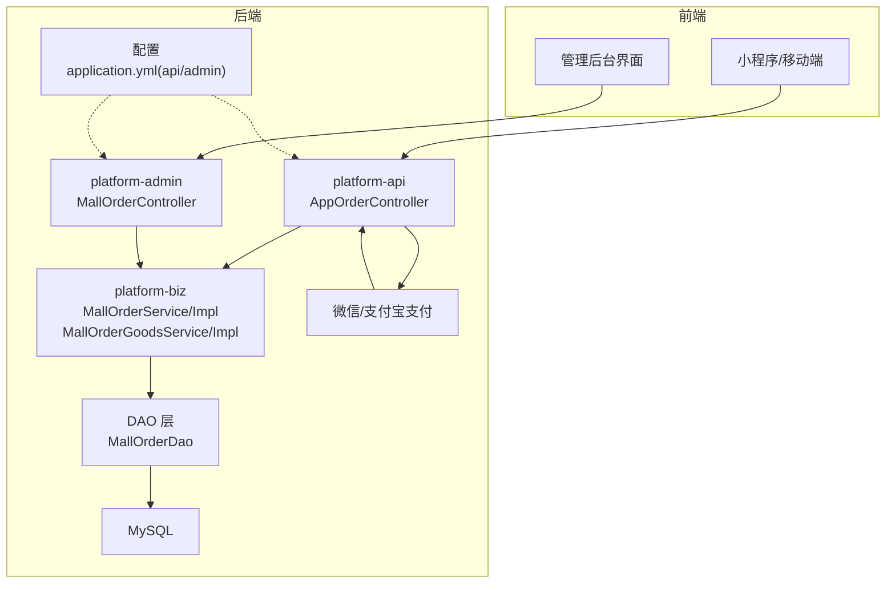
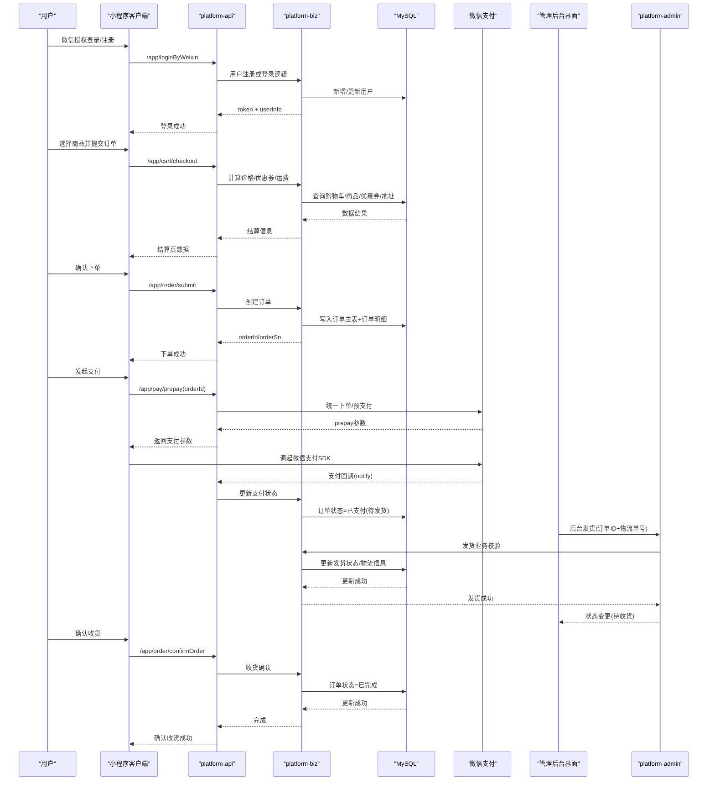
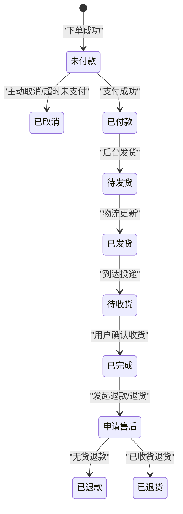
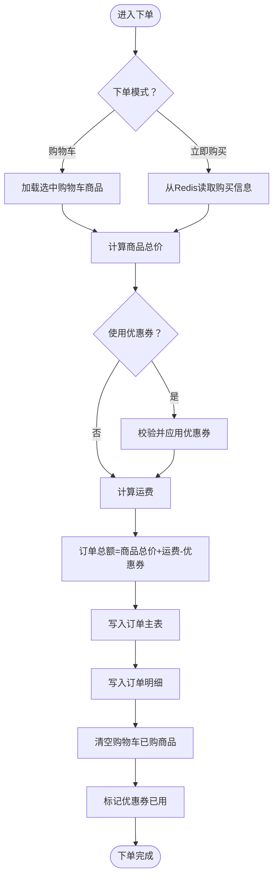
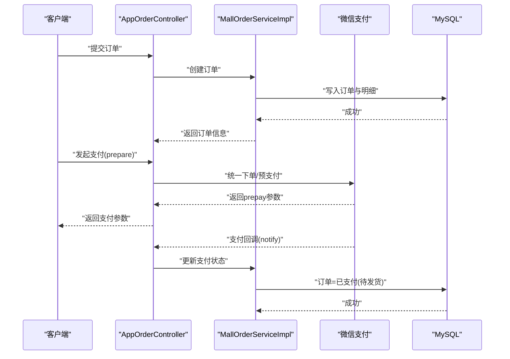
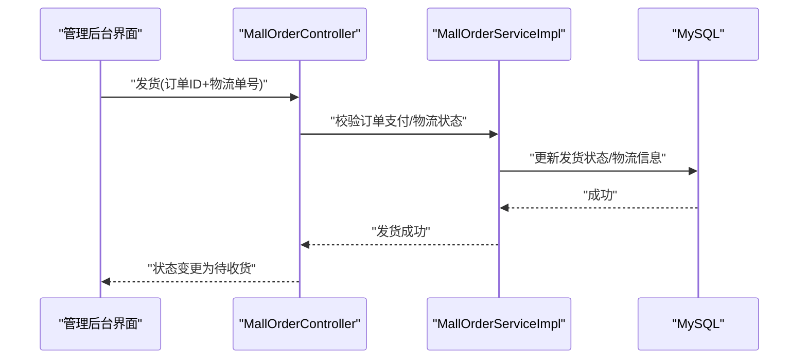
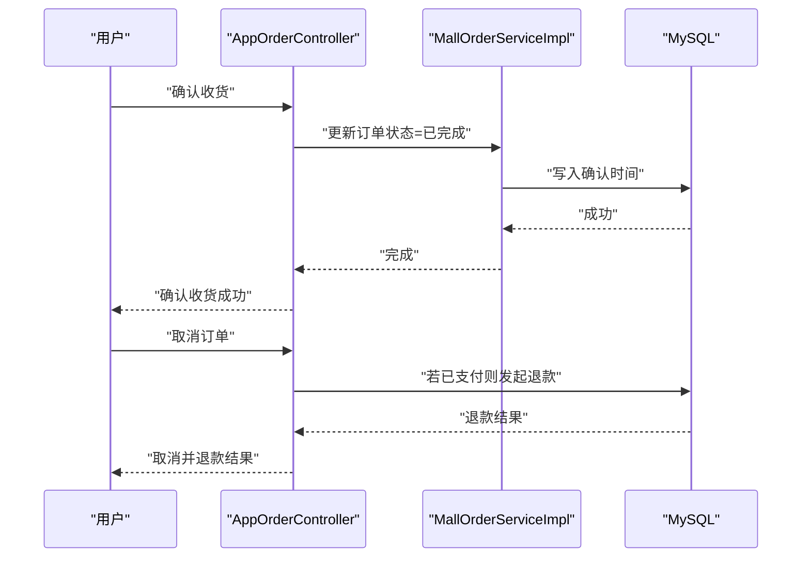
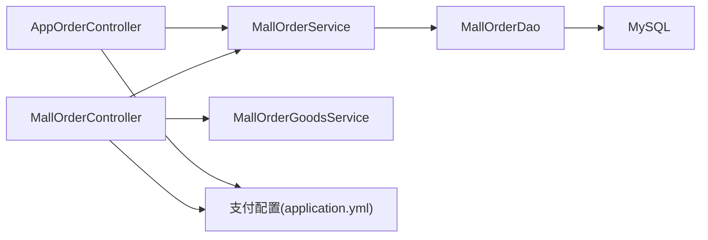

# 订单处理流程

<cite>
**本文引用的文件**
- [MallOrderEntity.java](file://platform-biz/src/main/java/com/platform/modules/mall/entity/MallOrderEntity.java)
- [MallOrderGoodsEntity.java](file://platform-biz/src/main/java/com/platform/modules/mall/entity/MallOrderGoodsEntity.java)
- [MallOrderService.java](file://platform-biz/src/main/java/com/platform/modules/mall/service/MallOrderService.java)
- [MallOrderServiceImpl.java](file://platform-biz/src/main/java/com/platform/modules/mall/service/impl/MallOrderServiceImpl.java)
- [MallOrderGoodsService.java](file://platform-biz/src/main/java/com/platform/modules/mall/service/MallOrderGoodsService.java)
- [MallOrderGoodsServiceImpl.java](file://platform-biz/src/main/java/com/platform/modules/mall/service/impl/MallOrderGoodsServiceImpl.java)
- [MallOrderDao.java](file://platform-biz/src/main/java/com/platform/modules/mall/dao/MallOrderDao.java)
- [AppOrderController.java](file://platform-api/src/main/java/com/platform/modules/app/controller/AppOrderController.java)
- [MallOrderController.java](file://platform-admin/src/main/java/com/platform/modules/mall/controller/MallOrderController.java)
- [application.yml（admin）](file://platform-admin/src/main/resources/application.yml)
- [application.yml（api）](file://platform-api/src/main/resources/application.yml)
- [时序架构图.mmd](file://docs/时序架构图.mmd)
- [系统架构图.mmd](file://docs/系统架构图.mmd)
- [系统架构说明.md](file://docs/系统架构说明.md)
- [order.vue](file://platform-admin-ui/src/views/modules/mall/order.vue)
- [shipping.vue](file://platform-admin-ui/src/views/modules/mall/shipping.vue)
</cite>

## 目录
1. [简介](#简介)
2. [项目结构](#项目结构)
3. [核心组件](#核心组件)
4. [架构总览](#架构总览)
5. [详细组件分析](#详细组件分析)
6. [依赖关系分析](#依赖关系分析)
7. [性能考量](#性能考量)
8. [故障排查指南](#故障排查指南)
9. [结论](#结论)
10. [附录](#附录)

## 简介
本文件面向电商运营与开发者，系统性梳理平台的订单处理全流程，覆盖下单、支付、发货、物流跟踪、确认收货、售后（含退款）等环节。文档基于实际代码与配置，给出状态机设计、接口规范与关键流程图，帮助快速理解与落地实现。

## 项目结构
围绕订单处理的关键模块分布如下：
- 平台 API 层：对外提供移动端与微信侧接口，负责订单查询、提交、取消、确认收货、退款等入口。
- 业务层（Biz）：封装订单主表与订单商品明细的业务逻辑，负责价格计算、优惠券核销、订单生成、状态流转等。
- 管理后台：提供订单列表、发货、物流公司配置等管理能力。
- 配置与通知：支付配置（微信/支付宝）、回调通知地址等。

图表来源
- [AppOrderController.java:1-271](file://platform-api/src/main/java/com/platform/modules/app/controller/AppOrderController.java#L1-L271)
- [MallOrderServiceImpl.java:1-273](file://platform-biz/src/main/java/com/platform/modules/mall/service/impl/MallOrderServiceImpl.java#L1-L273)
- [MallOrderDao.java:1-62](file://platform-biz/src/main/java/com/platform/modules/mall/dao/MallOrderDao.java#L1-L62)
- [MallOrderController.java:1-198](file://platform-admin/src/main/java/com/platform/modules/mall/controller/MallOrderController.java#L1-L198)
- [application.yml（api）:1-195](file://platform-api/src/main/resources/application.yml#L1-L195)
- [application.yml（admin）:1-205](file://platform-admin/src/main/resources/application.yml#L1-L205)

章节来源
- [AppOrderController.java:1-271](file://platform-api/src/main/java/com/platform/modules/app/controller/AppOrderController.java#L1-L271)
- [MallOrderServiceImpl.java:1-273](file://platform-biz/src/main/java/com/platform/modules/mall/service/impl/MallOrderServiceImpl.java#L1-L273)
- [MallOrderDao.java:1-62](file://platform-biz/src/main/java/com/platform/modules/mall/dao/MallOrderDao.java#L1-L62)
- [MallOrderController.java:1-198](file://platform-admin/src/main/java/com/platform/modules/mall/controller/MallOrderController.java#L1-L198)
- [application.yml（api）:1-195](file://platform-api/src/main/resources/application.yml#L1-L195)
- [application.yml（admin）:1-205](file://platform-admin/src/main/resources/application.yml#L1-L205)

## 核心组件
- 订单实体与状态
  - 订单主表实体包含订单编号、用户ID、收货信息、支付/物流/订单状态、金额构成、优惠券与积分信息、回调状态、物流单号等。
  - 订单状态文本与可操作选项由实体内部逻辑生成，便于前端展示与交互控制。
- 订单商品明细
  - 记录下单时的商品快照（名称、编码、零售价、市场价、规格、图片等），保证售后与审计一致性。
- 业务服务
  - 订单服务接口与实现负责下单提交、分页查询、状态更新；实现中包含价格计算、优惠券核销、订单与明细写入、购物车清理等。
  - 订单商品明细服务负责明细的查询、分页与增删改。
- 控制器
  - App 端控制器提供列表、详情、提交、取消、确认收货等接口。
  - 管理端控制器提供发货、订单查询、物流公司配置等接口。

章节来源
- [MallOrderEntity.java:1-362](file://platform-biz/src/main/java/com/platform/modules/mall/entity/MallOrderEntity.java#L1-L362)
- [MallOrderGoodsEntity.java:1-109](file://platform-biz/src/main/java/com/platform/modules/mall/entity/MallOrderGoodsEntity.java#L1-L109)
- [MallOrderService.java:1-102](file://platform-biz/src/main/java/com/platform/modules/mall/service/MallOrderService.java#L1-L102)
- [MallOrderServiceImpl.java:1-273](file://platform-biz/src/main/java/com/platform/modules/mall/service/impl/MallOrderServiceImpl.java#L1-L273)
- [MallOrderGoodsService.java:1-98](file://platform-biz/src/main/java/com/platform/modules/mall/service/MallOrderGoodsService.java#L1-L98)
- [MallOrderGoodsServiceImpl.java:1-112](file://platform-biz/src/main/java/com/platform/modules/mall/service/impl/MallOrderGoodsServiceImpl.java#L1-L112)
- [AppOrderController.java:1-271](file://platform-api/src/main/java/com/platform/modules/app/controller/AppOrderController.java#L1-L271)
- [MallOrderController.java:1-198](file://platform-admin/src/main/java/com/platform/modules/mall/controller/MallOrderController.java#L1-L198)

## 架构总览
下图展示从下单到发货、支付回调与确认收货的整体时序，体现各组件职责与数据流向。

图表来源
- [时序架构图.mmd:1-64](file://docs/时序架构图.mmd#L1-L64)
- [AppOrderController.java:165-195](file://platform-api/src/main/java/com/platform/modules/app/controller/AppOrderController.java#L165-L195)
- [MallOrderServiceImpl.java:126-266](file://platform-biz/src/main/java/com/platform/modules/mall/service/impl/MallOrderServiceImpl.java#L126-L266)
- [MallOrderController.java:150-198](file://platform-admin/src/main/java/com/platform/modules/mall/controller/MallOrderController.java#L150-L198)

章节来源
- [时序架构图.mmd:1-64](file://docs/时序架构图.mmd#L1-L64)
- [AppOrderController.java:1-271](file://platform-api/src/main/java/com/platform/modules/app/controller/AppOrderController.java#L1-L271)
- [MallOrderServiceImpl.java:1-273](file://platform-biz/src/main/java/com/platform/modules/mall/service/impl/MallOrderServiceImpl.java#L1-L273)
- [MallOrderController.java:1-198](file://platform-admin/src/main/java/com/platform/modules/mall/controller/MallOrderController.java#L1-L198)

## 详细组件分析

### 订单状态机与状态字段
- 订单状态（order_status）：统一以数值表达完整生命周期，涵盖未付款、已付款待发货、待收货、已完成、已取消、已退货等。
- 支付状态（pay_status）：独立标识支付维度的状态。
- 物流状态（shipping_status）：独立标识物流维度的状态。
- 可操作选项（handle_option）：依据当前状态动态生成，决定前端可执行的操作（如取消、支付、确认收货、再次购买等）。

图表来源
- [MallOrderEntity.java:270-360](file://platform-biz/src/main/java/com/platform/modules/mall/entity/MallOrderEntity.java#L270-L360)

章节来源
- [MallOrderEntity.java:236-360](file://platform-biz/src/main/java/com/platform/modules/mall/entity/MallOrderEntity.java#L236-L360)

### 下单流程（购物车结算与订单生成）
- 输入：用户选择地址、优惠券、备注，选择“购物车下单”或“立即购买”两种模式。
- 价格计算：统计商品总价，叠加运费（此处示例为0），减去优惠券面额，得到实付金额。
- 订单生成：写入订单主表与订单商品明细，清空购物车中已购商品，标记优惠券为已用。
- 返回：返回订单编号与订单信息，供前端跳转支付与后续流程。

图表来源
- [MallOrderServiceImpl.java:126-266](file://platform-biz/src/main/java/com/platform/modules/mall/service/impl/MallOrderServiceImpl.java#L126-L266)

章节来源
- [MallOrderServiceImpl.java:126-266](file://platform-biz/src/main/java/com/platform/modules/mall/service/impl/MallOrderServiceImpl.java#L126-L266)

### 支付处理机制
- 支付入口：移动端提交订单后，调用支付预下单接口，由服务端向微信支付发起统一下单，返回支付参数。
- 支付回调：微信支付异步回调至平台 API，平台 API 调用业务层更新订单支付状态为“已支付（待发货）”，并持久化支付时间等信息。
- 退款场景：若订单处于“已支付未发货”或“已发货”阶段，取消订单时触发微信支付退款，退款成功后更新订单状态与支付状态。

图表来源
- [AppOrderController.java:165-195](file://platform-api/src/main/java/com/platform/modules/app/controller/AppOrderController.java#L165-L195)
- [MallOrderServiceImpl.java:126-266](file://platform-biz/src/main/java/com/platform/modules/mall/service/impl/MallOrderServiceImpl.java#L126-L266)
- [application.yml（api）:177-194](file://platform-api/src/main/resources/application.yml#L177-L194)

章节来源
- [AppOrderController.java:165-244](file://platform-api/src/main/java/com/platform/modules/app/controller/AppOrderController.java#L165-L244)
- [application.yml（api）:177-194](file://platform-api/src/main/resources/application.yml#L177-L194)

### 发货与物流管理
- 后台发货：管理端传入订单ID、快递公司、物流单号，服务端校验订单支付状态与物流状态，更新发货状态与物流信息。
- 前端联动：管理端界面加载物流公司列表，发货对话框校验必填项，提交后刷新订单状态。
- 状态推进：发货成功后，订单状态推进至“待收货”。

图表来源
- [MallOrderController.java:150-198](file://platform-admin/src/main/java/com/platform/modules/mall/controller/MallOrderController.java#L150-L198)
- [order.vue:131-186](file://platform-admin-ui/src/views/modules/mall/order.vue#L131-L186)
- [shipping.vue:1-72](file://platform-admin-ui/src/views/modules/mall/shipping.vue#L1-L72)

章节来源
- [MallOrderController.java:150-198](file://platform-admin/src/main/java/com/platform/modules/mall/controller/MallOrderController.java#L150-L198)
- [order.vue:131-186](file://platform-admin-ui/src/views/modules/mall/order.vue#L131-L186)
- [shipping.vue:1-72](file://platform-admin-ui/src/views/modules/mall/shipping.vue#L1-L72)

### 确认收货与售后处理
- 确认收货：用户在移动端发起确认收货，服务端更新订单状态为“已完成”，并记录确认时间。
- 售后退款：若订单已支付但未发货，取消订单即触发微信支付退款；若已发货，取消订单更新为“已退货”状态。

图表来源
- [AppOrderController.java:246-269](file://platform-api/src/main/java/com/platform/modules/app/controller/AppOrderController.java#L246-L269)

章节来源
- [AppOrderController.java:246-269](file://platform-api/src/main/java/com/platform/modules/app/controller/AppOrderController.java#L246-L269)

## 依赖关系分析
- 控制器依赖业务服务，业务服务依赖 DAO 与数据访问层，DAO 依赖数据库。
- 支付配置集中于 application.yml，分别配置微信/支付宝的回调通知地址、商户号、公私钥等。
- 前端管理界面通过接口与后台交互，后台控制器对业务层进行状态校验与更新。

图表来源
- [AppOrderController.java:1-271](file://platform-api/src/main/java/com/platform/modules/app/controller/AppOrderController.java#L1-L271)
- [MallOrderServiceImpl.java:1-273](file://platform-biz/src/main/java/com/platform/modules/mall/service/impl/MallOrderServiceImpl.java#L1-L273)
- [MallOrderDao.java:1-62](file://platform-biz/src/main/java/com/platform/modules/mall/dao/MallOrderDao.java#L1-L62)
- [MallOrderController.java:1-198](file://platform-admin/src/main/java/com/platform/modules/mall/controller/MallOrderController.java#L1-L198)
- [application.yml（api）:123-194](file://platform-api/src/main/resources/application.yml#L123-L194)
- [application.yml（admin）:143-205](file://platform-admin/src/main/resources/application.yml#L143-L205)

章节来源
- [AppOrderController.java:1-271](file://platform-api/src/main/java/com/platform/modules/app/controller/AppOrderController.java#L1-L271)
- [MallOrderServiceImpl.java:1-273](file://platform-biz/src/main/java/com/platform/modules/mall/service/impl/MallOrderServiceImpl.java#L1-L273)
- [MallOrderDao.java:1-62](file://platform-biz/src/main/java/com/platform/modules/mall/dao/MallOrderDao.java#L1-L62)
- [MallOrderController.java:1-198](file://platform-admin/src/main/java/com/platform/modules/mall/controller/MallOrderController.java#L1-L198)
- [application.yml（api）:123-194](file://platform-api/src/main/resources/application.yml#L123-L194)
- [application.yml（admin）:143-205](file://platform-admin/src/main/resources/application.yml#L143-L205)

## 性能考量
- 事务边界：下单与发货等关键流程使用事务，确保订单与明细的一致性。
- 查询优化：分页查询统一按主键倒序，减少全表扫描；订单详情聚合商品数量与列表，避免 N+1 查询。
- 缓存与幂等：支付回调需具备幂等处理，避免重复更新状态；可结合 Redis 或数据库唯一索引保障幂等。
- 并发控制：库存与优惠券核销建议在下单前进行锁库存与锁券，防止超卖与重复使用。

## 故障排查指南
- 下单失败
  - 检查购物车是否为空或已失效；确认地址与优惠券可用性。
  - 关注服务端返回的错误码与提示，定位具体环节。
- 支付回调未生效
  - 核对支付配置中的回调地址与签名参数；检查回调日志与重试机制。
- 发货失败
  - 校验订单是否已支付、是否已发货；确认物流单号与公司信息是否正确。
- 确认收货异常
  - 核对订单状态是否为“已发货”；检查时间字段是否正确写入。

章节来源
- [MallOrderServiceImpl.java:126-266](file://platform-biz/src/main/java/com/platform/modules/mall/service/impl/MallOrderServiceImpl.java#L126-L266)
- [AppOrderController.java:165-269](file://platform-api/src/main/java/com/platform/modules/app/controller/AppOrderController.java#L165-L269)
- [MallOrderController.java:150-198](file://platform-admin/src/main/java/com/platform/modules/mall/controller/MallOrderController.java#L150-L198)
- [application.yml（api）:123-194](file://platform-api/src/main/resources/application.yml#L123-L194)
- [application.yml（admin）:143-205](file://platform-admin/src/main/resources/application.yml#L143-L205)

## 结论
本订单处理流程以统一的状态机为核心，结合业务服务与控制器的清晰分工，实现了从下单、支付、发货到确认收货与售后的闭环。通过配置化的支付参数与前后端接口规范，平台可在多端稳定运行。建议在生产环境中强化并发控制、回调幂等与监控告警，持续提升稳定性与用户体验。

## 附录
- 系统架构说明与概念图参见文档目录中的系统架构说明与架构图文件。
- 支付配置项（微信/支付宝）位于各模块的 application.yml 中，包含回调通知地址、商户号、密钥等关键参数。

章节来源
- [系统架构说明.md](file://docs/系统架构说明.md)
- [系统架构图.mmd](file://docs/系统架构图.mmd)
- [application.yml（api）:123-194](file://platform-api/src/main/resources/application.yml#L123-L194)
- [application.yml（admin）:143-205](file://platform-admin/src/main/resources/application.yml#L143-L205)