# 微信业务模块

<cite>
**本文引用的文件**
- [application.yml](file://platform-admin/src/main/resources/application.yml)
- [application-dev.yml](file://platform-admin/src/main/resources/application-dev.yml)
- [WxMsgManageController.java](file://platform-admin/src/main/java/com/platform/modules/wx/controller/WxMsgManageController.java)
- [WxUserManageController.java](file://platform-admin/src/main/java/com/platform/modules/wx/controller/WxUserManageController.java)
- [WxMenuManageController.java](file://platform-admin/src/main/java/com/platform/modules/wx/controller/WxMenuManageController.java)
- [WxUserTagsManageController.java](file://platform-admin/src/main/java/com/platform/modules/wx/controller/WxUserTagsManageController.java)
- [MsgTemplateManageController.java](file://platform-admin/src/main/java/com/platform/modules/wx/controller/MsgTemplateManageController.java)
- [WxAssetsManageController.java](file://platform-admin/src/main/java/com/platform/modules/wx/controller/WxAssetsManageController.java)
- [WxMpDraftController.java](file://platform-admin/src/main/java/com/platform/modules/wx/controller/WxMpDraftController.java)
- [WxMpFreePublishController.java](file://platform-admin/src/main/java/com/platform/modules/wx/controller/WxMpFreePublishController.java)
- [WxQrCodeManageController.java](file://platform-admin/src/main/java/com/platform/modules/wx/controller/WxQrCodeManageController.java)
- [TemplateMsgLogManageController.java](file://platform-admin/src/main/java/com/platform/modules/wx/controller/TemplateMsgLogManageController.java)
</cite>

## 目录
1. [简介](#简介)
2. [项目结构](#项目结构)
3. [核心组件](#核心组件)
4. [架构总览](#架构总览)
5. [详细组件分析](#详细组件分析)
6. [依赖关系分析](#依赖关系分析)
7. [性能与安全考量](#性能与安全考量)
8. [故障排查指南](#故障排查指南)
9. [结论](#结论)
10. [附录](#附录)

## 简介
本文件面向微信开发者与运营人员，系统性梳理平台的微信生态集成功能，覆盖微信公众号与小程序两大场景。重点包括：
- 公众号集成：消息管理、用户管理、菜单配置、素材管理、草稿与发布、二维码管理
- 小程序开发：接口、用户授权、支付集成、模板消息
- 微信支付处理：支付配置、支付流程、退款处理、对账管理
- 消息模板管理：模板配置、批量发送、发送记录、用户标签

文档基于后端控制器与配置文件的现有实现进行解读，提供架构视图、调用流程与时序示意，帮助快速理解与落地集成。

## 项目结构
微信业务模块位于后端管理服务的模块目录下，采用按功能域划分的层次化组织方式：
- 控制器层：集中于模块控制器，提供微信公众号与小程序相关的REST接口
- 配置层：在应用配置中集中声明微信公众号、小程序与支付相关参数
- 前端UI：提供微信菜单、素材、模板消息、用户标签等管理界面

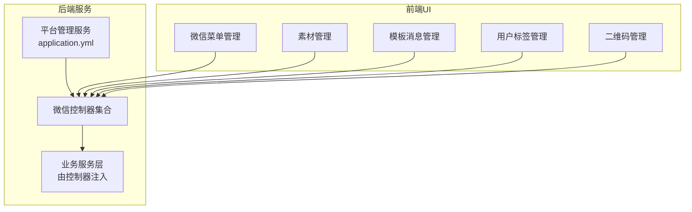

图表来源
- [application.yml:169-205](file://platform-admin/src/main/resources/application.yml#L169-L205)
- [WxMenuManageController.java:44-47](file://platform-admin/src/main/java/com/platform/modules/wx/controller/WxMenuManageController.java#L44-L47)
- [WxAssetsManageController.java:47-49](file://platform-admin/src/main/java/com/platform/modules/wx/controller/WxAssetsManageController.java#L47-L49)

章节来源
- [application.yml:169-205](file://platform-admin/src/main/resources/application.yml#L169-L205)
- [application-dev.yml:1-47](file://platform-admin/src/main/resources/application-dev.yml#L1-L47)

## 核心组件
- 公众号消息管理：提供消息列表、详情查询、人工回复、删除等能力
- 公众号用户管理：提供用户列表、详情查询、按OpenID批量查询
- 公众号菜单管理：提供菜单拉取、创建/更新、网络检测
- 公众号素材管理：提供素材统计、图文详情、分页获取、上传、删除
- 公众号草稿与发布：提供草稿新建/修改/删除/列表、发布提交、已发布文章查询、删除发布
- 公众号二维码管理：提供带参二维码创建、列表、详情、删除
- 模板消息管理：提供模板列表、详情、按名称查询、新增/修改/删除、同步模板、批量发送
- 模板消息发送记录：提供发送记录列表、详情、删除
- 用户标签管理：提供标签列表、新增/修改/删除、批量打标/去标

章节来源
- [WxMsgManageController.java:47-100](file://platform-admin/src/main/java/com/platform/modules/wx/controller/WxMsgManageController.java#L47-L100)
- [WxUserManageController.java:44-81](file://platform-admin/src/main/java/com/platform/modules/wx/controller/WxUserManageController.java#L44-L81)
- [WxMenuManageController.java:46-90](file://platform-admin/src/main/java/com/platform/modules/wx/controller/WxMenuManageController.java#L46-L90)
- [WxAssetsManageController.java:49-147](file://platform-admin/src/main/java/com/platform/modules/wx/controller/WxAssetsManageController.java#L49-L147)
- [WxMpDraftController.java:50-196](file://platform-admin/src/main/java/com/platform/modules/wx/controller/WxMpDraftController.java#L50-L196)
- [WxMpFreePublishController.java:44-137](file://platform-admin/src/main/java/com/platform/modules/wx/controller/WxMpFreePublishController.java#L44-L137)
- [WxQrCodeManageController.java:49-101](file://platform-admin/src/main/java/com/platform/modules/wx/controller/WxQrCodeManageController.java#L49-L101)
- [MsgTemplateManageController.java:48-177](file://platform-admin/src/main/java/com/platform/modules/wx/controller/MsgTemplateManageController.java#L48-L177)
- [TemplateMsgLogManageController.java:45-93](file://platform-admin/src/main/java/com/platform/modules/wx/controller/TemplateMsgLogManageController.java#L45-L93)
- [WxUserTagsManageController.java:44-111](file://platform-admin/src/main/java/com/platform/modules/wx/controller/WxUserTagsManageController.java#L44-L111)

## 架构总览
后端通过统一的配置中心加载微信相关参数，控制器层对外暴露REST接口，业务服务层对接微信SDK完成具体调用。前端UI通过路由与控制器交互，实现微信生态的可视化管理。

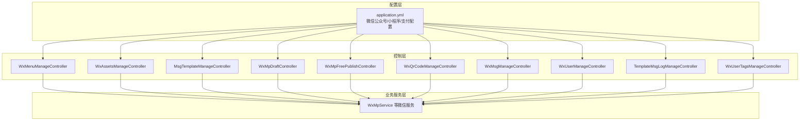

图表来源
- [application.yml:169-205](file://platform-admin/src/main/resources/application.yml#L169-L205)
- [WxMenuManageController.java:46-47](file://platform-admin/src/main/java/com/platform/modules/wx/controller/WxMenuManageController.java#L46-L47)
- [WxAssetsManageController.java:49-49](file://platform-admin/src/main/java/com/platform/modules/wx/controller/WxAssetsManageController.java#L49-L49)
- [MsgTemplateManageController.java:51-51](file://platform-admin/src/main/java/com/platform/modules/wx/controller/MsgTemplateManageController.java#L51-L51)
- [WxMpDraftController.java:51-51](file://platform-admin/src/main/java/com/platform/modules/wx/controller/WxMpDraftController.java#L51-L51)
- [WxMpFreePublishController.java:45-45](file://platform-admin/src/main/java/com/platform/modules/wx/controller/WxMpFreePublishController.java#L45-L45)
- [WxQrCodeManageController.java:51-51](file://platform-admin/src/main/java/com/platform/modules/wx/controller/WxQrCodeManageController.java#L51-L51)
- [WxMsgManageController.java:48-49](file://platform-admin/src/main/java/com/platform/modules/wx/controller/WxMsgManageController.java#L48-L49)
- [WxUserManageController.java:45-45](file://platform-admin/src/main/java/com/platform/modules/wx/controller/WxUserManageController.java#L45-L45)
- [TemplateMsgLogManageController.java:46-46](file://platform-admin/src/main/java/com/platform/modules/wx/controller/TemplateMsgLogManageController.java#L46-L46)
- [WxUserTagsManageController.java:46-46](file://platform-admin/src/main/java/com/platform/modules/wx/controller/WxUserTagsManageController.java#L46-L46)

## 详细组件分析

### 公众号消息管理
- 功能点：分页查询消息、详情查询、人工回复、批量删除
- 关键接口：GET /manage/wxMsg/list、GET /manage/wxMsg/info/{id}、POST /manage/wxMsg/reply、POST /manage/wxMsg/delete
- 业务流程：管理员在后台查看用户消息，选择目标用户进行人工回复；支持按ID批量删除历史消息

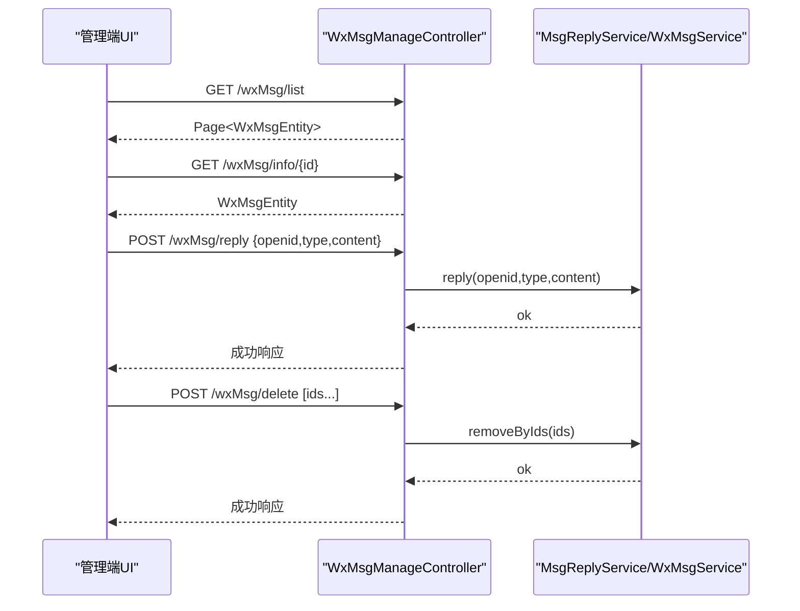

图表来源
- [WxMsgManageController.java:54-99](file://platform-admin/src/main/java/com/platform/modules/wx/controller/WxMsgManageController.java#L54-L99)

章节来源
- [WxMsgManageController.java:47-100](file://platform-admin/src/main/java/com/platform/modules/wx/controller/WxMsgManageController.java#L47-L100)

### 公众号用户管理
- 功能点：分页查询用户、详情查询、按OpenID批量查询
- 关键接口：GET /manage/wxUser/list、POST /manage/wxUser/listByIds、GET /manage/wxUser/info/{openid}

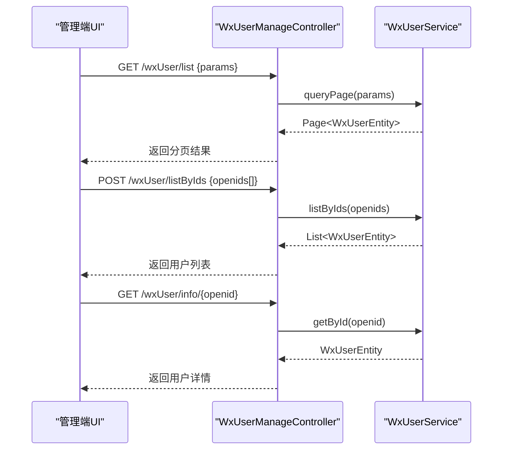

图表来源
- [WxUserManageController.java:50-78](file://platform-admin/src/main/java/com/platform/modules/wx/controller/WxUserManageController.java#L50-L78)

章节来源
- [WxUserManageController.java:44-81](file://platform-admin/src/main/java/com/platform/modules/wx/controller/WxUserManageController.java#L44-L81)

### 公众号菜单管理
- 功能点：获取菜单、创建/更新菜单、网络检测
- 关键接口：GET /manage/wxMenu/getMenu、POST /manage/wxMenu/updateMenu、GET /manage/wxMenu/netCheck

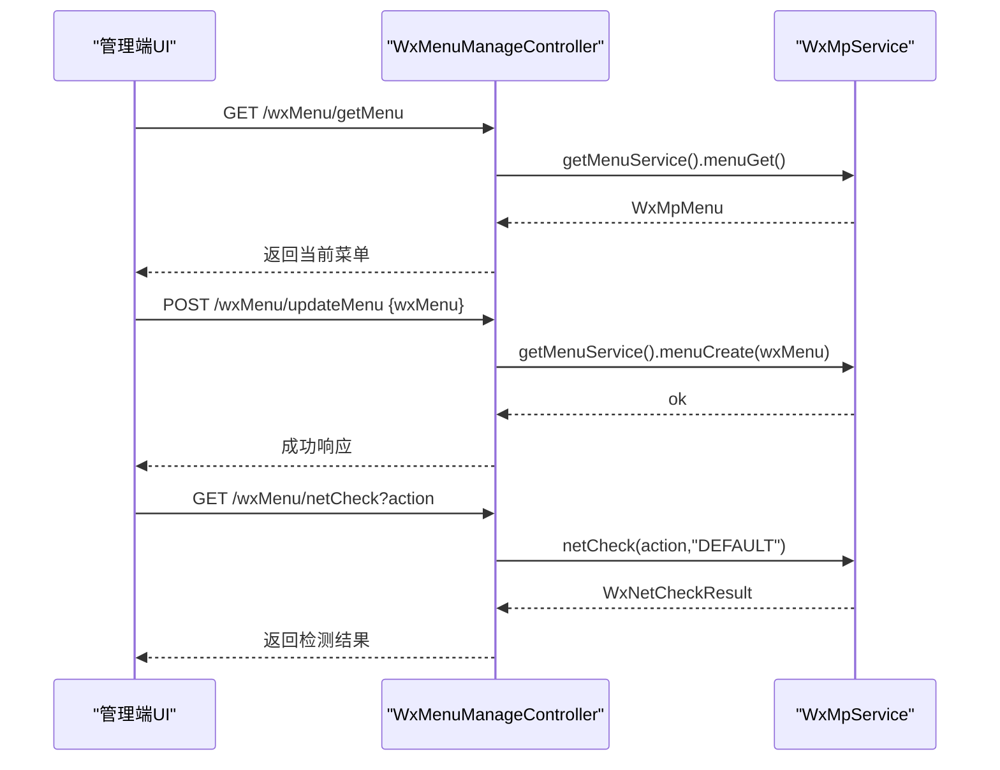

图表来源
- [WxMenuManageController.java:52-89](file://platform-admin/src/main/java/com/platform/modules/wx/controller/WxMenuManageController.java#L52-L89)

章节来源
- [WxMenuManageController.java:46-90](file://platform-admin/src/main/java/com/platform/modules/wx/controller/WxMenuManageController.java#L46-L90)

### 公众号素材管理
- 功能点：素材总数、图文详情、分页获取非图文/图文素材、上传永久素材、删除素材
- 关键接口：GET /manage/wxAssets/materialCount、GET /manage/wxAssets/materialNewsInfo、GET /manage/wxAssets/materialFileBatchGet、GET /manage/wxAssets/materialNewsBatchGet、POST /manage/wxAssets/materialFileUpload、POST /manage/wxAssets/materialDelete

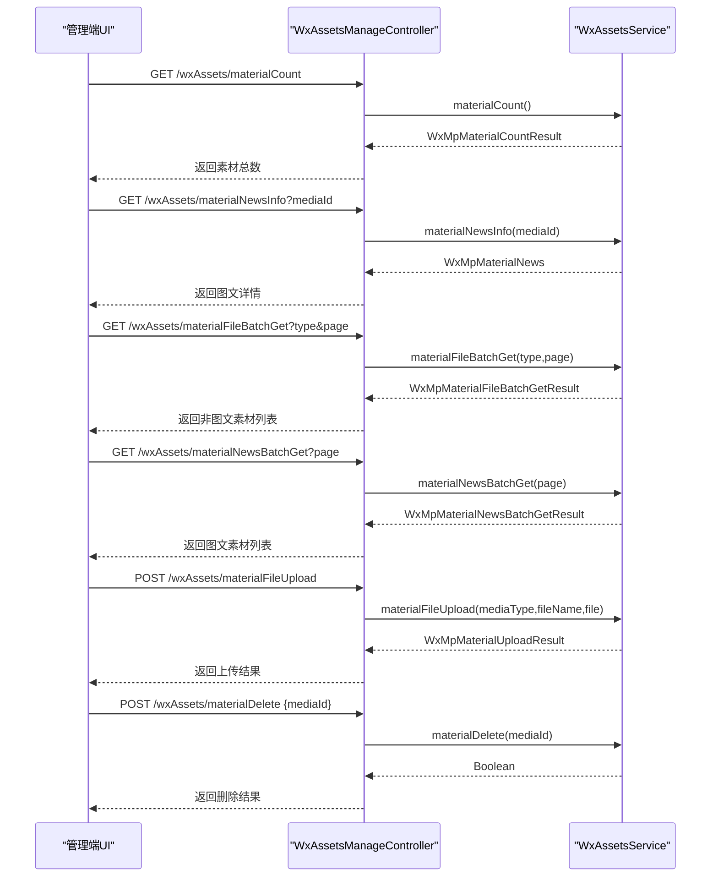

图表来源
- [WxAssetsManageController.java:57-146](file://platform-admin/src/main/java/com/platform/modules/wx/controller/WxAssetsManageController.java#L57-L146)

章节来源
- [WxAssetsManageController.java:49-147](file://platform-admin/src/main/java/com/platform/modules/wx/controller/WxAssetsManageController.java#L49-L147)

### 公众号草稿与发布
- 功能点：草稿新建、修改、删除、列表；发布提交、已发布文章查询、删除发布
- 关键接口：POST /manage/draft/addDraft、POST /manage/draft/updateDraft、GET /manage/draft/getDraft/{mediaId}、POST /manage/draft/delDraft、GET /manage/draft/listDraft、GET /manage/freepublish/submit/{mediaId}、GET /manage/freepublish/getArticleFromId、POST /manage/freepublish/deletePush、GET /manage/freepublish/getPublicationRecords

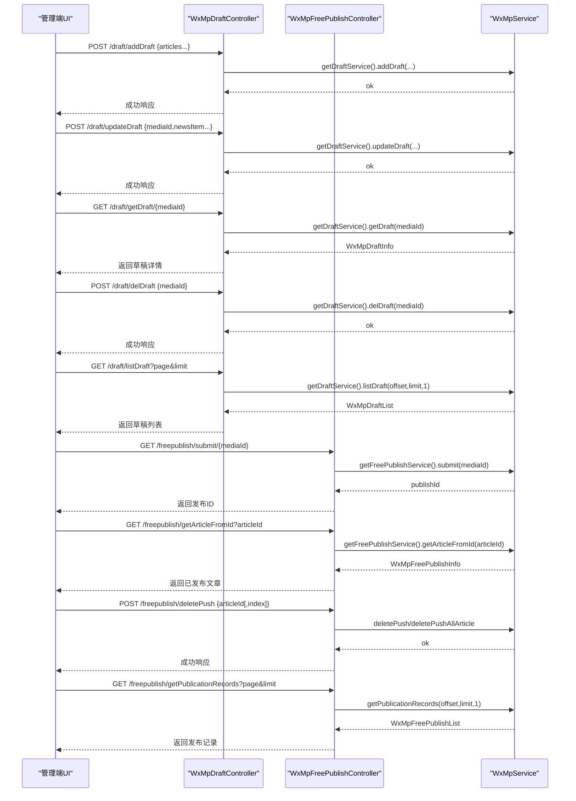

图表来源
- [WxMpDraftController.java:64-195](file://platform-admin/src/main/java/com/platform/modules/wx/controller/WxMpDraftController.java#L64-L195)
- [WxMpFreePublishController.java:129-95](file://platform-admin/src/main/java/com/platform/modules/wx/controller/WxMpFreePublishController.java#L129-L95)

章节来源
- [WxMpDraftController.java:50-196](file://platform-admin/src/main/java/com/platform/modules/wx/controller/WxMpDraftController.java#L50-L196)
- [WxMpFreePublishController.java:44-137](file://platform-admin/src/main/java/com/platform/modules/wx/controller/WxMpFreePublishController.java#L44-L137)

### 公众号二维码管理
- 功能点：创建带参二维码ticket、分页查询、详情查询、批量删除
- 关键接口：POST /manage/wxQrCode/createTicket、GET /manage/wxQrCode/list、GET /manage/wxQrCode/info/{id}、POST /manage/wxQrCode/delete

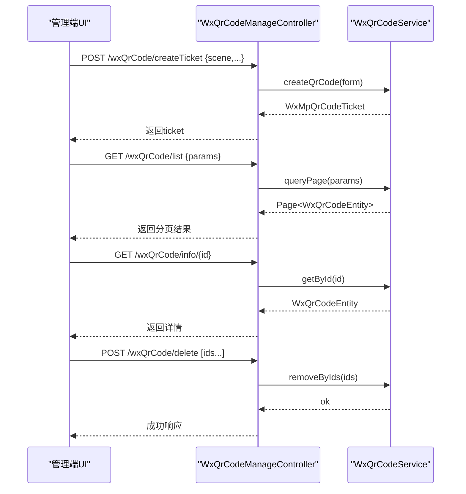

图表来源
- [WxQrCodeManageController.java:56-100](file://platform-admin/src/main/java/com/platform/modules/wx/controller/WxQrCodeManageController.java#L56-L100)

章节来源
- [WxQrCodeManageController.java:49-101](file://platform-admin/src/main/java/com/platform/modules/wx/controller/WxQrCodeManageController.java#L49-L101)

### 模板消息管理
- 功能点：模板列表、详情、按名称查询、新增/修改/删除、同步模板、批量发送
- 关键接口：GET /manage/msgTemplate/list、GET /manage/msgTemplate/info/{id}、GET /manage/msgTemplate/getByName、POST /manage/msgTemplate/save、POST /manage/msgTemplate/update、POST /manage/msgTemplate/delete、POST /manage/msgTemplate/syncWxTemplate、POST /manage/msgTemplate/sendMsgBatch

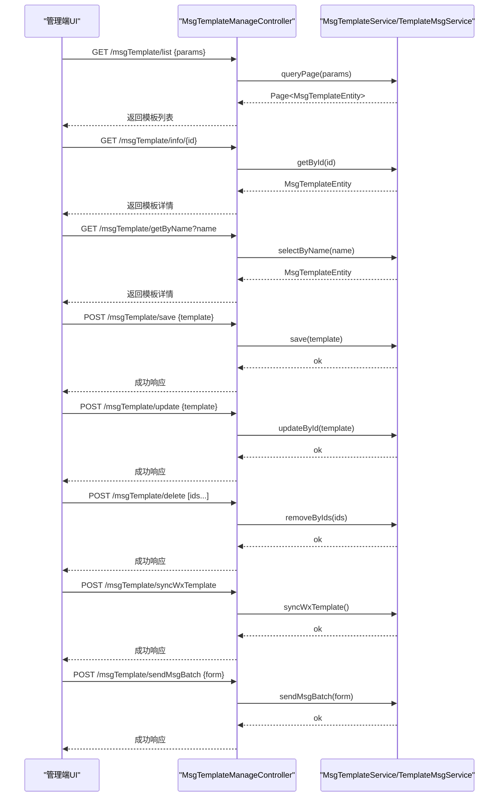

图表来源
- [MsgTemplateManageController.java:59-176](file://platform-admin/src/main/java/com/platform/modules/wx/controller/MsgTemplateManageController.java#L59-L176)

章节来源
- [MsgTemplateManageController.java:48-177](file://platform-admin/src/main/java/com/platform/modules/wx/controller/MsgTemplateManageController.java#L48-L177)

### 模板消息发送记录
- 功能点：发送记录列表、详情、批量删除
- 关键接口：GET /manage/templateMsgLog/list、GET /manage/templateMsgLog/info/{logId}、POST /manage/templateMsgLog/delete

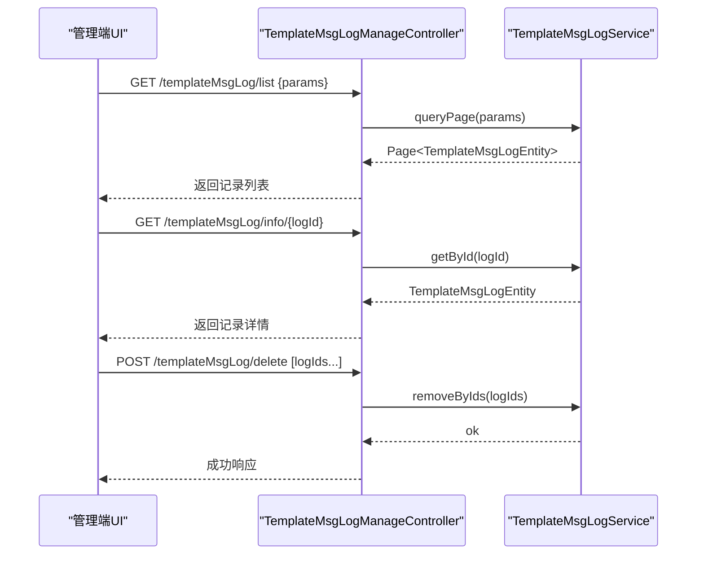

图表来源
- [TemplateMsgLogManageController.java:54-92](file://platform-admin/src/main/java/com/platform/modules/wx/controller/TemplateMsgLogManageController.java#L54-L92)

章节来源
- [TemplateMsgLogManageController.java:45-93](file://platform-admin/src/main/java/com/platform/modules/wx/controller/TemplateMsgLogManageController.java#L45-L93)

### 公众号用户标签管理
- 功能点：标签列表、新增/修改/删除、批量打标/去标
- 关键接口：GET /manage/wxUserTags/list、POST /manage/wxUserTags/save、POST /manage/wxUserTags/delete/{tagid}、POST /manage/wxUserTags/batchTagging、POST /manage/wxUserTags/batchUnTagging

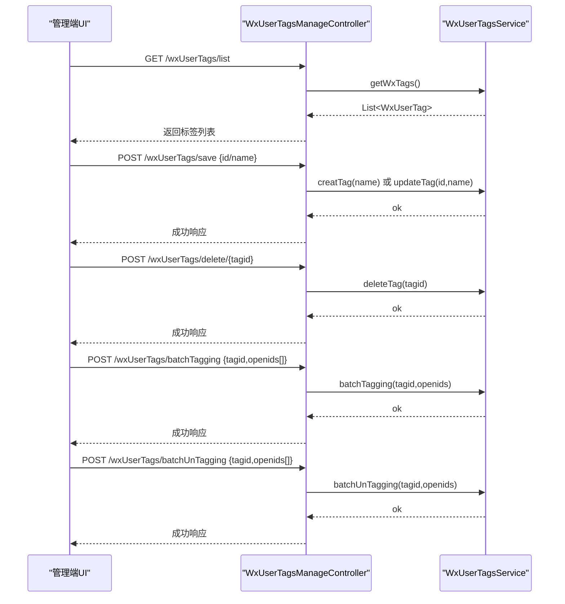

图表来源
- [WxUserTagsManageController.java:51-110](file://platform-admin/src/main/java/com/platform/modules/wx/controller/WxUserTagsManageController.java#L51-L110)

章节来源
- [WxUserTagsManageController.java:44-111](file://platform-admin/src/main/java/com/platform/modules/wx/controller/WxUserTagsManageController.java#L44-L111)

## 依赖关系分析
- 配置依赖：微信公众号、小程序、支付相关参数集中在应用配置文件中，控制器通过注入的服务访问微信能力
- 控制器耦合：各控制器职责清晰，均通过各自服务接口与微信SDK交互，降低耦合度
- 数据流：前端请求经由控制器进入服务层，服务层封装微信API调用，返回标准化响应

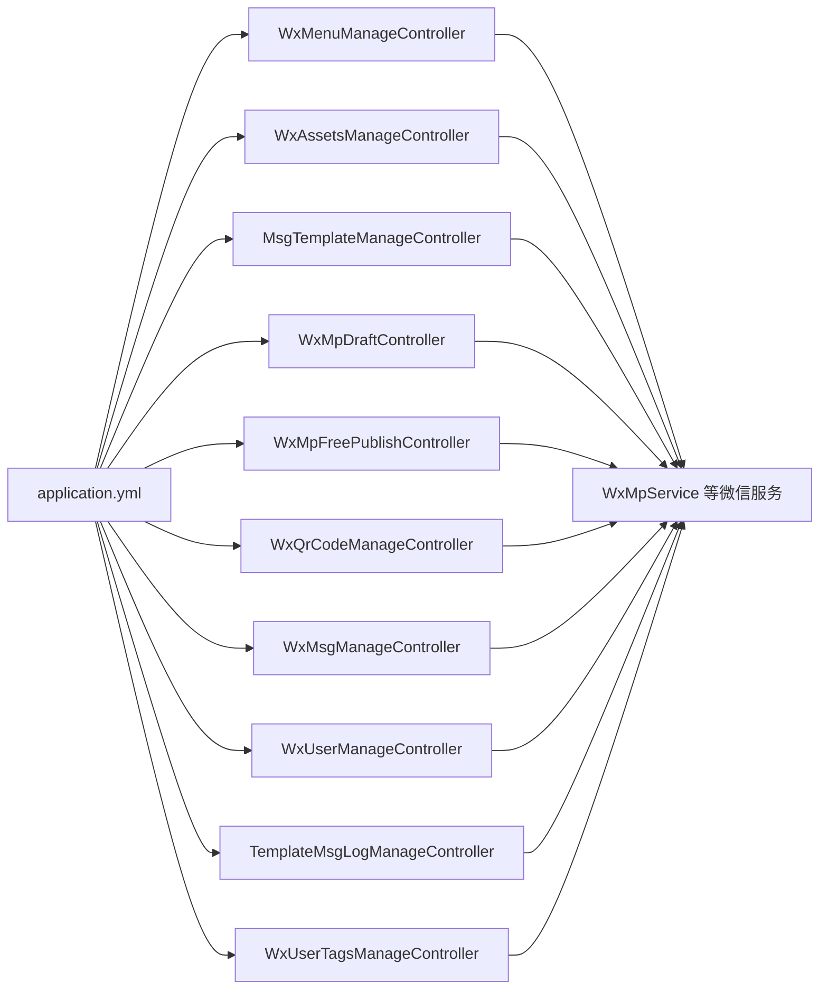

图表来源
- [application.yml:169-205](file://platform-admin/src/main/resources/application.yml#L169-L205)
- [WxMenuManageController.java:46-47](file://platform-admin/src/main/java/com/platform/modules/wx/controller/WxMenuManageController.java#L46-L47)
- [WxAssetsManageController.java:49-49](file://platform-admin/src/main/java/com/platform/modules/wx/controller/WxAssetsManageController.java#L49-L49)
- [MsgTemplateManageController.java:51-51](file://platform-admin/src/main/java/com/platform/modules/wx/controller/MsgTemplateManageController.java#L51-L51)
- [WxMpDraftController.java:51-51](file://platform-admin/src/main/java/com/platform/modules/wx/controller/WxMpDraftController.java#L51-L51)
- [WxMpFreePublishController.java:45-45](file://platform-admin/src/main/java/com/platform/modules/wx/controller/WxMpFreePublishController.java#L45-L45)
- [WxQrCodeManageController.java:51-51](file://platform-admin/src/main/java/com/platform/modules/wx/controller/WxQrCodeManageController.java#L51-L51)
- [WxMsgManageController.java:48-49](file://platform-admin/src/main/java/com/platform/modules/wx/controller/WxMsgManageController.java#L48-L49)
- [WxUserManageController.java:45-45](file://platform-admin/src/main/java/com/platform/modules/wx/controller/WxUserManageController.java#L45-L45)
- [TemplateMsgLogManageController.java:46-46](file://platform-admin/src/main/java/com/platform/modules/wx/controller/TemplateMsgLogManageController.java#L46-L46)
- [WxUserTagsManageController.java:46-46](file://platform-admin/src/main/java/com/platform/modules/wx/controller/WxUserTagsManageController.java#L46-L46)

章节来源
- [application.yml:169-205](file://platform-admin/src/main/resources/application.yml#L169-L205)

## 性能与安全考量
- 性能
  - 控制器层仅承担编排职责，实际微信调用由服务层封装，便于后续引入缓存与异步处理
  - 分页接口广泛使用，建议结合索引优化与合理分页大小，避免大数据量查询压力
- 安全
  - 微信公众号与小程序的配置项集中于配置文件，应严格控制敏感信息的存储与传输
  - 接口权限控制通过注解实现，确保仅授权用户可执行敏感操作（如菜单发布、素材删除、模板发送）
  - 建议在生产环境启用HTTPS与访问控制，防止中间人攻击与未授权访问

## 故障排查指南
- 常见问题定位
  - 菜单网络检测失败：检查回调地址与网络连通性，确认微信服务器可访问
  - 素材上传失败：核对媒体类型、文件大小与格式，确认上传接口可用
  - 模板消息发送失败：检查模板ID、用户OpenID与数据格式，关注发送记录日志
  - 草稿/发布异常：核对mediaId或articleId的有效性，确认草稿状态与权限
- 日志与审计
  - 控制器层对关键操作添加了审计日志注解，便于追踪操作轨迹
  - 模板消息发送记录提供独立管理，便于回溯与重试

章节来源
- [WxMenuManageController.java:77-89](file://platform-admin/src/main/java/com/platform/modules/wx/controller/WxMenuManageController.java#L77-L89)
- [WxAssetsManageController.java:120-130](file://platform-admin/src/main/java/com/platform/modules/wx/controller/WxAssetsManageController.java#L120-L130)
- [MsgTemplateManageController.java:163-176](file://platform-admin/src/main/java/com/platform/modules/wx/controller/MsgTemplateManageController.java#L163-L176)
- [WxMpDraftController.java:170-173](file://platform-admin/src/main/java/com/platform/modules/wx/controller/WxMpDraftController.java#L170-L173)
- [TemplateMsgLogManageController.java:84-92](file://platform-admin/src/main/java/com/platform/modules/wx/controller/TemplateMsgLogManageController.java#L84-L92)

## 结论
本微信业务模块以清晰的控制器与服务层分离为基础，围绕公众号与小程序场景提供了完整的能力集：消息、用户、菜单、素材、草稿/发布、二维码、模板消息与标签管理。配合完善的接口权限控制与日志审计，可满足日常运营与开发需求。建议在生产环境中进一步完善缓存、异步与监控体系，持续提升稳定性与可观测性。

## 附录
- 配置项说明（摘录）
  - 公众号配置：appId、secret、token、aesKey
  - 小程序配置：appid、secret、token、aesKey、msgDataFormat
  - 微信支付配置：appId、mchId、mchKey、subAppId、subMchId、keyPath、baseNotifyUrl
- 数据库与环境
  - 开发环境数据库连接配置示例位于应用配置文件中，便于本地调试与测试

章节来源
- [application.yml:169-205](file://platform-admin/src/main/resources/application.yml#L169-L205)
- [application-dev.yml:1-47](file://platform-admin/src/main/resources/application-dev.yml#L1-L47)