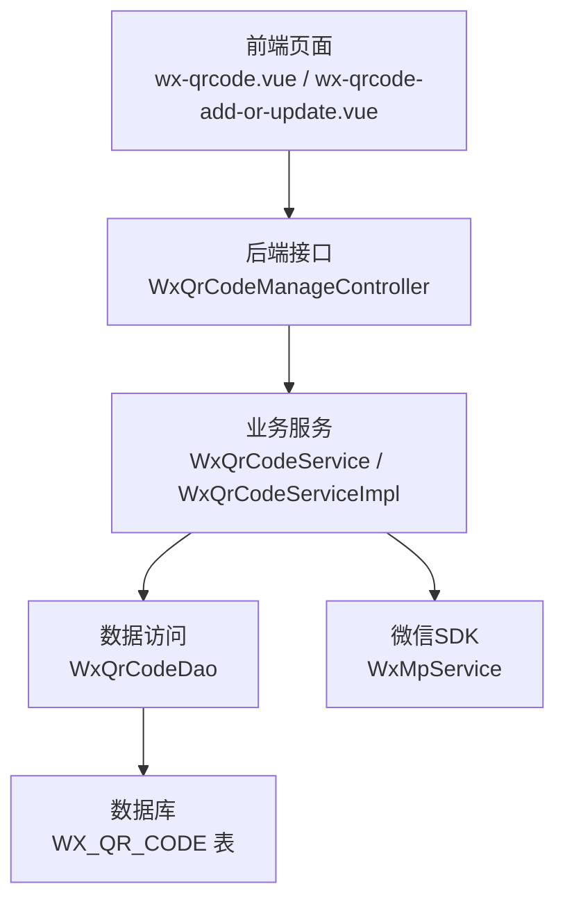
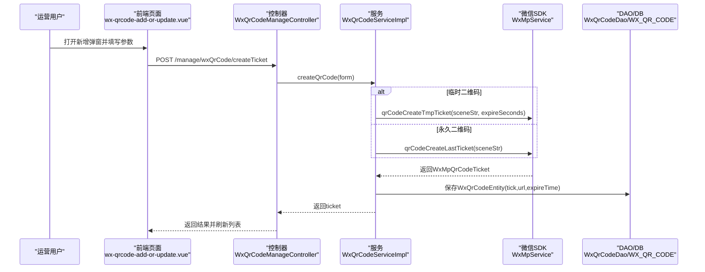
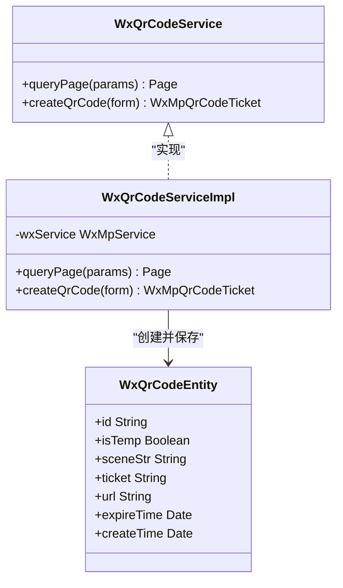
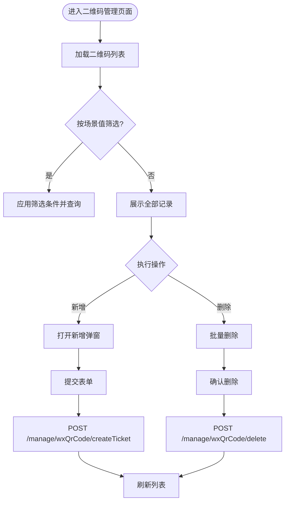
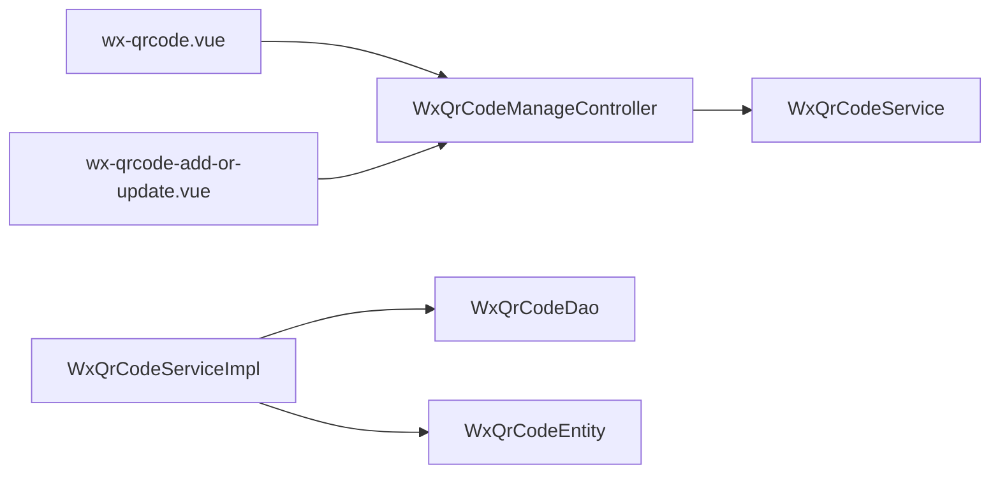

# 微信二维码管理

<cite>
**本文引用的文件**
- [WxQrCodeManageController.java](file://platform-admin/src/main/java/com/platform/modules/wx/controller/WxQrCodeManageController.java)
- [WxQrCodeService.java](file://platform-biz/src/main/java/com/platform/modules/wx/service/WxQrCodeService.java)
- [WxQrCodeServiceImpl.java](file://platform-biz/src/main/java/com/platform/modules/wx/service/impl/WxQrCodeServiceImpl.java)
- [WxQrCodeDao.java](file://platform-biz/src/main/java/com/platform/modules/wx/dao/WxQrCodeDao.java)
- [WxQrCodeEntity.java](file://platform-biz/src/main/java/com/platform/modules/wx/entity/WxQrCodeEntity.java)
- [WxQrCodeForm.java](file://platform-biz/src/main/java/com/platform/modules/wx/form/WxQrCodeForm.java)
- [wx-qrcode.vue](file://platform-admin-ui/src/views/modules/wx/wx-qrcode.vue)
- [wx-qrcode-add-or-update.vue](file://platform-admin-ui/src/views/modules/wx/wx-qrcode-add-or-update.vue)
- [QRCodeUtil.java](file://platform-common/src/main/java/com/platform/common/utils/QRCodeUtil.java)
</cite>

## 目录
1. [简介](#简介)
2. [项目结构](#项目结构)
3. [核心组件](#核心组件)
4. [架构总览](#架构总览)
5. [详细组件分析](#详细组件分析)
6. [依赖分析](#依赖分析)
7. [性能考虑](#性能考虑)
8. [故障排查指南](#故障排查指南)
9. [结论](#结论)
10. [附录](#附录)

## 简介
本文件面向运营与开发人员，系统性梳理平台中“微信二维码管理”的实现与使用方法。内容涵盖：
- 二维码生成机制：临时二维码、永久二维码、参数设置、有效期管理
- 二维码管理功能：列表查看、状态管理、统计分析、回收处理
- 应用场景：推广活动、用户引导、内容分享、营销转化
- 与业务系统的集成：二维码绑定业务数据、跳转处理、效果追踪
- 设计原则、使用策略与效果优化建议

## 项目结构
围绕微信二维码管理的关键模块由三层组成：
- 前端界面层：负责展示二维码列表、创建与删除操作
- 后端控制层：提供REST接口，封装权限校验与调用服务
- 业务服务层：对接微信SDK，完成二维码ticket创建与持久化

图表来源
- [WxQrCodeManageController.java:1-102](file://platform-admin/src/main/java/com/platform/modules/wx/controller/WxQrCodeManageController.java#L1-L102)
- [WxQrCodeService.java:1-55](file://platform-biz/src/main/java/com/platform/modules/wx/service/WxQrCodeService.java#L1-L55)
- [WxQrCodeServiceImpl.java:1-85](file://platform-biz/src/main/java/com/platform/modules/wx/service/impl/WxQrCodeServiceImpl.java#L1-L85)
- [WxQrCodeDao.java:1-35](file://platform-biz/src/main/java/com/platform/modules/wx/dao/WxQrCodeDao.java#L1-L35)
- [WxQrCodeEntity.java:1-79](file://platform-biz/src/main/java/com/platform/modules/wx/entity/WxQrCodeEntity.java#L1-L79)

章节来源
- [WxQrCodeManageController.java:1-102](file://platform-admin/src/main/java/com/platform/modules/wx/controller/WxQrCodeManageController.java#L1-L102)
- [wx-qrcode.vue:1-149](file://platform-admin-ui/src/views/modules/wx/wx-qrcode.vue#L1-L149)
- [wx-qrcode-add-or-update.vue:1-84](file://platform-admin-ui/src/views/modules/wx/wx-qrcode-add-or-update.vue#L1-L84)

## 核心组件
- 控制器：提供创建ticket、分页查询、详情查询、删除等接口，统一鉴权与日志
- 服务层：根据是否临时二维码选择不同微信API；保存二维码元数据至数据库
- 数据模型：记录二维码类型、场景值、ticket、URL、失效时间、创建时间
- 前端页面：支持按场景值筛选、分页浏览、批量删除；新增/编辑弹窗配置参数

章节来源
- [WxQrCodeManageController.java:53-100](file://platform-admin/src/main/java/com/platform/modules/wx/controller/WxQrCodeManageController.java#L53-L100)
- [WxQrCodeService.java:36-53](file://platform-biz/src/main/java/com/platform/modules/wx/service/WxQrCodeService.java#L36-L53)
- [WxQrCodeServiceImpl.java:49-82](file://platform-biz/src/main/java/com/platform/modules/wx/service/impl/WxQrCodeServiceImpl.java#L49-L82)
- [WxQrCodeEntity.java:35-78](file://platform-biz/src/main/java/com/platform/modules/wx/entity/WxQrCodeEntity.java#L35-L78)
- [wx-qrcode.vue:74-145](file://platform-admin-ui/src/views/modules/wx/wx-qrcode.vue#L74-L145)
- [wx-qrcode-add-or-update.vue:52-81](file://platform-admin-ui/src/views/modules/wx/wx-qrcode-add-or-update.vue#L52-L81)

## 架构总览
下图展示从用户在后台发起创建二维码请求，到微信返回ticket并落库的完整流程。

图表来源
- [WxQrCodeManageController.java:57-63](file://platform-admin/src/main/java/com/platform/modules/wx/controller/WxQrCodeManageController.java#L57-L63)
- [WxQrCodeServiceImpl.java:65-82](file://platform-biz/src/main/java/com/platform/modules/wx/service/impl/WxQrCodeServiceImpl.java#L65-L82)
- [WxQrCodeDao.java:31-34](file://platform-biz/src/main/java/com/platform/modules/wx/dao/WxQrCodeDao.java#L31-L34)

## 详细组件分析

### 控制器：WxQrCodeManageController
- 职责
  - 提供创建ticket、分页查询、详情查询、删除接口
  - 统一日志与权限控制（基于注解）
- 关键点
  - 接口路径统一前缀“/manage/wxQrCode”
  - 创建接口接收WxQrCodeForm，返回WxMpQrCodeTicket
  - 删除接口支持批量删除

章节来源
- [WxQrCodeManageController.java:53-100](file://platform-admin/src/main/java/com/platform/modules/wx/controller/WxQrCodeManageController.java#L53-L100)

### 服务层：WxQrCodeService 与 WxQrCodeServiceImpl
- 规范
  - 定义分页查询与创建二维码抽象
- 实现要点
  - 临时二维码：调用微信临时ticket接口，设置到期时间
  - 永久二维码：调用微信永久ticket接口
  - 将ticket、URL、到期时间等持久化入库

图表来源
- [WxQrCodeService.java:36-53](file://platform-biz/src/main/java/com/platform/modules/wx/service/WxQrCodeService.java#L36-L53)
- [WxQrCodeServiceImpl.java:45-82](file://platform-biz/src/main/java/com/platform/modules/wx/service/impl/WxQrCodeServiceImpl.java#L45-L82)
- [WxQrCodeEntity.java:35-78](file://platform-biz/src/main/java/com/platform/modules/wx/entity/WxQrCodeEntity.java#L35-L78)

章节来源
- [WxQrCodeService.java:36-53](file://platform-biz/src/main/java/com/platform/modules/wx/service/WxQrCodeService.java#L36-L53)
- [WxQrCodeServiceImpl.java:49-82](file://platform-biz/src/main/java/com/platform/modules/wx/service/impl/WxQrCodeServiceImpl.java#L49-L82)

### 数据模型：WxQrCodeEntity
- 字段说明
  - 类型：isTemp（布尔）
  - 场景值：sceneStr（字符串）
  - 票据：ticket（字符串）
  - 解析地址：url（字符串）
  - 失效时间：expireTime（日期）
  - 创建时间：createTime（日期）

章节来源
- [WxQrCodeEntity.java:35-78](file://platform-biz/src/main/java/com/platform/modules/wx/entity/WxQrCodeEntity.java#L35-L78)

### 表单与校验：WxQrCodeForm
- 参数
  - 场景值sceneStr（必填，长度1~64）
  - 失效时间expireSeconds（临时二维码有效，最大2592000秒，即30天）
  - 是否临时isTemp（默认临时）

章节来源
- [WxQrCodeForm.java:32-39](file://platform-biz/src/main/java/com/platform/modules/wx/form/WxQrCodeForm.java#L32-L39)

### 前端页面：二维码列表与新增
- 列表页（wx-qrcode.vue）
  - 支持按场景值筛选、分页展示、批量删除
  - 展示二维码类型、场景值、ticket、解析地址、失效时间
- 新增/编辑弹窗（wx-qrcode-add-or-update.vue）
  - 选择二维码类型（临时/永久）
  - 输入场景值
  - 临时二维码可设置失效时间（最大30天）
  - 调用后端接口创建ticket并刷新列表

图表来源
- [wx-qrcode.vue:74-145](file://platform-admin-ui/src/views/modules/wx/wx-qrcode.vue#L74-L145)
- [wx-qrcode-add-or-update.vue:52-81](file://platform-admin-ui/src/views/modules/wx/wx-qrcode-add-or-update.vue#L52-L81)

章节来源
- [wx-qrcode.vue:1-149](file://platform-admin-ui/src/views/modules/wx/wx-qrcode.vue#L1-L149)
- [wx-qrcode-add-or-update.vue:1-84](file://platform-admin-ui/src/views/modules/wx/wx-qrcode-add-or-update.vue#L1-L84)

### 二维码生成策略
- 临时二维码
  - 使用场景：短期活动、限时推广
  - 参数：sceneStr、expireSeconds（最大30天）
  - 失效时间：基于当前时间+expireSeconds计算
- 永久二维码
  - 使用场景：长期引导、品牌宣传
  - 参数：sceneStr
  - 失效时间：微信侧永久有效，平台保留ticket与URL便于追踪

章节来源
- [WxQrCodeServiceImpl.java:67-79](file://platform-biz/src/main/java/com/platform/modules/wx/service/impl/WxQrCodeServiceImpl.java#L67-L79)
- [WxQrCodeForm.java:36-38](file://platform-biz/src/main/java/com/platform/modules/wx/form/WxQrCodeForm.java#L36-L38)

### 二维码管理功能
- 列表查看
  - 支持按场景值筛选、分页浏览
- 状态管理
  - 通过ticket链接预览二维码
  - 通过URL字段查看解析后的地址
- 回收处理
  - 支持单条与批量删除（仅删除本地存档，不调用微信删除接口）

章节来源
- [wx-qrcode.vue:19-37](file://platform-admin-ui/src/views/modules/wx/wx-qrcode.vue#L19-L37)
- [WxQrCodeManageController.java:96-100](file://platform-admin/src/main/java/com/platform/modules/wx/controller/WxQrCodeManageController.java#L96-L100)

### 应用场景与集成
- 推广活动
  - 临时二维码用于活动期间引流，到期自动失效
- 用户引导
  - 永久二维码用于菜单、海报、物料长期使用
- 内容分享
  - 二维码绑定业务参数，扫码直达指定商品或专题页
- 营销转化
  - 通过URL与ticket追踪扫码来源与效果
- 与业务系统集成
  - 场景值sceneStr承载业务上下文（如活动ID、商品ID、用户ID）
  - 通过URL字段记录解析后地址，便于埋点与统计

章节来源
- [WxQrCodeEntity.java:48-68](file://platform-biz/src/main/java/com/platform/modules/wx/entity/WxQrCodeEntity.java#L48-L68)
- [WxQrCodeForm.java:33-38](file://platform-biz/src/main/java/com/platform/modules/wx/form/WxQrCodeForm.java#L33-L38)

### 二维码与业务数据绑定
- 场景值绑定
  - 建议sceneStr采用“业务域:业务ID”格式，便于解析与追踪
- 跳转处理
  - URL字段记录微信解析后的地址，结合埋点实现效果追踪
- 效果追踪
  - 建议在URL中附加追踪参数（如utm_source），并与后台埋点配合

章节来源
- [WxQrCodeEntity.java:52-60](file://platform-biz/src/main/java/com/platform/modules/wx/entity/WxQrCodeEntity.java#L52-L60)

## 依赖分析
- 控制器依赖服务接口，服务实现依赖微信SDK与DAO
- DAO映射数据库表WX_QR_CODE，实体包含二维码核心字段
- 前端通过HTTP接口与后端交互，实现可视化管理

图表来源
- [WxQrCodeManageController.java:49-51](file://platform-admin/src/main/java/com/platform/modules/wx/controller/WxQrCodeManageController.java#L49-L51)
- [WxQrCodeServiceImpl.java:47-47](file://platform-biz/src/main/java/com/platform/modules/wx/service/impl/WxQrCodeServiceImpl.java#L47-L47)
- [WxQrCodeDao.java:31-34](file://platform-biz/src/main/java/com/platform/modules/wx/dao/WxQrCodeDao.java#L31-L34)
- [WxQrCodeEntity.java:35-78](file://platform-biz/src/main/java/com/platform/modules/wx/entity/WxQrCodeEntity.java#L35-L78)
- [wx-qrcode.vue:79-98](file://platform-admin-ui/src/views/modules/wx/wx-qrcode.vue#L79-L98)
- [wx-qrcode-add-or-update.vue:64-78](file://platform-admin-ui/src/views/modules/wx/wx-qrcode-add-or-update.vue#L64-L78)

章节来源
- [WxQrCodeServiceImpl.java:45-82](file://platform-biz/src/main/java/com/platform/modules/wx/service/impl/WxQrCodeServiceImpl.java#L45-L82)
- [WxQrCodeDao.java:31-34](file://platform-biz/src/main/java/com/platform/modules/wx/dao/WxQrCodeDao.java#L31-L34)

## 性能考虑
- 二维码生成
  - 临时二维码有效期短，适合高频创建与清理
  - 永久二维码数量受限，建议统一规划与复用
- 存储与查询
  - 建议对sceneStr建立索引以提升筛选效率
- 前端渲染
  - 列表分页加载，避免一次性渲染大量二维码

## 故障排查指南
- 创建失败
  - 检查sceneStr长度与格式是否符合要求
  - 临时二维码expireSeconds是否超过30天
- 列表为空
  - 确认筛选条件是否过于严格
  - 检查数据库中是否存在对应记录
- 删除无效
  - 仅删除本地存档，不调用微信删除接口
- 预览异常
  - 确认ticket未过期，URL可正常访问

章节来源
- [WxQrCodeForm.java:33-39](file://platform-biz/src/main/java/com/platform/modules/wx/form/WxQrCodeForm.java#L33-L39)
- [wx-qrcode.vue:24-29](file://platform-admin-ui/src/views/modules/wx/wx-qrcode.vue#L24-L29)

## 结论
本方案以简洁清晰的三层架构实现了微信二维码的全生命周期管理：从前端参数配置、后端接口编排，到服务层对接微信SDK与本地持久化，覆盖了生成、管理、追踪与回收等关键环节。建议在实际使用中遵循场景化命名规范、合理选择临时/永久策略，并结合业务参数与埋点实现效果追踪与优化。

## 附录
- 其他二维码工具类
  - 平台还提供了通用ZXing二维码生成工具类，可用于其他业务场景下的二维码生成需求

章节来源
- [QRCodeUtil.java:41-99](file://platform-common/src/main/java/com/platform/common/utils/QRCodeUtil.java#L41-L99)