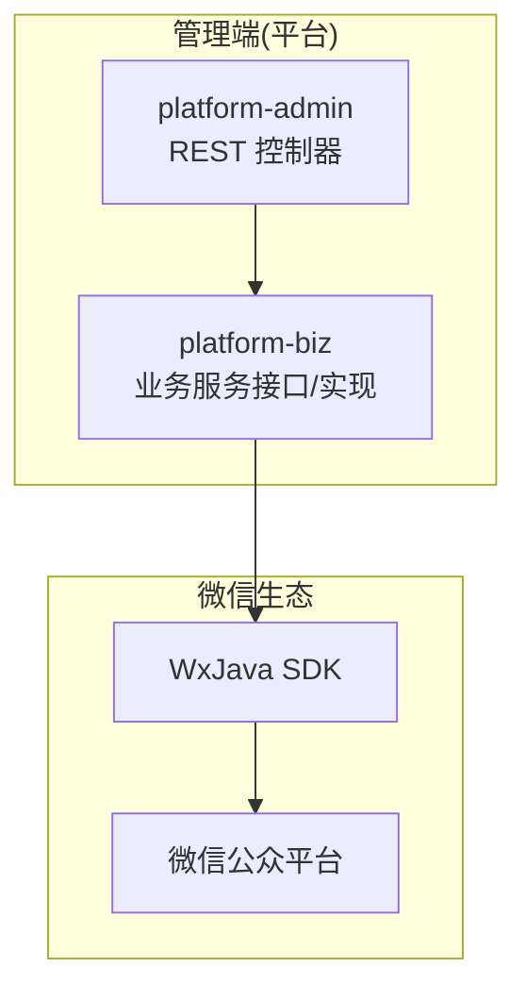
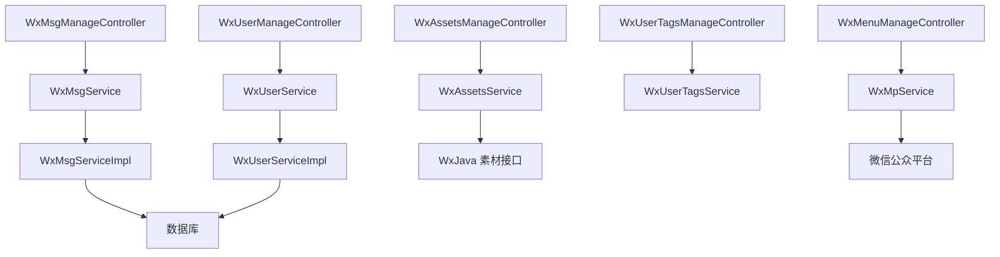
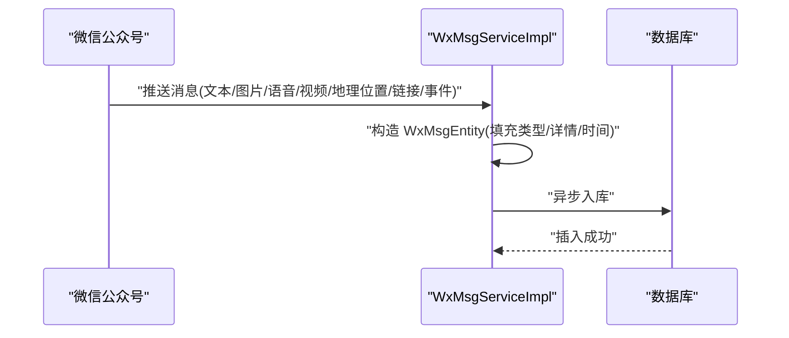
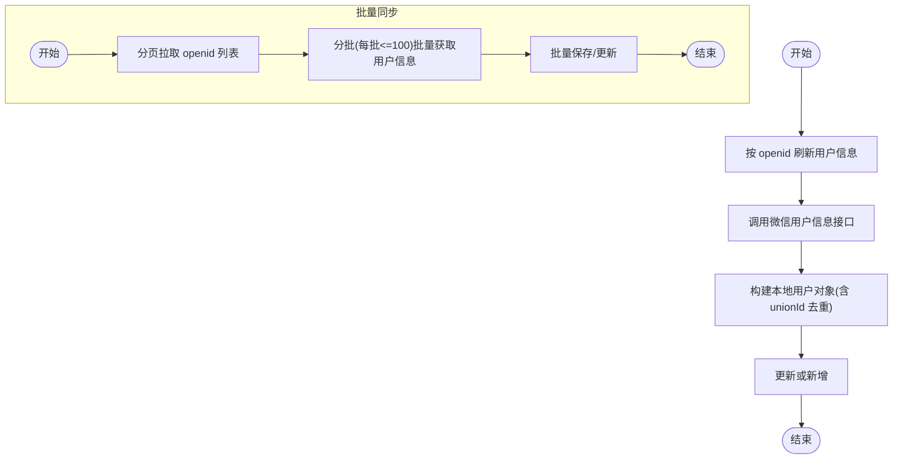
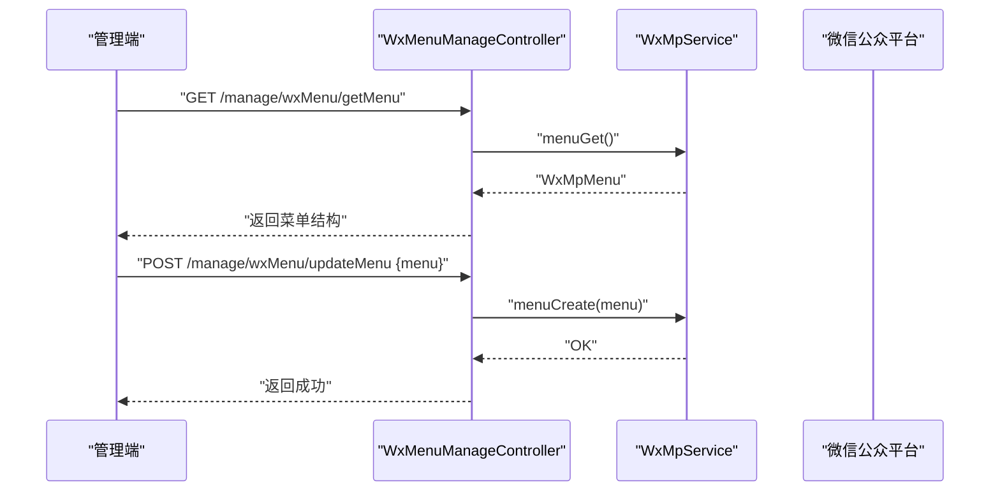
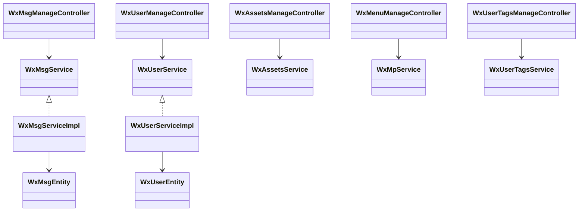

# 微信公众号集成

<cite>
**本文引用的文件**
- [README.md](file://README.md)
- [WxUserManageController.java](file://platform-admin/src/main/java/com/platform/modules/wx/controller/WxUserManageController.java)
- [WxMsgManageController.java](file://platform-admin/src/main/java/com/platform/modules/wx/controller/WxMsgManageController.java)
- [WxMenuManageController.java](file://platform-admin/src/main/java/com/platform/modules/wx/controller/WxMenuManageController.java)
- [WxUserTagsManageController.java](file://platform-admin/src/main/java/com/platform/modules/wx/controller/WxUserTagsManageController.java)
- [WxAssetsManageController.java](file://platform-admin/src/main/java/com/platform/modules/wx/controller/WxAssetsManageController.java)
- [WxUserService.java](file://platform-biz/src/main/java/com/platform/modules/wx/service/WxUserService.java)
- [WxMsgService.java](file://platform-biz/src/main/java/com/platform/modules/wx/service/WxMsgService.java)
- [WxAssetsService.java](file://platform-biz/src/main/java/com/platform/modules/wx/service/WxAssetsService.java)
- [WxUserEntity.java](file://platform-biz/src/main/java/com/platform/modules/wx/entity/WxUserEntity.java)
- [WxMsgEntity.java](file://platform-biz/src/main/java/com/platform/modules/wx/entity/WxMsgEntity.java)
- [WxUserServiceImpl.java](file://platform-biz/src/main/java/com/platform/modules/wx/service/impl/WxUserServiceImpl.java)
- [WxMsgServiceImpl.java](file://platform-biz/src/main/java/com/platform/modules/wx/service/impl/WxMsgServiceImpl.java)
</cite>

## 目录
1. [简介](#简介)
2. [项目结构](#项目结构)
3. [核心组件](#核心组件)
4. [架构总览](#架构总览)
5. [详细组件分析](#详细组件分析)
6. [依赖关系分析](#依赖关系分析)
7. [性能考量](#性能考量)
8. [故障排查指南](#故障排查指南)
9. [结论](#结论)
10. [附录](#附录)

## 简介
本文件面向开发者，系统性梳理平台与微信公众号的对接实现，覆盖消息管理、用户管理、菜单配置、素材管理等能力，并给出消息处理流程、用户交互设计与最佳实践建议。项目基于 Spring Boot 与 WxJava（微信公众号 Java SDK）实现，后端提供 REST 接口，前端提供管理界面。

## 项目结构
- 平台由多模块组成，微信公众号相关能力集中在 platform-admin（管理接口服务）与 platform-biz（业务代码）中：
  - platform-admin 提供微信公众号相关的管理控制器（用户、消息、菜单、标签、素材），并负责权限控制与接口文档标注。
  - platform-biz 提供微信公众号业务服务接口与实现（用户、消息、素材），封装与微信服务器的交互细节。
- README 对整体架构、技术栈、安装部署与使用做了概览说明。

**章节来源**
- [README.md:59-101](file://README.md#L59-L101)

## 核心组件
- 消息管理
  - 控制器：WxMsgManageController 提供消息列表、详情、回复、删除等接口。
  - 服务：WxMsgService 定义消息分页查询与异步入库；WxMsgServiceImpl 实现分页查询与异步入库。
  - 数据模型：WxMsgEntity 封装消息方向、类型、详情（JSON）与创建时间。
- 用户管理
  - 控制器：WxUserManageController 提供用户分页列表、按 ID 批量查询、详情查询。
  - 服务：WxUserService 定义分页查询、刷新用户信息、异步批量刷新、新增或更新、取消关注、同步用户列表；WxUserServiceImpl 实现具体逻辑，含分页条件、异步任务、批量拉取与保存。
  - 数据模型：WxUserEntity 映射 WX_USER 表，包含 openid、unionId、昵称、性别、城市、标签、关注状态、订阅时间等字段。
- 菜单配置
  - 控制器：WxMenuManageController 提供获取菜单、创建/更新菜单、网络检测接口。
  - 依赖：WxMpService（WxJava 提供）。
- 用户标签
  - 控制器：WxUserTagsManageController 提供标签列表、新增/修改、删除、批量打标/去标。
  - 依赖：WxUserTagsService（WxJava 提供）。
- 素材管理
  - 控制器：WxAssetsManageController 提供素材总数、图文详情、分页获取非图文/图文素材、上传永久素材、删除素材。
  - 服务：WxAssetsService 定义素材相关接口；实现与微信素材 API 交互。

**章节来源**
- [WxMsgManageController.java:43-101](file://platform-admin/src/main/java/com/platform/modules/wx/controller/WxMsgManageController.java#L43-L101)
- [WxMsgService.java:27-50](file://platform-biz/src/main/java/com/platform/modules/wx/service/WxMsgService.java#L27-L50)
- [WxMsgServiceImpl.java:39-69](file://platform-biz/src/main/java/com/platform/modules/wx/service/impl/WxMsgServiceImpl.java#L39-L69)
- [WxMsgEntity.java:33-126](file://platform-biz/src/main/java/com/platform/modules/wx/entity/WxMsgEntity.java#L33-L126)
- [WxUserManageController.java:40-81](file://platform-admin/src/main/java/com/platform/modules/wx/controller/WxUserManageController.java#L40-L81)
- [WxUserService.java:27-73](file://platform-biz/src/main/java/com/platform/modules/wx/service/WxUserService.java#L27-L73)
- [WxUserServiceImpl.java:52-220](file://platform-biz/src/main/java/com/platform/modules/wx/service/impl/WxUserServiceImpl.java#L52-L220)
- [WxUserEntity.java:37-171](file://platform-biz/src/main/java/com/platform/modules/wx/entity/WxUserEntity.java#L37-L171)
- [WxMenuManageController.java:34-91](file://platform-admin/src/main/java/com/platform/modules/wx/controller/WxMenuManageController.java#L34-L91)
- [WxUserTagsManageController.java:35-112](file://platform-admin/src/main/java/com/platform/modules/wx/controller/WxUserTagsManageController.java#L35-L112)
- [WxAssetsManageController.java:36-148](file://platform-admin/src/main/java/com/platform/modules/wx/controller/WxAssetsManageController.java#L36-L148)
- [WxAssetsService.java:27-89](file://platform-biz/src/main/java/com/platform/modules/wx/service/WxAssetsService.java#L27-L89)

## 架构总览
下图展示了微信公众号对接的整体交互：管理端控制器调用业务服务，业务服务通过 WxJava SDK 与微信公众平台交互，实现消息、用户、菜单、标签、素材等能力。

**图表来源**
- [WxMsgManageController.java:43-101](file://platform-admin/src/main/java/com/platform/modules/wx/controller/WxMsgManageController.java#L43-L101)
- [WxUserManageController.java:40-81](file://platform-admin/src/main/java/com/platform/modules/wx/controller/WxUserManageController.java#L40-L81)
- [WxMenuManageController.java:34-91](file://platform-admin/src/main/java/com/platform/modules/wx/controller/WxMenuManageController.java#L34-L91)
- [WxUserTagsManageController.java:35-112](file://platform-admin/src/main/java/com/platform/modules/wx/controller/WxUserTagsManageController.java#L35-L112)
- [WxAssetsManageController.java:36-148](file://platform-admin/src/main/java/com/platform/modules/wx/controller/WxAssetsManageController.java#L36-L148)
- [WxMsgServiceImpl.java:39-69](file://platform-biz/src/main/java/com/platform/modules/wx/service/impl/WxMsgServiceImpl.java#L39-L69)
- [WxUserServiceImpl.java:52-220](file://platform-biz/src/main/java/com/platform/modules/wx/service/impl/WxUserServiceImpl.java#L52-L220)

## 详细组件分析

### 消息管理
- 功能点
  - 分页查询：按消息类型、开始时间、openid 过滤。
  - 异步入库：接收到的消息异步写入数据库，避免阻塞请求处理。
  - 回复消息：管理员可选择回复类型与内容，触发业务侧回复逻辑。
  - 删除消息：支持批量删除历史消息记录。
- 数据模型
  - WxMsgEntity 统一封装消息方向（入/出）、消息类型、详情（JSON 字段）、创建时间。
- 流程示意

**图表来源**
- [WxMsgEntity.java:74-126](file://platform-biz/src/main/java/com/platform/modules/wx/entity/WxMsgEntity.java#L74-L126)
- [WxMsgServiceImpl.java:63-69](file://platform-biz/src/main/java/com/platform/modules/wx/service/impl/WxMsgServiceImpl.java#L63-L69)

**章节来源**
- [WxMsgManageController.java:54-100](file://platform-admin/src/main/java/com/platform/modules/wx/controller/WxMsgManageController.java#L54-L100)
- [WxMsgService.java:33-50](file://platform-biz/src/main/java/com/platform/modules/wx/service/WxMsgService.java#L33-L50)
- [WxMsgServiceImpl.java:42-69](file://platform-biz/src/main/java/com/platform/modules/wx/service/impl/WxMsgServiceImpl.java#L42-L69)
- [WxMsgEntity.java:42-126](file://platform-biz/src/main/java/com/platform/modules/wx/entity/WxMsgEntity.java#L42-L126)

### 用户管理
- 功能点
  - 分页查询：支持按 openid、昵称、城市、扫码场景、关注来源、标签等条件过滤。
  - 刷新用户信息：按 openid 拉取微信用户资料，合并更新本地用户表，支持 unionId 去重。
  - 异步批量刷新：提交多个 openid 的刷新任务，提升大批量粉丝同步效率。
  - 同步用户列表：分页拉取公众号关注者 openid 列表，再分批批量获取用户信息并入库。
  - 取消关注：更新用户关注状态。
- 关键流程

**图表来源**
- [WxUserServiceImpl.java:88-113](file://platform-biz/src/main/java/com/platform/modules/wx/service/impl/WxUserServiceImpl.java#L88-L113)
- [WxUserServiceImpl.java:152-180](file://platform-biz/src/main/java/com/platform/modules/wx/service/impl/WxUserServiceImpl.java#L152-L180)
- [WxUserServiceImpl.java:187-218](file://platform-biz/src/main/java/com/platform/modules/wx/service/impl/WxUserServiceImpl.java#L187-L218)

**章节来源**
- [WxUserManageController.java:50-81](file://platform-admin/src/main/java/com/platform/modules/wx/controller/WxUserManageController.java#L50-L81)
- [WxUserService.java:30-73](file://platform-biz/src/main/java/com/platform/modules/wx/service/WxUserService.java#L30-L73)
- [WxUserServiceImpl.java:62-218](file://platform-biz/src/main/java/com/platform/modules/wx/service/impl/WxUserServiceImpl.java#L62-L218)
- [WxUserEntity.java:42-171](file://platform-biz/src/main/java/com/platform/modules/wx/entity/WxUserEntity.java#L42-L171)

### 菜单配置管理
- 功能点
  - 获取菜单：调用 WxJava 的菜单查询接口。
  - 更新菜单：提交自定义菜单结构，创建或覆盖现有菜单。
  - 网络检测：对开发者服务器域名进行 DNS 解析与 ping 检测，辅助排查回调连通性问题。
- 设计要点
  - 菜单结构遵循微信官方规范，支持多级菜单与事件按钮。
  - 网络检测接口便于快速定位域名解析与网络延迟问题。

**图表来源**
- [WxMenuManageController.java:52-69](file://platform-admin/src/main/java/com/platform/modules/wx/controller/WxMenuManageController.java#L52-L69)

**章节来源**
- [WxMenuManageController.java:34-91](file://platform-admin/src/main/java/com/platform/modules/wx/controller/WxMenuManageController.java#L34-L91)

### 用户标签管理
- 功能点
  - 查询标签：获取公众号已有的标签列表。
  - 新增/修改标签：支持创建新标签或更新已有标签名称。
  - 删除标签：删除指定标签（注意删除后需手动移除用户身上的该标签）。
  - 批量打标/去标：对指定标签与用户集合执行批量操作。
- 设计要点
  - 标签 ID 与用户 openid 列表通过 WxJava 标签服务接口完成同步。

**章节来源**
- [WxUserTagsManageController.java:48-112](file://platform-admin/src/main/java/com/platform/modules/wx/controller/WxUserTagsManageController.java#L48-L112)

### 素材管理
- 功能点
  - 素材统计：获取各类素材总数。
  - 图文详情：获取指定图文素材的详细内容。
  - 分页获取素材：支持按类型分页获取非图文素材，以及分页获取图文素材列表。
  - 上传素材：支持上传图片、音频、视频、文件等永久素材，返回媒体 ID。
  - 删除素材：根据媒体 ID 删除素材。
- 设计要点
  - 采用 WxJava 的素材接口，统一处理微信素材 API 的响应与异常。

**章节来源**
- [WxAssetsManageController.java:57-148](file://platform-admin/src/main/java/com/platform/modules/wx/controller/WxAssetsManageController.java#L57-L148)
- [WxAssetsService.java:31-89](file://platform-biz/src/main/java/com/platform/modules/wx/service/WxAssetsService.java#L31-L89)

## 依赖关系分析
- 控制器依赖业务服务接口，业务服务实现依赖 WxJava SDK 与数据库。
- 控制器层承担鉴权与参数校验，业务层承担复杂流程编排与幂等处理。
- 数据模型通过 MyBatis-Plus 映射数据库表，JSON 字段使用类型处理器持久化。

**图表来源**
- [WxMsgManageController.java:43-101](file://platform-admin/src/main/java/com/platform/modules/wx/controller/WxMsgManageController.java#L43-L101)
- [WxUserManageController.java:40-81](file://platform-admin/src/main/java/com/platform/modules/wx/controller/WxUserManageController.java#L40-L81)
- [WxMenuManageController.java:34-91](file://platform-admin/src/main/java/com/platform/modules/wx/controller/WxMenuManageController.java#L34-L91)
- [WxUserTagsManageController.java:35-112](file://platform-admin/src/main/java/com/platform/modules/wx/controller/WxUserTagsManageController.java#L35-L112)
- [WxAssetsManageController.java:36-148](file://platform-admin/src/main/java/com/platform/modules/wx/controller/WxAssetsManageController.java#L36-L148)
- [WxMsgServiceImpl.java:39-69](file://platform-biz/src/main/java/com/platform/modules/wx/service/impl/WxMsgServiceImpl.java#L39-L69)
- [WxUserServiceImpl.java:52-220](file://platform-biz/src/main/java/com/platform/modules/wx/service/impl/WxUserServiceImpl.java#L52-L220)
- [WxMsgEntity.java:42-126](file://platform-biz/src/main/java/com/platform/modules/wx/entity/WxMsgEntity.java#L42-L126)
- [WxUserEntity.java:42-171](file://platform-biz/src/main/java/com/platform/modules/wx/entity/WxUserEntity.java#L42-L171)

## 性能考量
- 异步处理
  - 消息入库与用户信息刷新均采用异步方式，降低请求延迟。
- 分批与并发
  - 用户同步分页拉取 openid，再分批批量获取用户信息，结合线程池并发处理，显著提升大批量粉丝同步效率。
- 缓存与幂等
  - 建议在高频读取场景引入缓存（如 Redis）存储用户基础信息与标签列表，减少重复调用微信接口。
  - 对“更新或新增”、“批量打标/去标”等操作应保证幂等，避免重复写入。
- 数据库优化
  - 对常用查询条件（如 openid、tagid_list、subscribe_time）建立索引，提升分页查询性能。
- 网络与限流
  - 调用微信接口需考虑频率限制，必要时增加退避与重试策略。

## 故障排查指南
- 消息未入库
  - 检查消息控制器是否正确构造 WxMsgEntity 并调用异步入库方法。
  - 核对数据库连接与事务配置，确认 JSON 字段类型处理器生效。
- 用户信息不同步
  - 确认同步任务未重复执行（内部有互斥标记）。
  - 检查 openid 列表拉取与分批获取用户信息的循环逻辑。
  - 关注异常日志，确保批量保存/更新成功。
- 菜单更新失败
  - 校验菜单结构是否符合微信规范。
  - 使用网络检测接口排查域名解析与连通性问题。
- 素材上传/删除异常
  - 校验文件类型与大小是否满足微信素材要求。
  - 捕获并记录 WxJava 抛出的异常，核对媒体 ID 与权限。

**章节来源**
- [WxMsgServiceImpl.java:63-69](file://platform-biz/src/main/java/com/platform/modules/wx/service/impl/WxMsgServiceImpl.java#L63-L69)
- [WxUserServiceImpl.java:152-180](file://platform-biz/src/main/java/com/platform/modules/wx/service/impl/WxUserServiceImpl.java#L152-L180)
- [WxMenuManageController.java:78-89](file://platform-admin/src/main/java/com/platform/modules/wx/controller/WxMenuManageController.java#L78-L89)
- [WxAssetsManageController.java:120-146](file://platform-admin/src/main/java/com/platform/modules/wx/controller/WxAssetsManageController.java#L120-L146)

## 结论
本项目以清晰的分层架构实现了微信公众号的核心能力：消息收发、用户画像、菜单与标签、素材管理。通过异步与分批策略有效提升了性能，配合完善的控制器与服务接口，便于二次开发与扩展。建议在生产环境中进一步完善缓存、限流与监控体系，持续优化用户体验与系统稳定性。

## 附录
- 快速上手
  - 配置微信公众号 AppId/AppSecret、Token、EncodingAESKey。
  - 启动后端服务与前端管理界面，进入对应模块进行配置与测试。
- 接口清单（示例）
  - 消息管理：分页查询、回复、删除。
  - 用户管理：分页查询、详情、批量查询、同步用户列表。
  - 菜单管理：获取菜单、更新菜单、网络检测。
  - 标签管理：查询、新增/修改、删除、批量打标/去标。
  - 素材管理：素材统计、图文详情、分页获取、上传、删除。